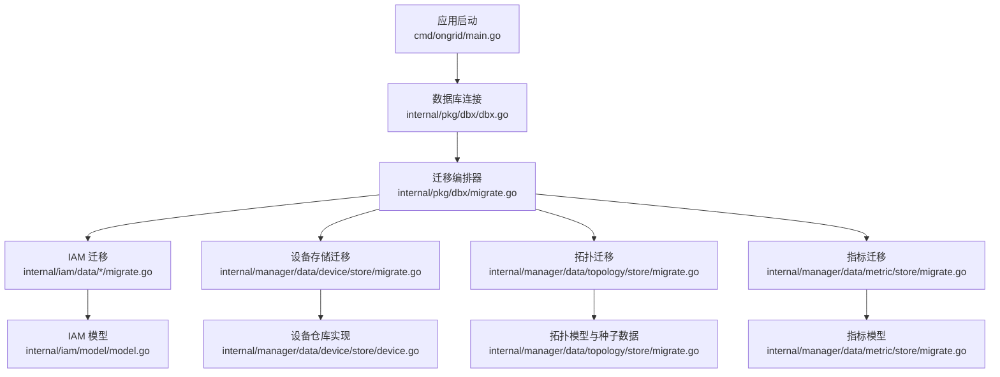
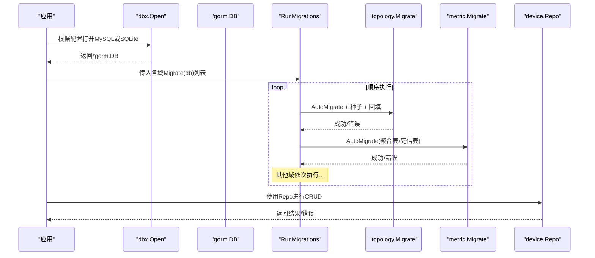
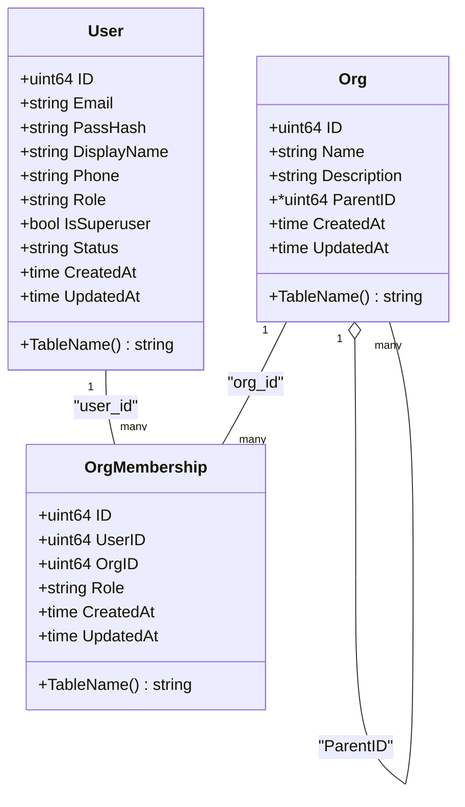
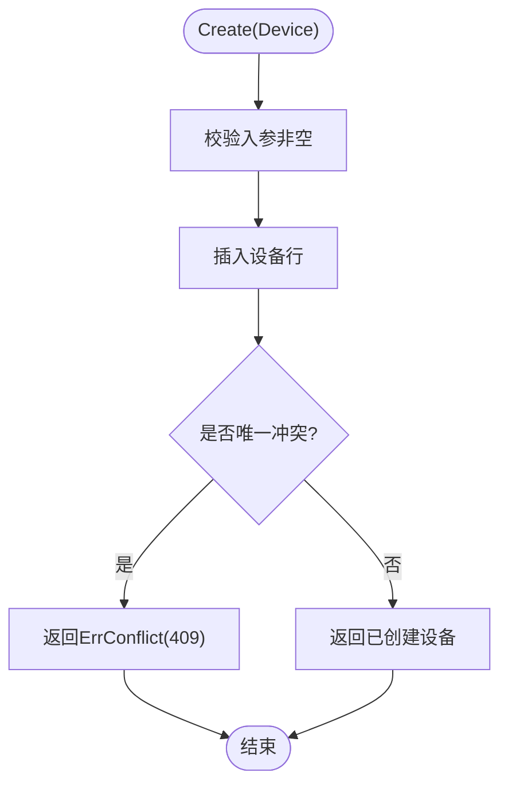
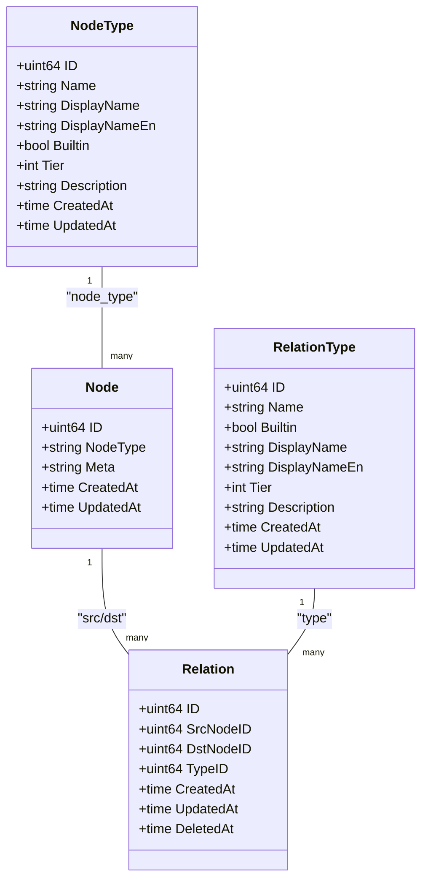
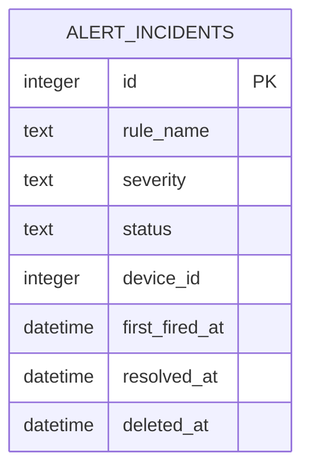
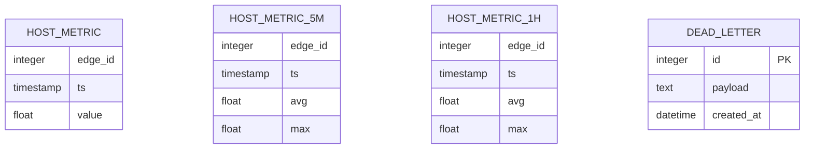
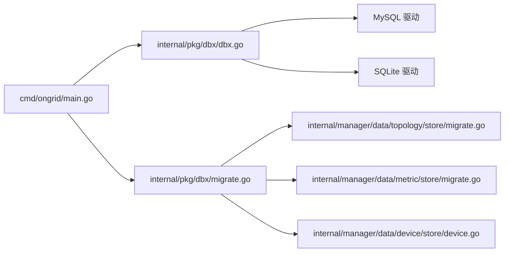

# 关系数据库设计

<cite>
**本文引用的文件**   
- [internal/pkg/dbx/dbx.go](file://internal/pkg/dbx/dbx.go)
- [internal/pkg/dbx/migrate.go](file://internal/pkg/dbx/migrate.go)
- [cmd/ongrid/main.go](file://cmd/ongrid/main.go)
- [internal/iam/model/model.go](file://internal/iam/model/model.go)
- [internal/manager/data/device/store/device.go](file://internal/manager/data/device/store/device.go)
- [internal/manager/data/topology/store/migrate.go](file://internal/manager/data/topology/store/migrate.go)
- [internal/manager/data/metric/store/migrate.go](file://internal/manager/data/metric/store/migrate.go)
- [internal/manager/data/report/store/facts_test.go](file://internal/manager/data/report/store/facts_test.go)
</cite>

## 目录
1. [简介](#简介)
2. [项目结构](#项目结构)
3. [核心组件](#核心组件)
4. [架构总览](#架构总览)
5. [详细组件分析](#详细组件分析)
6. [依赖分析](#依赖分析)
7. [性能考虑](#性能考虑)
8. [故障排查指南](#故障排查指南)
9. [结论](#结论)
10. [附录](#附录)

## 简介
本文件面向数据库管理员与后端开发者，系统化梳理 ongrid 的关系型数据库设计。内容覆盖 MySQL 与 SQLite 双后端、GORM 模型映射与 AutoMigrate 机制、数据迁移版本管理与向后兼容策略、索引与约束设计、查询优化建议、运维监控指标与维护操作等。重点围绕设备管理、用户认证、告警规则、拓扑关系等核心业务域进行说明。

## 项目结构
数据库相关代码采用“按领域分层”的组织方式：
- 公共基础设施：dbx 提供统一数据库连接、SQLite 参数配置、迁移编排与软删除辅助能力。
- 领域模型：各业务域在 model 包中定义 GORM 实体（如 IAM 的 users/orgs/org_memberships）。
- 数据层 store：每个领域提供 migrate.go 注册 AutoMigrate 表，以及 repo 实现读写逻辑。
- 启动入口：主进程在启动时打开数据库并顺序执行所有领域的 Migrate(db)。

图表来源
- [cmd/ongrid/main.go:243-280](file://cmd/ongrid/main.go#L243-L280)
- [internal/pkg/dbx/dbx.go:34-128](file://internal/pkg/dbx/dbx.go#L34-L128)
- [internal/pkg/dbx/migrate.go:12-46](file://internal/pkg/dbx/migrate.go#L12-L46)
- [internal/manager/data/topology/store/migrate.go:16-39](file://internal/manager/data/topology/store/migrate.go#L16-L39)
- [internal/manager/data/metric/store/migrate.go:9-20](file://internal/manager/data/metric/store/migrate.go#L9-L20)
- [internal/manager/data/device/store/device.go:1-52](file://internal/manager/data/device/store/device.go#L1-L52)
- [internal/iam/model/model.go:80-140](file://internal/iam/model/model.go#L80-L140)

章节来源
- [cmd/ongrid/main.go:243-280](file://cmd/ongrid/main.go#L243-L280)
- [internal/pkg/dbx/dbx.go:34-128](file://internal/pkg/dbx/dbx.go#L34-L128)
- [internal/pkg/dbx/migrate.go:12-46](file://internal/pkg/dbx/migrate.go#L12-L46)

## 核心组件
- 数据库连接与方言选择
  - 支持 MySQL（默认）与 SQLite（可选），通过 Open(cfg, log) 统一接入。
  - SQLite 开启 WAL、busy_timeout、foreign_keys 等 pragmas，提升并发与一致性。
  - MySQL 在 Open 时 Ping 验证连通性，快速失败。
- 迁移编排
  - RunMigrations 顺序执行各领域的 Migrate(db)，记录耗时，首个错误即中止。
  - 各领域 migrate.go 负责 AutoMigrate 注册表结构、种子数据与增量修复。
- 领域模型
  - IAM 提供用户、组织、成员关系的 GORM 模型，包含角色常量与校验函数。
  - 其他领域（设备、拓扑、指标等）在各自 data/*/store/migrate.go 中声明表结构。

章节来源
- [internal/pkg/dbx/dbx.go:34-128](file://internal/pkg/dbx/dbx.go#L34-L128)
- [internal/pkg/dbx/migrate.go:12-46](file://internal/pkg/dbx/migrate.go#L12-L46)
- [internal/iam/model/model.go:80-140](file://internal/iam/model/model.go#L80-L140)

## 架构总览
下图展示从应用启动到数据库建表、种子数据填充的整体流程，体现多领域迁移的编排与幂等性。

图表来源
- [cmd/ongrid/main.go:243-280](file://cmd/ongrid/main.go#L243-L280)
- [internal/pkg/dbx/dbx.go:34-128](file://internal/pkg/dbx/dbx.go#L34-L128)
- [internal/pkg/dbx/migrate.go:12-46](file://internal/pkg/dbx/migrate.go#L12-L46)
- [internal/manager/data/topology/store/migrate.go:16-39](file://internal/manager/data/topology/store/migrate.go#L16-L39)
- [internal/manager/data/metric/store/migrate.go:9-20](file://internal/manager/data/metric/store/migrate.go#L9-L20)
- [internal/manager/data/device/store/device.go:1-52](file://internal/manager/data/device/store/device.go#L1-L52)

## 详细组件分析

### 用户认证（IAM）
- 表与实体
  - users：登录身份，含邮箱唯一索引、密码哈希、系统角色、超级用户标记、状态等。
  - orgs：组织单元，名称全局唯一，支持父组织引用（biz 层保证无环）。
  - org_memberships：用户-组织多对多关系，带角色（org_admin/member/viewer），复合唯一索引保护同一用户在某组织的单一角色。
- 字段与约束要点
  - 主键：自增 uint64。
  - 唯一索引：users.email、orgs.name、org_memberships(user_id, org_id)。
  - 检查约束：role/status 枚举值限制。
  - 外键：组织层级由 biz 层维护完整性（避免跨方言 FK 漂移问题）。
- 索引策略
  - 高频查询列加索引：users.email、orgs.parent_id、org_memberships.user_id/org_id。
- 兼容性
  - 保留 legacy Role 字段以兼容旧 JWT；新权限决策走 memberships + casbin。

图表来源
- [internal/iam/model/model.go:80-140](file://internal/iam/model/model.go#L80-L140)

章节来源
- [internal/iam/model/model.go:80-140](file://internal/iam/model/model.go#L80-L140)

### 设备管理
- 关键行为
  - 创建设备时基于指纹（fingerprint）唯一性冲突检测，统一封装为 ErrConflict，屏蔽 MySQL/SQLite 差异。
- 索引与约束
  - devices.fingerprint 具备唯一索引，防止重复注册。
- 软删除
  - 结合 dbx 软删除工具，deleted_at 参与查询过滤。

图表来源
- [internal/manager/data/device/store/device.go:32-52](file://internal/manager/data/device/store/device.go#L32-L52)

章节来源
- [internal/manager/data/device/store/device.go:1-52](file://internal/manager/data/device/store/device.go#L1-L52)

### 拓扑关系
- 表族
  - node、relation、relation_type、node_type。
- 迁移与种子
  - AutoMigrate 注册上述四张表。
  - 内置 relation_type 种子（如 member_of、depends_on、deployed_on、replicates_to、monitors、routes_to）通过 Upsert 幂等写入。
  - 内置 node_type 种子同样幂等写入。
  - 回补逻辑：将尚未关联到 node 的设备行补齐节点。
- 索引与约束
  - 关系表通常对 (src, dst, type) 建立联合索引以提升拓扑遍历性能。
  - 删除标记迁移：确保 relation 表具备 deleted_at 标记及相应索引。

图表来源
- [internal/manager/data/topology/store/migrate.go:16-39](file://internal/manager/data/topology/store/migrate.go#L16-L39)

章节来源
- [internal/manager/data/topology/store/migrate.go:16-39](file://internal/manager/data/topology/store/migrate.go#L16-L39)

### 告警规则与事件
- 表族（依据测试与事实采集侧推断）
  - alert_incidents：告警事件，包含规则名、严重级别、状态、设备标识、首次触发时间、解决时间、软删除标记等。
- 查询与事实采集
  - 报告/事实采集模块直接按表名读取告警表，用于生成平台级统计与报表。
- 索引建议
  - 对 rule_name、severity、status、device_id、first_fired_at 建立合适索引，支撑筛选与排序。

图表来源
- [internal/manager/data/report/store/facts_test.go:27-38](file://internal/manager/data/report/store/facts_test.go#L27-L38)

章节来源
- [internal/manager/data/report/store/facts_test.go:15-46](file://internal/manager/data/report/store/facts_test.go#L15-L46)

### 指标时序数据
- 表族
  - host_metric：原始样本。
  - host_metric_5m / host_metric_1h：多级聚合表，复合主键 (edge_id, ts) 表达优先级顺序。
  - dead_letter：异常落盘队列。
- 迁移
  - 通过 AutoMigrate 一次性注册，复合主键通过 tag 控制 MySQL/SQLite 的列序。

图表来源
- [internal/manager/data/metric/store/migrate.go:9-20](file://internal/manager/data/metric/store/migrate.go#L9-L20)

章节来源
- [internal/manager/data/metric/store/migrate.go:9-20](file://internal/manager/data/metric/store/migrate.go#L9-L20)

## 依赖分析
- 启动期依赖
  - cmd/ongrid/main.go 调用 dbx.Open 后，集中执行各域 Migrate(db)。
- 运行时依赖
  - 各 store 依赖 gorm.DB 实例，屏蔽底层方言差异。
- 外部依赖
  - MySQL 驱动与 SQLite 驱动通过 GORM 注入。
  - SQLite 启用 WAL 与 foreign_keys，保障并发与一致性。

图表来源
- [cmd/ongrid/main.go:243-280](file://cmd/ongrid/main.go#L243-L280)
- [internal/pkg/dbx/dbx.go:34-128](file://internal/pkg/dbx/dbx.go#L34-L128)
- [internal/pkg/dbx/migrate.go:12-46](file://internal/pkg/dbx/migrate.go#L12-L46)
- [internal/manager/data/topology/store/migrate.go:16-39](file://internal/manager/data/topology/store/migrate.go#L16-L39)
- [internal/manager/data/metric/store/migrate.go:9-20](file://internal/manager/data/metric/store/migrate.go#L9-L20)
- [internal/manager/data/device/store/device.go:1-52](file://internal/manager/data/device/store/device.go#L1-L52)

章节来源
- [cmd/ongrid/main.go:243-280](file://cmd/ongrid/main.go#L243-L280)
- [internal/pkg/dbx/dbx.go:34-128](file://internal/pkg/dbx/dbx.go#L34-L128)
- [internal/pkg/dbx/migrate.go:12-46](file://internal/pkg/dbx/migrate.go#L12-L46)

## 性能考虑
- 连接与并发
  - MySQL：合理设置连接池大小、超时与重试；Open 时 Ping 可提前暴露网络/鉴权问题。
  - SQLite：WAL 模式允许多读单写；busy_timeout 降低忙等待失败概率；foreign_keys 开启以保证一致性。
- 索引策略
  - 高频过滤/排序列建立索引：users.email、orgs.parent_id、org_memberships(user_id, org_id)、alert_incidents(rule_name, severity, status, device_id, first_fired_at)、relation(src, dst, type)。
  - 指标聚合表复合主键 (edge_id, ts) 利于时间序列扫描。
- 查询优化
  - 避免 SELECT *，仅拉取必要列；分页查询使用游标或范围条件替代 OFFSET 深翻页。
  - 复杂 JOIN 尽量下推过滤条件至子查询，减少中间结果集。
  - 对大表定期 ANALYZE（MySQL）或 VACUUM/PRAGMA optimize（SQLite）。
- 写入优化
  - 批量写入使用事务与批量插入；避免热点行频繁更新。
  - 指标写入优先落原始表，定时任务聚合至 5m/1h 表。

[本节为通用指导，不直接分析具体文件]

## 故障排查指南
- 启动阶段
  - 若 Open 失败：检查 MySQL DSN 与网络可达性；SQLite 路径是否存在且可写。
  - 迁移失败：查看 RunMigrations 日志中的 index 与 elapsed，定位具体域迁移报错。
- 唯一冲突
  - 设备指纹冲突会返回 ErrConflict，对应 HTTP 409；确认上报端指纹去重策略。
- 软删除
  - 涉及 deleted_at 的查询需确保使用 dbx 提供的软删除封装，避免读到已删除数据。
- 索引缺失
  - 慢查询可通过 EXPLAIN 分析；必要时补充联合索引或调整查询谓词顺序。

章节来源
- [internal/pkg/dbx/dbx.go:34-128](file://internal/pkg/dbx/dbx.go#L34-L128)
- [internal/pkg/dbx/migrate.go:12-46](file://internal/pkg/dbx/migrate.go#L12-L46)
- [internal/manager/data/device/store/device.go:32-52](file://internal/manager/data/device/store/device.go#L32-L52)

## 结论
本项目以 GORM 为核心，通过统一的 dbx 抽象与分域迁移编排，实现了 MySQL 与 SQLite 的双后端支持与平滑演进。模型设计强调幂等迁移、软删除与合理的索引策略，兼顾了可读性与可扩展性。建议在上线前完成索引评审与慢查询基线收集，并在变更中遵循“先扩后缩、先灰度后全量”的迁移原则，确保向后兼容与稳定性。

[本节为总结性内容，不直接分析具体文件]

## 附录

### 迁移版本管理与向后兼容
- 幂等性
  - 各域 Migrate(db) 应保证多次运行安全；种子数据使用 Upsert 语义。
- 增量修复
  - 针对历史表结构缺陷（如缺失删除标记、索引），在迁移中提供回补逻辑。
- 兼容性
  - 保留遗留字段（如 users.role）以兼容旧客户端/JWT；新功能通过新增列/表实现。
- 编排
  - 通过 RunMigrations 顺序执行，首个错误即中止，便于快速定位。

章节来源
- [internal/pkg/dbx/migrate.go:12-46](file://internal/pkg/dbx/migrate.go#L12-L46)
- [internal/manager/data/topology/store/migrate.go:16-39](file://internal/manager/data/topology/store/migrate.go#L16-L39)
- [internal/iam/model/model.go:80-140](file://internal/iam/model/model.go#L80-L140)

### 运维监控指标与维护操作
- 连接健康
  - MySQL：Open 时 Ping 失败将导致启动失败；生产环境建议增加健康检查探针。
  - SQLite：关注 WAL 文件大小与锁等待（busy_timeout）。
- 迁移观测
  - 记录每次迁移开始/结束时间与耗时，发现慢迁移及时优化。
- 容量规划
  - 指标表按时间分区或归档；告警事件表定期清理历史数据。
- 备份恢复
  - MySQL：逻辑导出/物理快照结合；SQLite：WAL 模式下需停机或使用专用备份工具。

[本节为通用指导，不直接分析具体文件]