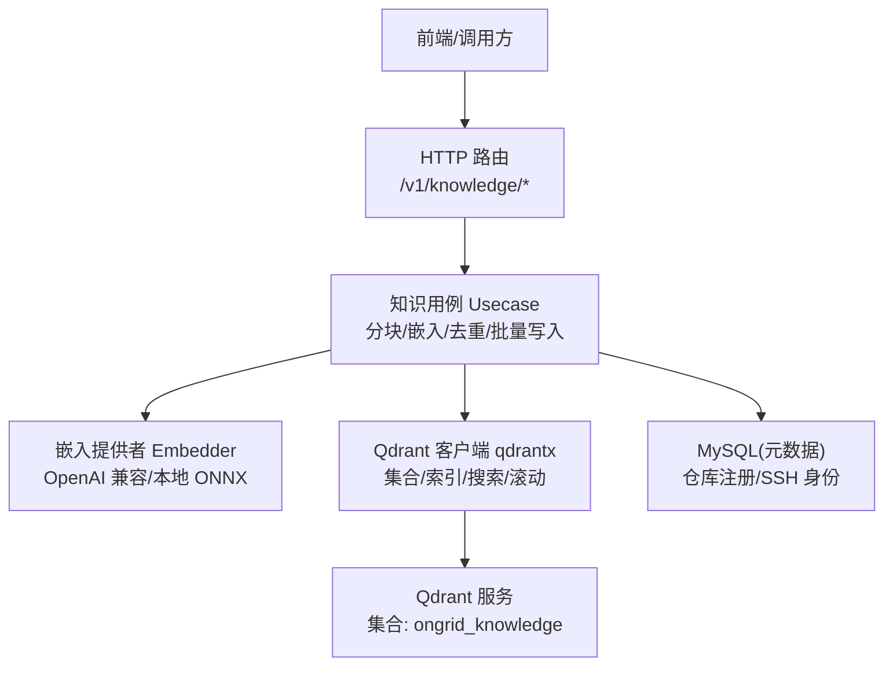
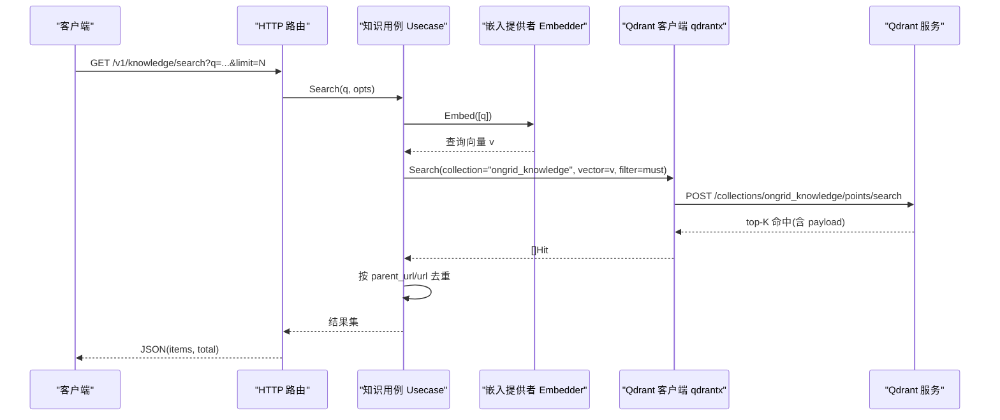
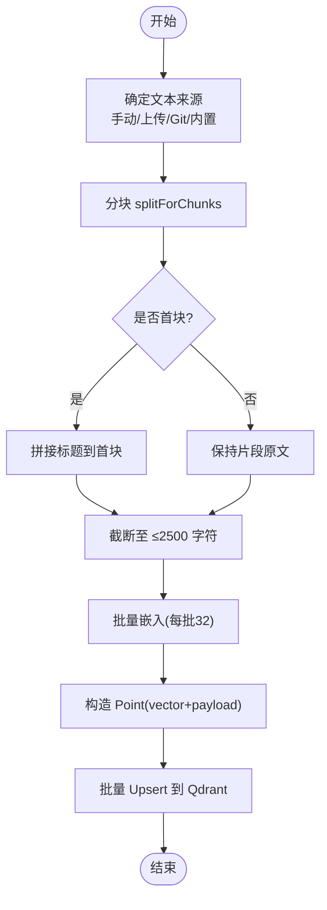
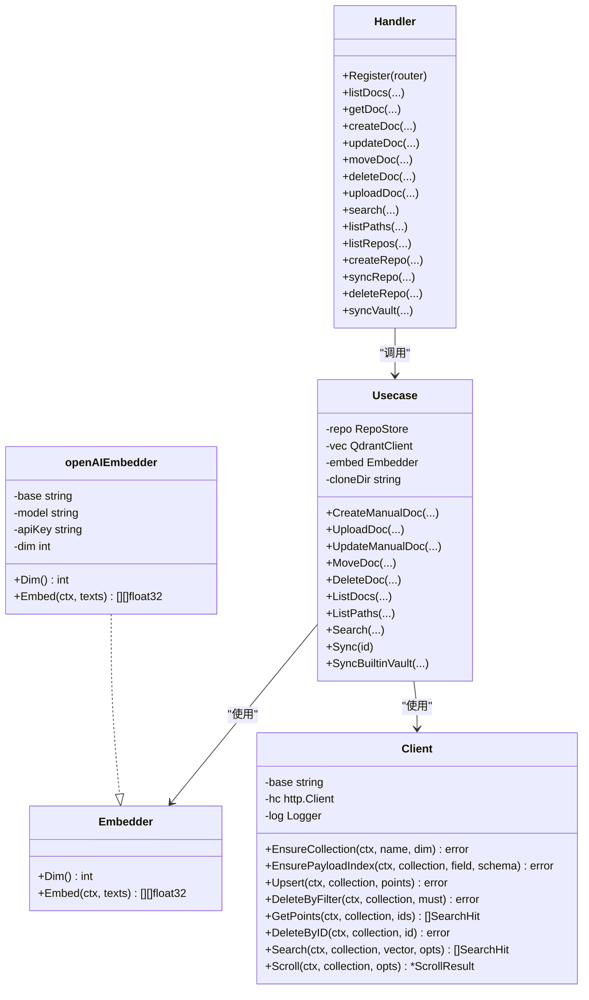
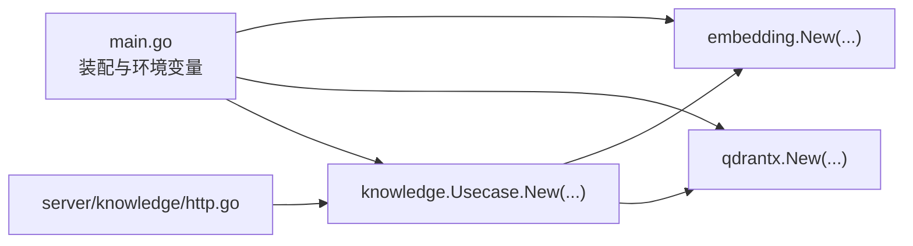

# 向量数据库设计

<cite>
**本文引用的文件**
- [cmd/ongrid/main.go](file://cmd/ongrid/main.go)
- [internal/pkg/embedding/embedding.go](file://internal/pkg/embedding/embedding.go)
- [internal/pkg/qdrantx/client.go](file://internal/pkg/qdrantx/client.go)
- [internal/manager/biz/knowledge/usecase.go](file://internal/manager/biz/knowledge/usecase.go)
- [internal/manager/server/knowledge/http.go](file://internal/manager/server/knowledge/http.go)
</cite>

## 目录
1. [引言](#引言)
2. [项目结构](#项目结构)
3. [核心组件](#核心组件)
4. [架构总览](#架构总览)
5. [详细组件分析](#详细组件分析)
6. [依赖关系分析](#依赖关系分析)
7. [性能考量](#性能考量)
8. [故障排查指南](#故障排查指南)
9. [结论](#结论)
10. [附录](#附录)

## 引言
本文件面向使用 Qdrant 的语义搜索与知识库向量化能力，系统性阐述以下方面：
- 向量索引策略：嵌入向量生成、存储与检索流程
- 知识库内容向量化处理：文本分块、嵌入模型选择、相似度计算
- 集合结构设计：字段与索引、过滤条件构建、批量操作优化
- 生命周期管理：数据写入、更新、删除、重建与监控
- 最佳实践与故障排查：常见问题定位与调优建议

## 项目结构
本项目围绕“知识服务”将向量检索能力落地为可复用的业务层。关键路径如下：
- HTTP 接口层：提供文档增删改查、搜索、仓库同步等 REST API
- 业务用例层：实现分块、嵌入、去重、筛选、批量 upsert 等核心逻辑
- 向量客户端封装：对 Qdrant REST API 的薄封装（集合创建、索引、upsert、search、scroll）
- 嵌入提供者抽象：统一 OpenAI 兼容接口，支持多厂商与本地 ONNX 扩展
- 启动装配：从环境变量注入嵌入模型维度、Qdrant 地址、集合名等

图表来源
- [internal/manager/server/knowledge/http.go:110-137](file://internal/manager/server/knowledge/http.go#L110-L137)
- [internal/manager/biz/knowledge/usecase.go:121-167](file://internal/manager/biz/knowledge/usecase.go#L121-L167)
- [internal/pkg/qdrantx/client.go:48-116](file://internal/pkg/qdrantx/client.go#L48-L116)
- [internal/pkg/embedding/embedding.go:72-85](file://internal/pkg/embedding/embedding.go#L72-L85)

章节来源
- [internal/manager/server/knowledge/http.go:110-137](file://internal/manager/server/knowledge/http.go#L110-L137)
- [internal/manager/biz/knowledge/usecase.go:121-167](file://internal/manager/biz/knowledge/usecase.go#L121-L167)
- [internal/pkg/qdrantx/client.go:48-116](file://internal/pkg/qdrantx/client.go#L48-L116)
- [internal/pkg/embedding/embedding.go:72-85](file://internal/pkg/embedding/embedding.go#L72-L85)

## 核心组件
- 嵌入提供者 Embedder
  - 统一接口：Dim() 返回向量维度；Embed(ctx, texts) 返回按序对应的向量矩阵
  - 默认实现：OpenAI 兼容 HTTP /v1/embeddings，自动适配不同厂商 BaseURL 与鉴权（含智谱 JWT 签名）
  - 可扩展：预留 local/fastembed/onnx 本地推理入口
- Qdrant 客户端 qdrantx
  - 集合管理：EnsureCollection(dim, Cosine)，维度不匹配时安全重建或拒绝
  - 负载索引：EnsurePayloadIndex(keyword/text/integer/float/bool/geo)
  - 写入：Upsert 批量点写入；DeleteByFilter/DeleteByID
  - 检索：Search(top-K + 可选 must 过滤)；Scroll(分页列表)
- 知识用例 Usecase
  - 集合名：ongrid_knowledge
  - 写入：手动文档、上传文件、Git 仓库同步、内置知识库
  - 分块：splitForChunks + truncateForEmbedding(≤2500字符)
  - 去重：按 id_alias/parent_url 合并，优先 head chunk(chunk_index==0)
  - 过滤：path/path_prefixes/tags/repo_id/source_type 等 keyword 精确匹配
  - 批量：每批 32 条文本嵌入，再批量 Upsert
- HTTP 服务层
  - 暴露 CRUD、搜索、路径统计、仓库同步、内置知识库同步、SSH 身份管理等接口
  - DTO 中 ID 以字符串序列化，避免 JS 精度丢失

章节来源
- [internal/pkg/embedding/embedding.go:38-85](file://internal/pkg/embedding/embedding.go#L38-L85)
- [internal/pkg/qdrantx/client.go:29-116](file://internal/pkg/qdrantx/client.go#L29-L116)
- [internal/manager/biz/knowledge/usecase.go:73-167](file://internal/manager/biz/knowledge/usecase.go#L73-L167)
- [internal/manager/server/knowledge/http.go:110-137](file://internal/manager/server/knowledge/http.go#L110-L137)

## 架构总览
下图展示一次语义搜索请求的端到端流程：HTTP 接收参数 → 业务层构造过滤条件 → 调用嵌入服务生成查询向量 → Qdrant 执行 top-K 余弦相似检索 → 结果去重并返回。

图表来源
- [internal/manager/server/knowledge/http.go:424-455](file://internal/manager/server/knowledge/http.go#L424-L455)
- [internal/manager/biz/knowledge/usecase.go:732-802](file://internal/manager/biz/knowledge/usecase.go#L732-L802)
- [internal/pkg/qdrantx/client.go:272-302](file://internal/pkg/qdrantx/client.go#L272-L302)
- [internal/pkg/embedding/embedding.go:150-214](file://internal/pkg/embedding/embedding.go#L150-L214)

## 详细组件分析

### 集合结构与索引策略
- 集合名称：ongrid_knowledge
- 向量配置：float32，Cosine 距离
- 负载字段（payload）
  - source_type：manual/upload/repo/vault
  - repo_id：仓库主键（仅 repo 源）
  - url：稳定标识（用于去重与回显）
  - title/title_en/content：标题与正文
  - path：文件夹面包屑（如“网络/DNS”）
  - path_prefixes：累积前缀数组，用于严格前缀过滤
  - tags：标签数组
  - chunk_index/chunk_total：分块序号与总数
  - created_at/updated_at：时间戳
  - id_alias：逻辑文档标识（用于去重）
- 负载索引
  - 关键字段建立 keyword 索引：source_type、repo_id、path、path_prefixes、tags
  - 如需全文/前缀匹配，可使用 text 索引（当前路径前缀采用 keyword 精确匹配以避免误匹配）

章节来源
- [internal/manager/biz/knowledge/usecase.go:144-166](file://internal/manager/biz/knowledge/usecase.go#L144-L166)
- [internal/pkg/qdrantx/client.go:118-150](file://internal/pkg/qdrantx/client.go#L118-L150)
- [internal/manager/biz/knowledge/usecase.go:1339-1378](file://internal/manager/biz/knowledge/usecase.go#L1339-L1378)

### 嵌入向量生成与存储
- 维度来源
  - 优先使用 Embedder.Dim()；未配置时使用环境变量 ONGRID_EMBEDDING_DIM（默认 1536）
- 模型与提供商
  - 默认 openai 兼容；BaseURL/Model/APIKey 通过环境变量注入
  - 智谱 URL+Key 特征自动签发 JWT 作为 Bearer
- 存储流程
  - 单条/批量文本 → Embed → 构造 Point(vector+payload) → Upsert
  - 批量大小：32 条/批，兼顾吞吐与供应商限制
  - 幂等性：按 id 覆盖写入；仓库/上传源先 DeleteByFilter 再 Upsert

章节来源
- [cmd/ongrid/main.go:1365-1389](file://cmd/ongrid/main.go#L1365-L1389)
- [internal/pkg/embedding/embedding.go:102-131](file://internal/pkg/embedding/embedding.go#L102-L131)
- [internal/pkg/embedding/embedding.go:150-214](file://internal/pkg/embedding/embedding.go#L150-L214)
- [internal/manager/biz/knowledge/usecase.go:1339-1378](file://internal/manager/biz/knowledge/usecase.go#L1339-L1378)

### 知识库内容向量化处理
- 文本来源
  - 手动文档：直接拼接标题与正文
  - 上传文件：解析 .md/.txt/.pdf/.docx 为纯文本
  - Git 仓库：clone/pull → 扫描 .md/.txt/.rst/.yaml/.yml/.toml/.json
  - 内置知识库：云端优先，失败回退到内嵌快照
- 分块策略
  - splitForChunks 切分为若干片段
  - 首块拼接标题增强语义信号；后续块仅保留片段
  - 单条输入上限 ≤2500 字符（truncateForEmbedding），规避供应商 token 限制
- 相似度计算
  - Qdrant 使用 Cosine 距离进行 top-K 检索
- 去重与呈现
  - 列表/搜索均按 parent_url/url/id_alias 去重，优先 head chunk
  - 搜索 over-fetch 后去重，保证最终 limit 唯一文档数

图表来源
- [internal/manager/biz/knowledge/usecase.go:1003-1086](file://internal/manager/biz/knowledge/usecase.go#L1003-L1086)
- [internal/manager/biz/knowledge/usecase.go:1306-1337](file://internal/manager/biz/knowledge/usecase.go#L1306-L1337)
- [internal/manager/biz/knowledge/usecase.go:1339-1378](file://internal/manager/biz/knowledge/usecase.go#L1339-L1378)

### 过滤条件构建与批量操作优化
- 过滤条件
  - MustMatch 映射转为 qdrant filter.must 子句
  - 值类型：string/number → exact match；[]string → any-of；PrefixMatch → match.text
  - 常用过滤：source_type、repo_id、path、path_prefixes、tags
- 批量优化
  - 嵌入批大小 32；Upsert 同批提交
  - 列表 Scroll 放大 scanLimit 以补偿非 head chunk 的去重损耗
  - 搜索 overFetch 上限 200，去重后再裁剪到 limit

章节来源
- [internal/pkg/qdrantx/client.go:372-424](file://internal/pkg/qdrantx/client.go#L372-L424)
- [internal/manager/biz/knowledge/usecase.go:463-501](file://internal/manager/biz/knowledge/usecase.go#L463-L501)
- [internal/manager/biz/knowledge/usecase.go:760-802](file://internal/manager/biz/knowledge/usecase.go#L760-L802)

### 生命周期管理与索引重建
- 集合初始化
  - 启动时 EnsureCollection(dim, Cosine)；若存在且 dim 不一致：
    - 无数据：安全 drop+recreate
    - 有数据：拒绝并提示手动清理
- 数据更新
  - 上传/编辑：先 DeleteByFilter(source_type=url) 再重新分块嵌入与 Upsert
  - 仓库同步：先 DeleteByFilter(repo_id) 再全量重建
  - 内置知识库：DeleteByFilter(source_type=vault) 后重建
- 删除
  - 手动文档：DeleteByID
  - 上传文件：按 url 批量删除
  - 仓库：DeleteByFilter(repo_id) + 删除本地 clone 目录
- 迁移与清理
  - PurgeBuiltinVaultRepo：清理历史 legacy vault repo 行与其 points

章节来源
- [internal/pkg/qdrantx/client.go:48-116](file://internal/pkg/qdrantx/client.go#L48-L116)
- [internal/manager/biz/knowledge/usecase.go:275-318](file://internal/manager/biz/knowledge/usecase.go#L275-L318)
- [internal/manager/biz/knowledge/usecase.go:868-900](file://internal/manager/biz/knowledge/usecase.go#L868-L900)
- [internal/manager/biz/knowledge/usecase.go:996-1001](file://internal/manager/biz/knowledge/usecase.go#L996-L1001)
- [internal/manager/biz/knowledge/usecase.go:1141-1145](file://internal/manager/biz/knowledge/usecase.go#L1141-L1145)
- [internal/manager/biz/knowledge/usecase.go:1278-1302](file://internal/manager/biz/knowledge/usecase.go#L1278-L1302)

### 类图（代码级）

图表来源
- [internal/pkg/embedding/embedding.go:38-85](file://internal/pkg/embedding/embedding.go#L38-85)
- [internal/pkg/qdrantx/client.go:29-116](file://internal/pkg/qdrantx/client.go#L29-L116)
- [internal/manager/biz/knowledge/usecase.go:92-167](file://internal/manager/biz/knowledge/usecase.go#L92-L167)
- [internal/manager/server/knowledge/http.go:81-137](file://internal/manager/server/knowledge/http.go#L81-L137)

## 依赖关系分析
- 启动装配
  - main.go 读取环境变量：嵌入 Provider/Model/BaseURL/APIKey/Dim、Qdrant URL
  - 构造 Embedder 与 qdrantx.Client，注入到知识 Usecase
- 组件耦合
  - HTTP Handler 仅依赖 Usecase 接口，便于测试替换
  - Usecase 依赖 Embedder 与 QdrantClient 两个窄接口，解耦外部系统
  - qdrantx 仅依赖标准库 HTTP，屏蔽上游 gRPC SDK 复杂度
- 潜在循环
  - 未发现循环依赖；各层单向依赖清晰

图表来源
- [cmd/ongrid/main.go:1365-1389](file://cmd/ongrid/main.go#L1365-L1389)
- [internal/manager/biz/knowledge/usecase.go:121-167](file://internal/manager/biz/knowledge/usecase.go#L121-L167)
- [internal/manager/server/knowledge/http.go:110-137](file://internal/manager/server/knowledge/http.go#L110-L137)

章节来源
- [cmd/ongrid/main.go:1365-1389](file://cmd/ongrid/main.go#L1365-L1389)
- [internal/manager/biz/knowledge/usecase.go:121-167](file://internal/manager/biz/knowledge/usecase.go#L121-L167)
- [internal/manager/server/knowledge/http.go:110-137](file://internal/manager/server/knowledge/http.go#L110-L137)

## 性能考量
- 嵌入批次
  - 每批 32 条文本，降低单次请求体积与内存峰值
- 过滤与索引
  - 对高频过滤字段建立 keyword 索引，避免全表扫描
  - 路径前缀使用 path_prefixes 精确匹配，避免 text 分词误匹配
- 列表与搜索
  - ListDocs 放大 scanLimit 以补偿去重损耗，上限 10000
  - Search overFetch 上限 200，去重后再裁剪到 limit
- 连接与超时
  - HTTP 客户端设置 30s 超时；git 操作带重试与低速率保护
- 磁盘与原子替换
  - 仓库同步采用“临时克隆 + 原子 rename”，避免中间态污染

[本节为通用指导，无需特定文件引用]

## 故障排查指南
- 集合维度不匹配
  - 现象：写入时报错“Vector dimension error”
  - 原因：集合已存在且包含数据，但期望维度不一致
  - 处理：备份后手动删除集合，重启服务重建
- 未配置嵌入服务
  - 现象：写入/搜索报错“embedder not configured”
  - 处理：设置 ONGRID_EMBEDDING_API_KEY（或回退到 LLM Key）
- 智谱鉴权失败
  - 现象：401 令牌过期或验证不正确
  - 处理：确认 BaseURL 与 Key 格式，确保自动 JWT 签名生效
- 路径前缀过滤无效
  - 现象：path_prefix 无法命中
  - 处理：确认 path_prefixes 字段已建 keyword 索引，并使用精确前缀
- 列表为空但 RAG 能搜到
  - 现象：SPA 列表空白
  - 原因：旧数据缺少 chunk_index 导致被过滤
  - 处理：修复后重建索引；新写入会携带必要字段
- 仓库同步卡住
  - 现象：长时间无响应
  - 处理：检查网络与代理；查看 last_sync_error；必要时触发重试

章节来源
- [internal/pkg/qdrantx/client.go:80-96](file://internal/pkg/qdrantx/client.go#L80-L96)
- [internal/manager/biz/knowledge/usecase.go:184-187](file://internal/manager/biz/knowledge/usecase.go#L184-L187)
- [internal/pkg/embedding/embedding.go:169-182](file://internal/pkg/embedding/embedding.go#L169-L182)
- [internal/manager/biz/knowledge/usecase.go:144-166](file://internal/manager/biz/knowledge/usecase.go#L144-L166)
- [internal/manager/biz/knowledge/usecase.go:448-501](file://internal/manager/biz/knowledge/usecase.go#L448-L501)

## 结论
本方案以“轻封装、强约束、可插拔”为原则，将 Qdrant 的向量检索能力与知识库业务深度结合：
- 通过 Embedder 抽象屏蔽多厂商差异，保障可移植性
- 以 keyword 索引与严格前缀策略提升过滤精度
- 以批量嵌入与原子替换保障吞吐与一致性
- 以完善的生命周期管理与错误提示提升可运维性

[本节为总结，无需特定文件引用]

## 附录

### 环境变量与配置项
- 嵌入相关
  - ONGRID_EMBEDDING_PROVIDER：提供商（默认 openai）
  - ONGRID_EMBEDDING_MODEL：模型 ID
  - ONGRID_EMBEDDING_BASE_URL：基础 URL
  - ONGRID_EMBEDDING_API_KEY：API Key
  - ONGRID_EMBEDDING_DIM：向量维度（默认 1536）
- Qdrant 相关
  - ONGRID_QDRANT_URL：Qdrant 服务地址（默认 http://qdrant:6333）

章节来源
- [cmd/ongrid/main.go:1365-1389](file://cmd/ongrid/main.go#L1365-L1389)

### API 概览（节选）
- GET /v1/knowledge/docs：列出文档（支持 source_type/repo_id/path/path_prefix/tag/limit）
- GET /v1/knowledge/docs/{id}：获取文档详情
- POST /v1/knowledge/docs：创建手动文档
- PATCH /v1/knowledge/docs/{id}：更新手动文档
- DELETE /v1/knowledge/docs/{id}：删除文档
- GET /v1/knowledge/search：语义搜索（支持 path/path_prefix/tag/limit）
- GET /v1/knowledge/repos：列出仓库
- POST /v1/knowledge/repos：注册仓库
- POST /v1/knowledge/repos/{id}/sync：触发同步
- DELETE /v1/knowledge/repos/{id}：注销仓库
- POST /v1/knowledge/vault/sync：同步内置知识库

章节来源
- [internal/manager/server/knowledge/http.go:110-137](file://internal/manager/server/knowledge/http.go#L110-L137)