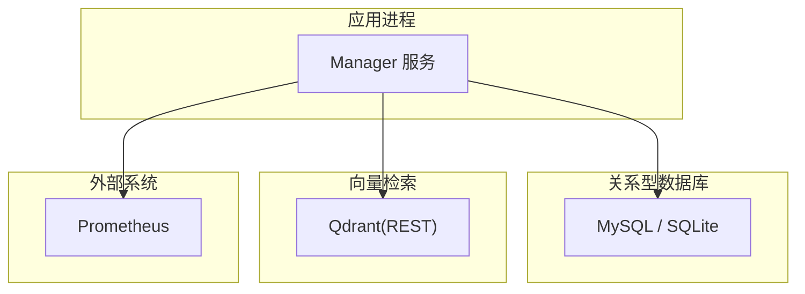
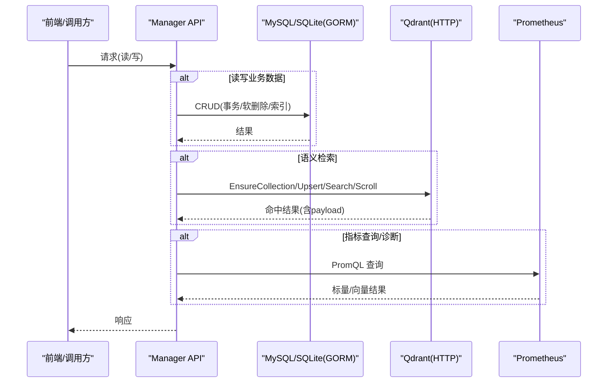
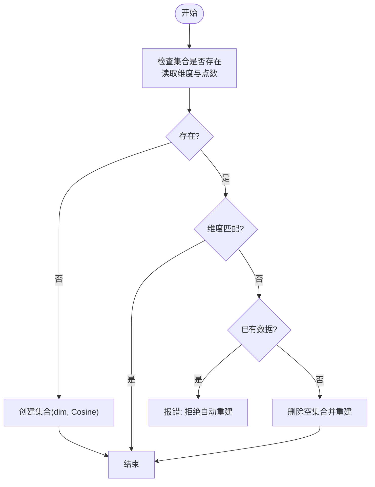
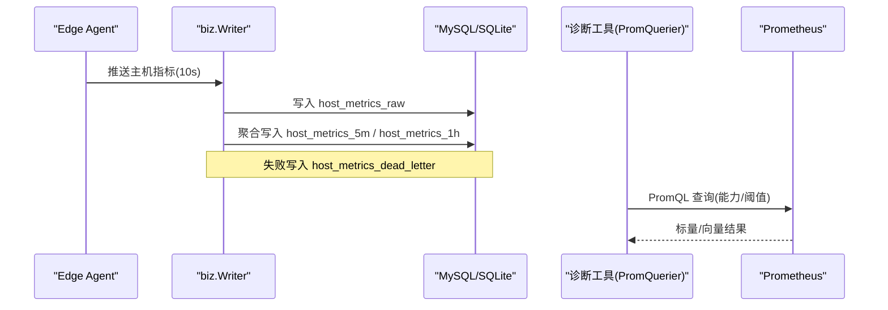
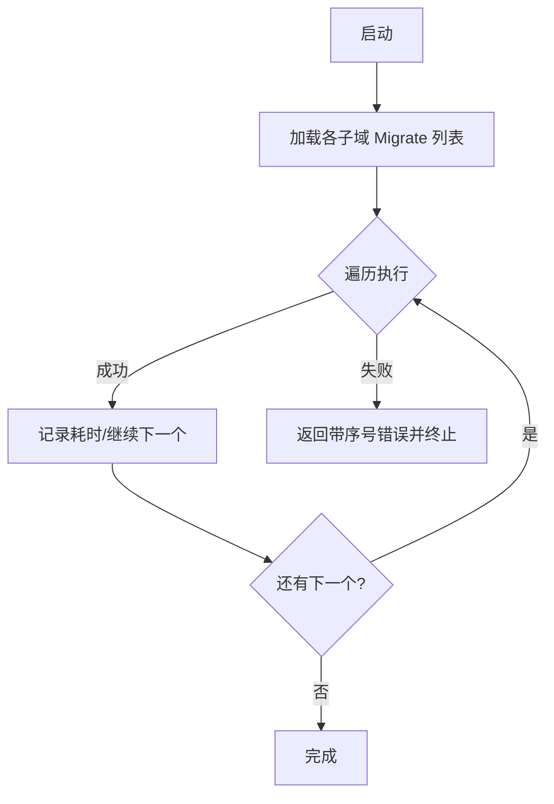
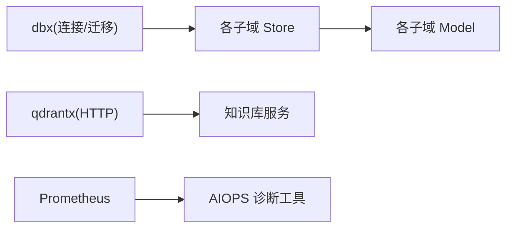

# 数据库设计

<cite>
**本文引用的文件**   
- [dbx.go](file://internal/pkg/dbx/dbx.go)
- [migrate.go](file://internal/pkg/dbx/migrate.go)
- [client.go](file://internal/pkg/qdrantx/client.go)
- [model.go](file://internal/manager/model/metric/model.go)
- [migrate.go](file://internal/manager/data/metric/store/migrate.go)
- [model.go](file://internal/manager/model/alert/model.go)
- [migrate.go](file://internal/manager/data/alert/store/migrate.go)
- [model.go](file://internal/manager/model/device/model.go)
- [migrate.go](file://internal/manager/data/device/store/migrate.go)
- [model.go](file://internal/manager/model/topology/model.go)
- [migrate.go](file://internal/manager/data/topology/store/migrate.go)
- [model.go](file://internal/manager/model/knowledge/model.go)
- [store_test.go](file://internal/manager/data/report/store/facts_test.go)
- [README.md](file://deploy/README.md)
- [ROADMAP.md](file://ROADMAP.md)
</cite>

## 目录
1. [引言](#引言)
2. [项目结构](#项目结构)
3. [核心组件](#核心组件)
4. [架构总览](#架构总览)
5. [详细组件分析](#详细组件分析)
6. [依赖分析](#依赖分析)
7. [性能考虑](#性能考虑)
8. [故障排查指南](#故障排查指南)
9. [结论](#结论)
10. [附录](#附录)

## 引言
本文件面向数据库管理员与平台工程师，系统化梳理本仓库的数据库设计与实现：关系型数据（MySQL/SQLite）、向量检索（Qdrant）与时序指标存储方案；涵盖表结构设计、实体关系图、索引策略、查询优化、迁移与版本管理、访问模式与缓存、备份恢复与一致性保证，以及运维监控建议。

## 项目结构
- 关系型数据层采用 GORM 抽象，统一通过 dbx 包打开 MySQL 或 SQLite 后端，所有模型定义位于 internal/manager/model/*，各子域 store 包提供 AutoMigrate 入口并由统一的 RunMigrations 编排执行。
- 向量检索使用 Qdrant HTTP 客户端封装 qdrantx，用于知识库文档的语义搜索与过滤。
- 时序指标以 host_metrics_raw + 多级聚合表（5m/1h）+ 死信表形式落库，按 edge_id 与时间对齐分桶。

图表来源
- [dbx.go:1-151](file://internal/pkg/dbx/dbx.go#L1-L151)
- [client.go:1-432](file://internal/pkg/qdrantx/client.go#L1-L432)
- [model.go:1-189](file://internal/manager/model/metric/model.go#L1-L189)

章节来源
- [dbx.go:1-151](file://internal/pkg/dbx/dbx.go#L1-L151)
- [migrate.go:1-46](file://internal/pkg/dbx/migrate.go#L1-L46)

## 核心组件
- 关系型数据后端
  - 统一连接与方言选择：支持 MySQL（默认）与 SQLite（本地开发），开启 WAL、外键约束等关键参数。
  - 迁移编排：RunMigrations 顺序执行各子域 Migrate，记录耗时并快速失败。
- 向量检索
  - 集合与维度校验、幂等创建；负载字段索引（keyword/text/integer/float/bool/geo）；Upsert/DeleteByFilter/Search/Scroll 等基础操作。
- 时序指标
  - 三层存储：原始样本（10s）、5分钟聚合、1小时聚合；复合主键（edge_id, ts）；死信表兜底。
- 告警与事件
  - 规则、事件、静默、通知渠道、投递记录等完整生命周期持久化。
- 拓扑与设备
  - 节点/关系/类型三元组建模，内置节点与关系类型种子数据；设备元数据与 Edge 多对多关联。
- 知识库
  - 仓库注册、SSH 身份、文档元信息；正文与向量由 Qdrant 承载，MySQL 仅保留必要元数据。

章节来源
- [dbx.go:1-151](file://internal/pkg/dbx/dbx.go#L1-L151)
- [migrate.go:1-46](file://internal/pkg/dbx/migrate.go#L1-L46)
- [client.go:1-432](file://internal/pkg/qdrantx/client.go#L1-L432)
- [model.go:1-189](file://internal/manager/model/metric/model.go#L1-L189)
- [migrate.go:1-20](file://internal/manager/data/metric/store/migrate.go#L1-L20)
- [model.go:1-464](file://internal/manager/model/alert/model.go#L1-L464)
- [migrate.go:1-14](file://internal/manager/data/alert/store/migrate.go#L1-L14)
- [model.go:1-278](file://internal/manager/model/device/model.go#L1-L278)
- [migrate.go:1-20](file://internal/manager/data/device/store/migrate.go#L1-L20)
- [model.go:1-341](file://internal/manager/model/topology/model.go#L1-L341)
- [migrate.go:1-49](file://internal/manager/data/topology/store/migrate.go#L1-L49)
- [model.go:1-162](file://internal/manager/model/knowledge/model.go#L1-L162)

## 架构总览
下图展示 Manager 与三类数据源的交互：关系型数据库（MySQL/SQLite）、向量数据库（Qdrant）、时序系统（Prometheus）。

图表来源
- [dbx.go:1-151](file://internal/pkg/dbx/dbx.go#L1-L151)
- [client.go:1-432](file://internal/pkg/qdrantx/client.go#L1-L432)
- [model.go:1-189](file://internal/manager/model/metric/model.go#L1-L189)

## 详细组件分析

### 关系型数据库（MySQL/SQLite）
- 连接与方言
  - 默认 MySQL，可通过配置切换至 SQLite（WAL、busy_timeout、foreign_keys 启用）。
  - MySQL 启动时 Ping 验证连通性，错误快速失败。
- 迁移机制
  - 每个子域 store 暴露 Migrate(db)，统一由 RunMigrations 顺序执行，带日志与错误包装。
- 典型表族与索引
  - 指标：host_metrics_raw、host_metrics_5m、host_metrics_1h、host_metrics_dead_letter；复合主键 (edge_id, ts)。
  - 告警：alert_rules、alert_incidents、alert_events、alert_silences、notification_channels、notification_deliveries；大量索引覆盖 rule/device/status/time 等高频过滤。
  - 设备与拓扑：devices、edge_devices、nodes、relations、relation_types、node_types；唯一/联合索引保障去重与查询效率。
  - 知识库：knowledge_repos、ssh_identities（正文与向量在 Qdrant）。
- 软删除与幂等
  - 多处使用 gorm.DeletedAt 与自定义 delete_marker 软删除；迁移幂等（upsert 种子、重建索引兼容）。

```mermaid
erDiagram
DEVICE {
uint64 id PK
string fingerprint UK
string name
string hostname
string os
int cpu_count
uint64 mem_total_bytes
uint64 disk_total_bytes
float32 cpu_usage_pct
float32 mem_usage_pct
float32 disk_usage_pct
uint8 roles
bool online
datetime last_seen_at
bool reachable
datetime last_reachable_at
string ssh_host
int ssh_port
string ssh_user
string ssh_auth_kind
string ssh_password
text ssh_key
text ssh_host_key
datetime ssh_last_seen_at
string ssh_last_error
uint64 node_id
datetime created_at
datetime updated_at
datetime deleted_at
uint64 delete_marker
}
EDGE_DEVICE {
uint64 id PK
uint64 edge_id
uint64 device_id
int type
datetime created_at
datetime updated_at
datetime deleted_at
uint64 delete_marker
}
NODES {
uint64 id PK
string type
string name
text props_jsonb
datetime created_at
datetime updated_at
datetime deleted_at
}
RELATIONS {
uint64 id PK
uint64 src_id
uint64 dst_id
string type
text props_jsonb
datetime created_at
datetime updated_at
datetime deleted_at
uint64 delete_marker
}
RELATION_TYPES {
string name PK
string display_name
string display_name_en
bool builtin
bool propagates_failure
string direction
string semantics_tag
text description
datetime created_at
datetime updated_at
}
NODE_TYPES {
string name PK
string display_name
string display_name_en
bool builtin
int tier
text description
datetime created_at
datetime updated_at
}
HOST_METRICS_RAW {
uint64 id PK
uint64 edge_id
datetime ts
float64 cpu_pct
float64 mem_pct
float64 load1
float64 load5
float64 load15
uint64 net_rx_bps
uint64 net_tx_bps
float64 disk_used_pct
datetime created_at
}
HOST_METRICS_5M {
uint64 edge_id PK
datetime ts PK
float64 cpu_avg
float64 cpu_max
float64 mem_avg
float64 mem_max
float64 load1_avg
float64 load1_max
float64 load5_avg
float64 load5_max
float64 load15_avg
float64 load15_max
uint64 net_rx_sum
uint64 net_tx_sum
float64 disk_used_avg
float64 disk_used_max
}
HOST_METRICS_1H {
uint64 edge_id PK
datetime ts PK
float64 cpu_avg
float64 cpu_max
float64 mem_avg
float64 mem_max
float64 load1_avg
float64 load1_max
float64 load5_avg
float64 load5_max
float64 load15_avg
float64 load15_max
uint64 net_rx_sum
uint64 net_tx_sum
float64 disk_used_avg
float64 disk_used_max
}
ALERT_RULES {
uint64 id PK
string rule_key UK
string kind
string name
string source_type
string scope_type
string join_mode
string severity
bool enabled
text conditions_json
text labels_json
text annotations_json
string runbook_url
text notify_channel_ids_json
int notify_window_seconds
int notify_min_fires
uint64 created_by
datetime created_at
datetime updated_at
datetime deleted_at
}
ALERT_INCIDENTS {
uint64 id PK
uint64 rule_id
uint64 device_id
string title
string scope
string scope_type
string rule
string rule_name
string severity
string status
text summary
text description
string dedupe_key UK
float value
float threshold
text labels_json
text annotations_json
string runbook_url
uint64 event_count
datetime first_fired_at
datetime last_fired_at
datetime last_notified_at
datetime silenced_until
datetime acknowledged_at
uint64 acknowledged_by
datetime resolved_at
uint64 resolved_by
string source_type
datetime created_at
datetime updated_at
datetime deleted_at
}
ALERT_EVENTS {
uint64 id PK
uint64 incident_id
string event_type
string status_after
string severity
string title
text message
string actor_type
uint64 actor_id
uint64 operator_user_id
text snapshot_json
text reason
datetime occurred_at
datetime created_at
datetime updated_at
datetime deleted_at
}
ALERT_SILENCES {
uint64 id PK
string name
string scope
string scope_type
uint64 device_id
string rule
string status
text matchers_json
text reason
uint64 created_by
uint64 cancelled_by
datetime starts_at
datetime ends_at
datetime cancelled_at
datetime created_at
datetime updated_at
datetime deleted_at
}
NOTIFICATION_CHANNELS {
uint64 id PK
string name
string channel_type
bool enabled
text config_json
string match_severity_min
string match_scope_types
uint64 created_by
datetime created_at
datetime updated_at
datetime deleted_at
}
NOTIFICATION_DELIVERIES {
uint64 id PK
uint64 incident_id
uint64 event_id
uint64 channel_id
string status
uint32 attempt_count
string provider_message_id
text request_json
text response_json
text error_message
datetime sent_at
datetime finished_at
datetime created_at
datetime updated_at
datetime deleted_at
}
KNOWLEDGE_REPOS {
uint64 id PK
string url UK
string branch
string description
datetime last_synced_at
text last_sync_error
int file_count
datetime created_at
datetime updated_at
}
SSH_IDENTITIES {
uint64 id PK
string name UK
text private_key
text public_key
string fingerprint
text passphrase
text hosts
text known_hosts
datetime last_used_at
datetime created_at
datetime updated_at
}
DEVICE ||--o{ EDGE_DEVICE : "拥有"
NODES ||--o{ RELATIONS : "作为源/目标"
RELATION_TYPES ||--o{ RELATIONS : "定义边语义"
NODE_TYPES ||--o{ NODES : "定义节点类型"
```

图表来源
- [model.go:1-278](file://internal/manager/model/device/model.go#L1-L278)
- [model.go:1-341](file://internal/manager/model/topology/model.go#L1-L341)
- [model.go:1-189](file://internal/manager/model/metric/model.go#L1-L189)
- [model.go:1-464](file://internal/manager/model/alert/model.go#L1-L464)
- [model.go:1-162](file://internal/manager/model/knowledge/model.go#L1-L162)

章节来源
- [dbx.go:1-151](file://internal/pkg/dbx/dbx.go#L1-L151)
- [migrate.go:1-46](file://internal/pkg/dbx/migrate.go#L1-L46)
- [model.go:1-189](file://internal/manager/model/metric/model.go#L1-L189)
- [migrate.go:1-20](file://internal/manager/data/metric/store/migrate.go#L1-L20)
- [model.go:1-464](file://internal/manager/model/alert/model.go#L1-L464)
- [migrate.go:1-14](file://internal/manager/data/alert/store/migrate.go#L1-L14)
- [model.go:1-278](file://internal/manager/model/device/model.go#L1-L278)
- [migrate.go:1-20](file://internal/manager/data/device/store/migrate.go#L1-L20)
- [model.go:1-341](file://internal/manager/model/topology/model.go#L1-L341)
- [migrate.go:1-49](file://internal/manager/data/topology/store/migrate.go#L1-L49)
- [model.go:1-162](file://internal/manager/model/knowledge/model.go#L1-L162)

### 向量数据库（Qdrant）语义搜索
- 集合与维度
  - 单部署默认集合名“knowledge”，向量维度 dim 需与嵌入模型一致；若集合已存在且维度不匹配且有数据，拒绝自动重建以避免数据丢失。
- 负载字段索引
  - 支持 keyword/text/integer/float/bool/geo；text 索引用于前缀/全文匹配（如 path_prefix）。
- 写入与删除
  - Upsert 按点 ID 幂等替换；DeleteByFilter 要求至少一个 must 条件，避免误删全库。
- 检索
  - Search 支持 top-K 余弦相似度 + 服务端 payload 过滤；Scroll 分页列出 payload。
- 点 ID 生成
  - 基于内容稳定哈希（例如 URL md5 低位），确保重复导入覆盖而非复制。

图表来源
- [client.go:1-432](file://internal/pkg/qdrantx/client.go#L1-L432)

章节来源
- [client.go:1-432](file://internal/pkg/qdrantx/client.go#L1-L432)

### 时序数据库（Prometheus）与指标处理流程
- 采集与上报
  - 边缘端推送主机指标到 Manager，经 biz.Writer 写入 host_metrics_raw，随后按 5m/1h 窗口聚合落盘。
- 查询与分析
  - 诊断工具通过 PromQuerier 直接查询 Prometheus，进行能力探测与阈值判定（如 InnoDB、PerfSchema、Redis 内存碎片率等）。
- 降级与兜底
  - 写入失败进入 host_metrics_dead_letter，保留 7 天以便后续重试或人工干预。

图表来源
- [model.go:1-189](file://internal/manager/model/metric/model.go#L1-L189)
- [analyze_database_status.go:121-1313](file://internal/manager/biz/aiops/tools/analyze_database_status.go#L121-L1313)

章节来源
- [model.go:1-189](file://internal/manager/model/metric/model.go#L1-L189)
- [migrate.go:1-20](file://internal/manager/data/metric/store/migrate.go#L1-L20)
- [analyze_database_status.go:121-1313](file://internal/manager/biz/aiops/tools/analyze_database_status.go#L121-L1313)
- [analyze_database_status.go:2385-2430](file://internal/manager/biz/aiops/tools/analyze_database_status.go#L2385-L2430)

### 数据迁移策略与版本管理
- 统一入口
  - RunMigrations 顺序执行各子域 Migrate，记录开始/完成时间与耗时，首个错误即中止并返回带序号的错误信息。
- 幂等与回退
  - 各 Migrate 内部使用 AutoMigrate、upsert 种子、按需重建索引与回填数据；二次启动为幂等。
- 方言无关
  - 模型与迁移均基于 GORM，MySQL/SQLite 共享同一套逻辑。

图表来源
- [migrate.go:1-46](file://internal/pkg/dbx/migrate.go#L1-L46)

章节来源
- [migrate.go:1-46](file://internal/pkg/dbx/migrate.go#L1-L46)
- [migrate.go:1-49](file://internal/manager/data/topology/store/migrate.go#L1-L49)
- [migrate.go:1-20](file://internal/manager/data/metric/store/migrate.go#L1-L20)
- [migrate.go:1-14](file://internal/manager/data/alert/store/migrate.go#L1-L14)

### 数据访问模式、缓存与性能优化
- 访问模式
  - 指标：高吞吐写入（raw→聚合），范围查询按 (edge_id, ts) 高效定位。
  - 告警：按 rule/device/status/time 多维过滤，大量索引支撑。
  - 拓扑：节点/关系/类型三表解耦，内置种子数据减少冷启动成本。
  - 知识库：MySQL 仅存仓库与身份，正文与向量在 Qdrant，利用 payload 索引做服务端过滤。
- 缓存策略
  - 设备在线/可达状态与 CPU/内存/磁盘使用率冗余于 devices 表，避免频繁 JOIN 指标表，提升列表渲染性能。
- 性能优化
  - 复合主键与联合索引优先；软删除配合 delete_marker 与唯一索引避免冲突；Qdrant 文本索引用于路径前缀匹配；PromQL 查询尽量使用预计算/录制规则（结合外部最佳实践）。

章节来源
- [model.go:1-278](file://internal/manager/model/device/model.go#L1-L278)
- [model.go:1-189](file://internal/manager/model/metric/model.go#L1-L189)
- [model.go:1-464](file://internal/manager/model/alert/model.go#L1-L464)
- [model.go:1-341](file://internal/manager/model/topology/model.go#L1-L341)
- [model.go:1-162](file://internal/manager/model/knowledge/model.go#L1-L162)
- [client.go:1-432](file://internal/pkg/qdrantx/client.go#L1-L432)

### 备份、恢复与一致性保证
- 备份
  - 规划中：将 MySQL + Qdrant + 对象存储快照打包为单一 tarball，支持可配置保留策略。
- 恢复
  - 一键恢复：新 Manager 指向快照 tarball，校验 schema 版本与 Edge 重新握手计划。
- 一致性
  - 关系型数据：GORM 事务 + 软删除 + 唯一索引保障一致性。
  - 向量数据：Upsert 幂等、DeleteByFilter 强制条件保护；集合维度不一致时拒绝自动重建。
  - 时序数据：Prometheus 侧按自身保留策略；Manager 侧 dead letter 表兜底。

章节来源
- [ROADMAP.md:316-358](file://ROADMAP.md#L316-L358)
- [client.go:1-432](file://internal/pkg/qdrantx/client.go#L1-L432)
- [model.go:1-189](file://internal/manager/model/metric/model.go#L1-L189)

### 面向 DBA 的维护指南与监控指标
- 连接与可用性
  - MySQL：启动时 Ping 失败即退出，便于快速发现配置错误。
  - SQLite：WAL 模式、busy_timeout=5000ms、外键开启；适合单机调试，不建议生产。
- 容量与增长
  - 关注 host_metrics_* 表增长速率与聚合粒度；dead_letter 表异常增长需排查上游写入链路。
  - alert_* 表随告警规模增长，注意索引与归档策略。
- 索引健康
  - 定期复核复合主键与联合索引是否被命中；Qdrant 的 payload 索引是否按查询模式建立。
- 迁移与升级
  - 每次发布前运行迁移脚本并观察耗时；出现慢迁移需评估锁与 IO 影响。
- 可观测性
  - 结合 Prometheus 监控 Manager 与 Qdrant 的 HTTP 延迟、错误率、集合大小、点数量等。

章节来源
- [dbx.go:1-151](file://internal/pkg/dbx/dbx.go#L1-L151)
- [README.md:100-130](file://deploy/README.md#L100-L130)

## 依赖分析
- 模块耦合
  - dbx 为底层基础设施，被各子域 store 复用；qdrantx 独立 HTTP 客户端；模型定义在各子域 model 包内，store 负责映射与迁移。
- 外部依赖
  - MySQL/SQLite（GORM 驱动）、Qdrant REST API、Prometheus（诊断工具）。
- 潜在风险
  - 向量集合维度变更需人工介入；高基数标签在 Prometheus 侧需治理；SQLite 不适合并发写入场景。

图表来源
- [dbx.go:1-151](file://internal/pkg/dbx/dbx.go#L1-L151)
- [client.go:1-432](file://internal/pkg/qdrantx/client.go#L1-L432)
- [model.go:1-162](file://internal/manager/model/knowledge/model.go#L1-L162)
- [analyze_database_status.go:121-1313](file://internal/manager/biz/aiops/tools/analyze_database_status.go#L121-L1313)

章节来源
- [dbx.go:1-151](file://internal/pkg/dbx/dbx.go#L1-L151)
- [client.go:1-432](file://internal/pkg/qdrantx/client.go#L1-L432)
- [model.go:1-162](file://internal/manager/model/knowledge/model.go#L1-L162)
- [analyze_database_status.go:121-1313](file://internal/manager/biz/aiops/tools/analyze_database_status.go#L121-L1313)

## 性能考虑
- 写入优化
  - 批量 Upsert、合理批次大小；指标写入失败走 dead letter 避免阻塞主流程。
- 查询优化
  - 指标按 (edge_id, ts) 范围扫描；告警按 rule/device/status/time 过滤；Qdrant 使用 keyword/text 索引加速过滤。
- 聚合与降采样
  - 5m/1h 聚合降低长周期查询成本；PromQL 侧可用录制规则进一步加速。
- 资源隔离
  - 不同子域表空间/索引分离；Qdrant 集合按用途划分（当前默认 knowledge）。

[本节为通用指导，无需源码引用]

## 故障排查指南
- 连接问题
  - MySQL 无法 Ping：检查 DSN、网络与安全组；SQLite 路径权限与目录创建。
- 迁移失败
  - 查看 RunMigrations 日志中的序号与错误；核对 AutoMigrate 生成的表结构与索引。
- 向量检索异常
  - 集合维度不匹配：确认嵌入模型维度与集合一致；有数据时禁止自动重建。
  - 过滤无效：确认对应字段已建立 payload 索引（keyword/text）。
- 指标缺失
  - 检查 host_metrics_dead_letter；确认 Edge 上报与 biz.Writer 写入链路；PromQL 查询能力探测。

章节来源
- [dbx.go:1-151](file://internal/pkg/dbx/dbx.go#L1-L151)
- [migrate.go:1-46](file://internal/pkg/dbx/migrate.go#L1-L46)
- [client.go:1-432](file://internal/pkg/qdrantx/client.go#L1-L432)
- [model.go:1-189](file://internal/manager/model/metric/model.go#L1-L189)
- [analyze_database_status.go:2385-2430](file://internal/manager/biz/aiops/tools/analyze_database_status.go#L2385-L2430)

## 结论
本仓库采用“关系型 + 向量 + 时序”的多模态数据架构：GORM 统一抽象 MySQL/SQLite，Qdrant 承载知识库语义检索，Prometheus 提供指标查询与分析。通过幂等迁移、软删除、复合主键与索引、死信兜底等手段，兼顾了可扩展性与稳定性。未来可按路线图完善跨库快照与一键恢复，进一步提升运维效率与可靠性。

[本节为总结，无需源码引用]

## 附录
- 本地开发切换 SQLite
  - 参考部署说明，设置环境变量后移除 MySQL 容器即可快速体验。
- 测试辅助
  - 部分测试使用内存 SQLite 构造最小表结构以验证 SQL 行为。

章节来源
- [README.md:100-130](file://deploy/README.md#L100-L130)
- [store_test.go:1-46](file://internal/manager/data/report/store/facts_test.go#L1-L46)