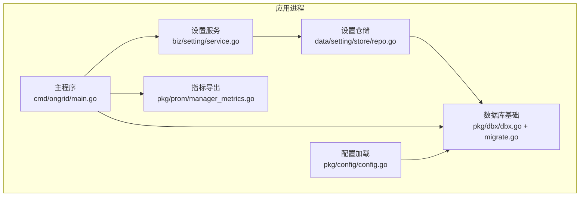
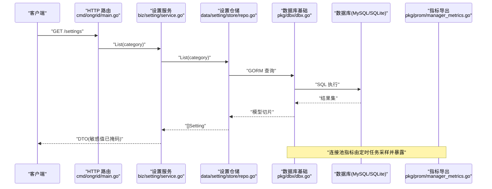
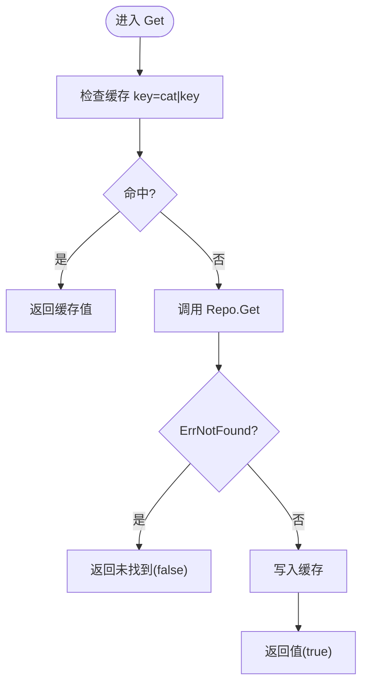
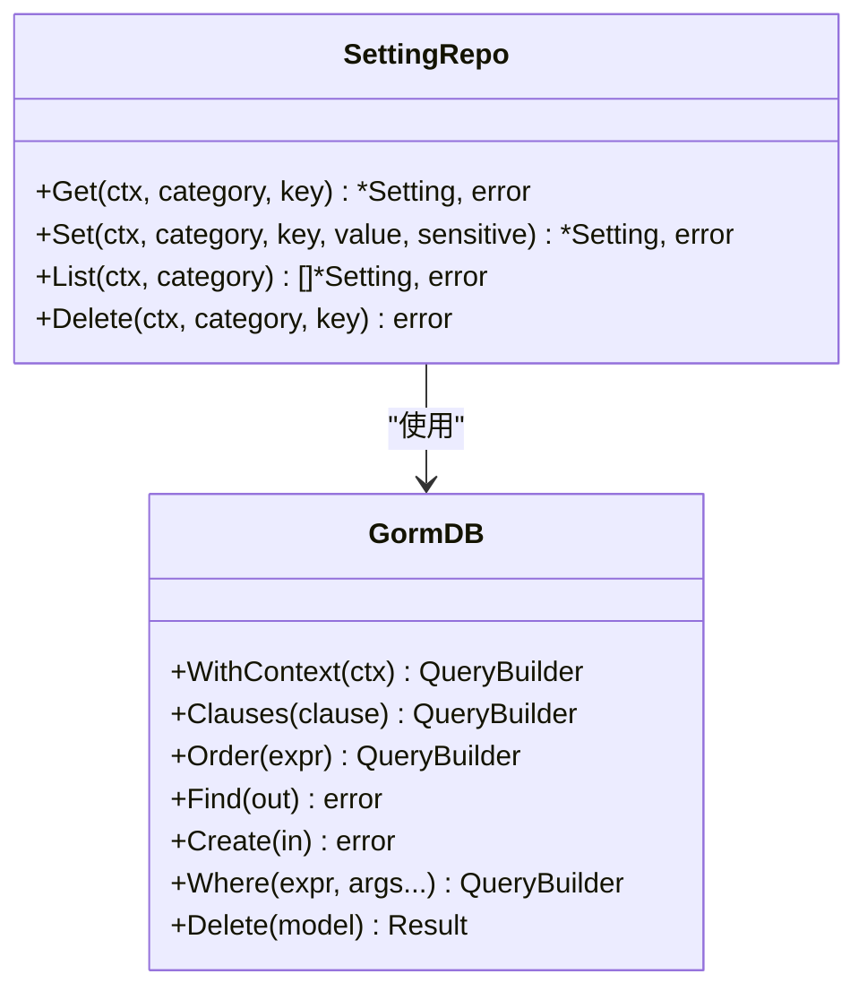
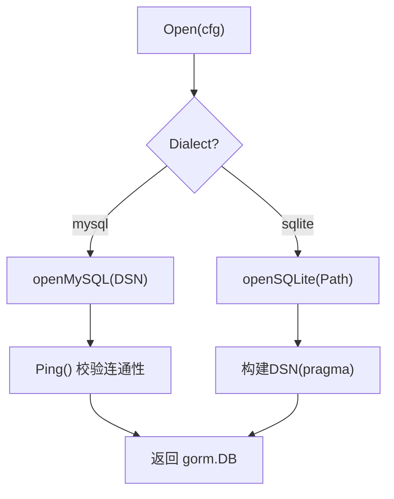
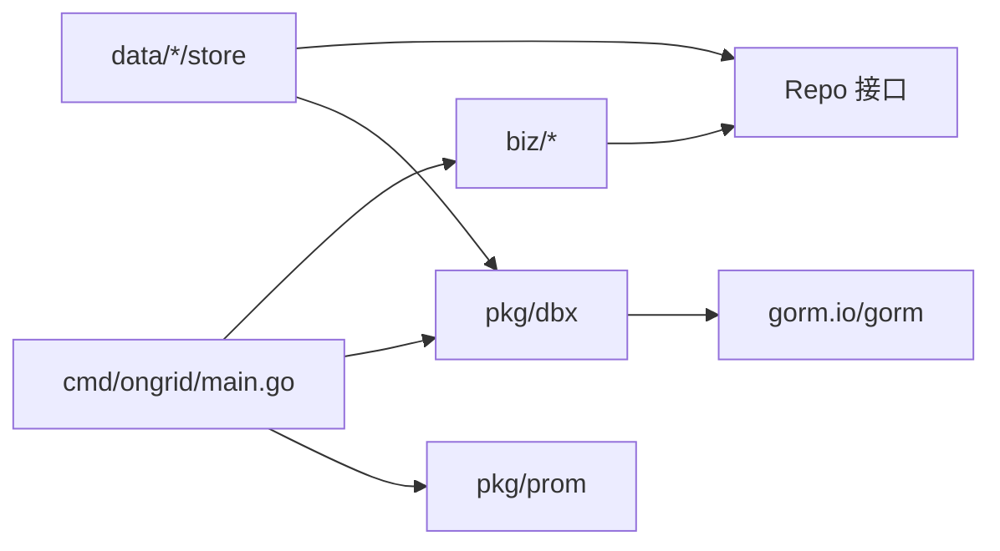

# 数据访问模式

<cite>
**本文引用的文件**   
- [internal/pkg/dbx/dbx.go](file://internal/pkg/dbx/dbx.go)
- [internal/pkg/dbx/migrate.go](file://internal/pkg/dbx/migrate.go)
- [internal/manager/biz/setting/service.go](file://internal/manager/biz/setting/service.go)
- [internal/manager/data/setting/store/repo.go](file://internal/manager/data/setting/store/repo.go)
- [internal/pkg/config/config.go](file://internal/pkg/config/config.go)
- [internal/pkg/prom/manager_metrics.go](file://internal/pkg/prom/manager_metrics.go)
- [cmd/ongrid/main.go](file://cmd/ongrid/main.go)
</cite>

## 目录
1. [简介](#简介)
2. [项目结构](#项目结构)
3. [核心组件](#核心组件)
4. [架构总览](#架构总览)
5. [详细组件分析](#详细组件分析)
6. [依赖关系分析](#依赖关系分析)
7. [性能与连接池](#性能与连接池)
8. [事务与一致性策略](#事务与一致性策略)
9. [缓存策略](#缓存策略)
10. [查询优化与监控](#查询优化与监控)
11. [最佳实践、常见陷阱与调试技巧](#最佳实践常见陷阱与调试技巧)
12. [扩展指南：新增数据源与自定义查询](#扩展指南新增数据源与自定义查询)
13. [结论](#结论)

## 简介
本文件系统化梳理 ongrid 的数据访问模式，重点覆盖 Repository 抽象与实现、事务与一致性策略、缓存设计、连接池配置、查询优化与性能监控，并提供面向开发者的扩展指南。文档以代码仓库中的实际实现为依据，确保可落地、可追溯。

## 项目结构
数据访问相关的关键位置与职责如下：
- 数据库基础设施：dbx 包负责后端选择（MySQL/SQLite）、连接打开、迁移编排等。
- 业务服务层：以 setting 为例，Service 封装了本地缓存、敏感值脱敏、调用 Repo 的完整流程。
- 数据仓储层：store 包基于 GORM 提供具体 CRUD 实现，统一错误语义。
- 配置加载：config 包集中管理运行时参数，包括 DB 方言、DSN、路径等。
- 指标采集：prom 包暴露数据库连接池指标，供外部监控系统抓取。
- 启动装配：main 中完成 HTTP、Metrics 监听器及关键组件的组装。

图表来源
- [cmd/ongrid/main.go](file://cmd/ongrid/main.go)
- [internal/manager/biz/setting/service.go](file://internal/manager/biz/setting/service.go)
- [internal/manager/data/setting/store/repo.go](file://internal/manager/data/setting/store/repo.go)
- [internal/pkg/dbx/dbx.go](file://internal/pkg/dbx/dbx.go)
- [internal/pkg/dbx/migrate.go](file://internal/pkg/dbx/migrate.go)
- [internal/pkg/config/config.go](file://internal/pkg/config/config.go)
- [internal/pkg/prom/manager_metrics.go](file://internal/pkg/prom/manager_metrics.go)

章节来源
- [internal/pkg/dbx/dbx.go:1-151](file://internal/pkg/dbx/dbx.go#L1-L151)
- [internal/pkg/dbx/migrate.go:1-47](file://internal/pkg/dbx/migrate.go#L1-L47)
- [internal/manager/biz/setting/service.go:1-197](file://internal/manager/biz/setting/service.go#L1-L197)
- [internal/manager/data/setting/store/repo.go:1-102](file://internal/manager/data/setting/store/repo.go#L1-L102)
- [internal/pkg/config/config.go:259-272](file://internal/pkg/config/config.go#L259-L272)
- [internal/pkg/prom/manager_metrics.go:93-123](file://internal/pkg/prom/manager_metrics.go#L93-L123)
- [cmd/ongrid/main.go:2468-2500](file://cmd/ongrid/main.go#L2468-L2500)

## 核心组件
- 数据库基础（dbx）
  - Open：根据 Dialect 选择 MySQL 或 SQLite；MySQL 在打开时 Ping 验证连通性；SQLite 启用 WAL、busy_timeout、foreign_keys 等 pragmas。
  - Migrate：RunMigrations 按序执行各模块的 AutoMigrate，记录耗时并包装错误便于定位。
- 设置服务（biz/setting）
  - Service：维护进程内 map[string]string 缓存，Get/Set/Delete 均带并发保护；Set/Delete 后主动失效对应缓存项；List 对敏感字段进行掩码处理。
  - Repo 接口：定义 Get/Set/List/Delete 四个方法，屏蔽底层差异。
- 设置仓储（data/setting/store）
  - 基于 GORM 的 Upsert（ON CONFLICT/ON DUPLICATE KEY UPDATE），保证幂等；缺失行返回 ErrNotFound；Delete 映射为 ErrNotFound 当无影响行。
- 配置（pkg/config）
  - DBConfig：Dialect、DSN、Path 三要素；默认 MySQL，支持 SQLite 单用户场景。
- 指标（pkg/prom）
  - 暴露数据库连接池指标：OpenConnections、InUse、Idle、WaitCountTotal，由定时任务采样上报。

章节来源
- [internal/pkg/dbx/dbx.go:34-77](file://internal/pkg/dbx/dbx.go#L34-L77)
- [internal/pkg/dbx/dbx.go:79-128](file://internal/pkg/dbx/dbx.go#L79-L128)
- [internal/pkg/dbx/migrate.go:20-46](file://internal/pkg/dbx/migrate.go#L20-L46)
- [internal/manager/biz/setting/service.go:28-68](file://internal/manager/biz/setting/service.go#L28-L68)
- [internal/manager/biz/setting/service.go:72-124](file://internal/manager/biz/setting/service.go#L72-L124)
- [internal/manager/biz/setting/service.go:143-196](file://internal/manager/biz/setting/service.go#L143-L196)
- [internal/manager/data/setting/store/repo.go:24-69](file://internal/manager/data/setting/store/repo.go#L24-L69)
- [internal/manager/data/setting/store/repo.go:85-101](file://internal/manager/data/setting/store/repo.go#L85-L101)
- [internal/pkg/config/config.go:259-272](file://internal/pkg/config/config.go#L259-L272)
- [internal/pkg/prom/manager_metrics.go:93-123](file://internal/pkg/prom/manager_metrics.go#L93-L123)

## 架构总览
下图展示从请求到持久化的典型链路，以及连接池指标的采集点。

图表来源
- [cmd/ongrid/main.go:2468-2500](file://cmd/ongrid/main.go#L2468-L2500)
- [internal/manager/biz/setting/service.go:143-160](file://internal/manager/biz/setting/service.go#L143-L160)
- [internal/manager/data/setting/store/repo.go:73-83](file://internal/manager/data/setting/store/repo.go#L73-L83)
- [internal/pkg/dbx/dbx.go:34-77](file://internal/pkg/dbx/dbx.go#L34-L77)
- [internal/pkg/prom/manager_metrics.go:218-234](file://internal/pkg/prom/manager_metrics.go#L218-L234)

## 详细组件分析

### 设置服务（biz/setting）
- 设计要点
  - 进程内缓存：map[category|key] -> value，读多写少场景下显著降低 DB 压力。
  - 并发安全：RWMutex 保护缓存读写；写操作（Set/Delete）后删除对应缓存键，保证后续读取命中最新值。
  - 敏感值脱敏：List 输出 DTO 时对敏感字段做掩码，避免明文泄露。
- 关键流程
  - Get：先查缓存，未命中则调 Repo.Get，并将结果写入缓存。
  - Set：调用 Repo.Set 成功后，删除缓存项，下次 Get 自动回填。
  - Delete：调用 Repo.Delete 成功后，删除缓存项。
  - InvalidateAll：用于运维兜底，清空全部缓存。

图表来源
- [internal/manager/biz/setting/service.go:72-104](file://internal/manager/biz/setting/service.go#L72-L104)

章节来源
- [internal/manager/biz/setting/service.go:47-68](file://internal/manager/biz/setting/service.go#L47-L68)
- [internal/manager/biz/setting/service.go:72-124](file://internal/manager/biz/setting/service.go#L72-L124)
- [internal/manager/biz/setting/service.go:143-196](file://internal/manager/biz/setting/service.go#L143-L196)

### 设置仓储（data/setting/store）
- 设计要点
  - Upsert：使用 ON CONFLICT/ON DUPLICATE KEY UPDATE 实现幂等写入。
  - 错误语义：缺失行统一返回 ErrNotFound，便于上层区分“不存在”和“异常”。
  - 列表排序：按 category 与 key 升序，稳定输出。
- 关键流程
  - Get：按 (category, key) 精确查找。
  - Set：插入或更新 value/sensitive/updated_at，并回读最新行以确保时间戳正确。
  - List：可选按 category 过滤，返回有序切片。
  - Delete：按 (category, key) 删除，无影响行视为 ErrNotFound。

图表来源
- [internal/manager/data/setting/store/repo.go:15-101](file://internal/manager/data/setting/store/repo.go#L15-L101)

章节来源
- [internal/manager/data/setting/store/repo.go:24-69](file://internal/manager/data/setting/store/repo.go#L24-L69)
- [internal/manager/data/setting/store/repo.go:73-83](file://internal/manager/data/setting/store/repo.go#L73-L83)
- [internal/manager/data/setting/store/repo.go:85-101](file://internal/manager/data/setting/store/repo.go#L85-L101)

### 数据库基础（dbx）
- 后端选择
  - MySQL：默认后端，打开时 Ping 校验连通性，失败快速返回。
  - SQLite：测试/单机场景，启用 WAL、busy_timeout、foreign_keys。
- 迁移编排
  - RunMigrations：顺序执行各模块的 AutoMigrate，记录开始/结束耗时，错误包装索引号便于诊断。

图表来源
- [internal/pkg/dbx/dbx.go:34-77](file://internal/pkg/dbx/dbx.go#L34-L77)
- [internal/pkg/dbx/dbx.go:79-128](file://internal/pkg/dbx/dbx.go#L79-L128)

章节来源
- [internal/pkg/dbx/dbx.go:34-77](file://internal/pkg/dbx/dbx.go#L34-L77)
- [internal/pkg/dbx/dbx.go:79-128](file://internal/pkg/dbx/dbx.go#L79-L128)
- [internal/pkg/dbx/migrate.go:20-46](file://internal/pkg/dbx/migrate.go#L20-L46)

## 依赖关系分析
- 低耦合高内聚
  - biz 层仅依赖 Repo 接口，不感知存储细节；store 层专注 SQL/GORM 实现。
  - dbx 作为共享基础设施，被多个模块复用。
- 外部依赖
  - GORM 与驱动（MySQL/SQLite）。
  - Prometheus 指标库用于连接池采样。
- 潜在循环依赖
  - 当前分层清晰，未见循环导入风险。

图表来源
- [internal/manager/biz/setting/service.go:28-35](file://internal/manager/biz/setting/service.go#L28-L35)
- [internal/manager/data/setting/store/repo.go:15-22](file://internal/manager/data/setting/store/repo.go#L15-L22)
- [internal/pkg/dbx/dbx.go:18-32](file://internal/pkg/dbx/dbx.go#L18-L32)
- [cmd/ongrid/main.go:2468-2500](file://cmd/ongrid/main.go#L2468-L2500)
- [internal/pkg/prom/manager_metrics.go:218-234](file://internal/pkg/prom/manager_metrics.go#L218-L234)

章节来源
- [internal/manager/biz/setting/service.go:28-35](file://internal/manager/biz/setting/service.go#L28-L35)
- [internal/manager/data/setting/store/repo.go:15-22](file://internal/manager/data/setting/store/repo.go#L15-L22)
- [internal/pkg/dbx/dbx.go:18-32](file://internal/pkg/dbx/dbx.go#L18-L32)
- [cmd/ongrid/main.go:2468-2500](file://cmd/ongrid/main.go#L2468-L2500)
- [internal/pkg/prom/manager_metrics.go:218-234](file://internal/pkg/prom/manager_metrics.go#L218-L234)

## 性能与连接池
- 连接池指标
  - ongrid_db_pool_open_connections：当前打开连接数。
  - ongrid_db_pool_in_use：正在使用的连接数。
  - ongrid_db_pool_idle：空闲连接数。
  - ongrid_db_pool_wait_count_total：等待获取连接的累计次数（单调递增）。
- 采样方式
  - 通过定时任务周期性读取 database/sql 的 DBStats 并写入 Gauge/Counter。
- 调优建议
  - 关注 WaitCountTotal 增长趋势，结合 InUse/Idle 判断是否需要调整最大连接数。
  - 在高并发写场景，适当增大 MaxOpenConns 与 MaxIdleConns，并结合业务 QPS 压测确定阈值。

章节来源
- [internal/pkg/prom/manager_metrics.go:93-123](file://internal/pkg/prom/manager_metrics.go#L93-L123)
- [internal/pkg/prom/manager_metrics.go:218-234](file://internal/pkg/prom/manager_metrics.go#L218-L234)

## 事务与一致性策略
- 单库事务
  - 当前仓储层未显式封装跨多表事务边界；若需跨表原子性，应在 usecase 层组织一次 GORM 事务，并在出错时回滚。
- 分布式事务
  - 仓库未发现两阶段提交或 TCC 等分布式事务框架集成；对外部系统交互建议采用异步化与补偿机制。
- 最终一致性
  - 推荐模式：事件驱动 + 重试 + 幂等。将状态变更落库后发布事件，下游消费者消费并幂等处理；失败走重试队列与死信通道。
- 补偿事务
  - 针对长流程，采用“正向操作 + 补偿动作”的设计，确保异常路径可回滚业务影响。

说明：本节为通用指导，不直接分析特定源码文件。

## 缓存策略
- 本地缓存（进程内）
  - 设置服务使用 map + RWMutex 实现轻量级缓存，适合小表、热键场景。
  - 失效策略：写操作后立即删除对应缓存键；提供 InvalidateAll 兜底。
- 分布式缓存
  - 当前仓库未发现 Redis/Memcached 等分布式缓存集成。如需水平扩展，可在 Service 层引入二级缓存，注意缓存穿透/雪崩/一致性问题。
- 缓存失效机制
  - 写后即删（WAS）+ 按需重建；对于强一致要求高的场景，建议在写路径上增加版本号或时间戳校验。

章节来源
- [internal/manager/biz/setting/service.go:47-68](file://internal/manager/biz/setting/service.go#L47-L68)
- [internal/manager/biz/setting/service.go:106-124](file://internal/manager/biz/setting/service.go#L106-L124)
- [internal/manager/biz/setting/service.go:162-180](file://internal/manager/biz/setting/service.go#L162-L180)

## 查询优化与监控
- 查询优化
  - 使用唯一索引（如 (category, key)）保障 Upsert 幂等与检索效率。
  - 列表查询指定 Order，避免全表扫描后的随机排序开销。
  - 条件查询尽量利用 WHERE 精准匹配，减少回表。
- 监控与可观测性
  - 连接池指标：Open/InUse/Idle/WaitCountTotal。
  - 迁移耗时：每次 AutoMigrate 的开始/结束时间与耗时日志。
  - 建议补充慢查询日志（可按需开启 GORM Logger 级别）。

章节来源
- [internal/manager/data/setting/store/repo.go:44-69](file://internal/manager/data/setting/store/repo.go#L44-L69)
- [internal/manager/data/setting/store/repo.go:73-83](file://internal/manager/data/setting/store/repo.go#L73-L83)
- [internal/pkg/dbx/migrate.go:34-43](file://internal/pkg/dbx/migrate.go#L34-L43)
- [internal/pkg/prom/manager_metrics.go:218-234](file://internal/pkg/prom/manager_metrics.go#L218-L234)

## 最佳实践、常见陷阱与调试技巧
- 最佳实践
  - 严格遵循 Repo 接口契约，usecase 层组合多个 Repo 调用时显式包裹事务。
  - 统一错误语义：缺失行返回 ErrNotFound，避免上层误判。
  - 敏感数据脱敏：对外输出前进行掩码处理。
- 常见陷阱
  - 忘记失效缓存导致读到旧值。
  - 未设置连接池上限导致连接泄漏或耗尽。
  - 大对象/大结果集一次性拉取造成内存峰值。
- 调试技巧
  - 临时提升 GORM 日志级别观察 SQL。
  - 通过 /metrics 查看连接池 WaitCountTotal 是否持续增长。
  - 使用 InvalidateAll 快速恢复缓存一致性。

说明：本节为通用指导，不直接分析特定源码文件。

## 扩展指南：新增数据源与自定义查询
- 新增数据源（以 MySQL/SQLite 为例）
  - 在 config 中新增或复用 DBConfig 字段，确保 Open 能识别新方言（如需）。
  - 在 dbx.Open 中分支处理新方言，完成初始化与连通性校验。
  - 在各模块 data/*/store 下新建 Repo 实现，遵循现有命名与错误语义约定。
- 自定义查询
  - 在 store 层使用 GORM 链式 API 构造复杂查询，必要时使用 Raw/Pluck 执行原生 SQL。
  - 在 biz 层封装用例，聚合多个 Repo 调用，必要时包裹事务。
- 迁移与版本演进
  - 在对应模块的 migrate.go 中注册 AutoMigrate，并通过 dbx.RunMigrations 统一执行。
- 指标与监控
  - 为新数据源接入连接池指标（若独立 DB 实例），或在现有指标维度上增加标签。

章节来源
- [internal/pkg/config/config.go:259-272](file://internal/pkg/config/config.go#L259-L272)
- [internal/pkg/dbx/dbx.go:34-77](file://internal/pkg/dbx/dbx.go#L34-L77)
- [internal/pkg/dbx/migrate.go:20-46](file://internal/pkg/dbx/migrate.go#L20-L46)

## 结论
本项目采用清晰的 Repository 模式，配合 dbx 基础设施与统一的迁移编排，实现了跨后端（MySQL/SQLite）的可插拔数据访问。设置服务的进程内缓存有效降低了热点读取的 DB 压力，Prometheus 指标为连接池容量调优提供了依据。未来如需水平扩展，可在 Service 层引入分布式缓存与更完善的事务/一致性方案，同时保持 Repo 接口的稳定性与向后兼容。