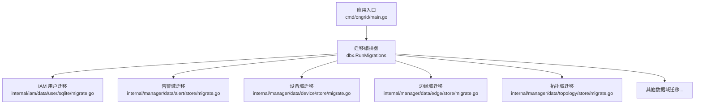
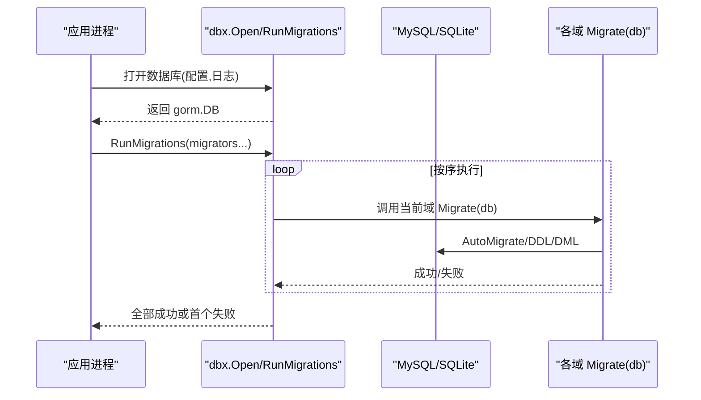
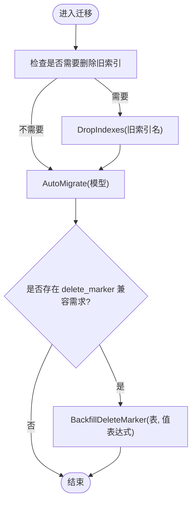
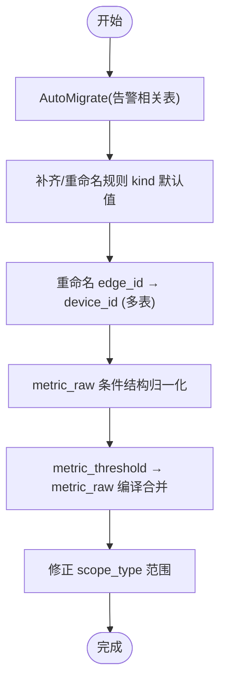
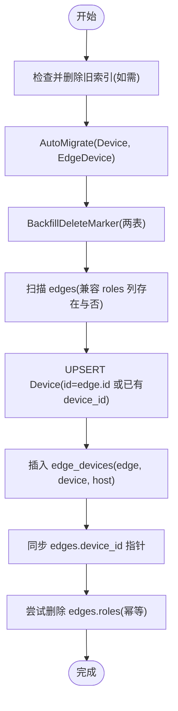
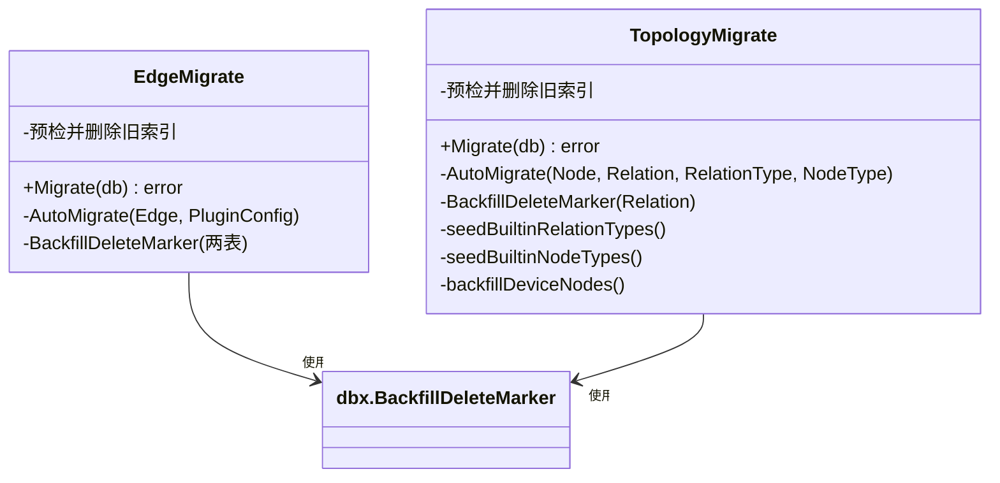
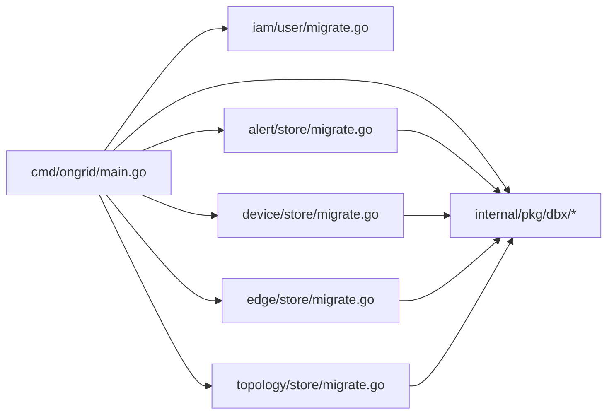

# 数据迁移策略

<cite>
**本文引用的文件**
- [cmd/ongrid/main.go](file://cmd/ongrid/main.go)
- [internal/pkg/dbx/migrate.go](file://internal/pkg/dbx/migrate.go)
- [internal/pkg/dbx/dbx.go](file://internal/pkg/dbx/dbx.go)
- [internal/pkg/dbx/soft_delete.go](file://internal/pkg/dbx/soft_delete.go)
- [internal/manager/data/alert/store/migrate.go](file://internal/manager/data/alert/store/migrate.go)
- [internal/manager/data/device/store/migrate.go](file://internal/manager/data/device/store/migrate.go)
- [internal/manager/data/edge/store/migrate.go](file://internal/manager/data/edge/store/migrate.go)
- [internal/manager/data/topology/store/migrate.go](file://internal/manager/data/topology/store/migrate.go)
- [internal/iam/data/user/sqlite/migrate.go](file://internal/iam/data/user/sqlite/migrate.go)
</cite>

## 目录
1. [引言](#引言)
2. [项目结构](#项目结构)
3. [核心组件](#核心组件)
4. [架构总览](#架构总览)
5. [详细组件分析](#详细组件分析)
6. [依赖关系分析](#依赖关系分析)
7. [性能与一致性考量](#性能与一致性考量)
8. [故障排查指南](#故障排查指南)
9. [结论](#结论)
10. [附录：迁移脚本编写规范与最佳实践](#附录：迁移脚本编写规范与最佳实践)

## 引言
本文件系统化梳理本项目基于 GORM AutoMigrate 的数据迁移策略，覆盖版本管理、执行顺序、回滚与错误恢复、多环境一致性保证、增量迁移设计模式（表结构变更、数据转换、兼容性处理），以及迁移脚本的编写规范与最佳实践。文档面向研发与运维人员，既提供高层概览，也给出代码级细节与图示，帮助读者快速理解并正确实施迁移。

## 项目结构
项目的数据库迁移采用“按数据域拆分 + 启动时统一编排”的模式：
- 每个数据域包暴露一个 Migrate(db) 函数，负责该域的模型注册与必要的历史数据兼容处理。
- 应用启动时通过统一的 RunMigrations 按序调用各域迁移函数，确保依赖顺序与幂等性。

图表来源
- [cmd/ongrid/main.go:243-276](file://cmd/ongrid/main.go#L243-L276)
- [internal/pkg/dbx/migrate.go:20-46](file://internal/pkg/dbx/migrate.go#L20-L46)

章节来源
- [cmd/ongrid/main.go:243-276](file://cmd/ongrid/main.go#L243-L276)
- [internal/pkg/dbx/migrate.go:12-46](file://internal/pkg/dbx/migrate.go#L12-L46)

## 核心组件
- 迁移编排器 dbx.RunMigrations
  - 定义 Migrator 函数类型，逐个执行迁移；首个失败即中止并返回带序号的错误信息；记录每个迁移的开始与耗时。
- 软删除与索引工具
  - DropIndexes：在 AutoMigrate 无法重写同名索引时，显式删除旧索引以便重建。
  - NeedsDeleteMarkerMigration / BackfillDeleteMarker：为引入 delete_marker 列的历史表做一次性兼容处理。
- 数据库连接与方言
  - dbx.Open：支持 MySQL（默认）与 SQLite（开发/测试），开启必要 PRAGMA 或 Ping 校验。

章节来源
- [internal/pkg/dbx/migrate.go:12-46](file://internal/pkg/dbx/migrate.go#L12-L46)
- [internal/pkg/dbx/soft_delete.go:9-78](file://internal/pkg/dbx/soft_delete.go#L9-L78)
- [internal/pkg/dbx/dbx.go:34-112](file://internal/pkg/dbx/dbx.go#L34-L112)

## 架构总览
整体迁移流程如下：应用启动 → 打开数据库 → 按序执行各域迁移 → 完成业务初始化。

图表来源
- [cmd/ongrid/main.go:243-276](file://cmd/ongrid/main.go#L243-L276)
- [internal/pkg/dbx/migrate.go:20-46](file://internal/pkg/dbx/migrate.go#L20-L46)

## 详细组件分析

### 迁移编排器与生命周期
- 运行顺序由 main.go 中传入的 migrators 列表决定，先 IAM 后 Manager 各域，确保基础表优先就绪。
- 每个迁移函数必须幂等：重复执行不应改变状态或报错。
- 失败即中止，便于定位问题；日志包含索引与耗时，便于排障。

章节来源
- [cmd/ongrid/main.go:243-276](file://cmd/ongrid/main.go#L243-L276)
- [internal/pkg/dbx/migrate.go:20-46](file://internal/pkg/dbx/migrate.go#L20-L46)

### 软删除与索引兼容工具
- DropIndexes：当 AutoMigrate 无法更新已存在同名索引时，先删后建，避免约束冲突。
- NeedsDeleteMarkerMigration：检测是否缺少 delete_marker 列，决定是否进行一次性兼容。
- BackfillDeleteMarker / BackfillDeleteMarkerWithValue：将历史软删除行从 delete_marker=0 迁移到唯一键允许的值（如 id 或常量 1）。

图表来源
- [internal/pkg/dbx/soft_delete.go:9-78](file://internal/pkg/dbx/soft_delete.go#L9-L78)

章节来源
- [internal/pkg/dbx/soft_delete.go:9-78](file://internal/pkg/dbx/soft_delete.go#L9-L78)

### 告警域迁移（复杂数据转换示例）
- 使用 AutoMigrate 注册新表/列，随后执行一系列幂等的历史数据改写：
  - 补齐缺失字段（如 kind 默认值）
  - 重命名列（edge_id → device_id）
  - 规则形态归一化（metric_threshold → metric_raw，conditions_json 结构重组）
  - 作用域修正（scope_type 调整）
- 所有改写均具备幂等保护，二次启动不会重复修改。

图表来源
- [internal/manager/data/alert/store/migrate.go:20-195](file://internal/manager/data/alert/store/migrate.go#L20-L195)

章节来源
- [internal/manager/data/alert/store/migrate.go:20-195](file://internal/manager/data/alert/store/migrate.go#L20-L195)

### 设备域迁移（实体拆分与回填）
- 目标：从旧的 edges-only 世界迁移到 devices + edge_devices 双实体模型。
- 关键步骤：
  - 按需删除旧索引以适配新的唯一键/联合索引
  - AutoMigrate 创建 Device 与 EdgeDevice 表
  - 回填 delete_marker 兼容列
  - 扫描 edges 表，为每条边生成对应的 Device 与 junction 行，保持 ID 一致以保证监控标签不变
  - 清理历史 roles 列（幂等容忍失败）

图表来源
- [internal/manager/data/device/store/migrate.go:27-216](file://internal/manager/data/device/store/migrate.go#L27-L216)

章节来源
- [internal/manager/data/device/store/migrate.go:27-216](file://internal/manager/data/device/store/migrate.go#L27-L216)

### 边缘域与拓扑域迁移（索引与种子数据）
- 边缘域：
  - 在引入 delete_marker 前，删除受影响的旧索引
  - AutoMigrate 创建 Edge 与 PluginConfig 表
  - 回填 delete_marker 兼容列
- 拓扑域：
  - 删除旧索引
  - AutoMigrate 节点/关系/类型表
  - 回填 delete_marker
  - 写入内置 RelationType/NodeType 种子数据（幂等 upsert）
  - 回填设备节点关联

图表来源
- [internal/manager/data/edge/store/migrate.go:13-31](file://internal/manager/data/edge/store/migrate.go#L13-L31)
- [internal/manager/data/topology/store/migrate.go:20-49](file://internal/manager/data/topology/store/migrate.go#L20-L49)

章节来源
- [internal/manager/data/edge/store/migrate.go:13-31](file://internal/manager/data/edge/store/migrate.go#L13-L31)
- [internal/manager/data/topology/store/migrate.go:20-49](file://internal/manager/data/topology/store/migrate.go#L20-L49)

### IAM 用户迁移（约束升级）
- AutoMigrate 注册 User 表
- 针对历史 CHECK 约束（仅 admin/user）进行降级重建，新增 viewer 角色
- 对 DROP/ADD CONSTRAINT 的错误静默忽略，保证新旧部署路径均可平滑

章节来源
- [internal/iam/data/user/sqlite/migrate.go:16-30](file://internal/iam/data/user/sqlite/migrate.go#L16-L30)

## 依赖关系分析
- 主程序 cmd/ongrid/main.go 负责：
  - 打开数据库（MySQL/SQLite）
  - 按固定顺序编排各域迁移
- 各域迁移函数只依赖 dbx 提供的通用能力（索引删除、软删除兼容回填）与 GORM 的 AutoMigrate/Migrator API
- 无循环依赖：数据域之间不互相导入，避免迁移阶段耦合

图表来源
- [cmd/ongrid/main.go:243-276](file://cmd/ongrid/main.go#L243-L276)
- [internal/pkg/dbx/migrate.go:12-46](file://internal/pkg/dbx/migrate.go#L12-L46)

章节来源
- [cmd/ongrid/main.go:243-276](file://cmd/ongrid/main.go#L243-L276)
- [internal/pkg/dbx/migrate.go:12-46](file://internal/pkg/dbx/migrate.go#L12-L46)

## 性能与一致性考量
- 幂等性：所有 DDL/DML 操作需可重复执行而不改变结果，避免二次启动引发异常或脏数据。
- 大表改造：
  - 优先使用 GORM Migrator 的 HasIndex/HasColumn/HasTable 探测，再执行 ALTER/UPDATE，减少不必要开销。
  - 批量 UPDATE 建议分片或分批，避免长事务锁表。
- 索引变更：
  - 先 DropIndexes 再 AutoMigrate，确保索引形状符合预期。
- 多后端一致性：
  - 默认 MySQL，可选 SQLite；两者行为差异通过 GORM 抽象与显式 SQL 兼容处理（如 RENAME COLUMN 回退方案）来保障。
- 启动失败快速失败：
  - 任一迁移失败立即中止，避免部分迁移导致的不一致状态。

[本节为通用指导，无需特定文件引用]

## 故障排查指南
- 常见错误定位
  - 查看 RunMigrations 日志中的 index 与 elapsed，确认具体失败的迁移序号与耗时。
  - 若出现索引冲突，检查对应域迁移是否调用了 DropIndexes 且名称匹配。
  - 若涉及历史列/约束变更，确认 HasColumn/HasTable 分支逻辑是否正确。
- 回滚与恢复策略
  - 当前未实现自动回滚。建议在迁移前备份数据库或快照。
  - 对于破坏性变更（如重命名列、删除列），务必在变更前验证幂等性与回退脚本。
  - 若迁移中途失败，修复后再启动，利用幂等性重试；必要时手动补跑历史数据改写。
- 多环境一致性
  - 开发/测试可使用 SQLite，生产使用 MySQL；确保迁移函数对两种后端均幂等。
  - CI 中应包含一次完整迁移流程的集成测试，覆盖首次安装与多次重启场景。

章节来源
- [internal/pkg/dbx/migrate.go:20-46](file://internal/pkg/dbx/migrate.go#L20-L46)
- [internal/manager/data/alert/store/migrate.go:197-257](file://internal/manager/data/alert/store/migrate.go#L197-L257)
- [internal/manager/data/device/store/migrate.go:205-216](file://internal/manager/data/device/store/migrate.go#L205-L216)

## 结论
本项目采用“GORM AutoMigrate + 幂等数据兼容脚本”的组合策略，在保证跨后端一致性的同时，兼顾了历史数据的平滑演进。通过统一的编排器与工具库，迁移过程具备可观测、可诊断、可重试的特性。未来可在更复杂的版本化场景下引入显式 SQL 迁移管线，但当前模式已能支撑现有业务的稳定演进。

[本节为总结性内容，无需特定文件引用]

## 附录：迁移脚本编写规范与最佳实践
- 命名与组织
  - 每个数据域包提供一个 Migrate(db) 函数，集中处理该域的 AutoMigrate 与历史兼容。
  - 文件名建议为 migrate.go，便于识别与维护。
- 执行顺序
  - 在 main.go 中按依赖顺序排列 migrators，基础域（如 IAM）优先于上层域（如 Alert/Device）。
- 幂等性
  - 所有 DDL/DML 必须幂等；使用 Has* 探测与 WHERE 条件限制影响范围。
  - 对历史数据改写，确保二次启动不再命中（例如基于空值/旧值判断）。
- 兼容性处理
  - 使用 DropIndexes 处理索引形状变更；使用 BackfillDeleteMarker 处理软删除兼容。
  - 对不支持的方言特性提供回退方案（如 RENAME COLUMN 失败时的 ADD+UPDATE+DROP）。
- 错误处理
  - 迁移函数内错误直接返回，交由 RunMigrations 包装并中止。
  - 对可忽略的副作用（如 DROP CONSTRAINT 在新库不存在）静默忽略，避免阻塞。
- 日志与可观测
  - 在关键改写点输出统计信息（如改写行数），便于上线后确认。
- 多环境一致性
  - 开发与测试使用 SQLite，生产使用 MySQL；确保迁移对两者均有效。
  - 在 CI 中加入迁移全流程测试，覆盖首次安装与多次重启。
- 安全与审计
  - 避免在迁移中泄露敏感信息（如密码）；DSN 脱敏已在 dbx.Open 中处理。
  - 对破坏性变更保留回滚脚本与操作步骤，并在发布说明中明确。

章节来源
- [cmd/ongrid/main.go:243-276](file://cmd/ongrid/main.go#L243-L276)
- [internal/pkg/dbx/migrate.go:12-46](file://internal/pkg/dbx/migrate.go#L12-L46)
- [internal/pkg/dbx/soft_delete.go:9-78](file://internal/pkg/dbx/soft_delete.go#L9-L78)
- [internal/manager/data/alert/store/migrate.go:20-195](file://internal/manager/data/alert/store/migrate.go#L20-L195)
- [internal/manager/data/device/store/migrate.go:27-216](file://internal/manager/data/device/store/migrate.go#L27-L216)
- [internal/manager/data/edge/store/migrate.go:13-31](file://internal/manager/data/edge/store/migrate.go#L13-L31)
- [internal/manager/data/topology/store/migrate.go:20-49](file://internal/manager/data/topology/store/migrate.go#L20-L49)
- [internal/iam/data/user/sqlite/migrate.go:16-30](file://internal/iam/data/user/sqlite/migrate.go#L16-L30)
- [internal/pkg/dbx/dbx.go:34-112](file://internal/pkg/dbx/dbx.go#L34-L112)