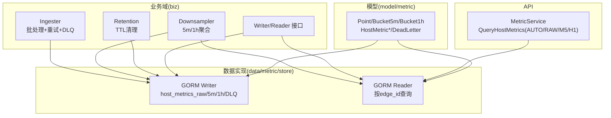
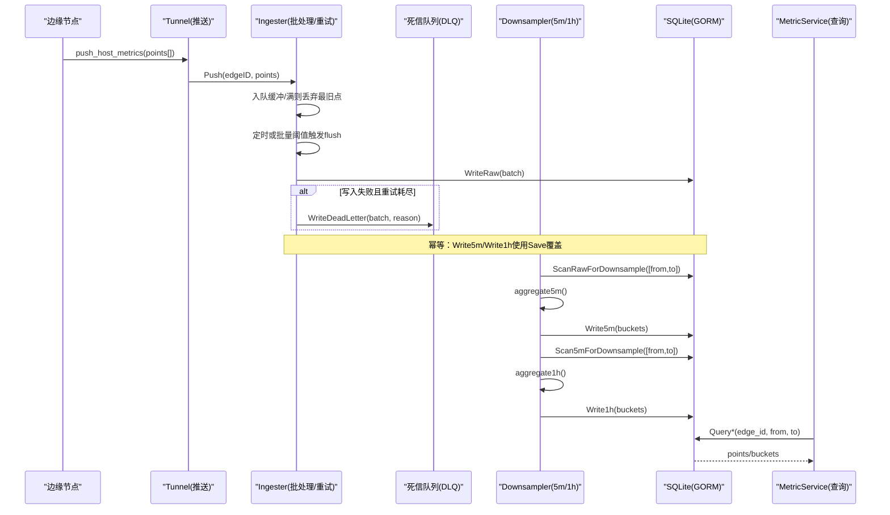
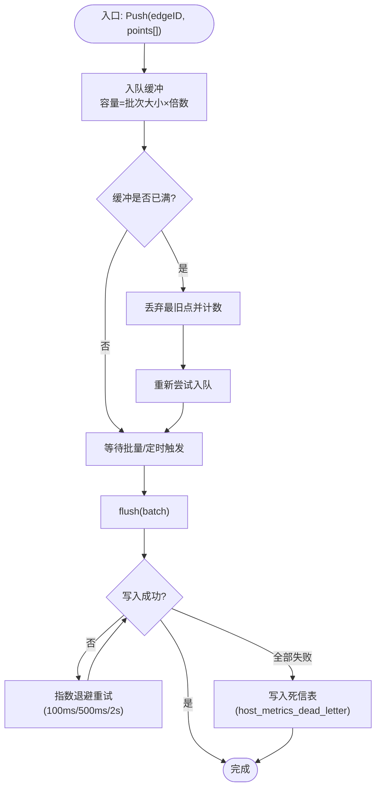
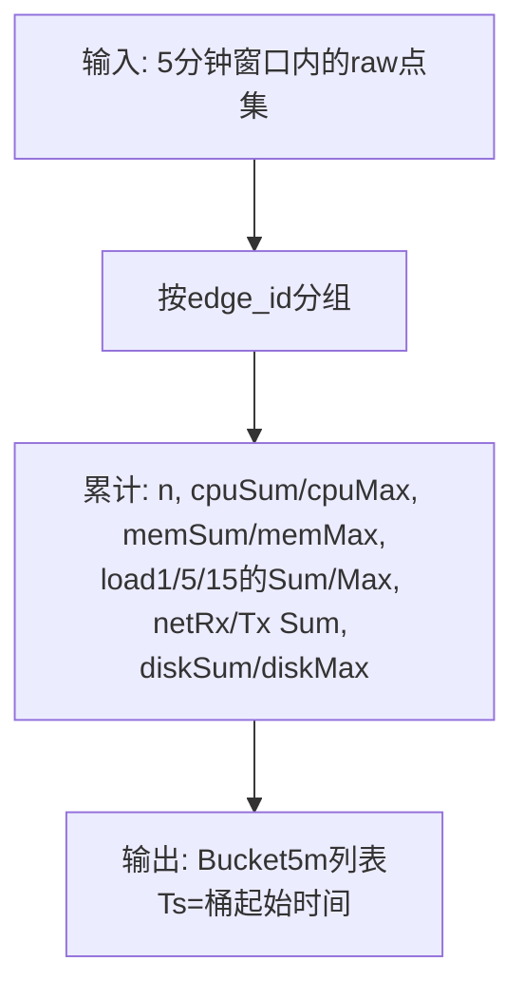
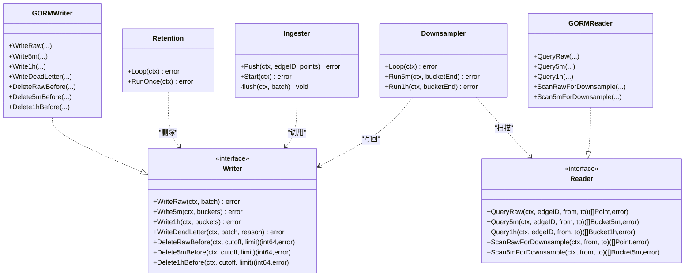

# 时序数据存储

<cite>
**本文引用的文件**   
- [ingester.go](file://internal/manager/biz/metric/ingester.go)
- [downsample.go](file://internal/manager/biz/metric/downsample.go)
- [retention.go](file://internal/manager/biz/metric/retention.go)
- [repo.go](file://internal/manager/biz/metric/repo.go)
- [writer.go](file://internal/manager/data/metric/store/writer.go)
- [reader.go](file://internal/manager/data/metric/store/reader.go)
- [model.go](file://internal/manager/model/metric/model.go)
- [metric.proto](file://api/manager/metric/v1/metric.proto)
</cite>

## 目录
1. [简介](#简介)
2. [项目结构](#项目结构)
3. [核心组件](#核心组件)
4. [架构总览](#架构总览)
5. [详细组件分析](#详细组件分析)
6. [依赖关系分析](#依赖关系分析)
7. [性能与高并发优化](#性能与高并发优化)
8. [查询优化与降采样](#查询优化与降采样)
9. [容量规划指南](#容量规划指南)
10. [故障排查与死信队列](#故障排查与死信队列)
11. [监控指标与健康检查](#监控指标与健康检查)
12. [结论](#结论)

## 简介
本文件面向运维与平台工程师，系统化阐述主机时序数据的存储体系：从原始样本写入、5分钟与1小时聚合的降采样策略，到保留策略、死信队列处理机制与数据完整性保证；并给出高并发写入的性能优化建议、批量与异步处理要点、查询优化与降采样算法说明，以及容量规划与监控健康检查方法。

## 项目结构
时序数据子系统位于 manager 模块内，采用“领域接口 + 数据实现”的分层设计：
- 业务域接口（biz）：定义 Writer/Reader 抽象，屏蔽底层存储细节
- 数据实现（data/metric/store）：基于 GORM 的 SQLite 持久化
- 模型（model/metric）：领域值对象与 GORM 行对象分离
- API（api/manager/metric/v1）：对外提供查询服务（写入由 edge tunnel push_host_metrics 与内部 Ingester 处理）

图表来源
- [ingester.go:1-262](file://internal/manager/biz/metric/ingester.go#L1-L262)
- [downsample.go:1-302](file://internal/manager/biz/metric/downsample.go#L1-L302)
- [retention.go:1-104](file://internal/manager/biz/metric/retention.go#L1-L104)
- [repo.go:1-53](file://internal/manager/biz/metric/repo.go#L1-L53)
- [writer.go:1-183](file://internal/manager/data/metric/store/writer.go#L1-L183)
- [reader.go:1-170](file://internal/manager/data/metric/store/reader.go#L1-L170)
- [model.go:1-189](file://internal/manager/model/metric/model.go#L1-L189)
- [metric.proto:1-55](file://api/manager/metric/v1/metric.proto#L1-L55)

章节来源
- [ingester.go:1-262](file://internal/manager/biz/metric/ingester.go#L1-L262)
- [downsample.go:1-302](file://internal/manager/biz/metric/downsample.go#L1-L302)
- [retention.go:1-104](file://internal/manager/biz/metric/retention.go#L1-L104)
- [repo.go:1-53](file://internal/manager/biz/metric/repo.go#L1-L53)
- [writer.go:1-183](file://internal/manager/data/metric/store/writer.go#L1-L183)
- [reader.go:1-170](file://internal/manager/data/metric/store/reader.go#L1-L170)
- [model.go:1-189](file://internal/manager/model/metric/model.go#L1-L189)
- [metric.proto:1-55](file://api/manager/metric/v1/metric.proto#L1-L55)

## 核心组件
- Ingester：接收边缘上报的原始样本，进行批量化、超时刷新、指数退避重试与死信落盘，保障高吞吐与最终可观测性
- Downsampler：定时扫描 raw/5m 数据，计算 5分钟与1小时聚合，幂等写入
- Retention：按策略删除过期数据（raw 7天、5m 90天、1h 365天），分批执行避免长时间锁表
- Writer/Reader：SQLite/GORM 实现的读写接口，封装建表、索引、批量写入与范围查询
- Model：领域值对象 Point/Bucket5m/Bucket1h 与 GORM 行对象 HostMetric*/DeadLetter 分离，保持 biz 层无存储耦合
- MetricService：对外查询接口，支持 AUTO/RAW/M5/H1 粒度选择

章节来源
- [ingester.go:1-262](file://internal/manager/biz/metric/ingester.go#L1-L262)
- [downsample.go:1-302](file://internal/manager/biz/metric/downsample.go#L1-L302)
- [retention.go:1-104](file://internal/manager/biz/metric/retention.go#L1-L104)
- [repo.go:1-53](file://internal/manager/biz/metric/repo.go#L1-L53)
- [writer.go:1-183](file://internal/manager/data/metric/store/writer.go#L1-L183)
- [reader.go:1-170](file://internal/manager/data/metric/store/reader.go#L1-L170)
- [model.go:1-189](file://internal/manager/model/metric/model.go#L1-L189)
- [metric.proto:1-55](file://api/manager/metric/v1/metric.proto#L1-L55)

## 架构总览
下图展示从边缘采集到后端存储与查询的全链路流程，包括多级聚合与保留策略。

图表来源
- [ingester.go:1-262](file://internal/manager/biz/metric/ingester.go#L1-L262)
- [downsample.go:1-302](file://internal/manager/biz/metric/downsample.go#L1-L302)
- [writer.go:1-183](file://internal/manager/data/metric/store/writer.go#L1-L183)
- [reader.go:1-170](file://internal/manager/data/metric/store/reader.go#L1-L170)
- [metric.proto:1-55](file://api/manager/metric/v1/metric.proto#L1-L55)

## 详细组件分析

### 写入路径与多级存储策略
- 原始样本（raw）：每10秒一次，字段包含 CPU/内存/负载/网络/磁盘使用率等，按 (edge_id, ts) 分区存储于 host_metrics_raw
- 5分钟聚合（5m）：对每个 edge_id 在5分钟窗口内计算 avg/max（仪表类）与 sum（计数器类），主键为 (edge_id, ts)，幂等覆盖
- 1小时聚合（1h）：对同小时内所有5m桶再次聚合，avg/max/sum 规则与5m一致，主键为 (edge_id, ts)

章节来源
- [model.go:1-189](file://internal/manager/model/metric/model.go#L1-L189)
- [writer.go:1-183](file://internal/manager/data/metric/store/writer.go#L1-L183)
- [downsample.go:1-302](file://internal/manager/biz/metric/downsample.go#L1-L302)

#### 写入流程图

图表来源
- [ingester.go:1-262](file://internal/manager/biz/metric/ingester.go#L1-L262)
- [writer.go:1-183](file://internal/manager/data/metric/store/writer.go#L1-L183)

章节来源
- [ingester.go:1-262](file://internal/manager/biz/metric/ingester.go#L1-L262)
- [writer.go:1-183](file://internal/manager/data/metric/store/writer.go#L1-L183)

### 降采样算法（5分钟与1小时）
- 5分钟聚合：按 edge_id 分组，仪表类取平均与最大，计数器类求和，时间戳对齐至5分钟边界（桶起始）
- 1小时聚合：对同小时内所有5m桶等权平均（不重加权样本数），max 取最大值，计数器继续求和
- 调度：Loop 在每个5分钟/1小时边界触发 Run5m/Run1h，确保当前桶不再被读取

章节来源
- [downsample.go:1-302](file://internal/manager/biz/metric/downsample.go#L1-L302)

#### 5分钟聚合伪代码流程

图表来源
- [downsample.go:1-302](file://internal/manager/biz/metric/downsample.go#L1-302)

### 保留策略（TTL）
- 默认保留期：raw 7天、5m 90天、1h 365天
- 每日凌晨（UTC 03:00）执行一次清理，按 tier 循环删除，每次最多删除固定数量（limit=1000），直到返回0条
- 通过 rowid 子查询实现 SQLite 兼容的 LIMIT 删除

章节来源
- [retention.go:1-104](file://internal/manager/biz/metric/retention.go#L1-L104)
- [writer.go:1-183](file://internal/manager/data/metric/store/writer.go#L1-L183)

### 死信队列与数据完整性
- 当 WriteRaw 多次重试仍失败时，整批样本写入 host_metrics_dead_letter，附带错误原因与失败时间
- 死信记录逐点保存，便于审计与后续重放
- 写入失败分类统计（ctx_cancel/write_error），便于监控告警

章节来源
- [ingester.go:1-262](file://internal/manager/biz/metric/ingester.go#L1-L262)
- [writer.go:1-183](file://internal/manager/data/metric/store/writer.go#L1-L183)
- [model.go:1-189](file://internal/manager/model/metric/model.go#L1-L189)

### 查询路径与自动粒度选择
- MetricService.QueryHostMetrics 支持 RESOLUTION_AUTO/RAW/M5/H1
- AUTO 策略：≤6小时 → RAW；≤7天 → M5；>7天 → H1
- 响应中回显实际使用的分辨率，便于前端渲染

章节来源
- [metric.proto:1-55](file://api/manager/metric/v1/metric.proto#L1-L55)
- [reader.go:1-170](file://internal/manager/data/metric/store/reader.go#L1-L170)

## 依赖关系分析
- Ingester 依赖 Writer 接口，具体由 data/metric/store.Writer 实现
- Downsampler 依赖 Reader/Writer，分别用于扫描与写回聚合结果
- Retention 仅依赖 Writer 的 Delete*Before 系列
- Reader/Writer 均依赖 GORM DB 实例与 model 中的 GORM 行类型
- API 层通过 Reader 访问数据，Biz 层通过接口解耦存储实现

图表来源
- [repo.go:1-53](file://internal/manager/biz/metric/repo.go#L1-L53)
- [writer.go:1-183](file://internal/manager/data/metric/store/writer.go#L1-L183)
- [reader.go:1-170](file://internal/manager/data/metric/store/reader.go#L1-L170)
- [ingester.go:1-262](file://internal/manager/biz/metric/ingester.go#L1-L262)
- [downsample.go:1-302](file://internal/manager/biz/metric/downsample.go#L1-L302)
- [retention.go:1-104](file://internal/manager/biz/metric/retention.go#L1-L104)

章节来源
- [repo.go:1-53](file://internal/manager/biz/metric/repo.go#L1-L53)
- [writer.go:1-183](file://internal/manager/data/metric/store/writer.go#L1-L183)
- [reader.go:1-170](file://internal/manager/data/metric/store/reader.go#L1-L170)
- [ingester.go:1-262](file://internal/manager/biz/metric/ingester.go#L1-L262)
- [downsample.go:1-302](file://internal/manager/biz/metric/downsample.go#L1-L302)
- [retention.go:1-104](file://internal/manager/biz/metric/retention.go#L1-L104)

## 性能与高并发优化
- 批处理与缓冲
  - 默认批次大小 500，缓冲容量为批次大小的4倍，达到阈值立即 flush
  - 定时 flush 间隔 5 秒，避免长尾延迟
- 非阻塞写入
  - Push 永不返回错误给调用方，缓冲满时丢弃最旧点并计数，适合丢样可接受的场景
- 重试与退避
  - 失败后以 100ms/500ms/2s 指数退避重试，三次失败后进入死信
- 批量写入
  - GORM CreateInBatches 分片写入（内部批次 500），降低单事务压力
- 幂等聚合
  - 5m/1h 使用 Save 覆盖，重复运行安全
- 低锁删除
  - 保留策略按 limit 分批删除，减少长时间持有数据库锁

章节来源
- [ingester.go:1-262](file://internal/manager/biz/metric/ingester.go#L1-L262)
- [writer.go:1-183](file://internal/manager/data/metric/store/writer.go#L1-L183)
- [downsample.go:1-302](file://internal/manager/biz/metric/downsample.go#L1-L302)
- [retention.go:1-104](file://internal/manager/biz/metric/retention.go#L1-L104)

## 查询优化与降采样
- 自动粒度选择（AUTO）
  - ≤6小时：读 raw，精度最高
  - ≤7天：读 5m，兼顾精度与体积
  - >7天：读 1h，最小体积
- 索引与排序
  - raw/5m/1h 均以 (edge_id, ts) 为主键/索引，查询按 ts ASC 返回
- 聚合一致性
  - 5m/1h 聚合遵循仪表类 avg/max、计数器类 sum 的规则，跨层级保持一致语义

章节来源
- [metric.proto:1-55](file://api/manager/metric/v1/metric.proto#L1-L55)
- [reader.go:1-170](file://internal/manager/data/metric/store/reader.go#L1-L170)
- [downsample.go:1-302](file://internal/manager/biz/metric/downsample.go#L1-L302)
- [model.go:1-189](file://internal/manager/model/metric/model.go#L1-L189)

## 容量规划指南
- 数据量估算
  - 单点字段：CPU/内存/负载(3)/网络(2)/磁盘 ≈ 8个数值字段
  - 原始采样频率：约10秒/点
  - 5m/1h 聚合显著压缩数据体积，长期趋势建议优先查 1h
- 存储与索引
  - 主键 (edge_id, ts) 利于按设备与时间范围检索
  - 注意 SQLite 的 DELETE ... LIMIT 行为，保留策略已用 rowid 子查询规避
- 保留策略调优
  - 根据合规与成本调整 TTL：raw 7d、5m 90d、1h 365d 为默认
  - 若需更长历史，优先依赖 1h 聚合
- 写入吞吐
  - 合理设置批次大小与缓冲倍数，结合 Prometheus 指标观察 ongrid_ingest_batch_size 分布
  - 关注 dropped 与 flush_failures 指标，必要时扩容或优化下游

章节来源
- [retention.go:1-104](file://internal/manager/biz/metric/retention.go#L1-L104)
- [writer.go:1-183](file://internal/manager/data/metric/store/writer.go#L1-L183)
- [model.go:1-189](file://internal/manager/model/metric/model.go#L1-L189)

## 故障排查与死信队列
- 常见问题定位
  - 缓冲溢出：查看 dropped_total{reason="buffer_full"}，考虑增大批次或缓冲倍数
  - 写入失败：查看 flush_failures_total 标签（write_error/ctx_cancel），结合日志定位
  - 死信堆积：查询 host_metrics_dead_letter，按 failed_at 与 error_reason 筛选
- 恢复步骤
  - 修复下游问题后，可从死信表重放失败样本（注意去重与时间顺序）
  - 对 5m/1h 聚合可重跑对应窗口，利用幂等覆盖特性

章节来源
- [ingester.go:1-262](file://internal/manager/biz/metric/ingester.go#L1-L262)
- [writer.go:1-183](file://internal/manager/data/metric/store/writer.go#L1-L183)
- [model.go:1-189](file://internal/manager/model/metric/model.go#L1-L189)

## 监控指标与健康检查
- 关键指标
  - ongrid_ingest_writes_total{result=success|fail}：批次写入结果
  - ongrid_ingest_flush_failures_total{reason}：重试耗尽原因
  - ongrid_ingest_dropped_total{reason}：缓冲溢出丢弃计数
  - ongrid_ingest_batch_size：批次大小直方图
- 健康检查建议
  - 监控上述指标突增（尤其是 dropped 与 fail）
  - 定期巡检死信表行数与最近失败时间
  - 验证 5m/1h 聚合任务是否按时产出新桶

章节来源
- [ingester.go:1-262](file://internal/manager/biz/metric/ingester.go#L1-L262)

## 结论
本时序存储子系统通过“批处理+指数退避+死信”的写入路径、“5m/1h 两级聚合”的降采样策略与“分层TTL”的保留策略，实现了高吞吐、可观测、可扩展的主机指标存储方案。配合自动粒度查询与完善的监控指标，可在不同规模下稳定运行并提供良好的运维体验。