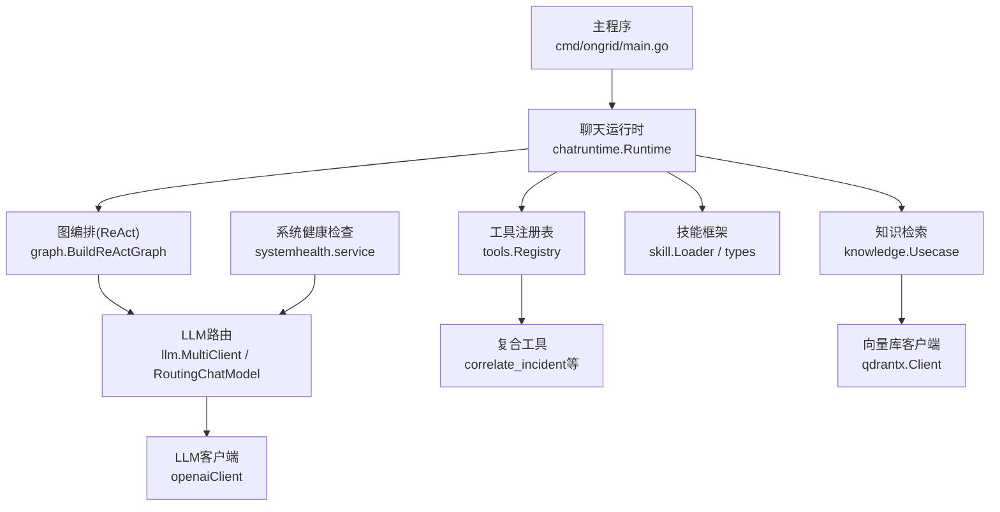
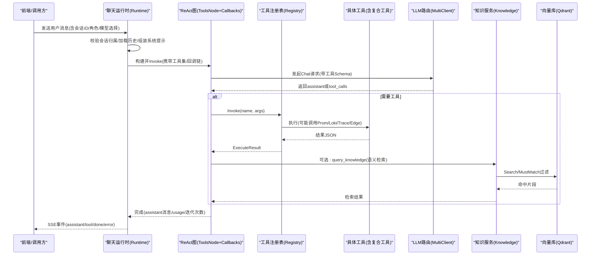
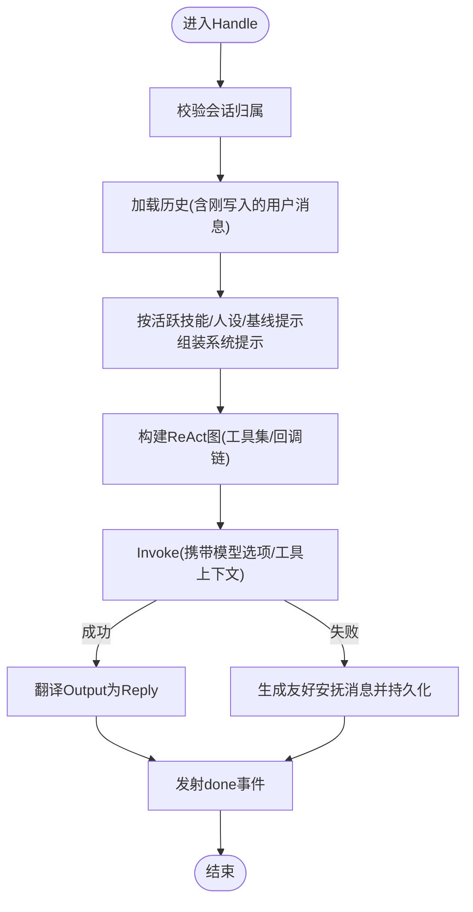
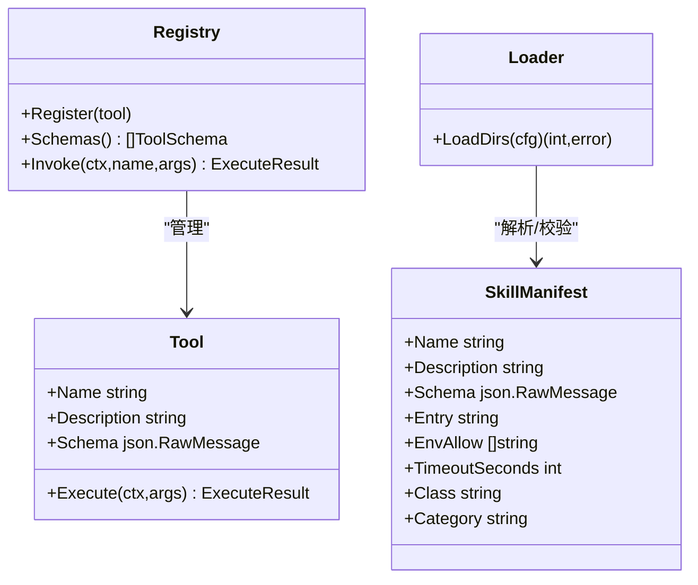
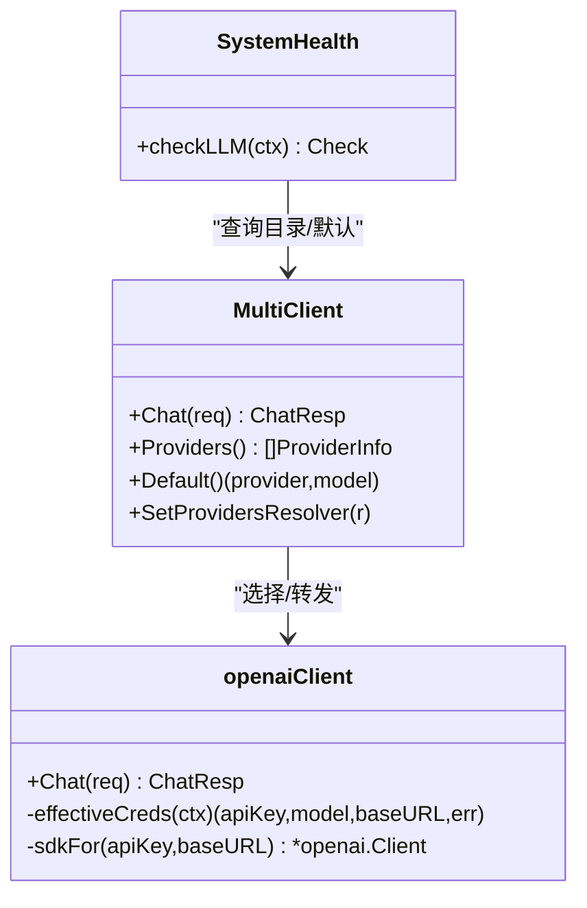
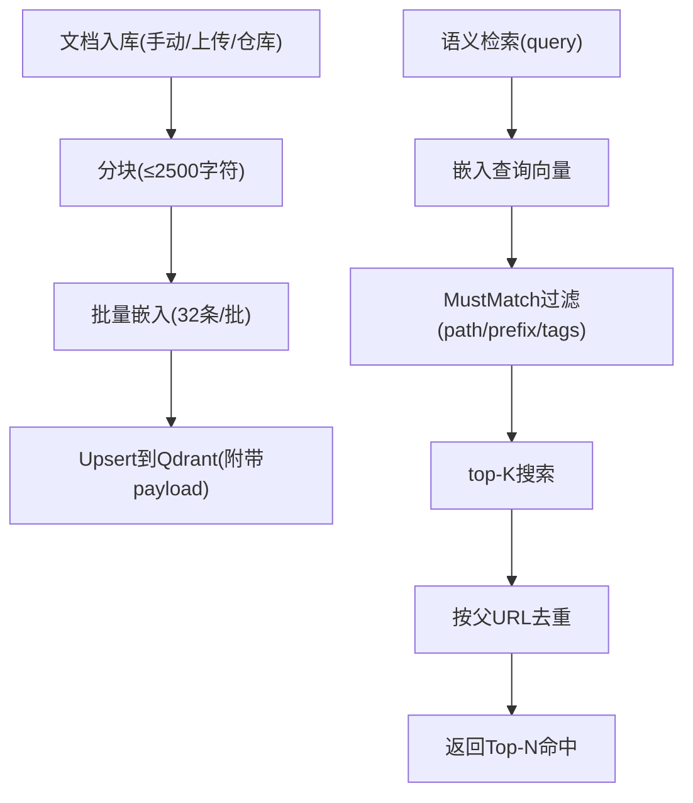
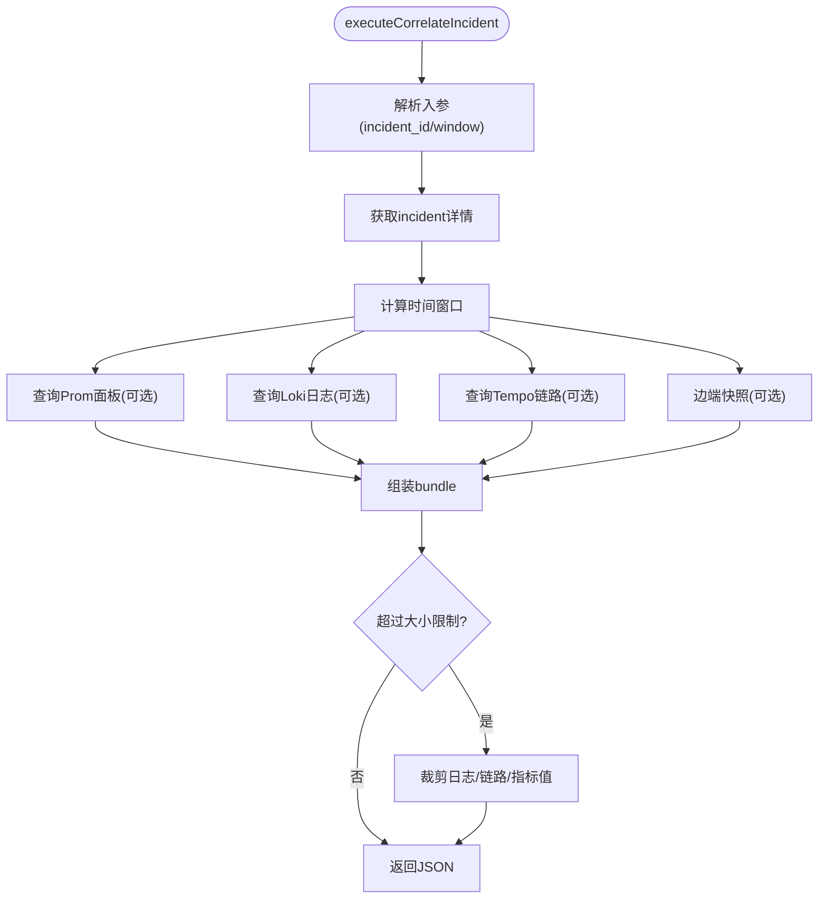
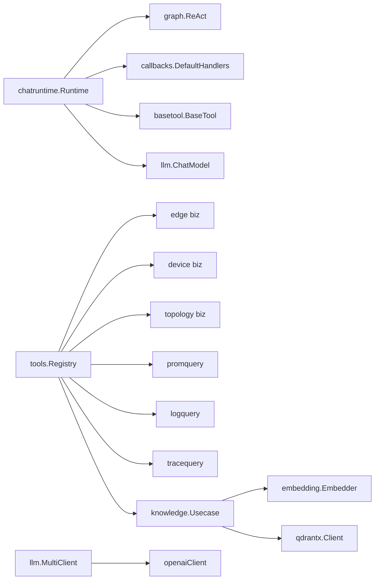

# AI智能运维业务域

<cite>
**本文引用的文件**   
- [cmd/ongrid/main.go](file://cmd/ongrid/main.go)
- [internal/manager/biz/aiops/chatruntime/runtime.go](file://internal/manager/biz/aiops/chatruntime/runtime.go)
- [internal/manager/biz/aiops/tools/registry.go](file://internal/manager/biz/aiops/tools/registry.go)
- [internal/manager/biz/aiops/tools/correlate_incident.go](file://internal/manager/biz/aiops/tools/correlate_incident.go)
- [internal/pkg/llm/router.go](file://internal/pkg/llm/router.go)
- [internal/pkg/llm/client.go](file://internal/pkg/llm/client.go)
- [internal/skill/loader.go](file://internal/skill/loader.go)
- [internal/skill/types.go](file://internal/skill/types.go)
- [internal/manager/biz/knowledge/usecase.go](file://internal/manager/biz/knowledge/usecase.go)
- [internal/pkg/qdrantx/client.go](file://internal/pkg/qdrantx/client.go)
- [internal/manager/service/systemhealth/service.go](file://internal/manager/service/systemhealth/service.go)
- [docs/workflow-catalog.md](file://docs/workflow-catalog.md)
</cite>

## 目录
1. [引言](#引言)
2. [项目结构](#项目结构)
3. [核心组件](#核心组件)
4. [架构总览](#架构总览)
5. [详细组件分析](#详细组件分析)
6. [依赖关系分析](#依赖关系分析)
7. [性能与成本](#性能与成本)
8. [故障排查指南](#故障排查指南)
9. [结论](#结论)
10. [附录](#附录)

## 引言
本文件面向AI智能运维（AIOps）业务域，系统性阐述以下能力：
- AI工作流编排与执行引擎：基于图（Graph）的ReAct循环、回调链、SSE事件流与会话持久化。
- 聊天运行时环境、会话管理与上下文维护：权限控制、角色裁剪工具集、@提及内联、历史回放与动态提示。
- 工具调用框架、参数校验与安全沙箱：BaseTool注册、装饰器链、子进程技能包与路径白名单。
- 多LLM提供商集成、负载均衡与故障转移：路由模型、默认解析器、预算与指标。
- 知识库检索增强（RAG）、向量搜索与语义匹配：文档分块、嵌入、Qdrant索引与过滤。
- AI工具开发指南、插件接口定义与测试方法：Skill元数据、外部技能加载、注册与验证。
- 监控、成本控制与资源调度：Prometheus指标、预算检查、并发与超时策略。

## 项目结构
围绕AIOps的关键代码分布在如下模块：
- 运行入口与装配：cmd/ongrid/main.go
- 聊天运行时与图编排：internal/manager/biz/aiops/chatruntime
- 工具注册与复合工具：internal/manager/biz/aiops/tools
- LLM客户端与多提供商路由：internal/pkg/llm
- 技能（Skill）框架与外部加载：internal/skill
- 知识库与RAG：internal/manager/biz/knowledge + internal/pkg/qdrantx
- 系统健康探针：internal/manager/service/systemhealth

图表来源
- [cmd/ongrid/main.go:3397-3430](file://cmd/ongrid/main.go#L3397-L3430)
- [internal/manager/biz/aiops/chatruntime/runtime.go:654-755](file://internal/manager/biz/aiops/chatruntime/runtime.go#L654-L755)
- [internal/pkg/llm/router.go:289-334](file://internal/pkg/llm/router.go#L289-L334)
- [internal/pkg/llm/client.go:345-448](file://internal/pkg/llm/client.go#L345-L448)
- [internal/manager/biz/aiops/tools/registry.go:179-310](file://internal/manager/biz/aiops/tools/registry.go#L179-L310)
- [internal/manager/biz/aiops/tools/correlate_incident.go:159-298](file://internal/manager/biz/aiops/tools/correlate_incident.go#L159-L298)
- [internal/manager/biz/knowledge/usecase.go:121-167](file://internal/manager/biz/knowledge/usecase.go#L121-L167)
- [internal/pkg/qdrantx/client.go:51-116](file://internal/pkg/qdrantx/client.go#L51-L116)
- [internal/skill/loader.go:75-110](file://internal/skill/loader.go#L75-L110)
- [internal/manager/service/systemhealth/service.go:356-386](file://internal/manager/service/systemhealth/service.go#L356-L386)

章节来源
- [cmd/ongrid/main.go:3397-3430](file://cmd/ongrid/main.go#L3397-L3430)
- [internal/manager/biz/aiops/chatruntime/runtime.go:446-755](file://internal/manager/biz/aiops/chatruntime/runtime.go#L446-L755)
- [internal/manager/biz/aiops/tools/registry.go:179-310](file://internal/manager/biz/aiops/tools/registry.go#L179-L310)
- [internal/pkg/llm/router.go:289-334](file://internal/pkg/llm/router.go#L289-L334)
- [internal/pkg/llm/client.go:345-448](file://internal/pkg/llm/client.go#L345-L448)
- [internal/skill/loader.go:75-110](file://internal/skill/loader.go#L75-L110)
- [internal/manager/biz/knowledge/usecase.go:121-167](file://internal/manager/biz/knowledge/usecase.go#L121-L167)
- [internal/pkg/qdrantx/client.go:51-116](file://internal/pkg/qdrantx/client.go#L51-L116)
- [internal/manager/service/systemhealth/service.go:356-386](file://internal/manager/service/systemhealth/service.go#L356-L386)

## 核心组件
- 聊天运行时（Runtime）：负责会话所有权校验、@提及内联、历史加载、系统提示组装、图构建与回调链、SSE事件适配、错误安抚消息与Reply翻译。
- 工具注册表（Registry）：声明式注册工具（名称、描述、JSON Schema、执行器），按依赖条件选择性注册复合工具（如关联告警）。
- LLM路由与客户端：MultiClient按Provider选择子客户端；openaiClient封装OpenAI兼容API，支持动态凭证解析、预算检查、指标上报。
- 知识服务（Knowledge Usecase）：文档入库（手动/上传/仓库同步）、分块、嵌入、Qdrant Upsert/Scroll/Search、去重与路径前缀索引。
- 技能框架（Skill）：统一元数据与执行器抽象，支持Manager侧子进程执行与外部技能包加载，严格的路径与环境白名单。

章节来源
- [internal/manager/biz/aiops/chatruntime/runtime.go:446-755](file://internal/manager/biz/aiops/chatruntime/runtime.go#L446-L755)
- [internal/manager/biz/aiops/tools/registry.go:179-310](file://internal/manager/biz/aiops/tools/registry.go#L179-L310)
- [internal/pkg/llm/router.go:289-334](file://internal/pkg/llm/router.go#L289-L334)
- [internal/pkg/llm/client.go:345-448](file://internal/pkg/llm/client.go#L345-L448)
- [internal/manager/biz/knowledge/usecase.go:121-167](file://internal/manager/biz/knowledge/usecase.go#L121-L167)
- [internal/skill/types.go:99-175](file://internal/skill/types.go#L99-L175)
- [internal/skill/loader.go:75-110](file://internal/skill/loader.go#L75-L110)

## 架构总览
下图展示一次用户对话从HTTP到LLM返回的端到端流程，包括图编排、工具调用、知识检索与SSE事件流。

图表来源
- [internal/manager/biz/aiops/chatruntime/runtime.go:654-755](file://internal/manager/biz/aiops/chatruntime/runtime.go#L654-L755)
- [internal/manager/biz/aiops/tools/registry.go:369-383](file://internal/manager/biz/aiops/tools/registry.go#L369-L383)
- [internal/manager/biz/aiops/tools/correlate_incident.go:159-298](file://internal/manager/biz/aiops/tools/correlate_incident.go#L159-L298)
- [internal/manager/biz/knowledge/usecase.go:732-800](file://internal/manager/biz/knowledge/usecase.go#L732-L800)
- [internal/pkg/qdrantx/client.go:273-302](file://internal/pkg/qdrantx/client.go#L273-L302)
- [internal/pkg/llm/router.go:289-334](file://internal/pkg/llm/router.go#L289-L334)

## 详细组件分析

### 聊天运行时与图编排
- 职责边界：会话所有权校验、@提及内联、历史加载、系统提示拼装、图构建、回调链（持久化/SSE/审计/预算）、错误安抚与Reply翻译。
- 关键机制：
  - 历史回放：将持久化的消息行转换为eino schema.Message，修复并行导致的tool消息缺失，避免上游拒绝。
  - 动态提示：检测连续失败/重复调用/未执行的“承诺”等模式，注入<system-reminder>引导收敛。
  - 角色与权限：根据角色与全局写开关裁剪工具集，协调员仅暴露AgentTool等编排工具。
  - SSE适配：将新事件名映射为旧格式，保持SPA兼容。

图表来源
- [internal/manager/biz/aiops/chatruntime/runtime.go:446-755](file://internal/manager/biz/aiops/chatruntime/runtime.go#L446-L755)
- [internal/manager/biz/aiops/chatruntime/runtime.go:914-1062](file://internal/manager/biz/aiops/chatruntime/runtime.go#L914-L1062)
- [internal/manager/biz/aiops/chatruntime/runtime.go:1124-1151](file://internal/manager/biz/aiops/chatruntime/runtime.go#L1124-L1151)
- [internal/manager/biz/aiops/chatruntime/runtime.go:1440-1515](file://internal/manager/biz/aiops/chatruntime/runtime.go#L1440-L1515)

章节来源
- [internal/manager/biz/aiops/chatruntime/runtime.go:446-755](file://internal/manager/biz/aiops/chatruntime/runtime.go#L446-L755)
- [internal/manager/biz/aiops/chatruntime/runtime.go:914-1062](file://internal/manager/biz/aiops/chatruntime/runtime.go#L914-L1062)
- [internal/manager/biz/aiops/chatruntime/runtime.go:1124-1151](file://internal/manager/biz/aiops/chatruntime/runtime.go#L1124-L1151)
- [internal/manager/biz/aiops/chatruntime/runtime.go:1440-1515](file://internal/manager/biz/aiops/chatruntime/runtime.go#L1440-L1515)

### 工具调用框架与参数校验
- 注册方式：以(name, description, JSON Schema, executor)四元组注册；按需组合注册复合工具（如correlate_incident需prom/log/trace/alert全量可用）。
- 执行路径：图通过ToolsNode分发至Registry.Invoke，再调用对应Execute；结果以JSON返回给LLM。
- 参数校验：JSON Schema由注册时提供，客户端在构造OpenAI请求前进行合法性校验，避免远端报错。
- 安全与沙箱：
  - BaseTool装饰器链可附加审计、限流、预算等横切逻辑。
  - 子进程技能包通过Loader扫描manifest，强制绝对路径、符号链接解析、允许根目录白名单、环境变量白名单与超时控制。

图表来源
- [internal/manager/biz/aiops/tools/registry.go:179-310](file://internal/manager/biz/aiops/tools/registry.go#L179-L310)
- [internal/manager/biz/aiops/tools/registry.go:369-383](file://internal/manager/biz/aiops/tools/registry.go#L369-L383)
- [internal/skill/loader.go:75-110](file://internal/skill/loader.go#L75-L110)
- [internal/skill/loader.go:164-174](file://internal/skill/loader.go#L164-L174)
- [internal/skill/loader.go:179-254](file://internal/skill/loader.go#L179-L254)

章节来源
- [internal/manager/biz/aiops/tools/registry.go:179-310](file://internal/manager/biz/aiops/tools/registry.go#L179-L310)
- [internal/manager/biz/aiops/tools/registry.go:369-383](file://internal/manager/biz/aiops/tools/registry.go#L369-L383)
- [internal/skill/loader.go:75-110](file://internal/skill/loader.go#L75-L110)
- [internal/skill/loader.go:164-174](file://internal/skill/loader.go#L164-L174)
- [internal/skill/loader.go:179-254](file://internal/skill/loader.go#L179-L254)

### 多LLM提供商集成、负载均衡与故障转移
- 路由层：MultiClient按ChatReq.Provider选择子客户端；空Provider回退到默认Provider；支持动态ProvidersResolver刷新配置（TTL缓存）。
- 客户端层：openaiClient封装OpenAI兼容API，支持动态凭证解析、Zhipu JWT重写、预算检查、指标记录。
- 健康检查：systemhealth对LLM provider目录与健康状态进行探测，输出OK/Degraded/Failure。

图表来源
- [internal/pkg/llm/router.go:289-334](file://internal/pkg/llm/router.go#L289-L334)
- [internal/pkg/llm/client.go:345-448](file://internal/pkg/llm/client.go#L345-L448)
- [internal/manager/service/systemhealth/service.go:356-386](file://internal/manager/service/systemhealth/service.go#L356-L386)

章节来源
- [internal/pkg/llm/router.go:289-334](file://internal/pkg/llm/router.go#L289-L334)
- [internal/pkg/llm/client.go:345-448](file://internal/pkg/llm/client.go#L345-L448)
- [internal/manager/service/systemhealth/service.go:356-386](file://internal/manager/service/systemhealth/service.go#L356-L386)

### 知识库检索增强（RAG）、向量搜索与语义匹配
- 入库流程：手动/上传/仓库同步 → 分块(chunk) → 嵌入(embedding) → Qdrant Upsert；删除旧点集保证原子替换。
- 搜索流程：嵌入查询向量 → Qdrant top-K搜索 → 服务端MustMatch过滤（path/path_prefixes/tags）→ 去重（parent_url/url）→ 返回Top-N。
- 索引优化：创建keyword/text索引字段，提升过滤效率；路径前缀数组用于严格目录树语义。

图表来源
- [internal/manager/biz/knowledge/usecase.go:121-167](file://internal/manager/biz/knowledge/usecase.go#L121-L167)
- [internal/manager/biz/knowledge/usecase.go:732-800](file://internal/manager/biz/knowledge/usecase.go#L732-L800)
- [internal/pkg/qdrantx/client.go:130-150](file://internal/pkg/qdrantx/client.go#L130-L150)
- [internal/pkg/qdrantx/client.go:273-302](file://internal/pkg/qdrantx/client.go#L273-L302)

章节来源
- [internal/manager/biz/knowledge/usecase.go:121-167](file://internal/manager/biz/knowledge/usecase.go#L121-L167)
- [internal/manager/biz/knowledge/usecase.go:732-800](file://internal/manager/biz/knowledge/usecase.go#L732-L800)
- [internal/pkg/qdrantx/client.go:130-150](file://internal/pkg/qdrantx/client.go#L130-L150)
- [internal/pkg/qdrantx/client.go:273-302](file://internal/pkg/qdrantx/client.go#L273-L302)

### 复合工具：事件关联（Correlate Incident）
- 目标：一次性聚合指标、日志、链路、边端快照，减少多次往返。
- 实现要点：
  - 时间窗口：以incident.first_fired_at为中心对称窗口。
  - 面板裁剪：整体响应上限（~100KB），优先裁剪日志/链路，必要时丢弃metric值保留labels。
  - 降级策略：任一上游不可用则标记skipped，不阻断整体返回。

图表来源
- [internal/manager/biz/aiops/tools/correlate_incident.go:159-298](file://internal/manager/biz/aiops/tools/correlate_incident.go#L159-L298)
- [internal/manager/biz/aiops/tools/correlate_incident.go:649-694](file://internal/manager/biz/aiops/tools/correlate_incident.go#L649-L694)

章节来源
- [internal/manager/biz/aiops/tools/correlate_incident.go:159-298](file://internal/manager/biz/aiops/tools/correlate_incident.go#L159-L298)
- [internal/manager/biz/aiops/tools/correlate_incident.go:649-694](file://internal/manager/biz/aiops/tools/correlate_incident.go#L649-L694)

### AI工具开发指南与插件接口
- 元数据规范：Skill.Metadata包含Key/Name/Description/Class/Scope/Params/ResultPreview等，注册时校验一致性。
- 执行器接口：Executor.Metadata + Execute(params) -> result，支持RawSchemaProvider自定义JSON Schema。
- 外部技能包：skill.json清单驱动，Loader校验name/entry/env_allow/class/category/timeout，并限制entry路径在允许根目录下。
- 测试建议：
  - 使用fake Caller/Usecase注入替代真实后端。
  - 覆盖参数非法、上游超时、返回过大等边界场景。
  - 针对子进程技能，模拟超时与退出码，验证沙箱隔离。

章节来源
- [internal/skill/types.go:99-175](file://internal/skill/types.go#L99-L175)
- [internal/skill/types.go:190-203](file://internal/skill/types.go#L190-L203)
- [internal/skill/loader.go:75-110](file://internal/skill/loader.go#L75-L110)
- [internal/skill/loader.go:179-254](file://internal/skill/loader.go#L179-L254)

## 依赖关系分析
- 组件耦合：
  - chatruntime依赖graph、callbacks、basetool、llm、biz session repo。
  - tools.registry依赖edge/device/topology/alert/prom/log/trace/knowledge等usecase。
  - knowledge.usecase依赖embedding与qdrantx。
  - llm.router与client解耦具体提供商，通过Config/BaseURL/APIKey/Resolver注入。
- 潜在环依赖规避：
  - chatruntime不直接import tools包，通过ToolBagProvider与回调链间接协作。
  - registry通过post-construction setter注入spawner/audit/page等依赖，避免启动顺序死锁。

图表来源
- [internal/manager/biz/aiops/chatruntime/runtime.go:654-755](file://internal/manager/biz/aiops/chatruntime/runtime.go#L654-L755)
- [internal/manager/biz/aiops/tools/registry.go:179-310](file://internal/manager/biz/aiops/tools/registry.go#L179-L310)
- [internal/manager/biz/knowledge/usecase.go:121-167](file://internal/manager/biz/knowledge/usecase.go#L121-L167)
- [internal/pkg/llm/router.go:289-334](file://internal/pkg/llm/router.go#L289-L334)
- [internal/pkg/llm/client.go:345-448](file://internal/pkg/llm/client.go#L345-L448)

章节来源
- [internal/manager/biz/aiops/chatruntime/runtime.go:654-755](file://internal/manager/biz/aiops/chatruntime/runtime.go#L654-L755)
- [internal/manager/biz/aiops/tools/registry.go:179-310](file://internal/manager/biz/aiops/tools/registry.go#L179-L310)
- [internal/manager/biz/knowledge/usecase.go:121-167](file://internal/manager/biz/knowledge/usecase.go#L121-L167)
- [internal/pkg/llm/router.go:289-334](file://internal/pkg/llm/router.go#L289-L334)
- [internal/pkg/llm/client.go:345-448](file://internal/pkg/llm/client.go#L345-L448)

## 性能与成本
- 并发与超时：
  - 调查器（investigator）默认3个工作协程、队列深度100、LLM超时120s，防止风暴下过度消耗。
  - correlate_incident整体超时60s，各子调用独立短超时，避免单点拖慢。
- 预算与配额：
  - openaiClient在请求前估算token数做预算拦截，成功后记录实际用量；Router统计provider/model/status维度指标。
- 资源调度：
  - 图每请求重建（轻量），未来可按(toolBag标识,cfg)缓存。
  - Knowledge同步采用“快速路径+原子替换”，失败重试与WaitDelay清理管道，保障稳定。

章节来源
- [internal/manager/biz/aiops/investigator/investigator.go:87-124](file://internal/manager/biz/aiops/investigator/investigator.go#L87-L124)
- [internal/manager/biz/aiops/tools/correlate_incident.go:60-68](file://internal/manager/biz/aiops/tools/correlate_incident.go#L60-L68)
- [internal/pkg/llm/client.go:345-448](file://internal/pkg/llm/client.go#L345-L448)
- [internal/pkg/llm/router.go:289-334](file://internal/pkg/llm/router.go#L289-L334)
- [internal/manager/biz/knowledge/usecase.go:1432-1511](file://internal/manager/biz/knowledge/usecase.go#L1432-L1511)

## 故障排查指南
- LLM不可用/配额不足：
  - 现象：路由层返回error/rate_limited/insufficient_quota等；系统健康检查显示Degraded。
  - 处理：检查Provider配置、余额、网络连通性；查看metrics标签status分类。
- 工具调用失败：
  - 现象：tool_end事件携带error；连续失败触发动态提示。
  - 处理：核对JSON Schema与参数；检查上游Prom/Loki/Tempo/Edge可用性；关注correlate_incident的skipped字段。
- 会话历史异常：
  - 现象：上游拒绝“tool messages must be followed by tool responses”。
  - 处理：确认buildEinoHistory的tool消息配对与hoist逻辑；必要时新建会话。
- 知识库检索无结果：
  - 现象：Search返回空或数量不足。
  - 处理：确认collection存在且dim匹配；检查payload索引是否创建；验证MustMatch过滤条件；观察是否有chunk_index去重问题。

章节来源
- [internal/manager/service/systemhealth/service.go:356-386](file://internal/manager/service/systemhealth/service.go#L356-L386)
- [internal/manager/biz/aiops/chatruntime/runtime.go:1440-1515](file://internal/manager/biz/aiops/chatruntime/runtime.go#L1440-L1515)
- [internal/manager/biz/aiops/chatruntime/runtime.go:914-1062](file://internal/manager/biz/aiops/chatruntime/runtime.go#L914-L1062)
- [internal/manager/biz/knowledge/usecase.go:121-167](file://internal/manager/biz/knowledge/usecase.go#L121-L167)

## 结论
本业务域以“图编排+工具注册+多LLM路由+RAG”为核心，形成高可用、可扩展、可观测的AI智能运维平台。通过严格的权限与沙箱控制、完善的错误安抚与动态提示、以及稳健的知识入库与检索管线，既保障了用户体验，也兼顾了成本与稳定性。后续可在图缓存、更细粒度限流、更多诊断工具与自动化闭环方面持续演进。

## 附录
- 工具目录参考：设备/拓扑/告警/知识等工具清单与说明见工作流目录。

章节来源
- [docs/workflow-catalog.md:40-72](file://docs/workflow-catalog.md#L40-L72)