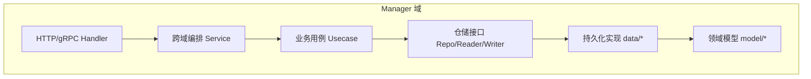
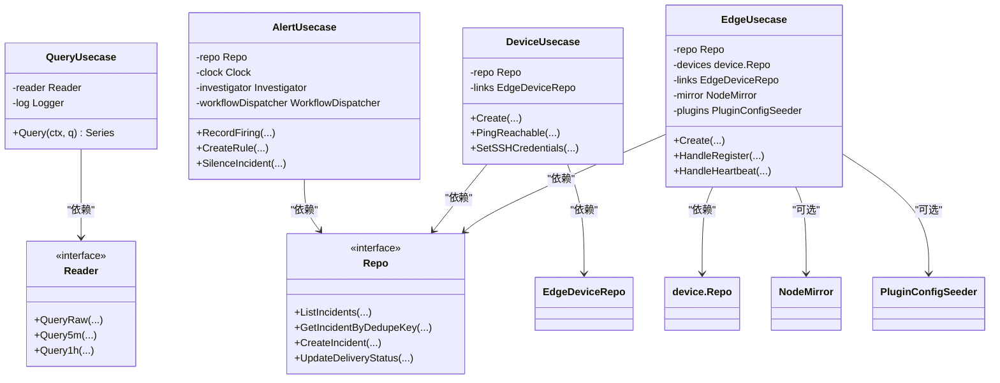
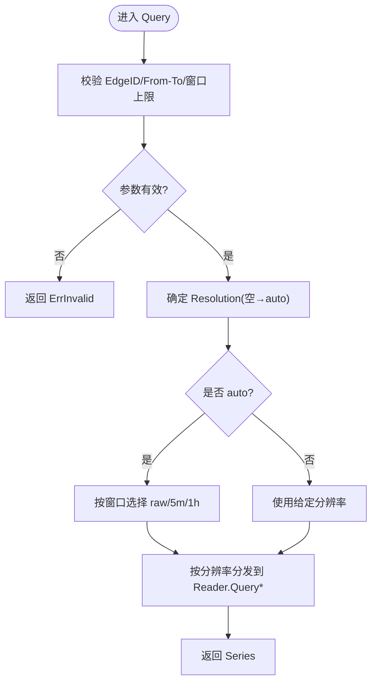
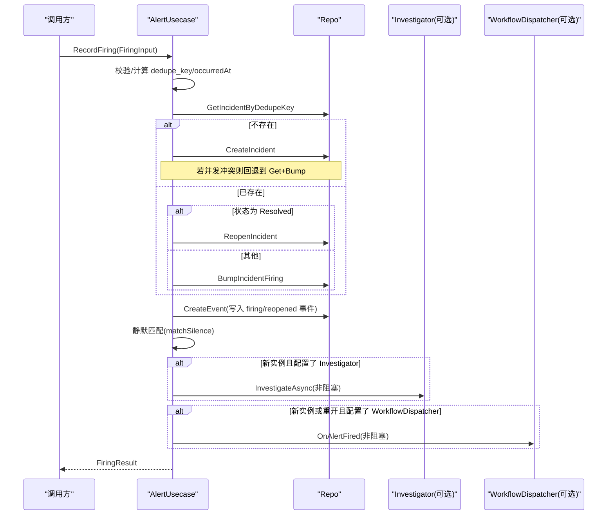
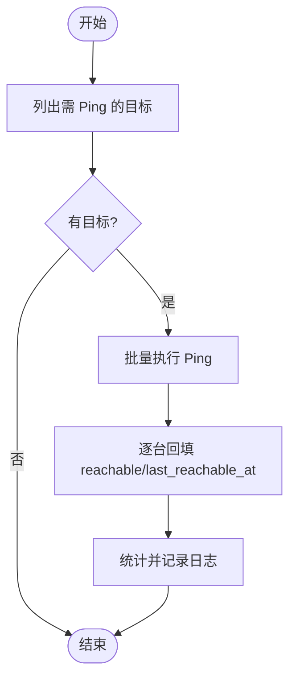
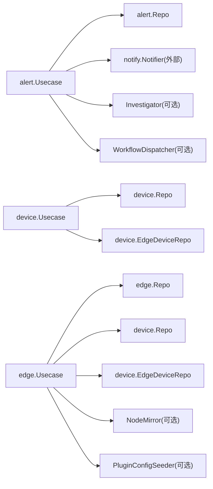

# 业务逻辑层 (Business Layer)

<cite>
**本文引用的文件**   
- [README.md](file://README.md)
- [query.go](file://internal/manager/biz/metric/query.go)
- [repo.go](file://internal/manager/biz/metric/repo.go)
- [usecase.go](file://internal/manager/biz/alert/usecase.go)
- [repo.go](file://internal/manager/biz/alert/repo.go)
- [usecase.go](file://internal/manager/biz/device/usecase.go)
- [repo.go](file://internal/manager/biz/device/repo.go)
- [usecase.go](file://internal/manager/biz/edge/usecase.go)
- [repo.go](file://internal/manager/biz/edge/repo.go)
</cite>

## 目录
1. [简介](#简介)
2. [项目结构](#项目结构)
3. [核心组件](#核心组件)
4. [架构总览](#架构总览)
5. [详细组件分析](#详细组件分析)
6. [依赖关系分析](#依赖关系分析)
7. [性能考量](#性能考量)
8. [故障排查指南](#故障排查指南)
9. [结论](#结论)
10. [附录](#附录)

## 简介
本文件聚焦 Ongrid 管理端（manager）的业务逻辑层，围绕 Usecase 模式、领域模型、业务规则与用例编排展开。文档基于仓库中 manager 域下的 biz 子包进行深度解析，涵盖：
- 接口抽象与依赖注入
- 事务边界与并发控制
- 错误传播与可观测性
- 数据转换与验证
- 领域驱动设计原则、聚合根与值对象
- 单元测试策略与最佳实践

## 项目结构
manager 域采用分层组织：server → service → biz → data → model。biz 层面向“用例 + 领域模型”，通过接口（Repo/Reader/Writer 等）与持久化实现解耦，避免直接依赖具体存储或外部系统。



图表来源
- [README.md:1-96](file://README.md#L1-L96)

章节来源
- [README.md:1-96](file://README.md#L1-L96)

## 核心组件
本节选取三个典型子域作为代表：告警（alert）、设备（device）、边缘节点（edge），以及指标查询（metric）。它们共同体现了 Usecase 模式的统一范式：输入校验、领域规则、调用仓储、事件/副作用处理、错误包装与日志。

- 指标查询用例（QueryUsecase）
  - 职责：对时间窗口与分辨率进行校验与自动选择，委派到 Reader 的相应方法。
  - 关键行为：参数校验、分辨率自动推导、按分辨率路由到 raw/5m/1h 查询。
  - 错误：使用 errs.ErrInvalid 包装非法参数。
  - 参考路径：[query.go:56-133](file://internal/manager/biz/metric/query.go#L56-L133)、[repo.go:1-53](file://internal/manager/biz/metric/repo.go#L1-L53)

- 告警用例（alert.Usecase）
  - 职责：Incident 生命周期、Firing 路径、静默匹配、通知投递记录、规则 CRUD。
  - 关键行为：去重键生成、新建/重开/增量更新、静默与冷却门控、异步 AI 调查与工作流触发。
  - 并发：对同一 dedupe_key 的并发写入做竞态恢复；事件写入失败降级为警告。
  - 错误：errs.ErrNotWiredYet、ErrInvalid、ErrConflict、ErrForbidden 等。
  - 参考路径：[usecase.go:72-800](file://internal/manager/biz/alert/usecase.go#L72-L800)、[repo.go:1-112](file://internal/manager/biz/alert/repo.go#L1-L112)

- 设备用例（device.Usecase）
  - 职责：设备创建、角色与可达性、SSH 凭据管理、软删除/恢复、存在性协调。
  - 关键行为：严格校验 SSH 认证方式与端口范围；批量 Ping 探活并回填结果；手动指纹前缀与自动注册迁移。
  - 错误：ErrInvalid 用于不合法输入；部分写失败降级为 Warn。
  - 参考路径：[usecase.go:1-524](file://internal/manager/biz/device/usecase.go#L1-L524)、[repo.go:1-198](file://internal/manager/biz/device/repo.go#L1-L198)

- 边缘节点用例（edge.Usecase）
  - 职责：Edge 创建、注册/心跳/下线、密钥轮换、默认插件配置播种、拓扑镜像桥接。
  - 关键行为：AccessKeyID/SecretKey 生成与哈希；注册时 upsert Device、建立 M:N 关联、回补显示名与任务名；心跳刷新 last_seen。
  - 并发与健壮性：非关键步骤（如拓扑镜像、默认插件播种）失败仅 Warn，不阻塞主流程。
  - 参考路径：[usecase.go:1-588](file://internal/manager/biz/edge/usecase.go#L1-L588)、[repo.go:1-73](file://internal/manager/biz/edge/repo.go#L1-L73)

章节来源
- [query.go:56-133](file://internal/manager/biz/metric/query.go#L56-L133)
- [repo.go:1-53](file://internal/manager/biz/metric/repo.go#L1-L53)
- [usecase.go:72-800](file://internal/manager/biz/alert/usecase.go#L72-L800)
- [repo.go:1-112](file://internal/manager/biz/alert/repo.go#L1-L112)
- [usecase.go:1-524](file://internal/manager/biz/device/usecase.go#L1-L524)
- [repo.go:1-198](file://internal/manager/biz/device/repo.go#L1-L198)
- [usecase.go:1-588](file://internal/manager/biz/edge/usecase.go#L1-L588)
- [repo.go:1-73](file://internal/manager/biz/edge/repo.go#L1-L73)

## 架构总览
Usecase 模式在 manager 域中的落地要点：
- 接口在消费方定义，避免循环依赖；构造依赖通过构造函数注入，不使用全局变量。
- biz 层只依赖接口（Repo/Reader/Writer/Notifier/Investigator/WorkflowDispatcher 等），由上层装配。
- 错误类型集中定义（errs.*），用例层统一包装返回，便于调用方判断与重试。
- 可选依赖（如 Investigator、WorkflowDispatcher、NodeMirror、PluginConfigSeeder）以 nil-safe 方式提供，未注入时优雅降级。



图表来源
- [query.go:56-133](file://internal/manager/biz/metric/query.go#L56-L133)
- [repo.go:1-53](file://internal/manager/biz/metric/repo.go#L1-L53)
- [usecase.go:72-800](file://internal/manager/biz/alert/usecase.go#L72-L800)
- [repo.go:1-112](file://internal/manager/biz/alert/repo.go#L1-L112)
- [usecase.go:1-524](file://internal/manager/biz/device/usecase.go#L1-L524)
- [repo.go:1-198](file://internal/manager/biz/device/repo.go#L1-L198)
- [usecase.go:1-588](file://internal/manager/biz/edge/usecase.go#L1-L588)

## 详细组件分析

### 指标查询用例（Metric Query）
- 输入模型 RangeQuery 与输出模型 Series 清晰分离，Resolution 作为值对象约束取值集合。
- 自动分辨率策略：根据窗口大小选择 raw/5m/1h，减少上层复杂度。
- 错误处理：所有非法参数均包装 errs.ErrInvalid，便于上层统一处理。
- 可扩展性：新增分辨率只需扩展常量与分支，不影响调用方。



图表来源
- [query.go:70-133](file://internal/manager/biz/metric/query.go#L70-L133)

章节来源
- [query.go:1-133](file://internal/manager/biz/metric/query.go#L1-L133)
- [repo.go:1-53](file://internal/manager/biz/metric/repo.go#L1-L53)

### 告警用例（Alert Usecase）
- Incident 生命周期：Ack/Resolve/Silence 通过 transition 统一落库并写事件。
- Firing 路径：
  - 去重键 dedupe_key 决定新建/重开/增量。
  - 并发安全：重复插入竞争时回退到“获取已有行并 bump”的路径。
  - 静默匹配：优先 incident 级别 silenced，其次 active silence 行。
  - 副作用：可选地触发 AI 调查与工作流（异步、非阻塞）。
- 通知投递：RecordDelivery/FinishDelivery 形成审计轨迹，事件计数用于监控规则。
- 规则管理：CRUD 包含强校验（key 格式、kind/scope/join/severity、发送策略窗口与阈值）。



图表来源
- [usecase.go:315-479](file://internal/manager/biz/alert/usecase.go#L315-L479)
- [repo.go:38-103](file://internal/manager/biz/alert/repo.go#L38-L103)

章节来源
- [usecase.go:72-800](file://internal/manager/biz/alert/usecase.go#L72-L800)
- [repo.go:1-112](file://internal/manager/biz/alert/repo.go#L1-L112)

### 设备用例（Device Usecase）
- 创建与校验：名称、SSH 主机/用户必填，认证方式二选一且对应凭据必填，端口范围校验。
- 可达性探测：定时拉取目标列表，批量 Ping 后回填 reachable 与 last_reachable_at，单条失败不阻断整轮。
- SSH 凭据：支持密码/密钥两种模式，支持清空字段与 IAW 侧写入（last_seen/last_error）。
- 存在性协调：ReconcilePresence 修复孤儿设备在线状态。
- 软删除/恢复：Delete(hard=false) 软删，Restore 幂等恢复。



图表来源
- [usecase.go:242-292](file://internal/manager/biz/device/usecase.go#L242-L292)

章节来源
- [usecase.go:1-524](file://internal/manager/biz/device/usecase.go#L1-L524)
- [repo.go:1-198](file://internal/manager/biz/device/repo.go#L1-L198)

### 边缘节点用例（Edge Usecase）
- 创建：生成 AccessKeyID/SecretKey，哈希 SecretKey 后落库；可选立即绑定设备与任务名；可选播种默认插件。
- 注册流程：
  - 兼容旧指纹到新指纹的迁移（RebindFingerprint）。
  - 优先使用显式绑定的 device，否则按指纹 upsert。
  - 更新 host facts、标记 online、建立 edge_devices 关联、回补 edge.name/task_name。
  - 可选拓扑镜像桥接（EnsureNodeForDevice）。
- 心跳/下线：刷新 last_seen，联动设备 last_seen；下线时同步设备离线。
- 密钥轮换：生成新 SecretKey，替换哈希，一次性返回明文供管理员保存。

```mermaid
sequenceDiagram
participant Admin as "管理员/安装器"
participant UC as "EdgeUsecase"
participant Repo as "EdgeRepo"
participant DevRepo as "DeviceRepo"
participant Links as "EdgeDeviceRepo"
participant Mirror as "NodeMirror(可选)"
participant Plugins as "PluginConfigSeeder(可选)"
Admin->>UC : Create(name, createdBy, opts...)
UC->>UC : 生成 AccessKeyID/SecretKey 并哈希
UC->>Repo : Create(edge)
alt 配置了默认插件播种
UC->>Plugins : UpsertSpec(..., enabled=true)
end
opt 指定设备ID
UC->>Repo : SetDeviceID(edge_id, device_id)
UC->>Links : Link(edge_id, device_id, type=host)
end
UC-->>Admin : CreateResult(含明文 SecretKey)
Note over UC,DevRepo : HandleRegister 流程
UC->>Repo : GetByID(edge_id)
UC->>DevRepo : FindOrCreateByFingerprint / 或复用已绑定 device
UC->>DevRepo : UpdateHostFacts + MarkOnline
opt 拓扑镜像
UC->>Mirror : EnsureNodeForDevice
UC->>DevRepo : SetNodeID
end
UC->>Links : Link(edge_id, device_id, type=host)
UC->>Repo : SetDeviceID / UpdateName / UpdateTaskName / UpdateStatus
```

图表来源
- [usecase.go:149-222](file://internal/manager/biz/edge/usecase.go#L149-L222)
- [usecase.go:347-480](file://internal/manager/biz/edge/usecase.go#L347-L480)
- [repo.go:40-73](file://internal/manager/biz/edge/repo.go#L40-L73)
- [repo.go:36-157](file://internal/manager/biz/device/repo.go#L36-L157)

章节来源
- [usecase.go:1-588](file://internal/manager/biz/edge/usecase.go#L1-L588)
- [repo.go:1-73](file://internal/manager/biz/edge/repo.go#L1-L73)

## 依赖关系分析
- 接口在消费方定义，避免循环依赖；构造依赖通过构造函数注入，不使用全局变量。
- 可选依赖（Investigator、WorkflowDispatcher、NodeMirror、PluginConfigSeeder）以 nil-safe 方式提供，未注入时优雅降级。
- 错误类型集中定义（errs.*），用例层统一包装返回，便于调用方判断与重试。



图表来源
- [usecase.go:72-800](file://internal/manager/biz/alert/usecase.go#L72-L800)
- [repo.go:1-112](file://internal/manager/biz/alert/repo.go#L1-L112)
- [usecase.go:1-524](file://internal/manager/biz/device/usecase.go#L1-L524)
- [repo.go:1-198](file://internal/manager/biz/device/repo.go#L1-L198)
- [usecase.go:1-588](file://internal/manager/biz/edge/usecase.go#L1-L588)
- [repo.go:1-73](file://internal/manager/biz/edge/repo.go#L1-L73)

章节来源
- [usecase.go:72-800](file://internal/manager/biz/alert/usecase.go#L72-L800)
- [usecase.go:1-524](file://internal/manager/biz/device/usecase.go#L1-L524)
- [usecase.go:1-588](file://internal/manager/biz/edge/usecase.go#L1-L588)

## 性能考量
- 指标查询自动分辨率：短窗口走 raw，中长窗口走 5m/1h，降低大窗口查询成本。
- 批量操作：设备 Ping 探活批量执行，单条失败不阻断整轮，提升吞吐与鲁棒性。
- 事件写入降级：告警事件写入失败仅 Warn，避免影响热路径。
- 索引与分页：Repo 接口暴露 Limit/Offset 与 Count，利于前端分页与统计。
- 缓存与内存：edge.Usecase 维护 per-edge 插件健康信息（内存），结合心跳刷新，减少跨表查询。

## 故障排查指南
- 常见错误类型
  - ErrNotWiredYet：仓储未注入或未初始化，检查上层装配。
  - ErrInvalid：参数校验失败，检查输入字段与取值范围。
  - ErrConflict：唯一键冲突（如 rule_key、fingerprint），检查上游去重逻辑。
  - ErrForbidden：权限不足（如删除内置规则）。
- 定位建议
  - 查看用例层日志（slog），关注 Warn 级别的降级路径。
  - 核对 Repo 接口方法与实现是否一致，确保 SQL 条件与过滤项正确。
  - 对于并发场景（如 RecordFiring），确认竞态恢复路径是否生效。

章节来源
- [usecase.go:72-800](file://internal/manager/biz/alert/usecase.go#L72-L800)
- [usecase.go:1-524](file://internal/manager/biz/device/usecase.go#L1-L524)
- [usecase.go:1-588](file://internal/manager/biz/edge/usecase.go#L1-L588)

## 结论
Ongrid 的 manager 业务层以 Usecase 为核心，通过清晰的接口抽象与依赖注入，实现了高内聚、低耦合的业务编排。用例层承担输入校验、领域规则、副作用与错误传播，仓储层专注持久化细节。该模式有利于测试、演进与团队协作，同时兼顾性能与可观测性。

## 附录
- 领域模型与值对象
  - 值对象示例：Resolution（固定取值集合）、RangeQuery（不可变输入结构）。
  - 聚合根示例：Incident（承载事件历史、状态机与通知投递记录）。
- 事务管理
  - 用例层通常不直接持有事务句柄，而是将一次业务操作拆分为多个 Repo 调用；如需强一致性，应在仓储实现层封装事务边界。
- 并发控制
  - 竞态恢复：RecordFiring 对重复插入做回退与 bump。
  - 非阻塞副作用：AI 调查与工作流触发均为异步，避免阻塞热路径。
- 错误传播机制
  - 统一 errs.* 类型，用例层包装返回；调用方可据此区分可重试与不可重试错误。
- 单元测试建议
  - 针对用例层编写单测：Mock Repo/Reader/Writer/Notifier/Investigator/WorkflowDispatcher，覆盖正常路径与异常分支。
  - 重点覆盖：参数校验、自动分辨率、竞态恢复、静默匹配、发送策略校验、SSH 凭据校验等。