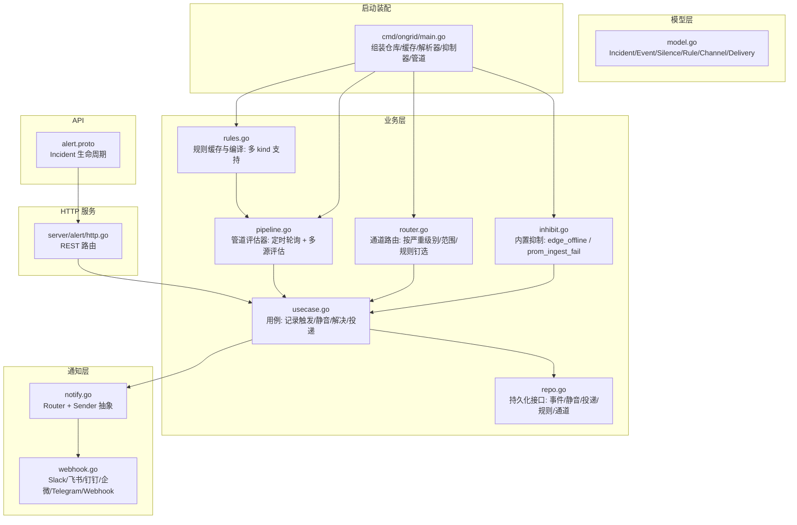
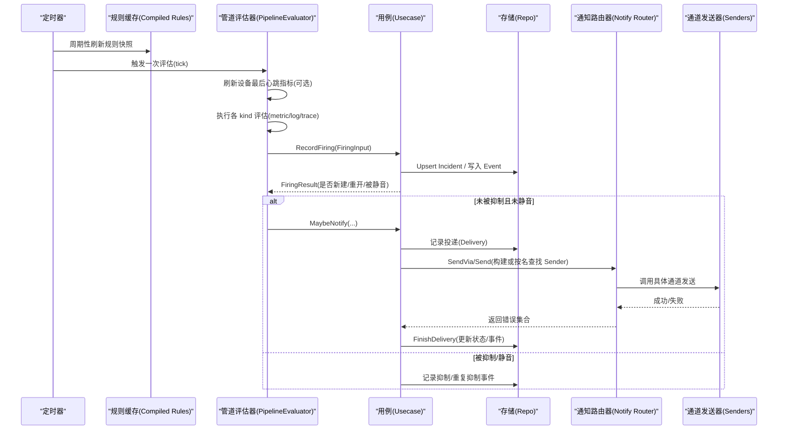
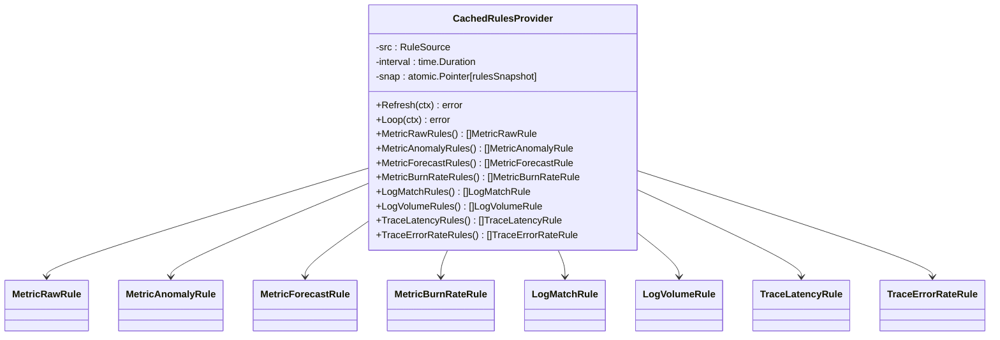
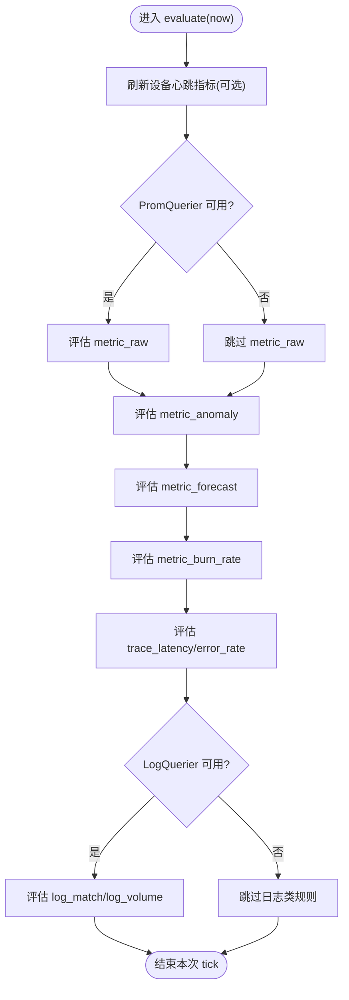
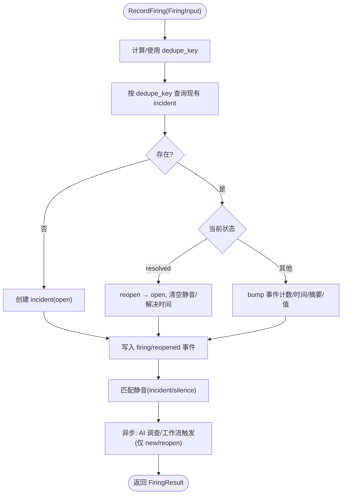
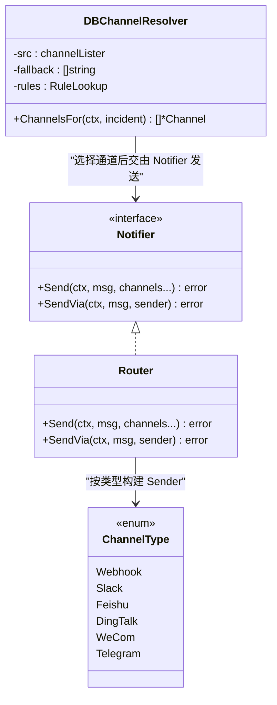
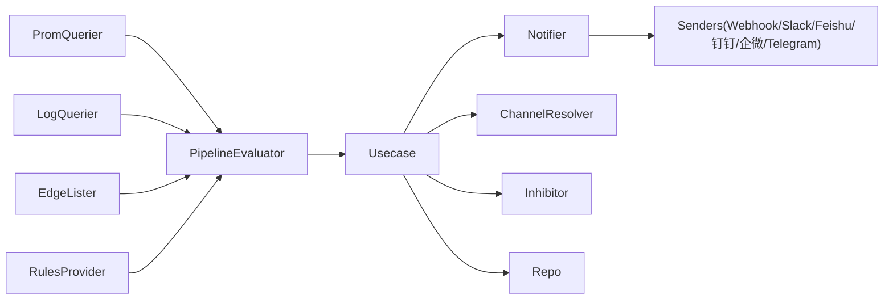

# 告警处理业务域

<cite>
**本文引用的文件**
- [alert.proto](file://api/manager/alert/v1/alert.proto)
- [pipeline.go](file://internal/manager/biz/alert/pipeline.go)
- [rules.go](file://internal/manager/biz/alert/rules.go)
- [router.go](file://internal/manager/biz/alert/router.go)
- [inhibit.go](file://internal/manager/biz/alert/inhibit.go)
- [usecase.go](file://internal/manager/biz/alert/usecase.go)
- [repo.go](file://internal/manager/biz/alert/repo.go)
- [model.go](file://internal/manager/model/alert/model.go)
- [notify.go](file://internal/pkg/notify/notify.go)
- [webhook.go](file://internal/pkg/notify/webhook.go)
- [http.go](file://internal/manager/server/alert/http.go)
- [main.go](file://cmd/ongrid/main.go)
</cite>

## 目录
1. [简介](#简介)
2. [项目结构](#项目结构)
3. [核心组件](#核心组件)
4. [架构总览](#架构总览)
5. [详细组件分析](#详细组件分析)
6. [依赖关系分析](#依赖关系分析)
7. [性能与并发控制](#性能与并发控制)
8. [故障排查指南](#故障排查指南)
9. [结论](#结论)
10. [附录：规则配置示例与最佳实践](#附录：规则配置示例与最佳实践)

## 简介
本文件系统性梳理“告警处理”业务域，覆盖规则解析、编译与执行引擎；告警管道（数据收集→规则评估→告警生成→通知分发）的端到端流程；抑制、去重与聚合机制；路由策略、多渠道通知与升级路径；历史查询、统计分析与可视化支撑；以及性能优化、内存管理与并发控制等工程实现。文档以代码级事实为依据，辅以图示帮助理解。

## 项目结构
告警域位于 manager 子域内，采用分层组织：
- API 契约：gRPC 定义事件生命周期操作与枚举
- 业务层 biz/alert：用例、管道、规则、路由、抑制、存储接口
- 模型层 model/alert：实体、状态、常量、类型
- 通知层 pkg/notify：统一消息体、路由器与各渠道发送器
- HTTP 服务层 server/alert：REST 暴露规则/通道/运行时信息
- 启动装配 cmd/ongrid/main.go：注入仓库、缓存、解析器、抑制器、管道等

图表来源
- [alert.proto:1-88](file://api/manager/alert/v1/alert.proto#L1-L88)
- [pipeline.go:1-505](file://internal/manager/biz/alert/pipeline.go#L1-L505)
- [rules.go:1-932](file://internal/manager/biz/alert/rules.go#L1-L932)
- [router.go:1-194](file://internal/manager/biz/alert/router.go#L1-L194)
- [inhibit.go:1-74](file://internal/manager/biz/alert/inhibit.go#L1-L74)
- [usecase.go:1-800](file://internal/manager/biz/alert/usecase.go#L1-L800)
- [repo.go:1-112](file://internal/manager/biz/alert/repo.go#L1-L112)
- [model.go:1-464](file://internal/manager/model/alert/model.go#L1-L464)
- [notify.go:1-171](file://internal/pkg/notify/notify.go#L1-L171)
- [webhook.go:1-314](file://internal/pkg/notify/webhook.go#L1-L314)
- [http.go:165-206](file://internal/manager/server/alert/http.go#L165-L206)
- [main.go:1022-1050](file://cmd/ongrid/main.go#L1022-L1050)

章节来源
- [alert.proto:1-88](file://api/manager/alert/v1/alert.proto#L1-L88)
- [pipeline.go:1-505](file://internal/manager/biz/alert/pipeline.go#L1-L505)
- [rules.go:1-932](file://internal/manager/biz/alert/rules.go#L1-L932)
- [router.go:1-194](file://internal/manager/biz/alert/router.go#L1-L194)
- [inhibit.go:1-74](file://internal/manager/biz/alert/inhibit.go#L1-L74)
- [usecase.go:1-800](file://internal/manager/biz/alert/usecase.go#L1-L800)
- [repo.go:1-112](file://internal/manager/biz/alert/repo.go#L1-L112)
- [model.go:1-464](file://internal/manager/model/alert/model.go#L1-L464)
- [notify.go:1-171](file://internal/pkg/notify/notify.go#L1-L171)
- [webhook.go:1-314](file://internal/pkg/notify/webhook.go#L1-L314)
- [http.go:165-206](file://internal/manager/server/alert/http.go#L165-L206)
- [main.go:1022-1050](file://cmd/ongrid/main.go#L1022-L1050)

## 核心组件
- 规则提供者与编译器：从持久化读取启用规则，按 kind 编译为运行时对象，提供只读快照供评估器消费
- 管道评估器：定时 tick，依次执行 metric_raw/anomaly/forecast/burn_rate、trace、log 等评估分支
- 用例 Usecase：记录触发、静音、解决、恢复、投递记录、冷却门控、AI 调查与工作流触发
- 通道路由：基于严重级别、范围、规则钉选选择目标通道
- 抑制器：内置 edge_offline 与 prom_ingest_fail 抑制逻辑
- 通知层：统一消息体与多通道发送器（Webhook/Slack/飞书/钉钉/企微/Telegram）
- 模型与接口：Incident/Event/Silence/Rule/Channel/Delivery 及 Repo 接口

章节来源
- [rules.go:1-932](file://internal/manager/biz/alert/rules.go#L1-L932)
- [pipeline.go:1-505](file://internal/manager/biz/alert/pipeline.go#L1-L505)
- [usecase.go:1-800](file://internal/manager/biz/alert/usecase.go#L1-L800)
- [router.go:1-194](file://internal/manager/biz/alert/router.go#L1-L194)
- [inhibit.go:1-74](file://internal/manager/biz/alert/inhibit.go#L1-L74)
- [notify.go:1-171](file://internal/pkg/notify/notify.go#L1-L171)
- [webhook.go:1-314](file://internal/pkg/notify/webhook.go#L1-L314)
- [model.go:1-464](file://internal/manager/model/alert/model.go#L1-L464)
- [repo.go:1-112](file://internal/manager/biz/alert/repo.go#L1-L112)

## 架构总览
下图展示一次完整告警生命周期：从规则加载到评估、触发、抑制/去重、路由、投递与结果回写。

图表来源
- [pipeline.go:147-196](file://internal/manager/biz/alert/pipeline.go#L147-L196)
- [usecase.go:315-479](file://internal/manager/biz/alert/usecase.go#L315-L479)
- [notify.go:92-156](file://internal/pkg/notify/notify.go#L92-L156)
- [webhook.go:220-258](file://internal/pkg/notify/webhook.go#L220-L258)
- [repo.go:38-103](file://internal/manager/biz/alert/repo.go#L38-L103)

## 详细组件分析

### 规则解析与编译
- 规则来源：持久化表 alert_rules，通过 RuleSource.ListAllEnabledRules 拉取
- 缓存策略：CachedRulesProvider 周期刷新，原子指针交换只读快照，避免并发撕裂
- 规则种类：metric_raw、metric_anomaly、metric_forecast、metric_burn_rate、log_match、log_volume、trace_latency、trace_error_rate
- 编译校验：每个 kind 有独立 spec 结构与校验（必填字段、取值范围、默认值），失败行单独告警并跳过，不影响整体
- UI 友好表单：metric_threshold 作为输入 kind，保存时重写为 metric_raw 并生成 PromQL 表达式

图表来源
- [rules.go:305-479](file://internal/manager/biz/alert/rules.go#L305-L479)
- [rules.go:485-800](file://internal/manager/biz/alert/rules.go#L485-L800)

章节来源
- [rules.go:1-932](file://internal/manager/biz/alert/rules.go#L1-L932)

### 管道评估器（PipelineEvaluator）
- 驱动方式：Ticker 驱动 Loop/EvaluateOnce，默认间隔可配
- 评估阶段：
  - 设备心跳指标刷新（可选）：将 host 设备的 last_seen 写入 Prometheus gauge，供 metric_raw 使用
  - metric_raw：直接 Query(expr)，对返回向量逐项触发
  - metric_anomaly/forecast/burn_rate：基于 PromQuerier 计算异常/预测/燃烧率
  - trace_latency/error_rate：基于 spanmetrics 指标在 Prom 侧查询
  - log_match/log_volume：基于 LogQuerier 对 Loki 做范围查询
- 恢复检测：维护上一 tick 的 firingSnapshot，若某 dedupe key 不再出现在结果中则系统自动 resolve
- 标签合并与去重键：labelSetKey 过滤非身份标签（如 __name__、ongrid_source），确保跨采集器同一主体不分裂

图表来源
- [pipeline.go:170-196](file://internal/manager/biz/alert/pipeline.go#L170-L196)
- [pipeline.go:254-380](file://internal/manager/biz/alert/pipeline.go#L254-L380)

章节来源
- [pipeline.go:1-505](file://internal/manager/biz/alert/pipeline.go#L1-L505)

### 触发与去重（RecordFiring）
- 去重键：dedupe_key 由 scope/device/rule 组合或显式传入，保证同实例同规则唯一
- 幂等 upsert：首次创建 incident，后续 bump 事件计数与时间戳；已 resolved 则 reopen
- 事件记录：每次触发均写入 event，便于审计与统计
- 静音匹配：incident 自身 silenced_until 优先，其次匹配 active silence 行
- 副作用：新触发时异步派发 AI 调查与工作流触发（非阻塞）

图表来源
- [usecase.go:315-479](file://internal/manager/biz/alert/usecase.go#L315-L479)

章节来源
- [usecase.go:1-800](file://internal/manager/biz/alert/usecase.go#L1-L800)

### 通知路由与多渠道投递
- 通道选择：DBChannelResolver 根据 channel 的 severity/scope 过滤，或按规则的 notify_channel_ids 钉选
- 发送路径：
  - 持久化通道：BuildSenderFromChannel 构造 typed sender，经 Notifier.SendVia 投递
  - 环境变量通道：按名称走 Notifier.Send
- 投递记录：每条投递写入 delivery 行，成功后标记 last_notified_at，失败记录错误与重试窗口
- 通道类型：webhook/slack/feishu/dingtalk/wecom/telegram，统一 Message 格式

图表来源
- [router.go:1-194](file://internal/manager/biz/alert/router.go#L1-L194)
- [notify.go:39-156](file://internal/pkg/notify/notify.go#L39-L156)
- [webhook.go:1-314](file://internal/pkg/notify/webhook.go#L1-L314)

章节来源
- [router.go:1-194](file://internal/manager/biz/alert/router.go#L1-L194)
- [notify.go:1-171](file://internal/pkg/notify/notify.go#L1-L171)
- [webhook.go:1-314](file://internal/pkg/notify/webhook.go#L1-L314)

### 抑制与升级
- 内置抑制：
  - edge_offline 抑制同设备下所有 host 级别告警
  - pipeline:prom_ingest_fail 抑制 pipeline:scrape_down:*
- 抑制判定：查询对应 dedupe_key 的活跃 incident（非 resolved）
- 升级机制：通过不同严重级别与通道过滤实现“低级别静默、高级别直达”，结合规则钉选可实现关键告警直发

章节来源
- [inhibit.go:1-74](file://internal/manager/biz/alert/inhibit.go#L1-L74)
- [router.go:1-194](file://internal/manager/biz/alert/router.go#L1-L194)

### 历史查询、统计与可视化
- gRPC 接口：ListIncidents/GetIncident/AcknowledgeIncident/ResolveIncident
- REST 能力：规则 CRUD、预览、通道管理、运行时信息
- 统计基础：
  - alert_events_total 计数器（按事件类型/严重级别/规则）
  - 事件表用于时间线与 BI 关联
  - 前端页面支持分页、筛选、详情查看
- 可视化：通过事件与指标接入 Grafana/Loki/Tempo 等生态

章节来源
- [alert.proto:1-88](file://api/manager/alert/v1/alert.proto#L1-L88)
- [http.go:165-206](file://internal/manager/server/alert/http.go#L165-L206)
- [usecase.go:105-123](file://internal/manager/biz/alert/usecase.go#L105-L123)

## 依赖关系分析
- 外部依赖：
  - Prometheus：PromQuerier 即时查询、指标写入（设备心跳 gauge）
  - Loki：LogQuerier 范围查询（log_match/log_volume）
  - Edge 列表：EdgeLister 获取设备清单以刷新心跳 gauge
- 内部耦合：
  - PipelineEvaluator 依赖 RulesProvider、Notifier、ChannelResolver、Inhibitor、Repo
  - Usecase 依赖 Repo、Notifier、Investigator、WorkflowDispatcher
  - 通知层与通道发送器解耦，通过 Sender 接口扩展

图表来源
- [pipeline.go:49-114](file://internal/manager/biz/alert/pipeline.go#L49-L114)
- [usecase.go:73-103](file://internal/manager/biz/alert/usecase.go#L73-L103)
- [notify.go:39-156](file://internal/pkg/notify/notify.go#L39-L156)

章节来源
- [pipeline.go:1-505](file://internal/manager/biz/alert/pipeline.go#L1-L505)
- [usecase.go:1-800](file://internal/manager/biz/alert/usecase.go#L1-L800)
- [notify.go:1-171](file://internal/pkg/notify/notify.go#L1-L171)

## 性能与并发控制
- 规则缓存：atomic.Pointer 原子替换，读写无锁，避免全量加锁
- 评估器单 goroutine：Loop 串行执行，减少竞争；测试并发 EvaluateOnce 通过局部互斥保护 gauge 快照
- 指标清理：设备心跳 gauge 每 tick 重建集合，删除离线设备系列，防止指标膨胀
- 恢复检测：firingSnapshot 仅维护 rule_key→dedupe keys 集合，空间 O(N) 且仅在 evaluatePromQuery 修改
- 通知超时：Router 默认 10s 超时，避免长尾阻塞
- 事件写入：事件写入失败不阻断主流程，降级为警告日志，保障高可用
- 冷却门控：last_notified_at 配合 cooldown 降低高频重复通知

章节来源
- [rules.go:305-479](file://internal/manager/biz/alert/rules.go#L305-L479)
- [pipeline.go:96-114](file://internal/manager/biz/alert/pipeline.go#L96-L114)
- [pipeline.go:198-252](file://internal/manager/biz/alert/pipeline.go#L198-L252)
- [pipeline.go:355-380](file://internal/manager/biz/alert/pipeline.go#L355-L380)
- [notify.go:47-65](file://internal/pkg/notify/notify.go#L47-L65)
- [usecase.go:429-436](file://internal/manager/biz/alert/usecase.go#L429-L436)

## 故障排查指南
- 规则未生效
  - 检查规则是否启用、kind 是否为可评估类型、conditions_json 是否合法
  - 查看规则缓存刷新日志与编译失败告警
- 评估器未触发
  - 确认 evaluator_interval 配置与进程上下文未取消
  - 检查 PromQuerier/LogQuerier 可用性
- 告警风暴/重复通知
  - 核对 dedupe_key 设计，避免非身份标签导致分裂
  - 调整冷却时间与发送策略（窗口+最小触发次数）
- 通知未送达
  - 检查通道配置 endpoint/secret/chat_id 等关键字段
  - 查看 delivery 记录与事件中的 notification_failed 原因
- 抑制误判
  - 核查 edge_offline/prom_ingest_fail 是否存在活跃 incident
  - 确认 scope_type 与 device_id 一致性

章节来源
- [rules.go:358-458](file://internal/manager/biz/alert/rules.go#L358-L458)
- [pipeline.go:261-380](file://internal/manager/biz/alert/pipeline.go#L261-L380)
- [usecase.go:513-573](file://internal/manager/biz/alert/usecase.go#L513-L573)
- [inhibit.go:44-73](file://internal/manager/biz/alert/inhibit.go#L44-L73)

## 结论
该告警域以“规则即表达式”的简洁范式为核心，借助缓存与只读快照提升吞吐，通过管道化评估与统一通知路由实现可扩展的多源多通道告警体系。抑制与去重有效降噪，事件与投递记录提供完备审计与排障依据。未来可在 log/trace 评估、抑制规则表、更细粒度聚合等方面持续演进。

## 附录：规则配置示例与最佳实践

- metric_raw（推荐）
  - 适用场景：任意 PromQL 谓词，如 up==0、cpu_pct>90、device_last_seen_seconds_ago>90
  - 要点：表达式即判断条件，无需额外 for_seconds；scope_type=host 时建议包含 device_id 标签
  - 参考路径：[rules.go:485-522](file://internal/manager/biz/alert/rules.go#L485-L522)、[pipeline.go:254-380](file://internal/manager/biz/alert/pipeline.go#L254-L380)

- metric_anomaly
  - 适用场景：基于滚动基线的异常检测（zscore/mad）
  - 要点：合理设置 baseline_window/step 与 deviation；for_seconds 可选
  - 参考路径：[rules.go:528-586](file://internal/manager/biz/alert/rules.go#L528-L586)

- metric_forecast
  - 适用场景：线性外推阈值预警（如磁盘将在 X 小时填满）
  - 要点：predict_seconds 必须 >0；operator 限定为比较符
  - 参考路径：[rules.go:588-639](file://internal/manager/biz/alert/rules.go#L588-L639)

- metric_burn_rate
  - 适用场景：SLO 错误预算多窗口多燃烧率（Google SRE Workbook）
  - 要点：SLI 需使用 $window 或 range selector；SLO 在 (0,100)；至少一个 burn window
  - 参考路径：[rules.go:641-701](file://internal/manager/biz/alert/rules.go#L641-L701)

- log_match/log_volume
  - 适用场景：日志匹配与总量阈值
  - 要点：stream_selector 必填；window 默认 5m；operator 限比较符
  - 参考路径：[rules.go:746-800](file://internal/manager/biz/alert/rules.go#L746-L800)

- trace_latency/trace_error_rate
  - 适用场景：基于 spanmetrics 的延迟分位与错误率
  - 要点：依赖 spanmetrics 生成器；按 service/operation 维度评估
  - 参考路径：[rules.go:135-165](file://internal/manager/biz/alert/rules.go#L135-L165)

- 发送策略（dampening）
  - 窗口+最小触发次数同时为 0 表示禁用；同时 >0 启用；混合值拒绝
  - 窗口范围 1~1440 分钟，最小触发 1~100
  - 参考路径：[usecase.go:748-766](file://internal/manager/biz/alert/usecase.go#L748-L766)

- 通道路由与钉选
  - 全局：按 severity/scope 过滤；规则级：notify_channel_ids 钉选特定通道
  - 参考路径：[router.go:65-111](file://internal/manager/biz/alert/router.go#L65-L111)

- 最佳实践
  - 使用 metric_raw 替代旧 metric_threshold 友好表单，统一评估路径
  - 为 host 规则显式携带 device_id，避免跨采集器分裂
  - 合理设置冷却与发送策略，抑制风暴
  - 利用内置抑制减少根因掩盖下的噪声
  - 通过事件与投递记录进行审计与排障

章节来源
- [rules.go:1-932](file://internal/manager/biz/alert/rules.go#L1-L932)
- [usecase.go:706-766](file://internal/manager/biz/alert/usecase.go#L706-L766)
- [router.go:65-111](file://internal/manager/biz/alert/router.go#L65-L111)