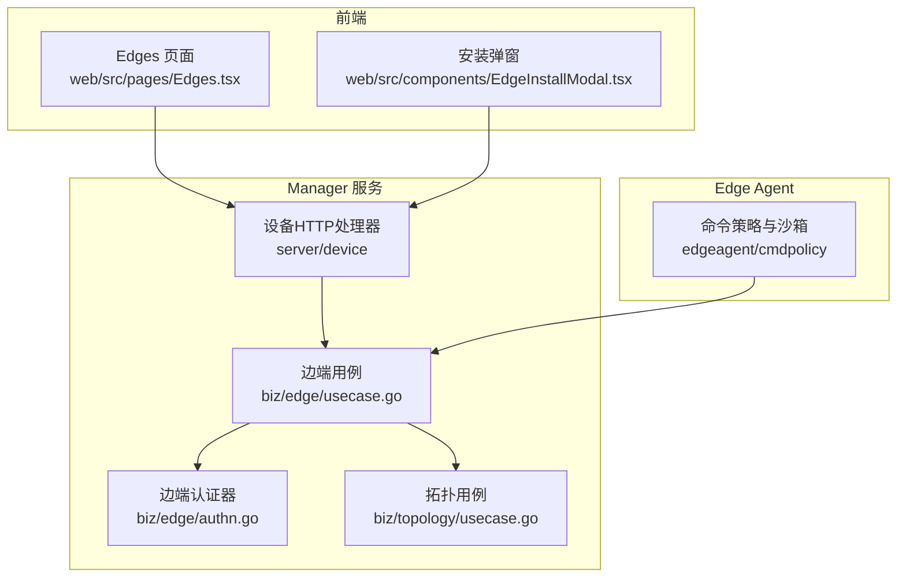
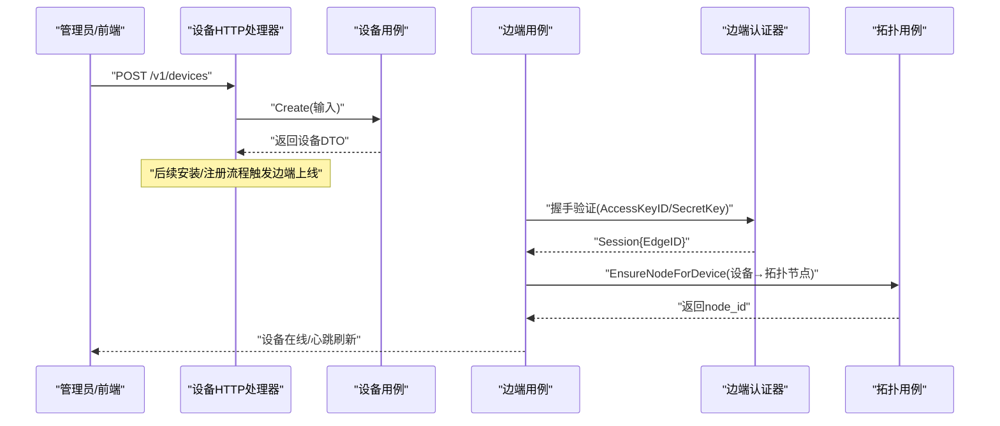
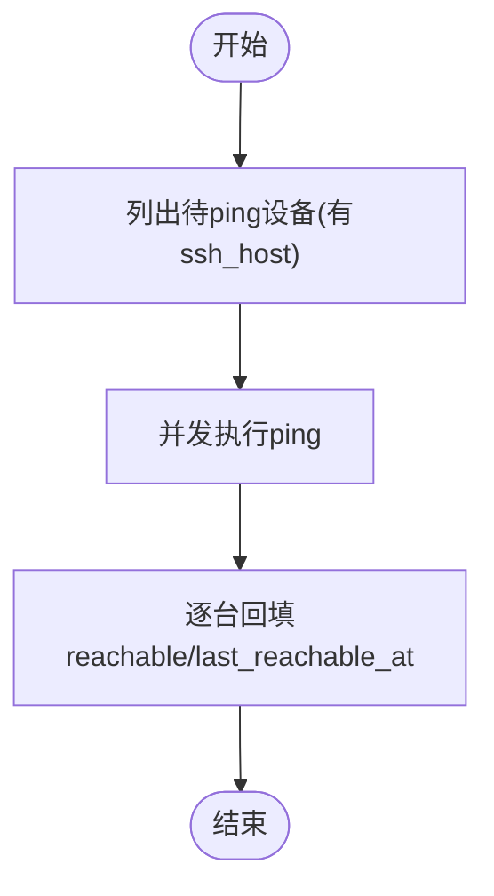
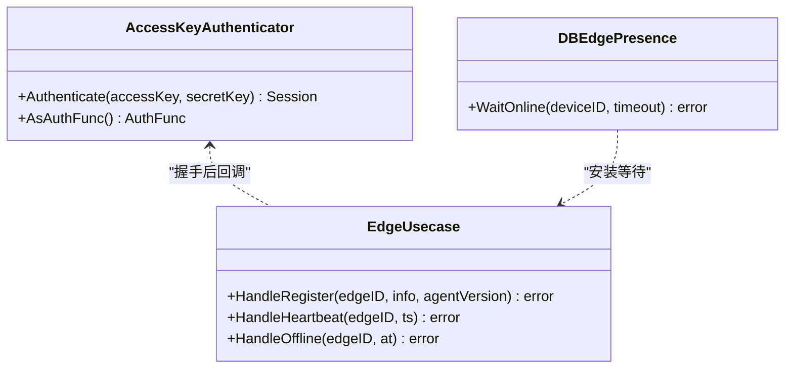
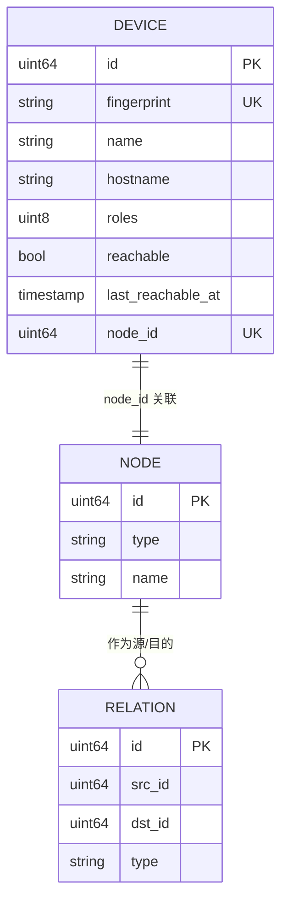
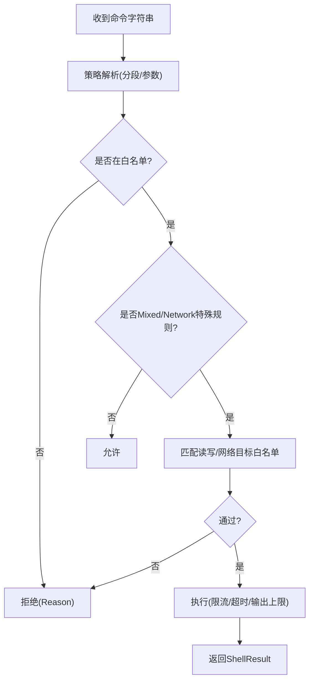
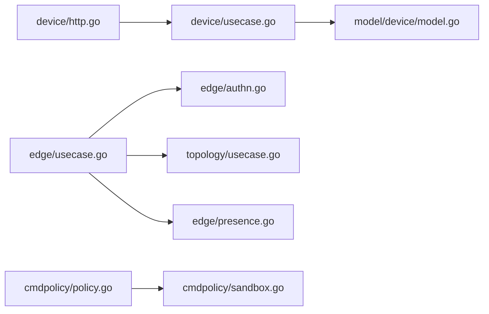

# 设备管理业务域

<cite>
**本文引用的文件**   
- [cmd/ongrid/main.go](file://cmd/ongrid/main.go)
- [internal/manager/server/device/http.go](file://internal/manager/server/device/http.go)
- [internal/manager/server/device/credentials.go](file://internal/manager/server/device/credentials.go)
- [internal/manager/biz/device/usecase.go](file://internal/manager/biz/device/usecase.go)
- [internal/manager/model/device/model.go](file://internal/manager/model/device/model.go)
- [internal/manager/biz/edge/authn.go](file://internal/manager/biz/edge/authn.go)
- [internal/manager/biz/edge/presence.go](file://internal/manager/biz/edge/presence.go)
- [internal/manager/biz/edge/usecase.go](file://internal/manager/biz/edge/usecase.go)
- [internal/manager/model/edge/model.go](file://internal/manager/model/edge/model.go)
- [internal/manager/biz/topology/usecase.go](file://internal/manager/biz/topology/usecase.go)
- [internal/manager/model/topology/model.go](file://internal/manager/model/topology/model.go)
- [internal/edgeagent/cmdpolicy/sandbox.go](file://internal/edgeagent/cmdpolicy/sandbox.go)
- [internal/edgeagent/cmdpolicy/policy.go](file://internal/edgeagent/cmdpolicy/policy.go)
- [web/src/pages/Edges.tsx](file://web/src/pages/Edges.tsx)
- [web/src/components/EdgeInstallModal.tsx](file://web/src/components/EdgeInstallModal.tsx)
</cite>

## 目录
1. [简介](#简介)
2. [项目结构](#项目结构)
3. [核心组件](#核心组件)
4. [架构总览](#架构总览)
5. [详细组件分析](#详细组件分析)
6. [依赖关系分析](#依赖关系分析)
7. [性能与可扩展性](#性能与可扩展性)
8. [故障排查指南](#故障排查指南)
9. [结论](#结论)
10. [附录：API 使用示例与错误处理](#附录api-使用示例与错误处理)

## 简介
本文件聚焦“设备管理”业务域，围绕以下目标展开：
- 设备生命周期管理：注册、状态监控、健康检查、批量操作
- 边缘设备认证、连接管理与心跳检测
- 拓扑关系维护、设备分组与标签（角色）管理
- 命令执行安全沙箱、权限控制与审计追踪
- 配置同步、固件升级与故障恢复流程
- 设备管理 API 使用示例与错误处理策略
- 性能监控指标收集与告警规则配置方法

## 项目结构
设备管理相关代码按“控制器层 → 业务用例层 → 模型/仓储层”分层组织，并在 manager 服务中通过 HTTP/gRPC 暴露能力。关键路径如下：
- HTTP 路由与 DTO 映射：internal/manager/server/device/*
- 设备业务用例：internal/manager/biz/device/usecase.go
- 设备数据模型：internal/manager/model/device/model.go
- 边端认证与会话：internal/manager/biz/edge/authn.go
- 边端在线等待与存在性：internal/manager/biz/edge/presence.go
- 边端注册/心跳/离线等主流程：internal/manager/biz/edge/usecase.go
- 拓扑节点与关系：internal/manager/biz/topology/usecase.go, internal/manager/model/topology/model.go
- 边端命令沙箱与策略：internal/edgeagent/cmdpolicy/*
- 前端页面与交互：web/src/pages/Edges.tsx, web/src/components/EdgeInstallModal.tsx
- 服务启动与路由装配：cmd/ongrid/main.go

图表来源
- [cmd/ongrid/main.go](file://cmd/ongrid/main.go)
- [internal/manager/server/device/http.go](file://internal/manager/server/device/http.go)
- [internal/manager/biz/edge/authn.go](file://internal/manager/biz/edge/authn.go)
- [internal/manager/biz/edge/usecase.go](file://internal/manager/biz/edge/usecase.go)
- [internal/manager/biz/topology/usecase.go](file://internal/manager/biz/topology/usecase.go)
- [internal/edgeagent/cmdpolicy/sandbox.go](file://internal/edgeagent/cmdpolicy/sandbox.go)
- [web/src/pages/Edges.tsx](file://web/src/pages/Edges.tsx)
- [web/src/components/EdgeInstallModal.tsx](file://web/src/components/EdgeInstallModal.tsx)

章节来源
- [cmd/ongrid/main.go](file://cmd/ongrid/main.go)
- [internal/manager/server/device/http.go](file://internal/manager/server/device/http.go)
- [internal/manager/biz/edge/authn.go](file://internal/manager/biz/edge/authn.go)
- [internal/manager/biz/edge/usecase.go](file://internal/manager/biz/edge/usecase.go)
- [internal/manager/biz/topology/usecase.go](file://internal/manager/biz/topology/usecase.go)
- [internal/edgeagent/cmdpolicy/sandbox.go](file://internal/edgeagent/cmdpolicy/sandbox.go)
- [web/src/pages/Edges.tsx](file://web/src/pages/Edges.tsx)
- [web/src/components/EdgeInstallModal.tsx](file://web/src/components/EdgeInstallModal.tsx)

## 核心组件
- 设备 HTTP 处理器：提供设备 CRUD、SSH 凭据管理、可达性展示、关联 Edge 列表等接口
- 设备业务用例：负责设备创建、角色更新、名称描述更新、SSH 凭据设置、可达性回填、软删除/恢复、与拓扑镜像联动等
- 设备数据模型：定义设备字段、角色位图、可达性与 SSH 元信息、拓扑 NodeID 关联等
- 边端认证器：基于 AccessKeyID + SecretKey 的 argon2id 校验，带缓存与在线状态异步更新
- 边端存在性等待：轮询 DB 判断设备是否有任何 type=host 的 Edge 处于 online
- 边端用例：注册、心跳、离线、密钥轮换、默认插件初始化、设备→拓扑镜像
- 拓扑用例：节点/关系/类型注册与维护，设备到拓扑节点的镜像写入
- 命令沙箱：白名单二进制、读写分类、网络目标白名单、输出上限、超时控制
- 前端：设备/边端列表、筛选、一键安装弹窗

章节来源
- [internal/manager/server/device/http.go](file://internal/manager/server/device/http.go)
- [internal/manager/biz/device/usecase.go](file://internal/manager/biz/device/usecase.go)
- [internal/manager/model/device/model.go](file://internal/manager/model/device/model.go)
- [internal/manager/biz/edge/authn.go](file://internal/manager/biz/edge/authn.go)
- [internal/manager/biz/edge/presence.go](file://internal/manager/biz/edge/presence.go)
- [internal/manager/biz/edge/usecase.go](file://internal/manager/biz/edge/usecase.go)
- [internal/manager/biz/topology/usecase.go](file://internal/manager/biz/topology/usecase.go)
- [internal/manager/model/topology/model.go](file://internal/manager/model/topology/model.go)
- [internal/edgeagent/cmdpolicy/sandbox.go](file://internal/edgeagent/cmdpolicy/sandbox.go)
- [internal/edgeagent/cmdpolicy/policy.go](file://internal/edgeagent/cmdpolicy/policy.go)
- [web/src/pages/Edges.tsx](file://web/src/pages/Edges.tsx)
- [web/src/components/EdgeInstallModal.tsx](file://web/src/components/EdgeInstallModal.tsx)

## 架构总览
设备管理在 Manager 侧以 HTTP 暴露；Edge Agent 通过隧道与 Manager 建立会话并上报主机信息与心跳；命令执行在 Edge 侧由 cmdpolicy 沙箱约束；设备与拓扑通过镜像机制保持同步。

图表来源
- [internal/manager/server/device/http.go](file://internal/manager/server/device/http.go)
- [internal/manager/biz/device/usecase.go](file://internal/manager/biz/device/usecase.go)
- [internal/manager/biz/edge/authn.go](file://internal/manager/biz/edge/authn.go)
- [internal/manager/biz/edge/usecase.go](file://internal/manager/biz/edge/usecase.go)
- [internal/manager/biz/topology/usecase.go](file://internal/manager/biz/topology/usecase.go)

## 详细组件分析

### 设备生命周期管理（注册、状态、健康、批量）
- 注册
  - 管理员通过 POST /v1/devices 创建逻辑设备并写入 SSH 凭据（明文回显用于运维便利），随后通过安装流程或手动方式部署 Edge Agent。
  - 设备首次注册时，Edge Agent 上报主机指纹与硬件信息，Manager 侧 Upsert 设备行并建立与 Edge 的 M:N 关联（type=host）。
- 状态监控
  - 设备 Online/LastSeenAt 与 Edge 的 online/offline 和 last_seen_at 解耦但保持一致；心跳路径会刷新两者。
  - 可达性 Reachable/LastReachableAt 由后端定时 ping 任务写入，独立于 Edge 在线状态，供 UI 渲染“机器在线”。
- 健康检查
  - 每 5 分钟对具备 ssh_host 的设备执行一次 ping，结果写回 devices.reachable/last_reachable_at。
- 批量操作
  - 支持按角色过滤、在线状态过滤、分页查询；支持软删除与恢复；支持批量角色更新（PATCH roles）。

图表来源
- [internal/manager/biz/device/usecase.go](file://internal/manager/biz/device/usecase.go)
- [internal/manager/model/device/model.go](file://internal/manager/model/device/model.go)

章节来源
- [internal/manager/server/device/http.go](file://internal/manager/server/device/http.go)
- [internal/manager/biz/device/usecase.go](file://internal/manager/biz/device/usecase.go)
- [internal/manager/model/device/model.go](file://internal/manager/model/device/model.go)

### 边缘设备认证、连接管理与心跳检测
- 认证机制
  - 基于 AccessKeyID + SecretKey，服务端使用 argon2id 比对哈希，失败统一返回未授权，避免枚举泄露。
  - 认证成功将 edge 标记为 online 并记录 last_seen_at；同时使用内存缓存加速高频校验。
- 连接管理
  - 注册流程完成设备 upsert、M:N 关联、拓扑镜像、AgentVersion/TaskName 回填等。
  - 心跳路径仅刷新时间戳与设备去重列，保证设备列表“最近可见”准确。
  - 断开路径将 Edge 置 offline 并级联设备 offline。
- 在线等待
  - 安装完成后，WaitOnline 轮询 DB，直到任一 type=host 的 Edge 变为 online。

图表来源
- [internal/manager/biz/edge/authn.go](file://internal/manager/biz/edge/authn.go)
- [internal/manager/biz/edge/usecase.go](file://internal/manager/biz/edge/usecase.go)
- [internal/manager/biz/edge/presence.go](file://internal/manager/biz/edge/presence.go)

章节来源
- [internal/manager/biz/edge/authn.go](file://internal/manager/biz/edge/authn.go)
- [internal/manager/biz/edge/usecase.go](file://internal/manager/biz/edge/usecase.go)
- [internal/manager/biz/edge/presence.go](file://internal/manager/biz/edge/presence.go)
- [internal/manager/model/edge/model.go](file://internal/manager/model/edge/model.go)

### 拓扑关系维护、设备分组与标签管理
- 拓扑镜像
  - 设备注册时，若尚未关联拓扑节点，则根据设备名在 nodes 表查找或新建 type=device 的节点，并将 node_id 回写到设备行。
- 节点与关系
  - 支持自定义节点类型与关系类型（含内置种子），可声明方向与语义标签，便于故障传播计算与可视化。
- 设备分组与标签
  - 设备 Roles 采用位图存储 server/storage/network/database 四类，支持未知集合；API 提供角色更新与过滤。

图表来源
- [internal/manager/biz/topology/usecase.go](file://internal/manager/biz/topology/usecase.go)
- [internal/manager/model/topology/model.go](file://internal/manager/model/topology/model.go)
- [internal/manager/model/device/model.go](file://internal/manager/model/device/model.go)

章节来源
- [internal/manager/biz/topology/usecase.go](file://internal/manager/biz/topology/usecase.go)
- [internal/manager/model/topology/model.go](file://internal/manager/model/topology/model.go)
- [internal/manager/model/device/model.go](file://internal/manager/model/device/model.go)

### 命令执行安全沙箱、权限控制与审计追踪
- 沙箱策略
  - 白名单二进制清单，按 ClassReadFS/ClassReadSystem/ClassMixed/ClassNetwork/ClassDenied 分类。
  - Mixed 类通过只读匹配器与写匹配器区分读写；Network 类结合网络目标白名单（CIDR/后缀/精确匹配）。
  - 输出上限与超时保护，管道化执行，进程组隔离。
- 权限控制
  - 默认 read-only policy；写操作需额外审批或受限入口（如 Raw 执行需开启写门控）。
- 审计追踪
  - 决策与执行结果包含 Reason/Truncated/DurationMs 等上下文，便于审计与排障。

图表来源
- [internal/edgeagent/cmdpolicy/policy.go](file://internal/edgeagent/cmdpolicy/policy.go)
- [internal/edgeagent/cmdpolicy/sandbox.go](file://internal/edgeagent/cmdpolicy/sandbox.go)

章节来源
- [internal/edgeagent/cmdpolicy/policy.go](file://internal/edgeagent/cmdpolicy/policy.go)
- [internal/edgeagent/cmdpolicy/sandbox.go](file://internal/edgeagent/cmdpolicy/sandbox.go)

### 配置同步、固件升级与故障恢复
- 配置同步
  - 新 Edge 创建时可自动播种默认插件配置（日志/链路/指标/主机指标/进程指标），确保上线即有数据。
- 固件升级
  - 前端提供“整包升级”入口，后端通过安装作业队列编排，安装完成后等待 Edge 在线并清理敏感快照。
- 故障恢复
  - 设备存在性修复：启动时扫描孤儿设备（online=true 但无在线 Edge）将其置 offline。
  - 心跳/离线路径保证 Edge 与设备的状态一致性。

章节来源
- [internal/manager/biz/edge/usecase.go](file://internal/manager/biz/edge/usecase.go)
- [web/src/pages/Edges.tsx](file://web/src/pages/Edges.tsx)
- [web/src/components/EdgeInstallModal.tsx](file://web/src/components/EdgeInstallModal.tsx)

## 依赖关系分析
- 设备 HTTP 层依赖设备用例；设备用例依赖设备仓储与边端-设备关联仓储；边端用例依赖设备仓储与拓扑镜像接口。
- 边端认证器依赖仓储与密码库；存在性等待依赖 gorm.DB。
- 拓扑用例依赖节点/关系/类型仓储。
- 命令沙箱依赖策略与路径/网络白名单。

图表来源
- [internal/manager/server/device/http.go](file://internal/manager/server/device/http.go)
- [internal/manager/biz/device/usecase.go](file://internal/manager/biz/device/usecase.go)
- [internal/manager/model/device/model.go](file://internal/manager/model/device/model.go)
- [internal/manager/biz/edge/usecase.go](file://internal/manager/biz/edge/usecase.go)
- [internal/manager/biz/edge/authn.go](file://internal/manager/biz/edge/authn.go)
- [internal/manager/biz/edge/presence.go](file://internal/manager/biz/edge/presence.go)
- [internal/manager/biz/topology/usecase.go](file://internal/manager/biz/topology/usecase.go)
- [internal/edgeagent/cmdpolicy/policy.go](file://internal/edgeagent/cmdpolicy/policy.go)
- [internal/edgeagent/cmdpolicy/sandbox.go](file://internal/edgeagent/cmdpolicy/sandbox.go)

## 性能与可扩展性
- 认证缓存：AccessKey 校验结果短期缓存，降低高频心跳压力。
- 心跳批量化：心跳仅更新时间戳，避免复杂关联更新。
- 可达性扫描：并发 ping + 单条回填失败不阻塞整轮，容忍抖动。
- 在线等待：LIMIT 1 查询 + 500ms 轮询，快速收敛且低开销。
- 拓扑镜像：best-effort 写入，不影响注册主路径。

[本节为通用指导，无需源码引用]

## 故障排查指南
- 设备显示“已删除”
  - 使用 include_deleted=true 查看；必要时调用恢复接口。
- SSH 凭据缺失导致无法连接
  - 检查 SSHHost/Port/User/AuthKind/Password/Key 是否齐全；注意空串表示清空该字段。
- 设备在线但不可达
  - 关注 reachable/last_reachable_at 是否为 false；确认防火墙/路由策略。
- 边端无法上线
  - 检查 AccessKeyID/SecretKey 是否正确；观察 WaitOnline 是否超时；确认安装作业状态。
- 命令被沙箱拒绝
  - 查看 ShellResult.Reason；确认二进制是否在白名单、参数是否命中写规则、网络目标是否在白名单。

章节来源
- [internal/manager/server/device/http.go](file://internal/manager/server/device/http.go)
- [internal/manager/server/device/credentials.go](file://internal/manager/server/device/credentials.go)
- [internal/manager/biz/device/usecase.go](file://internal/manager/biz/device/usecase.go)
- [internal/manager/biz/edge/presence.go](file://internal/manager/biz/edge/presence.go)
- [internal/edgeagent/cmdpolicy/sandbox.go](file://internal/edgeagent/cmdpolicy/sandbox.go)

## 结论
设备管理域以清晰的层次划分与强边界设计实现：设备与边端职责分离、认证与心跳路径轻量高效、命令执行严格受控、拓扑镜像与设备角色体系完善。配合前端交互与安装作业编排，形成从注册到运维的全链路闭环。

[本节为总结，无需源码引用]

## 附录：API 使用示例与错误处理

- 设备管理 API（节选）
  - POST /v1/devices：管理员创建设备并写入 SSH 凭据
  - GET /v1/devices：列出设备，支持 roles/online/include_deleted 等过滤
  - GET /v1/devices/{id}：获取设备详情
  - PATCH /v1/devices/{id}：更新名称/描述/主机名与 SSH 块（合并语义）
  - PATCH /v1/devices/{id}/roles：更新角色位图
  - DELETE /v1/devices/{id}?hard=true：硬删；默认软删
  - POST /v1/devices/{id}/restore：恢复软删设备
  - GET /v1/devices/{id}/edges：列出设备关联的 Edge
  - PUT /v1/devices/{id}/ssh-credentials：替换 SSH 凭据块
  - GET /v1/devices/{id}/ssh-info：读取 SSH 信息（含 edge_online）
  - DELETE /v1/devices/{id}/ssh-credentials?kind=password|key：旋转指定凭据

- 错误处理策略
  - 统一 JSON 错误体，包含 error 与 code 字段
  - 常见 code：not-found/unauthorized/forbidden/invalid/not-wired-yet/internal
  - 参数校验失败返回 invalid；未认证返回 unauthorized；越权返回 forbidden

- 前端交互要点
  - Edges 页面支持按角色筛选与轮询刷新
  - 安装弹窗支持生成安装命令与一键安装流程

章节来源
- [internal/manager/server/device/http.go](file://internal/manager/server/device/http.go)
- [internal/manager/server/device/credentials.go](file://internal/manager/server/device/credentials.go)
- [web/src/pages/Edges.tsx](file://web/src/pages/Edges.tsx)
- [web/src/components/EdgeInstallModal.tsx](file://web/src/components/EdgeInstallModal.tsx)