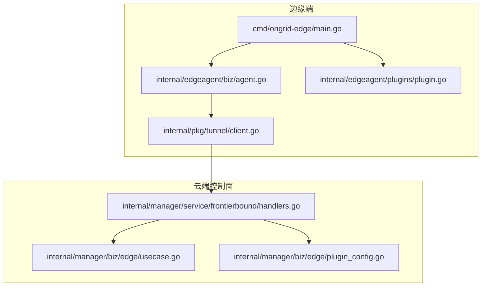
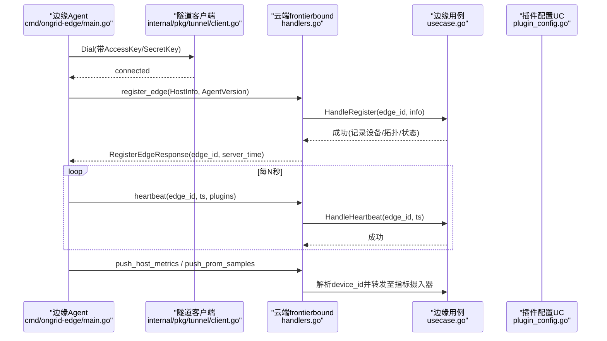
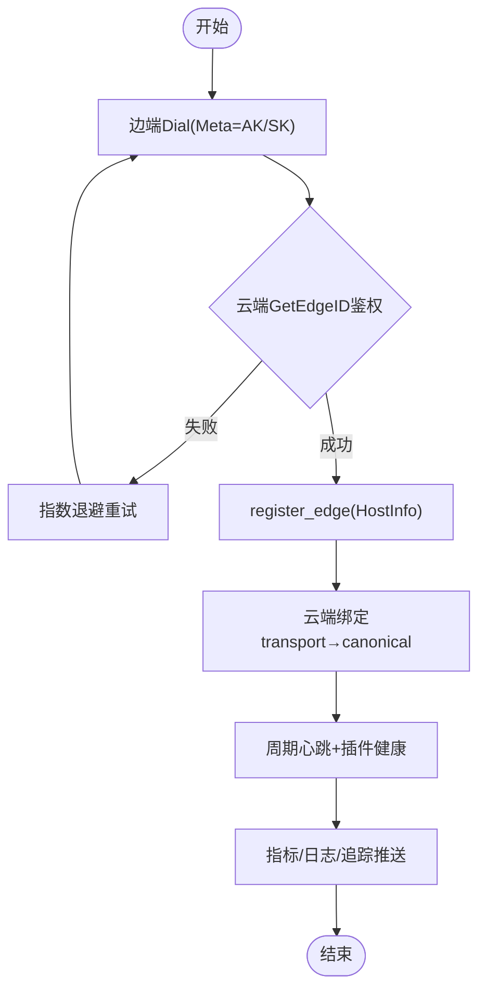
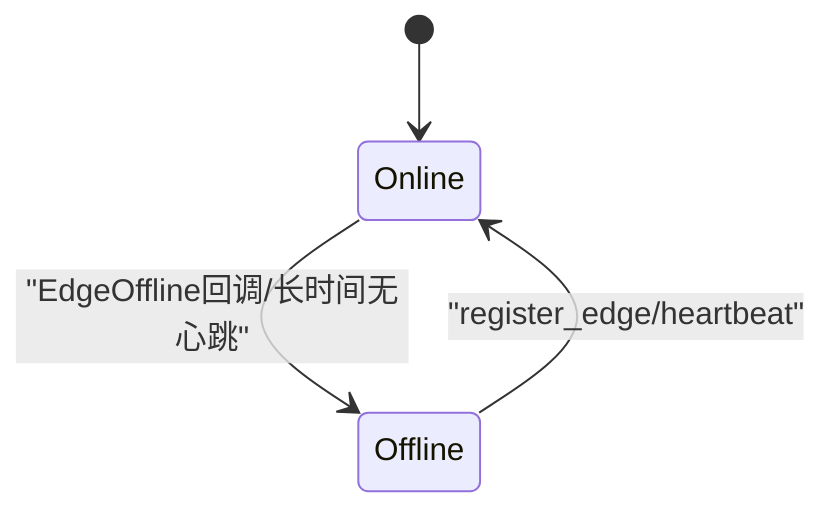
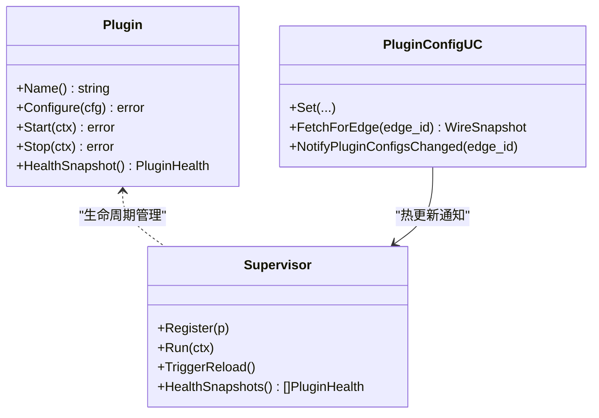
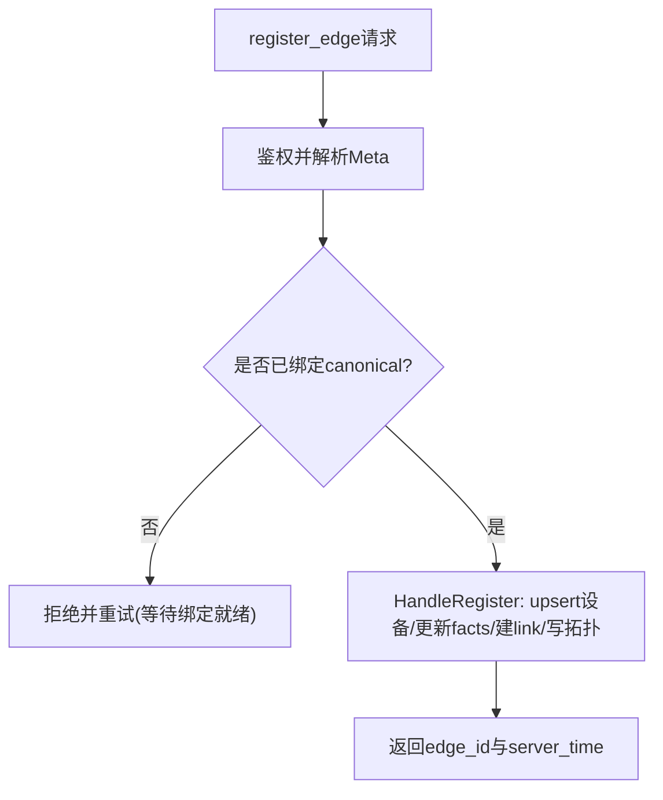
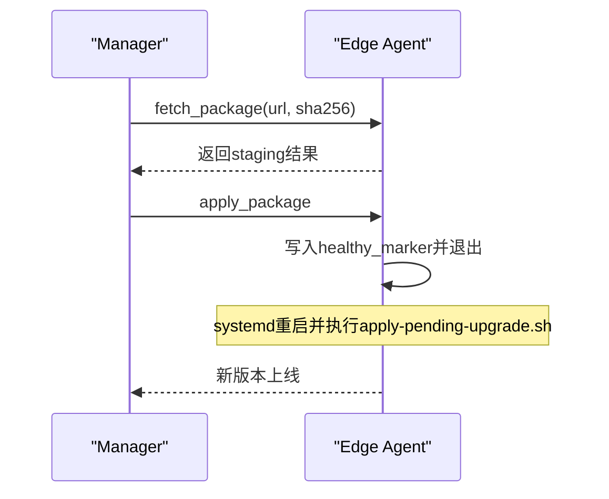
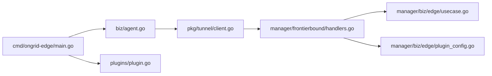

# 边缘服务业务域

<cite>
**本文引用的文件**   
- [cmd/ongrid-edge/main.go](file://cmd/ongrid-edge/main.go)
- [internal/edgeagent/biz/agent.go](file://internal/edgeagent/biz/agent.go)
- [internal/manager/service/frontierbound/handlers.go](file://internal/manager/service/frontierbound/handlers.go)
- [internal/manager/biz/edge/usecase.go](file://internal/manager/biz/edge/usecase.go)
- [internal/edgeagent/plugins/plugin.go](file://internal/edgeagent/plugins/plugin.go)
- [internal/manager/biz/edge/plugin_config.go](file://internal/manager/biz/edge/plugin_config.go)
- [internal/pkg/tunnel/client.go](file://internal/pkg/tunnel/client.go)
- [deploy/install/edge/install-edge.sh](file://deploy/install/edge/install-edge.sh)
</cite>

## 目录
1. [引言](#引言)
2. [项目结构](#项目结构)
3. [核心组件](#核心组件)
4. [架构总览](#架构总览)
5. [详细组件分析](#详细组件分析)
6. [依赖关系分析](#依赖关系分析)
7. [性能与可靠性](#性能与可靠性)
8. [部署与网络拓扑](#部署与网络拓扑)
9. [监控、日志与故障诊断](#监控日志与故障诊断)
10. [结论](#结论)

## 引言
本文件聚焦“边缘服务业务域”，围绕以下目标展开：
- 边缘节点认证授权机制、令牌管理与会话保持
- 边缘节点存在性检测、心跳监控与故障转移策略
- 插件配置管理、版本控制与热更新机制
- 边缘节点与云端通信协议、数据同步与冲突解决
- 边缘计算任务调度、资源分配与负载均衡实现
- 边缘服务部署配置、网络拓扑与安全策略
- 边缘服务监控指标、日志收集与故障诊断方法

## 项目结构
边缘侧由 ongrid-edge 二进制驱动，负责建立到云端的隧道、周期性上报心跳与指标、承载工具 RPC 与插件运行时。控制面在 manager 中通过 frontierbound 层接收来自边端的注册、心跳与数据推送，并维护设备/拓扑映射与插件配置下发。

图表来源
- [cmd/ongrid-edge/main.go:1-120](file://cmd/ongrid-edge/main.go#L1-L120)
- [internal/edgeagent/biz/agent.go:150-232](file://internal/edgeagent/biz/agent.go#L150-L232)
- [internal/edgeagent/plugins/plugin.go:18-52](file://internal/edgeagent/plugins/plugin.go#L18-L52)
- [internal/pkg/tunnel/client.go:23-141](file://internal/pkg/tunnel/client.go#L23-L141)
- [internal/manager/service/frontierbound/handlers.go:86-187](file://internal/manager/service/frontierbound/handlers.go#L86-L187)
- [internal/manager/biz/edge/usecase.go:337-480](file://internal/manager/biz/edge/usecase.go#L337-L480)
- [internal/manager/biz/edge/plugin_config.go:249-306](file://internal/manager/biz/edge/plugin_config.go#L249-L306)

章节来源
- [cmd/ongrid-edge/main.go:1-120](file://cmd/ongrid-edge/main.go#L1-L120)
- [internal/edgeagent/biz/agent.go:150-232](file://internal/edgeagent/biz/agent.go#L150-L232)
- [internal/manager/service/frontierbound/handlers.go:86-187](file://internal/manager/service/frontierbound/handlers.go#L86-L187)

## 核心组件
- 边缘 Agent 运行期：负责注册云端处理器、拨号连接、注册 EdgeID、周期心跳与指标推送、远程升级流程。
- 隧道客户端：封装底层 geminio 的长连接、自动重连、错误探测与回调触发。
- 云端 frontierbound 处理层：解析 Meta 鉴权、生命周期事件（上线/下线）、注册/心跳/指标/插件配置等 RPC 路由。
- 边缘设备用例（Usecase）：维护 Edge/Device 关联、指纹迁移、在线状态、插件默认启用策略。
- 插件运行时：统一 Plugin 接口、Supervisor 生命周期管理、健康快照上报。
- 插件配置用例：持久化 per-edge 配置、向边端推送热更新、生成 wire snapshot。

章节来源
- [internal/edgeagent/biz/agent.go:77-135](file://internal/edgeagent/biz/agent.go#L77-L135)
- [internal/pkg/tunnel/client.go:23-141](file://internal/pkg/tunnel/client.go#L23-L141)
- [internal/manager/service/frontierbound/handlers.go:86-187](file://internal/manager/service/frontierbound/handlers.go#L86-L187)
- [internal/manager/biz/edge/usecase.go:41-86](file://internal/manager/biz/edge/usecase.go#L41-L86)
- [internal/edgeagent/plugins/plugin.go:18-52](file://internal/edgeagent/plugins/plugin.go#L18-L52)
- [internal/manager/biz/edge/plugin_config.go:51-78](file://internal/manager/biz/edge/plugin_config.go#L51-L78)

## 架构总览
边缘与云端通过隧道双向通信：边端主动拨号，云端暴露反向调用能力；所有上行数据（心跳、指标、日志、追踪）经统一通道到达 manager 的 frontierbound 层，再分发至具体 biz 层落库或写入时序存储。

图表来源
- [cmd/ongrid-edge/main.go:150-187](file://cmd/ongrid-edge/main.go#L150-L187)
- [internal/edgeagent/biz/agent.go:353-383](file://internal/edgeagent/biz/agent.go#L353-L383)
- [internal/manager/service/frontierbound/handlers.go:189-284](file://internal/manager/service/frontierbound/handlers.go#L189-L284)
- [internal/manager/biz/edge/usecase.go:337-480](file://internal/manager/biz/edge/usecase.go#L337-L480)

## 详细组件分析

### 认证授权与会话保持
- 边端拨号时携带 AccessKey/SecretKey 作为 Meta，云端 GetEdgeID 解析并校验，成功后返回 canonical edge_id。
- 首次 register_edge 后，云端将 transport→canonical 绑定，后续心跳/指标均使用 edge_id 进行身份绑定。
- 隧道层对 broker 路由失效错误进行探测并触发异步重连，重连完成后回调 agent 重新 register_edge，保证会话一致性。

图表来源
- [internal/pkg/tunnel/client.go:66-141](file://internal/pkg/tunnel/client.go#L66-L141)
- [internal/manager/service/frontierbound/handlers.go:111-136](file://internal/manager/service/frontierbound/handlers.go#L111-L136)
- [internal/manager/service/frontierbound/handlers.go:189-224](file://internal/manager/service/frontierbound/handlers.go#L189-L224)
- [internal/edgeagent/biz/agent.go:164-174](file://internal/edgeagent/biz/agent.go#L164-L174)

章节来源
- [internal/pkg/tunnel/client.go:218-331](file://internal/pkg/tunnel/client.go#L218-L331)
- [internal/manager/service/frontierbound/handlers.go:111-136](file://internal/manager/service/frontierbound/handlers.go#L111-L136)
- [internal/manager/service/frontierbound/handlers.go:189-224](file://internal/manager/service/frontierbound/handlers.go#L189-L224)
- [internal/edgeagent/biz/agent.go:164-174](file://internal/edgeagent/biz/agent.go#L164-L174)

### 存在性检测、心跳监控与故障转移
- 心跳周期可配，云端每次收到心跳刷新 last_seen_at 并将设备置为 online。
- 边端连续心跳失败超过阈值则判定隧道卡死，进程退出交由 systemd 重启，避免长期不可用。
- 云端 EdgeOffline 回调在隧道关闭时持久化 offline 状态，确保 UI 与查询一致。

图表来源
- [internal/manager/service/frontierbound/handlers.go:159-187](file://internal/manager/service/frontierbound/handlers.go#L159-L187)
- [internal/manager/biz/edge/usecase.go:526-578](file://internal/manager/biz/edge/usecase.go#L526-L578)
- [internal/edgeagent/biz/agent.go:385-443](file://internal/edgeagent/biz/agent.go#L385-L443)

章节来源
- [internal/manager/biz/edge/usecase.go:526-578](file://internal/manager/biz/edge/usecase.go#L526-L578)
- [internal/edgeagent/biz/agent.go:385-443](file://internal/edgeagent/biz/agent.go#L385-L443)

### 插件配置管理、版本控制与热更新
- 云端提供 get_plugin_configs 拉取 per-edge 配置快照；支持 Manager 变更配置后主动通知边端 reload。
- 边端 Supervisor 根据 Fetcher 获取配置，按插件名启动/停止子进程或协程，并上报健康快照。
- 默认启用策略：新边端自动启用 logs/traces/metrics/hostmetrics/procmetrics 等，便于开箱即用。

图表来源
- [internal/edgeagent/plugins/plugin.go:18-52](file://internal/edgeagent/plugins/plugin.go#L18-L52)
- [internal/manager/biz/edge/plugin_config.go:249-306](file://internal/manager/biz/edge/plugin_config.go#L249-L306)
- [internal/manager/service/frontierbound/handlers.go:390-418](file://internal/manager/service/frontierbound/handlers.go#L390-L418)

章节来源
- [internal/edgeagent/plugins/plugin.go:18-52](file://internal/edgeagent/plugins/plugin.go#L18-L52)
- [internal/manager/biz/edge/plugin_config.go:98-134](file://internal/manager/biz/edge/plugin_config.go#L98-L134)
- [internal/manager/service/frontierbound/handlers.go:390-418](file://internal/manager/service/frontierbound/handlers.go#L390-L418)

### 云端-边端通信协议、数据同步与冲突解决
- 协议：基于 geminio 的 JSON-RPC 风格，方法名如 register_edge、heartbeat、push_host_metrics、push_prom_samples、get_plugin_configs 等。
- 数据同步：register_edge 完成设备指纹 upsert、host facts 更新、edge_devices 关联与拓扑镜像；心跳持续刷新 last_seen_at。
- 冲突解决：设备指纹优先硬件指纹 v3，兼容旧 HostID 派生指纹并进行原地 rebind，避免克隆机重复建表；当 edge/device 拆分后，严格通过 junction 解析 device_id，拒绝以 edge_id 冒充 device_id 写入历史。

图表来源
- [internal/manager/service/frontierbound/handlers.go:189-224](file://internal/manager/service/frontierbound/handlers.go#L189-L224)
- [internal/manager/biz/edge/usecase.go:337-480](file://internal/manager/biz/edge/usecase.go#L337-L480)

章节来源
- [internal/manager/biz/edge/usecase.go:482-524](file://internal/manager/biz/edge/usecase.go#L482-L524)
- [internal/manager/service/frontierbound/handlers.go:475-497](file://internal/manager/service/frontierbound/handlers.go#L475-L497)

### 边缘计算任务调度、资源分配与负载均衡
- 任务调度：边端通过 execute_skill 统一分发技能执行，内置技能覆盖主机负载、进程列表、网络探针、日志采集等。
- 资源分配：插件以独立子进程或协程方式运行，Supervisor 负责启停与崩溃恢复；指标采集采用本地 scrape 或内嵌 gopsutil 快照路径。
- 负载均衡：当前实现未包含多副本边端间的流量分发；如需扩展，可在前端网关或 manager 侧引入基于 edge_id 的亲和路由与健康检查。

章节来源
- [internal/edgeagent/biz/agent.go:274-351](file://internal/edgeagent/biz/agent.go#L274-L351)
- [cmd/ongrid-edge/main.go:199-237](file://cmd/ongrid-edge/main.go#L199-L237)

### 远程升级与版本控制
- 边端支持 fetch_package/apply_package 两阶段升级：先下载并 staging，再由 manager 触发 apply 后优雅退出，systemd 拉起新版本并完成 swap。
- 健康标记：register_edge 成功后写入 healthy_marker，配合 apply-pending-upgrade.sh 在下次启动时判断是否回滚。

图表来源
- [internal/edgeagent/biz/agent.go:303-351](file://internal/edgeagent/biz/agent.go#L303-L351)
- [internal/edgeagent/biz/agent.go:239-264](file://internal/edgeagent/biz/agent.go#L239-L264)
- [deploy/install/edge/install-edge.sh:208-233](file://deploy/install/edge/install-edge.sh#L208-L233)

章节来源
- [internal/edgeagent/biz/agent.go:239-264](file://internal/edgeagent/biz/agent.go#L239-L264)
- [deploy/install/edge/install-edge.sh:208-233](file://deploy/install/edge/install-edge.sh#L208-L233)

## 依赖关系分析
- 边缘侧 main 组装 collector、插件、webshell、bash 等能力，并通过 tunnel.Client 与云端交互。
- 云端 frontierbound 仅依赖必要的接口（MetricIngester、PluginConfigFetcher、WebshellRouter、DeviceResolver），避免直接耦合 biz 层。
- Usecase 通过 NodeMirror 与 topology 解耦，避免循环依赖。

图表来源
- [cmd/ongrid-edge/main.go:150-187](file://cmd/ongrid-edge/main.go#L150-L187)
- [internal/edgeagent/biz/agent.go:150-232](file://internal/edgeagent/biz/agent.go#L150-L232)
- [internal/manager/service/frontierbound/handlers.go:86-187](file://internal/manager/service/frontierbound/handlers.go#L86-L187)

章节来源
- [cmd/ongrid-edge/main.go:150-187](file://cmd/ongrid-edge/main.go#L150-L187)
- [internal/manager/service/frontierbound/handlers.go:86-187](file://internal/manager/service/frontierbound/handlers.go#L86-L187)

## 性能与可靠性
- 心跳与指标推送均为非阻塞 best-effort，失败仅记录日志并在下一轮重试，避免堆积。
- 隧道层具备指数退避与最大退避上限，且对 broker 路由失效进行快速重连，减少抖动影响。
- 插件健康快照随心跳上报，便于云端及时感知子进程崩溃与重启计数。

章节来源
- [internal/edgeagent/biz/agent.go:445-530](file://internal/edgeagent/biz/agent.go#L445-L530)
- [internal/pkg/tunnel/client.go:66-141](file://internal/pkg/tunnel/client.go#L66-L141)
- [internal/manager/service/frontierbound/handlers.go:249-284](file://internal/manager/service/frontierbound/handlers.go#L249-L284)

## 部署与网络拓扑
- 安装脚本支持 --prefix 自定义根目录，输出 bin/lib/etc/var/log 标准布局，并渲染 systemd unit 与 env 模板。
- 安装过程会预创建 state 与 plugin work 目录并赋权给 ongrid-edge 用户，同时自检插件二进制、journal 可读性与数据平面可达性。
- 推荐拓扑：边端直连云端公网地址（或代理），manager 对外暴露数据平面（Loki/Tempo/Prometheus）供边端插件直推。

章节来源
- [deploy/install/edge/install-edge.sh:27-51](file://deploy/install/edge/install-edge.sh#L27-L51)
- [deploy/install/edge/install-edge.sh:300-334](file://deploy/install/edge/install-edge.sh#L300-L334)
- [deploy/install/edge/install-edge.sh:393-466](file://deploy/install/edge/install-edge.sh#L393-L466)

## 监控、日志与故障诊断
- 指标：边端暴露本地 /metrics，云端接收 push_host_metrics 与 push_prom_samples，结合 Prometheus 面板观察。
- 日志：logs 插件通过 promtail 采集 journald 与系统日志；traces 插件通过 otelcol-contrib 上报链路。
- 诊断要点：
  - 若出现“record not found”或“edge binding not ready”，多为 register_edge 尚未完成或 broker 服务表延迟可见，需等待 warmup 窗口或重连。
  - 插件缺失二进制或 state 目录不可写会导致“online 但无数据”，安装脚本自检可提前发现。
  - 隧道卡死场景：连续心跳失败达到阈值后进程退出，systemd 自动重启恢复。

章节来源
- [cmd/ongrid-edge/main.go:169-177](file://cmd/ongrid-edge/main.go#L169-L177)
- [internal/manager/service/frontierbound/handlers.go:286-388](file://internal/manager/service/frontierbound/handlers.go#L286-L388)
- [deploy/install/edge/install-edge.sh:393-466](file://deploy/install/edge/install-edge.sh#L393-L466)
- [internal/edgeagent/biz/agent.go:385-443](file://internal/edgeagent/biz/agent.go#L385-L443)

## 结论
本业务域以“边端主动拨号 + 云端反向调用”的双向通道为核心，围绕认证鉴权、心跳保活、插件热更与远程升级构建了高可用的边缘观测与控制体系。通过严格的设备指纹与 junction 解析，避免了历史遗留的数据污染问题；通过 Supervisor 与默认启用策略，提升了开箱即用的体验。未来可在多副本边端间引入负载均衡与弹性扩缩容策略，进一步增强大规模部署下的稳定性与效率。