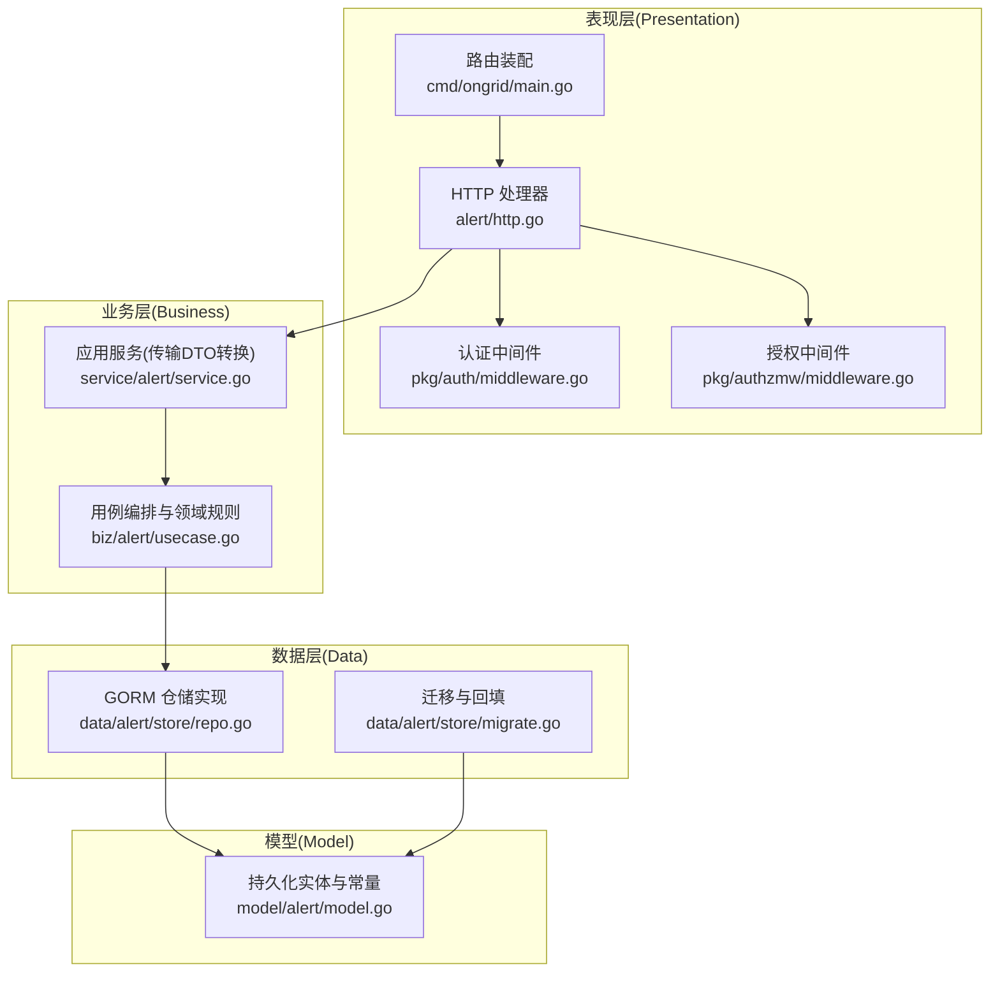
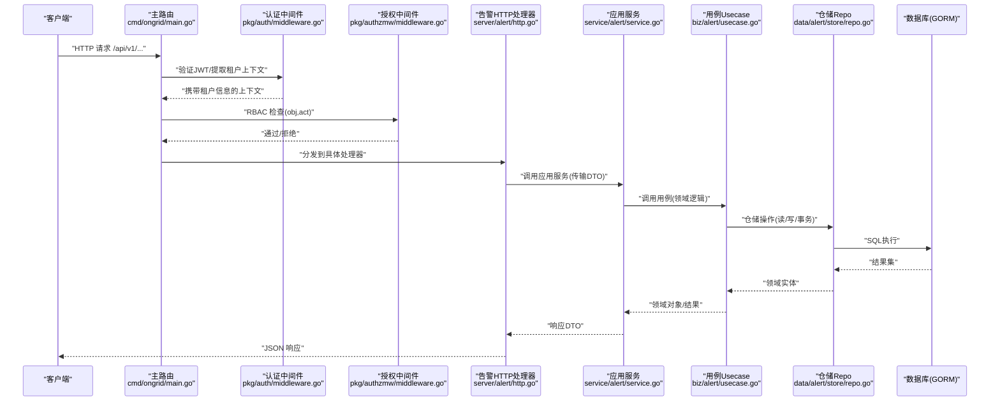
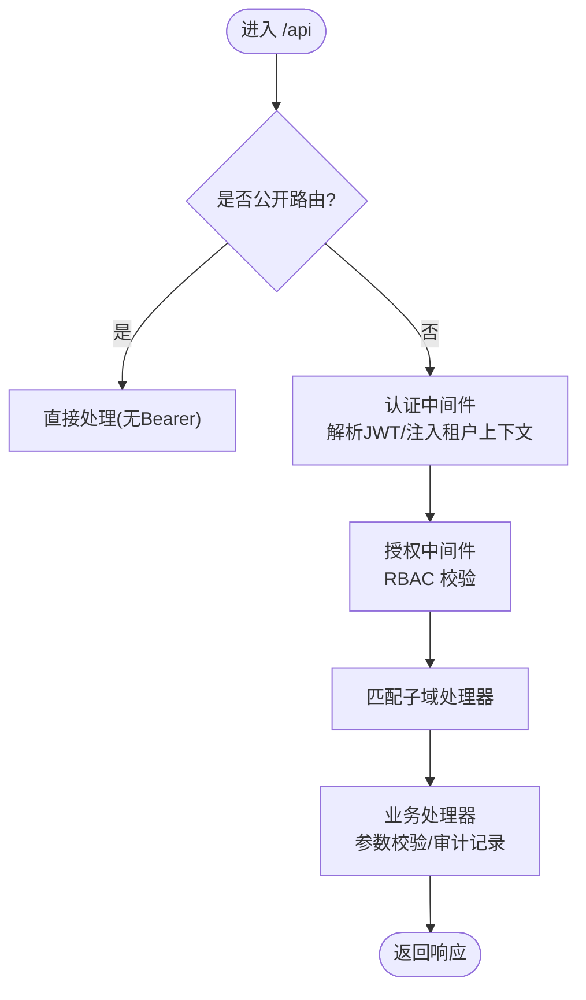
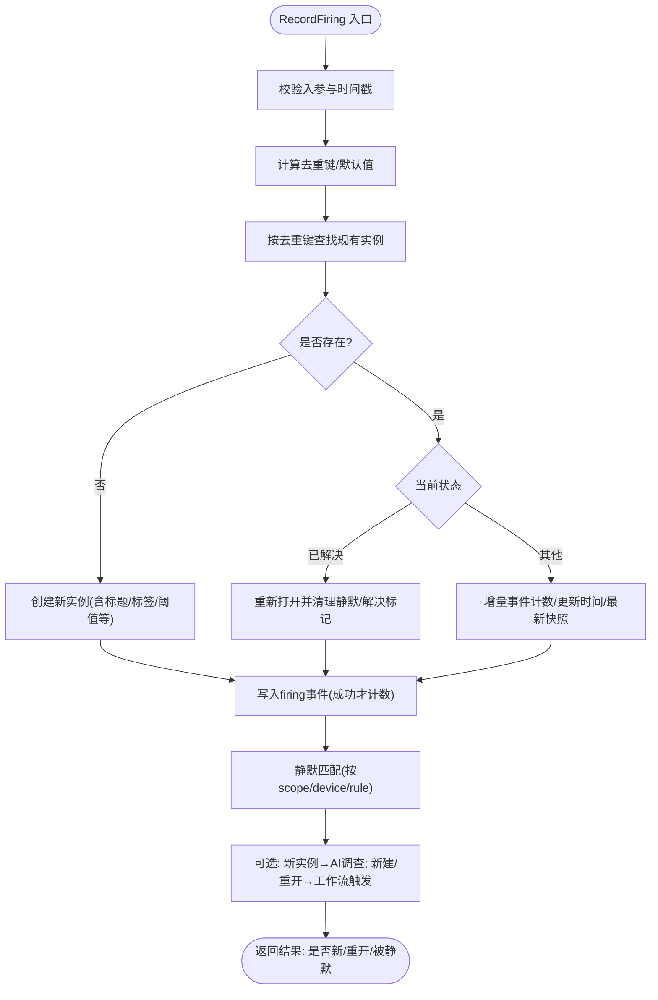
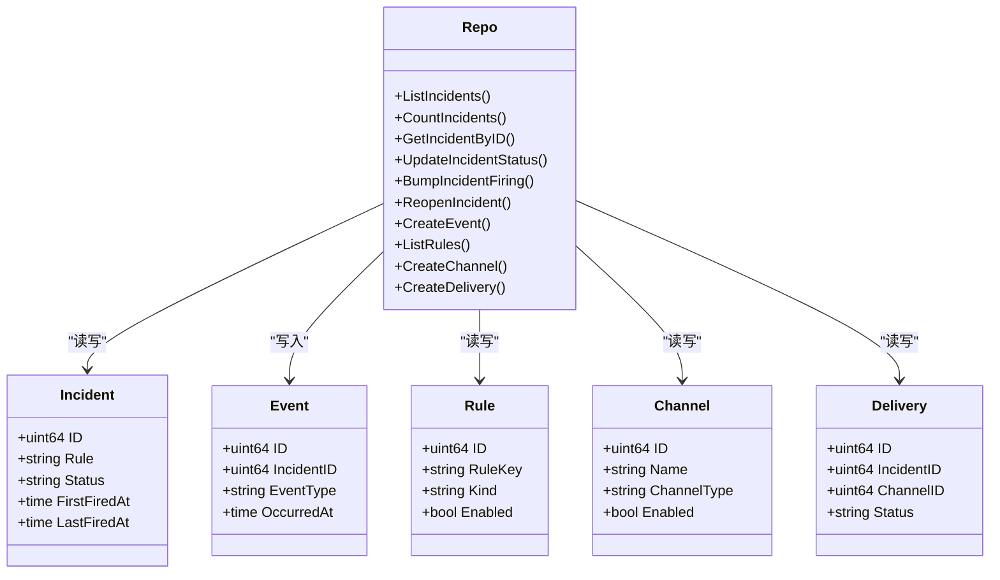
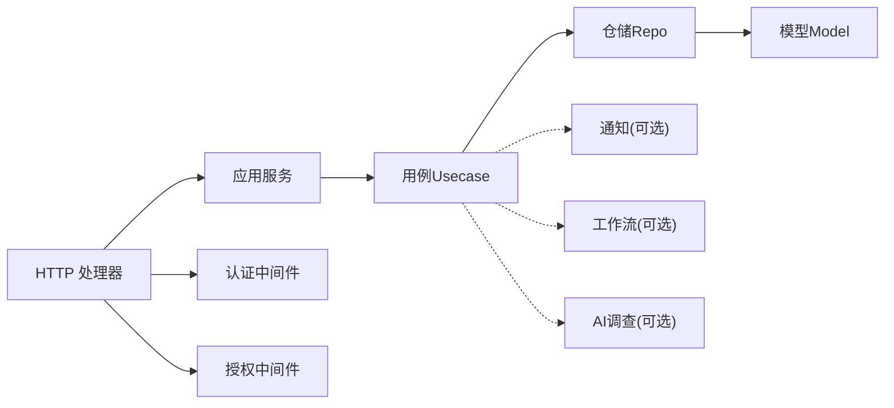

# 分层架构

<cite>
**本文引用的文件**   
- [cmd/ongrid/main.go](file://cmd/ongrid/main.go)
- [internal/pkg/auth/middleware.go](file://internal/pkg/auth/middleware.go)
- [internal/pkg/authzmw/middleware.go](file://internal/pkg/authzmw/middleware.go)
- [internal/manager/server/alert/http.go](file://internal/manager/server/alert/http.go)
- [internal/manager/service/alert/service.go](file://internal/manager/service/alert/service.go)
- [internal/manager/biz/alert/usecase.go](file://internal/manager/biz/alert/usecase.go)
- [internal/manager/data/alert/store/repo.go](file://internal/manager/data/alert/store/repo.go)
- [internal/manager/model/alert/model.go](file://internal/manager/model/alert/model.go)
- [internal/manager/data/alert/store/migrate.go](file://internal/manager/data/alert/store/migrate.go)
</cite>

## 目录
1. [简介](#简介)
2. [项目结构](#项目结构)
3. [核心组件](#核心组件)
4. [架构总览](#架构总览)
5. [详细组件分析](#详细组件分析)
6. [依赖关系分析](#依赖关系分析)
7. [性能考量](#性能考量)
8. [故障排查指南](#故障排查指南)
9. [结论](#结论)
10. [附录](#附录)

## 简介
本文件系统化阐述 OnGrid 的 Presentation-Business-Data 三层架构模式，聚焦于 HTTP API 层、业务用例层与数据访问层的职责边界、接口契约、数据流转与异常处理。文档以告警域为示例贯穿全链路，给出分层架构图、依赖图、时序图与流程图，并总结最佳实践与常见陷阱。

## 项目结构
OnGrid 后端采用“按领域分包 + 三层（Presentation/Business/Data）+ 通用基础库”的组织方式：
- Presentation（HTTP 层）：负责路由注册、请求解析、鉴权中间件、审计与响应封装。
- Business（业务层）：实现用例编排、领域规则校验、跨子系统协作（如通知、AI 调查、工作流触发）。
- Data（数据层）：基于 GORM 的仓储实现，包含迁移、软删除、索引优化与查询构造。
- Model（领域模型）：持久化实体定义、枚举常量、JSON 字段编解码辅助方法。
- pkg（公共基础库）：鉴权、租户上下文、错误码、日志、追踪等横切能力。

**图示来源** 
- [cmd/ongrid/main.go:2322-2482](file://cmd/ongrid/main.go#L2322-L2482)
- [internal/pkg/auth/middleware.go:1-68](file://internal/pkg/auth/middleware.go#L1-L68)
- [internal/pkg/authzmw/middleware.go:1-98](file://internal/pkg/authzmw/middleware.go#L1-L98)
- [internal/manager/server/alert/http.go:154-181](file://internal/manager/server/alert/http.go#L154-L181)
- [internal/manager/service/alert/service.go:207-238](file://internal/manager/service/alert/service.go#L207-L238)
- [internal/manager/biz/alert/usecase.go:73-103](file://internal/manager/biz/alert/usecase.go#L73-L103)
- [internal/manager/data/alert/store/repo.go:16-23](file://internal/manager/data/alert/store/repo.go#L16-L23)
- [internal/manager/model/alert/model.go:209-338](file://internal/manager/model/alert/model.go#L209-L338)
- [internal/manager/data/alert/store/migrate.go:20-31](file://internal/manager/data/alert/store/migrate.go#L20-L31)

**章节来源**
- [cmd/ongrid/main.go:2322-2482](file://cmd/ongrid/main.go#L2322-L2482)
- [internal/manager/server/alert/http.go:154-181](file://internal/manager/server/alert/http.go#L154-L181)
- [internal/manager/service/alert/service.go:207-238](file://internal/manager/service/alert/service.go#L207-L238)
- [internal/manager/biz/alert/usecase.go:73-103](file://internal/manager/biz/alert/usecase.go#L73-L103)
- [internal/manager/data/alert/store/repo.go:16-23](file://internal/manager/data/alert/store/repo.go#L16-L23)
- [internal/manager/model/alert/model.go:209-338](file://internal/manager/model/alert/model.go#L209-L338)
- [internal/manager/data/alert/store/migrate.go:20-31](file://internal/manager/data/alert/store/migrate.go#L20-L31)

## 核心组件
- 表现层(HTTP)
  - 路由注册：在受保护组中挂载各子域处理器，统一走认证与审计中间件。
  - 请求处理：参数解析、调用应用服务、记录审计事件、返回 JSON。
- 业务层(UseCase)
  - 用例编排：入参校验、状态机转换、并发安全（竞态恢复）、异步扩展点（AI 调查、工作流触发）。
  - 发送策略：窗口+最小触发次数抑制通知但不抑制事件写入。
- 数据层(Repo)
  - GORM 仓储：分页、过滤、计数、软删除、唯一约束冲突处理、批量更新。
  - 迁移：AutoMigrate + 历史兼容回填（kind 归一、scope 拆分、列重命名、表达式合并）。
- 模型层(Model)
  - 实体定义：Incident/Event/Silence/Rule/Channel/Delivery 等表结构与索引。
  - 常量与工具：规则 kind 归一化、已知/可评估判定、JSON 字段解析器。

**章节来源**
- [internal/manager/server/alert/http.go:154-181](file://internal/manager/server/alert/http.go#L154-L181)
- [internal/manager/biz/alert/usecase.go:315-479](file://internal/manager/biz/alert/usecase.go#L315-L479)
- [internal/manager/data/alert/store/repo.go:25-75](file://internal/manager/data/alert/store/repo.go#L25-L75)
- [internal/manager/data/alert/store/migrate.go:20-31](file://internal/manager/data/alert/store/migrate.go#L20-L31)
- [internal/manager/model/alert/model.go:209-338](file://internal/manager/model/alert/model.go#L209-L338)

## 架构总览
下图展示从 HTTP 到数据库的完整调用链，以及关键横切关注点（认证、授权、审计、追踪）。

**图示来源** 
- [cmd/ongrid/main.go:2322-2482](file://cmd/ongrid/main.go#L2322-L2482)
- [internal/pkg/auth/middleware.go:10-53](file://internal/pkg/auth/middleware.go#L10-L53)
- [internal/pkg/authzmw/middleware.go:57-97](file://internal/pkg/authzmw/middleware.go#L57-L97)
- [internal/manager/server/alert/http.go:154-181](file://internal/manager/server/alert/http.go#L154-L181)
- [internal/manager/service/alert/service.go:207-238](file://internal/manager/service/alert/service.go#L207-L238)
- [internal/manager/biz/alert/usecase.go:73-103](file://internal/manager/biz/alert/usecase.go#L73-L103)
- [internal/manager/data/alert/store/repo.go:16-23](file://internal/manager/data/alert/store/repo.go#L16-L23)

## 详细组件分析

### 表现层(HTTP)
- 路由设计
  - 公开路由：登录、刷新、IM Webhook、页面分享等无需 Bearer Token。
  - 受保护路由：统一挂载认证中间件，再按子域注册处理器。
- 中间件链
  - OTel 追踪 → 自监控指标 → 审计 → 健康检查 → 数据面鉴权 → /api 分组 → 认证 → 授权 → 业务处理器。
- 请求处理流程
  - 解析路径参数与查询参数 → 调用应用服务 → 可选记录审计事件 → 返回 JSON。

**图示来源** 
- [cmd/ongrid/main.go:2322-2482](file://cmd/ongrid/main.go#L2322-L2482)
- [internal/pkg/auth/middleware.go:10-53](file://internal/pkg/auth/middleware.go#L10-L53)
- [internal/pkg/authzmw/middleware.go:57-97](file://internal/pkg/authzmw/middleware.go#L57-L97)
- [internal/manager/server/alert/http.go:154-181](file://internal/manager/server/alert/http.go#L154-L181)

**章节来源**
- [cmd/ongrid/main.go:2322-2482](file://cmd/ongrid/main.go#L2322-L2482)
- [internal/manager/server/alert/http.go:154-181](file://internal/manager/server/alert/http.go#L154-L181)

### 业务层(用例与领域规则)
- 用例入口
  - 列表/计数/详情、确认/解决/静默、事件时间线、规则CRUD、预览试算、通道测试等。
- 核心规则
  - 去重键生成与竞态恢复（并发插入失败则回退读取现有行）。
  - 静默匹配（按 scope/device/rule 与时间窗）。
  - 发送策略抑制（窗口+最小触发次数），仅抑制通知不抑制事件。
  - 异步扩展点：新实例首次触发时派发 AI 调查；新建或重新打开时触发工作流。
- 输入校验
  - 规则 kind/scope/join_mode/severity 合法性、条件编译、发送策略范围限制。

**图示来源** 
- [internal/manager/biz/alert/usecase.go:315-479](file://internal/manager/biz/alert/usecase.go#L315-L479)

**章节来源**
- [internal/manager/biz/alert/usecase.go:315-479](file://internal/manager/biz/alert/usecase.go#L315-L479)

### 数据层(仓储与迁移)
- 仓储实现
  - 列表/计数/详情/更新状态/重开/抑制标记/事件/静默/规则/通道/投递等。
  - 使用 WithContext 传递上下文，统一错误包装与 NotFound 语义。
- 迁移与回填
  - AutoMigrate 新增表与列。
  - 历史兼容：kind 归一化、旧 kind 重写为 metric_raw、scope 拆分、edge_id→device_id 重命名列、metric_threshold→metric_raw 表达式合并。

**图示来源** 
- [internal/manager/model/alert/model.go:209-379](file://internal/manager/model/alert/model.go#L209-L379)
- [internal/manager/data/alert/store/repo.go:25-800](file://internal/manager/data/alert/store/repo.go#L25-L800)

**章节来源**
- [internal/manager/data/alert/store/repo.go:25-800](file://internal/manager/data/alert/store/repo.go#L25-L800)
- [internal/manager/data/alert/store/migrate.go:20-195](file://internal/manager/data/alert/store/migrate.go#L20-L195)

### 模型层(领域模型)
- 实体与索引
  - Incident/Event/Silence/Rule/Channel/Delivery 等表结构，附带常用索引（rule、status、created_at 组合等）。
- 常量与工具
  - 规则 kind 归一化、已知/可评估判断、JSON 字段解析辅助方法。
  - 通道类型、投递状态、事件类型等枚举。

**章节来源**
- [internal/manager/model/alert/model.go:11-177](file://internal/manager/model/alert/model.go#L11-L177)
- [internal/manager/model/alert/model.go:209-379](file://internal/manager/model/alert/model.go#L209-L379)

## 依赖关系分析
- 耦合与内聚
  - HTTP 层仅依赖应用服务接口，避免直连用例与模型。
  - 应用服务负责 DTO 与领域对象的映射，屏蔽用例细节。
  - 用例只依赖仓储接口，保持领域逻辑独立于存储实现。
  - 仓储实现依赖 GORM 与模型，集中管理 SQL 与迁移。
- 外部依赖
  - 认证中间件提供 JWT 校验与租户上下文注入。
  - 授权中间件提供 RBAC 短路与日志。
  - 通知/工作流/AI 调查作为可选扩展点，通过接口注入，nil 安全。

**图示来源** 
- [internal/manager/server/alert/http.go:154-181](file://internal/manager/server/alert/http.go#L154-L181)
- [internal/manager/service/alert/service.go:207-238](file://internal/manager/service/alert/service.go#L207-L238)
- [internal/manager/biz/alert/usecase.go:73-103](file://internal/manager/biz/alert/usecase.go#L73-L103)
- [internal/manager/data/alert/store/repo.go:16-23](file://internal/manager/data/alert/store/repo.go#L16-L23)
- [internal/manager/model/alert/model.go:209-338](file://internal/manager/model/alert/model.go#L209-L338)
- [internal/pkg/auth/middleware.go:10-53](file://internal/pkg/auth/middleware.go#L10-L53)
- [internal/pkg/authzmw/middleware.go:57-97](file://internal/pkg/authzmw/middleware.go#L57-L97)

**章节来源**
- [internal/manager/server/alert/http.go:154-181](file://internal/manager/server/alert/http.go#L154-L181)
- [internal/manager/service/alert/service.go:207-238](file://internal/manager/service/alert/service.go#L207-L238)
- [internal/manager/biz/alert/usecase.go:73-103](file://internal/manager/biz/alert/usecase.go#L73-L103)
- [internal/manager/data/alert/store/repo.go:16-23](file://internal/manager/data/alert/store/repo.go#L16-L23)
- [internal/manager/model/alert/model.go:209-338](file://internal/manager/model/alert/model.go#L209-L338)
- [internal/pkg/auth/middleware.go:10-53](file://internal/pkg/auth/middleware.go#L10-L53)
- [internal/pkg/authzmw/middleware.go:57-97](file://internal/pkg/authzmw/middleware.go#L57-L97)

## 性能考量
- 查询优化
  - 列表与计数分离，确保总数准确且不受分页影响。
  - 使用 Where/Limit/Offset 与排序索引，减少扫描范围。
- 写入优化
  - 增量更新（event_count 原子加一），避免整行覆盖。
  - 软删除与 DeletedAt 索引，便于统计与清理。
- 并发与幂等
  - 竞态恢复：并发插入失败后回退读取现有行，保证一致性。
  - 迁移幂等：多次启动不会重复改写。

[本节为通用指导，不直接分析具体文件]

## 故障排查指南
- 认证失败
  - 缺少 Bearer Token 或 Token 无效将返回未授权；WebSocket 场景支持 ?token 查询参数。
- 授权拒绝
  - 非超级用户且无权限将被拒绝；授权中间件会记录拒绝日志。
- 业务错误
  - 用例层对必填字段、范围与格式进行校验，返回明确的错误码与消息。
- 数据层错误
  - 仓储层将 gorm.ErrRecordNotFound 转换为统一的 ErrNotFound；RowsAffected=0 视为不存在。
- 迁移问题
  - 若升级后出现规则不可用，检查迁移日志与回填步骤是否完成。

**章节来源**
- [internal/pkg/auth/middleware.go:10-53](file://internal/pkg/auth/middleware.go#L10-L53)
- [internal/pkg/authzmw/middleware.go:57-97](file://internal/pkg/authzmw/middleware.go#L57-L97)
- [internal/manager/biz/alert/usecase.go:315-479](file://internal/manager/biz/alert/usecase.go#L315-L479)
- [internal/manager/data/alert/store/repo.go:77-86](file://internal/manager/data/alert/store/repo.go#L77-L86)
- [internal/manager/data/alert/store/migrate.go:20-195](file://internal/manager/data/alert/store/migrate.go#L20-L195)

## 结论
OnGrid 的分层架构清晰解耦了 HTTP 接入、业务编排与数据持久化，结合认证/授权/审计/追踪等横切能力，形成高内聚、低耦合的可维护系统。以告警域为例，展示了从路由到数据库的端到端流程、并发安全与可扩展性设计。遵循该模式可有效降低变更风险、提升可观测性与可测试性。

[本节为总结，不直接分析具体文件]

## 附录
- 最佳实践
  - 明确三层职责边界：HTTP 只做协议适配与审计；业务层承载用例与规则；数据层专注存储与迁移。
  - 接口在消费方定义，避免循环依赖；依赖通过构造函数注入，不使用全局变量。
  - 错误用标准错误码包装，避免重复记录；对外返回一致的错误体结构。
  - 对高频字段建立合适索引，避免高基数字段作 Prometheus label。
- 常见陷阱
  - 在 HTTP 层直接访问模型或仓储，导致职责混乱。
  - 忽略并发竞态，未做重试/回退逻辑。
  - 迁移脚本非幂等，导致重复运行破坏数据。
  - 将敏感信息（密钥、长文本）放入 label 或日志。

[本节为通用指导，不直接分析具体文件]