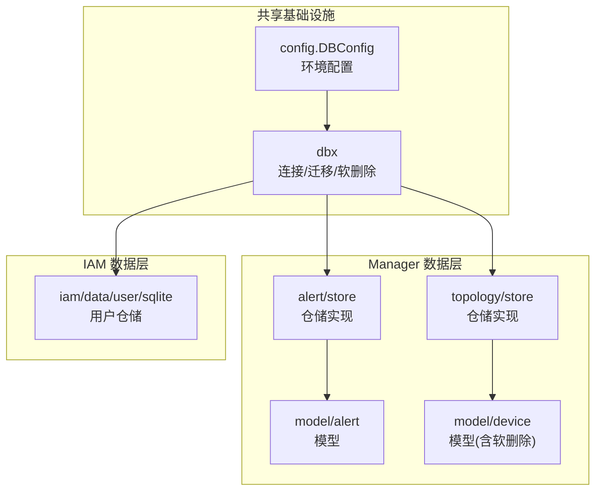
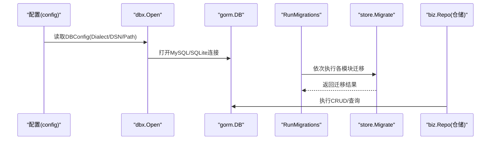
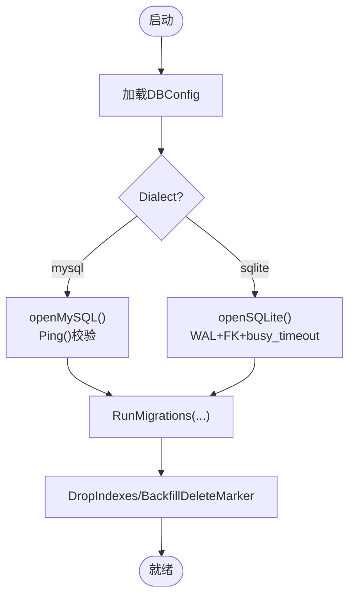
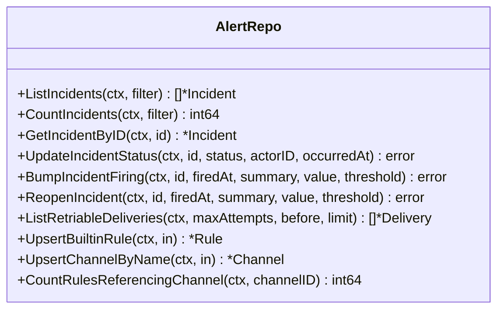
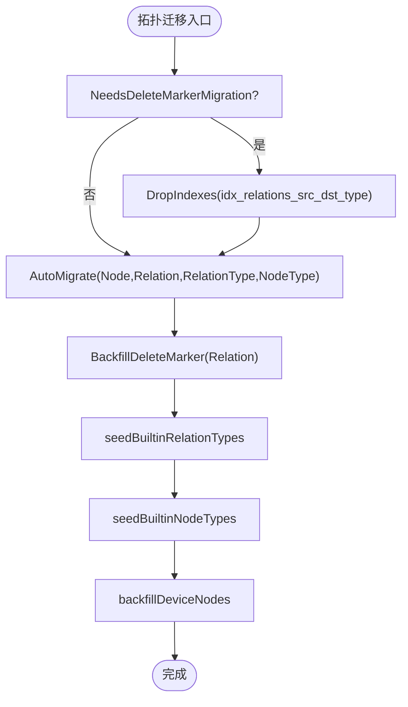
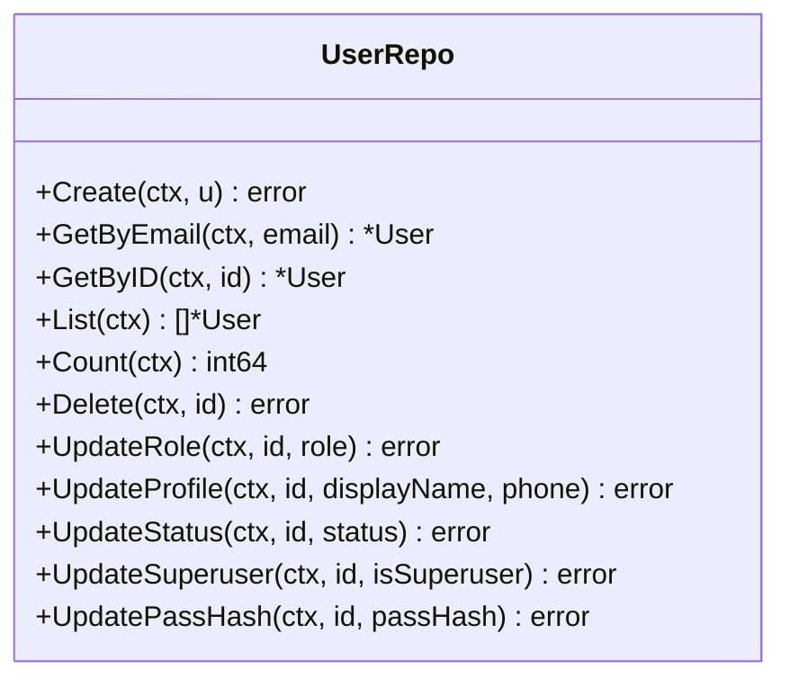
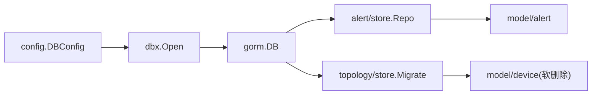

# 数据访问层 (Data Access Layer)

<cite>
**本文引用的文件**   
- [internal/pkg/dbx/dbx.go](file://internal/pkg/dbx/dbx.go)
- [internal/pkg/dbx/migrate.go](file://internal/pkg/dbx/migrate.go)
- [internal/pkg/dbx/soft_delete.go](file://internal/pkg/dbx/soft_delete.go)
- [internal/pkg/config/config.go](file://internal/pkg/config/config.go)
- [internal/manager/data/alert/store/repo.go](file://internal/manager/data/alert/store/repo.go)
- [internal/manager/data/alert/store/migrate.go](file://internal/manager/data/alert/store/migrate.go)
- [internal/manager/data/topology/store/migrate.go](file://internal/manager/data/topology/store/migrate.go)
- [internal/iam/data/user/sqlite/user.go](file://internal/iam/data/user/sqlite/user.go)
- [internal/manager/model/device/model.go](file://internal/manager/model/device/model.go)
- [internal/manager/biz/aiops/tools/analyze_database_status.go](file://internal/manager/biz/aiops/tools/analyze_database_status.go)
- [deploy/README.md](file://deploy/README.md)
</cite>

## 目录
1. [简介](#简介)
2. [项目结构](#项目结构)
3. [核心组件](#核心组件)
4. [架构总览](#架构总览)
5. [详细组件分析](#详细组件分析)
6. [依赖关系分析](#依赖关系分析)
7. [性能考虑](#性能考虑)
8. [故障排查指南](#故障排查指南)
9. [结论](#结论)
10. [附录](#附录)

## 简介
本文件系统化梳理 OnGrid 的数据访问层（DAL），围绕 Repository 模式、GORM ORM 使用、数据库迁移管理、查询优化策略、连接池与事务、批量操作、软删除、索引设计、缓存机制、多存储后端与一致性保证展开，并提供最佳实践与 SQL 调优建议。文档以代码为依据，面向不同技术背景的读者提供由浅入深的说明。

## 项目结构
OnGrid 的 DAL 采用“领域分层 + 仓储实现”的组织方式：
- internal/pkg/dbx：共享数据库基础设施（连接、迁移编排、软删除兼容工具）
- internal/manager/data/*：各业务域的数据仓储实现（如 alert、topology、edge 等）
- internal/iam/data/*：IAM 子系统的仓储实现
- internal/manager/model/*：领域模型定义（DO/PO）
- internal/manager/biz/*：业务用例层，通过接口调用 data 层仓储

图表来源
- [internal/pkg/dbx/dbx.go:1-151](file://internal/pkg/dbx/dbx.go#L1-L151)
- [internal/pkg/config/config.go:259-272](file://internal/pkg/config/config.go#L259-L272)
- [internal/manager/data/alert/store/repo.go:1-800](file://internal/manager/data/alert/store/repo.go#L1-L800)
- [internal/manager/data/topology/store/migrate.go:1-49](file://internal/manager/data/topology/store/migrate.go#L1-L49)
- [internal/iam/data/user/sqlite/user.go:1-151](file://internal/iam/data/user/sqlite/user.go#L1-L151)
- [internal/manager/model/device/model.go:23-51](file://internal/manager/model/device/model.go#L23-L51)

章节来源
- [internal/pkg/dbx/dbx.go:1-151](file://internal/pkg/dbx/dbx.go#L1-L151)
- [internal/pkg/config/config.go:259-272](file://internal/pkg/config/config.go#L259-L272)

## 核心组件
- dbx.Open：根据配置选择 MySQL 或 SQLite 驱动，完成连接初始化与连通性检查；默认日志级别为 Warn，避免污染应用日志。
- dbx.RunMigrations：按序执行各模块的 Migrator，记录耗时并包装错误便于定位。
- dbx.DropIndexes / BackfillDeleteMarker：用于历史表结构演进时的索引重建与软删除标记回填。
- config.DBConfig：集中承载 Dialect、DSN、Path 等数据库相关环境变量解析与默认值。
- 各 store.Repo：基于 gorm.DB 实现的 CRUD 与复杂查询，统一返回 errs.ErrNotFound 等标准错误。

章节来源
- [internal/pkg/dbx/dbx.go:34-77](file://internal/pkg/dbx/dbx.go#L34-L77)
- [internal/pkg/dbx/migrate.go:12-46](file://internal/pkg/dbx/migrate.go#L12-L46)
- [internal/pkg/dbx/soft_delete.go:9-78](file://internal/pkg/dbx/soft_delete.go#L9-L78)
- [internal/pkg/config/config.go:259-272](file://internal/pkg/config/config.go#L259-L272)
- [internal/manager/data/alert/store/repo.go:16-86](file://internal/manager/data/alert/store/repo.go#L16-L86)

## 架构总览
OnGrid 的 DAL 遵循清晰的层次：
- 配置层：从环境变量加载 DBConfig
- 连接层：dbx.Open 打开 gorm.DB（MySQL/SQLite）
- 迁移层：dbx.RunMigrations 串联各模块 Migrate
- 仓储层：每个业务域提供 Repo 实现 biz.Repo 接口
- 模型层：model 包定义 DO/PO，部分模型集成 gorm soft_delete

图表来源
- [internal/pkg/config/config.go:369-384](file://internal/pkg/config/config.go#L369-L384)
- [internal/pkg/dbx/dbx.go:40-77](file://internal/pkg/dbx/dbx.go#L40-L77)
- [internal/pkg/dbx/migrate.go:26-46](file://internal/pkg/dbx/migrate.go#L26-L46)
- [internal/manager/data/alert/store/migrate.go:11-14](file://internal/manager/data/alert/store/migrate.go#L11-L14)
- [internal/manager/data/alert/store/repo.go:25-50](file://internal/manager/data/alert/store/repo.go#L25-L50)

## 详细组件分析

### 组件A：dbx 基础设施（连接、迁移、软删除兼容）
- 连接与后端选择
  - Open 支持 mysql 与 sqlite 两种方言；空方言视为 mysql。
  - MySQL 在 Open 后执行 Ping 快速失败；SQLite 启用 WAL、busy_timeout、foreign_keys。
- 迁移编排
  - RunMigrations 顺序执行 Migrator，记录开始/结束时间与错误位置。
- 软删除兼容
  - DropIndexes：安全删除已有索引以便 AutoMigrate 重建。
  - NeedsDeleteMarkerMigration / BackfillDeleteMarkerWithValue：对历史表进行 delete_marker 字段与唯一键兼容性回填。

图表来源
- [internal/pkg/dbx/dbx.go:40-112](file://internal/pkg/dbx/dbx.go#L40-L112)
- [internal/pkg/dbx/migrate.go:26-46](file://internal/pkg/dbx/migrate.go#L26-L46)
- [internal/pkg/dbx/soft_delete.go:9-78](file://internal/pkg/dbx/soft_delete.go#L9-L78)

章节来源
- [internal/pkg/dbx/dbx.go:34-112](file://internal/pkg/dbx/dbx.go#L34-L112)
- [internal/pkg/dbx/migrate.go:12-46](file://internal/pkg/dbx/migrate.go#L12-L46)
- [internal/pkg/dbx/soft_delete.go:9-78](file://internal/pkg/dbx/soft_delete.go#L9-L78)

### 组件B：Alert 仓储（示例仓储）
- 典型 CRUD 与分页查询：ListIncidents、CountIncidents、GetIncidentByID、UpdateIncidentStatus 等
- 幂等与状态机：BumpIncidentFiring、ReopenIncident 维护事件计数与时间戳
- 通知投递重试：ListRetriableDeliveries 拉取待重试投递
- 规则与通道：UpsertBuiltinRule、UpsertChannelByName、CountRulesReferencingChannel（JSON 列模糊匹配）

图表来源
- [internal/manager/data/alert/store/repo.go:25-246](file://internal/manager/data/alert/store/repo.go#L25-L246)
- [internal/manager/data/alert/store/repo.go:301-345](file://internal/manager/data/alert/store/repo.go#L301-L345)
- [internal/manager/data/alert/store/repo.go:537-555](file://internal/manager/data/alert/store/repo.go#L537-L555)
- [internal/manager/data/alert/store/repo.go:750-775](file://internal/manager/data/alert/store/repo.go#L750-L775)

章节来源
- [internal/manager/data/alert/store/repo.go:25-246](file://internal/manager/data/alert/store/repo.go#L25-L246)
- [internal/manager/data/alert/store/repo.go:301-345](file://internal/manager/data/alert/store/repo.go#L301-L345)
- [internal/manager/data/alert/store/repo.go:537-555](file://internal/manager/data/alert/store/repo.go#L537-L555)
- [internal/manager/data/alert/store/repo.go:750-775](file://internal/manager/data/alert/store/repo.go#L750-L775)

### 组件C：Topology 迁移（示例迁移）
- 组合式迁移：先判断是否需要删除旧索引，再 AutoMigrate，随后回填 delete_marker，最后播种内置类型与节点。
- 幂等保障：二次启动为 no-op。

图表来源
- [internal/manager/data/topology/store/migrate.go:20-39](file://internal/manager/data/topology/store/migrate.go#L20-L39)
- [internal/manager/data/topology/store/migrate.go:41-49](file://internal/manager/data/topology/store/migrate.go#L41-L49)

章节来源
- [internal/manager/data/topology/store/migrate.go:1-49](file://internal/manager/data/topology/store/migrate.go#L1-L49)

### 组件D：IAM 用户仓储（SQLite 示例）
- 统一的 ErrRecordNotFound -> errs.ErrNotFound 映射
- 基础 CRUD：Create、GetByEmail、GetByID、List、Count、Delete、UpdateRole/Profile/Status/Superuser/PassHash

图表来源
- [internal/iam/data/user/sqlite/user.go:26-150](file://internal/iam/data/user/sqlite/user.go#L26-L150)

章节来源
- [internal/iam/data/user/sqlite/user.go:1-151](file://internal/iam/data/user/sqlite/user.go#L1-L151)

### 组件E：设备模型与软删除
- Device 模型引入 gorm.io/plugin/soft_delete，使 Delete 变为软删除，查询自动过滤已删除行。
- 结合 dbx.BackfillDeleteMarkerWithValue 可处理历史表迁移到软删除后的兼容问题。

章节来源
- [internal/manager/model/device/model.go:23-51](file://internal/manager/model/device/model.go#L23-L51)
- [internal/pkg/dbx/soft_delete.go:41-78](file://internal/pkg/dbx/soft_delete.go#L41-L78)

## 依赖关系分析
- 配置依赖：config.DBConfig 决定 dbx.Open 的后端选择与参数
- 连接依赖：dbx.Open 返回 gorm.DB，被各 store.Repo 注入使用
- 迁移依赖：dbx.RunMigrations 串联各模块 Migrate
- 模型依赖：store 实现依赖 model 定义的结构体与标签

图表来源
- [internal/pkg/config/config.go:259-272](file://internal/pkg/config/config.go#L259-L272)
- [internal/pkg/dbx/dbx.go:40-77](file://internal/pkg/dbx/dbx.go#L40-L77)
- [internal/manager/data/alert/store/repo.go:16-24](file://internal/manager/data/alert/store/repo.go#L16-L24)
- [internal/manager/data/topology/store/migrate.go:20-28](file://internal/manager/data/topology/store/migrate.go#L20-L28)
- [internal/manager/model/device/model.go:23-51](file://internal/manager/model/device/model.go#L23-L51)

章节来源
- [internal/pkg/config/config.go:259-272](file://internal/pkg/config/config.go#L259-L272)
- [internal/pkg/dbx/dbx.go:40-77](file://internal/pkg/dbx/dbx.go#L40-L77)
- [internal/manager/data/alert/store/repo.go:16-24](file://internal/manager/data/alert/store/repo.go#L16-L24)
- [internal/manager/data/topology/store/migrate.go:20-28](file://internal/manager/data/topology/store/migrate.go#L20-L28)
- [internal/manager/model/device/model.go:23-51](file://internal/manager/model/device/model.go#L23-L51)

## 性能考虑
- 连接与并发
  - MySQL：Open 后 Ping 快速失败，避免延迟报错；生产建议使用连接池参数（由 go-sql-driver/mysql 控制）。
  - SQLite：WAL 提升并发读能力，busy_timeout 降低 SQLITE_BUSY 概率，适合本地调试。
- 查询优化
  - 使用 Where/Limit/Offset 精确过滤与分页，避免全表扫描。
  - 复杂条件优先走索引列；对 JSON 列的匹配需谨慎（如 CountRulesReferencingChannel 使用 LIKE 边界锚定）。
- 批量与重试
  - 投递重试队列 ListRetriableDeliveries 限制每次拉取数量，避免一次性压垮下游。
- 软删除与索引
  - 历史表迁移时通过 DropIndexes 与 BackfillDeleteMarkerWithValue 确保唯一约束与查询计划稳定。
- 外部系统交互
  - AIOps 数据库健康分析工具通过 PromQL 聚合指标，减少直接 DB 压力，将重计算下推到 TSDB。

章节来源
- [internal/pkg/dbx/dbx.go:52-112](file://internal/pkg/dbx/dbx.go#L52-L112)
- [internal/manager/data/alert/store/repo.go:298-316](file://internal/manager/data/alert/store/repo.go#L298-L316)
- [internal/manager/data/alert/store/repo.go:750-775](file://internal/manager/data/alert/store/repo.go#L750-L775)
- [internal/manager/biz/aiops/tools/analyze_database_status.go:1259-1282](file://internal/manager/biz/aiops/tools/analyze_database_status.go#L1259-L1282)

## 故障排查指南
- 连接失败
  - MySQL DSN 为空或 Ping 失败会立即返回错误；检查环境变量 ONGRID_DB_DSN 与网络可达性。
  - SQLite 路径不存在会自动创建父目录；确认路径权限与磁盘空间。
- 迁移失败
  - RunMigrations 会记录每个 migrator 的序号与耗时；若失败，查看对应模块的 Migrate 逻辑。
  - 历史表结构变更需先 DropIndexes 再 AutoMigrate，必要时执行 BackfillDeleteMarkerWithValue。
- 软删除异常
  - 若出现唯一键冲突，检查是否遗漏了 delete_marker 回填；使用 NeedsDeleteMarkerMigration 判断。
- 查询无结果
  - 仓储层对 gorm.ErrRecordNotFound 统一转换为 errs.ErrNotFound；调用方应据此分支处理。

章节来源
- [internal/pkg/dbx/dbx.go:52-77](file://internal/pkg/dbx/dbx.go#L52-L77)
- [internal/pkg/dbx/migrate.go:26-46](file://internal/pkg/dbx/migrate.go#L26-L46)
- [internal/pkg/dbx/soft_delete.go:32-78](file://internal/pkg/dbx/soft_delete.go#L32-L78)
- [internal/manager/data/alert/store/repo.go:77-86](file://internal/manager/data/alert/store/repo.go#L77-L86)

## 结论
OnGrid 的数据访问层以 dbx 为核心基础设施，配合 config.DBConfig 实现多后端切换；通过 dbx.RunMigrations 统一管理迁移，结合软删除兼容工具保障平滑演进。仓储层以 Repo 模式封装持久化细节，对外暴露稳定的接口契约。整体设计兼顾可移植性、可观测性与可维护性，并通过明确的错误语义与查询优化策略提升稳定性与性能。

## 附录

### 多存储后端与本地开发
- 本地快速体验可使用 SQLite，设置环境变量切换后端与数据文件路径。
- 生产推荐 MySQL，注意连接池与慢查询监控。

章节来源
- [deploy/README.md:100-114](file://deploy/README.md#L100-L114)
- [internal/pkg/config/config.go:379-384](file://internal/pkg/config/config.go#L379-L384)

### 数据同步与一致性
- 对于跨系统数据（如 Prometheus 指标），优先通过 AIOps 工具在 TSDB 侧聚合，避免频繁直连业务库造成压力。
- 对关键写路径（如规则/通道 upsert）采用幂等写入与唯一键约束，避免重复与脏数据。

章节来源
- [internal/manager/biz/aiops/tools/analyze_database_status.go:1259-1282](file://internal/manager/biz/aiops/tools/analyze_database_status.go#L1259-L1282)
- [internal/manager/data/alert/store/repo.go:537-555](file://internal/manager/data/alert/store/repo.go#L537-L555)