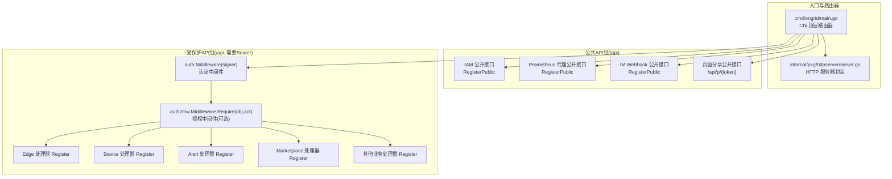
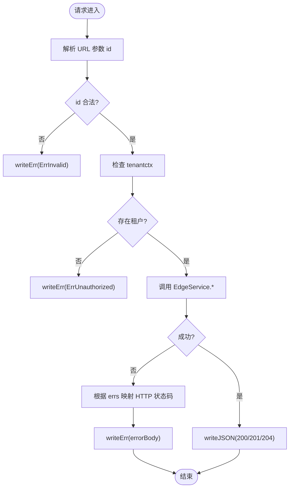
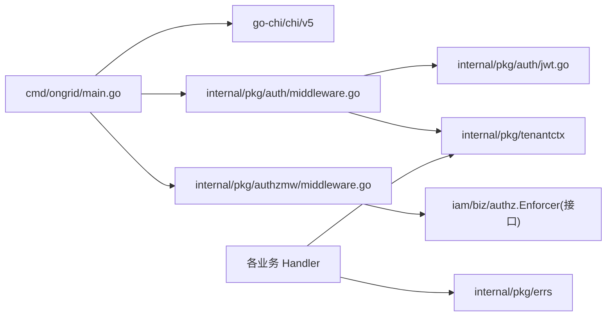

# 表现层 (Presentation Layer)

<cite>
**本文引用的文件**   
- [cmd/ongrid/main.go](file://cmd/ongrid/main.go)
- [internal/pkg/httpserver/server.go](file://internal/pkg/httpserver/server.go)
- [internal/pkg/auth/jwt.go](file://internal/pkg/auth/jwt.go)
- [internal/pkg/auth/middleware.go](file://internal/pkg/auth/middleware.go)
- [internal/pkg/authzmw/middleware.go](file://internal/pkg/authzmw/middleware.go)
- [internal/manager/server/edge/http.go](file://internal/manager/server/edge/http.go)
- [internal/manager/server/device/http.go](file://internal/manager/server/device/http.go)
- [internal/manager/server/alert/http.go](file://internal/manager/server/alert/http.go)
- [internal/manager/server/marketplace/http.go](file://internal/manager/server/marketplace/http.go)
</cite>

## 目录
1. [简介](#简介)
2. [项目结构](#项目结构)
3. [核心组件](#核心组件)
4. [架构总览](#架构总览)
5. [详细组件分析](#详细组件分析)
6. [依赖分析](#依赖分析)
7. [性能考虑](#性能考虑)
8. [故障排查指南](#故障排查指南)
9. [结论](#结论)
10. [附录](#附录)

## 简介
本文件聚焦 OnGrid 的表现层（HTTP API 层），系统性阐述以下主题：
- Chi 路由器的使用与分组策略、中间件链设计与请求处理流程
- DTO 数据传输对象的设计原则、JSON 序列化规范与错误响应格式
- 认证中间件、授权中间件与审计中间件的实现方式
- API 端点注册、参数校验、响应格式化与异常处理
- RESTful API 设计原则、状态码使用与错误响应格式
- 表现层最佳实践与常见陷阱避免指南

## 项目结构
表现层位于 cmd/ongrid/main.go 中统一装配，按“公开 / 受保护”两组路由组织；各业务域以 Handler + Register 模式挂载到 chi.Router。通用能力由 internal/pkg/* 提供：HTTP 服务器封装、JWT 签发与验证、鉴权中间件、基于 Casbin 的授权中间件等。



图表来源
- [cmd/ongrid/main.go:2322-2482](file://cmd/ongrid/main.go#L2322-L2482)
- [internal/pkg/httpserver/server.go:1-60](file://internal/pkg/httpserver/server.go#L1-L60)

章节来源
- [cmd/ongrid/main.go:2322-2482](file://cmd/ongrid/main.go#L2322-L2482)
- [internal/pkg/httpserver/server.go:1-60](file://internal/pkg/httpserver/server.go#L1-L60)

## 核心组件
- HTTP 服务器封装：提供优雅关闭、监听地址与日志记录，供主进程启动 API 与 Metrics 监听器。
- JWT 签名与验证：HS256，支持访问令牌与刷新令牌，Claims 包含用户标识、角色与超级管理员标记。
- 认证中间件：从 Authorization: Bearer 或 ?token= 提取令牌，校验后写入 tenantctx，并回写外层可变槽位以便上层中间件可见。
- 授权中间件：基于 Authorizer 接口（Casbin Enforcer）进行资源-动作判断，支持超管短路放行与 nil 兼容（无 IAM 时降级）。
- 审计中间件：全局拦截变更类请求与认证失败事件，Handler 可通过 SetAuditEvent 覆盖默认审计事件。

章节来源
- [internal/pkg/httpserver/server.go:1-60](file://internal/pkg/httpserver/server.go#L1-L60)
- [internal/pkg/auth/jwt.go:1-100](file://internal/pkg/auth/jwt.go#L1-L100)
- [internal/pkg/auth/middleware.go:1-68](file://internal/pkg/auth/middleware.go#L1-L68)
- [internal/pkg/authzmw/middleware.go:1-98](file://internal/pkg/authzmw/middleware.go#L1-L98)

## 架构总览
请求进入 Chi 路由器后，依次经过 OTel 追踪、自观测指标、审计中间件；随后进入 /api 分组，公开接口直接注册，受保护接口先经认证中间件，再按需经授权中间件，最终到达具体业务 Handler。

```mermaid
sequenceDiagram
participant C as "客户端"
participant R as "Chi 路由器"
participant T as "OTel 中间件"
participant M as "指标中间件"
participant A as "审计中间件"
participant Auth as "认证中间件"
case Z as "授权中间件(可选)"
participant H as "业务处理器"
C->>R : HTTP 请求
R->>T : 进入追踪
T->>M : 进入指标
M->>A : 进入审计
alt /api 公开路径
A-->>H : 直达业务处理器
else /api 受保护路径
A->>Auth : 校验 Bearer/Query token
Auth-->>A : 注入 tenantctx
A->>Z : 授权检查(可跳过)
Z-->>H : 通过则执行业务
end
H-->>C : JSON 响应
```

图表来源
- [cmd/ongrid/main.go:2307-2380](file://cmd/ongrid/main.go#L2307-L2380)
- [internal/pkg/auth/middleware.go:1-68](file://internal/pkg/auth/middleware.go#L1-L68)
- [internal/pkg/authzmw/middleware.go:1-98](file://internal/pkg/authzmw/middleware.go#L1-L98)

## 详细组件分析

### Chi 路由器与中间件链
- 顶层 mux 使用 chi.NewRouter()，统一挂载 OTel、指标、审计中间件。
- /api 下分公开与受保护两组：
  - 公开：IAM 登录/刷新、Prometheus 代理、IM Webhook、页面分享链接
  - 受保护：所有管理面 API，统一在 Group 内应用 auth.Middleware(signer)，并在需要时使用 authzmw.Middleware.Require(obj, act) 做细粒度授权
- 健康检查 /healthz 与 /readyz 置于全局 mux，便于探针直连

章节来源
- [cmd/ongrid/main.go:2322-2482](file://cmd/ongrid/main.go#L2322-L2482)

### 认证中间件与 JWT
- 令牌来源：Authorization: Bearer <token> 或 ?token=<jwt>（WebSocket 场景）
- 校验逻辑：HS256 签名校验、过期时间检查、方法白名单
- 上下文注入：将 Claims 映射为 tenantctx.Tenant，并回写到外层可变槽位，使上层中间件也能读取
- 兼容性：旧令牌缺少 is_superuser 字段时，回退 Role=="admin" 判定

章节来源
- [internal/pkg/auth/middleware.go:1-68](file://internal/pkg/auth/middleware.go#L1-L68)
- [internal/pkg/auth/jwt.go:1-100](file://internal/pkg/auth/jwt.go#L1-L100)

### 授权中间件（基于 Casbin）
- 接口抽象：Authorizer.AllowAnyOrg / Allow，允许按用户+对象+动作决策
- 短路策略：未找到租户→401；超管→放行；Authorizer 为 nil→放行（兼容无 IAM 部署）
- 失败路径：拒绝并返回 403，附带结构化错误码

章节来源
- [internal/pkg/authzmw/middleware.go:1-98](file://internal/pkg/authzmw/middleware.go#L1-L98)

### 审计中间件与审计事件
- 全局审计：捕获变更类请求与认证失败事件
- 自定义事件：Handler 可在成功处理后调用 middleware.SetAuditEvent 覆盖默认事件，携带 Action、ResourceType、ResourceID、Payload 等

章节来源
- [cmd/ongrid/main.go:2335-2337](file://cmd/ongrid/main.go#L2335-L2337)
- [internal/manager/server/alert/http.go:514-522](file://internal/manager/server/alert/http.go#L514-L522)
- [internal/manager/server/alert/http.go:546-554](file://internal/manager/server/alert/http.go#L546-L554)
- [internal/manager/server/alert/http.go:613-621](file://internal/manager/server/alert/http.go#L613-L621)
- [internal/manager/server/alert/http.go:650-657](file://internal/manager/server/alert/http.go#L650-L657)
- [internal/manager/server/alert/http.go:750-758](file://internal/manager/server/alert/http.go#L750-L758)
- [internal/manager/server/alert/http.go:781-788](file://internal/manager/server/alert/http.go#L781-L788)

### Edge 领域处理器（示例）
- 路由注册：CRUD、插件配置、升级包一键升级、进程列表等
- 权限控制：写/删操作通过 writeMW/deleteMW 委派给授权中间件或 legacy requireAdmin
- DTO 设计：统一的 errorBody {error, code} 与 writeErr/writeJSON 工具函数
- 参数校验：URL 参数解析、查询参数边界限制（如 top_n 范围）、必要字段非空校验



图表来源
- [internal/manager/server/edge/http.go:730-762](file://internal/manager/server/edge/http.go#L730-L762)
- [internal/manager/server/edge/http.go:141-163](file://internal/manager/server/edge/http.go#L141-L163)

章节来源
- [internal/manager/server/edge/http.go:141-163](file://internal/manager/server/edge/http.go#L141-L163)
- [internal/manager/server/edge/http.go:730-762](file://internal/manager/server/edge/http.go#L730-L762)

### Device 领域处理器（示例）
- 路由注册：主机 CRUD、软删除/恢复、SSH 凭据管理、角色更新、关联 Edge 列表
- 权限控制：写/删操作使用 requireAdmin 中间件（也可替换为授权中间件）
- DTO 设计：deviceItem 承载主机事实、在线/可达状态、软删除标记、SSH 明文字段（内部运维平台约定）
- 参数校验：roles 过滤支持多值与 unknown 特殊语义；include_deleted 布尔解析；分页 limit/offset 解析

章节来源
- [internal/manager/server/device/http.go:61-75](file://internal/manager/server/device/http.go#L61-L75)
- [internal/manager/server/device/http.go:77-91](file://internal/manager/server/device/http.go#L77-L91)
- [internal/manager/server/device/http.go:95-144](file://internal/manager/server/device/http.go#L95-L144)
- [internal/manager/server/device/http.go:215-284](file://internal/manager/server/device/http.go#L215-L284)
- [internal/manager/server/device/http.go:615-654](file://internal/manager/server/device/http.go#L615-L654)

### Alert 领域处理器（示例）
- 路由注册：告警事件、通知渠道、规则管理、调查触发与报告获取
- 审计集成：对 ack/resolve/silence、渠道增删改、规则创建/更新等操作设置审计事件
- DTO 设计：InvestigationReport 将存储中的 JSON 列解析为 json.RawMessage，避免前端二次解码
- 特性开关：investigator 未启用时返回 feature_disabled 友好提示

章节来源
- [internal/manager/server/alert/http.go:154-181](file://internal/manager/server/alert/http.go#L154-L181)
- [internal/manager/server/alert/http.go:303-350](file://internal/manager/server/alert/http.go#L303-L350)
- [internal/manager/server/alert/http.go:352-408](file://internal/manager/server/alert/http.go#L352-L408)
- [internal/manager/server/alert/http.go:414-447](file://internal/manager/server/alert/http.go#L414-L447)
- [internal/manager/server/alert/http.go:514-522](file://internal/manager/server/alert/http.go#L514-L522)
- [internal/manager/server/alert/http.go:546-554](file://internal/manager/server/alert/http.go#L546-L554)
- [internal/manager/server/alert/http.go:613-621](file://internal/manager/server/alert/http.go#L613-L621)
- [internal/manager/server/alert/http.go:650-657](file://internal/manager/server/alert/http.go#L650-L657)
- [internal/manager/server/alert/http.go:750-758](file://internal/manager/server/alert/http.go#L750-L758)
- [internal/manager/server/alert/http.go:781-788](file://internal/manager/server/alert/http.go#L781-L788)

### Marketplace 领域处理器（示例）
- 路由注册：安装/上传、已安装包列表/卸载、绑定配置、可用注册表
- 权限控制：安装/卸载/绑定等写操作 requireAdmin
- 安全加固：上传/绑定接口使用 MaxBytesReader 限制请求体大小
- 错误映射：mapErr 将 errs 映射为标准 HTTP 状态码与 slug 错误码

章节来源
- [internal/manager/server/marketplace/http.go:45-52](file://internal/manager/server/marketplace/http.go#L45-L52)
- [internal/manager/server/marketplace/http.go:126-135](file://internal/manager/server/marketplace/http.go#L126-L135)
- [internal/manager/server/marketplace/http.go:184-199](file://internal/manager/server/marketplace/http.go#L184-L199)

### API 端点注册与分组
- 公开组：/api 下的登录、刷新、Prometheus 代理、IM Webhook、页面分享
- 受保护组：/api 下所有管理面 API，统一应用认证中间件，并按需应用授权中间件
- 根级健康检查：/healthz、/readyz

章节来源
- [cmd/ongrid/main.go:2352-2482](file://cmd/ongrid/main.go#L2352-L2482)

### 参数校验与响应格式化
- 参数校验：URL 参数解析（parseID）、查询参数类型转换与边界检查（top_n、page/page_size）、布尔参数规范化（include_deleted/hard）
- 响应格式化：writeJSON 统一设置 Content-Type 与状态码；writeErr 统一输出 errorBody
- 错误码映射：errCode/mapErr 将 errs 映射为 http 状态码与字符串错误码

章节来源
- [internal/manager/server/edge/http.go:730-762](file://internal/manager/server/edge/http.go#L730-L762)
- [internal/manager/server/device/http.go:594-654](file://internal/manager/server/device/http.go#L594-L654)
- [internal/manager/server/marketplace/http.go:184-199](file://internal/manager/server/marketplace/http.go#L184-L199)

### RESTful 设计原则与状态码
- 资源命名：名词复数形式，层级清晰（/v1/devices/{id}/ssh-credentials）
- 方法语义：GET 读、POST 创建、PUT/PATCH 更新、DELETE 删除
- 状态码：
  - 200 OK：常规成功
  - 201 Created：创建成功
  - 204 NoContent：删除成功且无响应体
  - 202 Accepted：异步任务接受（如调查触发）
  - 400 Bad Request：参数无效
  - 401 Unauthorized：未认证
  - 403 Forbidden：无权限
  - 404 Not Found：资源不存在
  - 503 Service Unavailable：功能未启用/不可用

章节来源
- [internal/manager/server/edge/http.go:730-762](file://internal/manager/server/edge/http.go#L730-L762)
- [internal/manager/server/device/http.go:615-654](file://internal/manager/server/device/http.go#L615-L654)
- [internal/manager/server/alert/http.go:352-408](file://internal/manager/server/alert/http.go#L352-L408)
- [internal/manager/server/marketplace/http.go:184-199](file://internal/manager/server/marketplace/http.go#L184-L199)

### 错误响应格式
- 统一结构：{ "error": "<人类可读信息>", "code": "<机器可读错误码>" }
- 错误码示例：unauthorized、forbidden、not-found、invalid、not-wired-yet、internal

章节来源
- [internal/manager/server/edge/http.go:748-762](file://internal/manager/server/edge/http.go#L748-L762)
- [internal/manager/server/device/http.go:624-654](file://internal/manager/server/device/http.go#L624-L654)
- [internal/manager/server/marketplace/http.go:184-199](file://internal/manager/server/marketplace/http.go#L184-L199)

## 依赖分析
- 路由器依赖：chi v5
- 认证依赖：golang-jwt/jwt/v5
- 授权依赖：iam/biz/authz.Enforcer（通过 Authorizer 接口解耦）
- 上下文依赖：tenantctx 用于跨中间件传递租户信息
- 错误依赖：errs 提供标准错误集合与 HTTP 状态码映射



图表来源
- [cmd/ongrid/main.go:2322-2482](file://cmd/ongrid/main.go#L2322-L2482)
- [internal/pkg/auth/middleware.go:1-68](file://internal/pkg/auth/middleware.go#L1-L68)
- [internal/pkg/authzmw/middleware.go:1-98](file://internal/pkg/authzmw/middleware.go#L1-L98)
- [internal/pkg/auth/jwt.go:1-100](file://internal/pkg/auth/jwt.go#L1-L100)

章节来源
- [cmd/ongrid/main.go:2322-2482](file://cmd/ongrid/main.go#L2322-L2482)
- [internal/pkg/auth/middleware.go:1-68](file://internal/pkg/auth/middleware.go#L1-L68)
- [internal/pkg/authzmw/middleware.go:1-98](file://internal/pkg/authzmw/middleware.go#L1-L98)
- [internal/pkg/auth/jwt.go:1-100](file://internal/pkg/auth/jwt.go#L1-L100)

## 性能考虑
- 中间件顺序：OTel → 指标 → 审计 → 认证 → 授权，确保度量与追踪能读到 chi.RouteContext
- 请求体限制：对敏感/大体积接口使用 MaxBytesReader 防止超大请求
- 批量加载：设备详情/列表中对 host_info 采用批量查询减少 N+1
- 短连接超时：ReadHeaderTimeout 设置为合理值，避免慢客户端占用资源

[本节为通用指导，不直接分析具体文件]

## 故障排查指南
- 401 未认证：检查 Authorization 头或 ?token= 是否携带有效 JWT；确认 Signer 密钥与 TTL 配置
- 403 无权限：确认授权中间件是否正确挂载；检查 IsSuperuser 或角色是否符合要求
- 400 参数无效：核对 URL 参数类型与取值范围；检查 JSON 反序列化错误
- 404 资源不存在：确认 ID 是否存在；注意 investigator 未启用时的 feature_disabled 语义
- 503 服务不可用：确认功能开关与依赖是否就绪（如 Prometheus 代理、investigator）

章节来源
- [internal/pkg/auth/middleware.go:1-68](file://internal/pkg/auth/middleware.go#L1-L68)
- [internal/pkg/authzmw/middleware.go:1-98](file://internal/pkg/authzmw/middleware.go#L1-L98)
- [internal/manager/server/alert/http.go:303-350](file://internal/manager/server/alert/http.go#L303-L350)
- [internal/manager/server/marketplace/http.go:184-199](file://internal/manager/server/marketplace/http.go#L184-L199)

## 结论
OnGrid 的表现层以 Chi 为中心，结合认证、授权与审计中间件形成清晰的请求处理流水线；各业务 Handler 遵循统一的 DTO 与错误响应规范，保证前后端契约稳定。通过模块化注册与可插拔中间件，系统具备良好的扩展性与可观测性。

[本节为总结性内容，不直接分析具体文件]

## 附录
- 最佳实践
  - 始终在受保护路由组上挂载认证中间件，并对写/删操作使用授权中间件或 requireAdmin
  - 使用统一的 writeJSON/writeErr 与 errorBody 结构，保持响应一致性
  - 对关键参数进行显式校验与边界检查，避免隐式零值导致的数据破坏
  - 审计事件尽量在成功分支设置，必要时覆盖默认事件以补充上下文
- 常见陷阱
  - 忘记在受保护路由组挂载认证中间件导致越权访问
  - 忽略 WebSocket 场景的 ?token= 回退路径
  - 未限制请求体大小导致内存压力
  - 将内部错误直接暴露给前端，应统一映射为错误码与人类可读消息

[本节为通用指导，不直接分析具体文件]