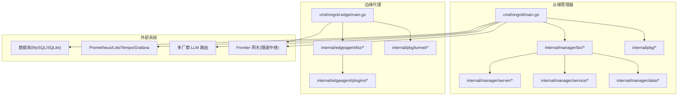
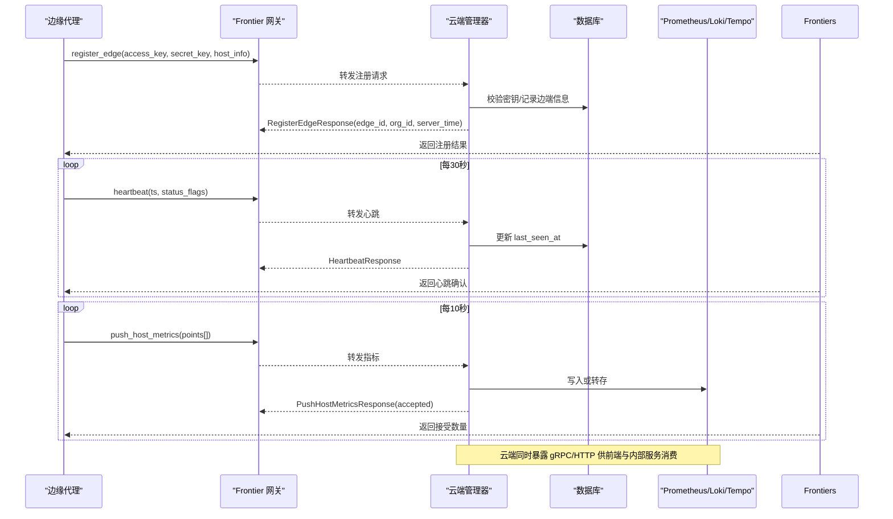
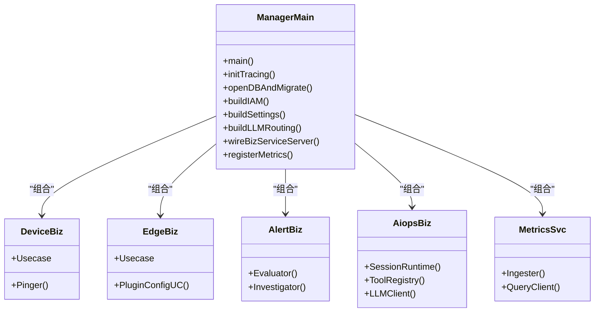
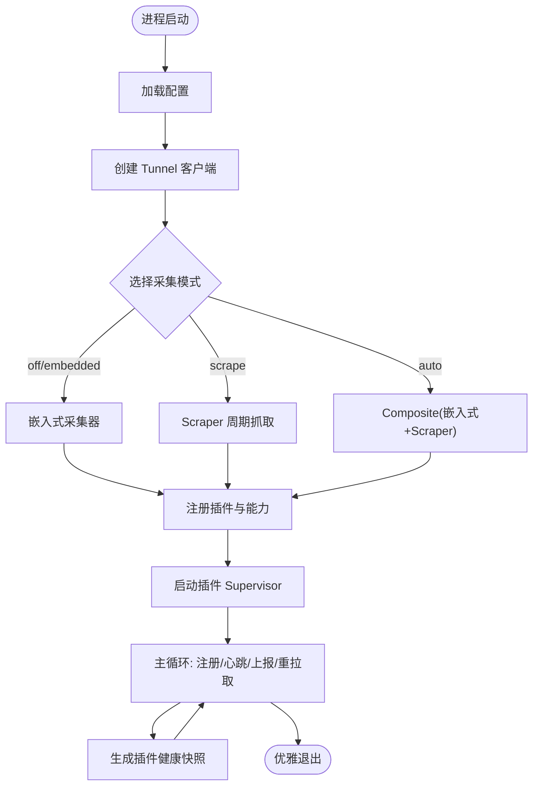
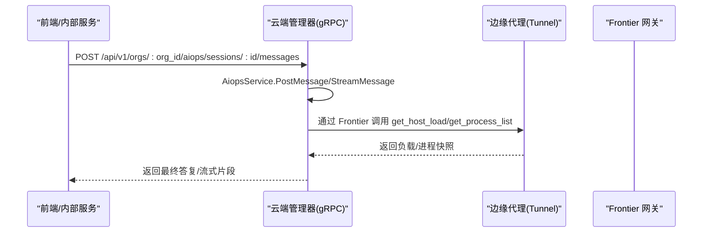
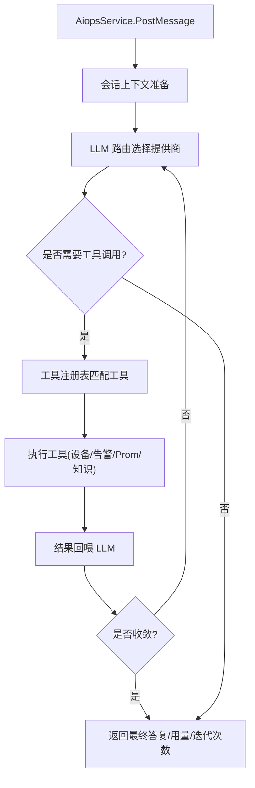
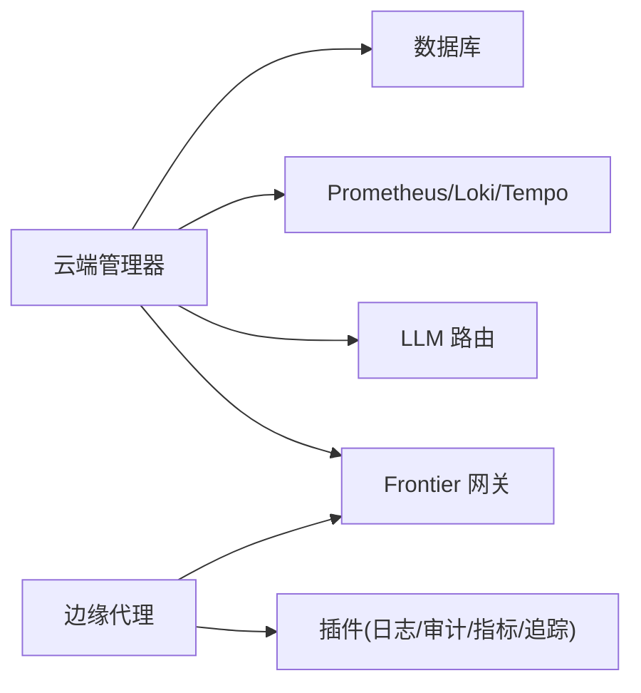

# 微服务架构

<cite>
**本文引用的文件**   
- [cmd/ongrid/main.go](file://cmd/ongrid/main.go)
- [cmd/ongrid-edge/main.go](file://cmd/ongrid-edge/main.go)
- [api/README.md](file://api/README.md)
- [api/manager/edge/v1/edge.proto](file://api/manager/edge/v1/edge.proto)
- [api/manager/alert/v1/alert.proto](file://api/manager/alert/v1/alert.proto)
- [api/manager/aiops/v1/aiops.proto](file://api/manager/aiops/v1/aiops.proto)
- [api/tunnel/v1/tunnel.proto](file://api/tunnel/v1/tunnel.proto)
- [internal/pkg/errs/errs.go](file://internal/pkg/errs/errs.go)
- [internal/pkg/prom/manager_metrics.go](file://internal/pkg/prom/manager_metrics.go)
- [internal/manager/biz/aiops/tools/registry_basetool.go](file://internal/manager/biz/aiops/tools/registry_basetool.go)
</cite>

## 目录
1. [简介](#简介)
2. [项目结构](#项目结构)
3. [核心组件](#核心组件)
4. [架构总览](#架构总览)
5. [详细组件分析](#详细组件分析)
6. [依赖关系分析](#依赖关系分析)
7. [性能与可观测性](#性能与可观测性)
8. [故障排查指南](#故障排查指南)
9. [结论](#结论)
10. [附录：API 契约与事件流](#附录api-契约与事件流)

## 简介
OnGrid 是一个面向运维的 AI Agent 平台，采用“云端管理器 + 边缘代理”的微服务架构。云端负责设备管理、告警处理、AI 运维（对话与工具编排）、指标写入与查询、知识检索等；边缘侧负责采集主机指标、进程信息、日志与追踪，并通过隧道与云端保持长连接，提供反向调用能力。整体遵循零入站端口设计，边缘主动拨号至云端，通过消息通道完成双向通信。

## 项目结构
- 入口程序
  - 云端管理器：cmd/ongrid/main.go
  - 边缘代理：cmd/ongrid-edge/main.go
- API 契约（proto）
  - 云端 gRPC 服务：api/manager/{edge,alert,aiops,...}/v1/*.proto
  - 隧道消息体（非 gRPC，geminio 传输）：api/tunnel/v1/tunnel.proto
- 业务域（Bounded Context）
  - internal/manager/biz/*：设备、告警、AI 运维、指标、通知、审批、工作流等
  - internal/manager/server/*：HTTP/gRPC Handler
  - internal/manager/service/*：跨域编排
  - internal/manager/data/*：仓储实现
  - internal/manager/model/*：领域模型
- 公共库
  - internal/pkg/*：配置、鉴权、错误、Prometheus、LLM 路由、Tunnel 客户端、Tracing 等

图表来源
- [cmd/ongrid/main.go](file://cmd/ongrid/main.go)
- [cmd/ongrid-edge/main.go](file://cmd/ongrid-edge/main.go)
- [internal/pkg/prom/manager_metrics.go](file://internal/pkg/prom/manager_metrics.go)

章节来源
- [cmd/ongrid/main.go](file://cmd/ongrid/main.go)
- [cmd/ongrid-edge/main.go](file://cmd/ongrid-edge/main.go)

## 核心组件
- 云端管理器（Manager）
  - 职责：统一接入 HTTP/gRPC 接口；组织 IAM、设备、边缘、告警、AI 运维、指标、通知、工作流等子域；对接数据库与可观测性栈；通过 Frontier 与边缘建立隧道并发起反向调用。
  - 关键启动流程：加载配置 → 初始化 Tracing → 打开数据库并执行迁移 → 构建 IAM/RBAC → 初始化设置与默认值 → 构建 LLM 多提供商路由 → 组装各子域 Biz/Service/Server → 注册 Prometheus 自监控指标。
- 边缘代理（Edge Agent）
  - 职责：按模式采集主机指标/进程/日志/追踪；通过 Tunnel 客户端向云端注册、心跳、上报指标；暴露本地 /metrics 与 /healthz；插件化运行审计、数据库导出、hostmetrics、procmetrics、traces 等。
  - 关键启动流程：加载配置 → 创建 Tunnel 客户端 → 构建 Collector（embedded/scrape/composite/noop）→ 注册各类插件与能力 → 启动 Supervisor 与本地 metrics 服务 → 进入主循环 Run。
- 公共能力
  - 错误定义：internal/pkg/errs/errs.go 提供通用哨兵错误及 HTTP 状态映射。
  - 自监控：internal/pkg/prom/manager_metrics.go 提供 HTTP、DB 池、LLM、告警评估、边缘连接等指标。

章节来源
- [cmd/ongrid/main.go](file://cmd/ongrid/main.go)
- [cmd/ongrid-edge/main.go](file://cmd/ongrid-edge/main.go)
- [internal/pkg/errs/errs.go](file://internal/pkg/errs/errs.go)
- [internal/pkg/prom/manager_metrics.go](file://internal/pkg/prom/manager_metrics.go)

## 架构总览
- 通信机制
  - 云端对外暴露 HTTP/gRPC（基于 proto 生成的 Go 类型），前端与内部服务通过 REST 访问。
  - 云端与边缘之间使用 geminio 隧道（非 gRPC），以 JSON 承载 tunnel.proto 定义的请求/响应体，方法名作为路由键。
- 事件驱动
  - 边缘定时推送主机指标、心跳；云端周期性评估告警规则，触发调查任务与通知。
- 服务发现与治理
  - 当前 MVP 阶段未内置服务发现与负载均衡；边缘通过配置直连云端地址，云端通过 Frontier 进行会话管理与反向调用。
- 安全与权限
  - JWT 鉴权 + Casbin RBAC；org_id 从 URL 路径与 JWT claims 注入，不在请求体中由用户提供。

图表来源
- [api/tunnel/v1/tunnel.proto](file://api/tunnel/v1/tunnel.proto)
- [cmd/ongrid/main.go](file://cmd/ongrid/main.go)
- [cmd/ongrid-edge/main.go](file://cmd/ongrid-edge/main.go)

## 详细组件分析

### 云端管理器：模块化设计与子域职责
- 分层组织
  - server：HTTP/gRPC Handler，解析请求、鉴权、参数校验。
  - service：跨 biz 编排（如 AI 运维会话编排、告警调查编排）。
  - biz：用例与领域逻辑（设备、边缘、告警、AI 运维、指标、通知、工作流等）。
  - data：仓储实现（MySQL/SQLite 迁移与读写）。
  - model：领域实体。
- 子域职责划分（示例）
  - 设备管理：设备生命周期、可达性探测、SSH 相关能力。
  - 边缘管理：边缘注册、密钥轮换、在线状态维护、插件配置下发。
  - 告警处理：规则评估、事件聚合、RCA 调查、通知渠道。
  - AI 运维：会话管理、工具注册与执行、LLM 多提供商路由、流式输出。
  - 指标与可观测：Prom 写入/查询、Loki/Tempo 集成、Grafana 面板同步。
  - 其他：审批、工作流、知识库、市场、MCP、技能、WebShell 等。

图表来源
- [cmd/ongrid/main.go](file://cmd/ongrid/main.go)

章节来源
- [cmd/ongrid/main.go](file://cmd/ongrid/main.go)

### 边缘代理：服务设计与生命周期管理
- 启动与初始化
  - 解析配置，创建 Tunnel 客户端，构建 Collector（支持 off/auto/embedded/scrape 模式）。
  - 注册能力插件：host_files、restart_service、bash、webshell、metrics、custommetrics、databasemetrics、hostmetrics、procmetrics、logs、audit、traces。
  - 启动 Supervisor 管理插件进程，定期上报健康快照。
- 生命周期
  - 主循环 agent.Run 控制注册、心跳、指标上报、插件重拉取与重启。
  - 优雅退出：errgroup 管理所有 goroutine，收到信号后取消根上下文，确保资源释放。
- 插件体系
  - 通过 ConfigFetcher 获取运行时配置（优先隧道推送，回退环境变量）。
  - 健康探针：Supervisor 定期生成目标健康快照，随心跳上报。

图表来源
- [cmd/ongrid-edge/main.go](file://cmd/ongrid-edge/main.go)

章节来源
- [cmd/ongrid-edge/main.go](file://cmd/ongrid-edge/main.go)

### 云端与边缘通信：gRPC 接口与隧道消息
- gRPC 服务（REST 封装）
  - 边缘管理：EdgeService（创建/列表/详情/删除/密钥轮换）。
  - 告警管理：AlertService（事件列表/详情/确认/解决）。
  - AI 运维：AiopsService（会话管理、消息发送、流式输出、历史消息）。
- 隧道消息（非 gRPC，JSON 载荷）
  - register_edge、heartbeat、push_host_metrics、get_host_load、get_process_list、get_netstat 等方法。
  - 共用类型 HostInfo、HostMetricPoint 在 tunnel.proto 中自包含定义，避免跨包耦合。

图表来源
- [api/manager/aiops/v1/aiops.proto](file://api/manager/aiops/v1/aiops.proto)
- [api/manager/edge/v1/edge.proto](file://api/manager/edge/v1/edge.proto)
- [api/tunnel/v1/tunnel.proto](file://api/tunnel/v1/tunnel.proto)

章节来源
- [api/manager/aiops/v1/aiops.proto](file://api/manager/aiops/v1/aiops.proto)
- [api/manager/edge/v1/edge.proto](file://api/manager/edge/v1/edge.proto)
- [api/tunnel/v1/tunnel.proto](file://api/tunnel/v1/tunnel.proto)
- [api/README.md](file://api/README.md)

### AI 运维：工具注册与编排
- 工具注册策略
  - 根据可用依赖动态注册工具：代码浏览（知识服务）、设备/拓扑查询、告警查询、Prom 查询等。
  - 条件注册：当 edges/devices/alertUC/promQuery 等依赖存在时，才注册对应工具。
- 编排流程
  - 会话创建 → 用户消息 → LLM 决策 → 工具调用 → 结果回喂 → 收敛终答。
  - 支持流式输出，便于 SSE/WebSocket 实时展示。

图表来源
- [internal/manager/biz/aiops/tools/registry_basetool.go](file://internal/manager/biz/aiops/tools/registry_basetool.go)
- [api/manager/aiops/v1/aiops.proto](file://api/manager/aiops/v1/aiops.proto)

章节来源
- [internal/manager/biz/aiops/tools/registry_basetool.go](file://internal/manager/biz/aiops/tools/registry_basetool.go)
- [api/manager/aiops/v1/aiops.proto](file://api/manager/aiops/v1/aiops.proto)

## 依赖关系分析
- 模块内聚与耦合
  - manager 子域按 biz/service/server/data/model 分层，边界清晰；通过 service 层解耦跨域编排。
  - edgeagent 插件体系通过 Supervisor 统一管理，降低对主进程的耦合。
- 直接/间接依赖
  - 云端依赖数据库、Prom/Loki/Tempo、LLM 路由、Frontier 网关。
  - 边缘依赖 Tunnel 客户端、插件二进制与本地采集器。
- 外部依赖与集成点
  - 多厂商 LLM（OpenAI/Anthropic/Zhipu/Gemini/DeepSeek/Kimi）通过路由器动态选择。
  - Grafana 面板同步、通知渠道（Slack/Telegram/Lark/DingTalk/WeCom/Webhook）。

图表来源
- [cmd/ongrid/main.go](file://cmd/ongrid/main.go)
- [cmd/ongrid-edge/main.go](file://cmd/ongrid-edge/main.go)

章节来源
- [cmd/ongrid/main.go](file://cmd/ongrid/main.go)
- [cmd/ongrid-edge/main.go](file://cmd/ongrid-edge/main.go)

## 性能与可观测性
- 自监控指标
  - HTTP 请求计数与时延、数据库连接池状态、LLM 调用计数、告警评估 tick、边缘连接数、RCA 并发度等。
- 调优建议
  - 合理设置数据库连接池大小与超时；根据边缘规模调整心跳与指标上报频率；为 LLM 路由配置缓存与降级策略；对高频工具调用增加限流与重试上限。

章节来源
- [internal/pkg/prom/manager_metrics.go](file://internal/pkg/prom/manager_metrics.go)

## 故障排查指南
- 常见错误与定位
  - 通用错误：not found/unauthorized/forbidden/conflict/invalid/tenant mismatch/edge offline/budget exceeded/too many attempts/not wired yet。
  - 边缘离线：检查 last_seen_at 与阈值；验证 register_edge/heartbeat 是否正常。
  - 指标缺失：确认 push_host_metrics 被接受；检查 Prometheus 写入链路。
  - LLM 失败：检查提供商配置与配额；查看路由选择与预算限制。
- 诊断步骤
  - 查看 manager 与 edge 的 /metrics 与日志；核对 Frontier 会话状态；验证数据库迁移与设置项。

章节来源
- [internal/pkg/errs/errs.go](file://internal/pkg/errs/errs.go)
- [cmd/ongrid/main.go](file://cmd/ongrid/main.go)
- [cmd/ongrid-edge/main.go](file://cmd/ongrid-edge/main.go)

## 结论
OnGrid 采用清晰的云端-边缘分层与插件化设计，结合 gRPC/HTTP 与隧道消息的双通道通信，实现了设备管理、告警处理与 AI 运维的闭环。当前版本聚焦于 MVP，尚未内置服务发现与负载均衡，但通过 Frontier 与插件体系提供了良好的扩展性与可观测性。后续可在高可用、熔断降级、重试策略与服务治理方面进一步增强。

## 附录：API 契约与事件流
- API 约定
  - Proto 包命名规范、Go 包路径、ID 与时间字段类型、org_id 来源约束、optional 使用原则、每个服务一个 .proto 文件。
  - 生成代码位于 api/gen，不提交到仓库；CI 使用 buf breaking 检测破坏性变更。
- 事件流要点
  - 边缘首次注册与重连、心跳保活、批量指标上报、云端反向调用（负载/进程/网络快照）。

章节来源
- [api/README.md](file://api/README.md)
- [api/tunnel/v1/tunnel.proto](file://api/tunnel/v1/tunnel.proto)