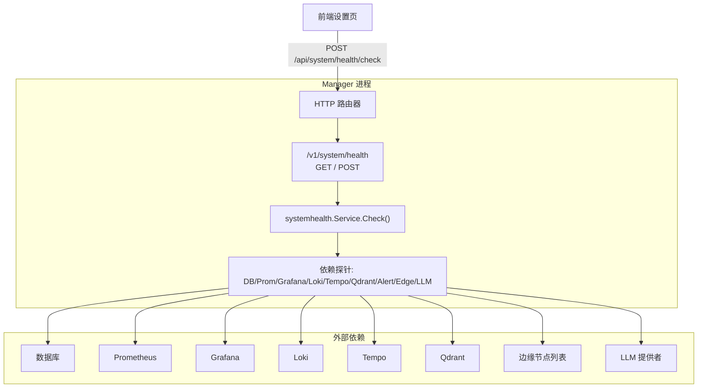
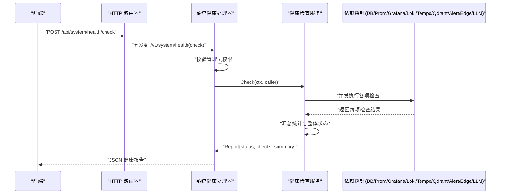
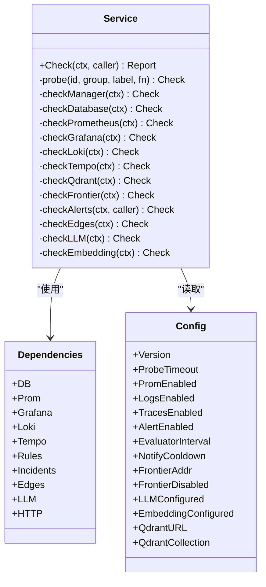
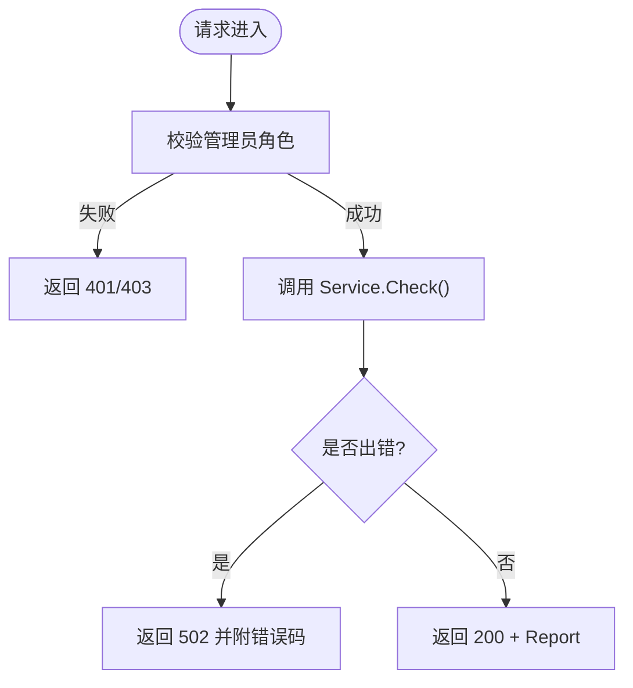
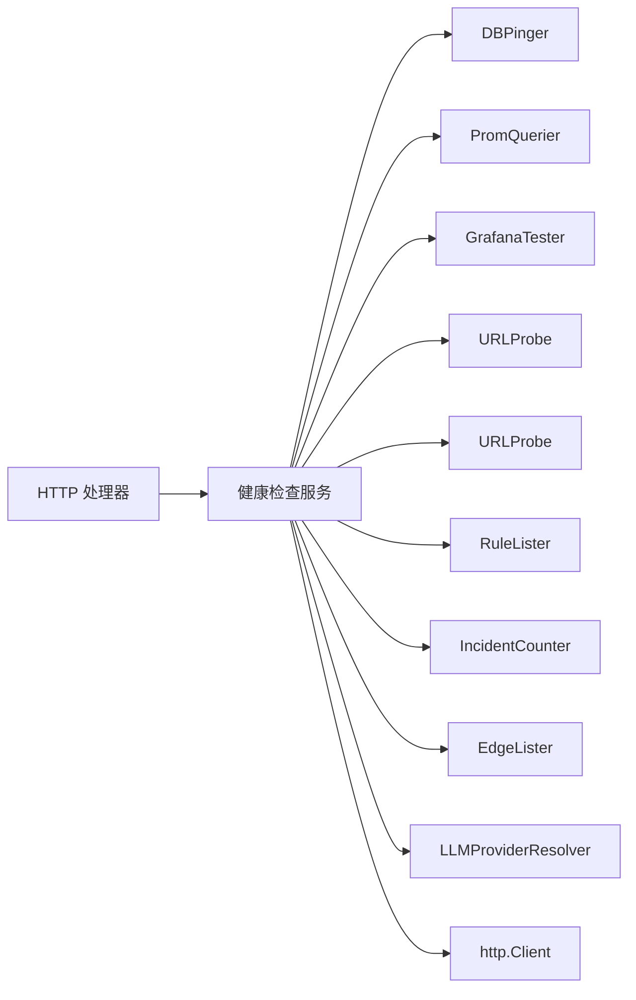
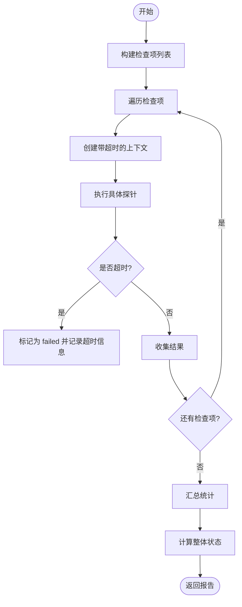
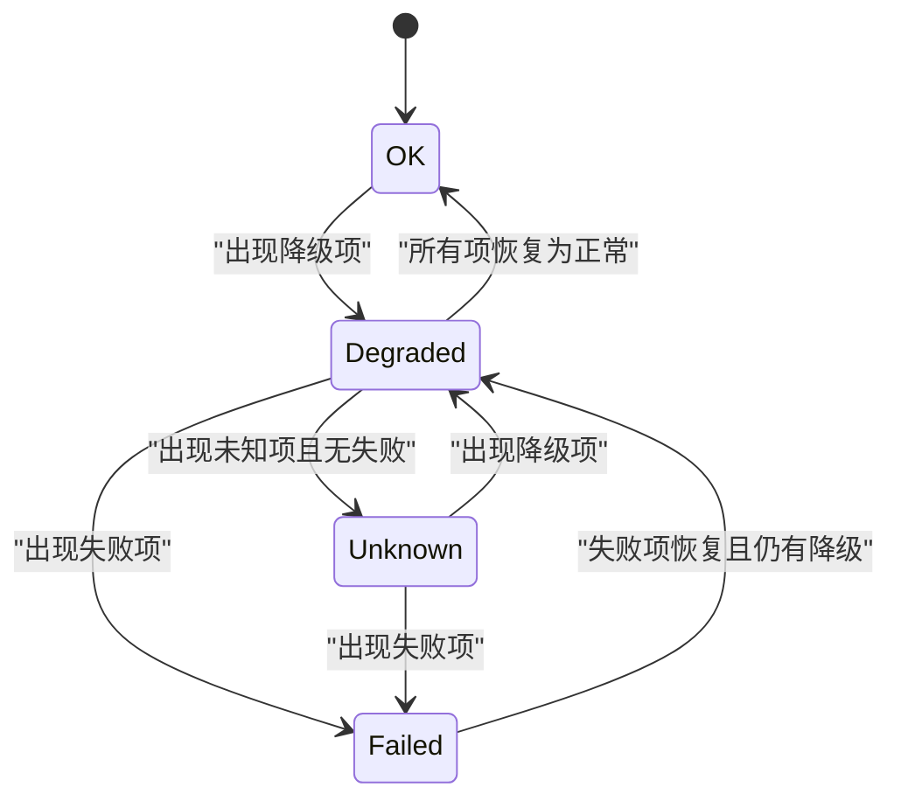

# 健康检查与监控

<cite>
**本文引用的文件**   
- [internal/manager/service/systemhealth/service.go](file://internal/manager/service/systemhealth/service.go)
- [internal/manager/server/systemhealth/http.go](file://internal/manager/server/systemhealth/http.go)
- [cmd/ongrid/main.go](file://cmd/ongrid/main.go)
- [web/src/api/systemHealth.ts](file://web/src/api/systemHealth.ts)
</cite>

## 目录
1. [简介](#简介)
2. [项目结构](#项目结构)
3. [核心组件](#核心组件)
4. [架构总览](#架构总览)
5. [详细组件分析](#详细组件分析)
6. [依赖关系分析](#依赖关系分析)
7. [性能考量](#性能考量)
8. [故障排查指南](#故障排查指南)
9. [结论](#结论)
10. [附录](#附录)

## 简介
本文件面向 OnGrid 服务健康检查与监控，系统性阐述：
- 健康检查端点的设计与实现（HTTP 接口、检查项定义、状态聚合）
- 故障检测算法（心跳机制、超时检测、异常识别）
- 健康状态分类与优先级（healthy/degraded/unhealthy/unknown 及转换条件）
- 监控指标的收集与暴露（系统资源、依赖状态、业务指标）
- 健康检查流程图、状态转换图与仪表板示例
- 自定义健康检查插件的开发方法与集成方式

## 项目结构
健康检查能力由“服务端 HTTP 处理器 + 健康检查服务”组成，并在主进程入口注册路由。前端通过 API 调用触发一次深度健康检查。

图表来源
- [internal/manager/server/systemhealth/http.go:30-33](file://internal/manager/server/systemhealth/http.go#L30-L33)
- [internal/manager/service/systemhealth/service.go:132-154](file://internal/manager/service/systemhealth/service.go#L132-L154)
- [cmd/ongrid/main.go:2463-2465](file://cmd/ongrid/main.go#L2463-L2465)

章节来源
- [internal/manager/server/systemhealth/http.go:1-96](file://internal/manager/server/systemhealth/http.go#L1-L96)
- [internal/manager/service/systemhealth/service.go:1-154](file://internal/manager/service/systemhealth/service.go#L1-L154)
- [cmd/ongrid/main.go:2320-2343](file://cmd/ongrid/main.go#L2320-L2343)
- [cmd/ongrid/main.go:2463-2465](file://cmd/ongrid/main.go#L2463-L2465)
- [web/src/api/systemHealth.ts:29-31](file://web/src/api/systemHealth.ts#L29-L31)

## 核心组件
- HTTP 处理器
  - 提供 GET/POST 两个等价端点：/v1/system/health 与 /v1/system/health/check
  - 仅管理员可访问；返回统一 JSON 格式的健康报告
- 健康检查服务
  - 聚合多项依赖检查：Manager API、数据库、Prometheus、Grafana、Loki、Tempo、Qdrant、Frontier、告警引擎、边缘节点、LLM、Embedding
  - 每个检查项包含 ID、分组、标签、状态、消息、详情与耗时
  - 汇总统计与整体状态计算
- 启动期轻量存活探针
  - /healthz 与 /readyz 用于快速存活/就绪探测（非深度检查）

章节来源
- [internal/manager/server/systemhealth/http.go:30-50](file://internal/manager/server/systemhealth/http.go#L30-L50)
- [internal/manager/service/systemhealth/service.go:28-50](file://internal/manager/service/systemhealth/service.go#L28-L50)
- [internal/manager/service/systemhealth/service.go:132-154](file://internal/manager/service/systemhealth/service.go#L132-L154)
- [cmd/ongrid/main.go:2338-2343](file://cmd/ongrid/main.go#L2338-L2343)

## 架构总览
健康检查请求从前端发起，经 Manager 的 HTTP 路由进入系统健康处理器，再由健康服务并行执行各依赖探针，最终汇总并返回结构化报告。

图表来源
- [internal/manager/server/systemhealth/http.go:30-50](file://internal/manager/server/systemhealth/http.go#L30-L50)
- [internal/manager/service/systemhealth/service.go:132-154](file://internal/manager/service/systemhealth/service.go#L132-L154)

## 详细组件分析

### 健康检查服务（systemhealth.Service）
- 检查项清单与分组
  - core: Manager API、Database、Frontier
  - observability: Prometheus、Grafana、Loki、Tempo
  - data: Qdrant
  - automation: Alert engine
  - edge: Edge agents
  - ai: LLM provider、Embedding provider
- 状态语义
  - ok: 正常
  - degraded: 降级（功能可用但部分能力缺失或存在告警）
  - failed: 失败（关键依赖不可用）
  - unknown: 未知（未配置或未连接）
- 超时与错误处理
  - 所有探针受全局 ProbeTimeout 控制；若上下文超时且结果为 ok，则强制标记为 failed
- 汇总与整体状态
  - 按计数统计 ok/degraded/failed/unknown
  - 整体状态优先级：failed > degraded > unknown > ok

图表来源
- [internal/manager/service/systemhealth/service.go:114-130](file://internal/manager/service/systemhealth/service.go#L114-L130)
- [internal/manager/service/systemhealth/service.go:84-112](file://internal/manager/service/systemhealth/service.go#L84-L112)

章节来源
- [internal/manager/service/systemhealth/service.go:132-154](file://internal/manager/service/systemhealth/service.go#L132-L154)
- [internal/manager/service/systemhealth/service.go:156-386](file://internal/manager/service/systemhealth/service.go#L156-L386)
- [internal/manager/service/systemhealth/service.go:388-412](file://internal/manager/service/systemhealth/service.go#L388-L412)
- [internal/manager/service/systemhealth/service.go:414-442](file://internal/manager/service/systemhealth/service.go#L414-L442)

### HTTP 处理器（/v1/system/health）
- 路由注册
  - GET /v1/system/health
  - POST /v1/system/health/check
- 鉴权
  - 仅 admin 角色可访问；否则返回未授权/禁止
- 响应
  - 成功：200 + Report JSON
  - 错误：根据错误类型映射为 401/403/400/404/502，并附带 code 字段

图表来源
- [internal/manager/server/systemhealth/http.go:30-50](file://internal/manager/server/systemhealth/http.go#L30-L50)
- [internal/manager/server/systemhealth/http.go:52-95](file://internal/manager/server/systemhealth/http.go#L52-L95)

章节来源
- [internal/manager/server/systemhealth/http.go:1-96](file://internal/manager/server/systemhealth/http.go#L1-L96)

### 启动期轻量探针（/healthz 与 /readyz）
- 作用
  - /healthz：进程存活
  - /readyz：服务就绪（无业务逻辑）
- 特点
  - 不执行深度依赖检查，适合 K8s/编排层探针
- 注意
  - 深度健康检查应使用 /v1/system/health

章节来源
- [cmd/ongrid/main.go:2338-2343](file://cmd/ongrid/main.go#L2338-L2343)

### 前端调用
- 前端通过 API 客户端发起 POST /api/system/health/check，获取健康报告并渲染 UI

章节来源
- [web/src/api/systemHealth.ts:29-31](file://web/src/api/systemHealth.ts#L29-L31)

## 依赖关系分析
- 直接依赖
  - DBPinger：数据库连通性
  - PromQuerier：Prometheus 查询
  - URLProbe：Loki/Tempo 可达性
  - GrafanaTester：Grafana 集成可用性
  - RuleLister/IncidentCounter：告警规则与事件计数
  - EdgeLister：边缘节点在线情况
  - LLMProviderResolver：LLM 提供者配置
  - http.Client：通用 HTTP 探针（如 Qdrant）
- 耦合与内聚
  - 通过接口解耦外部依赖，便于替换与测试
  - 检查项按组划分，职责清晰
- 潜在循环依赖
  - 当前设计以单向调用为主，未见循环引用

图表来源
- [internal/manager/service/systemhealth/service.go:52-95](file://internal/manager/service/systemhealth/service.go#L52-L95)

章节来源
- [internal/manager/service/systemhealth/service.go:52-95](file://internal/manager/service/systemhealth/service.go#L52-L95)

## 性能考量
- 超时控制
  - 全局 ProbeTimeout 限制单个探针最大耗时，避免阻塞整体检查
- 并发执行
  - 各检查项在 Check 中顺序构建，但可在实现层面并发执行以提升吞吐（当前代码顺序构造，建议后续优化为并发）
- 采样与限流
  - 边缘节点列表采用 Limit 采样，降低大规模场景下的压力
- 指标暴露
  - 独立端口 /metrics 暴露 Prometheus 指标，便于采集与告警

章节来源
- [internal/manager/service/systemhealth/service.go:119-130](file://internal/manager/service/systemhealth/service.go#L119-L130)
- [internal/manager/service/systemhealth/service.go:315-354](file://internal/manager/service/systemhealth/service.go#L315-L354)
- [cmd/ongrid/main.go:2492-2494](file://cmd/ongrid/main.go#L2492-L2494)

## 故障排查指南
- 常见状态与定位
  - failed：关键依赖不可用（数据库、Prometheus、Grafana、Loki、Tempo、Qdrant、Edge 全离线等）
  - degraded：功能降级（未启用某模块、缺少配置、存在打开的告警事件）
  - unknown：未配置或未连接（如 Embedding/LLM 未配置）
- 快速定位步骤
  - 查看对应检查项 message 与 details
  - 确认相关服务是否启用与可达（网络、认证、路径）
  - 对 Qdrant 检查，确认集合名称与 URL 正确
  - 对告警引擎，确认规则数量与打开事件数
- 日志与追踪
  - 结合 OTel 与 Tempo 链路追踪定位慢依赖
  - 使用 /metrics 观察服务自身指标

章节来源
- [internal/manager/service/systemhealth/service.go:178-236](file://internal/manager/service/systemhealth/service.go#L178-L236)
- [internal/manager/service/systemhealth/service.go:238-263](file://internal/manager/service/systemhealth/service.go#L238-L263)
- [internal/manager/service/systemhealth/service.go:275-313](file://internal/manager/service/systemhealth/service.go#L275-L313)
- [internal/manager/service/systemhealth/service.go:356-386](file://internal/manager/service/systemhealth/service.go#L356-L386)

## 结论
OnGrid 的健康检查体系通过统一的 HTTP 接口与可扩展的服务层，将平台核心与观测栈依赖纳入一致的状态模型，并以清晰的优先级进行聚合。配合 /healthz 与 /readyz 的轻量探针，以及独立的 /metrics 指标出口，形成了覆盖“存活—就绪—健康—指标”的完整可观测闭环。

## 附录

### 健康检查流程（含超时与异常识别）

图表来源
- [internal/manager/service/systemhealth/service.go:132-154](file://internal/manager/service/systemhealth/service.go#L132-L154)
- [internal/manager/service/systemhealth/service.go:388-412](file://internal/manager/service/systemhealth/service.go#L388-L412)
- [internal/manager/service/systemhealth/service.go:414-442](file://internal/manager/service/systemhealth/service.go#L414-L442)

### 健康状态分类与转换
- 状态定义
  - ok：全部检查项均为 ok
  - degraded：存在 degraded 且无 failed
  - failed：存在任意 failed
  - unknown：存在 unknown 且无 failed/degraded
- 转换优先级
  - failed > degraded > unknown > ok

图表来源
- [internal/manager/service/systemhealth/service.go:431-442](file://internal/manager/service/systemhealth/service.go#L431-L442)

### 监控指标收集与暴露
- 指标出口
  - 独立端口 /metrics 暴露 Prometheus 指标
- 指标类别
  - 系统资源：可通过 node_exporter 等采集
  - 服务依赖：健康检查报告可作为上层告警依据
  - 业务指标：由应用自行注册到 prometheus registry
- 采集与可视化
  - Prometheus 抓取 /metrics
  - Grafana 展示面板与告警

章节来源
- [cmd/ongrid/main.go:2492-2494](file://cmd/ongrid/main.go#L2492-L2494)

### 自定义健康检查插件开发方法
- 目标
  - 在不修改核心逻辑的前提下，扩展新的健康检查项
- 步骤
  - 在健康检查服务中添加新的 checkXxx 方法，封装探针逻辑
  - 在 Check 方法中将新检查项加入列表
  - 为新检查项分配合理的 group 与 label，便于 UI 分组与展示
  - 如需外部依赖，注入相应接口（例如 URLProbe、自定义 Client）
- 集成要点
  - 保持探针幂等与短耗时
  - 合理设置超时与错误信息
  - 在 details 中补充诊断信息（如版本、集合名、计数等）

章节来源
- [internal/manager/service/systemhealth/service.go:132-154](file://internal/manager/service/systemhealth/service.go#L132-L154)
- [internal/manager/service/systemhealth/service.go:388-412](file://internal/manager/service/systemhealth/service.go#L388-L412)