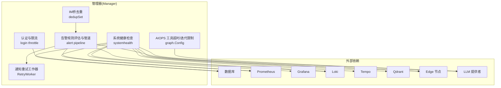
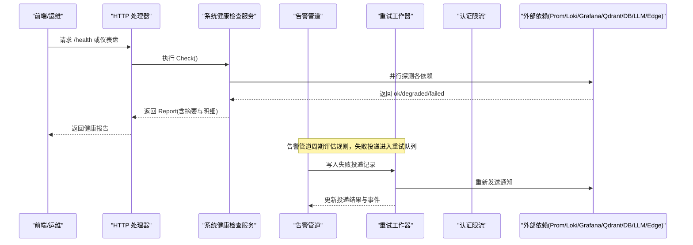
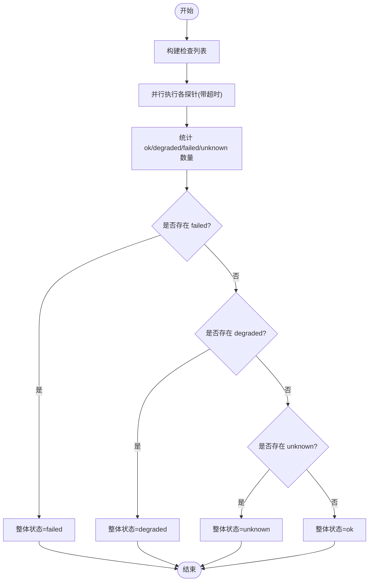
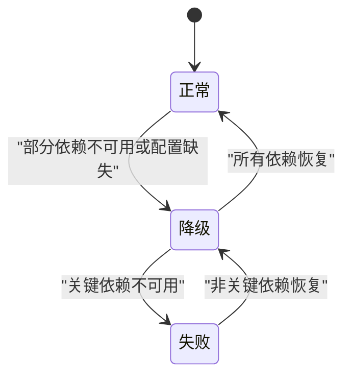
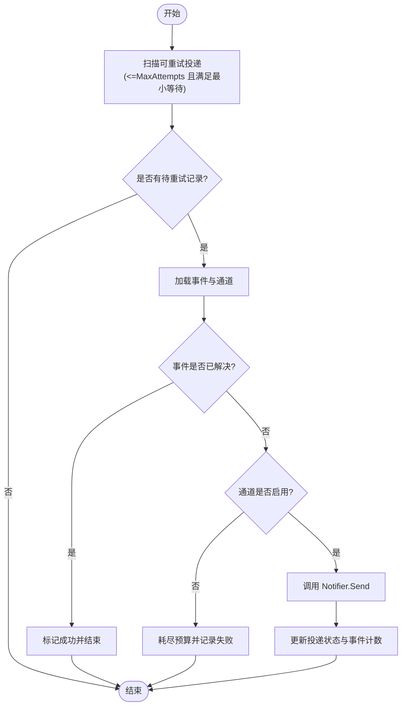
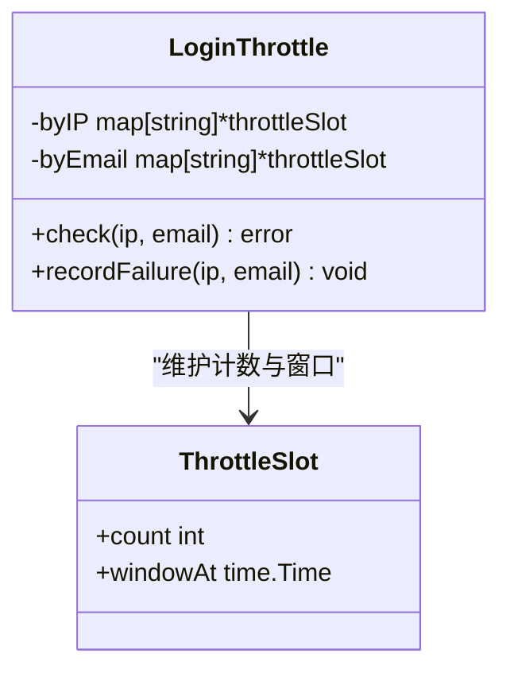
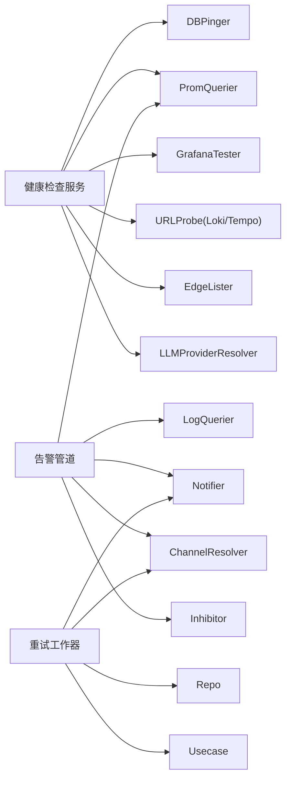

# 服务治理与容错

<cite>
**本文引用的文件**   
- [internal/manager/service/systemhealth/service.go](file://internal/manager/service/systemhealth/service.go)
- [cmd/ongrid/main.go](file://cmd/ongrid/main.go)
- [internal/manager/biz/alert/retry.go](file://internal/manager/biz/alert/retry.go)
- [internal/manager/server/alert/http.go](file://internal/manager/server/alert/http.go)
- [internal/iam/server/http.go](file://internal/iam/server/http.go)
- [internal/manager/biz/imbridge/dedup.go](file://internal/manager/biz/imbridge/dedup.go)
- [internal/manager/biz/aiops/tools/correlate_incident.go](file://internal/manager/biz/aiops/tools/correlate_incident.go)
- [internal/manager/biz/aiops/graph/types.go](file://internal/manager/biz/aiops/graph/types.go)
- [internal/manager/data/report/store/facts_test.go](file://internal/manager/data/report/store/facts_test.go)
</cite>

## 目录
1. [简介](#简介)
2. [项目结构](#项目结构)
3. [核心组件](#核心组件)
4. [架构总览](#架构总览)
5. [详细组件分析](#详细组件分析)
6. [依赖关系分析](#依赖关系分析)
7. [性能考量](#性能考量)
8. [故障排查指南](#故障排查指南)
9. [结论](#结论)
10. [附录](#附录)

## 简介
本文件聚焦 OnGrid 的服务治理与容错能力，围绕健康检查与状态监控、熔断降级策略、重试与超时控制、限流与配额管理、分布式锁与一致性保证等主题展开。文档以代码为依据，提供架构图、状态图与流程图，帮助读者快速理解系统如何保障高可用与可观测性。

## 项目结构
OnGrid 的“服务治理与容错”相关能力主要分布在以下模块：
- 健康检查与平台自检：systemhealth 服务聚合数据库、Prometheus、Grafana、Loki、Tempo、Qdrant、Frontier、告警引擎、Edge 节点、LLM/Embedding 等依赖的健康探测。
- 告警与通知重试：alert 子系统的 RetryWorker 负责失败投递的线性退避重试与事件记录。
- 认证限流：IAM 登录接口实现 IP 与邮箱维度的滑动窗口限流。
- 去重与幂等：IM Bridge 使用内存双代集合做事件去重，避免重连导致的重复处理。
- 工具调用超时与迭代上限：AIOPS 图表运行时对 LLM 工具调用设置超时与最大迭代次数。
- 启动预热与就绪：主进程在关键子系统就绪前进行短暂休眠，降低冷启动期间的不稳定影响。



**图示来源** 
- [internal/manager/service/systemhealth/service.go:132-154](file://internal/manager/service/systemhealth/service.go#L132-L154)
- [cmd/ongrid/main.go:2623-2662](file://cmd/ongrid/main.go#L2623-L2662)
- [internal/manager/biz/alert/retry.go:77-92](file://internal/manager/biz/alert/retry.go#L77-L92)
- [internal/iam/server/http.go:38-76](file://internal/iam/server/http.go#L38-L76)
- [internal/manager/biz/imbridge/dedup.go:18-53](file://internal/manager/biz/imbridge/dedup.go#L18-L53)
- [internal/manager/biz/aiops/graph/types.go:142-172](file://internal/manager/biz/aiops/graph/types.go#L142-L172)

**章节来源**
- [internal/manager/service/systemhealth/service.go:132-154](file://internal/manager/service/systemhealth/service.go#L132-L154)
- [cmd/ongrid/main.go:2623-2662](file://cmd/ongrid/main.go#L2623-L2662)

## 核心组件
- 系统健康检查服务：统一编排多依赖探针，输出结构化报告（ok/degraded/failed/unknown），并汇总整体状态。
- 告警管道与重试：周期性评估规则，生成事件；失败的通知投递由独立工作器按线性退避重试。
- 认证限流：基于 IP 和邮箱维度的滑动窗口计数，防止暴力尝试。
- IM 桥去重：进程内双代集合维护最近事件键，避免长轮询重连导致重复处理。
- AIOPS 工具超时与迭代上限：为 LLM 工具调用设置超时与最大迭代次数，保护上游资源。

**章节来源**
- [internal/manager/service/systemhealth/service.go:19-50](file://internal/manager/service/systemhealth/service.go#L19-L50)
- [internal/manager/biz/alert/retry.go:14-73](file://internal/manager/biz/alert/retry.go#L14-L73)
- [internal/iam/server/http.go:38-76](file://internal/iam/server/http.go#L38-L76)
- [internal/manager/biz/imbridge/dedup.go:18-53](file://internal/manager/biz/imbridge/dedup.go#L18-L53)
- [internal/manager/biz/aiops/graph/types.go:142-172](file://internal/manager/biz/aiops/graph/types.go#L142-L172)

## 架构总览
下图展示健康检查、告警管道、重试与限流之间的交互关系，以及对外部依赖的探测路径。



**图示来源** 
- [internal/manager/service/systemhealth/service.go:132-154](file://internal/manager/service/systemhealth/service.go#L132-L154)
- [cmd/ongrid/main.go:2623-2662](file://cmd/ongrid/main.go#L2623-L2662)
- [internal/manager/biz/alert/retry.go:77-92](file://internal/manager/biz/alert/retry.go#L77-L92)

## 详细组件分析

### 健康检查与状态监控
- 健康端点设计：通过 Service.Check 聚合多个探针（数据库、Prometheus、Grafana、Loki、Tempo、Qdrant、Frontier、告警引擎、Edge、LLM/Embedding），每个探针返回状态、消息与详情，最终汇总为整体状态。
- 故障检测算法：
  - 探针级：对每个依赖执行带超时的探测，若上下文超时则标记为失败。
  - 汇总级：统计 ok/degraded/failed/unknown 数量，按优先级决定整体状态（failed > degraded > unknown > ok）。
- 可观测性：每个 Check 包含耗时（毫秒）与详细信息，便于定位慢依赖。



**图示来源** 
- [internal/manager/service/systemhealth/service.go:132-154](file://internal/manager/service/systemhealth/service.go#L132-L154)
- [internal/manager/service/systemhealth/service.go:414-442](file://internal/manager/service/systemhealth/service.go#L414-L442)

**章节来源**
- [internal/manager/service/systemhealth/service.go:19-50](file://internal/manager/service/systemhealth/service.go#L19-L50)
- [internal/manager/service/systemhealth/service.go:132-154](file://internal/manager/service/systemhealth/service.go#L132-L154)
- [internal/manager/service/systemhealth/service.go:388-412](file://internal/manager/service/systemhealth/service.go#L388-L412)
- [internal/manager/service/systemhealth/service.go:414-442](file://internal/manager/service/systemhealth/service.go#L414-L442)

### 熔断与降级策略
- 熔断器模式：当前仓库未实现显式的熔断器（如断路器）组件。系统在健康检查中采用“探针+超时”的方式快速失败，并在 UI 层呈现 degraded/failed 状态，起到类似“软熔断”的效果。
- 降级逻辑：
  - 当 Prometheus/Loki/Tempo 未启用或未连接时，健康检查返回 degraded，不影响其他功能。
  - 告警管道对缺失的外部依赖（如 Loki）采取 nil-safe 跳过相应规则类型，保持基本运行。
- 恢复机制：健康检查周期性执行，一旦依赖恢复，状态自动从 degraded/failed 回到 ok。



[此图为概念性状态图，不直接映射具体源码文件]

**章节来源**
- [internal/manager/service/systemhealth/service.go:178-236](file://internal/manager/service/systemhealth/service.go#L178-L236)
- [cmd/ongrid/main.go:2623-2662](file://cmd/ongrid/main.go#L2623-L2662)

### 重试策略与超时控制
- 重试策略：
  - 通知投递失败后，RetryWorker 定期扫描可重试投递记录，按线性退避（每次至少间隔 backoffPerAttempt）进行重试，最多尝试 MaxAttempts 次。
  - 若关联事件已解决或通道被禁用，则终止重试并记录原因。
- 超时控制：
  - 健康检查探针默认超时时间可配置，未配置时使用默认值。
  - AIOPS 工具调用支持 ToolTimeout 与 MaxIterations 上限，防止长时间占用资源。
- 指数退避说明：当前实现为线性退避，非指数退避。如需指数退避，可在 RetryWorker 中扩展策略。



**图示来源** 
- [internal/manager/biz/alert/retry.go:77-92](file://internal/manager/biz/alert/retry.go#L77-L92)
- [internal/manager/biz/alert/retry.go:98-108](file://internal/manager/biz/alert/retry.go#L98-L108)
- [internal/manager/biz/alert/retry.go:117-201](file://internal/manager/biz/alert/retry.go#L117-L201)

**章节来源**
- [internal/manager/biz/alert/retry.go:14-73](file://internal/manager/biz/alert/retry.go#L14-L73)
- [internal/manager/biz/alert/retry.go:77-92](file://internal/manager/biz/alert/retry.go#L77-L92)
- [internal/manager/biz/alert/retry.go:98-108](file://internal/manager/biz/alert/retry.go#L98-L108)
- [internal/manager/biz/alert/retry.go:117-201](file://internal/manager/biz/alert/retry.go#L117-L201)
- [internal/manager/biz/aiops/graph/types.go:142-172](file://internal/manager/biz/aiops/graph/types.go#L142-L172)
- [internal/manager/service/systemhealth/service.go:119-130](file://internal/manager/service/systemhealth/service.go#L119-L130)

### 服务限流与配额管理
- 登录限流：
  - 维度：IP 与邮箱。
  - 策略：滑动窗口计数，超过阈值返回错误，阻止进一步尝试。
  - 参数：IP 窗口更大（宽松），邮箱窗口更紧（严格）。
- 配额管理：
  - 当前仓库未见全局资源配额控制实现。
  - 未来路线图包含按用户/组织的速率限制规划。



**图示来源** 
- [internal/iam/server/http.go:38-76](file://internal/iam/server/http.go#L38-L76)

**章节来源**
- [internal/iam/server/http.go:38-76](file://internal/iam/server/http.go#L38-L76)

### 幂等与去重
- IM 桥去重：
  - 使用进程内双代集合维护最近事件键，容量有限，插入 O(1)。
  - 适用于长轮询重连场景，避免重复处理未确认的事件。
  - 重启后会重置集合，可能重放未确认的积压，但概率较低。

```mermaid
classDiagram
class DedupSet {
+seenOrAdd(key) bool
-mu sync.Mutex
-cap int
-cur map[string]struct{}
-prev map[string]struct{}
}
```

**图示来源** 
- [internal/manager/biz/imbridge/dedup.go:18-53](file://internal/manager/biz/imbridge/dedup.go#L18-L53)

**章节来源**
- [internal/manager/biz/imbridge/dedup.go:18-53](file://internal/manager/biz/imbridge/dedup.go#L18-L53)

### 启动预热与就绪
- 启动阶段：在主进程初始化完成后，对关键子系统（如 Frontier 绑定）进行短暂休眠，以降低冷启动期间的不稳定风险。
- 目的：确保 broker 注册表与传输层完成必要初始化，减少后续心跳与映射不一致问题。

**章节来源**
- [cmd/ongrid/main.go:1774-1801](file://cmd/ongrid/main.go#L1774-L1801)

## 依赖关系分析
- 健康检查服务依赖外部依赖接口（DB、Prom、Grafana、Loki、Tempo、Qdrant、Edge、LLM），并通过 HTTP 客户端进行探测。
- 告警管道依赖 PromQuerier、LogQuerier、Notifier、Resolver、Inhibitor 等，具备 nil-safe 特性，缺失组件时跳过对应规则类型。
- 重试工作器依赖 Repo、Notifier、ChannelResolver、Usecase，负责失败投递的持久化与重试。
- 认证限流与 IM 去重均为进程内实现，无跨进程依赖。



**图示来源** 
- [internal/manager/service/systemhealth/service.go:84-95](file://internal/manager/service/systemhealth/service.go#L84-L95)
- [cmd/ongrid/main.go:2623-2662](file://cmd/ongrid/main.go#L2623-L2662)
- [internal/manager/biz/alert/retry.go:14-73](file://internal/manager/biz/alert/retry.go#L14-L73)

**章节来源**
- [internal/manager/service/systemhealth/service.go:84-95](file://internal/manager/service/systemhealth/service.go#L84-L95)
- [cmd/ongrid/main.go:2623-2662](file://cmd/ongrid/main.go#L2623-L2662)
- [internal/manager/biz/alert/retry.go:14-73](file://internal/manager/biz/alert/retry.go#L14-L73)

## 性能考量
- 健康检查并发：探针并行执行，整体耗时取决于最慢依赖；建议合理设置 ProbeTimeout，避免拖慢响应。
- 重试批处理：RetryWorker 每批次拉取固定数量的失败投递（例如 200），避免一次性处理过多造成抖动。
- 去重内存占用：DedupSet 容量有限，需根据峰值事件量调整 cap，防止内存增长。
- 工具调用保护：AIOPS 工具设置 ToolTimeout 与 MaxIterations，避免长尾任务阻塞。

[本节为通用指导，无需特定源码引用]

## 故障排查指南
- 健康检查异常：
  - 查看 Report 中的 checks 明细与 duration_ms，定位慢依赖。
  - 关注 degraded 项，通常为可选依赖未配置或未连接。
- 告警通知失败：
  - 检查 RetryWorker 日志与 delivery 记录，确认是否达到 MaxAttempts。
  - 核对通道配置与权限，必要时手动触发一次重试。
- 登录频繁失败：
  - 检查 IP/邮箱维度的限流阈值，确认是否为恶意尝试或误操作。
- 事件重复处理：
  - 确认 IM 桥的重连行为与 dedupSet 容量，必要时扩容或重启。

**章节来源**
- [internal/manager/service/systemhealth/service.go:132-154](file://internal/manager/service/systemhealth/service.go#L132-L154)
- [internal/manager/biz/alert/retry.go:77-92](file://internal/manager/biz/alert/retry.go#L77-L92)
- [internal/iam/server/http.go:38-76](file://internal/iam/server/http.go#L38-L76)
- [internal/manager/biz/imbridge/dedup.go:18-53](file://internal/manager/biz/imbridge/dedup.go#L18-L53)

## 结论
OnGrid 在服务治理与容错方面采用了“健康检查+探针超时”、“线性退避重试”、“进程内限流与去重”的组合策略，实现了轻量而实用的可用性保障。当前未实现显式熔断器与指数退避，但可通过扩展健康检查与重试策略进一步增强弹性。建议在后续版本中引入标准熔断器与更灵活的重试策略，以满足更高要求的稳定性目标。

[本节为总结，无需特定源码引用]

## 附录
- 指标与报表：
  - 报告事实中包含在线设备数、事件数等关键指标，可用于辅助判断平台健康度。
- 前端展示：
  - 告警规则页面显示评估间隔与通知冷却时间，便于运维调优。

**章节来源**
- [internal/manager/data/report/store/facts_test.go:102-135](file://internal/manager/data/report/store/facts_test.go#L102-L135)
- [internal/manager/server/alert/http.go:254-301](file://internal/manager/server/alert/http.go#L254-L301)