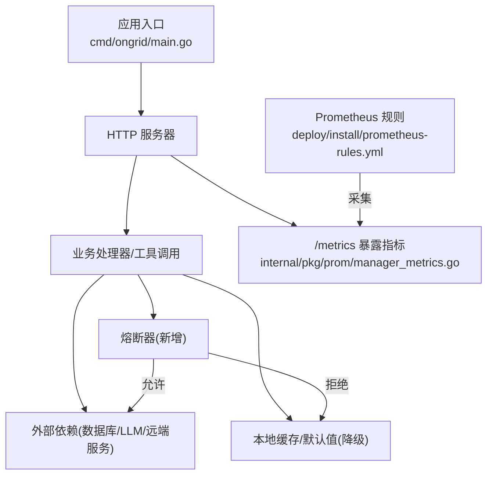
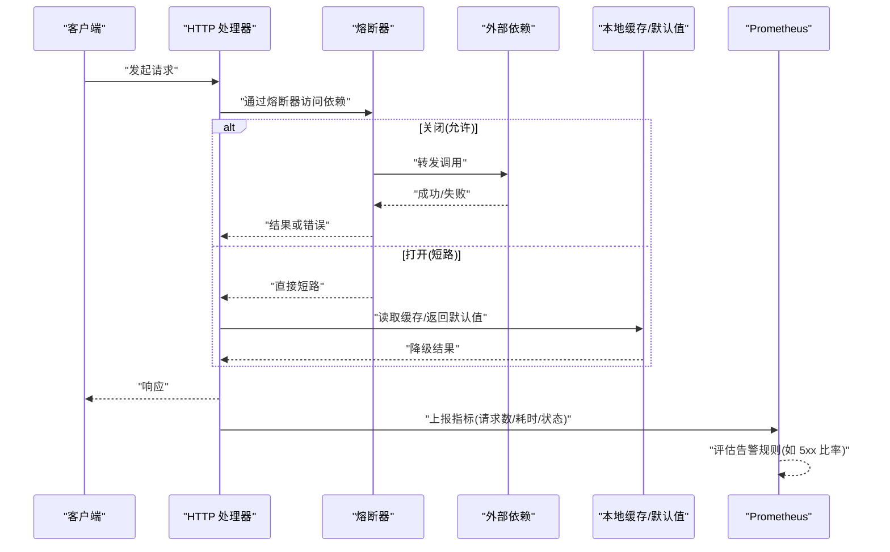
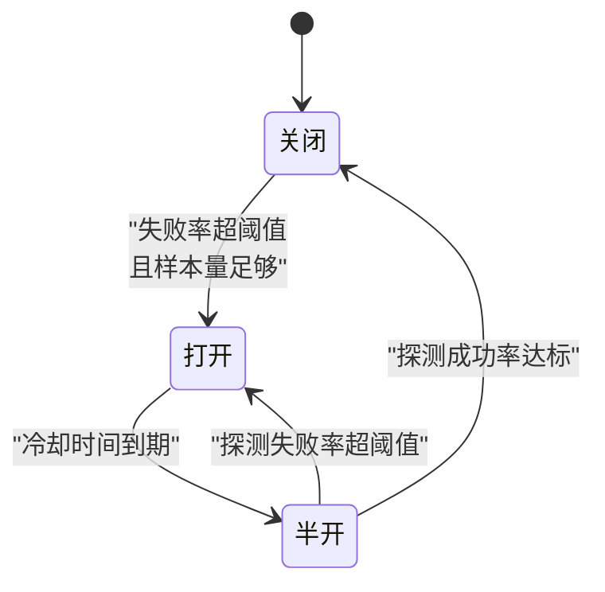
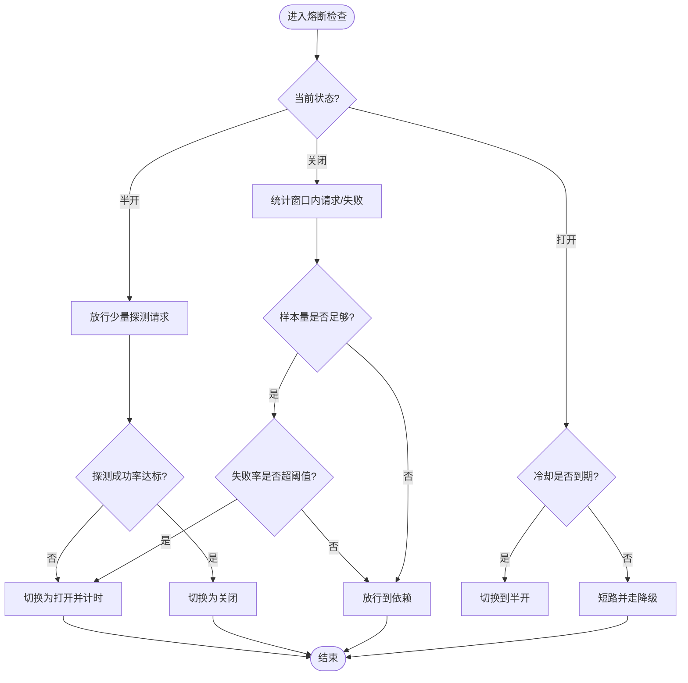
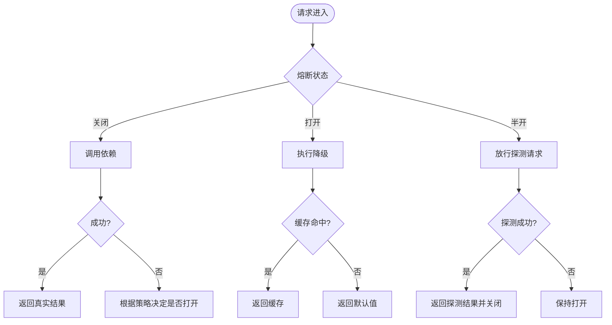
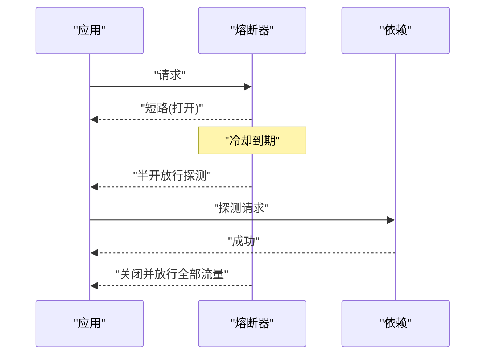
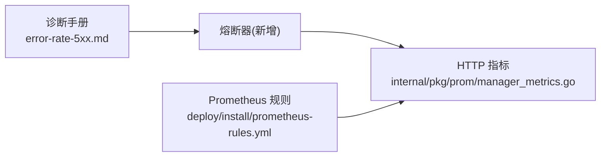

# 熔断降级机制

<cite>
**本文引用的文件**   
- [cmd/ongrid/main.go](file://cmd/ongrid/main.go)
- [internal/pkg/prom/manager_metrics.go](file://internal/pkg/prom/manager_metrics.go)
- [deploy/install/prometheus-rules.yml](file://deploy/install/prometheus-rules.yml)
- [internal/manager/biz/knowledge/builtin_vault/diagnostics/error-rate-5xx.md](file://internal/manager/biz/knowledge/builtin_vault/diagnostics/error-rate-5xx.md)
- [.record/2026-07-06-fix-frontierbound-startup-warmup.md](file://.record/2026-07-06-fix-frontierbound-startup-warmup.md)
</cite>

## 目录
1. [引言](#引言)
2. [项目结构](#项目结构)
3. [核心组件](#核心组件)
4. [架构总览](#架构总览)
5. [详细组件分析](#详细组件分析)
6. [依赖分析](#依赖分析)
7. [性能考虑](#性能考虑)
8. [故障排查指南](#故障排查指南)
9. [结论](#结论)
10. [附录](#附录)

## 引言
本文件面向 OnGrid 的“熔断与降级”能力，系统性阐述：
- 熔断器模式在系统中的落地思路（状态机、触发策略、恢复机制）
- 降级路径（缓存回退、默认值返回、服务短路）
- 监控指标与告警规则配置建议
- 结合现有代码与部署配置的落地要点与最佳实践

说明：当前仓库未提供独立的“熔断器实现模块”，但存在多处可复用基础设施（HTTP 指标、Prometheus 自观测规则、诊断手册对下游依赖失败的处理建议等）。本文基于这些素材给出可落地的设计与集成方案。

## 项目结构
围绕熔断降级的关键位置：
- 启动与 HTTP 服务：用于接入熔断中间件或调用点包装
- 指标采集：暴露 HTTP 请求计数与时延直方图，作为熔断决策输入
- Prometheus 自观测规则：为 5xx 错误率等提供现成告警基线
- 诊断手册：明确“下游依赖失败时加熔断”的策略建议

图表来源
- [cmd/ongrid/main.go:2489-2500](file://cmd/ongrid/main.go#L2489-L2500)
- [internal/pkg/prom/manager_metrics.go:203-236](file://internal/pkg/prom/manager_metrics.go#L203-L236)
- [deploy/install/prometheus-rules.yml:66-79](file://deploy/install/prometheus-rules.yml#L66-L79)

章节来源
- [cmd/ongrid/main.go:2489-2500](file://cmd/ongrid/main.go#L2489-L2500)
- [internal/pkg/prom/manager_metrics.go:203-236](file://internal/pkg/prom/manager_metrics.go#L203-L236)
- [deploy/install/prometheus-rules.yml:66-79](file://deploy/install/prometheus-rules.yml#L66-L79)

## 核心组件
- 熔断器（新增）：封装目标依赖的访问，维护状态机并决定放行/短路
- 指标层（已有）：HTTP 请求总数、按状态类聚合、请求耗时直方图
- 告警层（已有）：Prometheus 自观测规则，覆盖 5xx 错误率、DB 池饱和、LLM 错误率等
- 降级策略（新增）：缓存回退、默认值返回、快速失败（短路）
- 诊断与排障（已有）：5xx 错误率诊断手册，指导定位与处理

章节来源
- [internal/pkg/prom/manager_metrics.go:203-236](file://internal/pkg/prom/manager_metrics.go#L203-L236)
- [deploy/install/prometheus-rules.yml:12-79](file://deploy/install/prometheus-rules.yml#L12-L79)
- [internal/manager/biz/knowledge/builtin_vault/diagnostics/error-rate-5xx.md:1-97](file://internal/manager/biz/knowledge/builtin_vault/diagnostics/error-rate-5xx.md#L1-L97)

## 架构总览
下图展示“调用链路 + 熔断 + 降级 + 指标/告警”的整体交互。

图表来源
- [cmd/ongrid/main.go:2489-2500](file://cmd/ongrid/main.go#L2489-L2500)
- [internal/pkg/prom/manager_metrics.go:203-236](file://internal/pkg/prom/manager_metrics.go#L203-L236)
- [deploy/install/prometheus-rules.yml:66-79](file://deploy/install/prometheus-rules.yml#L66-L79)

## 详细组件分析

### 熔断器状态机与转换条件
- 状态定义
  - 关闭：正常放行
  - 打开：拒绝新请求，进入冷却期
  - 半开：允许少量探测流量
- 转换条件（建议）
  - 关闭→打开：时间窗口内失败率超过阈值，且最小样本量达标
  - 打开→半开：冷却时间到期
  - 半开→关闭：探测请求成功率达到阈值
  - 半开→打开：探测请求失败率超过阈值

[此图为概念性状态图，不直接映射具体源码文件]

### 熔断触发策略（失败率、错误计数器、时间窗口）
- 失败率阈值：例如 5xx 比率 > 5%（参考自观测规则）
- 最小样本量：避免低 QPS 下的误判
- 时间窗口：滑动窗口统计最近 N 分钟内的请求与失败
- 指标来源：HTTP 请求总数、按状态类聚合、请求耗时直方图

[此图为概念性流程图，不直接映射具体源码文件]

### 降级逻辑（缓存回退、默认值返回、服务短路）
- 缓存回退：命中本地缓存则直接返回
- 默认值返回：无缓存时返回安全默认值
- 服务短路：打开状态下立即返回，避免雪崩

[此图为概念性流程图，不直接映射具体源码文件]

### 熔断恢复机制（半开探测、渐进式流量恢复、自动恢复）
- 半开探测：固定比例或固定数量的探测请求
- 渐进式恢复：半开成功后逐步提升流量权重
- 自动恢复：失败率回落至阈值以下后自动回到关闭

[此图为概念性序列图，不直接映射具体源码文件]

### 与现有指标的集成点
- 指标暴露：HTTP 请求总数、按方法/路由/状态类聚合；请求耗时直方图
- 使用方式：在熔断器内部采样上述指标，计算失败率与延迟分布
- 参考位置：HTTP 指标注册与命名

章节来源
- [internal/pkg/prom/manager_metrics.go:203-236](file://internal/pkg/prom/manager_metrics.go#L203-L236)

### 与现有告警规则的衔接
- 自观测规则已包含 5xx 错误率告警，可作为熔断阈值的参考基线
- 建议在熔断器中复用相同的时间窗口与聚合维度，保证一致性与可观测性

章节来源
- [deploy/install/prometheus-rules.yml:66-79](file://deploy/install/prometheus-rules.yml#L66-L79)

### 与诊断手册的协同
- 诊断手册明确指出：当发现下游依赖自身出错时，应在此处增加熔断，避免级联故障
- 该建议与本文设计的“失败率阈值 → 打开 → 短路 → 降级”完全契合

章节来源
- [internal/manager/biz/knowledge/builtin_vault/diagnostics/error-rate-5xx.md:77-79](file://internal/manager/biz/knowledge/builtin_vault/diagnostics/error-rate-5xx.md#L77-L79)

### 启动阶段稳定性与“软熔断”建议
- 已知问题：Manager 重启后 broker 端 service 表可见性存在 race，导致早期 push/heartbeat 失败
- 缓解措施：在 Install 完成后、HTTP 启动前引入短暂 warmup，降低冷启动阶段的失败率
- 与熔断的关系：warmup 属于“启动期保护”，熔断属于“运行期保护”，二者互补

章节来源
- [.record/2026-07-06-fix-frontierbound-startup-warmup.md:1-44](file://.record/2026-07-06-fix-frontierbound-startup-warmup.md#L1-L44)
- [.record/2026-07-06-fix-frontierbound-startup-warmup.md:27-90](file://.record/2026-07-06-fix-frontierbound-startup-warmup.md#L27-L90)

## 依赖分析
- 耦合关系
  - 熔断器依赖指标层（HTTP 请求计数、状态类、耗时）
  - 告警层依赖指标层（Prometheus 抓取 /metrics）
  - 诊断手册为运维侧策略依据
- 潜在风险
  - 指标粒度不足会导致误判（需确保按路由/状态类聚合）
  - 低 QPS 场景下需要最小样本量保护

图表来源
- [internal/pkg/prom/manager_metrics.go:203-236](file://internal/pkg/prom/manager_metrics.go#L203-L236)
- [deploy/install/prometheus-rules.yml:66-79](file://deploy/install/prometheus-rules.yml#L66-L79)
- [internal/manager/biz/knowledge/builtin_vault/diagnostics/error-rate-5xx.md:1-97](file://internal/manager/biz/knowledge/builtin_vault/diagnostics/error-rate-5xx.md#L1-L97)

## 性能考虑
- 指标采样开销：尽量复用已有的 HTTP 指标，避免重复计数
- 熔断判断频率：采用滑动窗口聚合，避免高频锁竞争
- 半开探测比例：小步快跑，避免放大故障面
- 降级路径成本：优先选择内存缓存与简单默认值，减少额外 I/O

## 故障排查指南
- 快速定位
  - 查看 5xx 错误率是否持续高于阈值
  - 观察 DB 池利用率、LLM 错误率等自观测指标
- 关联分析
  - 结合诊断手册，区分 500/502/503/504 的来源层
  - 追踪一次失败请求的端到端链路，定位根因
- 处置建议
  - 若为下游依赖故障：先修复依赖，再确认熔断是否自动恢复
  - 若为容量不足：扩容或限流，同时调整熔断阈值与时间窗口

章节来源
- [deploy/install/prometheus-rules.yml:12-79](file://deploy/install/prometheus-rules.yml#L12-L79)
- [internal/manager/biz/knowledge/builtin_vault/diagnostics/error-rate-5xx.md:22-97](file://internal/manager/biz/knowledge/builtin_vault/diagnostics/error-rate-5xx.md#L22-L97)

## 结论
- 当前仓库具备完善的指标与告警基础，适合在此基础上实现统一的熔断器
- 建议以“失败率 + 最小样本量 + 时间窗口”为核心触发策略，配合“半开探测 + 渐进恢复”的自动恢复机制
- 降级路径应优先使用本地缓存与默认值，确保系统在高可用前提下继续提供服务
- 启动期的 warmup 与运行期的熔断相辅相成，共同提升整体稳定性

## 附录

### 配置示例（建议）
- 失败率阈值：5%（与自观测规则对齐）
- 最小样本量：≥ 50 次/窗口
- 时间窗口：5 分钟
- 冷却时间：30 秒
- 半开探测：初始 10%，逐步提升至 100%
- 指标维度：method、route、status 类（2xx/3xx/4xx/5xx）

[本节为通用配置建议，不直接映射具体源码文件]