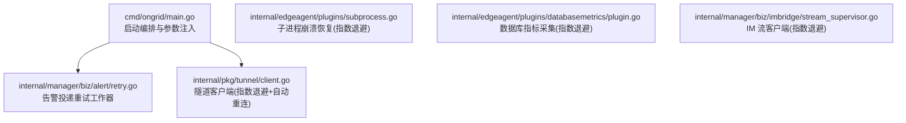
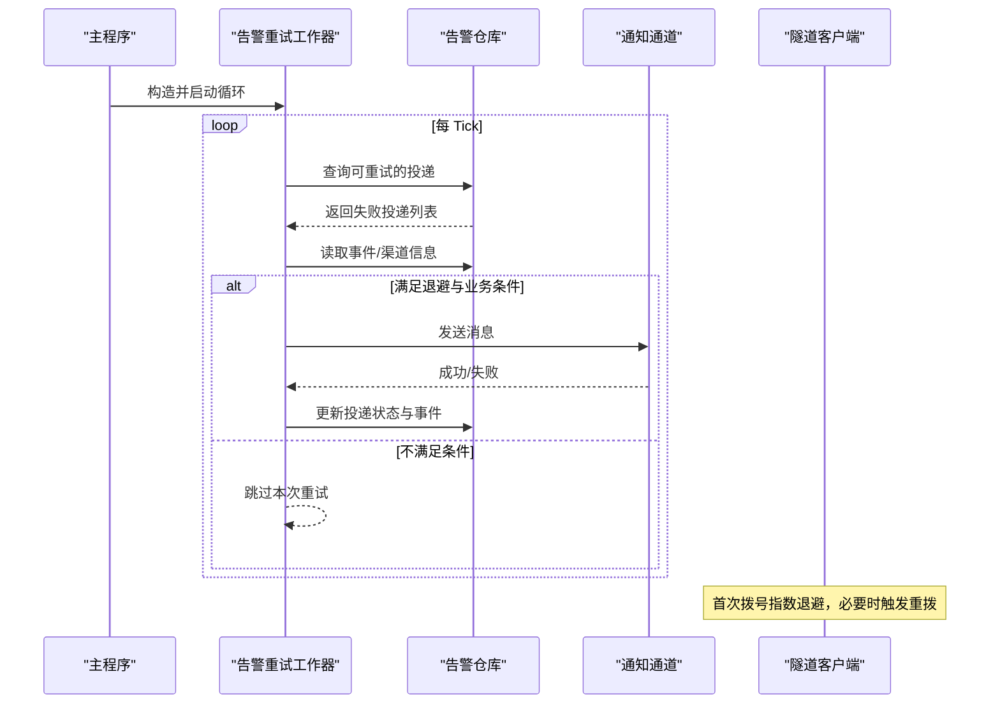
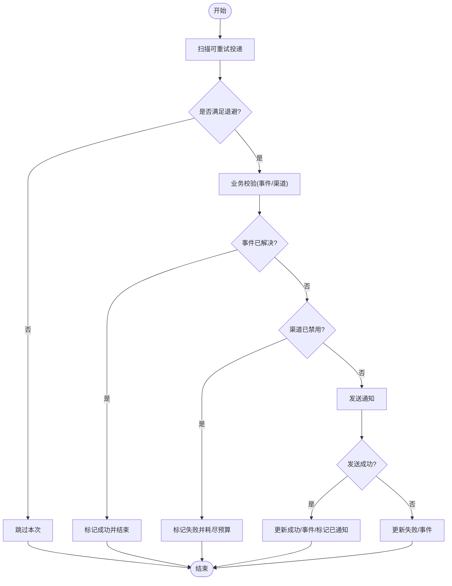
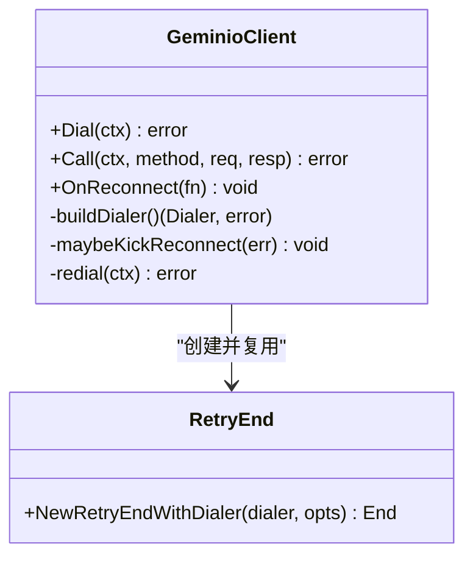
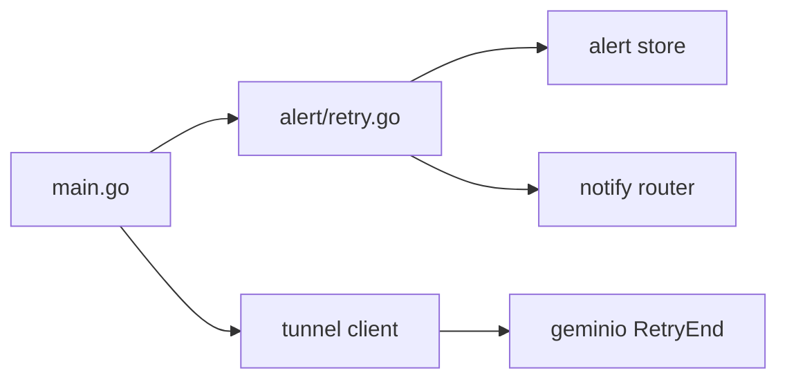
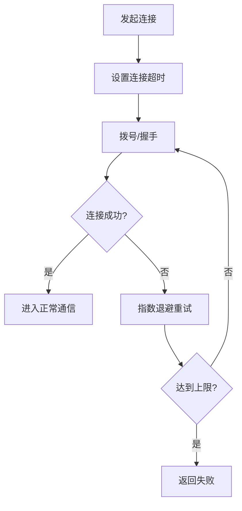
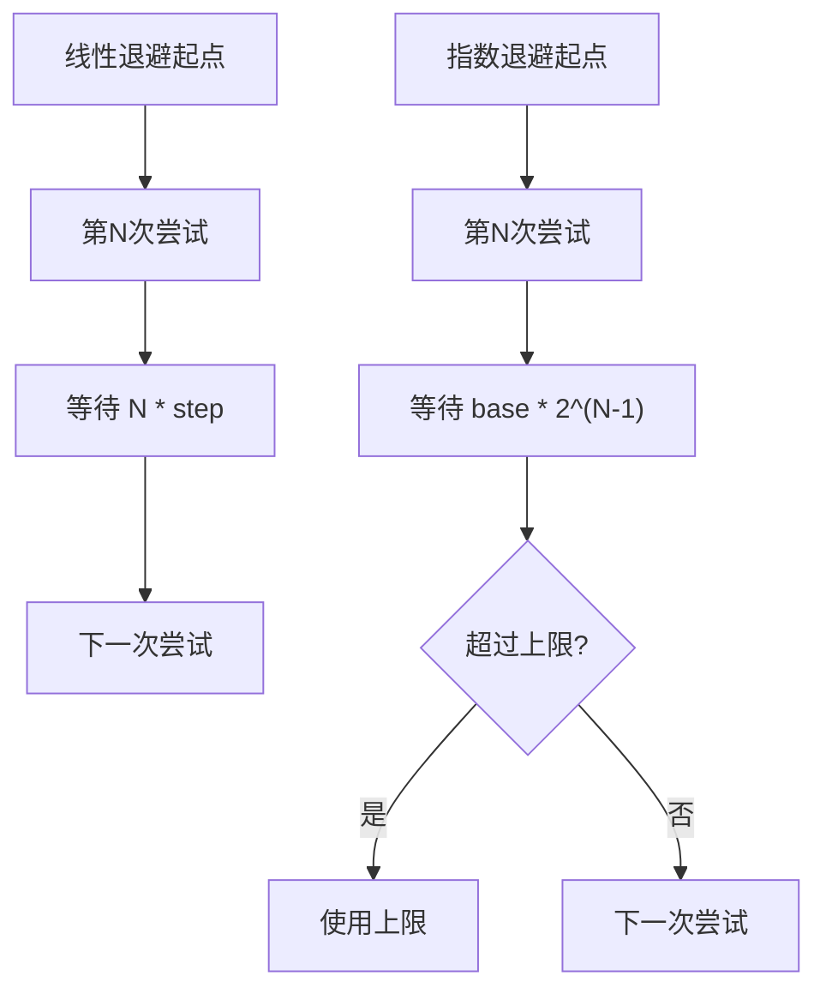

# 重试策略与超时控制

<cite>
**本文引用的文件**   
- [internal/manager/biz/alert/retry.go](file://internal/manager/biz/alert/retry.go)
- [internal/manager/biz/alert/retry_test.go](file://internal/manager/biz/alert/retry_test.go)
- [cmd/ongrid/main.go](file://cmd/ongrid/main.go)
- [internal/pkg/tunnel/client.go](file://internal/pkg/tunnel/client.go)
- [internal/edgeagent/plugins/subprocess.go](file://internal/edgeagent/plugins/subprocess.go)
- [internal/edgeagent/plugins/databasemetrics/plugin.go](file://internal/edgeagent/plugins/databasemetrics/plugin.go)
- [internal/manager/biz/imbridge/stream_supervisor.go](file://internal/manager/biz/imbridge/stream_supervisor.go)
- [internal/manager/data/alert/store/store_test.go](file://internal/manager/data/alert/store/store_test.go)
</cite>

## 目录
1. [简介](#简介)
2. [项目结构](#项目结构)
3. [核心组件](#核心组件)
4. [架构总览](#架构总览)
5. [详细组件分析](#详细组件分析)
6. [依赖关系分析](#依赖关系分析)
7. [性能考量](#性能考量)
8. [故障排查指南](#故障排查指南)
9. [结论](#结论)
10. [附录](#附录)

## 简介
本文件聚焦 OnGrid 的重试策略与超时控制，围绕以下目标展开：
- 深入描述重试算法实现：线性退避、指数退避与固定间隔（含抖动）策略。
- 明确重试条件判断：可重试错误类型、幂等性检查、业务状态验证。
- 解释超时控制机制：连接超时、请求超时与整体操作超时。
- 说明重试次数限制与最大等待时间控制。
- 提供重试流程图、退避算法图与超时配置示例。
- 阐述重试策略的配置方法与动态调整机制。

## 项目结构
与重试和超时相关的代码主要分布在告警投递重试、隧道客户端重连、边缘插件子进程重启以及 IM 流式客户端重连等模块中。下图给出与主题直接相关的文件与职责概览。

**图示来源** 
- [cmd/ongrid/main.go:2657-2662](file://cmd/ongrid/main.go#L2657-L2662)
- [internal/manager/biz/alert/retry.go:1-73](file://internal/manager/biz/alert/retry.go#L1-L73)
- [internal/pkg/tunnel/client.go:62-141](file://internal/pkg/tunnel/client.go#L62-L141)
- [internal/edgeagent/plugins/subprocess.go:194-231](file://internal/edgeagent/plugins/subprocess.go#L194-L231)
- [internal/edgeagent/plugins/databasemetrics/plugin.go:187-214](file://internal/edgeagent/plugins/databasemetrics/plugin.go#L187-L214)
- [internal/manager/biz/imbridge/stream_supervisor.go:162-191](file://internal/manager/biz/imbridge/stream_supervisor.go#L162-L191)

**章节来源**
- [cmd/ongrid/main.go:2657-2662](file://cmd/ongrid/main.go#L2657-L2662)
- [internal/manager/biz/alert/retry.go:1-73](file://internal/manager/biz/alert/retry.go#L1-L73)
- [internal/pkg/tunnel/client.go:62-141](file://internal/pkg/tunnel/client.go#L62-L141)
- [internal/edgeagent/plugins/subprocess.go:194-231](file://internal/edgeagent/plugins/subprocess.go#L194-L231)
- [internal/edgeagent/plugins/databasemetrics/plugin.go:187-214](file://internal/edgeagent/plugins/databasemetrics/plugin.go#L187-L214)
- [internal/manager/biz/imbridge/stream_supervisor.go:162-191](file://internal/manager/biz/imbridge/stream_supervisor.go#L162-L191)

## 核心组件
- 告警投递重试工作器：负责从持久化层拉取失败的投递记录，按线性退避策略进行重试，并在成功或达到上限后更新状态与事件。
- 隧道客户端：在首次拨号阶段采用指数退避；连接建立后由底层库处理断线重连；当检测到路由失效时触发主动重拨。
- 边缘插件子进程：崩溃后以指数退避重启，避免雪崩。
- 数据库指标采集：采集失败时以指数退避重试，防止对下游造成压力。
- IM 流式客户端：运行异常后以指数退避重连，保护上游服务。

**章节来源**
- [internal/manager/biz/alert/retry.go:14-73](file://internal/manager/biz/alert/retry.go#L14-L73)
- [internal/pkg/tunnel/client.go:62-141](file://internal/pkg/tunnel/client.go#L62-L141)
- [internal/edgeagent/plugins/subprocess.go:194-231](file://internal/edgeagent/plugins/subprocess.go#L194-L231)
- [internal/edgeagent/plugins/databasemetrics/plugin.go:187-214](file://internal/edgeagent/plugins/databasemetrics/plugin.go#L187-L214)
- [internal/manager/biz/imbridge/stream_supervisor.go:162-191](file://internal/manager/biz/imbridge/stream_supervisor.go#L162-L191)

## 架构总览
下图展示重试与超时的关键路径：主程序启动时注入告警重试工作器；工作器周期性扫描失败投递并执行重试；同时，隧道客户端在连接阶段使用指数退避，并在特定错误下触发重拨。

**图示来源** 
- [cmd/ongrid/main.go:2657-2662](file://cmd/ongrid/main.go#L2657-L2662)
- [internal/manager/biz/alert/retry.go:75-108](file://internal/manager/biz/alert/retry.go#L75-L108)
- [internal/manager/biz/alert/retry.go:117-201](file://internal/manager/biz/alert/retry.go#L117-L201)
- [internal/pkg/tunnel/client.go:62-141](file://internal/pkg/tunnel/client.go#L62-L141)

## 详细组件分析

### 告警投递重试工作器（线性退避）
- 策略要点
  - 线性退避：每次重试的最小间隔为“尝试次数 × 每尝试退避时长”。
  - 最大尝试次数：超过阈值不再重试。
  - 业务校验：若事件已解决或渠道被禁用，则终止重试并标记结果。
  - 幂等性：通过“投递记录 + 尝试计数”保证同一投递不会重复发送。
- 关键流程
  - 周期扫描失败投递 → 计算最小等待时间 → 重建消息 → 调用通知器 → 更新状态与事件。
- 配置项
  - 最大尝试次数、每尝试退避时长、Tick 频率、日志与时间源注入。

**图示来源** 
- [internal/manager/biz/alert/retry.go:98-108](file://internal/manager/biz/alert/retry.go#L98-L108)
- [internal/manager/biz/alert/retry.go:117-201](file://internal/manager/biz/alert/retry.go#L117-L201)

**章节来源**
- [internal/manager/biz/alert/retry.go:14-73](file://internal/manager/biz/alert/retry.go#L14-L73)
- [internal/manager/biz/alert/retry.go:75-108](file://internal/manager/biz/alert/retry.go#L75-L108)
- [internal/manager/biz/alert/retry.go:117-201](file://internal/manager/biz/alert/retry.go#L117-L201)
- [internal/manager/biz/alert/retry_test.go:11-69](file://internal/manager/biz/alert/retry_test.go#L11-L69)
- [internal/manager/biz/alert/retry_test.go:71-114](file://internal/manager/biz/alert/retry_test.go#L71-L114)
- [internal/manager/biz/alert/retry_test.go:116-154](file://internal/manager/biz/alert/retry_test.go#L116-L154)
- [internal/manager/biz/alert/retry_test.go:156-197](file://internal/manager/biz/alert/retry_test.go#L156-L197)

### 隧道客户端（指数退避 + 自动重连）
- 策略要点
  - 首次拨号：指数退避，初始间隔与上限固定。
  - 连接建立后：底层库负责断线重连；上层在检测到路由失效时主动重拨。
  - 重拨超时：独立上下文设置上限，避免长时间阻塞。
- 关键流程
  - Dial 循环拨号 → 注册处理器 → 成功后返回；失败则指数退避并重试。
  - Call 失败检测 → 可能触发异步重拨 → 回调通知上层。

**图示来源** 
- [internal/pkg/tunnel/client.go:62-141](file://internal/pkg/tunnel/client.go#L62-L141)
- [internal/pkg/tunnel/client.go:218-287](file://internal/pkg/tunnel/client.go#L218-L287)
- [internal/pkg/tunnel/client.go:289-301](file://internal/pkg/tunnel/client.go#L289-L301)

**章节来源**
- [internal/pkg/tunnel/client.go:62-141](file://internal/pkg/tunnel/client.go#L62-L141)
- [internal/pkg/tunnel/client.go:218-287](file://internal/pkg/tunnel/client.go#L218-L287)
- [internal/pkg/tunnel/client.go:289-301](file://internal/pkg/tunnel/client.go#L289-L301)

### 边缘插件子进程（指数退避）
- 策略要点
  - 子进程崩溃后，以指数退避重启，直至达到上限。
  - 用于抑制瞬时故障导致的频繁重启风暴。
- 适用场景
  - 外部依赖不稳定、资源短暂不可用等。

**章节来源**
- [internal/edgeagent/plugins/subprocess.go:194-231](file://internal/edgeagent/plugins/subprocess.go#L194-L231)

### 数据库指标采集（指数退避）
- 策略要点
  - 采集失败时指数退避，避免对数据库造成二次冲击。
  - 上限控制防止无限增长。

**章节来源**
- [internal/edgeagent/plugins/databasemetrics/plugin.go:187-214](file://internal/edgeagent/plugins/databasemetrics/plugin.go#L187-L214)

### IM 流式客户端（指数退避）
- 策略要点
  - 运行异常后指数退避重连，上限控制。
  - 保护上游 IM 提供商稳定性。

**章节来源**
- [internal/manager/biz/imbridge/stream_supervisor.go:162-191](file://internal/manager/biz/imbridge/stream_supervisor.go#L162-L191)

## 依赖关系分析
- 主程序将告警重试工作器与管道评估器装配在一起，并通过配置注入退避与 Tick 参数。
- 重试工作器依赖仓库接口、通知器与渠道解析器，完成数据读取与发送。
- 隧道客户端依赖底层 geminio 的 RetryEnd，封装了指数退避与重拨逻辑。

**图示来源** 
- [cmd/ongrid/main.go:2657-2662](file://cmd/ongrid/main.go#L2657-L2662)
- [internal/manager/biz/alert/retry.go:14-73](file://internal/manager/biz/alert/retry.go#L14-L73)
- [internal/pkg/tunnel/client.go:62-141](file://internal/pkg/tunnel/client.go#L62-L141)

**章节来源**
- [cmd/ongrid/main.go:2657-2662](file://cmd/ongrid/main.go#L2657-L2662)
- [internal/manager/biz/alert/retry.go:14-73](file://internal/manager/biz/alert/retry.go#L14-L73)
- [internal/pkg/tunnel/client.go:62-141](file://internal/pkg/tunnel/client.go#L62-L141)

## 性能考量
- 线性退避适合“最终一致”的投递场景，避免对下游造成突发压力。
- 指数退避适用于网络波动与远端服务短时不可用，能有效降低重试风暴。
- 建议结合监控指标观察重试成功率、平均延迟与失败原因分布，动态调优退避步长与上限。

[本节为通用指导，无需源码引用]

## 故障排查指南
- 告警投递未送达
  - 检查是否命中退避窗口与最大尝试次数。
  - 确认事件状态是否为“已解决”，渠道是否启用。
  - 查看重试事件与失败原因记录。
- 隧道无法建立或频繁重连
  - 关注首次拨号指数退避日志与错误码。
  - 检查是否出现路由失效导致主动重拨。
- 子进程频繁重启
  - 确认崩溃原因与退避上限是否合理。
- 数据库指标采集失败
  - 核对采集目标可达性与认证配置。
  - 观察退避曲线是否收敛。

**章节来源**
- [internal/manager/biz/alert/retry_test.go:71-114](file://internal/manager/biz/alert/retry_test.go#L71-L114)
- [internal/manager/biz/alert/retry_test.go:116-154](file://internal/manager/biz/alert/retry_test.go#L116-L154)
- [internal/manager/biz/alert/retry_test.go:156-197](file://internal/manager/biz/alert/retry_test.go#L156-L197)
- [internal/manager/data/alert/store/store_test.go:88-122](file://internal/manager/data/alert/store/store_test.go#L88-L122)
- [internal/pkg/tunnel/client.go:62-141](file://internal/pkg/tunnel/client.go#L62-L141)

## 结论
OnGrid 在不同子系统采用了差异化的重试策略：告警投递采用线性退避，确保稳定与可控；网络与进程级组件采用指数退避，提升弹性与自愈能力。配合明确的业务校验与最大尝试次数限制，系统在可靠性与资源占用之间取得平衡。通过合理的超时配置与动态调整，可在不同部署环境下获得更稳健的运行表现。

[本节为总结，无需源码引用]

## 附录

### 重试条件判断清单
- 可重试错误类型
  - 网络抖动、远端暂时不可用、下游限流等临时性错误。
- 幂等性检查
  - 基于投递记录与尝试计数，避免重复发送。
- 业务状态验证
  - 事件已解决或渠道禁用时终止重试。

**章节来源**
- [internal/manager/biz/alert/retry.go:117-201](file://internal/manager/biz/alert/retry.go#L117-L201)

### 超时控制机制与配置示例
- 连接超时
  - 隧道拨号默认连接超时固定值，TLS 与非 TLS 均生效。
- 请求超时
  - 各 RPC/HTTP 调用使用各自上下文设置的超时。
- 整体操作超时
  - 重拨过程使用独立上下文并设置上限，避免长时间阻塞。

**图示来源** 
- [internal/pkg/tunnel/client.go:144-176](file://internal/pkg/tunnel/client.go#L144-L176)
- [internal/pkg/tunnel/client.go:62-141](file://internal/pkg/tunnel/client.go#L62-L141)
- [internal/pkg/tunnel/client.go:278-287](file://internal/pkg/tunnel/client.go#L278-L287)

**章节来源**
- [internal/pkg/tunnel/client.go:144-176](file://internal/pkg/tunnel/client.go#L144-L176)
- [internal/pkg/tunnel/client.go:62-141](file://internal/pkg/tunnel/client.go#L62-L141)
- [internal/pkg/tunnel/client.go:278-287](file://internal/pkg/tunnel/client.go#L278-L287)

### 退避算法图（线性 vs 指数）
- 线性退避（告警投递）
  - 第 N 次重试至少在第 N×步长之后。
- 指数退避（隧道/子进程/采集/IM）
  - 间隔按倍数增长，直至达到上限。

**图示来源** 
- [internal/manager/biz/alert/retry.go:117-128](file://internal/manager/biz/alert/retry.go#L117-L128)
- [internal/pkg/tunnel/client.go:86-141](file://internal/pkg/tunnel/client.go#L86-L141)
- [internal/edgeagent/plugins/subprocess.go:194-231](file://internal/edgeagent/plugins/subprocess.go#L194-L231)
- [internal/edgeagent/plugins/databasemetrics/plugin.go:187-214](file://internal/edgeagent/plugins/databasemetrics/plugin.go#L187-L214)
- [internal/manager/biz/imbridge/stream_supervisor.go:162-191](file://internal/manager/biz/imbridge/stream_supervisor.go#L162-L191)

### 重试策略配置与动态调整
- 告警投递重试
  - 通过构造选项注入最大尝试次数、每尝试退避时长与 Tick 频率。
  - 支持注入 Now 函数以便测试与一致性控制。
- 隧道客户端
  - 拨号退避步长与上限在客户端内部设定；可通过上层上下文控制整体重拨超时。
- 其他组件
  - 子进程与采集、IM 客户端均在各自模块内定义退避步长与上限。

**章节来源**
- [internal/manager/biz/alert/retry.go:45-73](file://internal/manager/biz/alert/retry.go#L45-L73)
- [cmd/ongrid/main.go:2657-2662](file://cmd/ongrid/main.go#L2657-L2662)
- [internal/pkg/tunnel/client.go:86-141](file://internal/pkg/tunnel/client.go#L86-L141)
- [internal/edgeagent/plugins/subprocess.go:194-231](file://internal/edgeagent/plugins/subprocess.go#L194-L231)
- [internal/edgeagent/plugins/databasemetrics/plugin.go:187-214](file://internal/edgeagent/plugins/databasemetrics/plugin.go#L187-L214)
- [internal/manager/biz/imbridge/stream_supervisor.go:162-191](file://internal/manager/biz/imbridge/stream_supervisor.go#L162-L191)