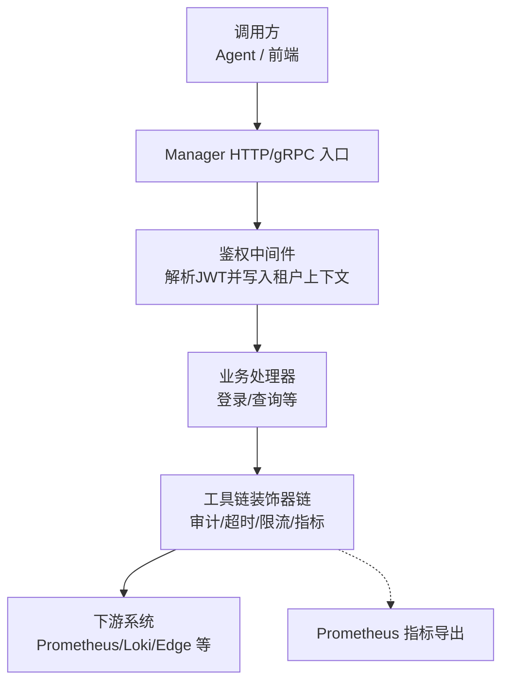
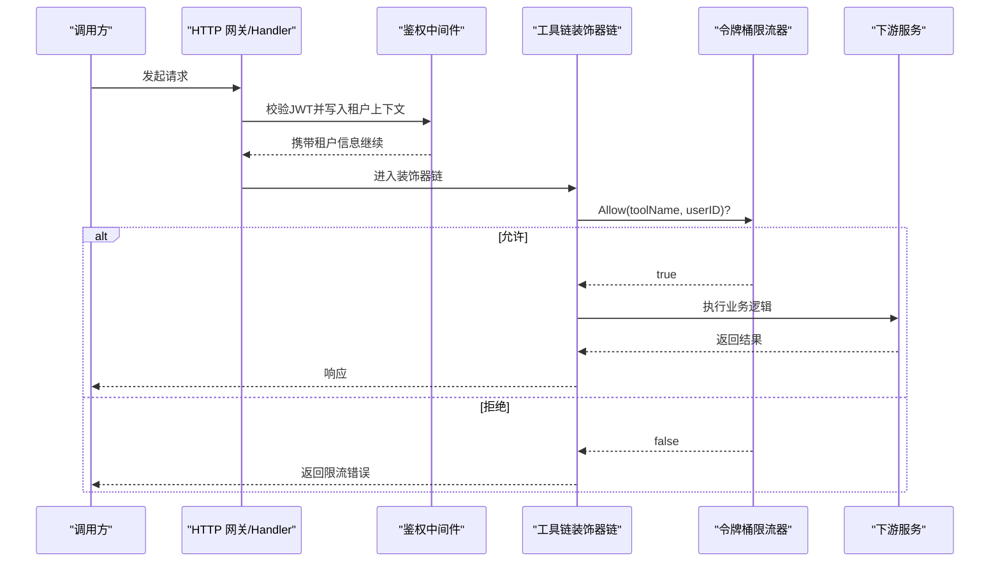
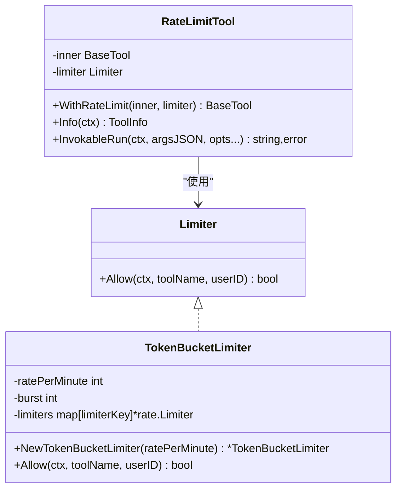
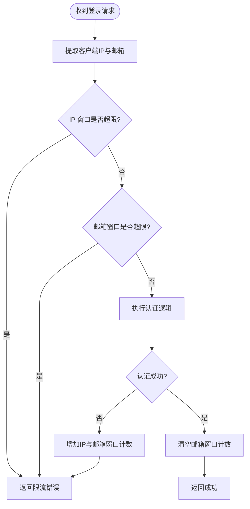
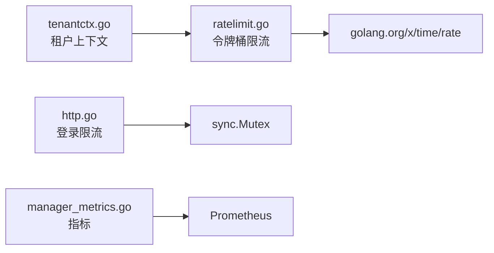
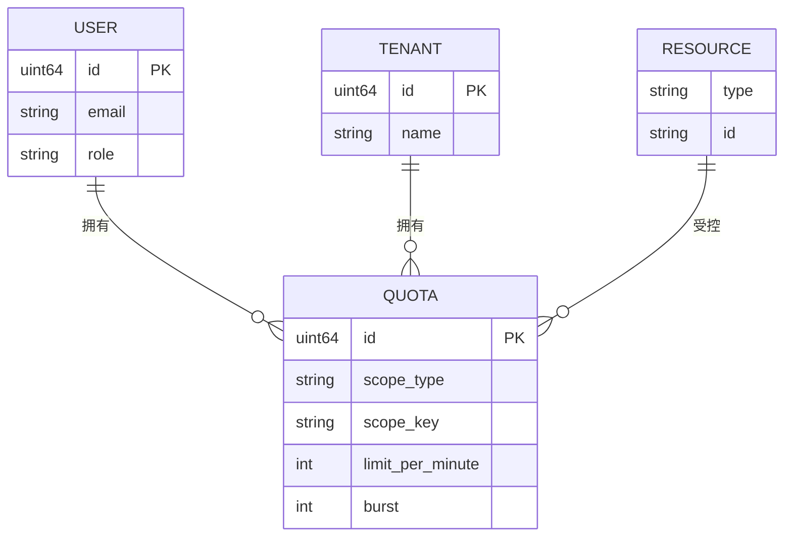

# 限流与配额管理

<cite>
**本文引用的文件**   
- [ratelimit.go](file://internal/manager/biz/aiops/tools/decorators/ratelimit.go)
- [basetool_decorated_test.go](file://internal/manager/biz/aiops/tools/basetool_decorated_test.go)
- [http.go](file://internal/iam/server/http.go)
- [tenantctx.go](file://internal/pkg/tenantctx/tenantctx.go)
- [manager_metrics.go](file://internal/pkg/prom/manager_metrics.go)
- [main.go](file://cmd/ongrid/main.go)
</cite>

## 目录
1. [简介](#简介)
2. [项目结构](#项目结构)
3. [核心组件](#核心组件)
4. [架构总览](#架构总览)
5. [详细组件分析](#详细组件分析)
6. [依赖关系分析](#依赖关系分析)
7. [性能考量](#性能考量)
8. [故障排查指南](#故障排查指南)
9. [结论](#结论)
10. [附录](#附录)

## 简介
本文件聚焦 OnGrid 的“请求速率限制”与“配额管理”能力，结合仓库中已实现的装饰器层限流、登录防暴力破解限流以及可观测性指标，给出：
- 令牌桶算法的实现与使用方式
- 滑动窗口在登录场景的应用
- 漏桶算法的定位与扩展建议
- 用户级、租户级、资源级的配额模型设计思路
- 全局限流、API 级别限流、IP 级别限流的策略组合
- 超界处理（拒绝、排队等待、降级）
- 架构图、配额模型图与配置示例
- 限流指标的监控与告警设置

说明：当前代码库实现了“令牌桶 + 滑动窗口”的组合；“漏桶”作为扩展方案在本文档提供设计与集成建议。

## 项目结构
与限流和配额相关的核心位置：
- 工具链装饰器层限流：internal/manager/biz/aiops/tools/decorators/ratelimit.go
- 登录接口防暴力破解限流：internal/iam/server/http.go
- 租户上下文承载：internal/pkg/tenantctx/tenantctx.go
- 指标暴露：internal/pkg/prom/manager_metrics.go
- 运行时注入点（为 chat runtime 注入限流器）：cmd/ongrid/main.go

图表来源
- [ratelimit.go:1-136](file://internal/manager/biz/aiops/tools/decorators/ratelimit.go#L1-L136)
- [http.go:1-438](file://internal/iam/server/http.go#L1-L438)
- [tenantctx.go:1-35](file://internal/pkg/tenantctx/tenantctx.go#L1-L35)
- [manager_metrics.go:203-269](file://internal/pkg/prom/manager_metrics.go#L203-L269)

章节来源
- [ratelimit.go:1-136](file://internal/manager/biz/aiops/tools/decorators/ratelimit.go#L1-L136)
- [http.go:1-438](file://internal/iam/server/http.go#L1-L438)
- [tenantctx.go:1-35](file://internal/pkg/tenantctx/tenantctx.go#L1-L35)
- [manager_metrics.go:203-269](file://internal/pkg/prom/manager_metrics.go#L203-L269)

## 核心组件
- 令牌桶限流器（按“工具名+用户ID”维度）
  - 默认速率：每分钟若干次调用（实现中定义常量）
  - 突发容量等于速率，保证空闲后首次调用不阻塞
  - 非阻塞 Allow：拒绝时立即返回错误，便于上层快速失败
- 登录防暴力破解限流（滑动窗口）
  - IP 维度与邮箱维度双重检查，任一超限即拒绝
  - 成功登录会清除邮箱维度的计数，避免误伤正常用户
- 租户上下文
  - 通过 JWT 解析后写入 context，供后续层读取用户身份
- 指标与可观测性
  - HTTP 请求量与时延、数据库连接池状态、LLM 路由层调用与 token 消耗等指标

章节来源
- [ratelimit.go:14-96](file://internal/manager/biz/aiops/tools/decorators/ratelimit.go#L14-L96)
- [http.go:26-114](file://internal/iam/server/http.go#L26-L114)
- [tenantctx.go:1-35](file://internal/pkg/tenantctx/tenantctx.go#L1-L35)
- [manager_metrics.go:203-269](file://internal/pkg/prom/manager_metrics.go#L203-L269)

## 架构总览
OnGrid 的限流与配额在两条路径上生效：
- 工具链调用路径：装饰器链中的 RateLimitTool 基于令牌桶对每个“工具+用户”进行限流
- 认证路径：登录接口采用滑动窗口对 IP 与邮箱分别限流，防止暴力破解

图表来源
- [ratelimit.go:98-136](file://internal/manager/biz/aiops/tools/decorators/ratelimit.go#L98-L136)
- [tenantctx.go:1-35](file://internal/pkg/tenantctx/tenantctx.go#L1-L35)

## 详细组件分析

### 令牌桶限流器（工具链层）
- 关键概念
  - 每“工具名+用户ID”一个独立桶
  - 默认速率：每分钟 N 次（由常量控制），突发容量=速率
  - Allow 非阻塞：拒绝直接返回错误，便于上层快速失败
- 行为验证
  - 测试用例覆盖：限流触发、审计记录顺序、租户绑定无副作用等
- 集成点
  - 在 chat runtime 启动时注入 TokenBucketLimiter，统一约束工具调用

图表来源
- [ratelimit.go:29-96](file://internal/manager/biz/aiops/tools/decorators/ratelimit.go#L29-L96)
- [ratelimit.go:98-136](file://internal/manager/biz/aiops/tools/decorators/ratelimit.go#L98-L136)

章节来源
- [ratelimit.go:14-96](file://internal/manager/biz/aiops/tools/decorators/ratelimit.go#L14-L96)
- [basetool_decorated_test.go:131-173](file://internal/manager/biz/aiops/tools/basetool_decorated_test.go#L131-L173)
- [main.go:2143-2164](file://cmd/ongrid/main.go#L2143-L2164)

### 登录防暴力破解限流（滑动窗口）
- 关键概念
  - 双维度：IP 与邮箱
  - 时间窗口固定长度，窗口内超过阈值则拒绝
  - 成功登录会重置邮箱维度计数，避免误伤
- 适用场景
  - 登录接口防护，抵御密码爆破与撞库

图表来源
- [http.go:26-114](file://internal/iam/server/http.go#L26-L114)

章节来源
- [http.go:26-114](file://internal/iam/server/http.go#L26-L114)

### 租户上下文与配额键空间
- 租户上下文
  - 从 JWT 解析出 UserID、Email、Role、IsSuperuser，写入 context
  - 下游限流/配额可按此标识做细粒度控制
- 配额键空间建议
  - 用户级：{userID}
  - 租户级：{tenantID}（未来多租户扩展）
  - 资源级：{resourceType}:{resourceID}（如 API 路由模板、工具名）

章节来源
- [tenantctx.go:1-35](file://internal/pkg/tenantctx/tenantctx.go#L1-L35)

### 指标与可观测性
- 已暴露指标
  - HTTP 请求总量与时延直方图
  - 数据库连接池状态与等待计数
  - LLM 路由层调用次数、耗时、token 消耗
- 限流相关指标建议
  - 工具调用总数与结果分布（success/error/rate_limited）
  - 各维度限流拒绝计数（按工具、用户、IP、API 路由）
  - 令牌桶剩余令牌近似值（可选）

章节来源
- [manager_metrics.go:203-269](file://internal/pkg/prom/manager_metrics.go#L203-L269)

## 依赖关系分析
- 装饰器链限流依赖 golang.org/x/time/rate 提供的令牌桶
- 登录限流依赖内存映射与互斥锁，单实例 MVP 无需外部存储
- 租户上下文贯穿鉴权到业务层，为限流/配额提供身份键
- 指标通过 Prometheus 客户端注册，统一采集

图表来源
- [ratelimit.go:1-136](file://internal/manager/biz/aiops/tools/decorators/ratelimit.go#L1-L136)
- [http.go:1-438](file://internal/iam/server/http.go#L1-L438)
- [tenantctx.go:1-35](file://internal/pkg/tenantctx/tenantctx.go#L1-L35)
- [manager_metrics.go:203-269](file://internal/pkg/prom/manager_metrics.go#L203-L269)

章节来源
- [ratelimit.go:1-136](file://internal/manager/biz/aiops/tools/decorators/ratelimit.go#L1-L136)
- [http.go:1-438](file://internal/iam/server/http.go#L1-L438)
- [tenantctx.go:1-35](file://internal/pkg/tenantctx/tenantctx.go#L1-L35)
- [manager_metrics.go:203-269](file://internal/pkg/prom/manager_metrics.go#L203-L269)

## 性能考量
- 令牌桶
  - 内存占用：按“工具+用户”维度维护 rate.Limiter，用户基数大时需关注 map 增长
  - 并发安全：内部加锁，短临界区，适合高并发
- 登录限流
  - 纯内存实现，重启清零，适合单实例 MVP；多实例需迁移至 Redis
- 指标
  - 直方图桶数量与标签基数需谨慎，避免采样爆炸

## 故障排查指南
- 现象：工具调用频繁被拒
  - 检查装饰器链是否启用限流器，确认默认速率与突发容量
  - 查看工具调用指标 with result=rate_limited 的计数
- 现象：登录被限流
  - 核对 IP 与邮箱窗口计数，确认是否存在异常来源或共享出口 NAT
- 现象：限流未生效
  - 确认装饰器链构造时注入了 Limiter，且未被 NoopLimiter 替代
  - 检查 chat runtime 初始化是否传入 TokenBucketLimiter

章节来源
- [basetool_decorated_test.go:131-173](file://internal/manager/biz/aiops/tools/basetool_decorated_test.go#L131-L173)
- [main.go:2143-2164](file://cmd/ongrid/main.go#L2143-L2164)

## 结论
- 当前实现以“令牌桶 + 滑动窗口”为主，覆盖了工具链与登录两个关键路径
- 通过租户上下文可实现更细粒度的配额键空间
- 建议逐步完善：
  - 将登录限流迁移至分布式存储以支持多实例
  - 引入漏桶用于平滑突发流量
  - 建立统一的配额中心，支持用户/租户/资源三级配额与动态下发

## 附录

### 限流策略配置要点
- 全局限流
  - 适用于全局入口或网关层，保护整体吞吐
- API 级别限流
  - 针对特定路由模板或工具名，结合租户/用户维度
- IP 级别限流
  - 针对登录等敏感接口，结合邮箱维度，抵御暴力破解

### 配额模型图

### 配置示例（文本化）
- 令牌桶（工具链层）
  - 参数：ratePerMinute（默认常量）、burst（默认等于 ratePerMinute）
  - 注入点：chat runtime 初始化时传入 NewTokenBucketLimiter
- 登录限流（滑动窗口）
  - 参数：IP 窗口大小与阈值、邮箱窗口大小与阈值
  - 行为：任一超限即拒绝；成功登录重置邮箱窗口计数

章节来源
- [ratelimit.go:14-96](file://internal/manager/biz/aiops/tools/decorators/ratelimit.go#L14-L96)
- [http.go:43-114](file://internal/iam/server/http.go#L43-L114)
- [main.go:2143-2164](file://cmd/ongrid/main.go#L2143-L2164)

### 监控与告警建议
- 指标
  - ongrid_http_requests_total、ongrid_http_request_duration_seconds
  - ongrid_llm_calls_total、ongrid_llm_call_duration_seconds、ongrid_llm_router_tokens_total
  - 新增：ongrid_tool_invocations_total{name, result}（含 rate_limited）
- 告警规则建议
  - 工具调用 rate_limited 比率突增
  - 登录失败率与限流拒绝率突增
  - 下游 PromQL 查询超时/失败率上升

章节来源
- [manager_metrics.go:203-269](file://internal/pkg/prom/manager_metrics.go#L203-L269)