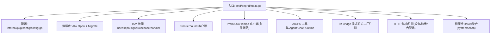
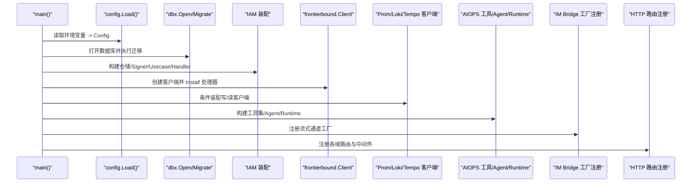

# 依赖注入与装配

<cite>
**本文引用的文件列表**
- [cmd/ongrid/main.go](file://cmd/ongrid/main.go)
- [internal/pkg/config/config.go](file://internal/pkg/config/config.go)
- [internal/manager/service/systemhealth/service.go](file://internal/manager/service/systemhealth/service.go)
- [internal/manager/biz/imbridge/stream_supervisor.go](file://internal/manager/biz/imbridge/stream_supervisor.go)
- [internal/manager/biz/setting/websearch.go](file://internal/manager/biz/setting/websearch.go)
- [internal/manager/server/device/http.go](file://internal/manager/server/device/http.go)
</cite>

## 目录
1. [简介](#简介)
2. [项目结构](#项目结构)
3. [核心组件](#核心组件)
4. [架构总览](#架构总览)
5. [详细组件分析](#详细组件分析)
6. [依赖关系分析](#依赖关系分析)
7. [性能考量](#性能考量)
8. [故障排查指南](#故障排查指南)
9. [结论](#结论)
10. [附录](#附录)

## 简介
本文件系统性阐述 OnGrid 云管端的依赖注入与装配机制，聚焦以下目标：
- 服务装配过程、依赖解析与生命周期管理
- main 函数中的初始化顺序、配置加载与组件注册
- Go 语言中构造函数注入、接口抽象与模拟对象的使用方式
- 服务发现（frontierbound）、配置管理与环境变量处理
- 如何正确组装服务依赖、避免循环依赖以及在测试中替换依赖

OnGrid 采用“显式装配”的 DI 风格：在入口集中构造各层对象，通过构造函数参数注入依赖，使用接口解耦外部系统，并以条件装配实现可选能力。

## 项目结构
从装配视角看，关键位置集中在：
- 入口装配：cmd/ongrid/main.go
- 配置加载：internal/pkg/config/config.go
- 健康检查依赖聚合：internal/manager/service/systemhealth/service.go
- 运行时插件/流式通道工厂注册：internal/manager/biz/imbridge/stream_supervisor.go
- 动态配置解析器（设置项）：internal/manager/biz/setting/websearch.go
- HTTP 路由与中间件装配示例：internal/manager/server/device/http.go



图表来源
- [cmd/ongrid/main.go](file://cmd/ongrid/main.go)
- [internal/pkg/config/config.go](file://internal/pkg/config/config.go)
- [internal/manager/service/systemhealth/service.go](file://internal/manager/service/systemhealth/service.go)

章节来源
- [cmd/ongrid/main.go](file://cmd/ongrid/main.go)
- [internal/pkg/config/config.go](file://internal/pkg/config/config.go)

## 核心组件
- 配置加载与环境变量映射
  - 通过统一的 Load() 将环境变量映射为强类型结构体，提供默认值与解析辅助方法。
- 数据库与迁移
  - 打开 DB 连接并按启动顺序执行各模块的 Migrate(db)。
- IAM 装配
  - 构建用户仓储、JWT Signer、Usecase、Handler，并初始化组织/成员/Casbin 策略。
- Frontierbound 服务端 SDK
  - 建立与上游 broker 的长连接，安装反向调用处理器与生命周期回调。
- Prometheus/Loki/Tempo 集成
  - 根据配置条件装配读写客户端与查询代理，支持热更新 URL。
- AIOPS 工具与 Agent
  - 构建工具注册表、多模型路由器、Graph 内核或 Legacy 内核，按需装配知识检索、拓扑图等工具。
- IM Bridge 流式通道
  - 注册飞书/Telegram/Slack 的 StreamClientFactory，由 Supervisor 周期 reconcile。
- HTTP 路由与中间件
  - 按域注册路由，注入鉴权中间件与审计日志等横切关注点。

章节来源
- [cmd/ongrid/main.go](file://cmd/ongrid/main.go)
- [internal/pkg/config/config.go](file://internal/pkg/config/config.go)

## 架构总览
下图展示了 main 的装配主流程与关键依赖关系。



图表来源
- [cmd/ongrid/main.go](file://cmd/ongrid/main.go)

## 详细组件分析

### 配置加载与环境变量处理
- 设计要点
  - 单一入口 config.Load() 负责所有环境变量的解析与默认值填充，返回强类型 Config。
  - 提供 getEnv/getEnvBool/getEnvDuration 等辅助函数，统一解析行为。
  - 字段分组清晰：HTTP/DB/JWT/OpenAI/LLM/Admin/Edge/Frontier/Prom/Grafana/Notification/Alert/Logs/Traces/Skills。
- 典型用法
  - main 中先调用 config.Load()，随后基于 cfg 逐项装配下游组件。
  - 对敏感字段（如 JWT Secret）进行安全校验，不满足则拒绝启动。

章节来源
- [internal/pkg/config/config.go](file://internal/pkg/config/config.go)
- [cmd/ongrid/main.go](file://cmd/ongrid/main.go)

### 数据库与迁移
- 设计要点
  - 使用 dbx.Open(cfg.DB, log) 打开后端（MySQL 默认，SQLite 可选）。
  - 以 RunMigrations 集中执行各数据包的 Migrate(db)，保证启动时 schema 一致。
- 生命周期
  - 失败即退出；成功后可获取底层 *sql.DB 用于池指标与健康探测。

章节来源
- [cmd/ongrid/main.go](file://cmd/ongrid/main.go)

### IAM 装配与权限
- 设计要点
  - 构建 userRepo、signer、userUC、iamSvc、iamHandler。
  - 初始化 Casbin Enforcer、角色策略、组织/成员关系，并回填默认组织与成员。
  - 构建 authzMW 作为 RBAC 中间件，注入到需要鉴权的 Handler。
- 安全
  - 强制要求修改默认 JWT Secret，否则直接退出。

章节来源
- [cmd/ongrid/main.go](file://cmd/ongrid/main.go)

### Frontierbound 服务发现与反向调用
- 设计要点
  - 根据 ONGRID_FRONTIER_DISABLED 决定是否启用长连接；未启用时使用 Disabled Client，使相关功能在调用点优雅降级。
  - Install 阶段注册 edge 握手、心跳、push_host_metrics、push_prom_samples、plugin_config、webshell 等处理器。
  - 启动后插入 warmup 窗口，缓解 broker 端 service 表可见性 race。
- 生命周期
  - Close 在 defer 中确保资源释放。

章节来源
- [cmd/ongrid/main.go](file://cmd/ongrid/main.go)

### Prometheus/Loki/Tempo 条件装配
- 设计要点
  - 当 cfg.Prom.Enabled 为真时，构建 promwrite/pquery 客户端与 ingester；否则保持 nil，下游条件判断为 false。
  - Loki/Tempo 同理，URL 为空时安装 handler 但返回 503，SPA 侧显示“禁用”。
- 热更新
  - 通过 Resolver 从 system_settings 读取 URL，请求级缓存，无需重启生效。

章节来源
- [cmd/ongrid/main.go](file://cmd/ongrid/main.go)

### AIOPS 工具、Agent 与 Chat Runtime
- 设计要点
  - 构建 toolsReg，注入 fbClient、edgeUC、deviceUC、prom/log/trace querier、alertUC 等。
  - 构建 llmRouter 与 llmClient，支持多 Provider 与动态目录。
  - 根据 ONGRID_AGENT_KERNEL 选择 Graph 或 Legacy 内核；Graph 下构建 chatruntime.Runtime，再追加协调器专用工具。
- 可观测性
  - 将 prometheus.Registerer 注入工具装饰器，统计调用延迟与 token 用量。

章节来源
- [cmd/ongrid/main.go](file://cmd/ongrid/main.go)

### IM Bridge 流式通道工厂注册
- 设计要点
  - 定义 StreamClient 与 StreamClientFactory 接口，Supervisor 周期 reconcile 已启用的 App 并维护长连接。
  - 在 main 中注册飞书/Telegram/Slack 的工厂，未注册的 provider 仅走 webhook 回退路径。
- 生命周期
  - 独立 goroutine 运行，根 context 取消时优雅关闭。

章节来源
- [internal/manager/biz/imbridge/stream_supervisor.go](file://internal/manager/biz/imbridge/stream_supervisor.go)
- [cmd/ongrid/main.go](file://cmd/ongrid/main.go)

### 动态配置解析器（system_settings）
- 设计要点
  - WebSearchResolver 等 Resolver 通过 setting.Service 读取运行时配置，nil-safe 返回空串或默认值。
  - 与 LLM Settings Resolver、Prom Resolver 等模式一致，实现“UI 编辑即时生效”。

章节来源
- [internal/manager/biz/setting/websearch.go](file://internal/manager/biz/setting/websearch.go)
- [cmd/ongrid/main.go](file://cmd/ongrid/main.go)

### HTTP 路由与中间件装配
- 设计要点
  - 每个域的 Handler 暴露 Register(r chi.Router) 方法，在 main 中集中挂载。
  - 通过 requireAdmin 等中间件实现细粒度权限控制。
- 示例
  - 设备域路由注册与管理员守卫。

章节来源
- [internal/manager/server/device/http.go](file://internal/manager/server/device/http.go)
- [cmd/ongrid/main.go](file://cmd/ongrid/main.go)

### 健康检查依赖聚合
- 设计要点
  - 通过 Dependencies 聚合 DB/Prom/Grafana/Loki/Tempo/Rules/Incidents/Edges/LLM/HTTP 等探针接口。
  - Service 持有这些依赖，对外提供健康状态汇总。

章节来源
- [internal/manager/service/systemhealth/service.go](file://internal/manager/service/systemhealth/service.go)

## 依赖关系分析

```mermaid
classDiagram
class Config {
+string HTTPAddr
+string MetricsAddr
+DBConfig DB
+JWTConfig JWT
+OpenAIConfig OpenAI
+LLMConfig LLM
+FrontierClientConfig FrontierClient
+PromConfig Prom
+GrafanaConfig Grafana
+NotificationConfig Notification
+AlertConfig Alert
+LogsConfig Logs
+TracesConfig Traces
+SkillsConfig Skills
+Load() *Config
}
class SystemHealthService {
+Dependencies deps
+Config cfg
+Probe(ctx) error
}
class StreamSupervisor {
+RegisterFactory(provider, factory)
+Run(ctx)
}
class WebSearchResolver {
+get(ctx, key) string
}
Config <.. SystemHealthService : "提供配置"
SystemHealthService --> "依赖多个接口" : "URLProbe/PromQuerier/..."
StreamSupervisor --> "注册工厂" : "Provider 实现"
WebSearchResolver --> "读取 system_settings" : "Setting Service"
```

图表来源
- [internal/pkg/config/config.go](file://internal/pkg/config/config.go)
- [internal/manager/service/systemhealth/service.go](file://internal/manager/service/systemhealth/service.go)
- [internal/manager/biz/imbridge/stream_supervisor.go](file://internal/manager/biz/imbridge/stream_supervisor.go)
- [internal/manager/biz/setting/websearch.go](file://internal/manager/biz/setting/websearch.go)

章节来源
- [internal/pkg/config/config.go](file://internal/pkg/config/config.go)
- [internal/manager/service/systemhealth/service.go](file://internal/manager/service/systemhealth/service.go)
- [internal/manager/biz/imbridge/stream_supervisor.go](file://internal/manager/biz/imbridge/stream_supervisor.go)
- [internal/manager/biz/setting/websearch.go](file://internal/manager/biz/setting/websearch.go)

## 性能考量
- 条件装配减少冷路径开销：Prom/Loki/Tempo 未启用时不创建客户端，避免无谓网络与内存占用。
- 热更新降低重启成本：URL 与 Provider 目录通过 Resolver 在请求级刷新，避免频繁重启。
- 前端友好降级：未启用能力返回 503/501，SPA 侧隐藏按钮或提示，提升用户体验。
- 健康检查聚合：SystemHealth 聚合多探针，便于快速定位瓶颈。

[本节为通用指导，不直接分析具体文件]

## 故障排查指南
- 启动失败常见原因
  - JWT Secret 仍为默认值：入口会直接退出，需设置强随机密钥。
  - DB 迁移失败：查看对应包 Migrate 的错误日志。
  - Frontier 不可用且未禁用：检查地址与服务名，或设置禁用开关以便本地调试。
- 功能不可用
  - Prom/Loki/Tempo 未启用或 URL 为空：确认环境变量与 system_settings 行是否存在。
  - IM 通道未生效：确认是否注册了对应 StreamClientFactory。
- 诊断建议
  - 使用 /metrics 与 /healthz 观察自监控与健康状态。
  - 开启 OTel 追踪，结合 Tempo 链路定位慢调用。

章节来源
- [cmd/ongrid/main.go](file://cmd/ongrid/main.go)

## 结论
OnGrid 的依赖注入采用“显式装配 + 构造函数注入 + 接口抽象”的组合：
- 入口集中装配，职责清晰，易于阅读与维护。
- 通过接口与条件装配实现可选能力与可插拔扩展。
- 借助 Resolver 与 system_settings 实现运行时配置热更新。
- 通过 Supervisor 与 Factory 模式管理长连接与插件生命周期。
该模式在 Go 中天然契合，避免了全局状态与隐式耦合，提升了可测试性与可运维性。

[本节为总结，不直接分析具体文件]

## 附录

### 如何在 main 中正确组装服务依赖（步骤清单）
- 加载配置：config.Load()
- 打开数据库并执行迁移：dbx.Open + RunMigrations
- 构建 IAM 基础组件与权限中间件
- 构建 Frontierbound 客户端并 Install 处理器
- 条件装配 Prom/Loki/Tempo 客户端
- 构建 AIOPS 工具集、Agent 与 Chat Runtime
- 注册 IM Bridge 流式通道工厂
- 注册各域 HTTP 路由与中间件
- 启动后台任务（评估器、Supervisor、Runner 等）

章节来源
- [cmd/ongrid/main.go](file://cmd/ongrid/main.go)

### 避免循环依赖的策略
- 消费方定义接口，被消费方实现接口，避免双向 import。
- 通过构造函数注入依赖，不在包级使用全局变量。
- 将跨域交互收敛至 pkg 或 API 层，遵循边界约束。

章节来源
- [internal/manager/server/device/http.go](file://internal/manager/server/device/http.go)

### 测试时的依赖替换方法
- 使用接口与 mock 实现替换真实依赖（例如 PromQuerier、URLProbe、StreamClient 等）。
- 在测试中传入 nil 或假实现，验证条件分支与降级逻辑。
- 利用条件装配特性，在不改变业务代码的前提下切换不同实现。

章节来源
- [internal/manager/service/systemhealth/service.go](file://internal/manager/service/systemhealth/service.go)
- [internal/manager/biz/imbridge/stream_supervisor.go](file://internal/manager/biz/imbridge/stream_supervisor.go)