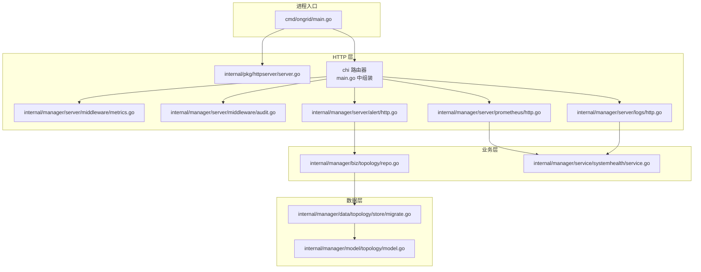
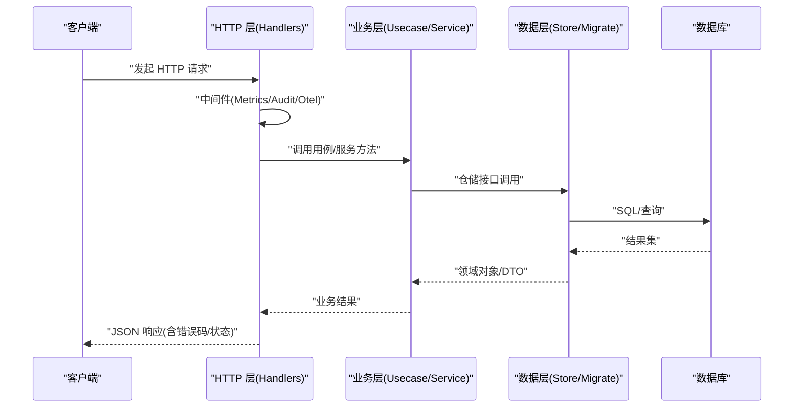
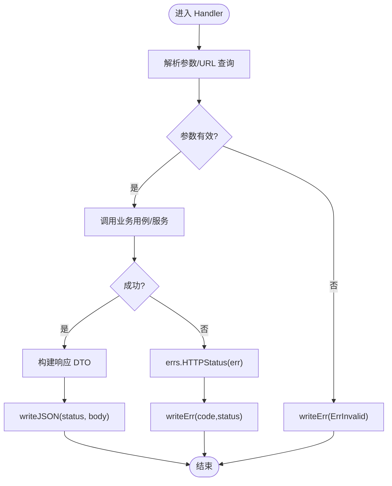
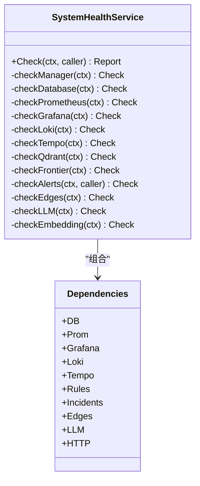
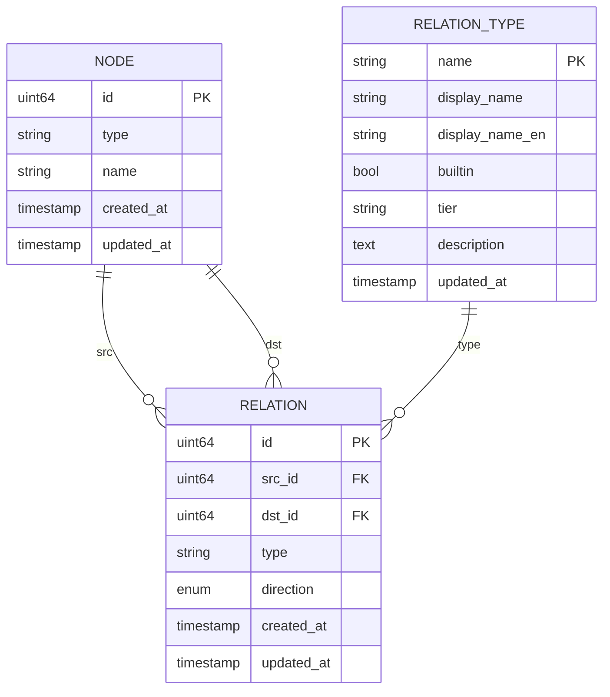
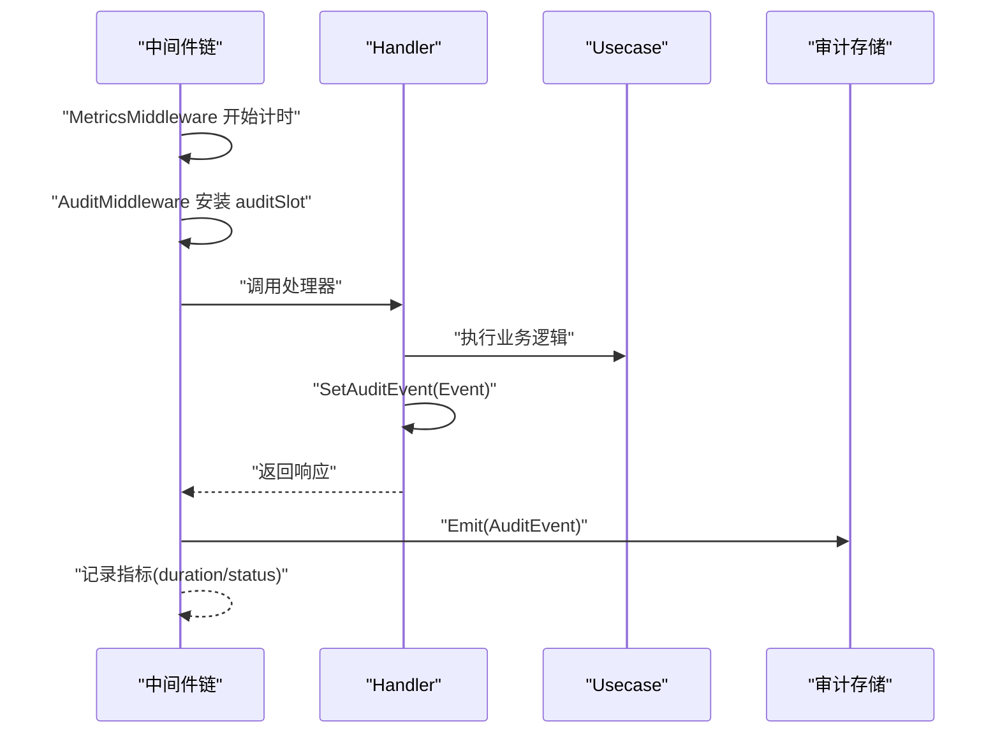
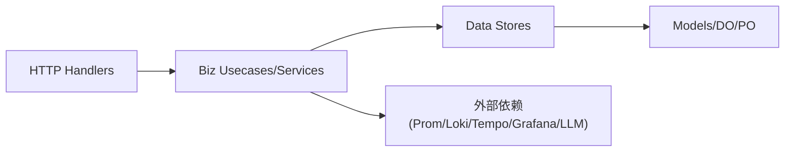

# 分层架构设计

<cite>
**本文引用的文件列表**
- [cmd/ongrid/main.go](file://cmd/ongrid/main.go)
- [internal/pkg/httpserver/server.go](file://internal/pkg/httpserver/server.go)
- [internal/manager/server/middleware/metrics.go](file://internal/manager/server/middleware/metrics.go)
- [internal/manager/server/middleware/audit.go](file://internal/manager/server/middleware/audit.go)
- [internal/manager/server/alert/http.go](file://internal/manager/server/alert/http.go)
- [internal/manager/server/prometheus/http.go](file://internal/manager/server/prometheus/http.go)
- [internal/manager/server/logs/http.go](file://internal/manager/server/logs/http.go)
- [internal/pkg/errs/errs.go](file://internal/pkg/errs/errs.go)
- [internal/pkg/logger/logger.go](file://internal/pkg/logger/logger.go)
- [internal/manager/data/topology/store/migrate.go](file://internal/manager/data/topology/store/migrate.go)
- [internal/manager/biz/topology/repo.go](file://internal/manager/biz/topology/repo.go)
- [internal/manager/model/topology/model.go](file://internal/manager/model/topology/model.go)
- [internal/manager/service/systemhealth/service.go](file://internal/manager/service/systemhealth/service.go)
- [web/src/api/client.ts](file://web/src/api/client.ts)
</cite>

## 目录
1. [引言](#引言)
2. [项目结构](#项目结构)
3. [核心组件](#核心组件)
4. [架构总览](#架构总览)
5. [详细组件分析](#详细组件分析)
6. [依赖关系分析](#依赖关系分析)
7. [性能考量](#性能考量)
8. [故障排查指南](#故障排查指南)
9. [结论](#结论)
10. [附录](#附录)

## 引言
本文件系统化阐述 OnGrid 的分层架构设计与实现，重点覆盖 HTTP 层、业务逻辑层与数据访问层的职责分离与交互模式。文档将解释请求处理流程、参数校验、错误处理与响应格式化；说明中间件在横切关注点（认证、鉴权、审计、指标、链路追踪）中的作用；并给出异常处理策略、日志记录与监控指标在各层的落地方式。最后通过代码级图示展示关键调用链路与数据流向，帮助读者快速理解系统结构与扩展点。

## 项目结构
OnGrid 采用“按领域边界 + 分层”的组织方式：每个业务域（如 manager、iam）内部遵循 server → service → biz → data → model 的层次划分，并通过 internal/pkg 提供通用能力（HTTP 服务器封装、错误码映射、日志、配置等）。入口程序负责装配各层依赖、注册路由、启动服务与后台任务。

图表来源
- [cmd/ongrid/main.go:2293-2318](file://cmd/ongrid/main.go#L2293-L2318)
- [internal/pkg/httpserver/server.go:1-60](file://internal/pkg/httpserver/server.go#L1-L60)
- [internal/manager/server/middleware/metrics.go:1-35](file://internal/manager/server/middleware/metrics.go#L1-L35)
- [internal/manager/server/middleware/audit.go:1-169](file://internal/manager/server/middleware/audit.go#L1-L169)
- [internal/manager/server/alert/http.go:106-133](file://internal/manager/server/alert/http.go#L106-L133)
- [internal/manager/server/prometheus/http.go:224-288](file://internal/manager/server/prometheus/http.go#L224-L288)
- [internal/manager/server/logs/http.go:104-157](file://internal/manager/server/logs/http.go#L104-L157)
- [internal/manager/biz/topology/repo.go:1-40](file://internal/manager/biz/topology/repo.go#L1-L40)
- [internal/manager/data/topology/store/migrate.go:1-49](file://internal/manager/data/topology/store/migrate.go#L1-L49)
- [internal/manager/model/topology/model.go:87-134](file://internal/manager/model/topology/model.go#L87-L134)

章节来源
- [cmd/ongrid/main.go:195-276](file://cmd/ongrid/main.go#L195-L276)
- [internal/pkg/httpserver/server.go:1-60](file://internal/pkg/httpserver/server.go#L1-L60)

## 核心组件
- HTTP 服务器封装：统一监听、优雅关闭、上下文驱动的生命周期管理。
- 路由与中间件：基于 chi 的路由组织，Metrics/Audit/Otel 等横切能力以中间件形式注入。
- 业务用例与服务编排：按领域拆分 usecase/service，组合外部依赖（数据库、Prom/Loki/Tempo、Grafana、LLM 等）。
- 数据访问与迁移：GORM 驱动的 store 包，集中式 Migrate 函数保证幂等初始化与种子数据。
- 错误与响应：统一的错误哨兵与 HTTP 状态映射，Handler 内写 JSON 响应体。
- 可观测性：结构化日志、Prometheus 指标、OpenTelemetry 链路追踪。

章节来源
- [internal/pkg/httpserver/server.go:1-60](file://internal/pkg/httpserver/server.go#L1-L60)
- [internal/manager/server/middleware/metrics.go:1-35](file://internal/manager/server/middleware/metrics.go#L1-L35)
- [internal/manager/server/middleware/audit.go:1-169](file://internal/manager/server/middleware/audit.go#L1-L169)
- [internal/pkg/errs/errs.go:1-54](file://internal/pkg/errs/errs.go#L1-L54)
- [internal/pkg/logger/logger.go:1-27](file://internal/pkg/logger/logger.go#L1-L27)

## 架构总览
OnGrid 的请求路径遵循“HTTP 层 → 业务层 → 数据层”的单向依赖，横切关注点通过中间件在 HTTP 层织入。入口 main 负责依赖装配、路由注册与生命周期管理。

图表来源
- [cmd/ongrid/main.go:2293-2318](file://cmd/ongrid/main.go#L2293-L2318)
- [internal/manager/server/middleware/metrics.go:1-35](file://internal/manager/server/middleware/metrics.go#L1-L35)
- [internal/manager/server/middleware/audit.go:1-169](file://internal/manager/server/middleware/audit.go#L1-L169)
- [internal/manager/server/alert/http.go:106-133](file://internal/manager/server/alert/http.go#L106-L133)
- [internal/manager/data/topology/store/migrate.go:1-49](file://internal/manager/data/topology/store/migrate.go#L1-L49)

## 详细组件分析

### HTTP 层：路由、中间件与响应
- 路由组织：入口 main 中将 IAM、Prometheus 代理、IM Webhook、页面分享等公共路由挂载到 /api，受保护路由组再叠加认证与鉴权中间件。
- 中间件
  - Metrics：基于 chi 的 RoutePattern 记录请求数与耗时，避免未知路由导致基数爆炸。
  - Audit：仅对显式标注的用户操作写入审计日志，结合租户上下文自动填充用户、角色、IP、UA、请求 ID 与状态桶。
  - Otel：为每个请求创建 span，span 名使用 Method + RoutePattern，便于链路追踪。
- 响应与错误
  - Handler 统一 writeJSON/writeErr，错误通过 errs.HTTPStatus 映射到 HTTP 状态码，并附带 code 字段供前端解析。
  - 前端 client.ts 根据 error.code 与 status 做刷新令牌、登出或错误提示。

图表来源
- [internal/manager/server/alert/http.go:237-301](file://internal/manager/server/alert/http.go#L237-L301)
- [internal/manager/server/prometheus/http.go:253-288](file://internal/manager/server/prometheus/http.go#L253-L288)
- [internal/pkg/errs/errs.go:28-53](file://internal/pkg/errs/errs.go#L28-L53)
- [web/src/api/client.ts:82-112](file://web/src/api/client.ts#L82-L112)

章节来源
- [cmd/ongrid/main.go:2293-2318](file://cmd/ongrid/main.go#L2293-L2318)
- [internal/manager/server/middleware/metrics.go:1-35](file://internal/manager/server/middleware/metrics.go#L1-L35)
- [internal/manager/server/middleware/audit.go:1-169](file://internal/manager/server/middleware/audit.go#L1-L169)
- [internal/manager/server/alert/http.go:106-133](file://internal/manager/server/alert/http.go#L106-L133)
- [internal/manager/server/prometheus/http.go:224-288](file://internal/manager/server/prometheus/http.go#L224-L288)
- [internal/manager/server/logs/http.go:104-157](file://internal/manager/server/logs/http.go#L104-L157)
- [internal/pkg/errs/errs.go:1-54](file://internal/pkg/errs/errs.go#L1-L54)
- [web/src/api/client.ts:82-112](file://web/src/api/client.ts#L82-L112)

### 业务逻辑层：用例与服务编排
- 用例（Usecase）：围绕领域模型与规则进行输入校验、事务编排与跨服务协调。例如设备可达性探测、边缘节点在线状态修复、插件配置推送等。
- 服务（Service）：面向跨域编排与健康检查，聚合多依赖（数据库、Prom/Loki/Tempo、Grafana、Frontier、LLM 等），对外暴露 Check 等能力。
- 依赖注入：所有外部依赖通过构造函数注入，避免全局变量，提升可测试性与松耦合。

图表来源
- [internal/manager/service/systemhealth/service.go:60-164](file://internal/manager/service/systemhealth/service.go#L60-L164)

章节来源
- [internal/manager/service/systemhealth/service.go:60-164](file://internal/manager/service/systemhealth/service.go#L60-L164)

### 数据访问层：仓库与迁移
- 仓库（Store）：基于 GORM 的 MySQL/SQLite 适配，提供 CRUD 与分页、软删除等能力。
- 迁移（Migrate）：集中式 AutoMigrate + 种子数据 + 回补脚本，确保幂等与可重复部署。
- 模型（Model）：定义 DO/PO 实体与语义标签（如拓扑关系方向与语义分类），约束内置类型不可删除。

图表来源
- [internal/manager/model/topology/model.go:87-134](file://internal/manager/model/topology/model.go#L87-L134)
- [internal/manager/data/topology/store/migrate.go:1-49](file://internal/manager/data/topology/store/migrate.go#L1-L49)

章节来源
- [internal/manager/data/topology/store/migrate.go:1-49](file://internal/manager/data/topology/store/migrate.go#L1-L49)
- [internal/manager/biz/topology/repo.go:1-40](file://internal/manager/biz/topology/repo.go#L1-L40)
- [internal/manager/model/topology/model.go:87-134](file://internal/manager/model/topology/model.go#L87-L134)

### 中间件与横切关注点
- 指标采集：以 chi.RoutePattern 为维度记录请求次数与时延，未知路由归入 unknown，控制基数。
- 审计日志：仅在 handler 显式 SetAuditEvent 时落库，结合 tenantctx 自动填充用户、角色、IP、UA、请求 ID 与状态桶。
- 链路追踪：otelhttp 为每个请求生成 span，命名包含 Method + RoutePattern，便于定位慢请求与错误链路。

图表来源
- [internal/manager/server/middleware/metrics.go:1-35](file://internal/manager/server/middleware/metrics.go#L1-L35)
- [internal/manager/server/middleware/audit.go:1-169](file://internal/manager/server/middleware/audit.go#L1-L169)

章节来源
- [internal/manager/server/middleware/metrics.go:1-35](file://internal/manager/server/middleware/metrics.go#L1-L35)
- [internal/manager/server/middleware/audit.go:1-169](file://internal/manager/server/middleware/audit.go#L1-L169)

### 错误处理与响应格式化
- 错误哨兵：ErrNotFound、ErrUnauthorized、ErrForbidden、ErrInvalid、ErrTooManyAttempts、ErrNotWiredYet 等。
- 状态映射：errs.HTTPStatus 将错误映射为 HTTP 状态码，统一由 writeErr 输出 JSON 体 {error, code}。
- 前端消费：client.ts 解析 error.code 与消息文本，触发刷新令牌或登出，并将错误信息呈现给用户。

章节来源
- [internal/pkg/errs/errs.go:1-54](file://internal/pkg/errs/errs.go#L1-L54)
- [internal/manager/server/prometheus/http.go:253-288](file://internal/manager/server/prometheus/http.go#L253-L288)
- [web/src/api/client.ts:82-112](file://web/src/api/client.ts#L82-L112)

### 日志与可观测性
- 结构化日志：logger.New 输出 JSON 行到 stderr，WithService 注入 service 属性，避免记录敏感内容。
- 指标：Prometheus 自观测指标（请求总数、耗时）由 metrics 中间件与 pkg/prom 统一管理。
- 链路追踪：OTel 初始化后，otelhttp 中间件为每个请求打点，span 名称包含 Method + RoutePattern。

章节来源
- [internal/pkg/logger/logger.go:1-27](file://internal/pkg/logger/logger.go#L1-L27)
- [internal/manager/server/middleware/metrics.go:1-35](file://internal/manager/server/middleware/metrics.go#L1-L35)
- [cmd/ongrid/main.go:2293-2318](file://cmd/ongrid/main.go#L2293-L2318)

## 依赖关系分析
- 单向依赖：HTTP 层依赖业务层，业务层依赖数据层与外部服务；禁止反向依赖。
- 接口下沉：消费方定义接口，避免循环依赖；构造期注入依赖，利于替换与测试。
- 跨域隔离：不同 bounded context 之间不直接 import，通过 API/事件/internal/pkg 通信。

图表来源
- [repowiki/site/components/backend/index.html:1710-1730](file://repowiki/site/components/backend/index.html#L1710-L1730)

章节来源
- [repowiki/site/architecture/dependency-map/index.html:1545-1569](file://repowiki/site/architecture/dependency-map/index.html#L1545-L1569)
- [repowiki/site/components/backend/index.html:1710-1730](file://repowiki/site/components/backend/index.html#L1710-L1730)

## 性能考量
- 指标基数控制：Metrics 中间件对未匹配路由使用 unknown，防止扫描器 URL 导致指标爆炸。
- 缓存与并发：设置服务使用 RWMutex + map 缓存小表，减少频繁 DB 往返；设备可达性探测使用并发与超时控制。
- 资源限制：HTTP Server 设置 ReadHeaderTimeout；健康检查探针具备超时与重试策略。
- 降级与熔断：当外部依赖未启用或未就绪时，Handler 返回 503 而非崩溃，保障主服务可用。

[本节为通用指导，无需特定文件引用]

## 故障排查指南
- 登录失败与限流：检查审计日志中的 auth_login_failed 与 429 状态；确认中间件是否生效。
- 权限不足：查看 Forbidden/403 与 RBAC 策略；确认租户上下文是否正确注入。
- 外部依赖不可用：Prom/Loki/Tempo 未启用时对应 Handler 返回 503；检查健康检查报告与各子系统连通性。
- 数据库迁移问题：首次启动执行 AutoMigrate 与种子数据，若二次启动应幂等无变更；关注迁移错误日志。

章节来源
- [internal/manager/server/middleware/audit.go:1-169](file://internal/manager/server/middleware/audit.go#L1-L169)
- [internal/manager/server/prometheus/http.go:224-288](file://internal/manager/server/prometheus/http.go#L224-L288)
- [internal/manager/server/logs/http.go:104-157](file://internal/manager/server/logs/http.go#L104-L157)
- [internal/manager/data/topology/store/migrate.go:1-49](file://internal/manager/data/topology/store/migrate.go#L1-L49)

## 结论
OnGrid 的分层架构清晰明确：HTTP 层专注协议与横切关注点，业务层聚焦用例与编排，数据层提供稳定持久化能力。通过中间件实现可插拔的横切能力，配合统一的错误映射与响应格式，提升了系统的可维护性与可观测性。依赖注入与接口下沉进一步增强了松耦合与可测试性，为后续扩展与演进奠定了坚实基础。

[本节为总结性内容，无需特定文件引用]

## 附录
- 最佳实践
  - 新增 API：在 server 下新建 Handler，注册路由，使用 errs 与 writeJSON/writeErr 统一错误与响应。
  - 新增业务：在 biz 下实现 Usecase/Service，依赖通过构造函数注入；必要时在 data 下新增 Store 与 Migrate。
  - 横切关注点：优先以中间件形式实现，避免侵入业务逻辑。
  - 可观测性：为关键路径添加日志与指标，必要时接入 OTel 链路追踪。

[本节为通用指导，无需特定文件引用]