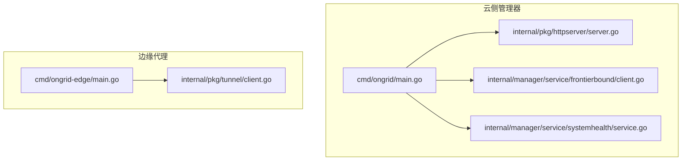
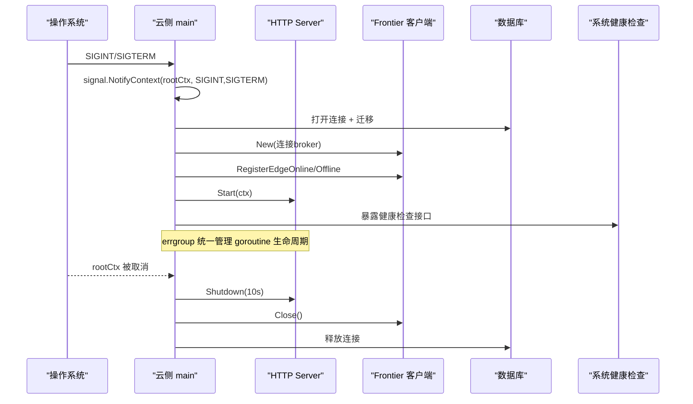
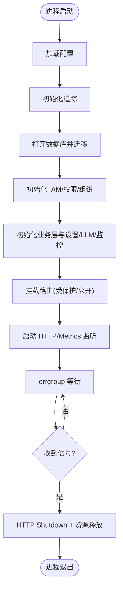
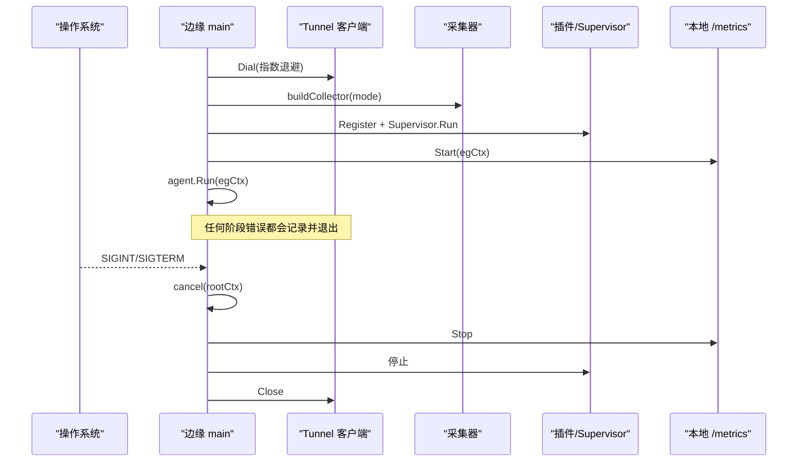
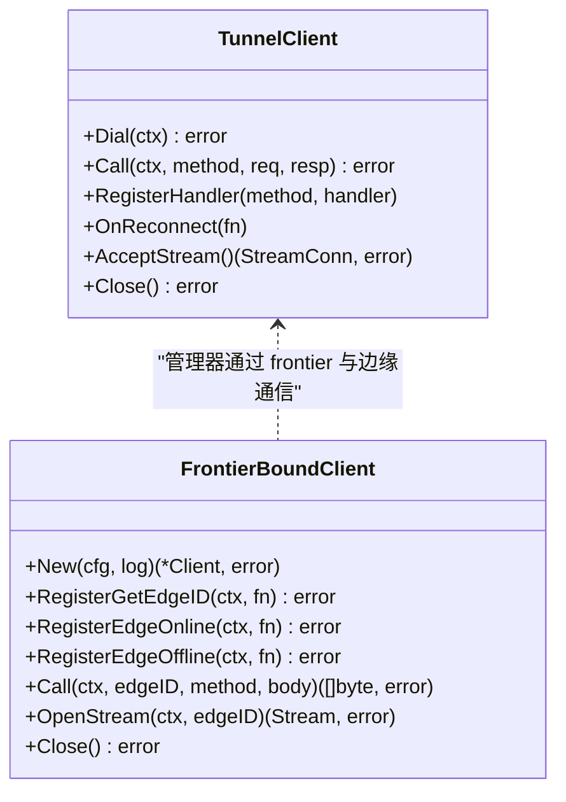
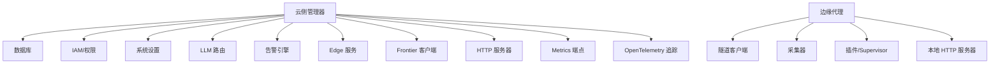

# 服务生命周期管理

<cite>
**本文引用的文件列表**
- [cmd/ongrid/main.go](file://cmd/ongrid/main.go)
- [cmd/ongrid-edge/main.go](file://cmd/ongrid-edge/main.go)
- [internal/pkg/httpserver/server.go](file://internal/pkg/httpserver/server.go)
- [internal/pkg/tunnel/client.go](file://internal/pkg/tunnel/client.go)
- [internal/manager/service/frontierbound/client.go](file://internal/manager/service/frontierbound/client.go)
- [internal/manager/service/systemhealth/service.go](file://internal/manager/service/systemhealth/service.go)
- [internal/manager/biz/imbridge/stream_supervisor.go](file://internal/manager/biz/imbridge/stream_supervisor.go)
</cite>

## 目录
1. [简介](#简介)
2. [项目结构](#项目结构)
3. [核心组件](#核心组件)
4. [架构总览](#架构总览)
5. [详细组件分析](#详细组件分析)
6. [依赖关系分析](#依赖关系分析)
7. [性能与并发特性](#性能与并发特性)
8. [故障排查指南](#故障排查指南)
9. [结论](#结论)

## 简介
本文件聚焦 OnGrid 服务的生命周期管理，覆盖云侧管理器（cloud manager）与边缘代理（edge agent）的启动流程、优雅关闭和资源清理机制；对比两者在启动差异、依赖初始化与健康检查方面的实现；阐述信号处理、上下文管理与并发控制策略；解释服务间通信的建立与断开、连接池与重试机制；并提供优雅关闭的实践要点、资源泄漏预防与性能监控集成方式。

## 项目结构
OnGrid 包含两个可执行入口：
- 云侧管理器 ongrid：提供 HTTP API、指标端点、与上游 frontier 的长连接，并注册边缘上下线回调与反向调用处理器。
- 边缘代理 ongrid-edge：建立到云的隧道，推送主机指标，注册工具 RPC 处理器，运行插件与采集器。

图示来源
- [cmd/ongrid/main.go:195-2500](file://cmd/ongrid/main.go#L195-L2500)
- [internal/pkg/httpserver/server.go:1-60](file://internal/pkg/httpserver/server.go#L1-L60)
- [internal/manager/service/frontierbound/client.go:1-311](file://internal/manager/service/frontierbound/client.go#L1-L311)
- [internal/manager/service/systemhealth/service.go:1-443](file://internal/manager/service/systemhealth/service.go#L1-L443)
- [cmd/ongrid-edge/main.go:56-314](file://cmd/ongrid-edge/main.go#L56-L314)
- [internal/pkg/tunnel/client.go:1-379](file://internal/pkg/tunnel/client.go#L1-L379)

章节来源
- [cmd/ongrid/main.go:195-2500](file://cmd/ongrid/main.go#L195-L2500)
- [cmd/ongrid-edge/main.go:56-314](file://cmd/ongrid-edge/main.go#L56-L314)

## 核心组件
- 云侧管理器主流程：加载配置、初始化日志与追踪、打开数据库并执行迁移、构建 IAM 与业务层、注册路由、启动 HTTP 与 Metrics 监听、通过 errgroup 统一生命周期管理。
- 边缘代理主流程：解析参数与配置、创建隧道客户端、根据模式构建采集器、注册各类能力与插件、启动本地 /metrics 与健康端点、以 errgroup 协调所有子任务。
- HTTP 服务器封装：基于父上下文取消触发 Shutdown，带超时保护，保证请求优雅结束。
- 隧道客户端（边缘→云）：指数退避重连、自动重新注册处理器、错误驱动的重连触发与回调。
- 前端边界客户端（管理器→frontier）：注册边缘上下线回调、反向调用处理器、流式通道。
- 系统健康检查：聚合数据库、Prometheus、Grafana、Loki、Tempo、Qdrant、Frontier、告警引擎、Edge 在线状态等探针结果。

章节来源
- [cmd/ongrid/main.go:195-2500](file://cmd/ongrid/main.go#L195-L2500)
- [cmd/ongrid-edge/main.go:56-314](file://cmd/ongrid-edge/main.go#L56-L314)
- [internal/pkg/httpserver/server.go:1-60](file://internal/pkg/httpserver/server.go#L1-L60)
- [internal/pkg/tunnel/client.go:1-379](file://internal/pkg/tunnel/client.go#L1-L379)
- [internal/manager/service/frontierbound/client.go:1-311](file://internal/manager/service/frontierbound/client.go#L1-L311)
- [internal/manager/service/systemhealth/service.go:1-443](file://internal/manager/service/systemhealth/service.go#L1-L443)

## 架构总览
下图展示云侧与边缘侧的生命周期关键路径：信号→上下文→errgroup→各子系统启动/停止；以及服务间通信的建立与断开。

图示来源
- [cmd/ongrid/main.go:195-2500](file://cmd/ongrid/main.go#L195-L2500)
- [internal/pkg/httpserver/server.go:1-60](file://internal/pkg/httpserver/server.go#L1-L60)
- [internal/manager/service/frontierbound/client.go:1-311](file://internal/manager/service/frontierbound/client.go#L1-L311)
- [internal/manager/service/systemhealth/service.go:1-443](file://internal/manager/service/systemhealth/service.go#L1-L443)

## 详细组件分析

### 云侧管理器启动流程与优雅关闭
- 信号与上下文：使用 signal.NotifyContext 将 SIGINT/SIGTERM 映射为 rootCtx 取消，确保所有子任务感知退出。
- 依赖初始化顺序：
  - 日志与追踪初始化（OpenTelemetry），并在 defer 中设置超时关闭。
  - 数据库连接与迁移（按包顺序执行）。
  - IAM 与权限体系初始化（含默认组织与成员回填）。
  - 系统设置、LLM 多提供商路由、知识库、监控面板同步等。
  - 注册 HTTP 路由（受保护与公开）、Metrics 监听。
- 并发控制：errgroup.WithContext(rootCtx) 管理 API 与 Metrics 监听；任一错误导致 Wait 返回，配合根上下文取消实现整体退出。
- 优雅关闭：HTTP 服务器封装在 ctx 取消后调用 Shutdown（10s 超时），其他资源（如追踪导出器、数据库连接）在 defer 中有序释放。

图示来源
- [cmd/ongrid/main.go:195-2500](file://cmd/ongrid/main.go#L195-L2500)
- [internal/pkg/httpserver/server.go:1-60](file://internal/pkg/httpserver/server.go#L1-L60)

章节来源
- [cmd/ongrid/main.go:195-2500](file://cmd/ongrid/main.go#L195-L2500)
- [internal/pkg/httpserver/server.go:1-60](file://internal/pkg/httpserver/server.go#L1-L60)

### 边缘代理启动流程与优雅关闭
- 参数与配置：支持 --version/--help 快速输出，避免阻塞启动。
- 隧道客户端：NewClient 构造，Dial 指数退避重连，失败时持续重试直至成功或上下文取消。
- 采集器构建：根据 collector_mode 选择 embedded/scrape/composite/noop 模式，必要时启动 scraper 协程。
- 能力注册：host_files、restart_service、bash、webshell 等插件按需注册，失败不阻断启动。
- 本地监控：/metrics 与 /healthz 独立监听，便于调试与编排探测。
- 插件与 Supervisor：插件配置从隧道拉取，失败回退到环境变量；Supervisor 负责生命周期与重启。
- 优雅关闭：agent.Run 完成后 cancel rootCtx，errgroup.Wait 等待所有协程退出，确保 systemd 能完成升级替换。

图示来源
- [cmd/ongrid-edge/main.go:56-314](file://cmd/ongrid-edge/main.go#L56-L314)
- [internal/pkg/tunnel/client.go:1-379](file://internal/pkg/tunnel/client.go#L1-L379)

章节来源
- [cmd/ongrid-edge/main.go:56-314](file://cmd/ongrid-edge/main.go#L56-L314)
- [internal/pkg/tunnel/client.go:1-379](file://internal/pkg/tunnel/client.go#L1-L379)

### 云端管理器与边缘代理的启动差异
- 启动目标不同：
  - 云侧：对外暴露 HTTP API、指标、健康检查，维护与 frontier 的长连接，注册边缘上下线回调。
  - 边缘侧：对内暴露 /metrics 与 /healthz，建立到云的隧道，周期性推送指标，注册工具 RPC。
- 依赖初始化差异：
  - 云侧需初始化数据库、IAM、权限、LLM 路由、监控面板同步等复杂依赖。
  - 边缘侧主要依赖隧道客户端与采集器，插件可选且容错。
- 健康检查差异：
  - 云侧提供系统健康检查聚合（数据库、Prometheus、Grafana、Loki、Tempo、Qdrant、Frontier、告警引擎、Edge 在线状态）。
  - 边缘侧提供轻量 /healthz 与 /metrics，用于编排探测与调试。

章节来源
- [cmd/ongrid/main.go:195-2500](file://cmd/ongrid/main.go#L195-L2500)
- [cmd/ongrid-edge/main.go:56-314](file://cmd/ongrid-edge/main.go#L56-L314)
- [internal/manager/service/systemhealth/service.go:1-443](file://internal/manager/service/systemhealth/service.go#L1-L443)

### 信号处理、上下文管理与并发控制
- 信号处理：
  - 云侧与边缘侧均使用 signal.NotifyContext 将 SIGINT/SIGTERM 转换为上下文取消。
- 上下文管理：
  - rootCtx 贯穿整个进程，所有子任务（HTTP、Metrics、插件、采集器、隧道）共享该上下文。
  - 子任务内部可使用 WithTimeout/WithCancel 进行细粒度控制。
- 并发控制：
  - 云侧使用 errgroup 管理 HTTP 与 Metrics 监听，任一错误立即终止。
  - 边缘侧使用 errgroup 管理 metrics 服务器、agent.Run、插件 Supervisor 等。
  - 流式桥接（IM Bridge）使用 StreamSupervisor 管理每个 provider 的长连接，具备指数退避与优雅停止。

章节来源
- [cmd/ongrid/main.go:195-2500](file://cmd/ongrid/main.go#L195-L2500)
- [cmd/ongrid-edge/main.go:56-314](file://cmd/ongrid-edge/main.go#L56-L314)
- [internal/manager/biz/imbridge/stream_supervisor.go:34-201](file://internal/manager/biz/imbridge/stream_supervisor.go#L34-L201)

### 服务间通信的建立与断开、连接池与重试
- 边缘→云（tunnel.Client）：
  - Dial 指数退避（1s→...→60s 上限），首次成功后由底层 RetryEnd 处理断线重连。
  - Call 检测到“路由失效”类错误时异步触发重连，并重试 OnReconnect 回调。
  - RegisterHandler 支持在 Dial 前后注册，重连后自动重新注册。
- 云→frontier（frontierbound.Client）：
  - New 建立与服务端的连接，RegisterGetEdgeID/EdgeOnline/EdgeOffline 注册生命周期回调。
  - Call/OpenStream 对特定 edgeID 发起调用或流式通道，Close 释放连接。
  - 支持 NewDisabled 降级模式，便于测试与恢复场景。

图示来源
- [internal/pkg/tunnel/client.go:1-379](file://internal/pkg/tunnel/client.go#L1-L379)
- [internal/manager/service/frontierbound/client.go:1-311](file://internal/manager/service/frontierbound/client.go#L1-L311)

章节来源
- [internal/pkg/tunnel/client.go:1-379](file://internal/pkg/tunnel/client.go#L1-L379)
- [internal/manager/service/frontierbound/client.go:1-311](file://internal/manager/service/frontierbound/client.go#L1-L311)

### 健康检查与就绪性
- 云侧系统健康检查：
  - 聚合多项探针：数据库 Ping、Prometheus 查询、Grafana 测试、Loki/Tempo 可达性、Qdrant 集合访问、Frontier 启用状态、告警引擎规则与未决事件计数、Edge 在线状态采样、LLM 提供商解析。
  - 每项检查带超时与详情字段，汇总为 OK/Degraded/Failed/Unknown。
- 边缘侧健康检查：
  - /healthz 返回 ok，/metrics 暴露 Prometheus 指标，便于编排探测与调试。

章节来源
- [internal/manager/service/systemhealth/service.go:1-443](file://internal/manager/service/systemhealth/service.go#L1-L443)
- [cmd/ongrid-edge/main.go:170-177](file://cmd/ongrid-edge/main.go#L170-L177)

### 优雅关闭实践要点与资源泄漏预防
- 云侧：
  - 使用 defer 关闭追踪导出器，设置合理超时，避免阻塞退出。
  - HTTP 服务器封装在 ctx 取消后调用 Shutdown，带 10s 超时，确保正在处理的请求优雅结束。
  - 数据库连接在进程退出前释放（由 dbx 层管理）。
- 边缘侧：
  - agent.Run 完成后主动 cancel rootCtx，确保所有协程（插件、scraper、metrics 服务器）退出。
  - 插件 Supervisor 在 ctx 取消后停止，避免僵尸进程。
  - 隧道 Close 防止后续重连。
- 通用建议：
  - 所有长期运行的 goroutine 必须响应 ctx.Done()。
  - 外部资源（文件句柄、网络连接、子进程）应在 defer 中释放。
  - 避免在退出路径上执行耗时操作，使用超时兜底。

章节来源
- [cmd/ongrid/main.go:195-2500](file://cmd/ongrid/main.go#L195-L2500)
- [cmd/ongrid-edge/main.go:56-314](file://cmd/ongrid-edge/main.go#L56-L314)
- [internal/pkg/httpserver/server.go:1-60](file://internal/pkg/httpserver/server.go#L1-L60)

### 性能监控集成方式
- 云侧：
  - 独立的 /metrics 监听端口，暴露自观测指标（包括 alert evaluator、prom remote_write 等）。
  - OpenTelemetry 追踪初始化，上报至 Tempo，支撑 trace_latency/trace_error_rate 评估。
- 边缘侧：
  - 本地 /metrics 监听，暴露插件与采集器相关指标，便于调试与问题定位。

章节来源
- [cmd/ongrid/main.go:195-2500](file://cmd/ongrid/main.go#L195-L2500)
- [cmd/ongrid-edge/main.go:170-177](file://cmd/ongrid-edge/main.go#L170-L177)

## 依赖关系分析
- 云侧管理器依赖：
  - 数据库（dbx）、IAM（用户/组织/成员/权限）、系统设置、LLM 多提供商路由、监控面板同步、审计日志、告警引擎、Edge 服务、Frontier 客户端、HTTP 服务器、Metrics 端点、OpenTelemetry 追踪。
- 边缘代理依赖：
  - 隧道客户端（geminio）、采集器（embedded/scrape/composite）、插件（logs/audit/traces/metrics/custommetrics/databasemetrics/hostmetrics/procmetrics）、Supervisor、本地 HTTP 服务器。

图示来源
- [cmd/ongrid/main.go:195-2500](file://cmd/ongrid/main.go#L195-L2500)
- [cmd/ongrid-edge/main.go:56-314](file://cmd/ongrid-edge/main.go#L56-L314)

章节来源
- [cmd/ongrid/main.go:195-2500](file://cmd/ongrid/main.go#L195-L2500)
- [cmd/ongrid-edge/main.go:56-314](file://cmd/ongrid-edge/main.go#L56-L314)

## 性能与并发特性
- 指数退避与重连：
  - 隧道客户端 Dial 采用指数退避（上限 60s），Call 错误检测触发异步重连，减少风暴与抖动。
- 并发控制：
  - errgroup 统一管理 goroutine，避免孤儿协程与资源泄漏。
  - StreamSupervisor 对每个 provider 的长连接进行生命周期管理，具备指数退避与优雅停止。
- 健康检查与探针：
  - 系统健康检查带超时与详情，有助于快速定位瓶颈与退化状态。
- 指标与追踪：
  - 独立的 /metrics 与 OpenTelemetry 追踪，便于性能分析与容量规划。

[本节为通用指导，无需具体文件引用]

## 故障排查指南
- 启动失败：
  - 检查配置加载与必要环境变量（JWT Secret、数据库连接、Frontier 地址等）。
  - 查看日志中的迁移与初始化错误（IAM、权限、默认组织等）。
- 健康检查异常：
  - 逐项检查数据库 Ping、Prometheus 查询、Grafana 测试、Loki/Tempo 可达性、Qdrant 集合访问、Frontier 启用状态、告警引擎规则与未决事件计数、Edge 在线状态。
- 连接问题：
  - 隧道客户端 Dial 失败会持续重试，关注日志中的 backoff 与错误信息。
  - 云侧 Frontier 客户端连接失败时，确认服务名与地址配置正确。
- 优雅关闭问题：
  - 确认 HTTP 服务器 Shutdown 是否超时，检查是否有长时间请求未结束。
  - 检查插件 Supervisor 与采集器是否在 ctx 取消后正常退出。

章节来源
- [internal/manager/service/systemhealth/service.go:1-443](file://internal/manager/service/systemhealth/service.go#L1-L443)
- [internal/pkg/tunnel/client.go:1-379](file://internal/pkg/tunnel/client.go#L1-L379)
- [internal/manager/service/frontierbound/client.go:1-311](file://internal/manager/service/frontierbound/client.go#L1-L311)
- [internal/pkg/httpserver/server.go:1-60](file://internal/pkg/httpserver/server.go#L1-L60)

## 结论
OnGrid 的服务生命周期管理以信号与上下文为核心，结合 errgroup 与封装的 HTTP 服务器实现优雅关闭；云侧与边缘侧在启动目标、依赖初始化与健康检查方面各有侧重；隧道与 frontier 客户端提供了可靠的连接与重试机制；系统健康检查与指标/追踪集成为运维提供了全面的可观测性。遵循本文的最佳实践可有效预防资源泄漏、提升稳定性与可维护性。