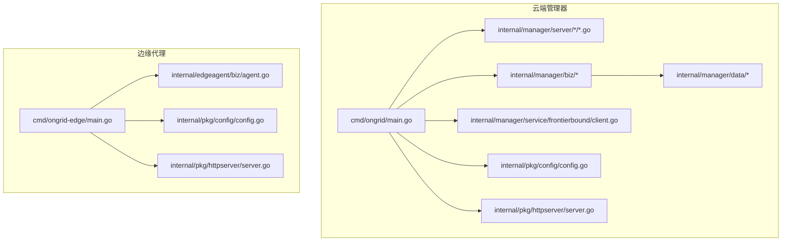
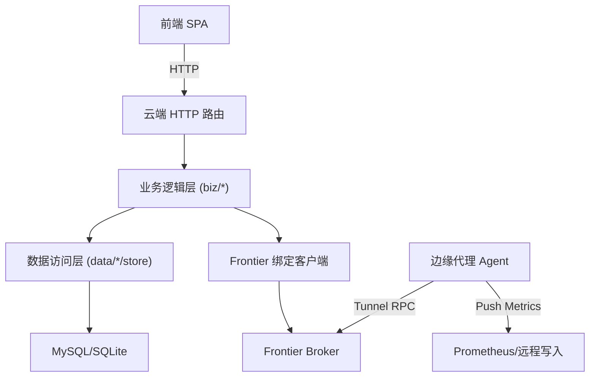
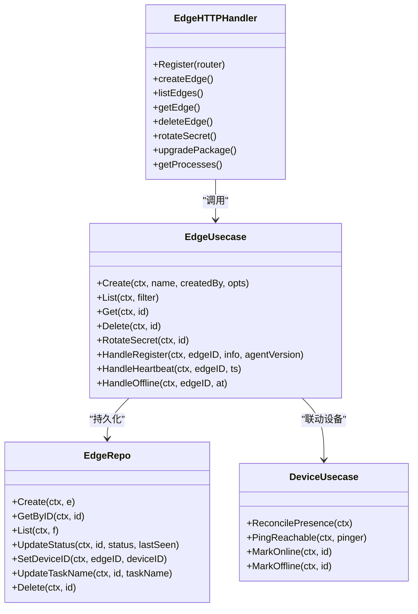
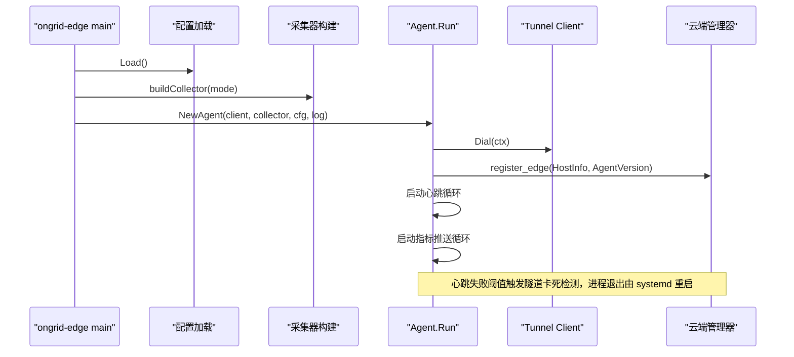
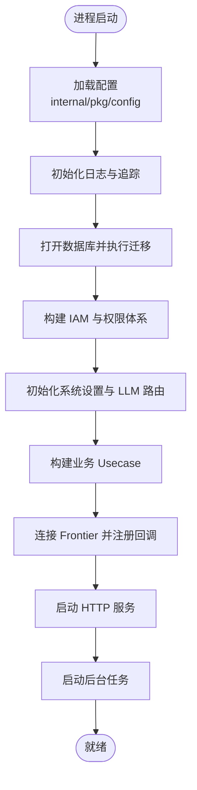
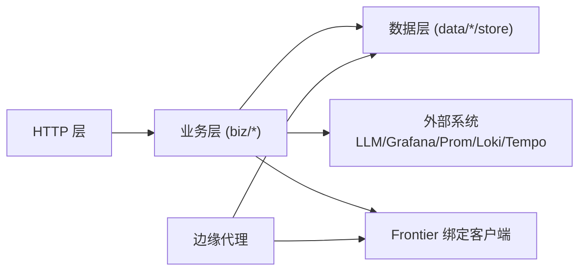

# 服务设计与架构

<cite>
**本文引用的文件**   
- [cmd/ongrid/main.go](file://cmd/ongrid/main.go)
- [cmd/ongrid-edge/main.go](file://cmd/ongrid-edge/main.go)
- [internal/pkg/config/config.go](file://internal/pkg/config/config.go)
- [internal/pkg/httpserver/server.go](file://internal/pkg/httpserver/server.go)
- [internal/manager/service/frontierbound/client.go](file://internal/manager/service/frontierbound/client.go)
- [internal/manager/biz/device/usecase.go](file://internal/manager/biz/device/usecase.go)
- [internal/manager/biz/edge/usecase.go](file://internal/manager/biz/edge/usecase.go)
- [internal/manager/server/edge/http.go](file://internal/manager/server/edge/http.go)
- [internal/manager/data/edge/store/edge.go](file://internal/manager/data/edge/store/edge.go)
- [internal/edgeagent/biz/agent.go](file://internal/edgeagent/biz/agent.go)
</cite>

## 目录
1. [引言](#引言)
2. [项目结构](#项目结构)
3. [核心组件](#核心组件)
4. [架构总览](#架构总览)
5. [详细组件分析](#详细组件分析)
6. [依赖关系分析](#依赖关系分析)
7. [性能考量](#性能考量)
8. [故障排查指南](#故障排查指南)
9. [结论](#结论)
10. [附录](#附录)

## 引言
本文件系统化阐述 OnGrid 微服务的云端管理器与边缘代理的设计与实现，重点覆盖：
- 云端管理器的分层架构（HTTP 层、业务逻辑层、数据访问层）职责分离
- 边缘代理的服务设计、生命周期管理与优雅关闭
- 模块化边界划分（设备管理、告警处理、AI 运维等）
- 初始化顺序、配置管理与依赖解析
- 架构图、模块依赖图与启动时序图
- 错误处理策略、日志记录与监控指标收集

## 项目结构
OnGrid 采用“命令入口 + 内部包”的 Go 工程组织方式。云端管理器与边缘代理各自拥有独立的可执行程序入口，共享通用能力（配置、HTTP 服务器封装、Tunnel 客户端等）。

图表来源
- [cmd/ongrid/main.go:1-200](file://cmd/ongrid/main.go#L1-L200)
- [cmd/ongrid-edge/main.go:1-120](file://cmd/ongrid-edge/main.go#L1-L120)
- [internal/pkg/config/config.go:1-120](file://internal/pkg/config/config.go#L1-L120)
- [internal/pkg/httpserver/server.go:1-60](file://internal/pkg/httpserver/server.go#L1-L60)
- [internal/manager/service/frontierbound/client.go:1-120](file://internal/manager/service/frontierbound/client.go#L1-L120)

章节来源
- [cmd/ongrid/main.go:1-200](file://cmd/ongrid/main.go#L1-L200)
- [cmd/ongrid-edge/main.go:1-120](file://cmd/ongrid-edge/main.go#L1-L120)
- [internal/pkg/config/config.go:1-120](file://internal/pkg/config/config.go#L1-L120)
- [internal/pkg/httpserver/server.go:1-60](file://internal/pkg/httpserver/server.go#L1-L60)
- [internal/manager/service/frontierbound/client.go:1-120](file://internal/manager/service/frontierbound/client.go#L1-L120)

## 核心组件
- 云端管理器主流程
  - 加载配置、初始化日志与追踪、打开数据库并执行迁移、构建 IAM 与权限体系、初始化系统设置与 LLM 多提供商路由、注册 HTTP 路由、连接前端网关（frontier）并注册反向调用处理器、启动后台任务（如可达性探测、告警评估、遥测写入等）。
- 边缘代理主流程
  - 加载配置、创建 Tunnel 客户端、根据模式构建采集器、注册云到边 RPC 处理器、运行心跳与指标推送循环、插件监管与热重载、健康探针与 /metrics 端点。
- 配置中心
  - 统一从环境变量加载，提供默认值与类型转换工具，支撑云端与边缘两套二进制。
- HTTP 服务器封装
  - 基于 net/http.Server 的优雅关停封装，支持父上下文取消触发 Shutdown。
- Frontier 绑定客户端
  - 封装与上游 broker 的连接、方法注册、Edge 生命周期回调、流式通道建立与 edgeID 映射。

章节来源
- [cmd/ongrid/main.go:195-800](file://cmd/ongrid/main.go#L195-L800)
- [cmd/ongrid-edge/main.go:56-180](file://cmd/ongrid-edge/main.go#L56-L180)
- [internal/pkg/config/config.go:366-486](file://internal/pkg/config/config.go#L366-L486)
- [internal/pkg/httpserver/server.go:19-60](file://internal/pkg/httpserver/server.go#L19-L60)
- [internal/manager/service/frontierbound/client.go:60-126](file://internal/manager/service/frontierbound/client.go#L60-L126)

## 架构总览
OnGrid 采用“云端管理器 + 边缘代理 + 前置网关（Frontier）”的分层架构。云端通过 HTTP API 暴露管理能力，并通过 Frontier 与边缘建立长连接；边缘侧负责采集、上报与执行云端下发的指令。

图表来源
- [cmd/ongrid/main.go:195-800](file://cmd/ongrid/main.go#L195-L800)
- [internal/manager/server/edge/http.go:130-163](file://internal/manager/server/edge/http.go#L130-L163)
- [internal/manager/biz/edge/usecase.go:337-480](file://internal/manager/biz/edge/usecase.go#L337-L480)
- [internal/manager/data/edge/store/edge.go:88-126](file://internal/manager/data/edge/store/edge.go#L88-L126)
- [internal/manager/service/frontierbound/client.go:128-190](file://internal/manager/service/frontierbound/client.go#L128-L190)
- [internal/edgeagent/biz/agent.go:150-232](file://internal/edgeagent/biz/agent.go#L150-L232)

## 详细组件分析

### 云端管理器分层架构
- HTTP 层
  - 路由注册、请求校验、鉴权中间件注入、DTO 编解码、错误码映射。以边缘子域为例，提供创建/查询/删除/升级/插件管理等接口。
- 业务逻辑层
  - 用例编排、跨表关联、状态机流转、外部系统交互（LLM、Grafana、Prometheus、通知渠道等），以及周期性任务协调。
- 数据访问层
  - GORM Repo 实现，软删除、分页、条件查询、字段更新、迁移脚本集成。

图表来源
- [internal/manager/server/edge/http.go:130-163](file://internal/manager/server/edge/http.go#L130-L163)
- [internal/manager/biz/edge/usecase.go:149-222](file://internal/manager/biz/edge/usecase.go#L149-L222)
- [internal/manager/data/edge/store/edge.go:30-126](file://internal/manager/data/edge/store/edge.go#L30-L126)
- [internal/manager/biz/device/usecase.go:147-164](file://internal/manager/biz/device/usecase.go#L147-L164)

章节来源
- [internal/manager/server/edge/http.go:130-163](file://internal/manager/server/edge/http.go#L130-L163)
- [internal/manager/biz/edge/usecase.go:149-222](file://internal/manager/biz/edge/usecase.go#L149-L222)
- [internal/manager/data/edge/store/edge.go:30-126](file://internal/manager/data/edge/store/edge.go#L30-L126)
- [internal/manager/biz/device/usecase.go:147-164](file://internal/manager/biz/device/usecase.go#L147-L164)

### 边缘代理服务设计与生命周期
- 启动流程
  - 解析命令行参数、加载配置、初始化日志与指标、构建采集器、注册云到边处理器、创建 Agent 并运行。
- 依赖注入
  - 通过构造函数注入 tunnel.Client、Collector、Config 与 Logger；插件与 Supervisor 在运行时装配。
- 生命周期
  - Run 驱动注册、拨号、register_edge、心跳与指标推送循环；监听升级信号后优雅退出，交由 systemd 完成二进制替换。

图表来源
- [cmd/ongrid-edge/main.go:56-180](file://cmd/ongrid-edge/main.go#L56-L180)
- [internal/edgeagent/biz/agent.go:150-232](file://internal/edgeagent/biz/agent.go#L150-L232)

章节来源
- [cmd/ongrid-edge/main.go:56-180](file://cmd/ongrid-edge/main.go#L56-L180)
- [internal/edgeagent/biz/agent.go:150-232](file://internal/edgeagent/biz/agent.go#L150-L232)

### 服务初始化顺序与依赖解析
- 云端管理器初始化顺序（关键步骤）
  - 加载配置 → 初始化日志与追踪 → 打开数据库并执行迁移 → 构建 IAM（用户/组织/成员/Casbin）→ 初始化系统设置与 LLM 多提供商路由 → 构建各业务 Usecase 与 Server → 连接 Frontier 并注册反向调用 → 启动后台任务与 HTTP 服务。
- 配置管理
  - 所有配置项通过环境变量加载，提供默认值与类型转换；敏感字段（JWT Secret、OpenAI Key 等）有安全提示或首次引导。
- 依赖解析
  - 通过显式构造与接口注入，避免循环依赖；例如 Edge Usecase 通过 NodeMirror 接口桥接拓扑模块。

图表来源
- [cmd/ongrid/main.go:195-800](file://cmd/ongrid/main.go#L195-L800)
- [internal/pkg/config/config.go:366-486](file://internal/pkg/config/config.go#L366-L486)

章节来源
- [cmd/ongrid/main.go:195-800](file://cmd/ongrid/main.go#L195-L800)
- [internal/pkg/config/config.go:366-486](file://internal/pkg/config/config.go#L366-L486)

### 模块化设计原则与边界划分
- 设备管理
  - 负责设备元数据、SSH 凭据、可达性探测、角色分类与存在性修复；与 Edge 通过 junction 表进行多对多关联。
- 告警处理
  - 内置主机监控规则评估、冷却抑制、事件存储与通知分发；与 Prometheus 远写和查询集成。
- AI 运维
  - 多提供商 LLM 路由、会话与图谱、调查者工作流、工具注册与回放；通过系统设置动态切换模型与密钥。
- 插件生态
  - 云端下发插件配置，边缘侧插件监管器按配置拉起子进程或内嵌采集器，心跳上报健康快照。

章节来源
- [internal/manager/biz/device/usecase.go:147-164](file://internal/manager/biz/device/usecase.go#L147-L164)
- [internal/manager/biz/edge/usecase.go:224-263](file://internal/manager/biz/edge/usecase.go#L224-L263)
- [cmd/ongrid/main.go:532-727](file://cmd/ongrid/main.go#L532-L727)
- [cmd/ongrid-edge/main.go:199-305](file://cmd/ongrid-edge/main.go#L199-L305)

### 错误处理策略、日志与监控
- 错误处理
  - HTTP 层统一错误码映射；业务层返回领域错误；数据层透传底层错误以便上层判断。
- 日志记录
  - 使用结构化日志（slog），为每个组件附加标签；关键路径（注册、心跳、指标推送、插件健康）均有日志输出。
- 监控指标
  - 共享 Prometheus Registry；云端自观测指标（评估延迟、远写结果）、边缘本地 /metrics 与健康探针。

章节来源
- [internal/manager/server/edge/http.go:754-762](file://internal/manager/server/edge/http.go#L754-L762)
- [cmd/ongrid/main.go:393-399](file://cmd/ongrid/main.go#L393-L399)
- [cmd/ongrid-edge/main.go:169-177](file://cmd/ongrid-edge/main.go#L169-L177)

## 依赖关系分析
- 组件耦合与内聚
  - HTTP 层仅依赖 Service/Usecase 接口，保持低耦合；Usecase 聚合多个 Repo 与外部客户端；Repo 专注数据访问。
- 直接/间接依赖
  - 云端管理器依赖 Frontier 绑定客户端、LLM 路由器、Grafana/Prom/Loki/Tempo 客户端；边缘代理依赖 Tunnel 客户端与插件监管器。
- 潜在循环依赖
  - 通过接口解耦（如 NodeMirror、PluginConfigSeeder）避免 biz 层之间的直接导入。
- 外部依赖与集成点
  - 数据库（MySQL/SQLite）、Frontier Broker、TSDB（Prometheus）、日志（Loki）、链路（Tempo）、IM/Webhook 通知。

图表来源
- [internal/manager/server/edge/http.go:130-163](file://internal/manager/server/edge/http.go#L130-L163)
- [internal/manager/biz/edge/usecase.go:337-480](file://internal/manager/biz/edge/usecase.go#L337-L480)
- [internal/manager/data/edge/store/edge.go:88-126](file://internal/manager/data/edge/store/edge.go#L88-L126)
- [internal/manager/service/frontierbound/client.go:128-190](file://internal/manager/service/frontierbound/client.go#L128-L190)
- [internal/edgeagent/biz/agent.go:150-232](file://internal/edgeagent/biz/agent.go#L150-L232)

章节来源
- [internal/manager/server/edge/http.go:130-163](file://internal/manager/server/edge/http.go#L130-L163)
- [internal/manager/biz/edge/usecase.go:337-480](file://internal/manager/biz/edge/usecase.go#L337-L480)
- [internal/manager/data/edge/store/edge.go:88-126](file://internal/manager/data/edge/store/edge.go#L88-L126)
- [internal/manager/service/frontierbound/client.go:128-190](file://internal/manager/service/frontierbound/client.go#L128-L190)
- [internal/edgeagent/biz/agent.go:150-232](file://internal/edgeagent/biz/agent.go#L150-L232)

## 性能考量
- 指标推送双路径
  - 快速路径（单点 HostMetricPoint）与开放集路径（PromSamples）并行推送，失败不阻塞下一轮采样。
- 心跳与隧道卡死检测
  - 连续失败阈值触发进程退出，借助 systemd 自动重启恢复。
- 批量与限流
  - 指标批大小可配；Prom 远写与查询 URL 可分离；TLS 与 CA 可配置以适应不同部署环境。
- 资源隔离
  - 插件以子进程形式运行，Supervisor 负责健康与重启；边缘本地 /metrics 与云端 /metrics 端口分离便于调试。

章节来源
- [internal/edgeagent/biz/agent.go:445-530](file://internal/edgeagent/biz/agent.go#L445-L530)
- [internal/edgeagent/biz/agent.go:392-443](file://internal/edgeagent/biz/agent.go#L392-L443)
- [internal/pkg/config/config.go:206-230](file://internal/pkg/config/config.go#L206-L230)
- [cmd/ongrid-edge/main.go:169-177](file://cmd/ongrid-edge/main.go#L169-L177)

## 故障排查指南
- 常见问题定位
  - 配置缺失或默认不安全（如 JWT Secret）导致启动拒绝；数据库迁移失败；Frontier 连接超时；插件未启用或子进程崩溃。
- 日志与追踪
  - 检查组件级 slog 日志；开启 OTel 追踪以定位跨服务调用问题；查看边缘本地 /healthz 与 /metrics。
- 回滚与自愈
  - 边缘升级健康标记用于下次启动时判定是否回滚；心跳卡死检测触发进程重启。

章节来源
- [cmd/ongrid/main.go:283-300](file://cmd/ongrid/main.go#L283-L300)
- [cmd/ongrid/main.go:251-276](file://cmd/ongrid/main.go#L251-L276)
- [internal/manager/service/frontierbound/client.go:60-89](file://internal/manager/service/frontierbound/client.go#L60-L89)
- [internal/edgeagent/biz/agent.go:245-264](file://internal/edgeagent/biz/agent.go#L245-L264)
- [cmd/ongrid-edge/main.go:169-177](file://cmd/ongrid-edge/main.go#L169-L177)

## 结论
OnGrid 通过清晰的分层与模块化设计，实现了云端管理与边缘协同的高效架构。云端以 HTTP 层对外暴露能力，业务层编排复杂流程，数据层专注持久化；边缘以轻量 Agent 承载采集与执行，配合插件生态扩展能力。统一的配置管理、完善的错误处理与可观测性保障，使得系统在大规模部署下具备高可用与易维护性。

## 附录
- 关键环境变量参考
  - 云端：ONGRID_HTTP_ADDR、ONGRID_METRICS_ADDR、ONGRID_DB_DIALECT、ONGRID_JWT_SECRET、ONGRID_PROM_ENABLED、ONGRID_GRAFANA_INTERNAL_URL、ONGRID_LOG_QUERY_URL、ONGRID_TRACE_QUERY_URL、ONGRID_FRONTIER_ADDR、ONGRID_FRONTIER_DISABLED、ONGRID_FRONTIER_WARMUP 等
  - 边缘：ONGRID_EDGE_CLOUD_ADDR、ONGRID_EDGE_ACCESS_KEY、ONGRID_EDGE_SECRET_KEY、ONGRID_EDGE_COLLECTOR_MODE、ONGRID_EDGE_SCRAPE_CONFIG_FILE、ONGRID_EDGE_COLLECTOR_INTERVAL 等

章节来源
- [internal/pkg/config/config.go:366-486](file://internal/pkg/config/config.go#L366-L486)