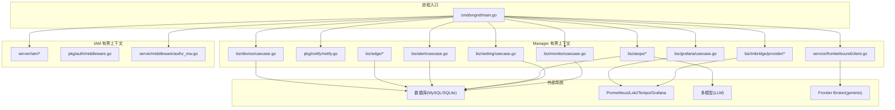
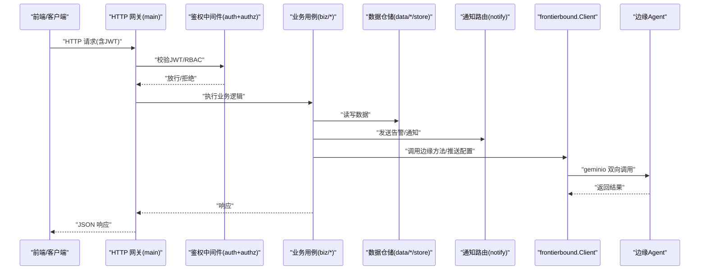
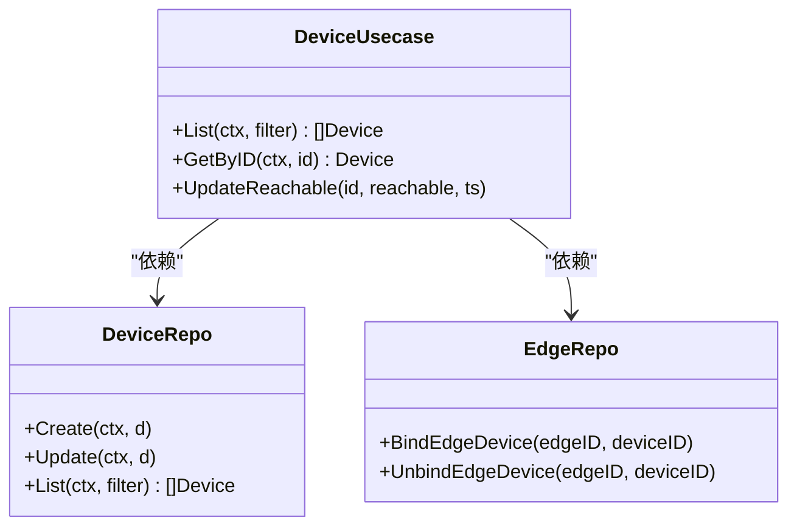
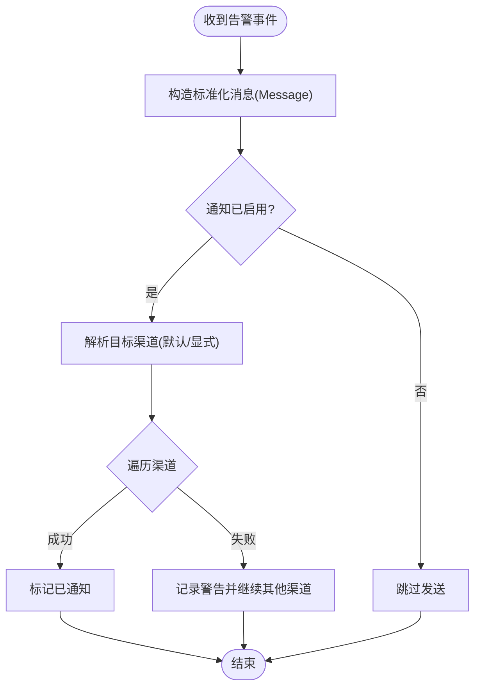
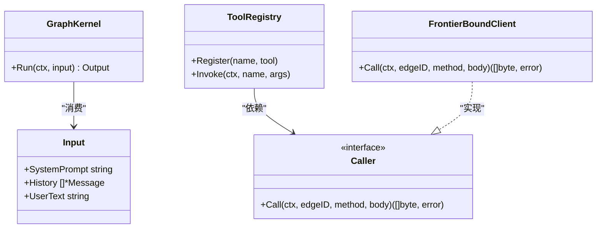
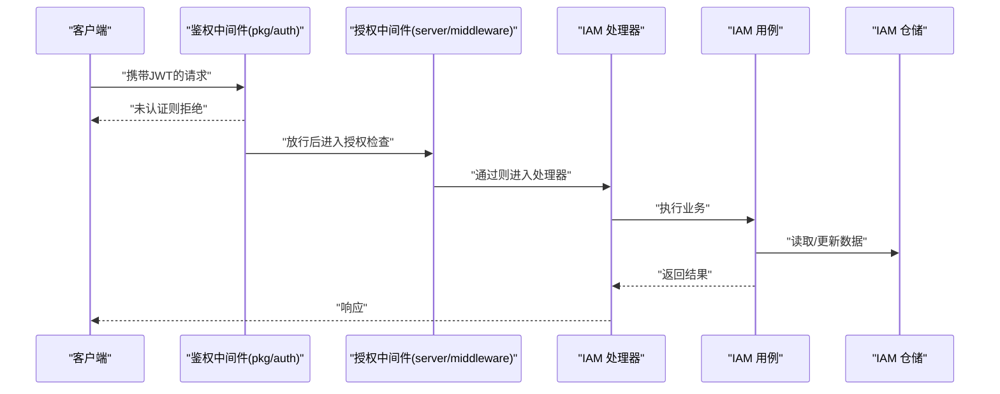
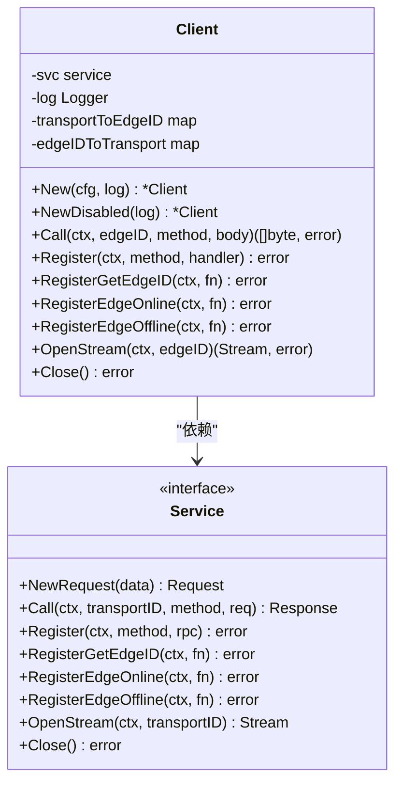
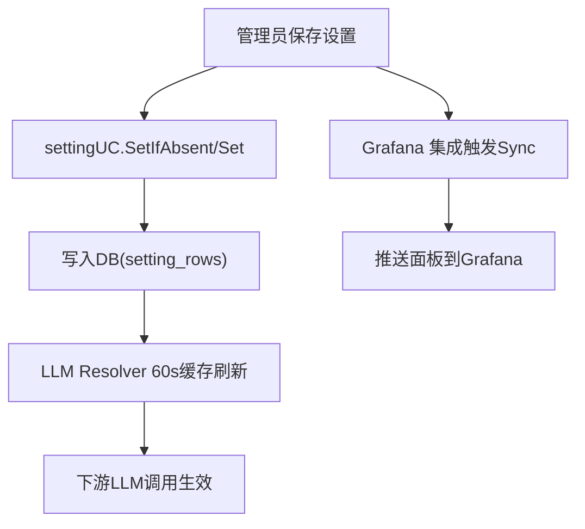
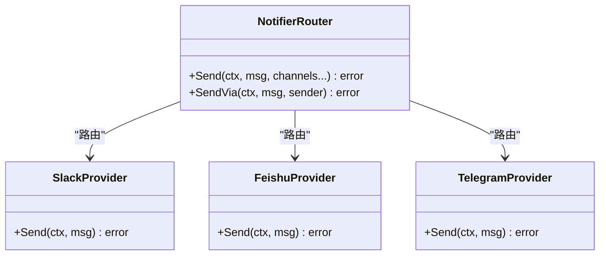
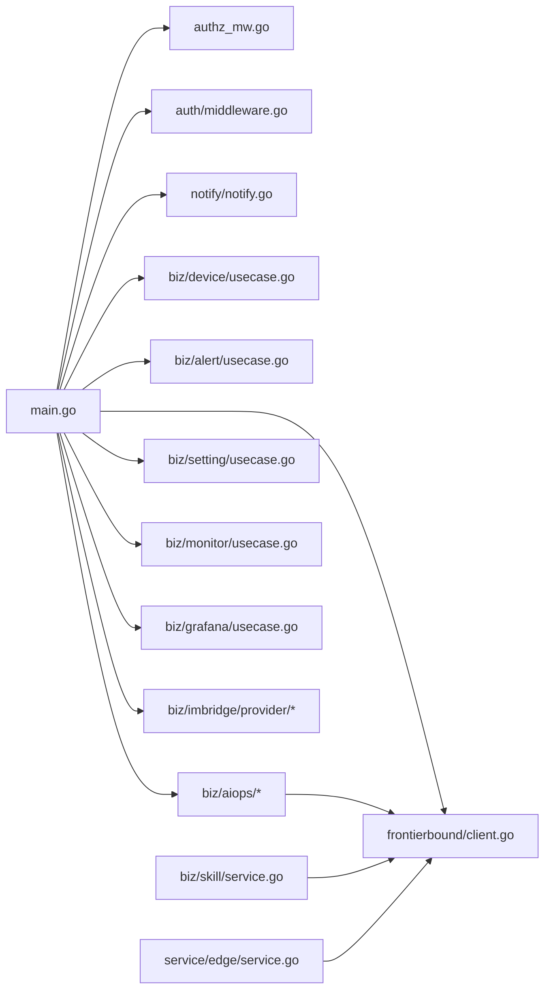

# 模块边界与解耦

<cite>
**本文引用的文件**   
- [cmd/ongrid/main.go](file://cmd/ongrid/main.go)
- [internal/manager/service/frontierbound/client.go](file://internal/manager/service/frontierbound/client.go)
- [internal/pkg/notify/notify.go](file://internal/pkg/notify/notify.go)
- [internal/manager/biz/alert/usecase.go](file://internal/manager/biz/alert/usecase.go)
- [internal/manager/biz/aiops/graph/types.go](file://internal/manager/biz/aiops/graph/types.go)
- [internal/manager/biz/aiops/tools/registry.go](file://internal/manager/biz/aiops/tools/registry.go)
- [internal/manager/service/edge/service.go](file://internal/manager/service/edge/service.go)
- [internal/manager/biz/skill/service.go](file://internal/manager/biz/skill/service.go)
- [api/manager/aiops/v1/aiops.proto](file://api/manager/aiops/v1/aiops.proto)
- [api/manager/alert/v1/alert.proto](file://api/manager/alert/v1/alert.proto)
- [api/iam/v1/iam.proto](file://api/iam/v1/iam.proto)
- [internal/manager/server/middleware/authz_mw.go](file://internal/manager/server/middleware/authz_mw.go)
- [internal/pkg/auth/middleware.go](file://internal/pkg/auth/middleware.go)
- [internal/manager/biz/device/usecase.go](file://internal/manager/biz/device/usecase.go)
- [internal/manager/data/device/store/sqlite/repo.go](file://internal/manager/data/device/store/sqlite/repo.go)
- [internal/manager/data/edge/store/sqlite/repo.go](file://internal/manager/data/edge/store/sqlite/repo.go)
- [internal/manager/biz/setting/usecase.go](file://internal/manager/biz/setting/usecase.go)
- [internal/manager/server/setting/handler.go](file://internal/manager/server/setting/handler.go)
- [internal/manager/biz/grafana/usecase.go](file://internal/manager/biz/grafana/usecase.go)
- [internal/manager/biz/monitor/usecase.go](file://internal/manager/biz/monitor/usecase.go)
- [internal/manager/biz/imbridge/provider/slack/provider.go](file://internal/manager/biz/imbridge/provider/slack/provider.go)
- [internal/manager/biz/imbridge/provider/feishu/provider.go](file://internal/manager/biz/imbridge/provider/feishu/provider.go)
- [internal/manager/biz/imbridge/provider/telegram/provider.go](file://internal/manager/biz/imbridge/provider/telegram/provider.go)
</cite>

## 目录
1. [引言](#引言)
2. [项目结构](#项目结构)
3. [核心组件](#核心组件)
4. [架构总览](#架构总览)
5. [详细组件分析](#详细组件分析)
6. [依赖分析](#依赖分析)
7. [性能考虑](#性能考虑)
8. [故障排查指南](#故障排查指南)
9. [结论](#结论)
10. [附录](#附录)

## 引言
本文件聚焦 OnGrid 控制面（Manager）的模块边界设计与解耦策略，围绕业务域划分、模块间通信协议与接口规范、设备管理/告警处理/AI运维/身份认证等核心模块的职责边界与依赖关系展开。文档同时说明模块化设计如何支撑独立开发、测试与部署，并阐述事件驱动与异步处理模式在系统中的落地方式。为便于读者理解，文中提供面向代码的结构图、时序图与流程图，并在关键处给出“章节来源”以定位到具体源码位置。

## 项目结构
OnGrid 采用清晰的领域分层与有界上下文组织：
- cmd/ongrid：进程入口，负责装配 IAM 与 Manager 两个有界上下文，启动 HTTP API、Prometheus /metrics、以及通过 frontierbound 与边缘 Agent 的双向通道。
- internal/manager：Manager 有界上下文，按 biz/data/server/service/model 分层组织各子域（设备、边缘、告警、AI 运维、设置、监控、IM 桥接等）。
- internal/iam：身份与权限有界上下文，提供用户、组织、成员、授权能力。
- internal/pkg：跨上下文共享的基础设施包（配置、鉴权中间件、通知路由、LLM 客户端、Tunnel 等）。
- api：gRPC/HTTP 契约定义（proto），用于前后端与服务间契约。

图表来源
- [cmd/ongrid/main.go:1-120](file://cmd/ongrid/main.go#L1-L120)
- [internal/manager/service/frontierbound/client.go:1-120](file://internal/manager/service/frontierbound/client.go#L1-L120)
- [internal/pkg/notify/notify.go:1-90](file://internal/pkg/notify/notify.go#L1-L90)

章节来源
- [cmd/ongrid/main.go:1-120](file://cmd/ongrid/main.go#L1-L120)

## 核心组件
- 进程装配器（main）：加载配置、初始化日志/追踪、打开数据库并执行迁移、组装 IAM 与 Manager 各子域服务、注册 HTTP 路由与中间件、启动后台任务（如 Grafana 同步、探针巡检等）。
- 边缘连接层（frontierbound.Client）：封装与 Frontier Broker 的连接、注册反向调用处理器、生命周期回调（上线/下线）、以及从云端主动调用边缘方法。
- 通知路由（notify.Router）：统一消息模型与发送器抽象，支持多通道（Webhook/Slack/飞书/钉钉等），具备超时、默认通道与开关控制。
- 告警用例（alert usecase）：编排告警评估、工单化、通知投递与结果持久化，使用 notify.Router 进行渠道分发。
- AI 运维（aiops graph + tools）：基于 eino 的 ReAct 图执行内核，工具调用经 Caller 抽象（由 frontierbound.Client 实现）下发至边缘执行。
- 身份认证与授权（IAM + 中间件）：JWT 签发/校验、RBAC 策略注入、请求级鉴权中间件。

章节来源
- [cmd/ongrid/main.go:195-420](file://cmd/ongrid/main.go#L195-L420)
- [internal/manager/service/frontierbound/client.go:1-120](file://internal/manager/service/frontierbound/client.go#L1-L120)
- [internal/pkg/notify/notify.go:1-90](file://internal/pkg/notify/notify.go#L1-L90)
- [internal/manager/biz/alert/usecase.go:1319-1358](file://internal/manager/biz/alert/usecase.go#L1319-L1358)
- [internal/manager/biz/aiops/graph/types.go:1-64](file://internal/manager/biz/aiops/graph/types.go#L1-L64)
- [internal/manager/biz/aiops/tools/registry.go:1-40](file://internal/manager/biz/aiops/tools/registry.go#L1-L40)
- [internal/pkg/auth/middleware.go:1-60](file://internal/pkg/auth/middleware.go#L1-L60)
- [internal/manager/server/middleware/authz_mw.go:1-60](file://internal/manager/server/middleware/authz_mw.go#L1-L60)

## 架构总览
OnGrid 控制面采用“进程内有界上下文 + 双向隧道”的架构：
- 进程入口将 IAM 与 Manager 上下文组合，暴露 HTTP API 与 Prometheus 指标。
- 通过 frontierbound.Client 与上游 Frontier Broker 建立长连接，完成边缘握手、心跳、指标上报与反向调用。
- 各业务域（设备、告警、AI 运维、设置、监控、IM 桥接等）通过 service/biz/data 分层协作，数据落库，外部系统通过 SDK 或 HTTP 访问。
- 通知子系统作为横切能力，被告警、IM 桥接等消费。

图表来源
- [cmd/ongrid/main.go:195-420](file://cmd/ongrid/main.go#L195-L420)
- [internal/manager/service/frontierbound/client.go:120-210](file://internal/manager/service/frontierbound/client.go#L120-L210)
- [internal/pkg/notify/notify.go:90-171](file://internal/pkg/notify/notify.go#L90-L171)

## 详细组件分析

### 设备管理（Device）
职责边界
- 设备元数据与状态维护、可达性探测、与 Edge 的绑定关系。
- 对外暴露 CRUD 与汇总查询；内部依赖 Edge 仓储与存储层。

依赖方向
- biz/device → data/device/store
- main 中构建 Pinger 定时任务，写入设备可达性字段。

图表来源
- [internal/manager/biz/device/usecase.go:1-120](file://internal/manager/biz/device/usecase.go#L1-L120)
- [internal/manager/data/device/store/sqlite/repo.go:1-120](file://internal/manager/data/device/store/sqlite/repo.go#L1-L120)

章节来源
- [internal/manager/biz/device/usecase.go:1-120](file://internal/manager/biz/device/usecase.go#L1-L120)
- [internal/manager/data/device/store/sqlite/repo.go:1-120](file://internal/manager/data/device/store/sqlite/repo.go#L1-L120)

### 告警处理（Alert）
职责边界
- 规则解析、事件聚合、RCA 工作流触发、通知投递与投递记录。
- 通过 notify.Router 将告警消息发送到配置的渠道（Webhook/Slack/飞书/钉钉等）。

异步与事件驱动
- 告警评估与投递可异步执行，失败不阻塞主流程；投递结果持久化以便审计。

图表来源
- [internal/pkg/notify/notify.go:90-171](file://internal/pkg/notify/notify.go#L90-L171)
- [internal/manager/biz/alert/usecase.go:1319-1358](file://internal/manager/biz/alert/usecase.go#L1319-L1358)

章节来源
- [internal/manager/biz/alert/usecase.go:1319-1358](file://internal/manager/biz/alert/usecase.go#L1319-L1358)
- [internal/pkg/notify/notify.go:1-90](file://internal/pkg/notify/notify.go#L1-L90)

### AI 运维（AI O&M）
职责边界
- 基于 eino 的 ReAct 图执行内核，拼装系统提示、历史对话与用户输入，循环调用工具节点直至收敛。
- 工具调用通过 Caller 抽象下发至边缘执行，避免直接耦合 frontierbound.Client。

接口与解耦
- aiops/tools/registry 定义 Caller 接口，由 frontierbound.Client 实现，满足“面向接口编程”，便于测试替换。

图表来源
- [internal/manager/biz/aiops/graph/types.go:1-64](file://internal/manager/biz/aiops/graph/types.go#L1-L64)
- [internal/manager/biz/aiops/tools/registry.go:1-40](file://internal/manager/biz/aiops/tools/registry.go#L1-L40)
- [internal/manager/service/frontierbound/client.go:120-170](file://internal/manager/service/frontierbound/client.go#L120-L170)

章节来源
- [internal/manager/biz/aiops/graph/types.go:1-64](file://internal/manager/biz/aiops/graph/types.go#L1-L64)
- [internal/manager/biz/aiops/tools/registry.go:1-40](file://internal/manager/biz/aiops/tools/registry.go#L1-L40)
- [internal/manager/service/frontierbound/client.go:120-170](file://internal/manager/service/frontierbound/client.go#L120-L170)

### 身份认证（IAM）
职责边界
- 用户、组织、成员管理与 RBAC 策略注入；提供 JWT 签发与校验中间件；对写操作路径注入 authz 中间件。

依赖方向
- server/iam 依赖 biz/user/org/membership；biz 层依赖 data store；中间件位于 pkg/auth 与 manager/server/middleware。

图表来源
- [internal/pkg/auth/middleware.go:1-60](file://internal/pkg/auth/middleware.go#L1-L60)
- [internal/manager/server/middleware/authz_mw.go:1-60](file://internal/manager/server/middleware/authz_mw.go#L1-L60)
- [cmd/ongrid/main.go:280-392](file://cmd/ongrid/main.go#L280-L392)

章节来源
- [internal/pkg/auth/middleware.go:1-60](file://internal/pkg/auth/middleware.go#L1-L60)
- [internal/manager/server/middleware/authz_mw.go:1-60](file://internal/manager/server/middleware/authz_mw.go#L1-L60)
- [cmd/ongrid/main.go:280-392](file://cmd/ongrid/main.go#L280-L392)

### 边缘通信（frontierbound）
职责边界
- 封装与 Frontier Broker 的连接、注册反向调用处理器、生命周期回调（上线/下线）、以及从云端主动调用边缘方法。
- 提供 NewDisabled 用于无 broker 环境（e2e/降级场景）。

图表来源
- [internal/manager/service/frontierbound/client.go:1-120](file://internal/manager/service/frontierbound/client.go#L1-L120)
- [internal/manager/service/frontierbound/client.go:120-210](file://internal/manager/service/frontierbound/client.go#L120-L210)

章节来源
- [internal/manager/service/frontierbound/client.go:1-120](file://internal/manager/service/frontierbound/client.go#L1-L120)
- [internal/manager/service/frontierbound/client.go:120-210](file://internal/manager/service/frontierbound/client.go#L120-L210)

### 设置与集成（Setting & Grafana/Monitor）
职责边界
- 设置用例提供运行时配置（LLM、Prom、Grafana、Loki、Tempo、WebSearch 等）的读写与缓存；Grafana 集成负责面板同步；Monitor 页面面板持久化与镜像。

依赖方向
- biz/setting → data/setting/store
- biz/grafana → pkg/grafana client
- biz/monitor → biz/grafana + data/monitor/store

图表来源
- [internal/manager/biz/setting/usecase.go:1-120](file://internal/manager/biz/setting/usecase.go#L1-L120)
- [internal/manager/server/setting/handler.go:1-120](file://internal/manager/server/setting/handler.go#L1-L120)
- [internal/manager/biz/grafana/usecase.go:1-120](file://internal/manager/biz/grafana/usecase.go#L1-L120)
- [internal/manager/biz/monitor/usecase.go:1-120](file://internal/manager/biz/monitor/usecase.go#L1-L120)

章节来源
- [internal/manager/biz/setting/usecase.go:1-120](file://internal/manager/biz/setting/usecase.go#L1-L120)
- [internal/manager/server/setting/handler.go:1-120](file://internal/manager/server/setting/handler.go#L1-L120)
- [internal/manager/biz/grafana/usecase.go:1-120](file://internal/manager/biz/grafana/usecase.go#L1-L120)
- [internal/manager/biz/monitor/usecase.go:1-120](file://internal/manager/biz/monitor/usecase.go#L1-L120)

### IM 桥接（IM Bridge）
职责边界
- 对接 Slack/飞书/Telegram 等 IM 平台，接收消息并转发至 OnGrid 内部处理，或将 OnGrid 回复推送到对应渠道。

依赖方向
- provider 各自实现 Sender 接口，由上层路由选择。

图表来源
- [internal/manager/biz/imbridge/provider/slack/provider.go:1-120](file://internal/manager/biz/imbridge/provider/slack/provider.go#L1-L120)
- [internal/manager/biz/imbridge/provider/feishu/provider.go:1-120](file://internal/manager/biz/imbridge/provider/feishu/provider.go#L1-L120)
- [internal/manager/biz/imbridge/provider/telegram/provider.go:1-120](file://internal/manager/biz/imbridge/provider/telegram/provider.go#L1-L120)
- [internal/pkg/notify/notify.go:90-171](file://internal/pkg/notify/notify.go#L90-L171)

章节来源
- [internal/manager/biz/imbridge/provider/slack/provider.go:1-120](file://internal/manager/biz/imbridge/provider/slack/provider.go#L1-L120)
- [internal/manager/biz/imbridge/provider/feishu/provider.go:1-120](file://internal/manager/biz/imbridge/provider/feishu/provider.go#L1-L120)
- [internal/manager/biz/imbridge/provider/telegram/provider.go:1-120](file://internal/manager/biz/imbridge/provider/telegram/provider.go#L1-L120)
- [internal/pkg/notify/notify.go:90-171](file://internal/pkg/notify/notify.go#L90-L171)

## 依赖分析
- 低耦合原则：
  - 面向接口：tools.Caller 由 frontierbound.Client 实现，避免 AI 运维直接依赖底层传输细节。
  - 中间件隔离：鉴权与授权分别由 pkg/auth 与 server/middleware 提供，HTTP 层仅依赖接口。
  - 通知抽象：notify.Router 屏蔽不同渠道差异，业务侧只关心 Message 与渠道名。
- 依赖方向清晰：
  - main 作为装配器，向上暴露 API，向下装配 biz/data/server/service。
  - biz 层依赖 data store，不直接依赖 HTTP 或传输层。
  - frontierbound.Client 仅被需要与边缘交互的模块使用（skill、aiops、edge service）。

图表来源
- [cmd/ongrid/main.go:195-420](file://cmd/ongrid/main.go#L195-L420)
- [internal/manager/service/edge/service.go:1-60](file://internal/manager/service/edge/service.go#L1-L60)
- [internal/manager/biz/skill/service.go:1-80](file://internal/manager/biz/skill/service.go#L1-L80)
- [internal/manager/biz/aiops/tools/registry.go:1-40](file://internal/manager/biz/aiops/tools/registry.go#L1-L40)

章节来源
- [cmd/ongrid/main.go:195-420](file://cmd/ongrid/main.go#L195-L420)
- [internal/manager/service/edge/service.go:1-60](file://internal/manager/service/edge/service.go#L1-L60)
- [internal/manager/biz/skill/service.go:1-80](file://internal/manager/biz/skill/service.go#L1-L80)
- [internal/manager/biz/aiops/tools/registry.go:1-40](file://internal/manager/biz/aiops/tools/registry.go#L1-L40)

## 性能考虑
- 通知路由带超时与开关控制，避免慢下游拖垮主流程。
- frontierbound.Client 对 edgeID 与 transportID 做映射缓存，减少不必要的查找与标签污染。
- 设置项通过 Resolver 与 TTL 缓存降低频繁读库开销。
- Grafana 同步异步执行，失败不阻塞 API 响应。

[本节为通用指导，无需特定文件来源]

## 故障排查指南
- 通知失败：检查 notify.Router 是否启用、渠道是否配置、超时是否过短；查看告警投递记录表定位失败原因。
- 边缘不可达：确认 frontierbound.Client 是否处于禁用模式（NewDisabled），检查 GetEdgeID/EdgeOnline/EdgeOffline 回调是否正确注册。
- 鉴权问题：确认 JWT 密钥非默认值，RBAC 策略已正确注入；查看 authz 中间件日志。
- 设置未生效：确认 LLM Resolver 缓存周期与设置变更是否及时刷新。

章节来源
- [internal/pkg/notify/notify.go:90-171](file://internal/pkg/notify/notify.go#L90-L171)
- [internal/manager/service/frontierbound/client.go:190-216](file://internal/manager/service/frontierbound/client.go#L190-L216)
- [cmd/ongrid/main.go:280-392](file://cmd/ongrid/main.go#L280-L392)

## 结论
通过对业务域的清晰划分、面向接口的通信抽象、中间件化的安全控制与异步化的通知机制，OnGrid 实现了高内聚、低耦合的模块化架构。该设计有效支撑了独立开发、测试与部署，并通过事件驱动与异步处理提升了系统的可扩展性与稳定性。

[本节为总结，无需特定文件来源]

## 附录

### 接口契约与协议规范
- gRPC/HTTP 契约定义位于 api 目录，按子域拆分（aiops、alert、iam 等），确保前后端与服务间的稳定契约。
- 建议遵循 proto-first 的开发流程，变更需同步更新契约与生成代码。

章节来源
- [api/manager/aiops/v1/aiops.proto:1-120](file://api/manager/aiops/v1/aiops.proto#L1-L120)
- [api/manager/alert/v1/alert.proto:1-120](file://api/manager/alert/v1/alert.proto#L1-L120)
- [api/iam/v1/iam.proto:1-120](file://api/iam/v1/iam.proto#L1-L120)

### 避免循环依赖与保持清晰依赖方向
- 使用接口隔离：tools.Caller、Sender、Service 等接口将实现与调用方解耦。
- 限制装配点：仅在 main 中进行对象装配，biz 层不感知 HTTP/传输细节。
- 分层约束：biz → data/store，server → biz，避免反向依赖。

章节来源
- [internal/manager/biz/aiops/tools/registry.go:1-40](file://internal/manager/biz/aiops/tools/registry.go#L1-L40)
- [internal/manager/service/edge/service.go:1-60](file://internal/manager/service/edge/service.go#L1-L60)
- [internal/manager/biz/skill/service.go:1-80](file://internal/manager/biz/skill/service.go#L1-L80)