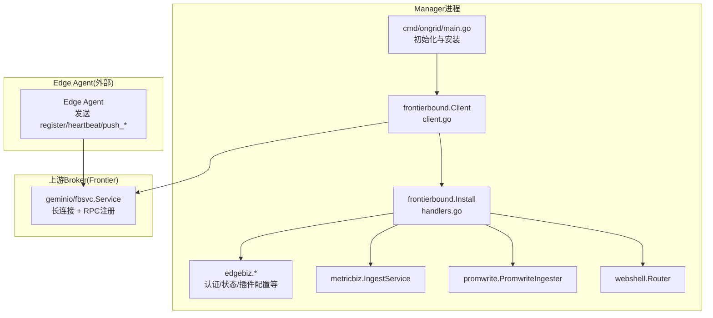
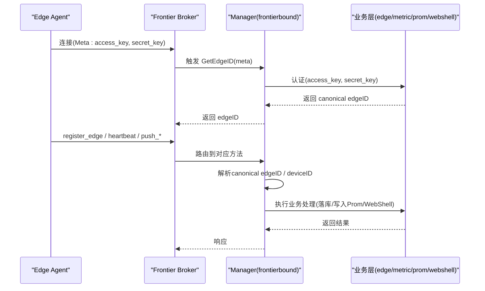
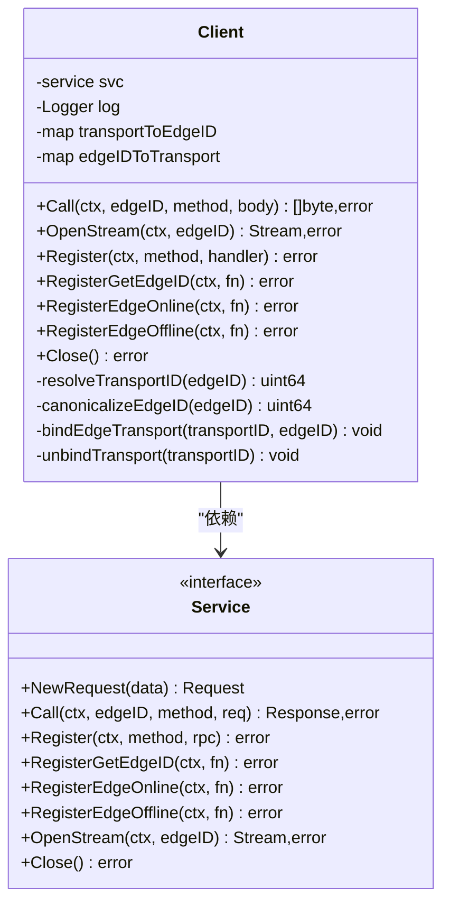
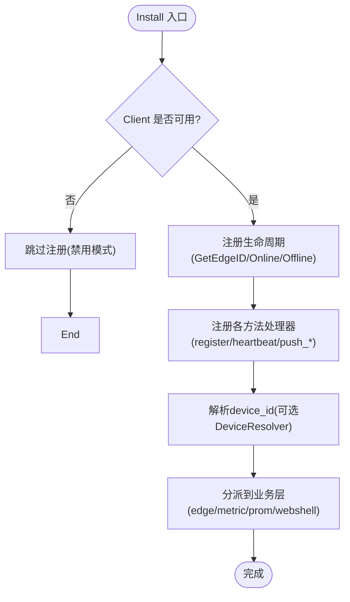
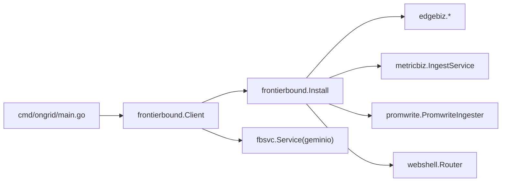

# Frontier消息中间件

<cite>
**本文引用的文件列表**
- [cmd/ongrid/main.go](file://cmd/ongrid/main.go)
- [internal/manager/service/frontierbound/doc.go](file://internal/manager/service/frontierbound/doc.go)
- [internal/manager/service/frontierbound/client.go](file://internal/manager/service/frontierbound/client.go)
- [internal/manager/service/frontierbound/handlers.go](file://internal/manager/service/frontierbound/handlers.go)
- [internal/pkg/tunnel/messages.go](file://internal/pkg/tunnel/messages.go)
- [.record/2026-07-06-fix-frontierbound-startup-warmup.md](file://.record/2026-07-06-fix-frontierbound-startup-warmup.md)
</cite>

## 目录
1. [简介](#简介)
2. [项目结构](#项目结构)
3. [核心组件](#核心组件)
4. [架构总览](#架构总览)
5. [详细组件分析](#详细组件分析)
6. [依赖关系分析](#依赖关系分析)
7. [性能与容量规划](#性能与容量规划)
8. [故障排查指南](#故障排查指南)
9. [结论](#结论)
10. [附录：使用示例与最佳实践](#附录使用示例与最佳实践)

## 简介
本文件围绕 Frontier 作为自定义消息代理在系统中的集成与使用，系统性阐述其架构设计与核心功能。重点覆盖：
- 发布订阅、点对点通信与消息路由机制（基于服务端注册与按 Edge ID 路由）
- 边缘设备与云端管理器之间的消息传递流程（序列化、传输协议、可靠性保证）
- 消息队列的配置与管理（分区、负载均衡、故障转移）
- 消息生命周期管理（持久化、重试机制、死信队列）
- 监控与审计能力
- 性能调优与容量规划建议
- 具体使用示例与最佳实践

说明：Frontier 在本仓库中以“上游 broker”形式被 manager 侧通过 SDK 接入；本仓库实现的是 manager 侧的适配层 frontierbound 以及共享的消息定义 tunnel。

## 项目结构
与 Frontier 相关的代码主要分布在以下位置：
- cmd/ongrid/main.go：启动时创建并安装 frontierbound 客户端，注册反向调用处理器与生命周期回调
- internal/manager/service/frontierbound/*：manager 侧对上游 frontier broker 的封装与业务适配
- internal/pkg/tunnel/messages.go：边云间 JSON 消息体与方法名常量（跨 edge 与 manager 共享）
- .record/...：关于 frontierbound 启动 warmup 修复的记录，用于理解可靠性细节

图表来源
- [cmd/ongrid/main.go:865-903](file://cmd/ongrid/main.go#L865-L903)
- [internal/manager/service/frontierbound/client.go:49-89](file://internal/manager/service/frontierbound/client.go#L49-L89)
- [internal/manager/service/frontierbound/handlers.go:80-110](file://internal/manager/service/frontierbound/handlers.go#L80-L110)

章节来源
- [cmd/ongrid/main.go:865-903](file://cmd/ongrid/main.go#L865-L903)
- [internal/manager/service/frontierbound/doc.go:1-16](file://internal/manager/service/frontierbound/doc.go#L1-L16)

## 核心组件
- frontierbound.Client：manager 侧对上游 fbsvc.Service 的薄封装，提供 Call/OpenStream/Register 等面向业务的接口，维护 transportID 与 canonical edgeID 的双向映射，支持禁用模式（NewDisabled）。
- frontierbound.Install：集中注册所有 manager 侧反向调用处理器与生命周期回调（GetEdgeID、EdgeOnline、EdgeOffline），并将业务依赖注入到处理逻辑中。
- tunnel 消息定义：统一的方法名常量与 JSON 请求/响应结构，贯穿 edge 与 manager，确保 wire 格式一致。

章节来源
- [internal/manager/service/frontierbound/client.go:17-126](file://internal/manager/service/frontierbound/client.go#L17-L126)
- [internal/manager/service/frontierbound/handlers.go:80-110](file://internal/manager/service/frontierbound/handlers.go#L80-L110)
- [internal/pkg/tunnel/messages.go:17-80](file://internal/pkg/tunnel/messages.go#L17-L80)

## 架构总览
Frontier 在本系统中扮演“服务总线”的角色：
- 连接模型：manager 以 service-end 身份建立长连接至 upstream frontier broker；edge agent 同样以 client-end 身份连接 broker。
- 路由模型：broker 根据 method 名称将请求分发到已注册的 handler；manager 侧通过 Register 注册方法名与处理函数；同时通过 GetEdgeID 将 Meta 中的 access_key/secret_key 解析为 canonical edgeID，并在 Online/Offline 事件中维护 transportID ↔ edgeID 映射。
- 数据面：edge → manager 的 push 类消息（register_edge、heartbeat、push_host_metrics、push_prom_samples、get_plugin_configs、shell_output/shell_exit）由 manager 侧 handlers 消费；manager → edge 的 call 类消息（如 plugin_configs_changed、写数据库指标密钥等）通过 Client.Call 发出。

图表来源
- [internal/manager/service/frontierbound/handlers.go:111-187](file://internal/manager/service/frontierbound/handlers.go#L111-L187)
- [internal/manager/service/frontierbound/handlers.go:189-388](file://internal/manager/service/frontierbound/handlers.go#L189-L388)
- [internal/pkg/tunnel/messages.go:210-377](file://internal/pkg/tunnel/messages.go#L210-L377)

## 详细组件分析

### 组件A：frontierbound.Client（manager 侧SDK封装）
职责与要点：
- 连接管理：通过 fbsvc.NewService 建立与 upstream broker 的长连接；支持 NewDisabled 用于测试或降级场景。
- 双向映射：维护 transportID 与 canonical edgeID 的映射，避免将底层 transportID 暴露到标签或日志中造成污染。
- 调用抽象：Call/OpenStream 屏蔽底层 geminio.Request/Response 细节，向上提供简洁 API。
- 错误语义：禁用模式下返回 ErrDisabled；远程错误包装后返回。

图表来源
- [internal/manager/service/frontierbound/client.go:35-58](file://internal/manager/service/frontierbound/client.go#L35-L58)
- [internal/manager/service/frontierbound/client.go:128-250](file://internal/manager/service/frontierbound/client.go#L128-L250)

章节来源
- [internal/manager/service/frontierbound/client.go:17-126](file://internal/manager/service/frontierbound/client.go#L17-L126)
- [internal/manager/service/frontierbound/client.go:252-311](file://internal/manager/service/frontierbound/client.go#L252-L311)

### 组件B：frontierbound.Install（处理器与生命周期装配）
职责与要点：
- 生命周期：注册 GetEdgeID、EdgeOnline、EdgeOffline，完成认证、在线/离线事件处理与 transport↔edgeID 绑定。
- 反向调用处理器：register_edge、heartbeat、push_host_metrics、push_prom_samples、get_plugin_configs、shell_output/shell_exit。
- 设备维度：通过 DeviceResolver 将 tunnel 侧 edge_id 解析为主机 device_id，避免将 edge_id 误标为 device_id。
- 可选能力：Prom 写入器、WebShell 路由、插件配置拉取均为可选注入，未注入时优雅降级。

图表来源
- [internal/manager/service/frontierbound/handlers.go:80-110](file://internal/manager/service/frontierbound/handlers.go#L80-L110)
- [internal/manager/service/frontierbound/handlers.go:111-187](file://internal/manager/service/frontierbound/handlers.go#L111-L187)
- [internal/manager/service/frontierbound/handlers.go:189-447](file://internal/manager/service/frontierbound/handlers.go#L189-L447)

章节来源
- [internal/manager/service/frontierbound/handlers.go:80-110](file://internal/manager/service/frontierbound/handlers.go#L80-L110)
- [internal/manager/service/frontierbound/handlers.go:111-187](file://internal/manager/service/frontierbound/handlers.go#L111-L187)
- [internal/manager/service/frontierbound/handlers.go:189-447](file://internal/manager/service/frontierbound/handlers.go#L189-L447)

### 组件C：tunnel 消息定义（JSON 协议与方法名）
职责与要点：
- 方法名常量：register_edge、heartbeat、push_host_metrics、push_prom_samples、get_plugin_configs、plugin_configs_changed、shell_* 等。
- 请求/响应结构：包括 HostInfo、HeartbeatRequest、PushHostMetricsRequest、PushPromSamplesRequest、Shell* 系列、WriteDatabaseMetricsSecret* 等。
- 设计原则：保持与 proto 的 json_name 同步，便于未来切换二进制编码。

章节来源
- [internal/pkg/tunnel/messages.go:17-80](file://internal/pkg/tunnel/messages.go#L17-L80)
- [internal/pkg/tunnel/messages.go:210-377](file://internal/pkg/tunnel/messages.go#L210-L377)
- [internal/pkg/tunnel/messages.go:436-502](file://internal/pkg/tunnel/messages.go#L436-L502)

## 依赖关系分析
- manager 主进程负责构建 frontierbound.Client 并调用 Install 装配处理器，随后将 fbClient 注入到需要主动调用 edge 的业务模块（例如插件配置变更通知、数据库指标密钥下发等）。
- frontierbound 不直接引入 biz 包，而是通过 Wiring 接口解耦，降低耦合度。
- 与 Prometheus/Loki/Grafana 等观测栈的集成通过 promwrite/logquery 等客户端间接完成，不在 frontierbound 内硬编码。

图表来源
- [cmd/ongrid/main.go:865-903](file://cmd/ongrid/main.go#L865-L903)
- [internal/manager/service/frontierbound/handlers.go:39-78](file://internal/manager/service/frontierbound/handlers.go#L39-L78)

章节来源
- [cmd/ongrid/main.go:865-903](file://cmd/ongrid/main.go#L865-L903)
- [internal/manager/service/frontierbound/handlers.go:39-78](file://internal/manager/service/frontierbound/handlers.go#L39-L78)

## 性能与容量规划
- 连接与重连：fbsvc 内部采用 RetryEnd 异步拨号与后台重连，Register 会等待 broker ACK，但 broker 端 service 表对外可见存在延迟窗口。已在启动阶段引入短暂 warmup 以降低首次推送失败概率。
- 标签与维度控制：严格避免将 transportID 泄露为 edge_id/device_id 标签，防止产生幽灵时序与 Grafana 下拉项污染。
- 批量与去重：push_host_metrics 与 push_prom_samples 均支持批量上报，服务端接受计数反馈，有助于边缘侧退避与节流。
- 容量规划建议：
  - 根据 edge 规模估算并发连接数与心跳频率，评估 broker 与 manager 的 CPU/内存占用。
  - 针对 Prometheus remote_write 吞吐，结合远端写入速率与批大小进行压测，调整批大小与并发。
  - 对 WebSSH 流式通道，考虑会话数量与带宽峰值，合理设置超时与限流。

章节来源
- [.record/2026-07-06-fix-frontierbound-startup-warmup.md:9-34](file://.record/2026-07-06-fix-frontierbound-startup-warmup.md#L9-L34)
- [.record/2026-07-06-fix-frontierbound-startup-warmup.md:92-114](file://.record/2026-07-06-fix-frontierbound-startup-warmup.md#L92-L114)
- [internal/manager/service/frontierbound/handlers.go:286-388](file://internal/manager/service/frontierbound/handlers.go#L286-L388)

## 故障排查指南
- 启动后首个 push 失败或无数据：检查 broker 端 service 表是否已刷新，确认 warmup 窗口是否生效。
- 标签异常（出现非真实 device_id）：确认 DeviceResolver 是否注入且成功解析，避免 fallback 到 edge_id。
- 插件配置未更新：确认 PluginConfigUC 是否注入，以及 NotifyPluginConfigsChanged 是否被调用。
- WebSSH 无输出：检查 shell_output/shell_exit 处理器是否注册，WebshellRouter 是否正确转发。

章节来源
- [.record/2026-07-06-fix-frontierbound-startup-warmup.md:9-34](file://.record/2026-07-06-fix-frontierbound-startup-warmup.md#L9-L34)
- [internal/manager/service/frontierbound/handlers.go:475-497](file://internal/manager/service/frontierbound/handlers.go#L475-L497)
- [internal/manager/service/frontierbound/handlers.go:420-447](file://internal/manager/service/frontierbound/handlers.go#L420-L447)

## 结论
Frontier 在本项目中作为高可靠的服务总线，配合 frontierbound 适配层实现了稳定的边云通信。通过严格的认证、清晰的设备维度解析、可插拔的业务处理器与健壮的重连机制，系统具备了良好的可扩展性与可运维性。后续可在 broker 层面进一步细化分区、负载均衡与死信策略，并结合更完善的监控与审计能力，持续提升整体稳定性与可观测性。

## 附录：使用示例与最佳实践

### 示例一：启用与安装处理器
- 在 manager 启动时创建 frontierbound.Client，并根据配置决定是否禁用。
- 调用 Install 注册所有处理器与生命周期回调，确保业务依赖正确注入。

章节来源
- [cmd/ongrid/main.go:865-903](file://cmd/ongrid/main.go#L865-L903)
- [internal/manager/service/frontierbound/handlers.go:80-110](file://internal/manager/service/frontierbound/handlers.go#L80-L110)

### 示例二：从云端主动调用 Edge
- 使用 Client.Call 向指定 edgeID 发起方法调用（如 plugin_configs_changed、写数据库指标密钥等）。
- 注意在禁用模式下会返回 ErrDisabled，调用方需做好容错。

章节来源
- [internal/manager/service/frontierbound/client.go:128-167](file://internal/manager/service/frontierbound/client.go#L128-L167)
- [internal/manager/service/frontierbound/handlers.go:453-465](file://internal/manager/service/frontierbound/handlers.go#L453-L465)

### 示例三：接收 Edge 上报指标
- 注册 push_host_metrics 与 push_prom_samples 处理器，解析 canonical edgeID 并转换为 device_id。
- 将指标推送到 metric 与 prom 写入器，记录 Accepted 计数以便边缘侧退避。

章节来源
- [internal/manager/service/frontierbound/handlers.go:286-388](file://internal/manager/service/frontierbound/handlers.go#L286-L388)
- [internal/pkg/tunnel/messages.go:322-377](file://internal/pkg/tunnel/messages.go#L322-L377)

### 最佳实践
- 始终使用 DeviceResolver 解析 device_id，避免标签污染。
- 在 broker 重启或冷启动场景下，保留 warmup 窗口，减少首波失败。
- 对可选能力（Prom、WebShell、插件配置）采用 nil 安全路径，确保降级可用。
- 对敏感字段（如数据库指标密钥）遵循最小暴露原则，不在 manager 侧持久化。

章节来源
- [internal/manager/service/frontierbound/handlers.go:475-497](file://internal/manager/service/frontierbound/handlers.go#L475-L497)
- [.record/2026-07-06-fix-frontierbound-startup-warmup.md:92-114](file://.record/2026-07-06-fix-frontierbound-startup-warmup.md#L92-L114)
- [internal/pkg/tunnel/messages.go:169-192](file://internal/pkg/tunnel/messages.go#L169-L192)