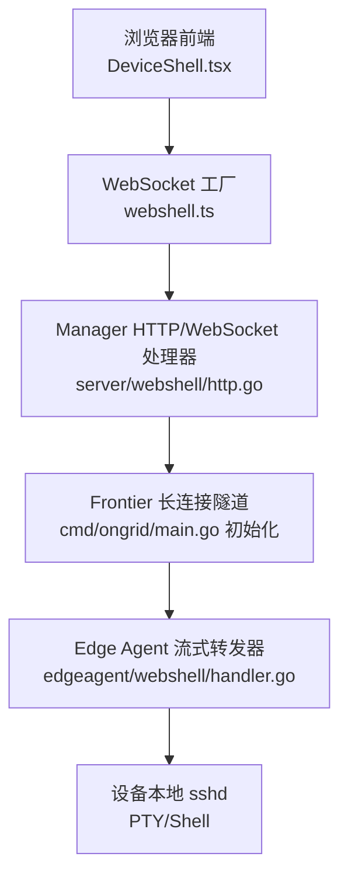
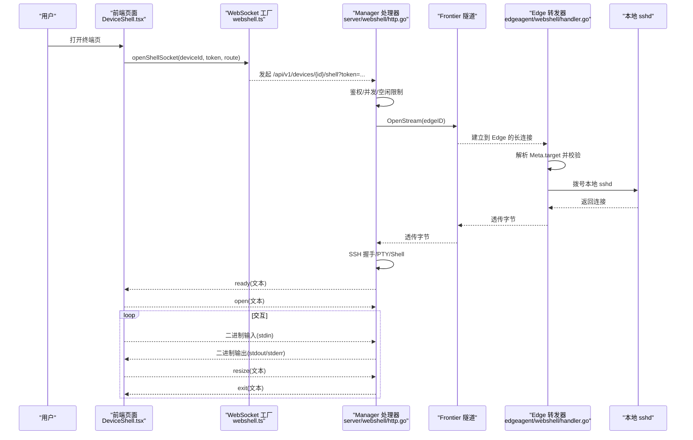
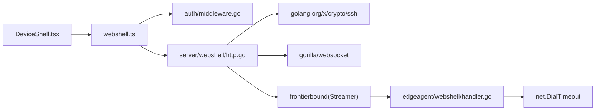

# WebSocket实时通信

<cite>
**本文引用的文件**   
- [internal/manager/server/webshell/http.go](file://internal/manager/server/webshell/http.go)
- [internal/edgeagent/webshell/handler.go](file://internal/edgeagent/webshell/handler.go)
- [web/src/api/webshell.ts](file://web/src/api/webshell.ts)
- [web/src/pages/DeviceShell.tsx](file://web/src/pages/DeviceShell.tsx)
- [internal/pkg/auth/middleware.go](file://internal/pkg/auth/middleware.go)
- [internal/pkg/tunnel/bash.go](file://internal/pkg/tunnel/bash.go)
- [cmd/ongrid/main.go](file://cmd/ongrid/main.go)
</cite>

## 目录
1. [简介](#简介)
2. [项目结构](#项目结构)
3. [核心组件](#核心组件)
4. [架构总览](#架构总览)
5. [详细组件分析](#详细组件分析)
6. [依赖关系分析](#依赖关系分析)
7. [性能考虑](#性能考虑)
8. [故障排查指南](#故障排查指南)
9. [结论](#结论)
10. [附录](#附录)

## 简介
本文件围绕 WebShell 的 WebSocket 实时通信实现，系统性阐述连接建立、双向数据传输与会话管理；并给出实时日志流式传输机制（数据分块、增量更新与断线重连策略）的设计说明。同时覆盖前后端客户端实现要点（连接池、消息序列化、错误处理）、安全考量（身份验证、权限控制、输入过滤），以及性能优化策略（连接复用、消息压缩、内存管理）。文末提供集成示例与调试方法、常见问题排查清单。

## 项目结构
WebShell 的 WebSocket 链路贯穿前端页面、Manager HTTP 服务、Frontier 长连接隧道、Edge Agent 与设备本地 SSH：
- 前端：React 页面 + WebSocket 工厂封装
- Manager：HTTP 路由升级 WebSocket，维护会话路由、审计记录、并发限制与空闲超时
- Frontier：Manager 与 Edge 之间的长连接通道
- Edge：轻量 TCP 转发器，按 Meta 目标地址直连本地或跨主机端口
- 设备：本地 sshd 提供 PTY/Shell

图表来源
- [web/src/pages/DeviceShell.tsx:1-723](file://web/src/pages/DeviceShell.tsx#L1-L723)
- [web/src/api/webshell.ts:1-103](file://web/src/api/webshell.ts#L1-L103)
- [internal/manager/server/webshell/http.go:1-684](file://internal/manager/server/webshell/http.go#L1-L684)
- [cmd/ongrid/main.go:865-889](file://cmd/ongrid/main.go#L865-L889)
- [internal/edgeagent/webshell/handler.go:1-222](file://internal/edgeagent/webshell/handler.go#L1-L222)

章节来源
- [web/src/pages/DeviceShell.tsx:1-723](file://web/src/pages/DeviceShell.tsx#L1-L723)
- [web/src/api/webshell.ts:1-103](file://web/src/api/webshell.ts#L1-L103)
- [internal/manager/server/webshell/http.go:1-684](file://internal/manager/server/webshell/http.go#L1-L684)
- [internal/edgeagent/webshell/handler.go:1-222](file://internal/edgeagent/webshell/handler.go#L1-L222)
- [cmd/ongrid/main.go:865-889](file://cmd/ongrid/main.go#L865-L889)

## 核心组件
- 前端 WebSocket 工厂与类型定义：负责构造 URL、附加鉴权 token、协商子协议、发送控制帧与二进制数据
- 前端页面状态机：连接生命周期、错误提示、重连入口、窗口大小变更上报
- Manager WebSocket 处理器：鉴权、并发限制、审计记录、SSH 握手、PTY/Shell 生命周期、多路泵（stdin/stdout/stderr/resize/close）
- Edge 流式转发器：解析 Meta 目标地址、白名单校验、防伪造 device_id、双向 io.Copy
- 认证中间件：支持 Authorization Bearer 与 ?token= 查询参数（适配浏览器原生 WebSocket）

章节来源
- [web/src/api/webshell.ts:1-103](file://web/src/api/webshell.ts#L1-L103)
- [web/src/pages/DeviceShell.tsx:1-723](file://web/src/pages/DeviceShell.tsx#L1-L723)
- [internal/manager/server/webshell/http.go:1-684](file://internal/manager/server/webshell/http.go#L1-L684)
- [internal/edgeagent/webshell/handler.go:1-222](file://internal/edgeagent/webshell/handler.go#L1-L222)
- [internal/pkg/auth/middleware.go:1-68](file://internal/pkg/auth/middleware.go#L1-L68)

## 架构总览
WebShell 采用“浏览器 → Manager → Frontier → Edge → 本地 sshd”的链式架构。Manager 承担会话治理与安全策略，Edge 仅做透明转发，降低边缘侧复杂度。

图表来源
- [web/src/pages/DeviceShell.tsx:1-723](file://web/src/pages/DeviceShell.tsx#L1-L723)
- [web/src/api/webshell.ts:1-103](file://web/src/api/webshell.ts#L1-L103)
- [internal/manager/server/webshell/http.go:1-684](file://internal/manager/server/webshell/http.go#L1-L684)
- [internal/edgeagent/webshell/handler.go:1-222](file://internal/edgeagent/webshell/handler.go#L1-L222)

## 详细组件分析

### 前端 WebSocket 客户端（webshell.ts）
- 子协议协商：客户端声明 ongrid.shell.v1，便于服务端稳定日志
- 鉴权传递：通过 ?token= 将 JWT 传入后端（兼容浏览器原生 WebSocket 无法设置请求头）
- 路径选择：tunnel 模式走 /shell，direct 模式走 /shell-direct
- 二进制类型：ws.binaryType = 'arraybuffer'，用于高效传输 stdout/stderr
- 控制帧：open/resize/close 使用 JSON 文本帧；ready/auth_error/exit 为服务端返回的控制帧

章节来源
- [web/src/api/webshell.ts:1-103](file://web/src/api/webshell.ts#L1-L103)

### 前端页面（DeviceShell.tsx）
- 连接状态机：idle/connecting/open/closed，配合 UI 展示与操作按钮
- 预检探测：在建立 WS 前进行 HTTP 预检，捕获 429/503/403/401 等错误并友好提示
- 首次 open 帧：携带 cols/rows/term/ssh_user/ssh_pass/ssh_host
- 数据收发：二进制帧直接写入 xterm；文本帧解析为控制事件
- 窗口调整：onResize 时发送 resize 控制帧
- 优雅关闭：beforeunload 发送 close 控制帧，避免审计延迟
- 重连策略：异常断开后弹出连接弹窗，支持手动重连

章节来源
- [web/src/pages/DeviceShell.tsx:1-723](file://web/src/pages/DeviceShell.tsx#L1-L723)

### Manager WebSocket 处理器（server/webshell/http.go）
- 鉴权与租户上下文：从请求中提取 JWT，注入 tenantctx
- 并发与配额：每用户/每设备最大会话数限制
- 空闲超时：无输入超过阈值自动关闭
- 审计记录：Open/Close 写入审计行，统计 stdin/stdout 字节与退出码
- 会话路由：注册/注销活跃会话，支持管理员 Kill
- 数据泵：
  - stdout/stderr → WS 二进制帧
  - WS 二进制帧 → stdin
  - WS 文本帧 → resize/close
  - SSH session.Wait → exit 控制帧
- 错误映射：将 SSH 认证失败等错误转换为友好的 auth_error 文本帧

章节来源
- [internal/manager/server/webshell/http.go:1-684](file://internal/manager/server/webshell/http.go#L1-L684)

### Edge 流式转发器（edgeagent/webshell/handler.go）
- Meta 解析：target 支持两种形状
  - 回环白名单：127.0.0.1:22 / localhost:22
  - host:ip:port 通用格式，需附带 device_id 防伪造
- 拨号与转发：TCP 拨号成功后双向 io.Copy
- 错误反馈：向对端写入可读的错误信息，便于上层定位问题

章节来源
- [internal/edgeagent/webshell/handler.go:1-222](file://internal/edgeagent/webshell/handler.go#L1-L222)

### 认证中间件（auth/middleware.go）
- 支持两种令牌提取方式：Authorization: Bearer 与 ?token=
- 校验 JWT 后将租户信息写入请求上下文，供后续鉴权与审计使用

章节来源
- [internal/pkg/auth/middleware.go:1-68](file://internal/pkg/auth/middleware.go#L1-L68)

### 前端 HTTP 客户端（client.ts）
- 统一请求封装：自动附加 Authorization、Accept-Language
- 401 刷新流程：尝试刷新 access_token，失败则登出
- 错误体解析：优先读取 JSON error/message/code，否则截断文本

章节来源
- [web/src/api/client.ts:1-163](file://web/src/api/client.ts#L1-L163)

### 相关协议与工具（tunnel/bash.go）
- bash.exec 协议用于 LLM 工具调用场景，非 WebShell 主路径，但体现系统内命令执行的安全边界设计思路（只读策略、沙箱、可配置放宽）

章节来源
- [internal/pkg/tunnel/bash.go:1-72](file://internal/pkg/tunnel/bash.go#L1-L72)

### 服务启动与 Frontier 绑定（cmd/ongrid/main.go）
- 初始化 Frontierbound 客户端，作为 Manager 与 Edge 的长连接通道
- 当禁用时，边缘隧道能力在调用点返回特定错误，保证服务可用性与可观测性

章节来源
- [cmd/ongrid/main.go:865-889](file://cmd/ongrid/main.go#L865-L889)

## 依赖关系分析
- 前端依赖：
  - webshell.ts 提供 openShellSocket/sendControl 等接口
  - DeviceShell.tsx 组合页面逻辑与 XTerminal 组件
- Manager 依赖：
  - gorilla/websocket 升级与读写
  - golang.org/x/crypto/ssh 完成 SSH 握手与 PTY/Shell
  - biz/webshell.Router/Recorder 管理活跃会话与审计
  - frontierbound 提供的 Streamer 打开到 Edge 的长连接
- Edge 依赖：
  - tunnel.StreamConn 抽象底层流
  - net.DialTimeout 拨号目标地址

图表来源
- [web/src/pages/DeviceShell.tsx:1-723](file://web/src/pages/DeviceShell.tsx#L1-L723)
- [web/src/api/webshell.ts:1-103](file://web/src/api/webshell.ts#L1-L103)
- [internal/manager/server/webshell/http.go:1-684](file://internal/manager/server/webshell/http.go#L1-L684)
- [internal/edgeagent/webshell/handler.go:1-222](file://internal/edgeagent/webshell/handler.go#L1-L222)
- [internal/pkg/auth/middleware.go:1-68](file://internal/pkg/auth/middleware.go#L1-L68)

章节来源
- [web/src/pages/DeviceShell.tsx:1-723](file://web/src/pages/DeviceShell.tsx#L1-L723)
- [web/src/api/webshell.ts:1-103](file://web/src/api/webshell.ts#L1-L103)
- [internal/manager/server/webshell/http.go:1-684](file://internal/manager/server/webshell/http.go#L1-L684)
- [internal/edgeagent/webshell/handler.go:1-222](file://internal/edgeagent/webshell/handler.go#L1-L222)
- [internal/pkg/auth/middleware.go:1-68](file://internal/pkg/auth/middleware.go#L1-L68)

## 性能考虑
- 连接复用
  - Manager 与 Edge 之间通过 Frontier 长连接复用，避免每次 Shell 都新建底层连接
  - 建议保持前端单实例 WebSocket，避免频繁创建销毁
- 消息压缩
  - 当前未启用 WS 层压缩；若终端输出量大，可在网关层（如 Nginx）开启 gzip/deflate 或采用应用层压缩（谨慎评估 CPU 开销）
- 内存管理
  - 前端使用 ArrayBuffer 接收二进制输出，避免字符串拷贝开销
  - Manager 使用固定大小缓冲（例如 8KB）批量写入，减少 GC 压力
- 并发与限流
  - 每用户/每设备最大会话数限制，防止资源耗尽
  - 空闲超时自动回收，释放 SSH/PTY 资源
- 网络与内核
  - 关注 TIME_WAIT 与 conntrack 表项，必要时调整 sysctl 或扩容源 IP（参考诊断文档）

[本节为通用指导，不直接分析具体文件]

## 故障排查指南
- 连接建立失败
  - 检查鉴权：确认 token 有效且未被过期；浏览器 WS 必须使用 ?token= 传递
  - 检查权限：确保具备 device:shell 相应权限
  - 检查设备在线：Manager 会拒绝离线设备
- 认证失败
  - 观察 auth_error 文本帧内容，常见为用户名或密码错误
- 会话被中断
  - 查看是否触发空闲超时或被管理员 Kill
  - 检查网络抖动与防火墙策略
- 输出乱码或终端错位
  - 确认 term 与 cols/rows 正确传递，resize 事件正常上报
- 性能问题
  - 监控 Manager 并发与会话数量，避免达到上限
  - 检查前端是否重复创建连接导致风暴

章节来源
- [internal/manager/server/webshell/http.go:1-684](file://internal/manager/server/webshell/http.go#L1-L684)
- [web/src/pages/DeviceShell.tsx:1-723](file://web/src/pages/DeviceShell.tsx#L1-L723)
- [internal/pkg/auth/middleware.go:1-68](file://internal/pkg/auth/middleware.go#L1-L68)

## 结论
WebShell 的 WebSocket 方案以 Manager 为中心，集中承载鉴权、审计、并发与空闲管理等关键策略；Edge 保持极简转发，提升整体稳定性与可维护性。前端通过预检与状态机提升用户体验，结合二进制帧与 resize 控制实现流畅的交互式终端。建议在大规模部署中关注连接复用、压缩与内存分配，并结合监控指标持续优化。

[本节为总结性内容，不直接分析具体文件]

## 附录

### 集成示例（步骤）
- 前端
  - 调用 openShellSocket(deviceId, token, {route:'tunnel'|'direct'})
  - 监听 onmessage，区分二进制与文本帧
  - 收到 ready 后进入交互；收到 exit 后清理
- 后端
  - 注册路由 GET /v1/devices/{device_id}/shell
  - 使用鉴权中间件与 Casbin 权限控制
  - 打开 Frontier 流，建立 SSH 会话，启动多路泵
- Edge
  - 解析 Meta.target，校验 device_id，拨号目标并双向转发

章节来源
- [web/src/api/webshell.ts:1-103](file://web/src/api/webshell.ts#L1-L103)
- [web/src/pages/DeviceShell.tsx:1-723](file://web/src/pages/DeviceShell.tsx#L1-L723)
- [internal/manager/server/webshell/http.go:1-684](file://internal/manager/server/webshell/http.go#L1-L684)
- [internal/edgeagent/webshell/handler.go:1-222](file://internal/edgeagent/webshell/handler.go#L1-L222)

### 调试方法
- 浏览器开发者工具
  - Network → WS：查看帧内容与状态码
  - Console：打印 preflight 探测结果与错误信息
- 后端日志
  - 关注 upgrade、stream open、ssh auth、pty/shell 启动与关闭
- 网络抓包
  - 使用 tcpdump/Wireshark 定位丢包与重传

章节来源
- [web/src/pages/DeviceShell.tsx:1-723](file://web/src/pages/DeviceShell.tsx#L1-L723)
- [internal/manager/server/webshell/http.go:1-684](file://internal/manager/server/webshell/http.go#L1-L684)