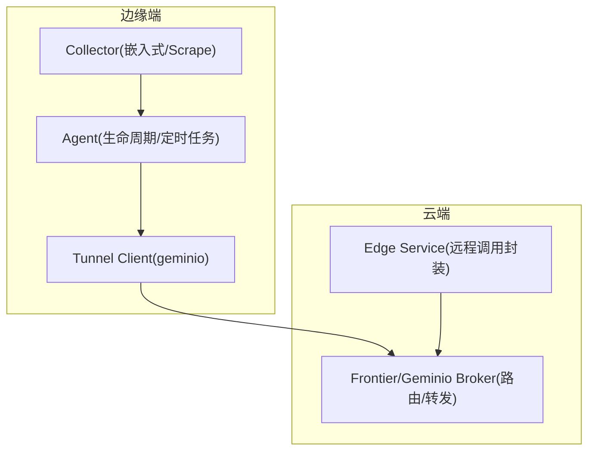
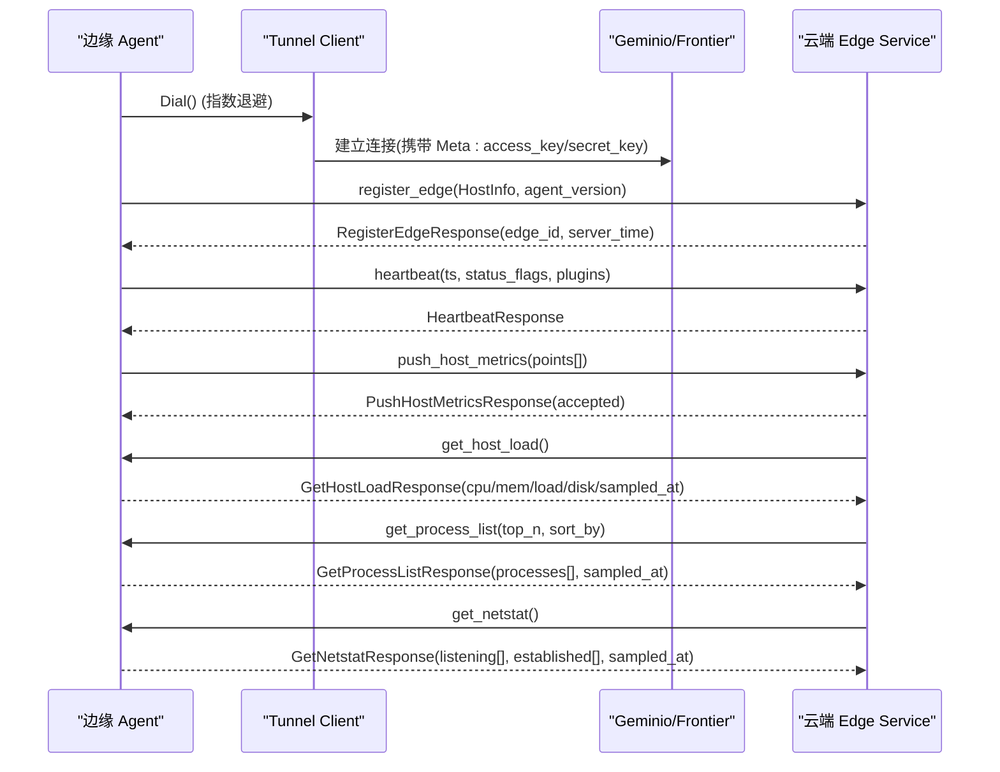
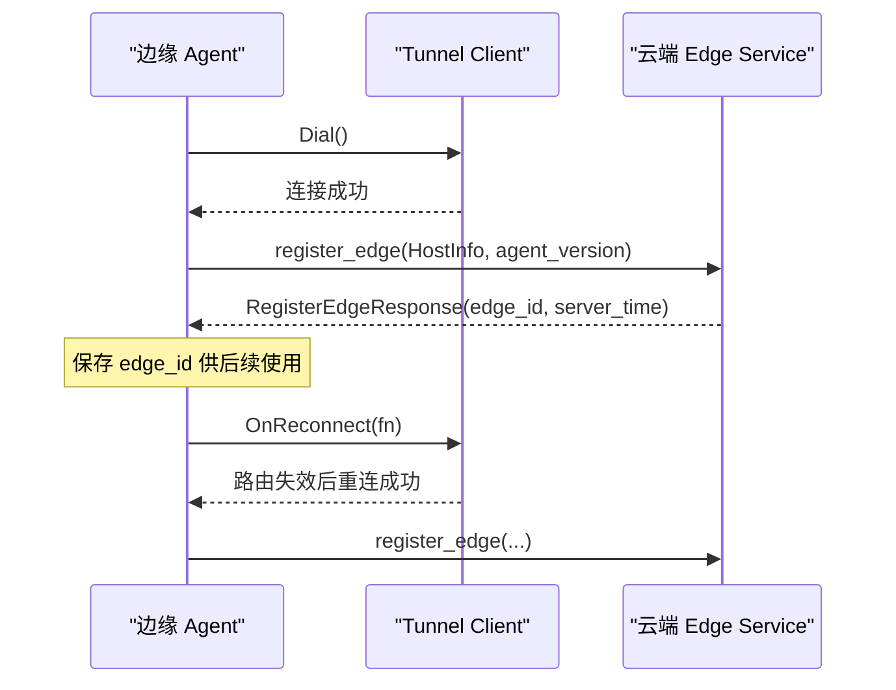
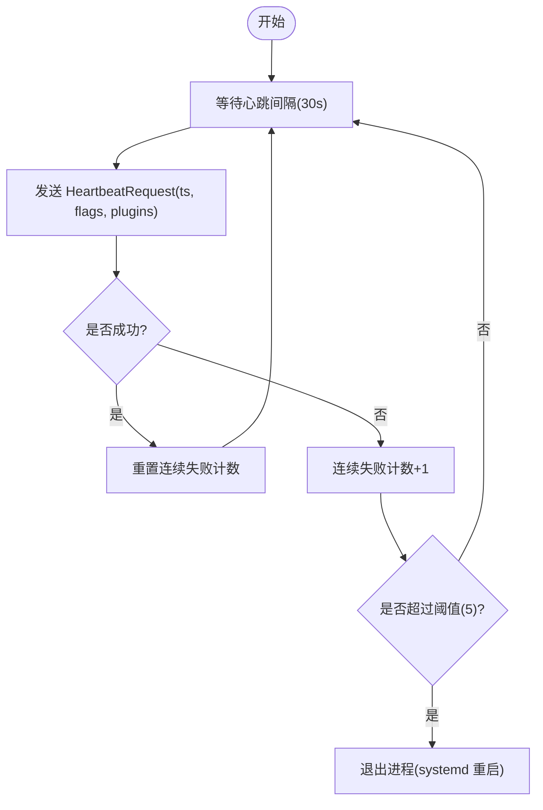
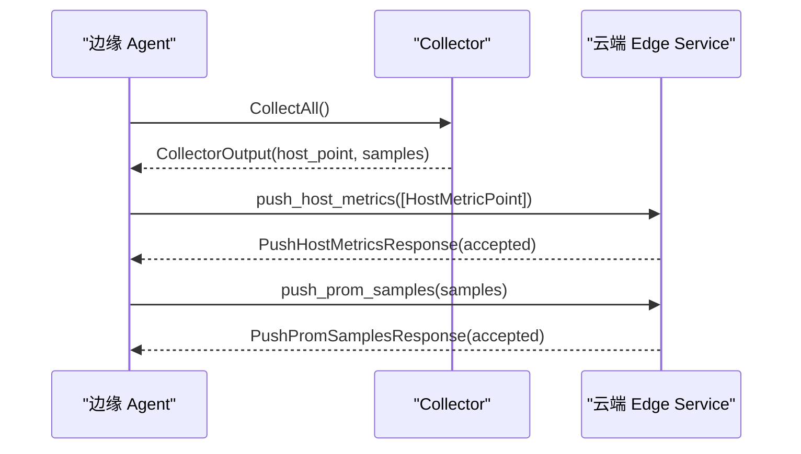
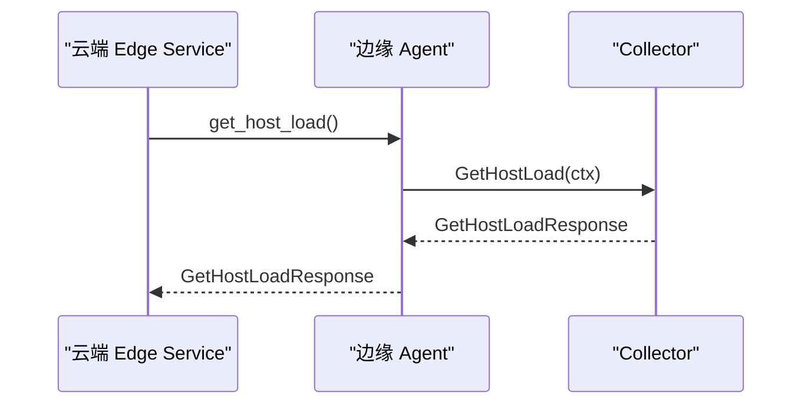
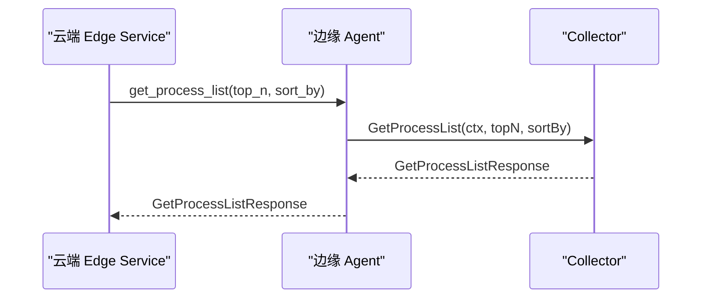
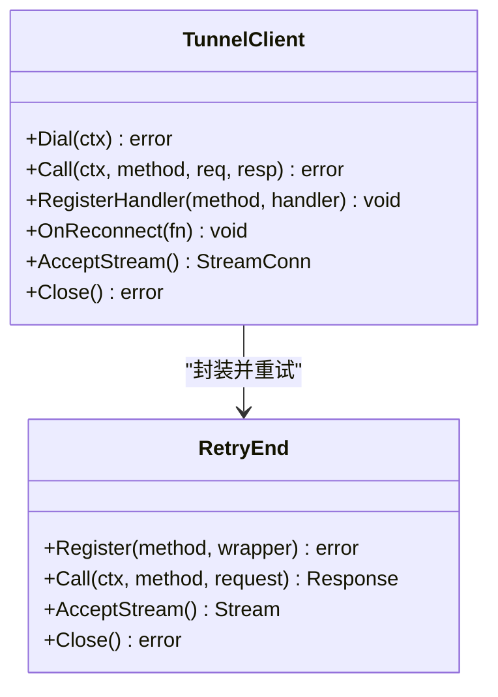
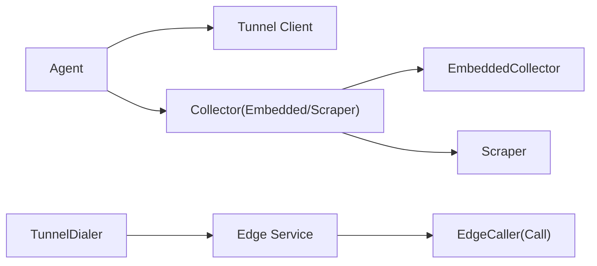

# gRPC通信协议

<cite>
**本文引用的文件**   
- [tunnel.proto](file://api/tunnel/v1/tunnel.proto)
- [messages.go](file://internal/pkg/tunnel/messages.go)
- [client.go](file://internal/pkg/tunnel/client.go)
- [agent.go](file://internal/edgeagent/biz/agent.go)
- [scrape.go](file://internal/edgeagent/collector/scrape.go)
- [embedded.go](file://internal/edgeagent/collector/embedded.go)
- [composite.go](file://internal/edgeagent/collector/composite.go)
- [service.go](file://internal/manager/service/edge/service.go)
- [tunnel.go](file://internal/manager/biz/devicessh/tunnel.go)
</cite>

## 目录
1. [简介](#简介)
2. [项目结构](#项目结构)
3. [核心组件](#核心组件)
4. [架构总览](#架构总览)
5. [详细组件分析](#详细组件分析)
6. [依赖关系分析](#依赖关系分析)
7. [性能考量](#性能考量)
8. [故障排查指南](#故障排查指南)
9. [结论](#结论)
10. [附录：调用示例与最佳实践](#附录调用示例与最佳实践)

## 简介
本文件系统化梳理 OnGrid 的“隧道”通信协议（在 MVP 阶段以 JSON 编码，通过 geminio 传输；未来可切换为 protobuf 二进制）。该协议并非传统 gRPC Service 定义，而是基于方法名路由的请求/响应消息体形状。文档重点覆盖：
- 核心消息结构：HostInfo、HostMetricPoint 等的设计与字段含义
- 边缘到云端流程：注册（RegisterEdge）、心跳（Heartbeat）、指标上报（PushHostMetrics）
- 云端到边缘查询：主机负载（GetHostLoad）、进程列表（GetProcessList）、网络状态（GetNetstat）
- 服务发现与连接管理：geminio 客户端重连、路由失效恢复、OnReconnect 钩子
- 错误处理策略与调试技巧
- 具体调用示例与性能优化建议

## 项目结构
协议定义位于 api/tunnel/v1/tunnel.proto；Go 侧的消息体镜像与常量定义位于 internal/pkg/tunnel/messages.go；geminio 客户端封装与重连逻辑位于 internal/pkg/tunnel/client.go；边缘 Agent 生命周期与定时任务位于 internal/edgeagent/biz/agent.go；采集器实现（嵌入式与 scrape 模式）位于 collector 包；Manager 侧对边缘的远程调用封装位于 internal/manager/service/edge/service.go；设备 SSH 隧道拨号路径位于 internal/manager/biz/devicessh/tunnel.go。

图表来源
- [client.go:23-141](file://internal/pkg/tunnel/client.go#L23-L141)
- [agent.go:154-232](file://internal/edgeagent/biz/agent.go#L154-L232)
- [service.go:101-118](file://internal/manager/service/edge/service.go#L101-L118)

章节来源
- [tunnel.proto:1-166](file://api/tunnel/v1/tunnel.proto#L1-L166)
- [messages.go:17-80](file://internal/pkg/tunnel/messages.go#L17-L80)
- [client.go:23-141](file://internal/pkg/tunnel/client.go#L23-L141)
- [agent.go:154-232](file://internal/edgeagent/biz/agent.go#L154-L232)
- [service.go:101-118](file://internal/manager/service/edge/service.go#L101-L118)

## 核心组件
- 协议消息镜像与常量
  - messages.go 提供与 tunnel.proto 同构的 Go 结构体与 JSON 标签，并集中声明所有 RPC 方法名常量（如 register_edge、heartbeat、push_host_metrics、get_host_load、get_process_list、get_netstat 等），确保调用方拼写安全且与 wire 格式一致。
- 隧道客户端
  - client.go 封装 geminio.End，提供 Dial、Call、RegisterHandler、AcceptStream、OnReconnect 等能力；内置指数退避重连、路由失效自动重拨、回调触发机制。
- 边缘 Agent
  - agent.go 驱动注册、心跳、指标推送循环，并在 OnReconnect 后重新执行 register_edge，保证 edge_id 稳定绑定。
- 采集器
  - embedded.go 使用 gopsutil 直接采集；scrape.go 支持多目标 HTTP /metrics 抓取；composite.go 组合两者并提供 GetHostLoad/GetProcessList 的统一入口。
- Manager 侧远程调用
  - service.go 将云端业务逻辑转换为对边缘的 Call(method, body)，负责编解码与错误包装。

章节来源
- [messages.go:17-80](file://internal/pkg/tunnel/messages.go#L17-L80)
- [client.go:23-141](file://internal/pkg/tunnel/client.go#L23-L141)
- [agent.go:154-232](file://internal/edgeagent/biz/agent.go#L154-L232)
- [embedded.go:117-174](file://internal/edgeagent/collector/embedded.go#L117-L174)
- [scrape.go:264-356](file://internal/edgeagent/collector/scrape.go#L264-L356)
- [composite.go:67-91](file://internal/edgeagent/collector/composite.go#L67-L91)
- [service.go:101-118](file://internal/manager/service/edge/service.go#L101-L118)

## 架构总览
协议采用“方法名 + JSON 体”的轻量 RPC 模型，运行于 geminio 之上。边缘主动建立连接并注册云→边的处理器；边→云的请求由边缘发起，云→边的请求由云端通过边缘已注册的处理器完成。

图表来源
- [client.go:66-141](file://internal/pkg/tunnel/client.go#L66-L141)
- [agent.go:354-383](file://internal/edgeagent/biz/agent.go#L354-L383)
- [agent.go:392-431](file://internal/edgeagent/biz/agent.go#L392-L431)
- [agent.go:478-530](file://internal/edgeagent/biz/agent.go#L478-L530)
- [service.go:101-118](file://internal/manager/service/edge/service.go#L101-L118)

## 详细组件分析

### 协议消息与数据结构
- HostInfo
  - 静态主机信息：hostname、os、arch、kernel_version、cpu_count、mem_total_bytes；Go 镜像中扩展了 fingerprint、hardware_fingerprint、ip_address、task_name 等字段，用于去重、硬件指纹、显示 IP 与任务分组。
- HostMetricPoint
  - 主机指标点：ts、cpu_pct、mem_pct、load1/5/15、net_rx_bps/net_tx_bps、disk_used_pct。
- 其他关键消息
  - RegisterEdgeRequest/Response：首次注册与重连，返回 edge_id 与 server_time。
  - HeartbeatRequest/Response：周期性心跳，携带时间戳、可选状态位与插件健康信息。
  - PushHostMetricsRequest/Response：批量主机指标上报，服务端返回 accepted 计数。
  - GetHostLoadRequest/Response：实时主机负载快照，包含 cpu/mem/load/disk/sampled_at。
  - GetProcessListRequest/Response：Top-N 进程列表，支持按 cpu 或 mem 排序。
  - GetNetstatRequest/Response：网络状态快照，包含监听套接字与已建立连接。

章节来源
- [tunnel.proto:19-41](file://api/tunnel/v1/tunnel.proto#L19-L41)
- [tunnel.proto:48-87](file://api/tunnel/v1/tunnel.proto#L48-L87)
- [tunnel.proto:94-103](file://api/tunnel/v1/tunnel.proto#L94-L103)
- [tunnel.proto:110-134](file://api/tunnel/v1/tunnel.proto#L110-L134)
- [tunnel.proto:141-165](file://api/tunnel/v1/tunnel.proto#L141-L165)
- [messages.go:221-270](file://internal/pkg/tunnel/messages.go#L221-L270)
- [messages.go:327-349](file://internal/pkg/tunnel/messages.go#L327-L349)
- [messages.go:387-433](file://internal/pkg/tunnel/messages.go#L387-L433)

### 边缘设备注册流程（register_edge）
- 时序要点
  - 边缘启动后先 Dial 建立连接，随后调用 register_edge 上报 HostInfo 与 agent_version。
  - 云端返回 edge_id 与 server_time；边缘保存 edge_id 供后续心跳与指标上报使用。
  - 当隧道发生路由失效导致重连时，OnReconnect 回调会再次执行 register_edge，确保新 manager 实例能正确绑定同一 edge_id。
- 关键实现
  - client.go 的 Dial 使用指数退避（1s→2s→…上限 60s）重试；成功连接后重新注册已注册的处理器。
  - agent.go 的 Run 在 Dial 成功后执行 registerEdge，并将 edge_id 写入内部状态。
  - agent.go 的 OnReconnect 钩子在重连成功后再次 registerEdge。

图表来源
- [client.go:66-141](file://internal/pkg/tunnel/client.go#L66-L141)
- [agent.go:154-232](file://internal/edgeagent/biz/agent.go#L154-L232)
- [agent.go:354-383](file://internal/edgeagent/biz/agent.go#L354-L383)

章节来源
- [client.go:66-141](file://internal/pkg/tunnel/client.go#L66-L141)
- [agent.go:154-232](file://internal/edgeagent/biz/agent.go#L154-L232)
- [agent.go:354-383](file://internal/edgeagent/biz/agent.go#L354-L383)

### 心跳机制（heartbeat）
- 目的
  - 维持活跃、检测时钟偏差、上报插件健康状态。
- 行为
  - 每 30s 发送一次心跳，携带 ts、status_flags 与插件健康数组。
  - 连续失败达到阈值（默认 5 次）判定隧道“卡死”，退出进程交由 systemd 重启。
- 关键点
  - heartbeatLoop 使用超时上下文控制单次调用耗时。
  - 错误仅记录日志，不中断循环；隧道层透明恢复。

图表来源
- [agent.go:392-431](file://internal/edgeagent/biz/agent.go#L392-L431)

章节来源
- [agent.go:392-431](file://internal/edgeagent/biz/agent.go#L392-L431)

### 指标上报（push_host_metrics）
- 周期与批处理
  - 每 10s 采样一次，push_one 将 HostPoint 与 Prometheus samples 分别走两条路径上报。
  - 对于 legacy 路径 push_host_metrics，仅针对 host 源（非 scrape 组件）填充 HostPointValid=true 才上报。
- 响应语义
  - 服务端返回 accepted 计数，表示实际落库条数（去重/拒收不计入）。
- 错误处理
  - 单条失败仅记录日志，下一轮 tick 用新数据重试；不缓冲 open-set samples。

图表来源
- [agent.go:454-530](file://internal/edgeagent/biz/agent.go#L454-L530)
- [messages.go:327-377](file://internal/pkg/tunnel/messages.go#L327-L377)

章节来源
- [agent.go:454-530](file://internal/edgeagent/biz/agent.go#L454-L530)
- [messages.go:327-377](file://internal/pkg/tunnel/messages.go#L327-L377)

### 云端到边缘查询接口

#### 主机负载获取（get_host_load）
- 请求：空体
- 响应：cpu_pct、mem_pct、disk_used_pct、load1/5/15、sampled_at
- 实现
  - 边缘 Agent 注册处理器，委托给 Collector.GetHostLoad。
  - CompositeCollector 优先使用 scraper 结果（若存在有效 host 级指标），否则回退到 embedded。
  - EmbeddedCollector 与 Scraper 均基于 gopsutil 或映射后的 host point 计算。

图表来源
- [agent.go:274-278](file://internal/edgeagent/biz/agent.go#L274-L278)
- [composite.go:67-81](file://internal/edgeagent/collector/composite.go#L67-L81)
- [embedded.go:117-130](file://internal/edgeagent/collector/embedded.go#L117-L130)
- [scrape.go:264-303](file://internal/edgeagent/collector/scrape.go#L264-L303)

章节来源
- [agent.go:274-278](file://internal/edgeagent/biz/agent.go#L274-L278)
- [composite.go:67-81](file://internal/edgeagent/collector/composite.go#L67-L81)
- [embedded.go:117-130](file://internal/edgeagent/collector/embedded.go#L117-L130)
- [scrape.go:264-303](file://internal/edgeagent/collector/scrape.go#L264-L303)

#### 进程列表（get_process_list）
- 请求：top_n、sort_by（cpu/mem）
- 响应：processes[]、sampled_at
- 实现
  - 边缘处理器解析请求参数，默认 top_n=20、sort_by=cpu。
  - 通过 gopsutil 遍历进程，收集 pid/name/cmdline/user/cpu%/mem%，并按指定键排序后截断 Top-N。

图表来源
- [agent.go:279-294](file://internal/edgeagent/biz/agent.go#L279-L294)
- [embedded.go:134-174](file://internal/edgeagent/collector/embedded.go#L134-L174)
- [scrape.go:316-356](file://internal/edgeagent/collector/scrape.go#L316-L356)
- [service.go:101-118](file://internal/manager/service/edge/service.go#L101-L118)

章节来源
- [agent.go:279-294](file://internal/edgeagent/biz/agent.go#L279-L294)
- [embedded.go:134-174](file://internal/edgeagent/collector/embedded.go#L134-L174)
- [scrape.go:316-356](file://internal/edgeagent/collector/scrape.go#L316-L356)
- [service.go:101-118](file://internal/manager/service/edge/service.go#L101-L118)

#### 网络状态（get_netstat）
- 请求：空体
- 响应：listening[]、established[]、sampled_at
- 说明
  - 协议定义了 ListeningSocket 与 EstablishedConnection 的结构，包含 protocol、local_addr、remote_addr、state、pid、process_name 等字段。
  - 当前仓库未在该分支看到对应处理器实现，如需启用需在边缘端注册相应 handler 并实现系统调用采集。

章节来源
- [tunnel.proto:141-165](file://api/tunnel/v1/tunnel.proto#L141-L165)

### 服务发现与连接管理
- 服务发现
  - 协议未定义 gRPC Service；方法名作为路由键，由 geminio 在两端注册处理器进行分发。
- 连接管理
  - 指数退避重连：Dial 失败时按 1s→2s→…上限 60s 重试。
  - 路由失效恢复：Call 检测到“not found”或“mismatch clientID”等错误时，触发异步重拨并执行 OnReconnect 回调。
  - 处理器再注册：重连成功后，客户端会重新注册之前注册的 cloud→edge 处理器。
- 流式通道
  - AcceptStream 暴露底层 StreamConn，便于需要字节流能力的场景（如 WebSSH）。

图表来源
- [client.go:23-141](file://internal/pkg/tunnel/client.go#L23-L141)
- [client.go:178-209](file://internal/pkg/tunnel/client.go#L178-L209)
- [client.go:218-243](file://internal/pkg/tunnel/client.go#L218-L243)
- [client.go:245-322](file://internal/pkg/tunnel/client.go#L245-L322)
- [client.go:345-379](file://internal/pkg/tunnel/client.go#L345-L379)

章节来源
- [client.go:23-141](file://internal/pkg/tunnel/client.go#L23-L141)
- [client.go:218-243](file://internal/pkg/tunnel/client.go#L218-L243)
- [client.go:245-322](file://internal/pkg/tunnel/client.go#L245-L322)
- [client.go:345-379](file://internal/pkg/tunnel/client.go#L345-L379)

### 错误处理策略
- 连接层
  - Dial 失败持续重试；TLS CA 校验失败、地址缺失等立即报错。
  - Call 层识别特定错误模式（not found、mismatch clientID）触发重拨。
- 业务层
  - 心跳失败累计阈值后退出进程，交由 systemd 重启。
  - 指标上报失败仅记录日志，下一轮重试；不缓存样本。
- 处理器注册
  - 动态注册失败仅告警，不影响后续重连后的再注册。

章节来源
- [client.go:144-176](file://internal/pkg/tunnel/client.go#L144-L176)
- [client.go:258-331](file://internal/pkg/tunnel/client.go#L258-L331)
- [agent.go:392-431](file://internal/edgeagent/biz/agent.go#L392-L431)
- [agent.go:478-530](file://internal/edgeagent/biz/agent.go#L478-L530)

## 依赖关系分析
- 边缘端
  - Agent 依赖 Tunnel Client 与 Collector；Collector 分为 Embedded 与 Scraper，Composite 组合二者。
- 云端
  - Edge Service 通过 EdgeCaller 调用边缘方法；devicessh.TunnelDialer 用于通过边缘代理访问设备 SSH。

图表来源
- [agent.go:154-232](file://internal/edgeagent/biz/agent.go#L154-L232)
- [composite.go:13-17](file://internal/edgeagent/collector/composite.go#L13-L17)
- [embedded.go:35-40](file://internal/edgeagent/collector/embedded.go#L35-L40)
- [scrape.go:39-49](file://internal/edgeagent/collector/scrape.go#L39-L49)
- [service.go:28-32](file://internal/manager/service/edge/service.go#L28-L32)
- [tunnel.go:46-81](file://internal/manager/biz/devicessh/tunnel.go#L46-L81)

章节来源
- [agent.go:154-232](file://internal/edgeagent/biz/agent.go#L154-L232)
- [composite.go:13-17](file://internal/edgeagent/collector/composite.go#L13-L17)
- [embedded.go:35-40](file://internal/edgeagent/collector/embedded.go#L35-L40)
- [scrape.go:39-49](file://internal/edgeagent/collector/scrape.go#L39-L49)
- [service.go:28-32](file://internal/manager/service/edge/service.go#L28-L32)
- [tunnel.go:46-81](file://internal/manager/biz/devicessh/tunnel.go#L46-L81)

## 性能考量
- 连接与重连
  - 指数退避避免雪崩；最大 60s 限制防止长时间抖动。
  - 路由失效快速识别并异步重拨，减少业务阻塞。
- 指标上报
  - 10s 采样、逐源独立上报；避免边缘侧缓冲大量样本，降低内存占用与延迟。
  - 仅 host 源走 legacy fast path，组件 scrape 走 open-set rich path，减少不必要的数据量。
- 查询接口
  - get_process_list 支持 top_n 限制与排序，避免全量进程表传输。
  - get_host_load 返回轻量快照，适合高频查询。

[本节为通用指导，无需源码引用]

## 故障排查指南
- 连接问题
  - 检查 ServerAddr/TLS CA 配置；确认 AccessKey/SecretKey 匹配。
  - 观察 Dial 日志中的 backoff 与错误信息。
- 路由失效
  - 关注“not found”或“mismatch clientID”错误；确认 OnReconnect 回调是否触发并成功 register_edge。
- 心跳异常
  - 查看连续失败计数；若达到阈值，进程会被重启，检查网络与云端可用性。
- 指标上报失败
  - 定位具体 source 与错误；确认 scrape 目标可达性与认证令牌。
- 查询接口无响应
  - 确认边缘已注册对应处理器；检查超时设置与系统资源。

章节来源
- [client.go:144-176](file://internal/pkg/tunnel/client.go#L144-L176)
- [client.go:258-331](file://internal/pkg/tunnel/client.go#L258-L331)
- [agent.go:392-431](file://internal/edgeagent/biz/agent.go#L392-L431)
- [agent.go:478-530](file://internal/edgeagent/biz/agent.go#L478-L530)

## 结论
OnGrid 的隧道协议以简洁的“方法名 + JSON 体”实现跨边界的高效通信，结合 geminio 的重连与路由恢复能力，提供了稳定的边缘-云端双向交互基础。通过清晰的注册、心跳与指标上报流程，以及轻量实时的查询接口，满足了大规模边缘设备的可观测性与运维需求。

[本节为总结性内容，无需源码引用]

## 附录：调用示例与最佳实践

- 边缘端初始化与注册
  - 构造 Tunnel Client，设置 AccessKey/SecretKey，调用 Dial 建立连接。
  - 注册 cloud→edge 处理器（如 get_host_load、get_process_list）。
  - 调用 register_edge 完成首次握手，保存 edge_id。
  - 参考路径：
    - [client.go:23-141](file://internal/pkg/tunnel/client.go#L23-L141)
    - [agent.go:154-232](file://internal/edgeagent/biz/agent.go#L154-L232)
    - [agent.go:354-383](file://internal/edgeagent/biz/agent.go#L354-L383)

- 云端调用边缘查询接口
  - 构造请求体（如 get_process_list 的 top_n、sort_by），通过 EdgeService.Call 发送到边缘。
  - 解析响应体（如 processes[]、sampled_at）。
  - 参考路径：
    - [service.go:101-118](file://internal/manager/service/edge/service.go#L101-L118)
    - [messages.go:424-433](file://internal/pkg/tunnel/messages.go#L424-L433)

- 最佳实践
  - 合理设置心跳与指标采样间隔，平衡实时性与带宽。
  - 使用 on_reconnect 钩子确保重连后状态一致性（如重新 register_edge）。
  - 对查询接口增加超时与限流，避免边缘过载。
  - 利用 status_flags 与插件健康上报提升可观测性。

[本节为操作指引，无需源码引用]