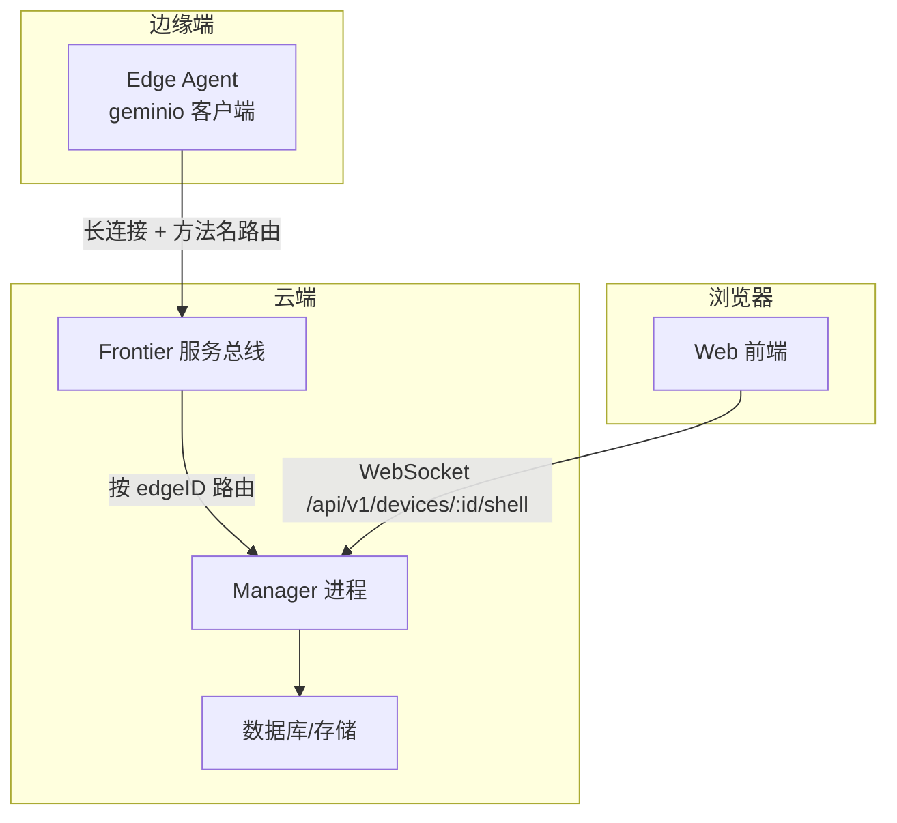
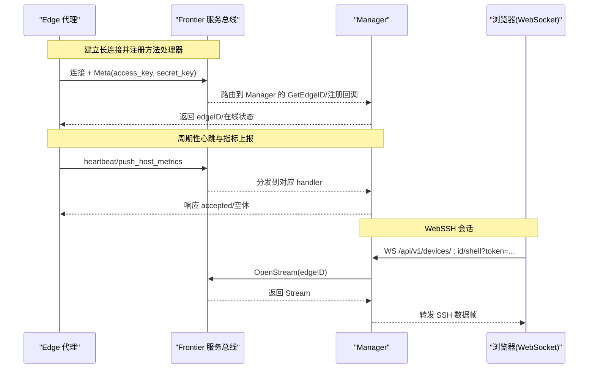
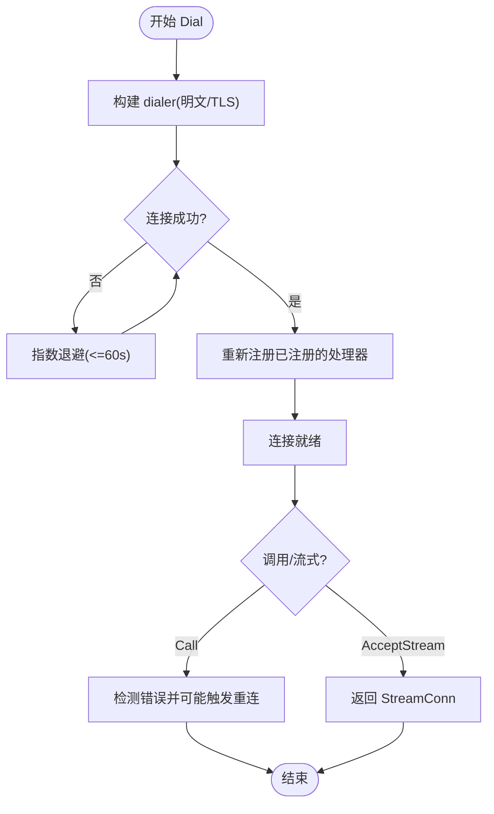
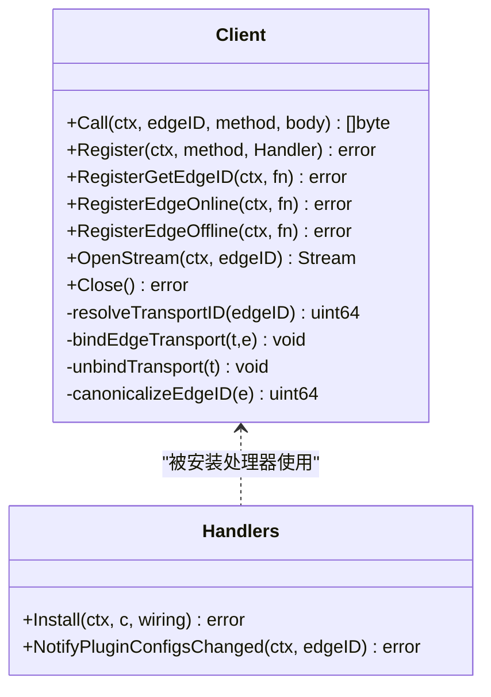
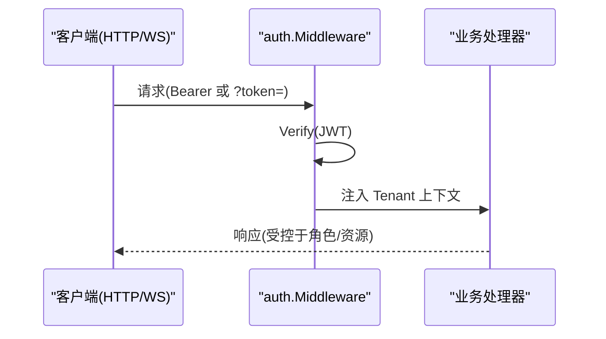
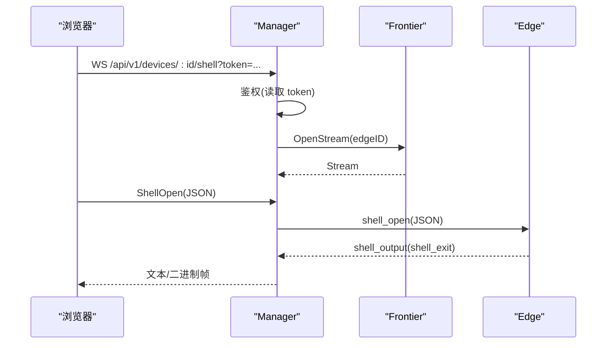
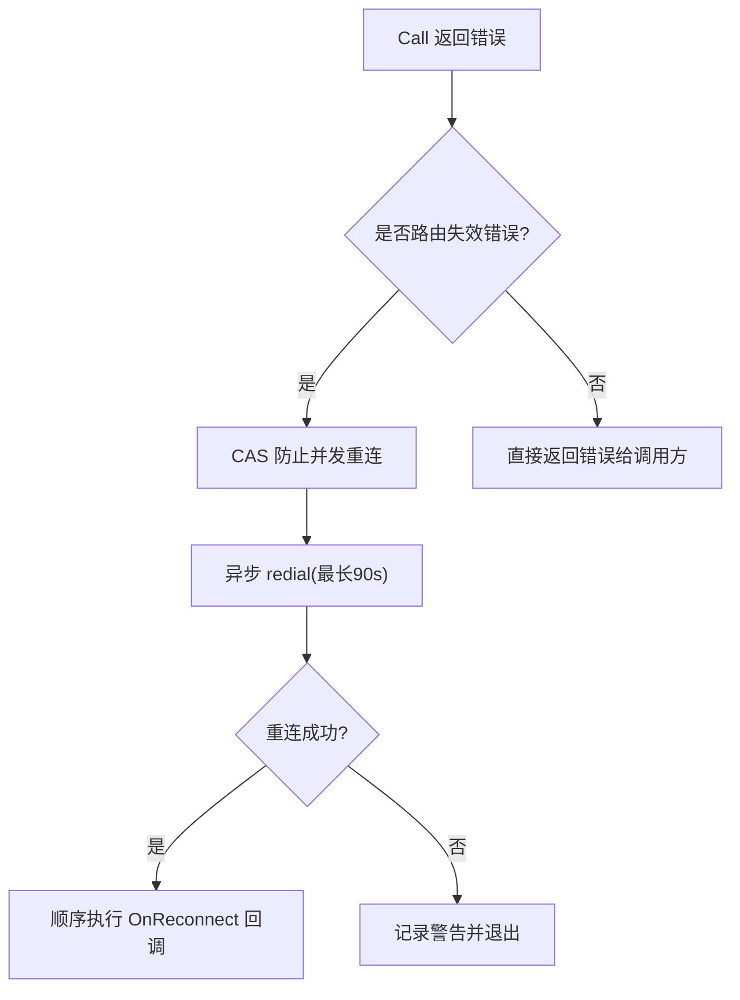
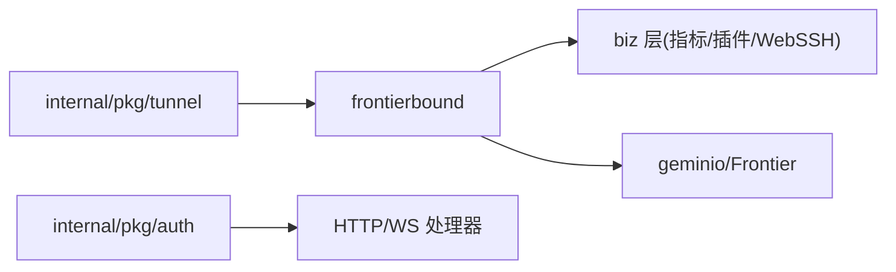

# 服务间通信机制

<cite>
**本文引用的文件**   
- [tunnel.proto](file://api/tunnel/v1/tunnel.proto)
- [messages.go](file://internal/pkg/tunnel/messages.go)
- [client.go](file://internal/pkg/tunnel/client.go)
- [host_files.go](file://internal/pkg/tunnel/host_files.go)
- [frontierbound_client.go](file://internal/manager/service/frontierbound/client.go)
- [frontierbound_handlers.go](file://internal/manager/service/frontierbound/handlers.go)
- [main.go](file://cmd/ongrid/main.go)
- [jwt.go](file://internal/pkg/auth/jwt.go)
- [middleware.go](file://internal/pkg/auth/middleware.go)
- [webshell.ts](file://web/src/api/webshell.ts)
</cite>

## 目录
1. [简介](#简介)
2. [项目结构](#项目结构)
3. [核心组件](#核心组件)
4. [架构总览](#架构总览)
5. [详细组件分析](#详细组件分析)
6. [依赖关系分析](#依赖关系分析)
7. [性能与可靠性](#性能与可靠性)
8. [故障排查指南](#故障排查指南)
9. [结论](#结论)
10. [附录：消息与方法清单](#附录消息与方法清单)

## 简介
本文件系统化阐述 OnGrid 的服务间通信机制，重点覆盖以下方面：
- gRPC 接口定义与服务发现：基于 geminio 的隧道协议（非标准 gRPC），通过 Frontier 服务总线进行服务发现与路由。
- tunnel.proto 协议设计与消息格式规范：以 JSON 为线框格式，方法名驱动的路由模型。
- Frontier 消息中间件使用模式：注册、心跳、指标上报、插件配置拉取与推送、WebSSH 流式通道等。
- WebSocket 连接管理与实时通信：浏览器到 Manager 的 WebSSH 会话，包含认证、子协议协商、控制帧与数据帧。
- 服务间认证授权：Edge 侧 AccessKey/SecretKey 认证；HTTP/WebSocket 侧 JWT 鉴权与租户上下文注入。
- 错误重试与断线重连：指数退避、broker 路由失效检测与自动重拨。
- 性能优化策略、负载均衡与服务治理：批量化上报、去重、设备 ID 映射、可降级路径与禁用模式。

## 项目结构
围绕“服务间通信”的关键代码分布在如下位置：
- API 契约：api/tunnel/v1/tunnel.proto
- 内部消息体与方法常量：internal/pkg/tunnel/messages.go
- Edge 侧隧道客户端实现：internal/pkg/tunnel/client.go
- Manager 侧 Frontier 绑定层（服务发现、反向调用、生命周期）：internal/manager/service/frontierbound/*
- 应用启动与装配：cmd/ongrid/main.go
- HTTP/WebSocket 鉴权：internal/pkg/auth/*
- 前端 WebSSH 客户端：web/src/api/webshell.ts

图表来源
- [client.go:1-120](file://internal/pkg/tunnel/client.go#L1-L120)
- [frontierbound_client.go:60-120](file://internal/manager/service/frontierbound/client.go#L60-L120)
- [main.go:865-900](file://cmd/ongrid/main.go#L865-L900)
- [webshell.ts:36-58](file://web/src/api/webshell.ts#L36-L58)

章节来源
- [client.go:1-120](file://internal/pkg/tunnel/client.go#L1-L120)
- [frontierbound_client.go:60-120](file://internal/manager/service/frontierbound/client.go#L60-L120)
- [main.go:865-900](file://cmd/ongrid/main.go#L865-L900)
- [webshell.ts:36-58](file://web/src/api/webshell.ts#L36-L58)

## 核心组件
- Tunnel 协议与消息体
  - 协议说明：MVP 阶段采用 JSON 编码，方法名作为 RPC 标识，不声明 gRPC Service。
  - 消息类型：HostInfo、Heartbeat、PushHostMetrics、GetHostLoad、GetProcessList、GetNetstat、Shell*、PluginConfig、AgentUpgrade/FetchPackage/ApplyPackage 等。
- Edge 隧道客户端
  - 负责建立与 Frontier 的长连接、自动重连、方法注册、Call/Stream 封装、OnReconnect 回调。
- Manager 侧 Frontier 绑定层
  - 负责与 Frontier 建立服务连接、安装反向调用处理器、处理 Edge 上线/下线、解析 edgeID 与 transportID 映射、将业务逻辑接入指标/插件配置/WebSSH 等子系统。
- 认证与授权
  - Edge 侧：AccessKey/SecretKey 在握手 Meta 中传递，Manager 侧校验并返回 canonical edgeID。
  - HTTP/WebSocket 侧：JWT Bearer 或 ?token= 查询参数，鉴权后注入 tenantctx.Tenant。
- 实时通信（WebSSH）
  - 浏览器通过 WebSocket 连接到 Manager，Manager 经 Frontier 打开到 Edge 的字节流，转发 SSH 数据。

章节来源
- [tunnel.proto:1-166](file://api/tunnel/v1/tunnel.proto#L1-L166)
- [messages.go:1-120](file://internal/pkg/tunnel/messages.go#L1-L120)
- [client.go:1-120](file://internal/pkg/tunnel/client.go#L1-L120)
- [frontierbound_handlers.go:80-150](file://internal/manager/service/frontierbound/handlers.go#L80-L150)
- [jwt.go:1-100](file://internal/pkg/auth/jwt.go#L1-L100)
- [middleware.go:1-68](file://internal/pkg/auth/middleware.go#L1-L68)
- [webshell.ts:1-103](file://web/src/api/webshell.ts#L1-L103)

## 架构总览
整体通信链路分为两条主线：
- 管理面（Edge → Manager）：Edge 通过 geminio 长连接至 Frontier，按方法名发起 register_edge、heartbeat、push_host_metrics、get_plugin_configs 等请求；Manager 通过 frontierbound 安装对应处理器完成业务处理。
- 交互面（Browser → Manager → Edge）：浏览器通过 WebSocket 与 Manager 建立 WebSSH 会话，Manager 通过 Frontier 打开到目标 Edge 的字节流，双向转发终端 I/O。

图表来源
- [client.go:60-140](file://internal/pkg/tunnel/client.go#L60-L140)
- [frontierbound_handlers.go:189-284](file://internal/manager/service/frontierbound/handlers.go#L189-L284)
- [webshell.ts:36-58](file://web/src/api/webshell.ts#L36-L58)
- [frontierbound_client.go:218-242](file://internal/manager/service/frontierbound/client.go#L218-L242)

## 详细组件分析

### 协议与消息体设计（tunnel.proto 与 messages.go）
- 协议形态
  - 无 gRPC Service 声明，方法名为字符串常量，如 register_edge、heartbeat、push_host_metrics、get_host_load、get_process_list、get_netstat、execute_skill、get_plugin_configs、plugin_configs_changed、write_database_metrics_secret、shell_*、agent_upgrade、fetch_package、apply_package。
  - 线框格式为 JSON，字段名与 proto json_name 保持一致，便于未来切换到二进制时仅替换序列化层。
- 关键消息
  - HostInfo：主机静态信息（hostname/os/arch/kernel_version/cpu_count/mem_total_bytes）。
  - HeartbeatRequest/Response：携带时间戳与可选状态位，支持插件健康信息。
  - PushHostMetricsRequest/Response：批量主机指标点，服务端返回 accepted 计数。
  - GetHostLoad/GetProcessList/GetNetstat：云→边查询类请求。
  - ShellOpen/Output/Exit 等：WebSSH 控制与数据帧。
  - PluginConfig 快照与变更通知：edge 主动拉取，cloud 可推送变更。
  - AgentUpgrade/FetchPackage/ApplyPackage：边缘代理升级流程。

章节来源
- [tunnel.proto:14-166](file://api/tunnel/v1/tunnel.proto#L14-L166)
- [messages.go:15-80](file://internal/pkg/tunnel/messages.go#L15-L80)
- [messages.go:213-270](file://internal/pkg/tunnel/messages.go#L213-L270)
- [messages.go:276-350](file://internal/pkg/tunnel/messages.go#L276-L350)
- [messages.go:380-433](file://internal/pkg/tunnel/messages.go#L380-L433)
- [messages.go:439-502](file://internal/pkg/tunnel/messages.go#L439-L502)

### Edge 隧道客户端（internal/pkg/tunnel/client.go）
- 连接与重连
  - Dial 使用指数退避（1s~60s）建立连接；底层 RetryEnd 处理 TCP 级断开。
  - 支持 TLS（CA 文件）与明文两种 dialer。
- 方法注册与调用
  - RegisterHandler 支持在 Dial 前后注册 cloud→edge 的处理器；Dial 成功后会重新注册。
  - Call 对 JSON 编解码、错误包装、远程错误传播进行统一处理。
- 自动重连与回调
  - maybeKickReconnect 识别 broker 路由失效错误（包含 not found/mismatch clientID），触发异步重拨并在成功时顺序执行 OnReconnect 回调。
- 流式通道
  - AcceptStream 暴露 StreamConn，供上层复用（例如 WebSSH 场景）。

图表来源
- [client.go:62-141](file://internal/pkg/tunnel/client.go#L62-L141)
- [client.go:218-243](file://internal/pkg/tunnel/client.go#L218-L243)
- [client.go:258-331](file://internal/pkg/tunnel/client.go#L258-L331)

章节来源
- [client.go:1-120](file://internal/pkg/tunnel/client.go#L1-L120)
- [client.go:218-331](file://internal/pkg/tunnel/client.go#L218-L331)

### Manager 侧 Frontier 绑定层（frontierbound）
- 连接与生命周期
  - New 建立与 Frontier 的连接，支持 ServiceName 标识；NewDisabled 提供测试/降级路径。
  - Install 注册所有反向调用处理器与生命周期回调（GetEdgeID、EdgeOnline、EdgeOffline）。
- 认证与会话绑定
  - GetEdgeID 解析 Meta(JSON)，调用 EdgeAuthn 验证 access_key/secret_key，返回 canonical edgeID。
  - EdgeOnline/EdgeOffline 维护 transportID ↔ edgeID 的双向映射，确保后续 push 能正确标注 device_id。
- 业务集成
  - register_edge：持久化 HostInfo、更新在线状态。
  - heartbeat：更新 last_seen_at，附带插件健康信息。
  - push_host_metrics/push_prom_samples：根据 DeviceResolver 解析 host device_id，再写入指标系统；当未就绪或 Prom 禁用时优雅降级。
  - get_plugin_configs：按需注册，返回插件配置快照。
  - shell_output/shell_exit：将边缘输出推送到 WebSSH 会话桥。
- 云→边调用
  - NotifyPluginConfigsChanged：推送配置变更通知（空体），边端自行拉取最新配置。
  - WriteDatabaseMetricsSecrets：批量下发数据库导出器凭据文件。

图表来源
- [frontierbound_client.go:49-126](file://internal/manager/service/frontierbound/client.go#L49-L126)
- [frontierbound_handlers.go:80-150](file://internal/manager/service/frontierbound/handlers.go#L80-L150)
- [frontierbound_handlers.go:452-465](file://internal/manager/service/frontierbound/handlers.go#L452-L465)

章节来源
- [frontierbound_client.go:60-126](file://internal/manager/service/frontierbound/client.go#L60-L126)
- [frontierbound_handlers.go:189-388](file://internal/manager/service/frontierbound/handlers.go#L189-L388)
- [frontierbound_handlers.go:452-465](file://internal/manager/service/frontierbound/handlers.go#L452-L465)

### 认证与授权
- Edge 侧认证
  - 连接 Meta 中包含 access_key/secret_key；Manager 的 GetEdgeID 回调进行校验，失败则拒绝连接。
- HTTP/WebSocket 鉴权
  - auth.Middleware 从 Authorization: Bearer 或 ?token= 提取 JWT，校验签名与过期，注入 tenantctx.Tenant（含 user_id/email/role/is_superuser）。
  - 权限检查在下游 handler 中基于 tenantctx.From 进行。

图表来源
- [jwt.go:32-100](file://internal/pkg/auth/jwt.go#L32-L100)
- [middleware.go:21-68](file://internal/pkg/auth/middleware.go#L21-L68)

章节来源
- [frontierbound_handlers.go:111-128](file://internal/manager/service/frontierbound/handlers.go#L111-L128)
- [jwt.go:32-100](file://internal/pkg/auth/jwt.go#L32-L100)
- [middleware.go:21-68](file://internal/pkg/auth/middleware.go#L21-L68)

### WebSocket 连接管理与实时通信（WebSSH）
- 浏览器侧
  - openShellSocket 构造 ws/wss URL，附加 token 查询参数，协商子协议 ongrid.shell.v1。
  - 首帧发送 ShellOpen（cols/rows/term/ssh_user/ssh_pass/ssh_host），随后发送 resize/close 控制帧。
- 服务器侧
  - Manager 接收 WS 请求，鉴权通过后，通过 frontierbound.OpenStream 打开到 Edge 的字节流，并将 SSH 数据双向转发。
  - 边缘侧收到 shell_open 后本地连接 sshd，回传 shell_output/shell_exit。

图表来源
- [webshell.ts:36-99](file://web/src/api/webshell.ts#L36-L99)
- [frontierbound_client.go:218-242](file://internal/manager/service/frontierbound/client.go#L218-L242)
- [frontierbound_handlers.go:420-447](file://internal/manager/service/frontierbound/handlers.go#L420-L447)

章节来源
- [webshell.ts:1-103](file://web/src/api/webshell.ts#L1-L103)
- [frontierbound_handlers.go:420-447](file://internal/manager/service/frontierbound/handlers.go#L420-L447)

### Frontier 消息中间件使用模式
- 发布订阅
  - 云→边：plugin_configs_changed 通知，边端拉取最新配置。
  - 边→云：push_host_metrics、push_prom_samples 批量上报。
- 点对点通信
  - 云→边：get_host_load、get_process_list、get_netstat、execute_skill、shell_*、agent_upgrade/fetch_package/apply_package。
  - 边→云：register_edge、heartbeat、get_plugin_configs。
- 消息路由
  - 基于方法名与 edgeID 路由；Manager 维护 transportID↔edgeID 映射，确保指标/日志/追踪标签正确。

章节来源
- [messages.go:15-80](file://internal/pkg/tunnel/messages.go#L15-L80)
- [frontierbound_handlers.go:189-447](file://internal/manager/service/frontierbound/handlers.go#L189-L447)

### 错误重试与断线重连
- Edge 侧
  - Dial 指数退避；maybeKickReconnect 识别 broker 路由失效错误，触发独立 goroutine 重拨，并在成功时执行 OnReconnect 回调。
- Manager 侧
  - Install 注册处理器等待 broker ACK，存在可见性 race 防护注释；NewDisabled 提供降级路径，避免强依赖外部总线。

图表来源
- [client.go:258-331](file://internal/pkg/tunnel/client.go#L258-L331)
- [main.go:1189-1223](file://cmd/ongrid/main.go#L1189-L1223)

章节来源
- [client.go:258-331](file://internal/pkg/tunnel/client.go#L258-L331)
- [main.go:1189-1223](file://cmd/ongrid/main.go#L1189-L1223)

## 依赖关系分析
- 模块耦合
  - internal/pkg/tunnel 保持 biz 无关，仅定义方法与消息体，降低耦合度。
  - frontierbound 通过接口抽象（MetricIngester、PromwriteIngester、DeviceResolver、WebshellRouter）解耦具体业务实现。
- 外部依赖
  - geminio 提供 End/RetryEnd/Stream 能力；Frontier 作为服务总线承担路由与发现。
- 潜在循环依赖
  - 通过接口与 Wiring 注入避免循环；handlers 不直接 import biz 包，而是通过窄接口。

图表来源
- [frontierbound_handlers.go:16-78](file://internal/manager/service/frontierbound/handlers.go#L16-L78)
- [client.go:1-21](file://internal/pkg/tunnel/client.go#L1-L21)

章节来源
- [frontierbound_handlers.go:16-78](file://internal/manager/service/frontierbound/handlers.go#L16-L78)
- [client.go:1-21](file://internal/pkg/tunnel/client.go#L1-L21)

## 性能与可靠性
- 批量化与去重
  - push_host_metrics/push_prom_samples 支持批量上报，服务端返回 accepted 计数，便于边端统计与重试策略。
- 设备 ID 映射
  - 通过 DeviceResolver 将 edge_id 解析为 host device_id，避免历史污染与标签漂移。
- 可降级与禁用模式
  - Prom 禁用时静默接受并丢弃样本，避免边端频繁重试；NewDisabled 使 manager 在无 Frontier 环境下仍可启动。
- 连接稳定性
  - 指数退避 + 路由失效检测 + OnReconnect 回调，保障长时间运行下的自愈能力。
- 负载均衡与服务治理
  - 当前实现以单实例 Frontier 为中心；若需水平扩展，可在 Frontier 层引入多实例与一致性哈希路由，并结合健康检查与权重调整。

[本节为通用指导，无需源码引用]

## 故障排查指南
- Edge 无法注册或持续报 record not found
  - 检查 GetEdgeID 认证是否成功；确认 EdgeOnline 绑定的 transportID↔edgeID 是否建立；查看 register_edge 是否先于其他方法到达。
- 指标缺失或标签异常
  - 确认 DeviceResolver 能解析到 host device_id；若未就绪，push 会被丢弃且 accepted=0，需要等待 register_edge 完成。
- WebSSH 无法连接
  - 检查浏览器 token 是否正确传入；确认 Manager 能 OpenStream 到目标 edgeID；查看 shell_output/shell_exit 是否到达。
- 插件配置未生效
  - 确认 plugin_configs_changed 推送是否成功；边端是否在 60s 安全网内拉取到最新快照。

章节来源
- [frontierbound_handlers.go:189-388](file://internal/manager/service/frontierbound/handlers.go#L189-L388)
- [client.go:258-331](file://internal/pkg/tunnel/client.go#L258-L331)
- [webshell.ts:36-99](file://web/src/api/webshell.ts#L36-L99)

## 结论
OnGrid 的服务间通信以 geminio 隧道为核心，结合 Frontier 服务总线实现可靠、可扩展的云边通信。通过方法名路由与 JSON 消息体，系统在 MVP 阶段保持了简洁与演进弹性；同时借助 JWT 与 AccessKey/SecretKey 双重认证，保障了跨域访问的安全性。在可靠性方面，指数退避、路由失效检测与 OnReconnect 回调构成了稳定的自愈闭环；在性能方面，批量上报、设备 ID 映射与可降级路径确保了高吞吐与低抖动。未来可在 Frontier 层引入多实例与更精细的负载均衡策略，进一步提升系统规模与可用性。

[本节为总结，无需源码引用]

## 附录：消息与方法清单
- 方法名（部分）
  - register_edge、heartbeat、push_host_metrics、push_prom_samples、get_host_load、get_process_list、get_netstat、execute_skill、get_plugin_configs、plugin_configs_changed、write_database_metrics_secret、shell_open、shell_input、shell_resize、shell_close、shell_output、shell_exit、agent_upgrade、fetch_package、apply_package
- 典型消息体
  - HostInfo、HeartbeatRequest/Response、PushHostMetricsRequest/Response、GetHostLoadResponse、GetProcessListRequest/Response、GetNetstatRequest/Response、ShellOpenRequest/Response、ShellInputRequest/Response、ShellResizeRequest/Response、ShellCloseRequest/Response、ShellOutputRequest/Response、ShellExitRequest/Response、GetPluginConfigsResponse、WriteDatabaseMetricsSecretsRequest/Response、ExecuteSkillRequest/Response、AgentUpgradeRequest/Response、FetchPackageRequest/Response、ApplyPackageRequest/Response、Meta

章节来源
- [messages.go:15-80](file://internal/pkg/tunnel/messages.go#L15-L80)
- [messages.go:82-208](file://internal/pkg/tunnel/messages.go#L82-L208)
- [messages.go:213-502](file://internal/pkg/tunnel/messages.go#L213-L502)