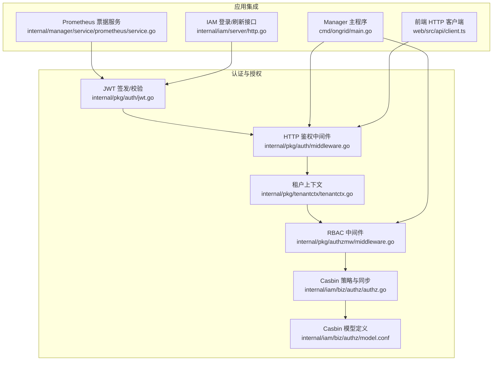
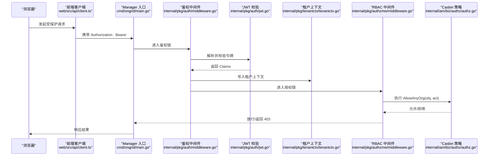
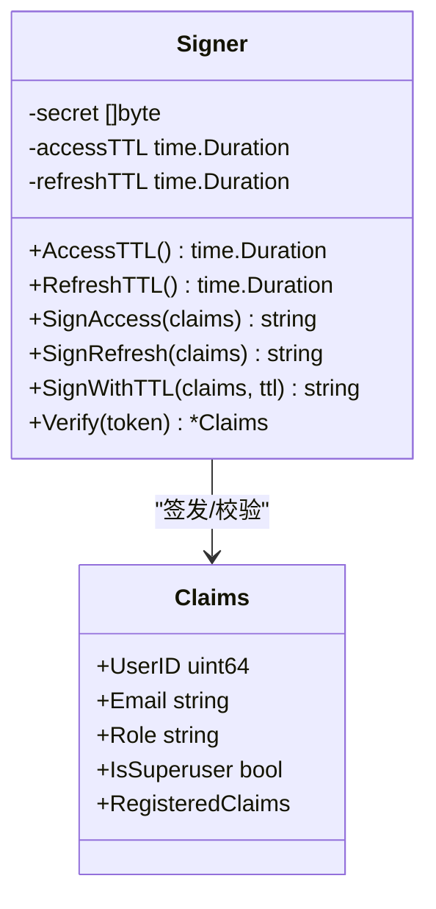
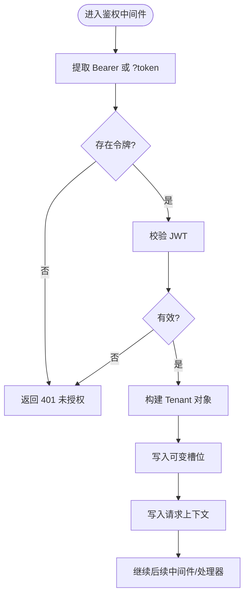
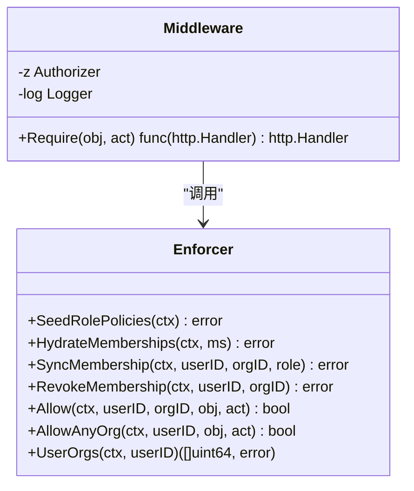
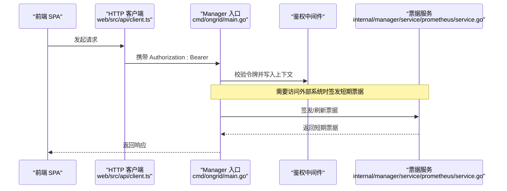
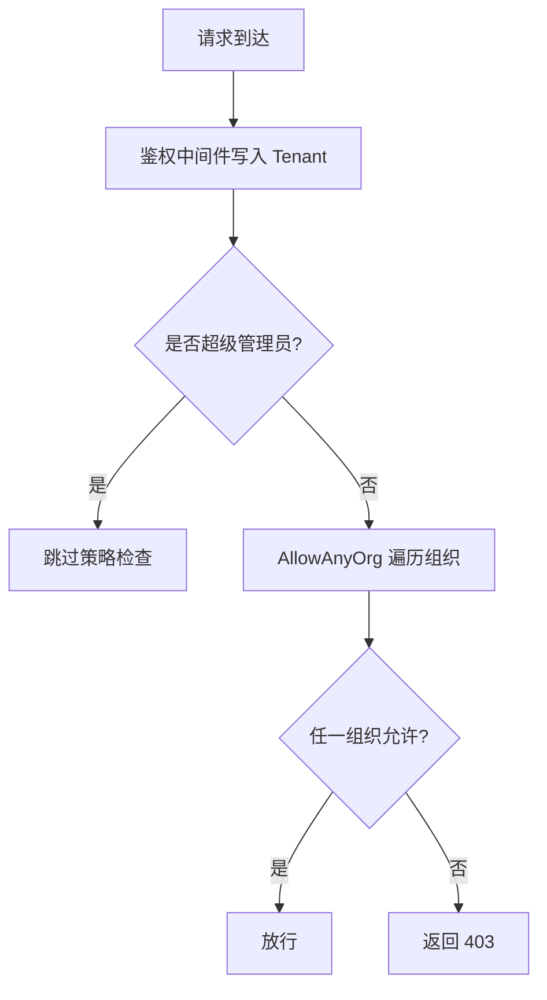
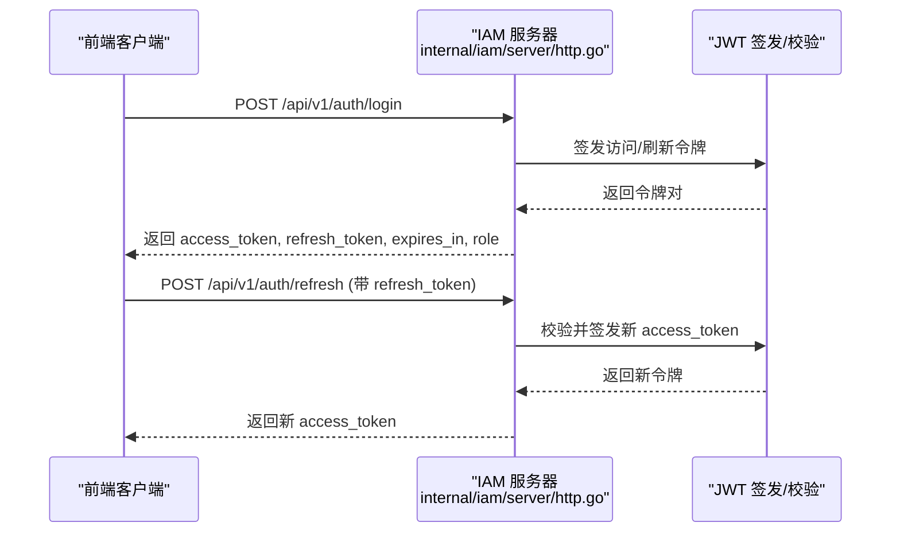
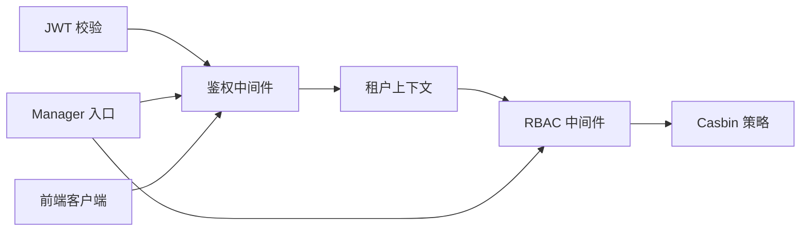

# 认证授权机制

<cite>
**本文引用的文件**   
- [internal/pkg/auth/jwt.go](file://internal/pkg/auth/jwt.go)
- [internal/pkg/auth/middleware.go](file://internal/pkg/auth/middleware.go)
- [internal/pkg/tenantctx/tenantctx.go](file://internal/pkg/tenantctx/tenantctx.go)
- [internal/pkg/authzmw/middleware.go](file://internal/pkg/authzmw/middleware.go)
- [internal/iam/biz/authz/authz.go](file://internal/iam/biz/authz/authz.go)
- [internal/iam/biz/authz/model.conf](file://internal/iam/biz/authz/model.conf)
- [cmd/ongrid/main.go](file://cmd/ongrid/main.go)
- [internal/manager/service/prometheus/service.go](file://internal/manager/service/prometheus/service.go)
- [web/src/api/client.ts](file://web/src/api/client.ts)
- [tests/e2e/auth_refresh_test.go](file://tests/e2e/auth_refresh_test.go)
- [internal/iam/server/http.go](file://internal/iam/server/http.go)
</cite>

## 目录
1. [简介](#简介)
2. [项目结构](#项目结构)
3. [核心组件](#核心组件)
4. [架构总览](#架构总览)
5. [详细组件分析](#详细组件分析)
6. [依赖关系分析](#依赖关系分析)
7. [性能与可扩展性](#性能与可扩展性)
8. [故障排查指南](#故障排查指南)
9. [结论](#结论)
10. [附录](#附录)

## 简介
本文件系统化阐述服务间认证与授权的实现，覆盖以下主题：
- JWT 令牌的生成、验证与传播（含令牌结构、签名算法、过期策略）
- 跨服务调用时的身份传递（HTTP 头注入、gRPC 元数据传递、上下文传播）
- RBAC 权限模型在服务间的落地（角色继承、权限继承、动态权限检查）
- 多租户环境下的隔离机制（租户标识传递、资源访问控制、数据隔离）
- 安全最佳实践（令牌轮换、防重放攻击、敏感信息保护）
- 配置示例与安全审计方法

## 项目结构
认证与授权相关代码主要分布在如下位置：
- 通用认证包：JWT 签发/校验、HTTP 鉴权中间件
- 租户上下文：将已认证的调用者身份注入请求上下文
- 授权中间件：基于 Casbin 的 RBAC 决策
- IAM 业务层：角色与成员关系的同步、策略注入
- 前端客户端：自动注入 Authorization 头并处理刷新流程
- Manager 侧集成：Prometheus 票据签发与校验、入口路由挂载中间件

**图表来源**
- [internal/pkg/auth/jwt.go:1-100](file://internal/pkg/auth/jwt.go#L1-L100)
- [internal/pkg/auth/middleware.go:1-68](file://internal/pkg/auth/middleware.go#L1-L68)
- [internal/pkg/tenantctx/tenantctx.go:1-87](file://internal/pkg/tenantctx/tenantctx.go#L1-L87)
- [internal/pkg/authzmw/middleware.go:1-98](file://internal/pkg/authzmw/middleware.go#L1-L98)
- [internal/iam/biz/authz/authz.go:1-316](file://internal/iam/biz/authz/authz.go#L1-L316)
- [internal/iam/biz/authz/model.conf:1-15](file://internal/iam/biz/authz/model.conf#L1-L15)
- [cmd/ongrid/main.go:2376-2416](file://cmd/ongrid/main.go#L2376-L2416)
- [internal/manager/service/prometheus/service.go:81-126](file://internal/manager/service/prometheus/service.go#L81-L126)
- [web/src/api/client.ts:1-162](file://web/src/api/client.ts#L1-L162)
- [internal/iam/server/http.go:116-155](file://internal/iam/server/http.go#L116-L155)

**章节来源**
- [internal/pkg/auth/jwt.go:1-100](file://internal/pkg/auth/jwt.go#L1-L100)
- [internal/pkg/auth/middleware.go:1-68](file://internal/pkg/auth/middleware.go#L1-L68)
- [internal/pkg/tenantctx/tenantctx.go:1-87](file://internal/pkg/tenantctx/tenantctx.go#L1-L87)
- [internal/pkg/authzmw/middleware.go:1-98](file://internal/pkg/authzmw/middleware.go#L1-L98)
- [internal/iam/biz/authz/authz.go:1-316](file://internal/iam/biz/authz/authz.go#L1-L316)
- [internal/iam/biz/authz/model.conf:1-15](file://internal/iam/biz/authz/model.conf#L1-L15)
- [cmd/ongrid/main.go:2376-2416](file://cmd/ongrid/main.go#L2376-L2416)
- [internal/manager/service/prometheus/service.go:81-126](file://internal/manager/service/prometheus/service.go#L81-L126)
- [web/src/api/client.ts:1-162](file://web/src/api/client.ts#L1-L162)
- [internal/iam/server/http.go:116-155](file://internal/iam/server/http.go#L116-L155)

## 核心组件
- JWT 签发与校验
  - 使用 HMAC-SHA256 对 Claims 进行签名；Claims 包含用户标识、邮箱、角色、超级管理员标志以及标准时间字段。
  - 提供短生命周期访问令牌与长生命周期刷新令牌两种签发能力，支持自定义 TTL 的内部票据。
- HTTP 鉴权中间件
  - 从 Authorization: Bearer 或查询参数 token 提取令牌，校验后写入租户上下文，供下游读取。
- 租户上下文
  - 通过 context.Context 在请求链路中传递已认证的用户身份，并提供“可变槽位”以便外层中间件也能读取内层中间件写入的身份。
- RBAC 授权中间件
  - 基于 Casbin 的策略引擎，支持按对象与动作进行细粒度授权；超级管理员可短路绕过策略检查。
- Casbin 策略与模型
  - 模型定义主体、域、对象、动作四元组；策略矩阵在启动时注入，成员关系映射为分组策略。
- 前端客户端
  - 自动附加 Authorization 头，并在访问令牌过期时通过刷新接口获取新令牌。
- Prometheus 票据服务
  - 签发仅用于内部代理跳转的短期票据，支持刷新与校验。

**章节来源**
- [internal/pkg/auth/jwt.go:1-100](file://internal/pkg/auth/jwt.go#L1-L100)
- [internal/pkg/auth/middleware.go:1-68](file://internal/pkg/auth/middleware.go#L1-L68)
- [internal/pkg/tenantctx/tenantctx.go:1-87](file://internal/pkg/tenantctx/tenantctx.go#L1-L87)
- [internal/pkg/authzmw/middleware.go:1-98](file://internal/pkg/authzmw/middleware.go#L1-L98)
- [internal/iam/biz/authz/authz.go:1-316](file://internal/iam/biz/authz/authz.go#L1-L316)
- [internal/iam/biz/authz/model.conf:1-15](file://internal/iam/biz/authz/model.conf#L1-L15)
- [web/src/api/client.ts:1-162](file://web/src/api/client.ts#L1-L162)
- [internal/manager/service/prometheus/service.go:81-126](file://internal/manager/service/prometheus/service.go#L81-L126)

## 架构总览
下图展示一次受保护的 API 请求从浏览器到后端鉴权与授权的完整路径。

**图表来源**
- [web/src/api/client.ts:1-162](file://web/src/api/client.ts#L1-L162)
- [cmd/ongrid/main.go:2376-2416](file://cmd/ongrid/main.go#L2376-L2416)
- [internal/pkg/auth/middleware.go:1-68](file://internal/pkg/auth/middleware.go#L1-L68)
- [internal/pkg/auth/jwt.go:1-100](file://internal/pkg/auth/jwt.go#L1-L100)
- [internal/pkg/tenantctx/tenantctx.go:1-87](file://internal/pkg/tenantctx/tenantctx.go#L1-L87)
- [internal/pkg/authzmw/middleware.go:1-98](file://internal/pkg/authzmw/middleware.go#L1-L98)
- [internal/iam/biz/authz/authz.go:1-316](file://internal/iam/biz/authz/authz.go#L1-L316)

## 详细组件分析

### JWT 令牌结构与生命周期
- 令牌结构
  - 标准声明：exp、iat、sub 等由 RegisteredClaims 提供
  - 业务声明：user_id、email、role、is_superuser
- 签名算法
  - HS256（HMAC-SHA256），密钥来自运行时配置
- 过期策略
  - 访问令牌：短 TTL，适合频繁校验
  - 刷新令牌：长 TTL，用于换取新的访问令牌
  - 内部票据：可自定义 TTL，用于服务间短跳转发
- 关键行为
  - 校验失败统一返回未授权错误
  - 旧令牌兼容：无 is_superuser 时回退 role=="admin"

**图表来源**
- [internal/pkg/auth/jwt.go:1-100](file://internal/pkg/auth/jwt.go#L1-L100)

**章节来源**
- [internal/pkg/auth/jwt.go:1-100](file://internal/pkg/auth/jwt.go#L1-L100)

### HTTP 鉴权中间件与上下文传播
- 令牌来源
  - Authorization: Bearer <token>
  - 查询参数 token（WebSocket 场景）
- 上下文传播
  - 校验成功后将 Tenant 写入请求上下文
  - 通过“可变槽位”使外层中间件也能读取内层写入的身份
- 错误处理
  - 缺失或无效令牌直接返回 401

**图表来源**
- [internal/pkg/auth/middleware.go:1-68](file://internal/pkg/auth/middleware.go#L1-L68)
- [internal/pkg/tenantctx/tenantctx.go:1-87](file://internal/pkg/tenantctx/tenantctx.go#L1-L87)

**章节来源**
- [internal/pkg/auth/middleware.go:1-68](file://internal/pkg/auth/middleware.go#L1-L68)
- [internal/pkg/tenantctx/tenantctx.go:1-87](file://internal/pkg/tenantctx/tenantctx.go#L1-L87)

### RBAC 授权模型与动态检查
- 模型与策略
  - 模型定义：r = sub, dom, obj, act；p = sub, dom, obj, act；g = _, _, _
  - 匹配器：支持通配符与 keyMatch 对象匹配
  - 角色矩阵：org_admin、member、viewer 三类角色，启动时注入
- 成员关系同步
  - 将组织成员关系映射为 Casbin 分组策略 g(user, role, org)
  - 支持单条增删、批量同步、按用户/组织撤销
- 动态检查
  - 中间件先判断是否超级管理员，再尝试 AllowAnyOrg 遍历用户所属组织
  - 未授权返回 403

**图表来源**
- [internal/pkg/authzmw/middleware.go:1-98](file://internal/pkg/authzmw/middleware.go#L1-L98)
- [internal/iam/biz/authz/authz.go:1-316](file://internal/iam/biz/authz/authz.go#L1-L316)
- [internal/iam/biz/authz/model.conf:1-15](file://internal/iam/biz/authz/model.conf#L1-L15)

**章节来源**
- [internal/pkg/authzmw/middleware.go:1-98](file://internal/pkg/authzmw/middleware.go#L1-L98)
- [internal/iam/biz/authz/authz.go:1-316](file://internal/iam/biz/authz/authz.go#L1-L316)
- [internal/iam/biz/authz/model.conf:1-15](file://internal/iam/biz/authz/model.conf#L1-L15)

### 跨服务调用时的身份传递
- HTTP 头注入
  - 前端客户端在每次请求自动附加 Authorization: Bearer
  - 若访问令牌过期，客户端会调用刷新接口获取新令牌并重试
- gRPC 元数据传递
  - 当前仓库未发现 gRPC 客户端或服务端在元数据中透传 JWT 的实现
  - 建议在 gRPC 拦截器中从上下文读取 Tenant 并注入到 outgoing metadata，或在服务端拦截器中从 metadata 恢复上下文
- 上下文传播
  - 通过 tenantctx.With/From 在请求链路中传递身份
  - 对外部子系统（如 Grafana/Prometheus 代理）采用短期票据而非直接透传用户令牌

**图表来源**
- [web/src/api/client.ts:1-162](file://web/src/api/client.ts#L1-L162)
- [cmd/ongrid/main.go:2376-2416](file://cmd/ongrid/main.go#L2376-L2416)
- [internal/manager/service/prometheus/service.go:81-126](file://internal/manager/service/prometheus/service.go#L81-L126)

**章节来源**
- [web/src/api/client.ts:1-162](file://web/src/api/client.ts#L1-L162)
- [internal/manager/service/prometheus/service.go:81-126](file://internal/manager/service/prometheus/service.go#L81-L126)

### 多租户隔离机制
- 租户标识传递
  - 当前 MVP 为单租户模式，Tenant 实质为已认证用户
  - 上下文中的 Tenant 包含 UserID、Email、Role、IsSuperuser
- 资源访问控制
  - 通过 RBAC 中间件与 Casbin 策略限制对象与动作
  - 未来可通过 X-Active-Org 头指定活跃组织，走 Allow(orgID, obj, act)
- 数据隔离
  - 当前未在数据层强制按 org 过滤；建议在各仓储层增加 org_id 条件过滤

**图表来源**
- [internal/pkg/authzmw/middleware.go:1-98](file://internal/pkg/authzmw/middleware.go#L1-L98)
- [internal/iam/biz/authz/authz.go:1-316](file://internal/iam/biz/authz/authz.go#L1-L316)

**章节来源**
- [internal/pkg/tenantctx/tenantctx.go:1-87](file://internal/pkg/tenantctx/tenantctx.go#L1-L87)
- [internal/pkg/authzmw/middleware.go:1-98](file://internal/pkg/authzmw/middleware.go#L1-L98)
- [internal/iam/biz/authz/authz.go:1-316](file://internal/iam/biz/authz/authz.go#L1-L316)

### 登录与刷新流程
- 登录
  - 公开接口 /v1/auth/login 返回 access_token、refresh_token、expires_in、role
- 刷新
  - 公开接口 /v1/auth/refresh 使用 refresh_token 换取新的 access_token
  - 前端客户端在访问令牌失效时自动触发刷新并重试

**图表来源**
- [internal/iam/server/http.go:116-155](file://internal/iam/server/http.go#L116-L155)
- [internal/iam/server/http.go:271-327](file://internal/iam/server/http.go#L271-L327)
- [internal/pkg/auth/jwt.go:1-100](file://internal/pkg/auth/jwt.go#L1-L100)
- [tests/e2e/auth_refresh_test.go:37-61](file://tests/e2e/auth_refresh_test.go#L37-L61)

**章节来源**
- [internal/iam/server/http.go:116-155](file://internal/iam/server/http.go#L116-L155)
- [internal/iam/server/http.go:271-327](file://internal/iam/server/http.go#L271-L327)
- [tests/e2e/auth_refresh_test.go:37-61](file://tests/e2e/auth_refresh_test.go#L37-L61)

## 依赖关系分析
- 组件耦合
  - 鉴权中间件依赖 JWT 校验与租户上下文
  - RBAC 中间件依赖租户上下文与 Casbin 策略
  - Manager 入口将鉴权与授权中间件组合到路由组
- 外部依赖
  - Casbin 策略持久化于数据库表 casbin_rule
  - 前端客户端依赖后端刷新接口以维持会话

**图表来源**
- [internal/pkg/auth/jwt.go:1-100](file://internal/pkg/auth/jwt.go#L1-L100)
- [internal/pkg/auth/middleware.go:1-68](file://internal/pkg/auth/middleware.go#L1-L68)
- [internal/pkg/tenantctx/tenantctx.go:1-87](file://internal/pkg/tenantctx/tenantctx.go#L1-L87)
- [internal/pkg/authzmw/middleware.go:1-98](file://internal/pkg/authzmw/middleware.go#L1-L98)
- [internal/iam/biz/authz/authz.go:1-316](file://internal/iam/biz/authz/authz.go#L1-L316)
- [cmd/ongrid/main.go:2376-2416](file://cmd/ongrid/main.go#L2376-L2416)
- [web/src/api/client.ts:1-162](file://web/src/api/client.ts#L1-L162)

**章节来源**
- [internal/pkg/auth/jwt.go:1-100](file://internal/pkg/auth/jwt.go#L1-L100)
- [internal/pkg/auth/middleware.go:1-68](file://internal/pkg/auth/middleware.go#L1-L68)
- [internal/pkg/tenantctx/tenantctx.go:1-87](file://internal/pkg/tenantctx/tenantctx.go#L1-L87)
- [internal/pkg/authzmw/middleware.go:1-98](file://internal/pkg/authzmw/middleware.go#L1-L98)
- [internal/iam/biz/authz/authz.go:1-316](file://internal/iam/biz/authz/authz.go#L1-L316)
- [cmd/ongrid/main.go:2376-2416](file://cmd/ongrid/main.go#L2376-L2416)
- [web/src/api/client.ts:1-162](file://web/src/api/client.ts#L1-L162)

## 性能与可扩展性
- 令牌校验开销
  - HS256 校验成本低，适合高频鉴权
- 策略评估
  - Casbin 内存缓存策略，AllowAnyOrg 遍历用户组织集合，组织规模较小时性能良好
- 扩展建议
  - 引入 Redis 缓存用户组织列表，降低 AllowAnyOrg 的枚举成本
  - 对热点对象/动作预计算权限集，减少实时策略评估

[本节为通用指导，不直接分析具体文件]

## 故障排查指南
- 常见错误
  - 401 未授权：缺少或无效的 Bearer 令牌
  - 403 禁止访问：RBAC 策略不允许该对象/动作
- 定位步骤
  - 确认前端是否正确附加 Authorization 头
  - 检查鉴权中间件日志与错误码
  - 查看 RBAC 中间件的 deny 日志，核对对象/动作命名
  - 验证 Casbin 策略是否已正确注入与同步
- 刷新流程问题
  - 确认刷新接口可用且返回新令牌
  - 检查前端刷新逻辑是否重试成功

**章节来源**
- [internal/pkg/auth/middleware.go:1-68](file://internal/pkg/auth/middleware.go#L1-L68)
- [internal/pkg/authzmw/middleware.go:1-98](file://internal/pkg/authzmw/middleware.go#L1-L98)
- [tests/e2e/auth_refresh_test.go:37-61](file://tests/e2e/auth_refresh_test.go#L37-L61)

## 结论
本项目实现了基于 JWT 的无状态认证与基于 Casbin 的 RBAC 授权，结合租户上下文在请求链路中传播身份。前端客户端自动注入令牌并处理刷新，Manager 侧通过短期票据与外部系统集成。当前为单租户 MVP，未来可在数据层与策略层增强多租户隔离与性能优化。

[本节为总结，不直接分析具体文件]

## 附录

### 安全最佳实践
- 令牌轮换
  - 使用短 TTL 访问令牌与长 TTL 刷新令牌
  - 内部票据采用更短 TTL，必要时支持滑动续期
- 防重放攻击
  - 对敏感操作引入一次性票据或请求签名
  - 记录请求指纹（方法、路径、时间窗口）做去重
- 敏感信息保护
  - 避免在 URL 中传输令牌（仅 WebSocket 降级场景使用查询参数）
  - 不在日志中输出完整令牌或用户敏感字段
- 密钥管理
  - 生产环境必须设置强随机 JWT 密钥，拒绝默认值
  - 定期轮换密钥并支持双密钥过渡期

**章节来源**
- [cmd/ongrid/main.go:282-300](file://cmd/ongrid/main.go#L282-L300)
- [internal/pkg/auth/middleware.go:1-68](file://internal/pkg/auth/middleware.go#L1-L68)

### 配置示例
- JWT 密钥与环境变量
  - 设置强随机 JWT 密钥，拒绝内置默认值
- 访问令牌与刷新令牌 TTL
  - 根据业务需求调整 AccessTTL 与 RefreshTTL
- RBAC 策略
  - 启动时注入角色矩阵，按需扩展对象/动作
- 前端客户端
  - 确保 BASE 路径与刷新接口一致

**章节来源**
- [cmd/ongrid/main.go:282-300](file://cmd/ongrid/main.go#L282-L300)
- [internal/pkg/auth/jwt.go:1-100](file://internal/pkg/auth/jwt.go#L1-L100)
- [web/src/api/client.ts:1-162](file://web/src/api/client.ts#L1-L162)

### 安全审计方法
- 鉴权与授权日志
  - 记录未授权与禁止访问的请求，附带用户 ID、对象、动作
- 审计事件
  - 在关键操作（用户创建、角色变更）上记录审计事件
- 外部系统访问
  - 记录短期票据的签发与刷新，便于追踪外部系统调用

**章节来源**
- [internal/pkg/authzmw/middleware.go:1-98](file://internal/pkg/authzmw/middleware.go#L1-L98)
- [internal/iam/server/http.go:271-327](file://internal/iam/server/http.go#L271-L327)
- [internal/manager/service/prometheus/service.go:81-126](file://internal/manager/service/prometheus/service.go#L81-L126)