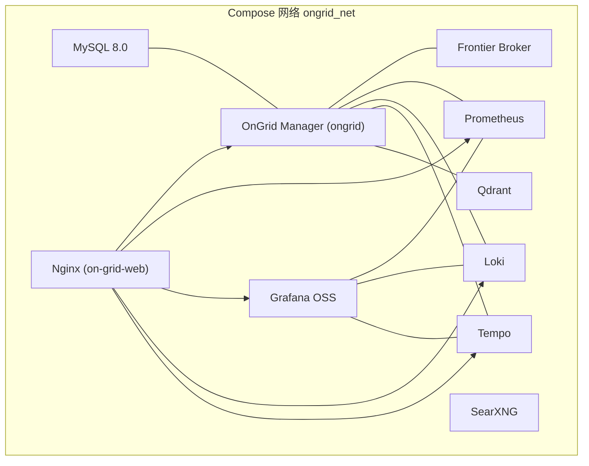
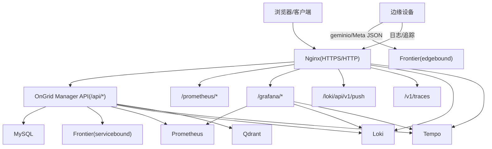
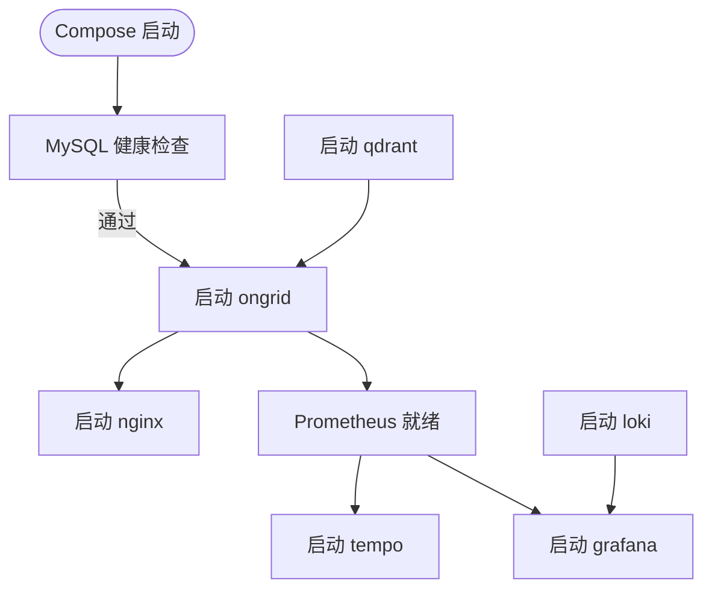
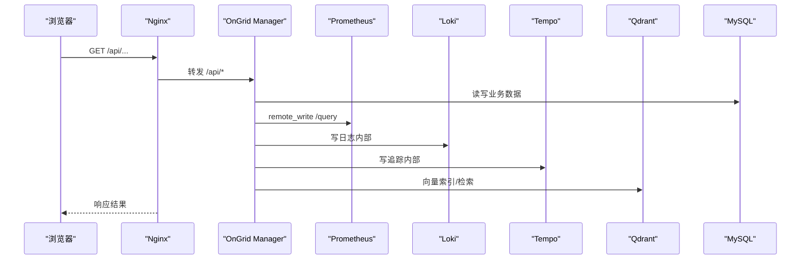

# Docker Compose 开发环境部署

<cite>
**本文引用的文件列表**
- [deploy/docker-compose.yml](file://deploy/docker-compose.yml)
- [deploy/install/docker-compose.yml](file://deploy/install/docker-compose.yml)
- [deploy/prometheus/prometheus.yml](file://deploy/prometheus/prometheus.yml)
- [deploy/grafana/provisioning/datasources/prometheus.yml](file://deploy/grafana/provisioning/datasources/prometheus.yml)
- [deploy/grafana/provisioning/datasources/loki.yml](file://deploy/grafana/provisioning/datasources/loki.yml)
- [deploy/grafana/provisioning/datasources/tempo.yml](file://deploy/grafana/provisioning/datasources/tempo.yml)
- [deploy/install/loki-config.yaml](file://deploy/install/loki-config.yaml)
- [deploy/install/tempo-config.yaml](file://deploy/install/tempo-config.yaml)
- [deploy/install/frontier.yaml](file://deploy/install/frontier.yaml)
- [deploy/nginx/nginx.conf](file://deploy/nginx/nginx.conf)
- [deploy/install/.env.example](file://deploy/install/.env.example)
- [deploy/README.md](file://deploy/README.md)
</cite>

## 目录
1. [简介](#简介)
2. [项目结构](#项目结构)
3. [核心组件](#核心组件)
4. [架构总览](#架构总览)
5. [详细组件分析](#详细组件分析)
6. [依赖关系与启动顺序](#依赖关系与启动顺序)
7. [环境变量与配置项](#环境变量与配置项)
8. [数据持久化与缓存策略](#数据持久化与缓存策略)
9. [网络拓扑与服务通信](#网络拓扑与服务通信)
10. [快速启动与停止](#快速启动与停止)
11. [故障排查指南](#故障排查指南)
12. [结论](#结论)

## 简介
本文件面向本地开发环境，详细说明 OnGrid 的 Docker Compose 编排：包括 MySQL、Frontier 消息中间件、Prometheus 时序数据库、Loki 日志聚合、Tempo 分布式追踪、Qdrant 向量数据库以及 Grafana 可视化平台的配置。文档覆盖服务启动顺序、健康检查机制、网络通信、关键环境变量（数据库连接、JWT、LLM 集成、通知渠道等）、数据卷挂载与缓存目录管理，并提供网络拓扑图与服务间通信流程图，帮助快速搭建并稳定运行开发环境。

## 项目结构
开发环境的核心编排位于 deploy/docker-compose.yml；生产风格安装资产位于 deploy/install/ 下，包含 .env 示例、各组件配置文件及 nginx 反向代理配置。Grafana 的数据源通过 provisioning 自动注入。

图表来源
- [deploy/docker-compose.yml:13-397](file://deploy/docker-compose.yml#L13-L397)
- [deploy/nginx/nginx.conf:29-54](file://deploy/nginx/nginx.conf#L29-L54)

章节来源
- [deploy/docker-compose.yml:1-397](file://deploy/docker-compose.yml#L1-L397)
- [deploy/README.md:1-130](file://deploy/README.md#L1-L130)

## 核心组件
- MySQL：默认后端数据库，提供用户、权限、业务表等结构化数据。
- Frontier：边端与云端之间的消息中转（隧道）中间件，暴露 edgebound 和 servicebound 端口。
- Prometheus：云侧时序数据库，接收 manager remote_write，并为 AIOps 查询 PromQL 提供后端。
- Loki：单二进制日志后端，仅内部端口对外暴露，边缘通过 Nginx 鉴权后推送日志。
- Tempo：单二进制追踪后端，OTLP gRPC/HTTP 接收器，spanmetrics 写入 Prometheus。
- Qdrant：向量数据库，用于知识库/RAG 的向量检索。
- Grafana：可视化平台，预置 Prometheus/Loki/Tempo 数据源，支持嵌入与钻取。
- SearXNG：内置网页搜索技能的后端元搜索引擎。
- Nginx：TLS 终止、前端 SPA、/api 反向代理、/prometheus/ 与 /grafana/ 鉴权透传、边缘数据面入口（/loki/api/v1/push、/v1/traces）。

章节来源
- [deploy/docker-compose.yml:14-360](file://deploy/docker-compose.yml#L14-L360)
- [deploy/nginx/nginx.conf:1-301](file://deploy/nginx/nginx.conf#L1-L301)

## 架构总览
下图展示了开发环境的整体架构与主要数据流：浏览器通过 Nginx 访问 API、Grafana 与 Prometheus；边缘设备通过 Frontier 建立隧道；Manager 将遥测数据写入 Prometheus/Loki/Tempo；Grafana 消费三者进行展示。

图表来源
- [deploy/docker-compose.yml:183-360](file://deploy/docker-compose.yml#L183-L360)
- [deploy/nginx/nginx.conf:140-203](file://deploy/nginx/nginx.conf#L140-L203)
- [deploy/install/frontier.yaml:15-29](file://deploy/install/frontier.yaml#L15-L29)

## 详细组件分析

### MySQL
- 镜像与版本：mysql:8.0
- 初始化参数：字符集 utf8mb4，排序规则 utf8mb4_unicode_ci
- 健康检查：使用 mysqladmin ping 探测可用性
- 端口映射：3306 暴露到宿主机（开发模式）
- 数据持久化：命名卷 mysql_data

章节来源
- [deploy/docker-compose.yml:14-38](file://deploy/docker-compose.yml#L14-L38)

### Frontier 消息中间件
- 镜像：singchia/frontier:1.2.5（开发），v1.2.4（安装包）
- 端口：edgebound 40012 暴露到宿主机；servicebound 40011 仅容器内可达
- 配置：frontier.yaml 指定监听地址与 edgeid 分配策略
- 用途：边缘设备与 Manager 的隧道通道

章节来源
- [deploy/docker-compose.yml:206-218](file://deploy/docker-compose.yml#L206-L218)
- [deploy/install/frontier.yaml:15-29](file://deploy/install/frontier.yaml#L15-L29)

### Prometheus 时序数据库
- 镜像：prom/prometheus:v2.54.0
- 启动参数：启用 remote_write receiver、生命周期接口、路由前缀 /prometheus/
- 抓取目标：自身与 ongrid:9100
- 数据持久化：命名卷 prometheus_data（开发）或宿主路径（安装）
- 额外 host 解析：host.docker.internal 指向 docker 网关，便于拉取本机指标

章节来源
- [deploy/docker-compose.yml:224-252](file://deploy/docker-compose.yml#L224-L252)
- [deploy/prometheus/prometheus.yml:1-28](file://deploy/prometheus/prometheus.yml#L1-L28)

### Loki 日志聚合
- 镜像：grafana/loki:3.4.0
- 配置：local-config.yaml，文件系统存储，保留期约 30 天
- 端口：3100 仅容器内可达，外部通过 Nginx 鉴权后推送
- 数据持久化：命名卷 loki_data（开发）或宿主路径（安装）

章节来源
- [deploy/docker-compose.yml:257-267](file://deploy/docker-compose.yml#L257-L267)
- [deploy/install/loki-config.yaml:1-67](file://deploy/install/loki-config.yaml#L1-L67)

### Tempo 分布式追踪
- 镜像：grafana/tempo:2.5.0
- 配置：tempo.yaml，OTLP gRPC :4317、HTTP :4318，spanmetrics 写入 Prometheus
- 端口：3200/4317/4318 仅容器内可达，外部通过 Nginx 鉴权后推送
- 数据持久化：命名卷 tempo_data（开发）或宿主路径（安装）

章节来源
- [deploy/docker-compose.yml:273-285](file://deploy/docker-compose.yml#L273-L285)
- [deploy/install/tempo-config.yaml:1-78](file://deploy/install/tempo-config.yaml#L1-L78)

### Qdrant 向量数据库
- 镜像：qdrant/qdrant:v1.11.3
- 用途：知识库/RAG 的向量检索
- 端口：6333 仅容器内可达
- 数据持久化：命名卷 qdrant_data（开发）或宿主路径（安装）

章节来源
- [deploy/docker-compose.yml:304-311](file://deploy/docker-compose.yml#L304-L311)

### Grafana 可视化平台
- 镜像：grafana/grafana-oss:11.1.4
- 子路径：/grafana/，匿名编辑者角色，默认语言 en-US
- 数据源：自动注入 Prometheus/Loki/Tempo
- 端口：3000 暴露到宿主机（开发）
- 数据持久化：命名卷 grafana_data（开发）或宿主路径（安装）

章节来源
- [deploy/docker-compose.yml:313-359](file://deploy/docker-compose.yml#L313-L359)
- [deploy/grafana/provisioning/datasources/prometheus.yml:1-11](file://deploy/grafana/provisioning/datasources/prometheus.yml#L1-L11)
- [deploy/grafana/provisioning/datasources/loki.yml:1-19](file://deploy/grafana/provisioning/datasources/loki.yml#L1-L19)
- [deploy/grafana/provisioning/datasources/tempo.yml:1-51](file://deploy/grafana/provisioning/datasources/tempo.yml#L1-L51)

### Nginx 反向代理与安全
- TLS 终止：证书从 certs/ 挂载
- 路由：/api 转发至 ongrid:8080；/prometheus/ 与 /grafana/ 经 auth_request 鉴权；/loki/api/v1/push 与 /v1/traces 经 dataplane 鉴权
- WebSocket：为 WebSSH 等场景桥接 Upgrade/Connection
- 速率限制：按 edge access key 对数据面请求限流

章节来源
- [deploy/nginx/nginx.conf:1-301](file://deploy/nginx/nginx.conf#L1-L301)

## 依赖关系与启动顺序
- ongrid 依赖：
  - MySQL：条件为 service_healthy（等待健康检查通过）
  - Qdrant：条件为 service_started（先启动即可）
- nginx 依赖：
  - ongrid：条件为 service_started
- prometheus：
  - 无显式 depends_on，但被 ongrid 作为 remote_write 目标
- tempo：
  - 依赖 prometheus（spanmetrics 远程写入）
- grafana：
  - 依赖 prometheus、loki、tempo（数据源可用）

图表来源
- [deploy/docker-compose.yml:50-54](file://deploy/docker-compose.yml#L50-L54)
- [deploy/docker-compose.yml:192-194](file://deploy/docker-compose.yml#L192-L194)
- [deploy/docker-compose.yml:282-285](file://deploy/docker-compose.yml#L282-L285)
- [deploy/docker-compose.yml:317-320](file://deploy/docker-compose.yml#L317-L320)

## 环境变量与配置项
以下列出开发环境常用且关键的环境变量（以 deploy/docker-compose.yml 中的定义为准，部分来自 .env 示例）：

- 服务监听与基础
  - ONGRID_HTTP_ADDR：Manager HTTP 监听地址（默认 :8080）
  - ONGRID_METRICS_ADDR：Metrics 监听地址（默认 :9100）
  - FRONTIER 地址：ONGRID_FRONTIER_ADDR（默认 frontier:40011）
  - FRONTIER 服务名：ONGRID_FRONTIER_SERVICE_NAME（默认 ongrid-manager）

- 数据库连接
  - ONGRID_DB_DIALECT：数据库方言（默认 mysql）
  - ONGRID_DB_DSN：DSN 字符串（默认指向 mysql:3306）

- JWT 认证与会话
  - ONGRID_JWT_SECRET：签名密钥（建议随机长串）
  - ONGRID_JWT_ACCESS_TTL：访问令牌有效期（默认 15m）
  - ONGRID_JWT_REFRESH_TTL：刷新令牌有效期（默认 168h）

- 凭证保险箱
  - ONGRID_SECRET_KEY：AES-256-GCM 静态加密密钥（HLD-017）

- LLM 集成（OpenAI 兼容）
  - ONGRID_OPENAI_API_KEY / MODEL / BASE_URL
  - 其他提供商键值（如 ZHIPU、ANTHROPIC、GEMINI、DEEPSEEK、KIMI）在 install 包中提供

- AIOps 与 Agent
  - ONGRID_AGENT_KERNEL：graph 或 legacy（默认 graph）
  - ONGRID_TOOLBAG_DEFERRAL_THRESHOLD：工具延迟阈值（默认 30）

- Prometheus 集成
  - ONGRID_PROM_ENABLED：是否启用（默认 true）
  - ONGRID_PROM_URL / QUERY_URL / REMOTE_WRITE_URL

- 知识库/RAG 与向量库
  - ONGRID_QDRANT_URL：Qdrant 地址（默认 http://qdrant:6333）
  - ONGRID_EMBEDDING_PROVIDER：local 或 openai（开发默认 local）
  - ONGRID_EMBEDDING_MODEL / DIM / BASE_URL / API_KEY
  - ONGRID_EMBEDDING_CACHE_DIR：模型缓存目录（默认 /var/lib/ongrid/embeddings）

- 嵌入式 Grafana 引导
  - ONGRID_GRAFANA_INTERNAL_URL：内部 URL（默认 http://grafana:3000/grafana）
  - ONGRID_GRAFANA_BOOTSTRAP_USER / PASSWORD：首次引导 SA token 的管理员凭据
  - ONGRID_GRAFANA_TLS_INSECURE：跳过证书校验（开发可 false）

- 公开数据面 URL
  - ONGRID_PUBLIC_URL：下发给边缘的数据平面公网地址（为空则禁用插件端点）

- 内置告警阈值
  - ONGRID_ALERT_ENABLED / COOLDOWN / CPU_PERCENT / MEM_PERCENT / DISK_USED_PERCENT / LOAD1

- 通知渠道
  - ONGRID_NOTIFY_ENABLED / DEFAULT_CHANNELS / TIMEOUT
  - LOG / WEBHOOK / SLACK / FEISHU / DINGTALK 各渠道的 ENABLED/NAME/URL/SECRET

- 初始管理员账户
  - ONGRID_ADMIN_EMAIL / ONGRID_ADMIN_PASSWORD：首次启动时创建管理员（若为空则不创建）

- 其他
  - ONNX_PATH：ONNX Runtime 库路径（默认 /usr/lib/libonnxruntime.so）
  - PIP_INDEX_URL：cloud_bash 工具安装的 pip 镜像（可选）

章节来源
- [deploy/docker-compose.yml:55-178](file://deploy/docker-compose.yml#L55-L178)
- [deploy/install/.env.example:95-303](file://deploy/install/.env.example#L95-L303)

## 数据持久化与缓存策略
- 命名卷（开发）
  - mysql_data、prometheus_data、grafana_data、qdrant_data、loki_data、tempo_data
- 宿主绑定（开发）
  - ./edge -> /usr/share/ongrid/edge-bundles（只读，供升级包下载）
  - ../.cache/embedding-models -> /var/lib/ongrid/embeddings（模型缓存）
  - ../.cache/ongrid-skills -> /var/lib/ongrid/skills（用户技能）
  - ../.cache/ongrid-workspace -> /var/lib/ongrid/workspace（会话工作区）
  - ../.cache/ongrid-tools -> /var/lib/ongrid/tools（运行时工具）
- 安装包（生产）
  - 所有状态数据统一挂载到 ${ONGRID_DATA_DIR:-/opt/ongrid/data}/<service>
  - Manager 日志挂载到 ${ONGRID_LOG_DIR:-/opt/ongrid/logs}
  - Nginx 输入（nginx.conf、certs、edge、html）挂载到 ${ONGRID_WEB_DIR:-/opt/ongrid/ongrid-web}

章节来源
- [deploy/docker-compose.yml:155-178](file://deploy/docker-compose.yml#L155-L178)
- [deploy/docker-compose.yml:386-397](file://deploy/docker-compose.yml#L386-L397)
- [deploy/install/docker-compose.yml:259-312](file://deploy/install/docker-compose.yml#L259-L312)
- [deploy/install/docker-compose.yml:339-387](file://deploy/install/docker-compose.yml#L339-L387)
- [deploy/install/docker-compose.yml:394-434](file://deploy/install/docker-compose.yml#L394-L434)
- [deploy/install/docker-compose.yml:439-458](file://deploy/install/docker-compose.yml#L394-L458)
- [deploy/install/docker-compose.yml:464-485](file://deploy/install/docker-compose.yml#L464-L485)
- [deploy/install/docker-compose.yml:492-508](file://deploy/install/docker-compose.yml#L492-L508)
- [deploy/install/docker-compose.yml:548-599](file://deploy/install/docker-compose.yml#L548-L599)

## 网络拓扑与服务通信
- 容器网络：bridge 驱动 ongrid_net，服务间通过服务名互访
- 对外端口（开发）
  - Nginx：443/80（HTTPS/HTTP）
  - Prometheus：9090（开发暴露）
  - Grafana：3000（开发暴露）
  - MySQL：3306（开发暴露）
  - Frontier：40012（边缘隧道）
- 内部端口（仅容器网）
  - ongrid:8080（API）
  - ongrid:9100（Metrics）
  - loki:3100、tempo:4318/3200、qdrant:6333、searxng:8080、frontier:40011

图表来源
- [deploy/docker-compose.yml:183-360](file://deploy/docker-compose.yml#L183-L360)
- [deploy/prometheus/prometheus.yml:10-19](file://deploy/prometheus/prometheus.yml#L10-L19)

## 快速启动与停止
- 准备环境变量
  - 复制并编辑 .env（参考 deploy/install/.env.example）
- 启动开发栈
  - make compose-up（实际执行 docker compose -f deploy/docker-compose.yml up -d）
- 停止开发栈
  - make compose-down

说明
- MySQL 健康检查通过后 ongrid 才会连接数据库
- 首次启动会完成 GORM AutoMigrate 同步数据库结构
- 开发模式下 Prometheus/Grafana 直接暴露到宿主机，便于调试

章节来源
- [deploy/README.md:14-27](file://deploy/README.md#L14-L27)
- [deploy/README.md:22-24](file://deploy/README.md#L22-L24)

## 故障排查指南
- MySQL 不可用
  - 现象：ongrid 启动失败或反复重启
  - 排查：确认 mysql 健康检查通过；检查 MYSQL_ROOT_PASSWORD 与 DSN 匹配
  - 参考：[deploy/docker-compose.yml:30-35](file://deploy/docker-compose.yml#L30-L35)

- 无法访问 /prometheus/ 或 /grafana/
  - 现象：401 或未刷新 cookie
  - 排查：确认 Nginx 的 auth_request 子请求正常；查看 Set-Cookie 透传逻辑
  - 参考：[deploy/nginx/nginx.conf:127-138](file://deploy/nginx/nginx.conf#L127-L138)

- 边缘日志/追踪推送失败
  - 现象：/loki/api/v1/push 或 /v1/traces 返回错误
  - 排查：确认 Basic Auth 与 dataplane 鉴权；检查 rate limit 与 body size 限制
  - 参考：[deploy/nginx/nginx.conf:146-203](file://deploy/nginx/nginx.conf#L146-L203)

- Grafana 数据源未生效
  - 现象：Explore 页面报错“unsupported protocol scheme”
  - 排查：确认 Grafana 环境变量插值正确（不支持 shell :- 默认语法）
  - 参考：[deploy/grafana/provisioning/datasources/loki.yml:11-13](file://deploy/grafana/provisioning/datasources/loki.yml#L11-L13)

- 时钟漂移导致日志拒绝
  - 现象：Loki 拒绝未来样本导致循环重启
  - 排查：调整 creation_grace_period 放宽时间窗口
  - 参考：[deploy/install/loki-config.yaml:44-48](file://deploy/install/loki-config.yaml#L44-L48)

- 无法拉取本机节点指标
  - 现象：Prometheus 无法解析 host.docker.internal
  - 排查：设置 ONGRID_HOST_GATEWAY 为 docker 网关 IP
  - 参考：[deploy/docker-compose.yml:244-245](file://deploy/docker-compose.yml#L244-L245)

章节来源
- [deploy/docker-compose.yml:30-35](file://deploy/docker-compose.yml#L30-L35)
- [deploy/nginx/nginx.conf:127-203](file://deploy/nginx/nginx.conf#L127-L203)
- [deploy/grafana/provisioning/datasources/loki.yml:11-13](file://deploy/grafana/provisioning/datasources/loki.yml#L11-L13)
- [deploy/install/loki-config.yaml:44-48](file://deploy/install/loki-config.yaml#L44-L48)
- [deploy/docker-compose.yml:244-245](file://deploy/docker-compose.yml#L244-L245)

## 结论
本开发环境通过 Docker Compose 将 MySQL、Frontier、Prometheus、Loki、Tempo、Qdrant、Grafana 与 Nginx 组合成一套完整的可观测性与管理平台。借助健康检查与明确的依赖关系，服务可按序启动；通过环境变量灵活配置数据库、JWT、LLM、通知渠道等关键参数；命名卷与宿主绑定确保数据与缓存持久化。配合 Nginx 的统一入口与鉴权，既满足开发便捷性，也贴近生产形态。