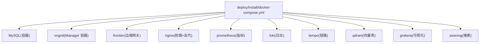
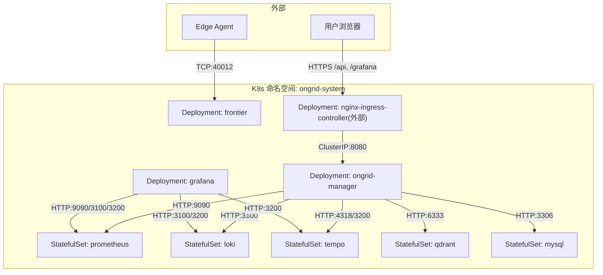
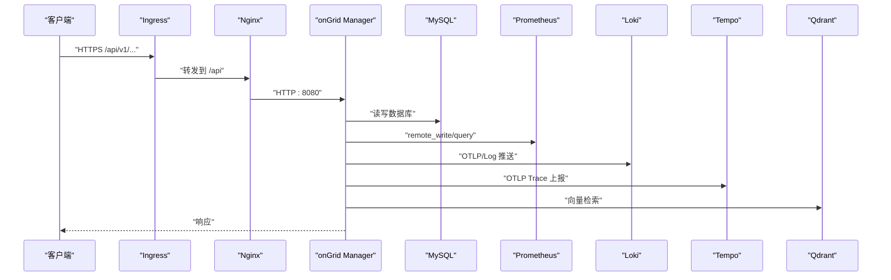

# Kubernetes 生产环境部署

<cite>
**本文引用的文件**   
- [deploy/README.md](file://deploy/README.md)
- [deploy/docker-compose.yml](file://deploy/docker-compose.yml)
- [deploy/install/docker-compose.yml](file://deploy/install/docker-compose.yml)
- [deploy/install/frontier.yaml](file://deploy/install/frontier.yaml)
- [deploy/install/README.md](file://deploy/install/README.md)
- [deploy/prometheus/prometheus.yml](file://deploy/prometheus/prometheus.yml)
- [deploy/grafana/provisioning/datasources/prometheus.yml](file://deploy/grafana/provisioning/datasources/prometheus.yml)
- [deploy/grafana/provisioning/datasources/loki.yml](file://deploy/grafana/provisioning/datasources/loki.yml)
- [deploy/grafana/provisioning/datasources/tempo.yml](file://deploy/grafana/provisioning/datasources/tempo.yml)
- [deploy/install/prometheus.yml](file://deploy/install/prometheus.yml)
- [deploy/install/loki-config.yaml](file://deploy/install/loki-config.yaml)
- [deploy/install/tempo-config.yaml](file://deploy/install/tempo-config.yaml)
- [cmd/ongrid/main.go](file://cmd/ongrid/main.go)
</cite>

## 目录
1. [简介](#简介)
2. [项目结构](#项目结构)
3. [核心组件](#核心组件)
4. [架构总览](#架构总览)
5. [详细组件分析](#详细组件分析)
6. [依赖关系分析](#依赖关系分析)
7. [性能与高可用](#性能与高可用)
8. [监控与日志](#监控与日志)
9. [故障排查指南](#故障排查指南)
10. [结论](#结论)
11. [附录：Kubernetes 适配建议](#附录kubernetes-适配建议)

## 简介
本文件面向在 Kubernetes 生产环境中部署 OnGrid 的运维与平台团队，基于仓库中已有的 Docker Compose 与安装脚本，给出可落地的 K8s 迁移方案与最佳实践。文档覆盖命名空间隔离、ServiceAccount 权限控制、ConfigMap/Secret 管理、Deployment 定义（副本数、资源限制、滚动更新、健康检查）、Service 暴露策略（ClusterIP/NodePort/Ingress）、存储类配置（MySQL、Redis、对象存储）、Helm Chart 模板结构与自定义值文件、扩缩容与负载均衡、高可用方案、以及监控告警与日志收集等主题。

说明：
- 当前仓库未提供 Helm Chart 或原生 K8s YAML；本文以 deploy/install/docker-compose.yml 为“生产形态”参考，将其映射到 K8s 资源进行设计。
- 对仓库未实现的能力（如 Redis 缓存集群、对象存储集成）仅给出概念性建议与接入点，不虚构现有实现细节。

## 项目结构
与部署相关的核心目录与文件：
- deploy/README.md：本地开发栈说明与注意事项
- deploy/docker-compose.yml：本地开发编排
- deploy/install/docker-compose.yml：生产形态编排（随发布包分发）
- deploy/install/frontier.yaml：边端网关 Frontier 配置
- deploy/install/README.md：安装、升级、卸载、数据卷、代理、访问方式等完整手册
- deploy/prometheus/prometheus.yml：Prometheus 抓取配置（开发）
- deploy/install/prometheus.yml：生产 Prometheus 抓取配置
- Grafana/Loki/Tempo 数据源与仪表盘 provision 配置位于 deploy/grafana/provisioning 与 deploy/install/grafana/provisioning

图表来源
- [deploy/install/docker-compose.yml:1-610](file://deploy/install/docker-compose.yml#L1-L610)

章节来源
- [deploy/README.md:1-130](file://deploy/README.md#L1-L130)
- [deploy/install/docker-compose.yml:1-610](file://deploy/install/docker-compose.yml#L1-L610)
- [deploy/install/README.md:1-616](file://deploy/install/README.md#L1-L616)

## 核心组件
- ongrid（Manager）：业务主服务，负责设备/边缘管理、AIOps、通知、Grafana 集成、Prometheus remote_write 转发、OTLP 上报等。
- frontier：边端网关，提供 edgebound 与 servicebound 端口，供 Edge Agent 拨入与管理侧 SDK 调用。
- MySQL：默认后端数据库，生产态通过 bind-mount 持久化。
- nginx：TLS 终止、前端 SPA 静态资源、/api 反向代理、/grafana 同源入口。
- prometheus：接收 manager remote_write，并提供 PromQL 查询能力给 AI 工具。
- loki/tempo/qdrant/grafana/searxng：观测与检索基础设施。

关键环境变量与启动参数（节选）：
- Manager：ONGRID_HTTP_ADDR、ONGRID_METRICS_ADDR、ONGRID_FRONTIER_ADDR、ONGRID_DB_DSN、JWT/密钥、Prom/TLS、OTEL、Grafana 集成、通知通道等
- Frontier：edgebound/servicebound 监听地址
- Prometheus：remote_write receiver、外部 URL、路由前缀、TSDB 保留策略
- Grafana：子路径运行、匿名查看、Datasource Provisioning

章节来源
- [deploy/install/docker-compose.yml:83-313](file://deploy/install/docker-compose.yml#L83-L313)
- [deploy/install/frontier.yaml:1-29](file://deploy/install/frontier.yaml#L1-L29)
- [deploy/install/prometheus.yml:1-200](file://deploy/install/prometheus.yml#L1-L200)
- [deploy/grafana/provisioning/datasources/prometheus.yml:1-200](file://deploy/grafana/provisioning/datasources/prometheus.yml#L1-L200)
- [deploy/grafana/provisioning/datasources/loki.yml:1-200](file://deploy/grafana/provisioning/datasources/loki.yml#L1-L200)
- [deploy/grafana/provisioning/datasources/tempo.yml:1-200](file://deploy/grafana/provisioning/datasources/tempo.yml#L1-L200)

## 架构总览
从 Compose 到 K8s 的映射要点：
- 命名空间：将 ongrid 相关组件放入独立 Namespace（如 ongrid-system），实现网络与 RBAC 隔离。
- 工作负载：每个容器化服务对应一个 Deployment（或 StatefulSet，针对有状态服务）。
- 服务暴露：内部使用 ClusterIP，对外通过 Ingress（HTTPS）统一入口；Edge tunnel 可通过 NodePort 或 Ingress TCP/Stream 暴露。
- 配置与密钥：ConfigMap 存放非敏感配置，Secret 存放密码、证书、API Key 等。
- 存储：MySQL、Prometheus、Loki、Tempo、Qdrant、Grafana 使用 PVC（StorageClass 按需选择高性能/容量型）。
- 安全：ServiceAccount + RBAC 最小权限；Ingress TLS 终止；可选 NetworkPolicy 限制跨命名空间访问。

图表来源
- [deploy/install/docker-compose.yml:1-610](file://deploy/install/docker-compose.yml#L1-L610)
- [deploy/install/frontier.yaml:1-29](file://deploy/install/frontier.yaml#L1-L29)

## 详细组件分析

### 命名空间与 ServiceAccount 权限控制
- 命名空间隔离：为 ongrid 创建独立 Namespace，所有 Pod、Service、PVC、ConfigMap、Secret、RBAC 均置于该命名空间下。
- ServiceAccount：为 ongrid-manager 分配专用 SA，仅授予必要 API 组/资源的 get/list/watch 权限（若未来扩展为 Operator 模式，再按需扩大）。
- RBAC 示例思路：
  - 对 core/v1 的 pods/services/configmaps/secrets/namespaces 只读
  - 对 apps/v1 的 deployments/statefulsets 只读
  - 对 monitoring.coreos.com 的 servicemonitor 只读（若使用 Prometheus Operator）
- 网络策略：默认允许同命名空间互通，限制跨命名空间访问；仅开放 Ingress Controller 到 nginx 的流量。

章节来源
- [deploy/install/docker-compose.yml:1-610](file://deploy/install/docker-compose.yml#L1-L610)

### ConfigMap 与 Secret 管理
- ConfigMap：
  - ongrid-manager 的非敏感配置（如 HTTP/Metrics 地址、Frontier 地址、Prom/TLS 开关、Agent Kernel 等）
  - Prometheus/Loki/Tempo/Grafana 的数据源与规则文件
- Secret：
  - MySQL 用户名/密码、JWT 签名密钥、ONNX 运行时路径、LLM/Embedding 凭据、Grafana 管理员密码、通知渠道 Webhook Secret 等
- 挂载方式：
  - ConfigMap 以 Volume 或环境变量注入
  - Secret 以 Volume 或环境变量注入，并设置合适的权限位

章节来源
- [deploy/install/docker-compose.yml:83-313](file://deploy/install/docker-compose.yml#L83-L313)
- [deploy/install/prometheus.yml:1-200](file://deploy/install/prometheus.yml#L1-L200)
- [deploy/install/loki-config.yaml:1-200](file://deploy/install/loki-config.yaml#L1-L200)
- [deploy/install/tempo-config.yaml:1-200](file://deploy/install/tempo-config.yaml#L1-L200)
- [deploy/grafana/provisioning/datasources/prometheus.yml:1-200](file://deploy/grafana/provisioning/datasources/prometheus.yml#L1-L200)
- [deploy/grafana/provisioning/datasources/loki.yml:1-200](file://deploy/grafana/provisioning/datasources/loki.yml#L1-L200)
- [deploy/grafana/provisioning/datasources/tempo.yml:1-200](file://deploy/grafana/provisioning/datasources/tempo.yml#L1-L200)

### Deployment 资源定义（副本数、资源限制、滚动更新、健康检查）
- ongrid-manager：
  - 副本数：生产建议 ≥2（配合无状态设计与外部 MySQL/Prom/Loki/Tempo/Qdrant）
  - 资源限制：CPU/内存根据实际压测设定，预留一定缓冲
  - 滚动更新：strategy.rollingUpdate.maxSurge/maxUnavailable 合理配置
  - 健康检查：liveness/readiness 探针指向 /healthz 或 /metrics 端点
- frontier：
  - 副本数：≥2，结合外部 LB 或 Ingress Stream 做会话保持
  - 资源限制：按连接数与吞吐评估
- nginx：
  - 副本数：≥2，配合 HorizontalPodAutoscaler
  - 资源限制：较小即可
- 有状态服务（mysql/prometheus/loki/tempo/qdrant/grafana）：
  - 使用 StatefulSet，绑定 PVC，设置合理的 StorageClass 与保留策略

章节来源
- [deploy/install/docker-compose.yml:83-313](file://deploy/install/docker-compose.yml#L83-L313)
- [deploy/install/docker-compose.yml:314-610](file://deploy/install/docker-compose.yml#L314-L610)

### Service 暴露策略（ClusterIP/NodePort/Ingress）
- ClusterIP：
  - ongrid-manager、frontier、prometheus、loki、tempo、qdrant、grafana、mysql 均使用 ClusterIP，仅在集群内可达
- NodePort：
  - 如需直连 Edge Tunnel，可将 frontier 的 edgebound 端口以 NodePort 暴露（或使用 Ingress TCP/Stream）
- Ingress：
  - 统一 HTTPS 入口，/api → ongrid-manager，/grafana → grafana，/prometheus → prometheus（可选）
  - 启用 TLS 终止，支持多域名与路径重写

章节来源
- [deploy/install/docker-compose.yml:336-388](file://deploy/install/docker-compose.yml#L336-L388)
- [deploy/install/docker-compose.yml:389-435](file://deploy/install/docker-compose.yml#L389-L435)

### 存储类配置（MySQL、Redis、对象存储）
- MySQL：
  - 使用 StatefulSet + PVC，选择高性能 StorageClass（SSD/NVMe）
  - 主从/高可用：建议使用云厂商托管 RDS 或开源方案（如 Orchestrator/HAProxy + 多实例）
- Redis：
  - 仓库未内置 Redis；可在需要时引入 Redis Cluster 或云托管 Redis，并通过 ConfigMap/Secret 注入连接信息
- 对象存储：
  - 仓库未内置对象存储；可按需接入 S3/OSS/COS 等，用于 pcap/报告归档，通过 Secret 注入凭据

章节来源
- [deploy/install/docker-compose.yml:52-82](file://deploy/install/docker-compose.yml#L52-L82)
- [deploy/install/docker-compose.yml:389-435](file://deploy/install/docker-compose.yml#L389-L435)

### Helm Chart 模板结构与自定义值文件
- 建议结构：
  - templates/deployment-*.yaml、templates/statefulset-*.yaml、templates/service-*.yaml、templates/configmap.yaml、templates/secret.yaml、templates/pvc.yaml、templates/ingress.yaml、templates/rbac.yaml
  - values.yaml：集中管理镜像版本、副本数、资源限制、存储类、域名、证书、外部依赖地址等
  - charts/：可拆分为 ongrid-core、onboard-observability、onboard-storage 等子图
- 自定义值文件：
  - values-prod.yaml：生产环境覆盖项（副本数、资源、存储类、外部依赖）
  - values-dev.yaml：开发环境覆盖项

章节来源
- [deploy/install/docker-compose.yml:1-610](file://deploy/install/docker-compose.yml#L1-L610)

### 扩缩容策略与负载均衡
- HPA：
  - 基于 CPU/内存或自定义指标（Prometheus Adapter）对 ongrid-manager/nginx 自动扩缩容
- 外部负载均衡：
  - 使用云厂商 LB 或 Ingress Controller 的 L4/L7 能力，结合健康检查与优雅退出
- 会话保持：
  - frontier 作为长连接网关，需确保同一 Edge 的后续请求落到同一实例（LB 层会话亲和）

章节来源
- [deploy/install/docker-compose.yml:314-388](file://deploy/install/docker-compose.yml#L314-L388)

### 高可用部署方案
- 多副本：ongrid-manager、nginx、frontier 至少 2 副本
- 多可用区：跨 AZ 调度，避免单点故障
- 数据面高可用：
  - MySQL：主从/多活或托管 RDS
  - Prometheus/Loki/Tempo：分片与复制，或迁移至云托管
  - Qdrant：多副本集合
- 回滚与灰度：
  - 使用滚动更新与蓝绿/金丝雀策略，配合 readiness 探针与错误率阈值

章节来源
- [deploy/install/docker-compose.yml:1-610](file://deploy/install/docker-compose.yml#L1-L610)

### 监控告警与日志收集
- 指标：
  - ongrid-manager 暴露 /metrics，Prometheus 抓取；AI 工具 query_promql 可直接查询
- 日志：
  - Loki 聚合容器 stdout 与应用日志，Grafana 统一查询
- 链路：
  - OTLP 上报至 Tempo，Grafana TraceQL 分析
- 告警：
  - Prometheus Rules 与 Grafana Alerting 联动，通知通道（Webhook/Slack/飞书/钉钉）

章节来源
- [deploy/install/docker-compose.yml:389-435](file://deploy/install/docker-compose.yml#L389-L435)
- [deploy/install/loki-config.yaml:1-200](file://deploy/install/loki-config.yaml#L1-L200)
- [deploy/install/tempo-config.yaml:1-200](file://deploy/install/tempo-config.yaml#L1-L200)
- [deploy/grafana/provisioning/datasources/prometheus.yml:1-200](file://deploy/grafana/provisioning/datasources/prometheus.yml#L1-L200)
- [deploy/grafana/provisioning/datasources/loki.yml:1-200](file://deploy/grafana/provisioning/datasources/loki.yml#L1-L200)
- [deploy/grafana/provisioning/datasources/tempo.yml:1-200](file://deploy/grafana/provisioning/datasources/tempo.yml#L1-L200)

## 依赖关系分析
- ongrid-manager 依赖：
  - MySQL（数据库）、Frontier（边端网关）、Prometheus（指标）、Loki（日志）、Tempo（链路）、Qdrant（向量检索）、Grafana（可视化）
- nginx 依赖：
  - ongrid-manager（/api 反代）、Grafana（/grafana 反代）
- Prometheus 依赖：
  - ongrid-manager（remote_write）、node-exporter（可选）
- Grafana 依赖：
  - Prometheus/Loki/Tempo（数据源）

图表来源
- [deploy/install/docker-compose.yml:83-313](file://deploy/install/docker-compose.yml#L83-L313)
- [deploy/install/docker-compose.yml:336-388](file://deploy/install/docker-compose.yml#L336-L388)

章节来源
- [deploy/install/docker-compose.yml:1-610](file://deploy/install/docker-compose.yml#L1-L610)

## 性能与高可用
- 资源规划：
  - ongrid-manager：CPU/内存按并发与工具数量评估；开启 graph kernel 与 ToolBag deferral 可降低提示开销
  - MySQL：IOPS 与连接池调优
  - Prometheus：TSDB 保留时间与大小上限（默认 90d/20GB）
- 高可用：
  - 多副本 + 跨 AZ + 外部托管数据库/观测栈
- 弹性伸缩：
  - HPA + 外部 LB 健康检查 + 优雅关闭

章节来源
- [deploy/install/docker-compose.yml:389-435](file://deploy/install/docker-compose.yml#L389-L435)
- [deploy/install/README.md:579-616](file://deploy/install/README.md#L579-L616)

## 监控与日志
- 指标采集：
  - ongrid-manager 的 /metrics 由 Prometheus 抓取；AI 工具可直接执行 PromQL
- 日志采集：
  - Loki 聚合容器 stdout 与应用日志；Grafana 统一查询
- 链路追踪：
  - OTLP 上报至 Tempo；Grafana TraceQL 分析
- 告警：
  - Prometheus Rules + Grafana Alerting；通知通道（Webhook/Slack/飞书/钉钉）

章节来源
- [deploy/install/docker-compose.yml:389-435](file://deploy/install/docker-compose.yml#L389-L435)
- [deploy/install/README.md:579-616](file://deploy/install/README.md#L579-L616)

## 故障排查指南
- 常见症状与定位：
  - /healthz 不通：检查 .env 中的 JWT_SECRET、DB_DSN、Prom/TLS 配置
  - Edge 连不上：检查防火墙与 ONGRID_TUNNEL_PORT；查看 frontier 日志
  - AI Chat 接口 500：确认 OPENAI_API_KEY 是否配置
  - MySQL healthcheck 超时：冷启动慢，观察 MySQL 日志
- 诊断命令（宿主机）：
  - docker compose ps、docker logs <service>、curl -kfsS https://localhost:8443/healthz

章节来源
- [deploy/install/README.md:564-616](file://deploy/install/README.md#L564-L616)

## 结论
通过将 Compose 生产形态映射到 K8s，OnGrid 可在生产环境获得更强的隔离性、弹性与可观测性。建议在真实集群中逐步落地：先完成命名空间与 RBAC 隔离、PVC 与 Ingress 配置，再推进 HPA 与外部托管依赖替换，最终形成稳定、可扩展的生产基线。

## 附录：Kubernetes 适配建议
- 资源清单建议：
  - Namespace、ServiceAccount、RBAC、ConfigMap、Secret、PVC、Deployment/StatefulSet、Service、Ingress、HPA、NetworkPolicy
- 值文件分层：
  - values-base.yaml（通用）、values-prod.yaml（生产覆盖）、values-env.yaml（环境差异）
- 外部依赖：
  - 优先使用云托管 MySQL/Prometheus/Loki/Tempo/Grafana/Qdrant，减少自运维成本
- 安全加固：
  - Ingress TLS、Secret 加密、NetworkPolicy 最小权限、审计日志

[本节为概念性建议，不直接分析具体源码文件]