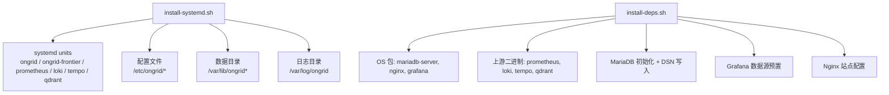
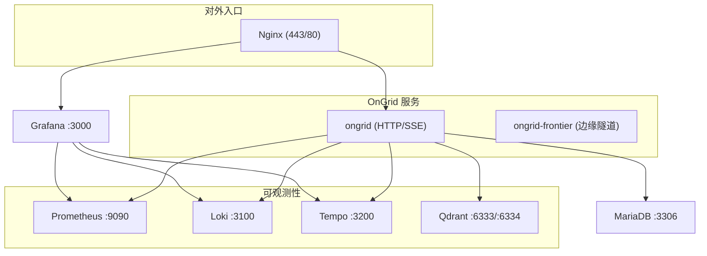
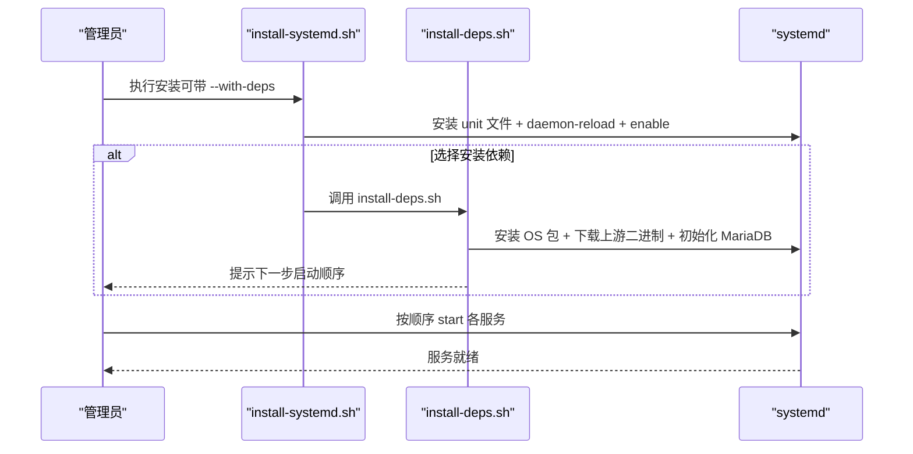

# Systemd 单机部署

<cite>
**本文引用的文件列表**
- [deploy/install/systemd/README.md](file://deploy/install/systemd/README.md)
- [deploy/install/systemd/install-systemd.sh](file://deploy/install/systemd/install-systemd.sh)
- [deploy/install/systemd/install-deps.sh](file://deploy/install/systemd/install-deps.sh)
- [deploy/install/systemd/uninstall-systemd.sh](file://deploy/install/systemd/uninstall-systemd.sh)
- [deploy/install/systemd/ongrid.service](file://deploy/install/systemd/ongrid.service)
- [deploy/install/systemd/ongrid-frontier.service](file://deploy/install/systemd/ongrid-frontier.service)
- [deploy/install/systemd/prometheus.service](file://deploy/install/systemd/prometheus.service)
- [deploy/install/systemd/loki.service](file://deploy/install/systemd/loki.service)
- [deploy/install/systemd/tempo.service](file://deploy/install/systemd/tempo.service)
- [deploy/install/systemd/qdrant.service](file://deploy/install/systemd/qdrant.service)
- [deploy/install/systemd/nginx-ongrid.conf](file://deploy/install/systemd/nginx-ongrid.conf)
- [deploy/install/systemd/grafana-provisioning/datasources.yaml](file://deploy/install/systemd/grafana-provisioning/datasources.yaml)
</cite>

## 目录
1. [简介](#简介)
2. [项目结构](#项目结构)
3. [核心组件](#核心组件)
4. [架构总览](#架构总览)
5. [详细组件分析](#详细组件分析)
6. [依赖关系与启动顺序](#依赖关系与启动顺序)
7. [安装、卸载与升级](#安装卸载与升级)
8. [开机自启、重启策略与故障恢复](#开机自启重启策略与故障恢复)
9. [性能调优建议](#性能调优建议)
10. [监控集成方案](#监控集成方案)
11. [故障排查指南](#故障排查指南)
12. [结论](#结论)

## 简介
本文件面向在单台主机上使用 systemd 原生方式部署 OnGrid 的运维人员，覆盖以下目标：
- 基于 systemd 的服务管理方案，包括 ongrid 主服务与 frontier 消息代理的 service 配置。
- 系统依赖安装脚本的功能与使用方法（软件包检查与自动安装逻辑）。
- 服务启动参数、日志输出重定向与资源限制设置。
- 服务间的依赖关系与启动顺序控制。
- 完整的安装、卸载与升级脚本使用说明。
- 开机自启动、服务重启策略与故障恢复机制。
- 单机部署的性能调优建议与监控集成方案。

## 项目结构
systemd 模式的核心文件位于 deploy/install/systemd 目录，包含：
- 安装与卸载脚本：install-systemd.sh、install-deps.sh、uninstall-systemd.sh
- 各服务的 systemd unit 文件：ongrid.service、ongrid-frontier.service、prometheus.service、loki.service、tempo.service、qdrant.service
- 配套配置：nginx-ongrid.conf、grafana-provisioning/datasources.yaml
- 说明文档：README.md

图示来源
- [deploy/install/systemd/install-systemd.sh:1-477](file://deploy/install/systemd/install-systemd.sh#L1-L477)
- [deploy/install/systemd/install-deps.sh:1-502](file://deploy/install/systemd/install-deps.sh#L1-L502)
- [deploy/install/systemd/README.md:1-83](file://deploy/install/systemd/README.md#L1-L83)

章节来源
- [deploy/install/systemd/README.md:1-83](file://deploy/install/systemd/README.md#L1-L83)

## 核心组件
- ongrid 主服务：AIOps 管理器，提供 HTTP API、SSE 流式能力、工作进程调度等。
- ongrid-frontier：边缘隧道复用器，负责与边缘节点通信。
- 可观测性栈：Prometheus（指标）、Loki（日志）、Tempo（链路追踪）、Qdrant（向量检索）。
- MariaDB：关系型数据库，存储业务状态。
- Nginx：反向代理，统一对外暴露 443/80，并转发到 ongrid 与 Grafana。
- Grafana：可视化面板，通过数据源连接 Prometheus/Loki/Tempo。

章节来源
- [deploy/install/systemd/ongrid.service:1-75](file://deploy/install/systemd/ongrid.service#L1-L75)
- [deploy/install/systemd/ongrid-frontier.service:1-51](file://deploy/install/systemd/ongrid-frontier.service#L1-L51)
- [deploy/install/systemd/prometheus.service:1-38](file://deploy/install/systemd/prometheus.service#L1-L38)
- [deploy/install/systemd/loki.service:1-32](file://deploy/install/systemd/loki.service#L1-L32)
- [deploy/install/systemd/tempo.service:1-32](file://deploy/install/systemd/tempo.service#L1-L32)
- [deploy/install/systemd/qdrant.service:1-37](file://deploy/install/systemd/qdrant.service#L1-L37)
- [deploy/install/systemd/nginx-ongrid.conf:1-60](file://deploy/install/systemd/nginx-ongrid.conf#L1-L60)
- [deploy/install/systemd/grafana-provisioning/datasources.yaml:1-43](file://deploy/install/systemd/grafana-provisioning/datasources.yaml#L1-L43)

## 架构总览
systemd 模式下，所有组件以独立 unit 运行在同一主机上，由 systemd 统一管理生命周期、资源与隔离。

图示来源
- [deploy/install/systemd/nginx-ongrid.conf:1-60](file://deploy/install/systemd/nginx-ongrid.conf#L1-L60)
- [deploy/install/systemd/ongrid.service:1-75](file://deploy/install/systemd/ongrid.service#L1-L75)
- [deploy/install/systemd/ongrid-frontier.service:1-51](file://deploy/install/systemd/ongrid-frontier.service#L1-L51)
- [deploy/install/systemd/prometheus.service:1-38](file://deploy/install/systemd/prometheus.service#L1-L38)
- [deploy/install/systemd/loki.service:1-32](file://deploy/install/systemd/loki.service#L1-L32)
- [deploy/install/systemd/tempo.service:1-32](file://deploy/install/systemd/tempo.service#L1-L32)
- [deploy/install/systemd/qdrant.service:1-37](file://deploy/install/systemd/qdrant.service#L1-L37)

## 详细组件分析

### ongrid 主服务（ongrid.service）
- 运行用户与组：ongrid
- 环境变量：从 /etc/ongrid/ongrid.env 加载；支持外部代理与本地嵌入模型路径
- 工作目录：/var/lib/ongrid
- 启动命令：/usr/local/bin/ongrid
- 重载信号：HUP
- 停止超时：30s
- 重启策略：always，间隔 5s
- 日志：标准输出/错误均输出至 journald
- 安全与隔离：ProtectSystem=true、ProtectHome=true、PrivateTmp=true、RestrictRealtime=true、RestrictSUIDSGID=true、RemoveIPC=true
- 文件系统权限：StateDirectory=ongrid、LogsDirectory=ongrid、ReadWritePaths=/var/lib/ongrid /var/log/ongrid
- 资源限制：LimitNOFILE=65536、LimitNPROC=32768、MemoryMax=4G、CPUQuota=400%
- 额外能力：AmbientCapabilities/CapabilityBoundingSet=CAP_NET_BIND_SERVICE（允许绑定低端口）
- Go 运行时：GOMAXPROCS=auto、GOGC=100
- 本地嵌入模型：ONNX_PATH=/usr/lib/libonnxruntime.so

章节来源
- [deploy/install/systemd/ongrid.service:1-75](file://deploy/install/systemd/ongrid.service#L1-L75)

### ongrid-frontier 消息代理（ongrid-frontier.service）
- 运行用户与组：ongrid
- 可选环境变量文件：-/etc/ongrid/ongrid-frontier.env（前缀 - 表示不存在不报错）
- 工作目录：/var/lib/ongrid
- 启动命令：/usr/local/bin/ongrid-frontier --config /etc/ongrid/frontier.yaml
- 重载信号：HUP
- 停止超时：20s
- 重启策略：always，间隔 5s
- 日志：journald
- 安全与隔离：同 ongrid 主服务
- 资源限制：LimitNOFILE=65536、LimitNPROC=32768、MemoryMax=2G、CPUQuota=200%
- Go 运行时：GOMAXPROCS=auto、GOGC=100

章节来源
- [deploy/install/systemd/ongrid-frontier.service:1-51](file://deploy/install/systemd/ongrid-frontier.service#L1-L51)

### 可观测性组件
- Prometheus
  - 用户：ongrid-prometheus
  - 监听：127.0.0.1:9090
  - 启用远程写入与生命周期接口
  - 数据目录：/var/lib/ongrid-prometheus
  - 保留期：15d
  - 重启策略：always，间隔 5s
- Loki
  - 用户：ongrid-loki
  - 配置：/etc/ongrid/loki-config.yaml
  - 数据目录：/var/lib/ongrid-loki
  - 重启策略：always，间隔 5s
- Tempo
  - 用户：ongrid-tempo
  - 配置：/etc/ongrid/tempo-config.yaml
  - 数据目录：/var/lib/ongrid-tempo
  - 重启策略：always，间隔 5s
- Qdrant
  - 用户：ongrid-qdrant
  - 环境变量：HTTP_PORT=6333、GRPC_PORT=6334、STORAGE_PATH=/var/lib/ongrid-qdrant/storage、SNAPSHOTS_PATH=/var/lib/ongrid-qdrant/snapshots
  - 数据目录：/var/lib/ongrid-qdrant
  - 重启策略：always，间隔 5s

章节来源
- [deploy/install/systemd/prometheus.service:1-38](file://deploy/install/systemd/prometheus.service#L1-L38)
- [deploy/install/systemd/loki.service:1-32](file://deploy/install/systemd/loki.service#L1-L32)
- [deploy/install/systemd/tempo.service:1-32](file://deploy/install/systemd/tempo.service#L1-L32)
- [deploy/install/systemd/qdrant.service:1-37](file://deploy/install/systemd/qdrant.service#L1-L37)

### Nginx 与 Grafana 集成
- Nginx 站点配置：/etc/nginx/conf.d/ongrid.conf
  - 监听 443 SSL 与 80 重定向
  - 将 / 转发至 ongrid (127.0.0.1:8080)，开启 WebSocket/SSE 支持
  - 将 /grafana/ 转发至 Grafana (127.0.0.1:3000/)
- Grafana 数据源预置：/etc/grafana/provisioning/datasources/ongrid.yaml
  - 默认数据源：Prometheus、Loki、Tempo，指向本机地址

章节来源
- [deploy/install/systemd/nginx-ongrid.conf:1-60](file://deploy/install/systemd/nginx-ongrid.conf#L1-L60)
- [deploy/install/systemd/grafana-provisioning/datasources.yaml:1-43](file://deploy/install/systemd/grafana-provisioning/datasources.yaml#L1-L43)

## 依赖关系与启动顺序
- ongrid 主服务依赖网络与后端存储/缓存：After/Wants network-online.target、mariadb.service、prometheus.service、loki.service、tempo.service、qdrant.service
- 其他组件仅依赖网络
- 安装脚本会执行 daemon-reload 并 enable 所有 unit，但不会自动 start，需人工确认配置后启动

图示来源
- [deploy/install/systemd/install-systemd.sh:420-477](file://deploy/install/systemd/install-systemd.sh#L420-L477)
- [deploy/install/systemd/install-deps.sh:485-502](file://deploy/install/systemd/install-deps.sh#L485-L502)
- [deploy/install/systemd/README.md:50-83](file://deploy/install/systemd/README.md#L50-L83)

章节来源
- [deploy/install/systemd/ongrid.service:1-20](file://deploy/install/systemd/ongrid.service#L1-L20)
- [deploy/install/systemd/install-systemd.sh:420-477](file://deploy/install/systemd/install-systemd.sh#L420-L477)
- [deploy/install/systemd/install-deps.sh:485-502](file://deploy/install/systemd/install-deps.sh#L485-L502)

## 安装、卸载与升级

### 安装
- 进入 deploy/install/systemd 目录
- 执行安装脚本：
  - 仅安装 manager + frontier 与 unit 文件：sudo bash install-systemd.sh
  - 同时安装依赖（OS 包 + 上游二进制 + MariaDB 初始化 + Grafana/Nginx 配置）：sudo bash install-systemd.sh --with-deps
- 安装完成后，根据 README 提示手动启动：
  - sudo systemctl start prometheus loki tempo qdrant
  - sudo systemctl start ongrid-frontier ongrid
- 如需使用 HTTPS，请准备证书并编辑 /etc/nginx/conf.d/ongrid.conf 中的 server_name 与证书路径，然后 reload nginx

章节来源
- [deploy/install/systemd/README.md:50-83](file://deploy/install/systemd/README.md#L50-L83)
- [deploy/install/systemd/install-systemd.sh:420-477](file://deploy/install/systemd/install-systemd.sh#L420-L477)
- [deploy/install/systemd/install-deps.sh:485-502](file://deploy/install/systemd/install-deps.sh#L485-L502)
- [deploy/install/systemd/nginx-ongrid.conf:1-60](file://deploy/install/systemd/nginx-ongrid.conf#L1-L60)

### 卸载
- 停止并移除 unit 文件，保留数据与配置：sudo bash uninstall-systemd.sh
- 彻底清理（删除数据、日志、配置、服务用户）：sudo bash uninstall-systemd.sh --purge [--yes]
- 注意：OS 包与自行放置的上游二进制不会被卸载

章节来源
- [deploy/install/systemd/uninstall-systemd.sh:1-213](file://deploy/install/systemd/uninstall-systemd.sh#L1-L213)

### 升级
- 对于 systemd 模式，推荐流程：
  - 备份 /etc/ongrid 与 /var/lib/ongrid* 相关数据
  - 重新执行 install-systemd.sh（或 --with-deps），脚本会保留已有 env 与数据
  - 重启受影响的服务：sudo systemctl restart ongrid ongrid-frontier
- 若需要更新依赖（如上游二进制版本），先执行 install-deps.sh 再重启对应服务

章节来源
- [deploy/install/systemd/install-systemd.sh:329-397](file://deploy/install/systemd/install-systemd.sh#L329-L397)
- [deploy/install/systemd/install-deps.sh:1-14](file://deploy/install/systemd/install-deps.sh#L1-L14)

## 开机自启、重启策略与故障恢复
- 开机自启：install-systemd.sh 会对所有 unit 执行 enable，使其随 multi-user.target 启动
- 重启策略：
  - ongrid、ongrid-frontier、prometheus、loki、tempo、qdrant 均配置 Restart=always，RestartSec=5s
  - ongrid 与 ongrid-frontier 支持 ExecReload=HUP 实现平滑重载
- 故障恢复：
  - StartLimitInterval=60s、StartLimitBurst=3 防止频繁崩溃导致风暴
  - KillMode=mixed、TimeoutStopSec 确保优雅退出
  - 日志统一输出至 journald，便于集中查看与排障

章节来源
- [deploy/install/systemd/ongrid.service:11-28](file://deploy/install/systemd/ongrid.service#L11-L28)
- [deploy/install/systemd/ongrid-frontier.service:6-24](file://deploy/install/systemd/ongrid-frontier.service#L6-L24)
- [deploy/install/systemd/prometheus.service:20-25](file://deploy/install/systemd/prometheus.service#L20-L25)
- [deploy/install/systemd/loki.service:13-19](file://deploy/install/systemd/loki.service#L13-L19)
- [deploy/install/systemd/tempo.service:13-19](file://deploy/install/systemd/tempo.service#L13-L19)
- [deploy/install/systemd/qdrant.service:18-24](file://deploy/install/systemd/qdrant.service#L18-L24)

## 性能调优建议
- 文件描述符与进程数
  - LimitNOFILE=65536、LimitNPROC=32768（适用于 ongrid 与 ongrid-frontier）
- 内存与 CPU
  - ongrid：MemoryMax=4G、CPUQuota=400%
  - ongrid-frontier：MemoryMax=2G、CPUQuota=200%
- Go 运行时
  - GOMAXPROCS=auto、GOGC=100
- 存储与保留
  - Prometheus TSDB 保留时间 15d（可按磁盘容量调整）
- 网络与并发
  - Nginx 已开启 WebSocket/SSE 支持，proxy_read_timeout 较长以适应长连接
- 本地嵌入模型
  - 确保 libonnxruntime.so 已安装且 ONNX_PATH 正确指向 /usr/lib/libonnxruntime.so

章节来源
- [deploy/install/systemd/ongrid.service:58-71](file://deploy/install/systemd/ongrid.service#L58-L71)
- [deploy/install/systemd/ongrid-frontier.service:41-47](file://deploy/install/systemd/ongrid-frontier.service#L41-L47)
- [deploy/install/systemd/prometheus.service:11-17](file://deploy/install/systemd/prometheus.service#L11-L17)
- [deploy/install/systemd/nginx-ongrid.conf:20-38](file://deploy/install/systemd/nginx-ongrid.conf#L20-L38)
- [deploy/install/systemd/install-deps.sh:352-373](file://deploy/install/systemd/install-deps.sh#L352-L373)

## 监控集成方案
- 数据源预置
  - Grafana 数据源：Prometheus、Loki、Tempo，默认指向本机地址
  - 安装依赖时会自动写入 /etc/grafana/provisioning/datasources/ongrid.yaml
- 反向代理
  - Nginx 将 /grafana/ 转发到 Grafana，配合 Grafana 子路径配置（由 install-deps.sh 写入 drop-in）
- 访问路径
  - 通过 https://host/ 访问 ongrid（含 SSE/WebSocket）
  - 通过 https://host/grafana/ 访问 Grafana

章节来源
- [deploy/install/systemd/grafana-provisioning/datasources.yaml:1-43](file://deploy/install/systemd/grafana-provisioning/datasources.yaml#L1-L43)
- [deploy/install/systemd/install-deps.sh:427-471](file://deploy/install/systemd/install-deps.sh#L427-L471)
- [deploy/install/systemd/nginx-ongrid.conf:40-51](file://deploy/install/systemd/nginx-ongrid.conf#L40-L51)

## 故障排查指南
- 查看服务状态与日志
  - systemctl status <unit>
  - journalctl -u <unit> -f
- 常见检查点
  - 依赖是否就绪：systemctl is-active prometheus loki tempo qdrant mariadb
  - 端口占用：ss -tlnp | grep -E ':(9090|3100|3200|6333|6334|8080|3000)'
  - 配置路径：/etc/ongrid/ongrid.env、/etc/ongrid/frontier.yaml、/etc/ongrid/prometheus/prometheus.yml、/etc/ongrid/loki-config.yaml、/etc/ongrid/tempo-config.yaml
  - 数据目录权限：/var/lib/ongrid*、/var/lib/ongrid-prometheus、/var/lib/ongrid-loki、/var/lib/ongrid-tempo、/var/lib/ongrid-qdrant
  - Nginx 配置语法：nginx -t
- 关键脚本行为
  - install-deps.sh 会在首次安装时生成 MariaDB 密码并写入 /etc/ongrid/db-password，同时尝试更新 ongrid.env 中的 DSN 占位符
  - install-systemd.sh 会检测宿主代理并预填 ongrid.env 的代理变量（可通过 per-unit edit 覆盖）

章节来源
- [deploy/install/systemd/install-deps.sh:378-418](file://deploy/install/systemd/install-deps.sh#L378-L418)
- [deploy/install/systemd/install-systemd.sh:112-203](file://deploy/install/systemd/install-systemd.sh#L112-L203)

## 结论
systemd 单机部署为 OnGrid 提供了轻量、可控、易维护的运行环境。通过 install-systemd.sh 与 install-deps.sh 的组合，可实现一键化安装与依赖管理；service 文件中完善的资源限制与安全隔离保证了稳定性与安全性；结合 Nginx 与 Grafana 的数据源预置，形成完整的可观测闭环。建议在生产环境中根据实际负载调整资源配额与存储保留策略，并通过 journald 与 Grafana 建立统一的监控与告警体系。