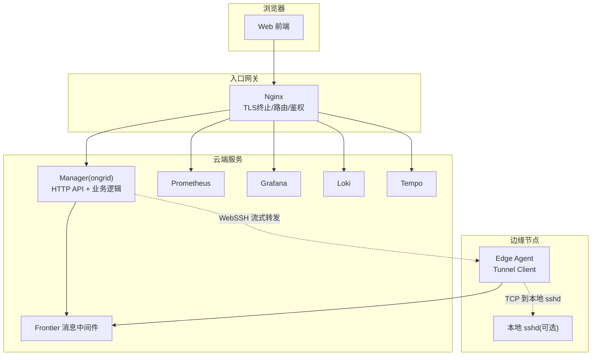
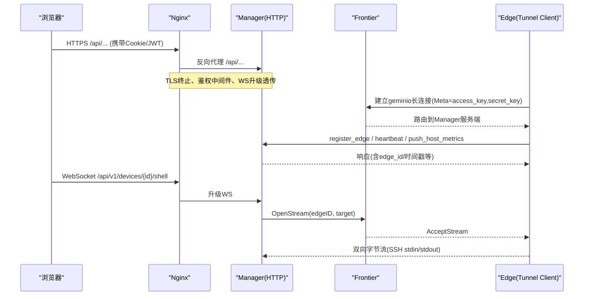
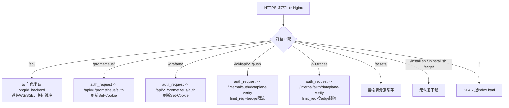
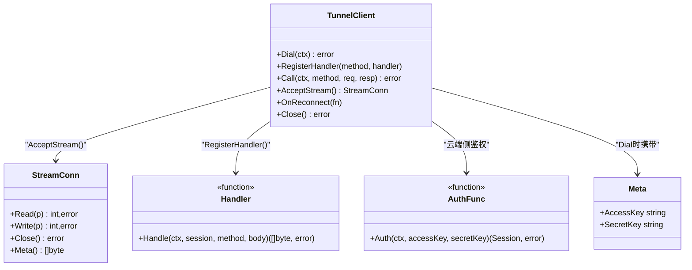
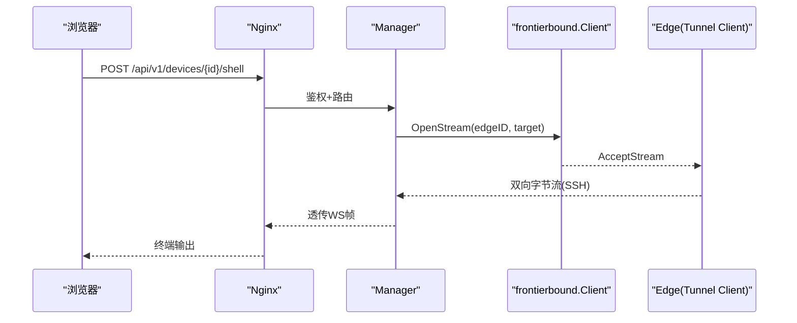
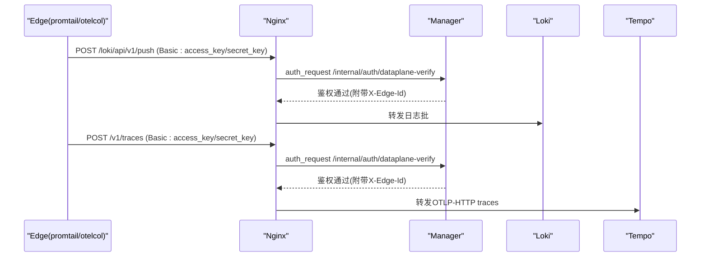
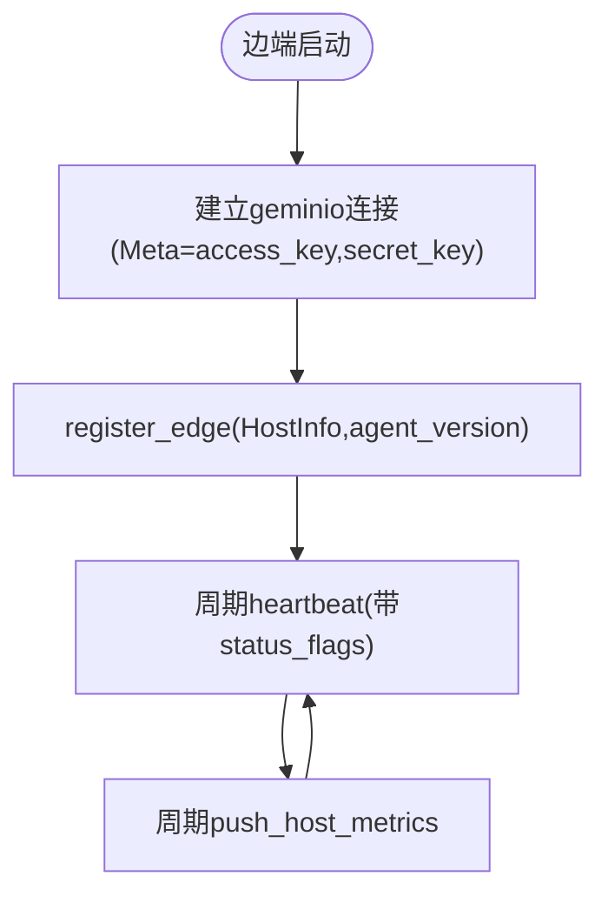
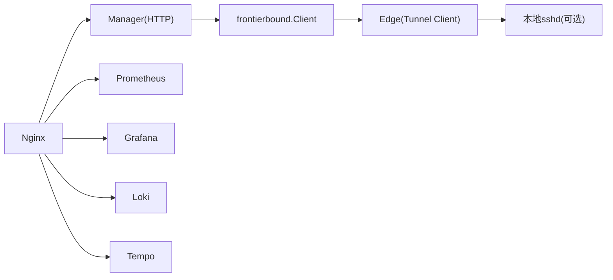

# 网络架构与安全边界

<cite>
**本文引用的文件列表**
- [deploy/nginx/nginx.conf](file://deploy/nginx/nginx.conf)
- [internal/pkg/tunnel/client.go](file://internal/pkg/tunnel/client.go)
- [internal/pkg/tunnel/types.go](file://internal/pkg/tunnel/types.go)
- [internal/pkg/tunnel/messages.go](file://internal/pkg/tunnel/messages.go)
- [api/tunnel/v1/tunnel.proto](file://api/tunnel/v1/tunnel.proto)
- [cmd/ongrid/main.go](file://cmd/ongrid/main.go)
- [internal/manager/biz/devicessh/tunnel.go](file://internal/manager/biz/devicessh/tunnel.go)
</cite>

## 目录
1. [简介](#简介)
2. [项目结构](#项目结构)
3. [核心组件](#核心组件)
4. [架构总览](#架构总览)
5. [详细组件分析](#详细组件分析)
6. [依赖关系分析](#依赖关系分析)
7. [性能考虑](#性能考虑)
8. [故障排查指南](#故障排查指南)
9. [结论](#结论)

## 简介
本文件聚焦 OnGrid 的网络架构与安全边界，覆盖云端与边缘节点的通信、Frontier 消息中间件的 Tunnel 协议实现与安全认证、Nginx 反向代理的 TLS 终止与鉴权中间件集成、内外网隔离策略、WebSocket 长连接管理、心跳检测与服务发现机制，以及网络安全配置（防火墙规则、SSL 证书、ACL）和性能优化建议。文档以代码级事实为依据，辅以架构图与时序图帮助理解。

## 项目结构
与网络和安全相关的关键位置：
- Nginx 反向代理与数据面鉴权：deploy/nginx/nginx.conf
- 边端隧道客户端与握手认证：internal/pkg/tunnel/*
- 云端 Manager 对 Frontier 的接入与 WebSSH 隧道路由：cmd/ongrid/main.go、internal/manager/biz/devicessh/tunnel.go
- 协议定义（JSON over geminio）：api/tunnel/v1/tunnel.proto

图表来源
- [deploy/nginx/nginx.conf:1-301](file://deploy/nginx/nginx.conf#L1-L301)
- [cmd/ongrid/main.go:865-939](file://cmd/ongrid/main.go#L865-L939)
- [internal/manager/biz/devicessh/tunnel.go:1-375](file://internal/manager/biz/devicessh/tunnel.go#L1-L375)

章节来源
- [deploy/nginx/nginx.conf:1-301](file://deploy/nginx/nginx.conf#L1-L301)
- [cmd/ongrid/main.go:865-939](file://cmd/ongrid/main.go#L865-L939)

## 核心组件
- Nginx 反向代理
  - TLS 终止、HTTP/2、静态资源缓存、API 反向代理、WebSocket 升级透传、数据面鉴权子请求、按 edge 限流、健康检查透传、Prom/Grafana 代理并刷新认证 Cookie。
- Frontier 消息中间件与 Tunnel 协议
  - 基于 geminio 的长连接 RPC；边端通过 Meta(access_key, secret_key) 进行身份元信息传递；云端侧在建立连接时校验凭据并绑定会话身份；支持心跳、指标上报、进程/网络快照查询、WebSSH 双向流等。
- Manager 与 Edge 的交互
  - 边端周期性注册、心跳、指标推送；云端可主动调用边端能力；WebSSH 通过 OpenStream 建立双向字节流，经 Manager 路由至目标主机 sshd。

章节来源
- [deploy/nginx/nginx.conf:1-301](file://deploy/nginx/nginx.conf#L1-L301)
- [internal/pkg/tunnel/client.go:1-379](file://internal/pkg/tunnel/client.go#L1-L379)
- [internal/pkg/tunnel/types.go:1-120](file://internal/pkg/tunnel/types.go#L1-L120)
- [internal/pkg/tunnel/messages.go:1-514](file://internal/pkg/tunnel/messages.go#L1-L514)
- [api/tunnel/v1/tunnel.proto:1-166](file://api/tunnel/v1/tunnel.proto#L1-L166)
- [cmd/ongrid/main.go:865-939](file://cmd/ongrid/main.go#L865-L939)
- [internal/manager/biz/devicessh/tunnel.go:1-375](file://internal/manager/biz/devicessh/tunnel.go#L1-L375)

## 架构总览
OnGrid 采用“云端集中管控 + 边缘采集执行”的架构。浏览器通过 Nginx 访问云端 HTTP API 与监控平台；边缘节点通过 Frontier 与云端保持长连接，承载心跳、指标、远程诊断与交互式 Shell 流量。数据面（日志/追踪）走独立路径，由 Nginx 鉴权后直推 Loki/Tempo，避免经过 Manager Go 进程，降低耦合与延迟。

图表来源
- [deploy/nginx/nginx.conf:100-125](file://deploy/nginx/nginx.conf#L100-L125)
- [internal/pkg/tunnel/client.go:178-209](file://internal/pkg/tunnel/client.go#L178-L209)
- [internal/pkg/tunnel/types.go:82-106](file://internal/pkg/tunnel/types.go#L82-L106)
- [cmd/ongrid/main.go:905-939](file://cmd/ongrid/main.go#L905-L939)

## 详细组件分析

### Nginx 反向代理与安全中间件
- TLS 终止与加密
  - 监听 443，启用 TLSv1.2/1.3，关闭 server_tokens，设置安全响应头，开启 gzip。
- 请求路由
  - /api/ 反向代理到 ongrid_backend(8080)，开启 keepalive，关闭缓冲以支持 SSE/WS 增量输出，设置合理的超时。
  - /prometheus/ 与 /grafana/ 分别代理到内部服务，并通过 auth_request 子请求完成鉴权，同时刷新认证 Cookie。
- WebSocket 支持
  - 使用 map $http_upgrade $connection_upgrade 桥接 Upgrade/Connection 头，确保 /api/ 下的 WS/SSE 能正确升级。
- 数据面鉴权与限流
  - /loki/api/v1/push 与 /v1/traces 通过 auth_request 子请求调用 Manager 的 dataplane 鉴权接口，成功后透传到 Loki/Tempo；按 edge access_key 维度限流，防止单点噪声影响其他 edge。
- 静态资源与安装脚本
  - /assets/ 强缓存；/install.sh、/uninstall.sh 与 /edge/ 提供无认证的下载；/ 回退 index.html 供 SPA 渲染。

图表来源
- [deploy/nginx/nginx.conf:62-301](file://deploy/nginx/nginx.conf#L62-L301)

章节来源
- [deploy/nginx/nginx.conf:1-301](file://deploy/nginx/nginx.conf#L1-L301)

### Frontier 消息中间件与 Tunnel 协议
- 连接与会话
  - 边端通过 NewClient 创建连接，Dial 阶段将 Meta(access_key, secret_key) 作为连接元信息发送；云端侧在连接建立时解析并调用 AuthFunc 验证，返回 Session(包含 EdgeID)。
- 自动重连与回调
  - Dial 使用指数退避；底层 RetryEnd 处理断线重连；Call 遇到路由失效错误会触发异步重连，并在成功重连后顺序执行 OnReconnect 回调。
- 双向流
  - AcceptStream 暴露 StreamConn，用于 WebSSH 场景，Meta 中携带目标描述（如 host:ip:port），边端据此拨号本地 sshd。
- 协议方法
  - 注册/心跳/指标上报/进程与网络快照/插件配置拉取与变更通知/WebSSH 控制面/Agent 升级包拉取与应用等，均以 JSON 编码在 geminio 上承载。

图表来源
- [internal/pkg/tunnel/types.go:8-31](file://internal/pkg/tunnel/types.go#L8-L31)
- [internal/pkg/tunnel/types.go:68-106](file://internal/pkg/tunnel/types.go#L68-L106)
- [internal/pkg/tunnel/client.go:178-209](file://internal/pkg/tunnel/client.go#L178-L209)
- [internal/pkg/tunnel/client.go:245-322](file://internal/pkg/tunnel/client.go#L245-L322)
- [internal/pkg/tunnel/messages.go:508-514](file://internal/pkg/tunnel/messages.go#L508-L514)

章节来源
- [internal/pkg/tunnel/client.go:1-379](file://internal/pkg/tunnel/client.go#L1-L379)
- [internal/pkg/tunnel/types.go:1-120](file://internal/pkg/tunnel/types.go#L1-L120)
- [internal/pkg/tunnel/messages.go:1-514](file://internal/pkg/tunnel/messages.go#L1-L514)
- [api/tunnel/v1/tunnel.proto:1-166](file://api/tunnel/v1/tunnel.proto#L1-L166)

### 云端 Manager 与 WebSSH 隧道路由
- Frontier 客户端初始化
  - Manager 启动时根据配置决定是否禁用 Frontier；若启用则创建服务端 Client，并注入生命周期回调。
- WebSSH 路径
  - 通过 streamerForTunnelAdapter 将 frontierbound.OpenStream 适配为 devicessh.TunnelStreamOpener；结合设备到 edge 的映射，选择直接 SSH 或经由 tunnel 的路径。
- 会话与审计
  - 路由层封装了路径守卫与审计日志，便于追踪操作来源与结果。

图表来源
- [cmd/ongrid/main.go:865-939](file://cmd/ongrid/main.go#L865-L939)
- [internal/manager/biz/devicessh/tunnel.go:1-375](file://internal/manager/biz/devicessh/tunnel.go#L1-L375)

章节来源
- [cmd/ongrid/main.go:865-939](file://cmd/ongrid/main.go#L865-L939)
- [internal/manager/biz/devicessh/tunnel.go:1-375](file://internal/manager/biz/devicessh/tunnel.go#L1-L375)

### 数据平面流量与鉴权
- 日志与追踪写入
  - 边缘 promtail/otelcol-contrib 向 Nginx 的 /loki/api/v1/push 与 /v1/traces 提交数据；Nginx 通过 auth_request 子请求调用 Manager 的 /internal/auth/dataplane-verify 进行鉴权，通过后透传到 Loki/Tempo。
- 限流与隔离
  - 基于 Authorization 头中的 edge access_key 做 per-edge 限流，避免个别 edge 拥塞影响整体吞吐。

图表来源
- [deploy/nginx/nginx.conf:140-203](file://deploy/nginx/nginx.conf#L140-L203)

章节来源
- [deploy/nginx/nginx.conf:140-203](file://deploy/nginx/nginx.conf#L140-L203)

### 心跳检测与服务发现
- 心跳
  - 边端定时发送 heartbeat，携带时间戳与可选状态位；云端据此判断边端存活与异常。
- 服务发现
  - 边端首次连接通过 register_edge 上报 HostInfo 与 agent_version，云端返回 edge_id 并建立路由；后续心跳维持活跃。

图表来源
- [internal/pkg/tunnel/messages.go:258-320](file://internal/pkg/tunnel/messages.go#L258-L320)
- [api/tunnel/v1/tunnel.proto:44-73](file://api/tunnel/v1/tunnel.proto#L44-L73)

章节来源
- [internal/pkg/tunnel/messages.go:258-320](file://internal/pkg/tunnel/messages.go#L258-L320)
- [api/tunnel/v1/tunnel.proto:44-73](file://api/tunnel/v1/tunnel.proto#L44-L73)

## 依赖关系分析
- Nginx 依赖后端 ongrid_backend、prometheus、grafana、loki、tempo 上游；通过 auth_request 与 Manager 的鉴权接口联动。
- Manager 依赖 Frontier 客户端进行边端通信；WebSSH 路径依赖设备到 edge 的映射与隧道流打开能力。
- Edge 依赖 Frontier 与本地 sshd（可选）。

图表来源
- [deploy/nginx/nginx.conf:31-54](file://deploy/nginx/nginx.conf#L31-L54)
- [cmd/ongrid/main.go:865-939](file://cmd/ongrid/main.go#L865-L939)
- [internal/manager/biz/devicessh/tunnel.go:1-375](file://internal/manager/biz/devicessh/tunnel.go#L1-L375)

章节来源
- [deploy/nginx/nginx.conf:31-54](file://deploy/nginx/nginx.conf#L31-L54)
- [cmd/ongrid/main.go:865-939](file://cmd/ongrid/main.go#L865-L939)
- [internal/manager/biz/devicessh/tunnel.go:1-375](file://internal/manager/biz/devicessh/tunnel.go#L1-L375)

## 性能考虑
- Nginx
  - 合理设置 keepalive、gzip、client_max_body_size、proxy_buffering/off 以支持大文件上传与实时流式输出；对数据面路径单独限流与超时配置，避免阻塞管理面。
- Tunnel 客户端
  - 指数退避与最大退避上限保障弱网恢复；断线重连与回调机制减少上层感知抖动。
- 数据面
  - 按 edge 维度限流，避免热点 edge 影响全局；批量上报指标与日志，减少往返开销。

[本节为通用指导，不直接分析具体文件]

## 故障排查指南
- TLS 与证书
  - 确认 Nginx 证书路径与权限；检查 ssl_protocols 与 ssl_ciphers 是否满足客户端要求。
- 鉴权失败
  - 数据面：检查 Basic 凭据是否正确、auth_request 子请求是否返回 2xx；查看 X-Edge-Id 是否被正确透传。
  - 管理面：检查 JWT/Cookie 是否过期或被刷新；确认 /api/v1/prometheus/auth 与 /internal/auth/dataplane-verify 可达。
- WebSocket 无法升级
  - 检查 Upgrade/Connection 头透传；确认 proxy_http_version 1.1 与 map $http_upgrade 生效。
- 边端连接不稳定
  - 观察 Dial 失败日志与退避行为；确认 Frontier 地址与网络连通性；必要时重启边端以触发重新注册。
- 指标/日志未入库
  - 检查 limit_req 限流阈值与 burst；确认 Loki/Tempo 上游健康；核对鉴权返回的 org/scope 头。

章节来源
- [deploy/nginx/nginx.conf:62-301](file://deploy/nginx/nginx.conf#L62-L301)
- [internal/pkg/tunnel/client.go:62-141](file://internal/pkg/tunnel/client.go#L62-L141)

## 结论
OnGrid 的网络与安全设计围绕“统一入口、严格鉴权、最小暴露、可靠传输”展开：Nginx 作为唯一对外入口承担 TLS 终止与鉴权；Frontier + Tunnel 提供稳定可靠的边云通道；数据面直通存储后端并由 Nginx 统一鉴权与限流；WebSSH 通过双向流打通内网设备。该架构兼顾安全性与可扩展性，适合多云多边的复杂运维场景。