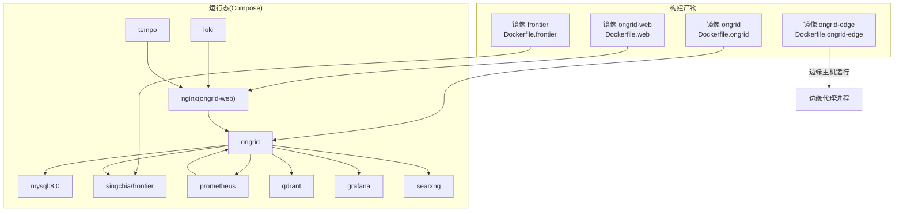
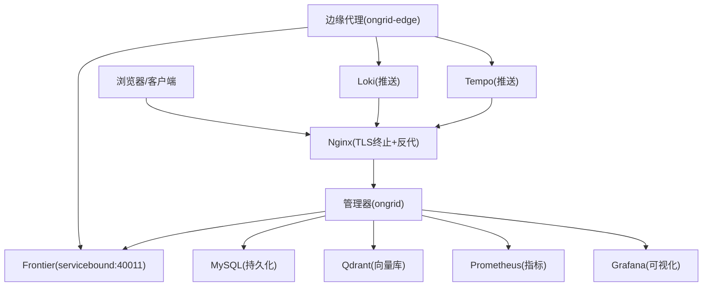
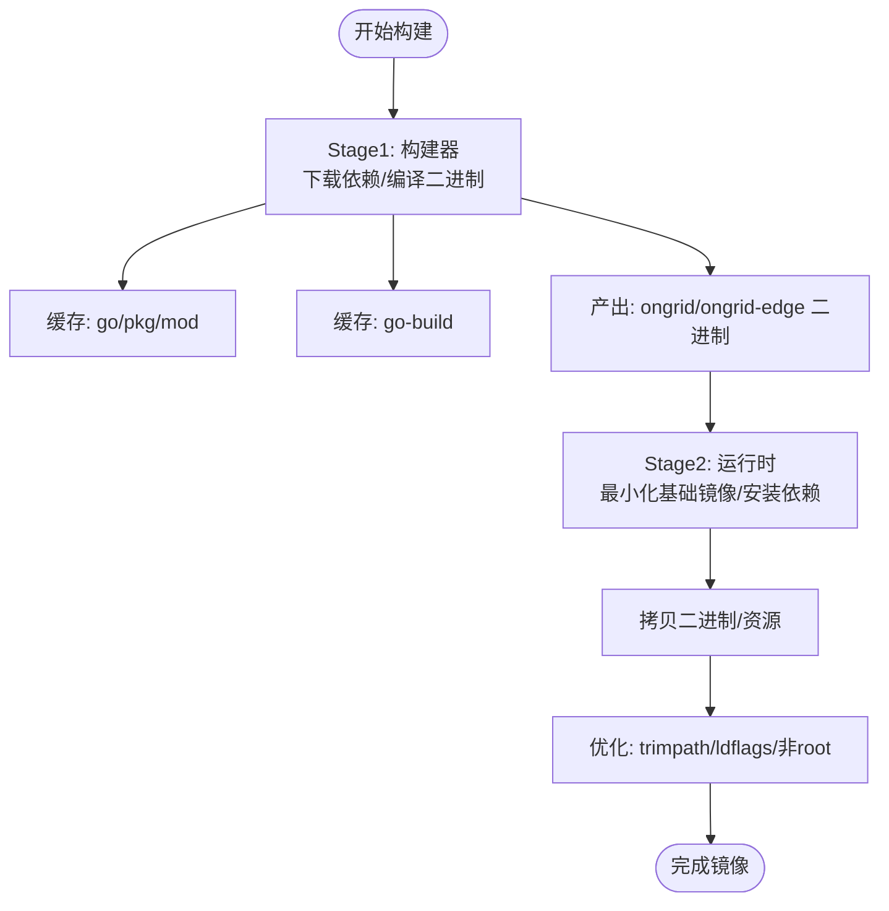
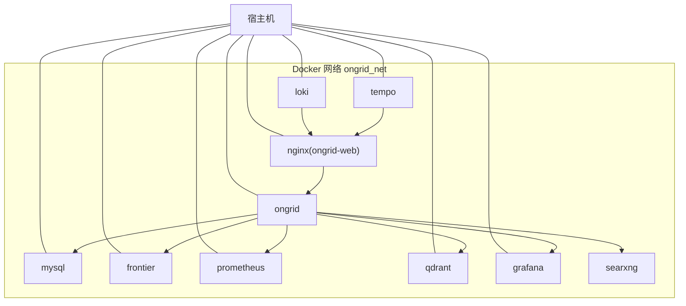
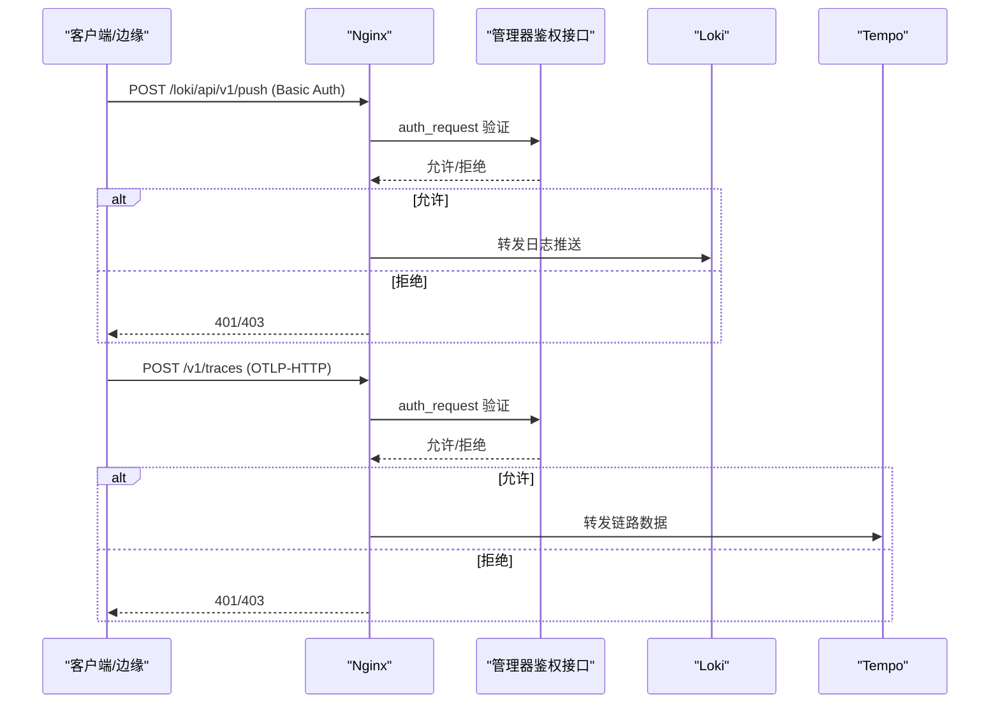
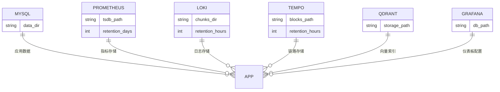
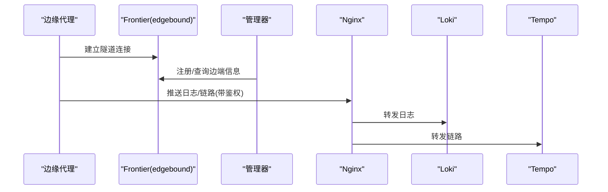
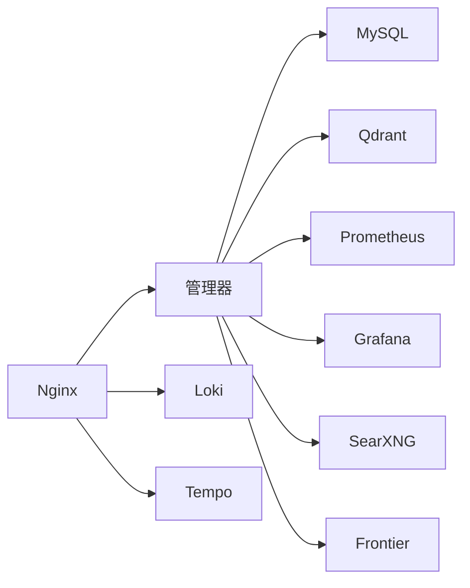

# 部署拓扑与编排

<cite>
**本文引用的文件**   
- [deploy/Dockerfile.ongrid](file://deploy/Dockerfile.ongrid)
- [deploy/Dockerfile.ongrid-edge](file://deploy/Dockerfile.ongrid-edge)
- [deploy/Dockerfile.web](file://deploy/Dockerfile.web)
- [deploy/Dockerfile.frontier](file://deploy/Dockerfile.frontier)
- [deploy/docker-compose.yml](file://deploy/docker-compose.yml)
- [deploy/install/docker-compose.yml](file://deploy/install/docker-compose.yml)
- [deploy/install/nginx.conf](file://deploy/install/nginx.conf)
- [deploy/install/frontier.yaml](file://deploy/install/frontier.yaml)
- [deploy/install/prometheus.yml](file://deploy/install/prometheus.yml)
- [deploy/install/loki-config.yaml](file://deploy/install/loki-config.yaml)
- [deploy/install/tempo-config.yaml](file://deploy/install/tempo-config.yaml)
- [deploy/install/searxng/settings.yml](file://deploy/install/searxng/settings.yml)
- [deploy/README.md](file://deploy/README.md)
- [deploy/install/README.md](file://deploy/install/README.md)
</cite>

## 目录
1. [简介](#简介)
2. [项目结构](#项目结构)
3. [核心组件](#核心组件)
4. [架构总览](#架构总览)
5. [详细组件分析](#详细组件分析)
6. [依赖关系分析](#依赖关系分析)
7. [性能与优化](#性能与优化)
8. [故障排查指南](#故障排查指南)
9. [结论](#结论)
10. [附录](#附录)

## 简介
本文件面向 OnGrid 的容器化部署与编排，聚焦以下目标：
- 镜像构建与优化：多阶段编译、CGO 依赖、ONNX Runtime 集成、前端 SPA 构建与 Nginx 静态分发。
- Kubernetes 编排建议：基于现有 Docker Compose 映射到 Deployment、Service、ConfigMap、Secret、Ingress 等资源的实践路径。
- 服务发现与负载均衡：内部服务网格（Docker 网络）与外部流量入口（Nginx TLS 终止 + 反向代理）。
- 数据持久化：MySQL、Prometheus、Loki、Tempo、Qdrant、Grafana 的数据卷挂载与备份策略。
- 扩缩容与滚动更新：基于副本数与就绪探针的扩容策略，以及通过镜像版本与配置热更新的回滚方案。
- 可视化：提供架构图、网络拓扑图与依赖关系图，帮助读者快速理解系统全貌。

## 项目结构
仓库中与部署相关的核心目录与文件：
- deploy/：本地开发用 docker-compose 与生产安装资源；包含各服务的 Dockerfile、nginx 配置、观测栈配置等。
- deploy/install/：生产安装包内资源，含 docker-compose、frontier 配置、prometheus/loki/tempo/grafana 配置等。
- web/：前端源码，由 Dockerfile.web 在构建期打包为 SPA，并嵌入 nginx 镜像中。
- cmd/ongrid 与 cmd/ongrid-edge：云侧管理器与边缘代理的二进制入口。

图表来源
- [deploy/Dockerfile.ongrid](file://deploy/Dockerfile.ongrid)
- [deploy/Dockerfile.ongrid-edge](file://deploy/Dockerfile.ongrid-edge)
- [deploy/Dockerfile.web](file://deploy/Dockerfile.web)
- [deploy/Dockerfile.frontier](file://deploy/Dockerfile.frontier)
- [deploy/docker-compose.yml](file://deploy/docker-compose.yml)
- [deploy/install/docker-compose.yml](file://deploy/install/docker-compose.yml)

章节来源
- [deploy/README.md](file://deploy/README.md)
- [deploy/install/README.md](file://deploy/install/README.md)

## 核心组件
- 云侧管理器（ongrid）：Go 二进制，cgo 链接 ONNX Runtime，暴露 HTTP API 与 Prometheus /metrics。
- 边缘代理（ongrid-edge）：纯 Go 静态二进制，仅出站拨号至云端隧道，不监听入站业务端口。
- Web 网关（nginx + SPA）：TLS 终止、SPA 静态资源、/api 反向代理、鉴权中间件、速率限制。
- 消息总线（frontier）：边端连接与数据面通道，servicebound 供管理器接入，edgebound 供边缘拨号。
- 观测栈：Prometheus（指标）、Loki（日志）、Tempo（链路追踪）、Grafana（可视化）。
- 向量存储（qdrant）：知识检索与 RAG 的向量数据库。
- 元搜索（searxng）：manager 内置 web_search 技能的后端。

章节来源
- [deploy/Dockerfile.ongrid](file://deploy/Dockerfile.ongrid)
- [deploy/Dockerfile.ongrid-edge](file://deploy/Dockerfile.ongrid-edge)
- [deploy/Dockerfile.web](file://deploy/Dockerfile.web)
- [deploy/Dockerfile.frontier](file://deploy/Dockerfile.frontier)
- [deploy/install/docker-compose.yml](file://deploy/install/docker-compose.yml)

## 架构总览
OnGrid 采用“云-边”分离架构：
- 云侧：管理器 + 网关 + 观测栈 + 数据存储，统一对外暴露 HTTPS 入口与 Edge 隧道端口。
- 边侧：轻量代理驻留在受管主机，主动拨号至云端 frontier edgebound 建立长连接。

图表来源
- [deploy/install/nginx.conf](file://deploy/install/nginx.conf)
- [deploy/install/frontier.yaml](file://deploy/install/frontier.yaml)
- [deploy/install/docker-compose.yml](file://deploy/install/docker-compose.yml)

## 详细组件分析

### 镜像构建与优化
- ongrid（云侧管理器）
  - 多阶段构建：golang:bookworm 作为 builder，debian:bookworm-slim 作为运行时。
  - CGO 启用以支持 fastembed-go 与 libonnxruntime；运行时预装必要共享库。
  - 缓存优化：go mod 下载缓存与 go build 缓存；二进制使用 -trimpath 与 -ldflags 裁剪体积。
  - 安全：非 root 用户运行，HOME 指向可写目录避免 token 写入失败。
- ongrid-edge（边缘代理）
  - 多阶段构建：alpine builder + distroless/static-debian12 运行时，纯 Go 静态二进制。
  - 仅暴露本地 /metrics 调试端口，无入站业务端口。
- ongrid-web（前端）
  - 多阶段构建：node:alpine 构建 SPA，nginx:alpine 承载静态资源。
  - 构建缓存：npm 包缓存与 vite 构建缓存，显著缩短二次构建时间。
- frontier（消息总线）
  - 独立镜像构建，暴露 servicebound 与 edgebound 端口。

图表来源
- [deploy/Dockerfile.ongrid](file://deploy/Dockerfile.ongrid)
- [deploy/Dockerfile.ongrid-edge](file://deploy/Dockerfile.ongrid-edge)
- [deploy/Dockerfile.web](file://deploy/Dockerfile.web)
- [deploy/Dockerfile.frontier](file://deploy/Dockerfile.frontier)

章节来源
- [deploy/Dockerfile.ongrid](file://deploy/Dockerfile.ongrid)
- [deploy/Dockerfile.ongrid-edge](file://deploy/Dockerfile.ongrid-edge)
- [deploy/Dockerfile.web](file://deploy/Dockerfile.web)
- [deploy/Dockerfile.frontier](file://deploy/Dockerfile.frontier)

### 服务编排与网络拓扑
- 本地开发 compose（deploy/docker-compose.yml）
  - 默认后端 MySQL，健康检查后启动 ongrid。
  - 内部网络 ongrid_net，服务间通过容器名解析。
  - 公开端口：HTTP/HTTPS（nginx）、Metrics（9100）、Edge Tunnel（40012）、Prometheus UI（9090）、Grafana（3000）。
- 生产安装 compose（deploy/install/docker-compose.yml）
  - 所有有状态数据 bind-mount 到宿主机目录，便于备份与迁移。
  - 仅暴露必要端口：HTTPS/HTTP重定向、Edge Tunnel、Manager Metrics。
  - 全局代理环境变量锚点，自动注入到需要外联的服务（ongrid、searxng），其余服务直连。

图表来源
- [deploy/docker-compose.yml](file://deploy/docker-compose.yml)
- [deploy/install/docker-compose.yml](file://deploy/install/docker-compose.yml)

章节来源
- [deploy/docker-compose.yml](file://deploy/docker-compose.yml)
- [deploy/install/docker-compose.yml](file://deploy/install/docker-compose.yml)

### 外部流量入口与鉴权
- Nginx 负责：
  - TLS 终止与 HTTP→HTTPS 跳转。
  - SPA 静态资源与 /api 反向代理。
  - 对 /loki/api/v1/push 与 /v1/traces 进行 auth_request 校验，再转发到内部 Loki/Tempo。
  - 对 /prometheus/ 与 /grafana/ 做会话鉴权透传。
  - 限速策略：按 edge access_key 维度限流，防止单边缘节点打满。

图表来源
- [deploy/install/nginx.conf](file://deploy/install/nginx.conf)

章节来源
- [deploy/install/nginx.conf](file://deploy/install/nginx.conf)

### 服务发现与负载均衡
- 服务发现：Docker 内置 DNS，服务间通过容器名访问（如 ongrid:8080、prometheus:9090）。
- 负载均衡：当前为单机部署，未引入多实例；若扩展至多实例，可在 K8s 中通过 Service 将多个 Pod 聚合并提供稳定 DNS 与轮询。

章节来源
- [deploy/install/docker-compose.yml](file://deploy/install/docker-compose.yml)

### 数据存储与持久化
- MySQL：默认后端，数据目录 bind-mount 到宿主机，便于备份与迁移。
- Prometheus：TSDB 保留 90 天/20GB，bind-mount 到宿主机。
- Loki：文件系统后端，默认 30 天保留，bind-mount 到宿主机。
- Tempo：本地块存储，默认 7 天保留，bind-mount 到宿主机。
- Qdrant：向量集合持久化，bind-mount 到宿主机。
- Grafana：SQLite 与插件目录，bind-mount 到宿主机。
- 备份策略：直接对宿主机目录快照或导出（mysqldump、tar 归档）。

图表来源
- [deploy/install/docker-compose.yml](file://deploy/install/docker-compose.yml)
- [deploy/install/prometheus.yml](file://deploy/install/prometheus.yml)
- [deploy/install/loki-config.yaml](file://deploy/install/loki-config.yaml)
- [deploy/install/tempo-config.yaml](file://deploy/install/tempo-config.yaml)

章节来源
- [deploy/install/docker-compose.yml](file://deploy/install/docker-compose.yml)
- [deploy/install/prometheus.yml](file://deploy/install/prometheus.yml)
- [deploy/install/loki-config.yaml](file://deploy/install/loki-config.yaml)
- [deploy/install/tempo-config.yaml](file://deploy/install/tempo-config.yaml)

### 边缘通信与隧道
- 边缘代理（ongrid-edge）主动拨号至 frontiers edgebound:40012。
- 管理器通过 servicebound:40011 接入 frontier，管理边端会话与指令下发。
- 数据面（日志/链路）经 Nginx 鉴权后直达 Loki/Tempo，管理器不在字节流路径上。

图表来源
- [deploy/install/frontier.yaml](file://deploy/install/frontier.yaml)
- [deploy/install/nginx.conf](file://deploy/install/nginx.conf)

章节来源
- [deploy/install/frontier.yaml](file://deploy/install/frontier.yaml)
- [deploy/install/nginx.conf](file://deploy/install/nginx.conf)

### 配置与密钥管理（Kubernetes 映射建议）
- ConfigMap：用于存放非敏感配置（如 prometheus.yml、loki-config.yaml、tempo-config.yaml、searxng settings、frontier.yaml、nginx.conf）。
- Secret：用于存放敏感信息（如 JWT_SECRET、MYSQL_ROOT_PASSWORD、MYSQL_PASSWORD、OPENAI_API_KEY、GRAFANA_ADMIN_PASSWORD 等）。
- 环境变量：compose 中的 .env 变量可直接映射为 K8s Secret/ConfigMap 的 envFrom 或 volumeMount。

章节来源
- [deploy/install/docker-compose.yml](file://deploy/install/docker-compose.yml)
- [deploy/install/prometheus.yml](file://deploy/install/prometheus.yml)
- [deploy/install/loki-config.yaml](file://deploy/install/loki-config.yaml)
- [deploy/install/tempo-config.yaml](file://deploy/install/tempo-config.yaml)
- [deploy/install/searxng/settings.yml](file://deploy/install/searxng/settings.yml)
- [deploy/install/frontier.yaml](file://deploy/install/frontier.yaml)

### 扩缩容与滚动更新
- 扩缩容：
  - 管理器（ongrid）：可通过增加副本实现水平扩展，需确保无状态或共享外部存储（当前 DB/向量库均为外部服务，适合多副本）。
  - 网关（nginx）：多副本配合 Service 与 Ingress 实现负载均衡。
  - 边缘代理：每台受管主机一个实例，无需横向扩展。
- 滚动更新：
  - 通过替换镜像 tag 并触发滚动更新，利用 readiness/liveness 探针保证零停机。
  - 配置变更（ConfigMap/Secret）热更新时，需重启相关 Pod 生效。
- 回滚机制：
  - 回滚到上一镜像版本；若配置变更导致异常，回滚对应 ConfigMap/Secret 并重启。

章节来源
- [deploy/install/docker-compose.yml](file://deploy/install/docker-compose.yml)
- [deploy/install/README.md](file://deploy/install/README.md)

## 依赖关系分析
- 管理器依赖：
  - MySQL（结构化数据）
  - Qdrant（向量检索）
  - Prometheus（指标采集与远程写入）
  - Grafana（可视化）
  - SearXNG（元搜索）
  - Frontier（边端通道）
- 网关依赖：
  - 管理器（/api 反代）
  - Loki/Tempo（鉴权后转发）
  - Prometheus/Grafana（鉴权后转发）

图表来源
- [deploy/install/docker-compose.yml](file://deploy/install/docker-compose.yml)
- [deploy/install/nginx.conf](file://deploy/install/nginx.conf)

章节来源
- [deploy/install/docker-compose.yml](file://deploy/install/docker-compose.yml)
- [deploy/install/nginx.conf](file://deploy/install/nginx.conf)

## 性能与优化
- 构建期优化：
  - 分层缓存：go mod、go build、npm、vite 缓存层复用，减少重复构建时间。
  - 二进制裁剪：-trimpath、-ldflags 去除调试信息，减小镜像体积。
- 运行期优化：
  - Nginx keepalive 与 gzip 压缩，提升静态资源与 API 吞吐。
  - Prometheus 保留策略与 remote_write 接收开启，满足 AI 工具查询需求。
  - Loki/Tempo 合理设置保留时间与并发参数，平衡吞吐与磁盘占用。
  - Qdrant 集合与索引大小规划，避免频繁重建。

章节来源
- [deploy/Dockerfile.ongrid](file://deploy/Dockerfile.ongrid)
- [deploy/Dockerfile.web](file://deploy/Dockerfile.web)
- [deploy/install/prometheus.yml](file://deploy/install/prometheus.yml)
- [deploy/install/loki-config.yaml](file://deploy/install/loki-config.yaml)
- [deploy/install/tempo-config.yaml](file://deploy/install/tempo-config.yaml)

## 故障排查指南
- 健康检查：
  - 通过 Nginx 透传的 /healthz 与 /readyz 确认管理器状态。
  - 从宿主机或容器内访问 Prometheus /-/ready 与 /api/v1/query?query=up。
- 常见错误定位：
  - MySQL 健康检查超时：查看 mysql 容器日志，冷启动较慢属正常。
  - /healthz 不通：检查 .env 中 JWT_SECRET 与 DB_DSN 是否正确。
  - AI Chat 接口 500：确认 OPENAI_API_KEY 是否配置。
  - Edge 无法连接：检查防火墙与云端隧道端口可达性，查看边缘代理日志。
- 日志与指标：
  - 管理器 slog 输出到宿主机目录，便于外部采集。
  - Prometheus 抓取 ongrid:9100 指标，结合告警规则进行监控。

章节来源
- [deploy/install/README.md](file://deploy/install/README.md)
- [deploy/install/prometheus.yml](file://deploy/install/prometheus.yml)

## 结论
OnGrid 的部署拓扑清晰、组件职责明确，具备完善的镜像构建与优化策略、健壮的外部流量入口与鉴权机制、以及全面的观测与数据持久化方案。通过合理的扩缩容与滚动更新策略，可在保证可用性的同时持续演进。建议在 Kubernetes 环境中将现有 Compose 配置映射为 Deployment/Service/ConfigMap/Secret/Ingress，并结合 HPA 与滚动更新策略实现自动化运维。

## 附录
- 参考文档：
  - 部署说明与快速上手：[deploy/README.md](file://deploy/README.md)
  - 生产安装手册与升级回滚：[deploy/install/README.md](file://deploy/install/README.md)
- 关键配置文件：
  - 生产 Compose：[deploy/install/docker-compose.yml](file://deploy/install/docker-compose.yml)
  - Nginx 路由与鉴权：[deploy/install/nginx.conf](file://deploy/install/nginx.conf)
  - Frontier 配置：[deploy/install/frontier.yaml](file://deploy/install/frontier.yaml)
  - Prometheus 配置：[deploy/install/prometheus.yml](file://deploy/install/prometheus.yml)
  - Loki 配置：[deploy/install/loki-config.yaml](file://deploy/install/loki-config.yaml)
  - Tempo 配置：[deploy/install/tempo-config.yaml](file://deploy/install/tempo-config.yaml)
  - SearXNG 配置：[deploy/install/searxng/settings.yml](file://deploy/install/searxng/settings.yml)