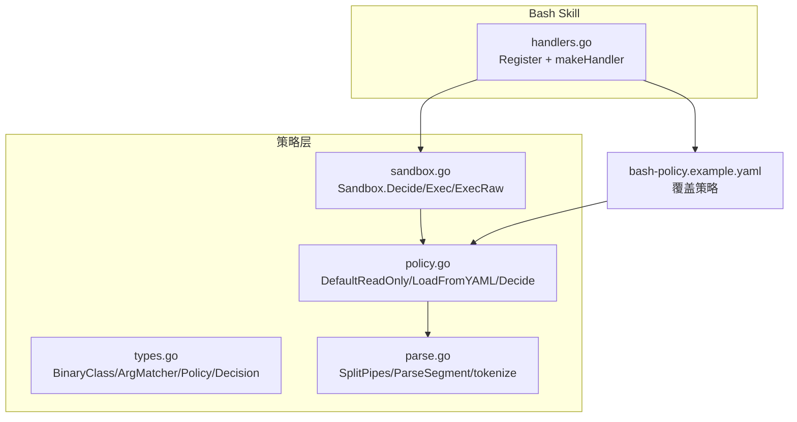
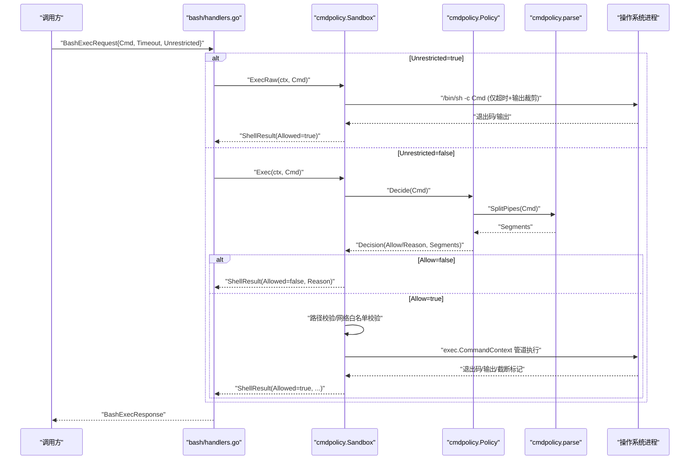
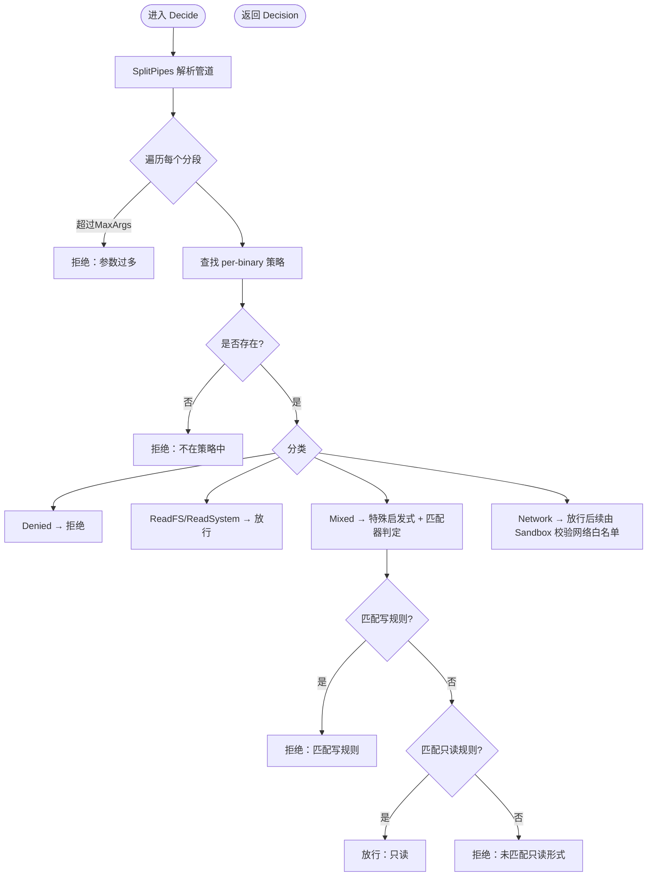
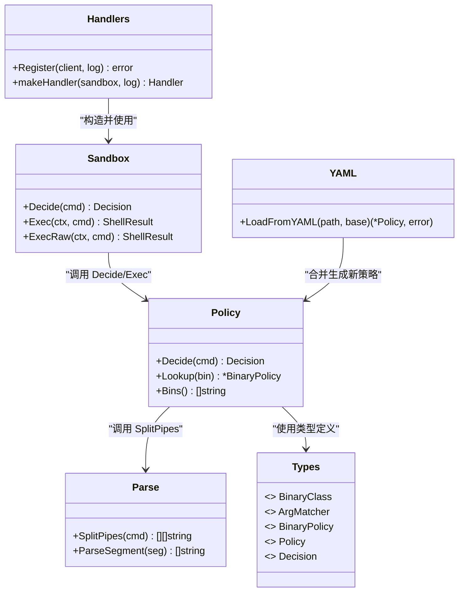

# 命令执行策略

<cite>
**本文引用的文件**   
- [internal/edgeagent/cmdpolicy/types.go](file://internal/edgeagent/cmdpolicy/types.go)
- [internal/edgeagent/cmdpolicy/policy.go](file://internal/edgeagent/cmdpolicy/policy.go)
- [internal/edgeagent/cmdpolicy/parse.go](file://internal/edgeagent/cmdpolicy/parse.go)
- [internal/edgeagent/cmdpolicy/sandbox.go](file://internal/edgeagent/cmdpolicy/sandbox.go)
- [internal/edgeagent/bash/handlers.go](file://internal/edgeagent/bash/handlers.go)
- [deploy/edge/bash-policy.example.yaml](file://deploy/edge/bash-policy.example.yaml)
</cite>

## 目录
1. [简介](#简介)
2. [项目结构](#项目结构)
3. [核心组件](#核心组件)
4. [架构总览](#架构总览)
5. [详细组件分析](#详细组件分析)
6. [依赖关系分析](#依赖关系分析)
7. [性能与资源控制](#性能与资源控制)
8. [故障排查指南](#故障排查指南)
9. [结论](#结论)
10. [附录：配置示例、测试与调试](#附录配置示例测试与调试)

## 简介
本文件系统化阐述 OnGrid 边缘侧“命令执行策略”子系统，覆盖 BinaryPolicy 分类体系（ReadFS、ReadSystem、Mixed、Network、Denied）、ArgMatcher 匹配规则、策略决策算法、YAML 策略文件的语法与合并语义、内置策略的安全考量、动态加载与热更新机制、版本兼容性说明，以及自定义策略开发规范与最佳实践。目标是帮助运维与开发者安全地扩展与治理 LLM 驱动的边缘 Bash 技能执行路径。

## 项目结构
该子系统位于 edgeagent 的 cmdpolicy 包中，并由 bash skill 在启动时加载默认只读基线策略，并可选合并外部 YAML 覆盖文件。关键文件如下：
- types.go：定义策略类型、分类、匹配器与决策结果
- policy.go：默认只读基线、YAML 解析与合并、策略决策主流程
- parse.go：最小化 shell 词法/管道分割器，拒绝危险语法
- sandbox.go：将决策落地为进程执行，包含路径校验、网络目标白名单、超时与输出裁剪
- handlers.go：bash skill 注册入口，负责加载策略与构造 Sandbox
- deploy/edge/bash-policy.example.yaml：可部署到 /etc/ongrid-edge/bash-policy.yaml 的策略覆盖示例

图表来源
- [internal/edgeagent/bash/handlers.go:49-94](file://internal/edgeagent/bash/handlers.go#L49-L94)
- [internal/edgeagent/cmdpolicy/types.go:43-182](file://internal/edgeagent/cmdpolicy/types.go#L43-L182)
- [internal/edgeagent/cmdpolicy/policy.go:33-492](file://internal/edgeagent/cmdpolicy/policy.go#L33-L492)
- [internal/edgeagent/cmdpolicy/parse.go:32-94](file://internal/edgeagent/cmdpolicy/parse.go#L32-L94)
- [internal/edgeagent/cmdpolicy/sandbox.go:76-132](file://internal/edgeagent/cmdpolicy/sandbox.go#L76-L132)

章节来源
- [internal/edgeagent/bash/handlers.go:49-94](file://internal/edgeagent/bash/handlers.go#L49-L94)
- [internal/edgeagent/cmdpolicy/types.go:43-182](file://internal/edgeagent/cmdpolicy/types.go#L43-L182)
- [internal/edgeagent/cmdpolicy/policy.go:33-492](file://internal/edgeagent/cmdpolicy/policy.go#L33-L492)
- [internal/edgeagent/cmdpolicy/parse.go:32-94](file://internal/edgeagent/cmdpolicy/parse.go#L32-L94)
- [internal/edgeagent/cmdpolicy/sandbox.go:76-132](file://internal/edgeagent/cmdpolicy/sandbox.go#L76-L132)

## 核心组件
- BinaryClass 分类体系
  - ReadFS：文件系统只读工具（如 ls、cat、grep、find 等）
  - ReadSystem：系统状态只读工具（如 ps、df、free、ss、lsof、journalctl 等）
  - Mixed：按参数区分读写（如 iptables、systemctl、ip、tc、mount、crontab 等）
  - Network：出站网络探测（如 ping、dig、nc、curl、wget 等），受全局网络主机白名单约束
  - Denied：无条件拒绝（如 bash/sh/python/rm/chmod 等）
- ArgMatcher 匹配规则
  - AnyFlag：任意位置出现指定标志即命中
  - Subcmd：argv[1] 精确等于子命令
  - SubcmdPath：argv[1..n] 精确匹配多段子命令路径
- Policy 与 Decision
  - Policy 维护 per-binary 策略、全局限制（超时、最大参数数、输出上限、路径白名单、网络主机白名单）
  - Decision 表示是否允许及原因，附带已解析的管道分段
- Sandbox
  - Decide：组合策略判定、路径校验、网络目标白名单校验
  - Exec：基于决策执行管道，带超时、环境变量清洗、输出裁剪
  - ExecRaw：管理员写门控旁路，绕过所有策略检查，仅保留超时与输出裁剪

章节来源
- [internal/edgeagent/cmdpolicy/types.go:43-182](file://internal/edgeagent/cmdpolicy/types.go#L43-L182)
- [internal/edgeagent/cmdpolicy/policy.go:707-800](file://internal/edgeagent/cmdpolicy/policy.go#L707-L800)
- [internal/edgeagent/cmdpolicy/sandbox.go:76-132](file://internal/edgeagent/cmdpolicy/sandbox.go#L76-L132)

## 架构总览
下图展示了从 Bash 请求到策略判定与执行的完整链路，包括 YAML 覆盖加载、路径与网络校验、管道执行与结果返回。

图表来源
- [internal/edgeagent/bash/handlers.go:99-157](file://internal/edgeagent/bash/handlers.go#L99-L157)
- [internal/edgeagent/cmdpolicy/sandbox.go:140-188](file://internal/edgeagent/cmdpolicy/sandbox.go#L140-L188)
- [internal/edgeagent/cmdpolicy/policy.go:707-726](file://internal/edgeagent/cmdpolicy/policy.go#L707-L726)
- [internal/edgeagent/cmdpolicy/parse.go:32-69](file://internal/edgeagent/cmdpolicy/parse.go#L32-L69)

## 详细组件分析

### BinaryPolicy 分类体系与安全边界
- ReadFS/ReadSystem：默认放行，但可通过 DeniedArgs 阻断危险用法（例如 find -delete、sed -i、awk system()、journalctl --rotate 等）
- Mixed：严格遵循“先写后读”的判定顺序；未匹配已知只读形式则拒绝（默认保守）
- Network：默认放行（由 Sandbox 的网络主机白名单二次拦截），支持 per-binary 只读模式提示（如 curl --head）
- Denied：直接拒绝，用于 shell、脚本语言、破坏性命令、权限变更、系统重启等

章节来源
- [internal/edgeagent/cmdpolicy/types.go:49-77](file://internal/edgeagent/cmdpolicy/types.go#L49-L77)
- [internal/edgeagent/cmdpolicy/policy.go:51-492](file://internal/edgeagent/cmdpolicy/policy.go#L51-L492)

### ArgMatcher 匹配规则
- AnyFlag：适用于“任意位置出现标志即命中”的场景（如 iptables -L/-S）
- Subcmd：适用于“第一个参数即子命令”的工具（如 systemctl status）
- SubcmdPath：适用于“多级子命令路径”（如 tc qdisc show、ip addr show）
- 空匹配器作为兜底：当 WriteMatchers 为空且 ReadOnlyMatchers 存在时，可用于表达“非写即读”的意图（例如 mount 的 catch-all read）

章节来源
- [internal/edgeagent/cmdpolicy/types.go:79-99](file://internal/edgeagent/cmdpolicy/types.go#L79-L99)
- [internal/edgeagent/cmdpolicy/policy.go:104-225](file://internal/edgeagent/cmdpolicy/policy.go#L104-L225)

### 策略决策算法（Policy.Decide）
决策流程要点：
1. 解析管道分段（SplitPipes），每段 argv 长度不超过 MaxArgs
2. 查找 per-binary 策略，未知二进制或不在策略中的二进制均拒绝
3. Denied 类直接拒绝
4. 若 AbsPath 为空（本机未安装），拒绝
5. 全局 DeniedArgs 子串匹配优先拒绝
6. 按分类分支：
   - ReadFS/ReadSystem：放行
   - Mixed：特殊启发式（mount 双绝对路径=写；kill 无 -l/-L=写），再判断 WriteMatchers/ReadOnlyMatchers，未匹配只读则拒绝
   - Network：WriteMatchers 优先拒绝，否则放行（网络目标白名单由 Sandbox 校验）

图表来源
- [internal/edgeagent/cmdpolicy/policy.go:707-800](file://internal/edgeagent/cmdpolicy/policy.go#L707-L800)

章节来源
- [internal/edgeagent/cmdpolicy/policy.go:707-800](file://internal/edgeagent/cmdpolicy/policy.go#L707-L800)

### YAML 策略文件语法与合并语义
- 文件位置：/etc/ongrid-edge/bash-policy.yaml（由 bash skill 启动时尝试加载）
- 顶层字段
  - binaries[*]：name/class/read_only_matchers/write_matchers/denied_args
  - network_host_allowlist：CIDR/主机名后缀/精确地址
  - stdout_cap_bytes/stderr_cap_bytes/timeout_seconds/max_argv_length/path_allowlist
- 合并语义（对 base 进行覆盖）
  - binaries[*]：同名条目完全替换（非逐字段合并），新名称追加
  - network_host_allowlist/path_allowlist：设置则替换，未设置则沿用 base
  - 数值型限制：>0 时替换，<=0 或未设置则沿用 base
- 注意：v1 不支持“移除”已有二进制；要移除需以空基线启动（重载策略时传入空 base）

章节来源
- [internal/edgeagent/cmdpolicy/policy.go:550-641](file://internal/edgeagent/cmdpolicy/policy.go#L550-L641)
- [deploy/edge/bash-policy.example.yaml:1-178](file://deploy/edge/bash-policy.example.yaml#L1-L178)

### 内置策略类的安全考虑
- find：禁止 -delete/-exec/-execdir/-ok/-okdir/-fprint/-fprintf/-fls 等
- awk：禁止 system()/| sh/| bash/exec( 等
- sed：禁止 -i/--in-place
- journalctl：禁止 --rotate/--vacuum-* 等
- ip：netns exec 归入写操作，防止通过命名空间逃逸
- iptables/ip6tables/tc：明确区分只读查询与写入修改
- systemctl：列出只读与写操作子命令集合
- crontab：-l 只读，-e/-r/-i 写
- Network：默认关闭出站（network_host_allowlist 为空），按需放开内部网段或域名后缀
- Denied：shell、脚本语言、rm/mv/cp/dd、chmod/chown、shutdown/reboot、useradd/passwd 等

章节来源
- [internal/edgeagent/cmdpolicy/policy.go:51-492](file://internal/edgeagent/cmdpolicy/policy.go#L51-L492)
- [internal/edgeagent/cmdpolicy/types.go:49-77](file://internal/edgeagent/cmdpolicy/types.go#L49-L77)

### 动态加载、热更新与版本兼容
- 动态加载：bash skill 启动时读取 /etc/ongrid-edge/bash-policy.yaml，失败会记录告警并回退到默认基线
- 热更新：当前实现为进程启动时加载一次；运行时未提供热重载 API
- 版本兼容：v1 采用“添加与覆盖”语义，不引入“删除”动词，避免破坏现有部署；未来可在保持兼容前提下新增“删除”能力

章节来源
- [internal/edgeagent/bash/handlers.go:54-66](file://internal/edgeagent/bash/handlers.go#L54-L66)
- [internal/edgeagent/cmdpolicy/policy.go:574-591](file://internal/edgeagent/cmdpolicy/policy.go#L574-L591)

## 依赖关系分析
- bash/handlers.go 依赖 cmdpolicy.Sandbox 与 host_files.PathValidator
- cmdpolicy.Sandbox 依赖 Policy 与 PathValidator，并在网络类场景下使用 host 提取与白名单匹配
- Policy 依赖 parse.SplitPipes 进行输入解析
- YAML 覆盖通过 LoadFromYAML 合并到默认基线

图表来源
- [internal/edgeagent/bash/handlers.go:49-94](file://internal/edgeagent/bash/handlers.go#L49-L94)
- [internal/edgeagent/cmdpolicy/sandbox.go:76-132](file://internal/edgeagent/cmdpolicy/sandbox.go#L76-L132)
- [internal/edgeagent/cmdpolicy/policy.go:707-800](file://internal/edgeagent/cmdpolicy/policy.go#L707-L800)
- [internal/edgeagent/cmdpolicy/parse.go:32-94](file://internal/edgeagent/cmdpolicy/parse.go#L32-L94)
- [internal/edgeagent/cmdpolicy/types.go:43-182](file://internal/edgeagent/cmdpolicy/types.go#L43-L182)
- [internal/edgeagent/cmdpolicy/policy.go:574-641](file://internal/edgeagent/cmdpolicy/policy.go#L574-L641)

章节来源
- [internal/edgeagent/bash/handlers.go:49-94](file://internal/edgeagent/bash/handlers.go#L49-L94)
- [internal/edgeagent/cmdpolicy/sandbox.go:76-132](file://internal/edgeagent/cmdpolicy/sandbox.go#L76-L132)
- [internal/edgeagent/cmdpolicy/policy.go:707-800](file://internal/edgeagent/cmdpolicy/policy.go#L707-L800)
- [internal/edgeagent/cmdpolicy/parse.go:32-94](file://internal/edgeagent/cmdpolicy/parse.go#L32-L94)
- [internal/edgeagent/cmdpolicy/types.go:43-182](file://internal/edgeagent/cmdpolicy/types.go#L43-L182)
- [internal/edgeagent/cmdpolicy/policy.go:574-641](file://internal/edgeagent/cmdpolicy/policy.go#L574-L641)

## 性能与资源控制
- 超时：默认 30s，可通过 YAML timeout_seconds 调整；Sandbox 使用 context.WithTimeout 统一管控
- 输出裁剪：stdout/stderr 分别有上限，超出后返回 Truncated=true，便于上层提示重试
- 参数上限：MaxArgs 限制单段参数数量，防御 ARG_MAX 洪水攻击
- 环境变量清洗：仅保留 PATH/LANG/LC_ALL，降低注入面
- 管道执行：按段建立进程组，超时或错误时整体终止，避免僵尸进程

章节来源
- [internal/edgeagent/cmdpolicy/policy.go:26-31](file://internal/edgeagent/cmdpolicy/policy.go#L26-L31)
- [internal/edgeagent/cmdpolicy/sandbox.go:140-188](file://internal/edgeagent/cmdpolicy/sandbox.go#L140-L188)
- [internal/edgeagent/cmdpolicy/sandbox.go:263-342](file://internal/edgeagent/cmdpolicy/sandbox.go#L263-L342)

## 故障排查指南
- 常见拒绝原因
  - 二进制不在策略中：未在 DefaultReadOnly 或 YAML 覆盖中声明
  - 二进制未安装：AbsPath 为空
  - 匹配到写规则或 DeniedArgs：检查 write_matchers/denied_args
  - 路径不在白名单：path_allowlist 不包含该绝对路径前缀
  - 网络目标不在白名单：network_host_allowlist 未包含对应 CIDR/后缀/主机
- 定位步骤
  - 查看日志：bash handler 会记录策略加载与执行信息
  - 使用 Dry-run：调用 Sandbox.Decide 获取 Decision.Reason 与 Segments
  - 校验 YAML：确认 class/name/matchers 拼写正确，注意“完全替换”语义
- 管理员写门控
  - Unrestricted=true 将绕过策略，仅受超时与输出裁剪保护，务必谨慎开启

章节来源
- [internal/edgeagent/bash/handlers.go:85-94](file://internal/edgeagent/bash/handlers.go#L85-L94)
- [internal/edgeagent/cmdpolicy/sandbox.go:76-132](file://internal/edgeagent/cmdpolicy/sandbox.go#L76-L132)
- [internal/edgeagent/cmdpolicy/sandbox.go:190-253](file://internal/edgeagent/cmdpolicy/sandbox.go#L190-L253)

## 结论
OnGrid 的命令执行策略系统以“分类+匹配器+全局限制”为核心，结合严格的输入解析与沙箱执行，提供了面向 LLM 驱动 Bash 技能的细粒度安全控制。通过 YAML 覆盖，运维可在默认只读基线上灵活扩展或收紧策略，同时借助路径与网络白名单进一步收敛风险面。建议在生产环境保持默认只读基线不变，仅在必要时通过 YAML 覆盖增加必要工具与白名单，并配合审计日志与监控持续验证策略有效性。

## 附录：配置示例、测试与调试

### YAML 策略文件结构与示例
- 参考示例文件：deploy/edge/bash-policy.example.yaml
- 关键字段
  - binaries[*].name/class/read_only_matchers/write_matchers/denied_args
  - network_host_allowlist：CIDR/主机名后缀/精确地址
  - stdout_cap_bytes/stderr_cap_bytes/timeout_seconds/max_argv_length/path_allowlist
- 合并语义要点
  - 同名 binary 完全替换；新增 name 追加
  - 列表型字段设置则替换，未设置则沿用基线
  - 数值型 >0 替换，<=0 或未设置沿用基线

章节来源
- [deploy/edge/bash-policy.example.yaml:1-178](file://deploy/edge/bash-policy.example.yaml#L1-L178)
- [internal/edgeagent/cmdpolicy/policy.go:574-641](file://internal/edgeagent/cmdpolicy/policy.go#L574-L641)

### 匹配规则测试建议
- 基础解析
  - 管道拆分：ps aux | head -10
  - 引号与转义：echo "hello world"、echo 'a b c'、echo a\ b
- 拒绝语法
  - 重定向、&&/||/;、$( )、` `、<(...)、${...}、子外壳、未闭合引号、尾部反斜杠
- 分类与匹配器
  - Mixed：iptables -L/-A、systemctl status/start、ip addr show/add、tc qdisc show/add、mount -l vs mount /a /b
  - Network：ping/dig/curl/wget/nc 的目标提取与白名单匹配
- 路径白名单
  - 含 / 前缀的参数应落在 path_allowlist 前缀内

章节来源
- [internal/edgeagent/cmdpolicy/parse.go:32-94](file://internal/edgeagent/cmdpolicy/parse.go#L32-L94)
- [internal/edgeagent/cmdpolicy/policy.go:104-225](file://internal/edgeagent/cmdpolicy/policy.go#L104-L225)
- [internal/edgeagent/cmdpolicy/sandbox.go:107-132](file://internal/edgeagent/cmdpolicy/sandbox.go#L107-L132)

### 调试工具与使用指南
- 启动期日志
  - bash handler 会打印策略覆盖加载成功与否、允许的 bins 数量、path/network 白名单大小
- 单次决策预览
  - 使用 Sandbox.Decide 获取 Decision，关注 Reason 与 Segments
- 执行结果
  - Allowed=false：查看 Reason
  - Allowed=true：关注 ExitCode、Truncated、DurationMs
- 管理员写门控
  - Unrestricted=true 时绕过策略，仅受超时与输出裁剪保护，务必在管理通道中使用

章节来源
- [internal/edgeagent/bash/handlers.go:85-94](file://internal/edgeagent/bash/handlers.go#L85-L94)
- [internal/edgeagent/cmdpolicy/sandbox.go:140-188](file://internal/edgeagent/cmdpolicy/sandbox.go#L140-L188)
- [internal/edgeagent/cmdpolicy/sandbox.go:190-253](file://internal/edgeagent/cmdpolicy/sandbox.go#L190-L253)

### 自定义策略开发规范与最佳实践
- 新增二进制
  - 在 YAML 中声明 name/class，并为 Mixed/Network 补充 read_only_matchers/write_matchers
  - 使用 DeniedArgs 显式阻断危险参数片段
- 收紧策略
  - 缩小 path_allowlist 与 network_host_allowlist，遵循最小权限原则
  - 对 Mixed 工具尽量细化只读匹配器，避免宽泛 catch-all
- 安全加固
  - 保持默认只读基线不变，仅做最小化扩展
  - 定期审查日志与审计，确保未被绕过
- 兼容性
  - v1 不支持“删除”，如需移除请评估以空基线启动的方案
  - 升级 YAML 时注意“完全替换”语义，避免误删既有规则

章节来源
- [internal/edgeagent/cmdpolicy/policy.go:574-641](file://internal/edgeagent/cmdpolicy/policy.go#L574-L641)
- [internal/edgeagent/cmdpolicy/types.go:49-77](file://internal/edgeagent/cmdpolicy/types.go#L49-L77)
- [internal/edgeagent/cmdpolicy/policy.go:51-492](file://internal/edgeagent/cmdpolicy/policy.go#L51-L492)