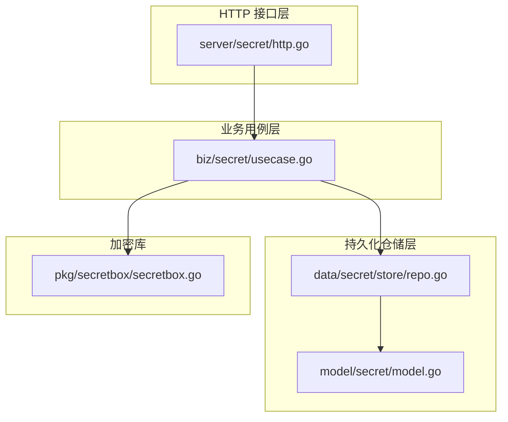
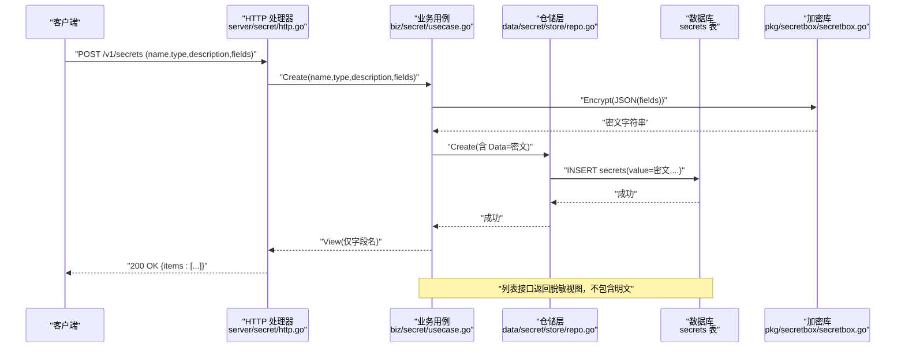
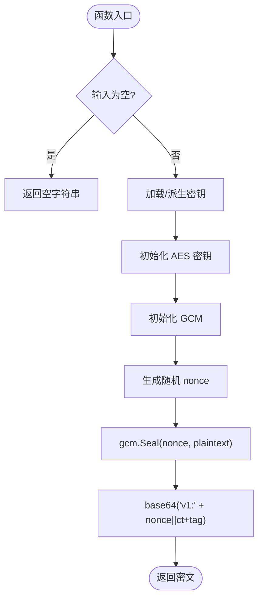
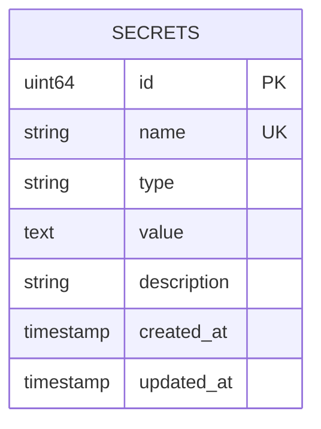
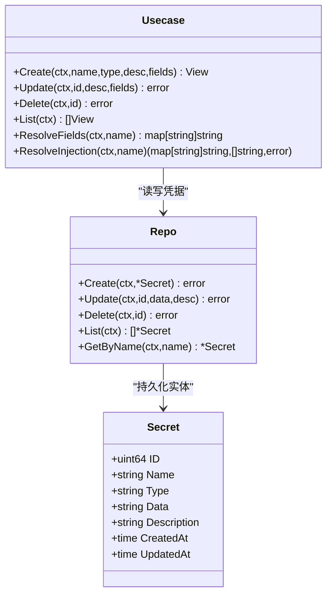
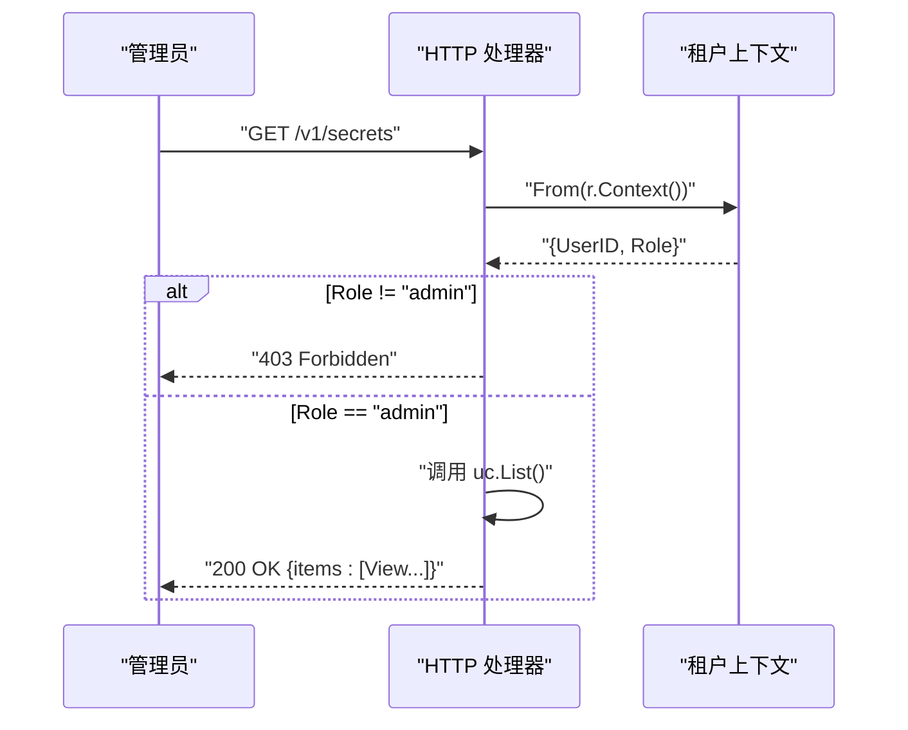
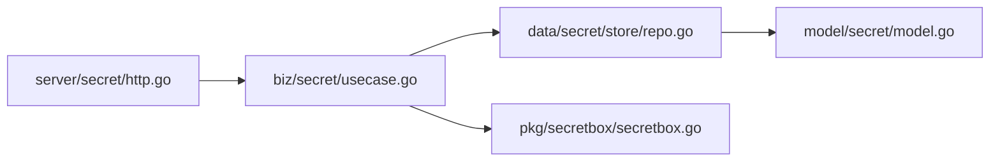

# 密钥管理

<cite>
**本文引用的文件**   
- [internal/pkg/secretbox/secretbox.go](file://internal/pkg/secretbox/secretbox.go)
- [internal/pkg/secretbox/secretbox_test.go](file://internal/pkg/secretbox/secretbox_test.go)
- [internal/manager/biz/secret/usecase.go](file://internal/manager/biz/secret/usecase.go)
- [internal/manager/data/secret/store/repo.go](file://internal/manager/data/secret/store/repo.go)
- [internal/manager/model/secret/model.go](file://internal/manager/model/secret/model.go)
- [internal/manager/server/secret/http.go](file://internal/manager/server/secret/http.go)
- [cmd/ongrid/main.go](file://cmd/ongrid/main.go)
- [ROADMAP.md](file://ROADMAP.md)
</cite>

## 目录
1. [简介](#简介)
2. [项目结构](#项目结构)
3. [核心组件](#核心组件)
4. [架构总览](#架构总览)
5. [详细组件分析](#详细组件分析)
6. [依赖关系分析](#依赖关系分析)
7. [性能与安全特性](#性能与安全特性)
8. [故障排查指南](#故障排查指南)
9. [结论](#结论)
10. [附录](#附录)

## 简介
本文件面向 OnGrid 密钥管理系统，聚焦于“机密盒（SecretBox）”加密机制与凭据库的端到端实现。内容涵盖：
- SecretBox 的密钥派生、数据加解密流程与存储格式
- 敏感信息的存储结构与加密算法选择
- 插件访问密钥的安全机制（权限控制、审计日志、访问监控）
- 密钥生命周期管理、备份恢复与灾难恢复方案
- 配置示例、安全最佳实践与合规检查清单
- 密钥泄露应急响应流程与漏洞修复指南

## 项目结构
OnGrid 的密钥管理由四层组成：HTTP 接口层、业务用例层、持久化仓储层与底层加密库。

图示来源
- [internal/manager/server/secret/http.go:1-189](file://internal/manager/server/secret/http.go#L1-L189)
- [internal/manager/biz/secret/usecase.go:1-202](file://internal/manager/biz/secret/usecase.go#L1-L202)
- [internal/manager/data/secret/store/repo.go:1-100](file://internal/manager/data/secret/store/repo.go#L1-L100)
- [internal/manager/model/secret/model.go:1-46](file://internal/manager/model/secret/model.go#L1-L46)
- [internal/pkg/secretbox/secretbox.go:1-110](file://internal/pkg/secretbox/secretbox.go#L1-L110)

章节来源
- [internal/manager/server/secret/http.go:1-189](file://internal/manager/server/secret/http.go#L1-L189)
- [internal/manager/biz/secret/usecase.go:1-202](file://internal/manager/biz/secret/usecase.go#L1-L202)
- [internal/manager/data/secret/store/repo.go:1-100](file://internal/manager/data/secret/store/repo.go#L1-L100)
- [internal/manager/model/secret/model.go:1-46](file://internal/manager/model/secret/model.go#L1-L46)
- [internal/pkg/secretbox/secretbox.go:1-110](file://internal/pkg/secretbox/secretbox.go#L1-L110)

## 核心组件
- HTTP 接口层
  - 提供 /v1/secrets 与 /v1/credential-types 等路由，仅管理员可访问；列表接口返回脱敏视图（字段名，不含值）。
- 业务用例层
  - 负责凭据的创建、更新、删除、列出与解析注入；在写入前对字段映射进行密封（加密），读取时按需解封；对外 API 不暴露明文。
- 持久化仓储层
  - 基于 GORM 的 secrets 表，Data 列存储已密封的密文；保证唯一性与错误语义。
- 加密库（SecretBox）
  - 使用 AES-256-GCM，密钥从环境变量派生；密文采用版本前缀 + base64(nonce || ciphertext+tag) 格式；支持旧明文兼容读取。

章节来源
- [internal/manager/server/secret/http.go:1-189](file://internal/manager/server/secret/http.go#L1-L189)
- [internal/manager/biz/secret/usecase.go:1-202](file://internal/manager/biz/secret/usecase.go#L1-L202)
- [internal/manager/data/secret/store/repo.go:1-100](file://internal/manager/data/secret/store/repo.go#L1-L100)
- [internal/manager/model/secret/model.go:1-46](file://internal/manager/model/secret/model.go#L1-L46)
- [internal/pkg/secretbox/secretbox.go:1-110](file://internal/pkg/secretbox/secretbox.go#L1-L110)

## 架构总览
下图展示了从 HTTP 请求到数据库落盘与解密的完整链路，以及对外只暴露字段名的脱敏策略。

图示来源
- [internal/manager/server/secret/http.go:27-76](file://internal/manager/server/secret/http.go#L27-L76)
- [internal/manager/biz/secret/usecase.go:48-72](file://internal/manager/biz/secret/usecase.go#L48-L72)
- [internal/manager/data/secret/store/repo.go:24-36](file://internal/manager/data/secret/store/repo.go#L24-L36)
- [internal/manager/model/secret/model.go:19-42](file://internal/manager/model/secret/model.go#L19-L42)
- [internal/pkg/secretbox/secretbox.go:53-75](file://internal/pkg/secretbox/secretbox.go#L53-L75)

## 详细组件分析

### SecretBox 加密机制
- 密钥派生
  - 从环境变量派生 32 字节 AES 密钥；若未设置则回退到固定盐派生的弱密钥，并提供 KeyIsWeak() 供启动期告警。
- 加密流程
  - 生成随机 nonce，使用 AES-256-GCM 对明文进行认证加密；输出为 "v1:" + base64(nonce || ciphertext+tag)。
- 解密流程
  - 空输入直接返回；无前缀视为历史明文透传；否则解码并验证 tag，失败返回错误。
- 测试覆盖
  - 往返加解密正确性、空串处理、历史明文兼容。

图示来源
- [internal/pkg/secretbox/secretbox.go:35-75](file://internal/pkg/secretbox/secretbox.go#L35-L75)

章节来源
- [internal/pkg/secretbox/secretbox.go:1-110](file://internal/pkg/secretbox/secretbox.go#L1-L110)
- [internal/pkg/secretbox/secretbox_test.go:1-30](file://internal/pkg/secretbox/secretbox_test.go#L1-L30)

### 凭据模型与存储格式
- 模型定义
  - 表名 secrets；字段包括 ID、Name（唯一）、Type、Data（text，存密文）、Description、时间戳。
- 存储格式
  - Data 列保存 JSON 字段映射经 SecretBox 密封后的密文字符串；API 侧不返回该字段。
- 迁移与兼容性
  - 沿用原 value 列名，避免 schema 变更；解密时对无前缀的历史明文做兼容透传。

图示来源
- [internal/manager/model/secret/model.go:19-42](file://internal/manager/model/secret/model.go#L19-L42)

章节来源
- [internal/manager/model/secret/model.go:1-46](file://internal/manager/model/secret/model.go#L1-L46)
- [internal/manager/data/secret/store/repo.go:67-88](file://internal/manager/data/secret/store/repo.go#L67-L88)

### 业务用例与注入规则
- 创建/更新
  - 校验名称与字段非空；将字段映射 JSON 序列化后密封再入库；更新时可仅改描述或重密封字段。
- 列表/查看
  - 列表返回 View（包含字段名集合），不返回值；获取单个凭据用于注入时按名称查找并解封。
- 注入解析
  - 根据类型选择注入规则（n8n 风格），将字段映射为环境变量；缺失字段会返回缺失列表。

图示来源
- [internal/manager/biz/secret/usecase.go:42-146](file://internal/manager/biz/secret/usecase.go#L42-L146)
- [internal/manager/data/secret/store/repo.go:18-88](file://internal/manager/data/secret/store/repo.go#L18-L88)
- [internal/manager/model/secret/model.go:19-42](file://internal/manager/model/secret/model.go#L19-L42)

章节来源
- [internal/manager/biz/secret/usecase.go:1-202](file://internal/manager/biz/secret/usecase.go#L1-L202)
- [internal/manager/data/secret/store/repo.go:1-100](file://internal/manager/data/secret/store/repo.go#L1-L100)
- [internal/manager/model/secret/model.go:1-46](file://internal/manager/model/secret/model.go#L1-L46)

### HTTP 接口与权限控制
- 路由
  - GET /v1/secrets、POST /v1/secrets、PUT /v1/secrets/{id}、DELETE /v1/secrets/{id}、GET /v1/credential-types。
- 权限
  - requireAdmin 校验上下文角色为 admin；非管理员返回 403。
- 响应
  - 统一 JSON 错误体与状态码映射；列表返回脱敏视图。

图示来源
- [internal/manager/server/secret/http.go:27-54](file://internal/manager/server/secret/http.go#L27-L54)
- [internal/manager/server/secret/http.go:125-136](file://internal/manager/server/secret/http.go#L125-L136)

章节来源
- [internal/manager/server/secret/http.go:1-189](file://internal/manager/server/secret/http.go#L1-L189)

### 审计日志与访问监控
- 审计记录
  - 系统内置追加式审计日志，默认保留 180 天，可通过环境变量调整；登录尝试等关键事件会被捕获。
- 审计用途
  - 作为“谁做了什么”的可追溯轨迹，支撑安全审计与合规取证。

章节来源
- [cmd/ongrid/main.go:409-420](file://cmd/ongrid/main.go#L409-L420)

## 依赖关系分析
- 组件耦合
  - HTTP 层仅依赖用例层；用例层依赖仓储与加密库；仓储层依赖模型与数据库驱动。
- 外部依赖
  - GORM 作为 ORM；标准库 crypto/aes/cipher 实现 GCM；JSON 编解码。
- 潜在风险
  - 密钥强度依赖环境变量；若未设置将启用弱密钥模式，需通过启动期告警提示。

图示来源
- [internal/manager/server/secret/http.go:1-189](file://internal/manager/server/secret/http.go#L1-L189)
- [internal/manager/biz/secret/usecase.go:1-202](file://internal/manager/biz/secret/usecase.go#L1-L202)
- [internal/manager/data/secret/store/repo.go:1-100](file://internal/manager/data/secret/store/repo.go#L1-L100)
- [internal/manager/model/secret/model.go:1-46](file://internal/manager/model/secret/model.go#L1-L46)
- [internal/pkg/secretbox/secretbox.go:1-110](file://internal/pkg/secretbox/secretbox.go#L1-L110)

章节来源
- [internal/manager/server/secret/http.go:1-189](file://internal/manager/server/secret/http.go#L1-L189)
- [internal/manager/biz/secret/usecase.go:1-202](file://internal/manager/biz/secret/usecase.go#L1-L202)
- [internal/manager/data/secret/store/repo.go:1-100](file://internal/manager/data/secret/store/repo.go#L1-L100)
- [internal/manager/model/secret/model.go:1-46](file://internal/manager/model/secret/model.go#L1-L46)
- [internal/pkg/secretbox/secretbox.go:1-110](file://internal/pkg/secretbox/secretbox.go#L1-L110)

## 性能与安全特性
- 性能
  - 加解密为轻量级对称操作；列表接口仅返回字段名，避免大对象传输。
- 安全
  - 仅管理员可访问凭据管理接口；列表与详情均不返回明文；注入路径仅在进程内完成。
  - 支持历史明文兼容读取，便于平滑迁移。
- 合规规划
  - 路线图包含“每组织凭据库”、“离线保险箱包”、“不可篡改审计日志”、“静态数据加密（KMS）”等能力。

章节来源
- [internal/manager/server/secret/http.go:1-189](file://internal/manager/server/secret/http.go#L1-L189)
- [internal/manager/biz/secret/usecase.go:1-202](file://internal/manager/biz/secret/usecase.go#L1-L202)
- [ROADMAP.md:465-509](file://ROADMAP.md#L465-L509)

## 故障排查指南
- 解密失败
  - 现象：open 报错，提示密钥不正确。
  - 排查：确认运行环境设置了正确的 ONGRID_SECRET_KEY；若误用不同实例的环境变量会导致无法解密。
- 弱密钥告警
  - 现象：启动期提示 KeyIsWeak。
  - 处置：设置强随机密钥并重启服务。
- 列表接口无值
  - 现象：列表返回字段名但看不到值。
  - 说明：这是预期行为，值仅在内核注入路径中解封。
- 历史明文兼容
  - 现象：旧数据无前缀仍可读取。
  - 建议：尽快触发一次写操作以重写为密文格式。

章节来源
- [internal/pkg/secretbox/secretbox.go:80-109](file://internal/pkg/secretbox/secretbox.go#L80-L109)
- [internal/pkg/secretbox/secretbox_test.go:25-30](file://internal/pkg/secretbox/secretbox_test.go#L25-L30)
- [internal/manager/biz/secret/usecase.go:94-106](file://internal/manager/biz/secret/usecase.go#L94-L106)

## 结论
OnGrid 的密钥管理以 SecretBox 为核心，结合严格的权限控制与脱敏输出，实现了“数据库导出不可还原明文”的安全基线。配合审计日志与路线图中的企业级能力（KMS、不可篡改审计、离线保险箱），可满足多场景下的合规与运维需求。

## 附录

### 密钥配置示例
- 环境变量
  - ONGRID_SECRET_KEY：AES-256-GCM 密钥派生源，必须设置为强随机值。
  - ONGRID_AUDIT_RETENTION_DAYS：审计日志保留天数，0 表示关闭自动清理。
- 首次启动
  - 系统会检查并提示弱密钥情况，请确保生产环境设置强密钥。

章节来源
- [internal/pkg/secretbox/secretbox.go:35-51](file://internal/pkg/secretbox/secretbox.go#L35-L51)
- [cmd/ongrid/main.go:409-420](file://cmd/ongrid/main.go#L409-L420)

### 安全最佳实践
- 密钥管理
  - 使用强随机密钥并通过受控方式注入；禁止硬编码与提交至代码仓库。
- 最小权限
  - 仅授予管理员访问凭据管理接口；限制跨租户访问。
- 审计与监控
  - 开启审计日志并集中收集；定期审查异常访问与失败解密事件。
- 数据保护
  - 数据库与对象存储启用静态加密；考虑引入 KMS 实现密钥托管与轮换。
- 合规准备
  - 遵循路线图中的“不可篡改审计日志”、“合规证据包”、“每组织凭据库”等能力落地。

章节来源
- [ROADMAP.md:465-509](file://ROADMAP.md#L465-L509)

### 合规检查清单
- 是否设置强密钥且未使用弱密钥模式
- 是否仅管理员可访问凭据管理接口
- 列表与详情是否不返回明文
- 是否开启审计日志并具备保留策略
- 是否具备数据库静态加密与 KMS 集成计划
- 是否具备离线保险箱与快照恢复能力

章节来源
- [internal/manager/server/secret/http.go:125-136](file://internal/manager/server/secret/http.go#L125-L136)
- [cmd/ongrid/main.go:409-420](file://cmd/ongrid/main.go#L409-L420)
- [ROADMAP.md:316-426](file://ROADMAP.md#L316-L426)

### 密钥泄露应急响应流程
- 立即隔离
  - 撤销受影响凭据的使用权限；暂停相关自动化任务。
- 快速轮换
  - 在凭据管理中更新对应条目；必要时重新下发至边缘节点或下游系统。
- 影响评估
  - 通过审计日志定位访问范围与时间点；评估数据外泄面。
- 加固措施
  - 强制轮换所有共享凭据；收紧访问控制与网络边界；加强监控告警。
- 复盘改进
  - 形成事后报告；完善检测与阻断策略；补充演练与培训。

[本节为通用流程指导，无需源码引用]

### 漏洞修复指南
- 弱密钥修复
  - 设置强随机密钥并重启；验证 KeyIsWeak 不再告警。
- 历史明文迁移
  - 触发一次写操作使数据重写为密文格式；验证解密正常。
- 权限越权修复
  - 校验 requireAdmin 逻辑；确保新增接口继承相同鉴权中间件。
- 审计增强
  - 扩展审计事件粒度；接入集中日志平台与告警规则。

章节来源
- [internal/pkg/secretbox/secretbox.go:46-51](file://internal/pkg/secretbox/secretbox.go#L46-L51)
- [internal/manager/server/secret/http.go:125-136](file://internal/manager/server/secret/http.go#L125-L136)
- [cmd/ongrid/main.go:409-420](file://cmd/ongrid/main.go#L409-L420)