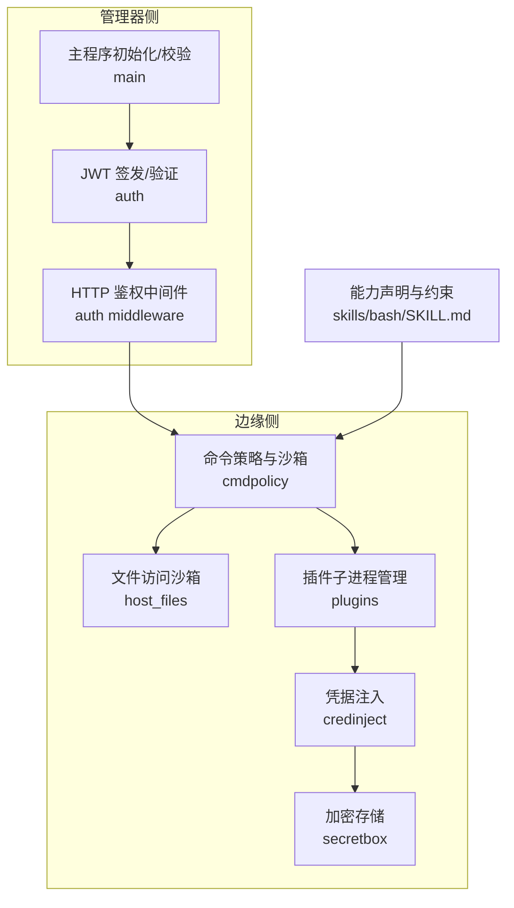
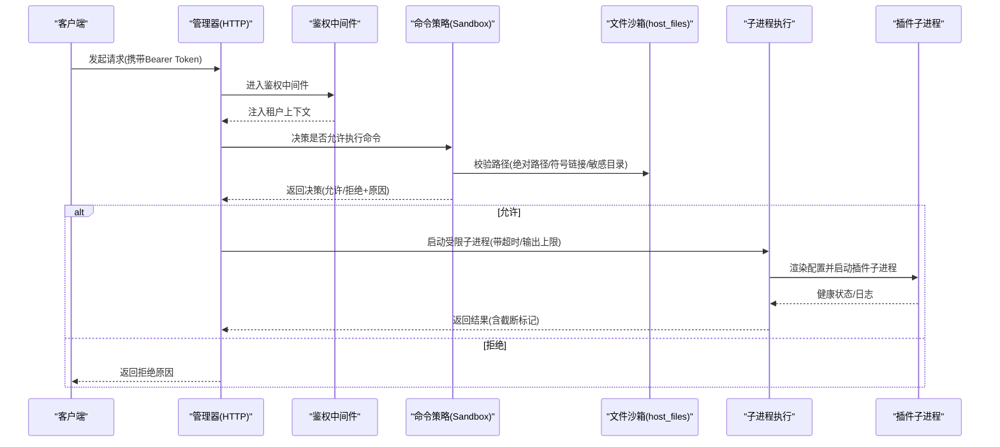
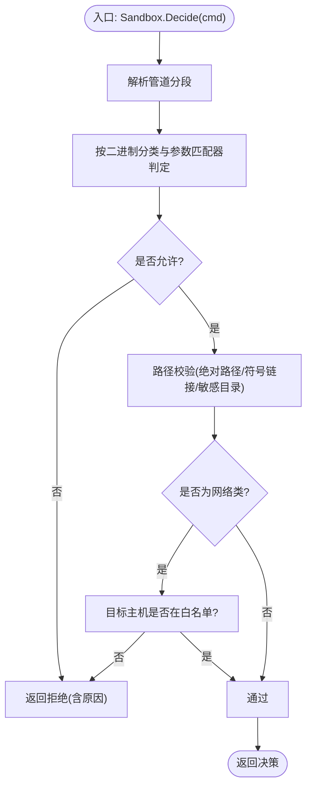
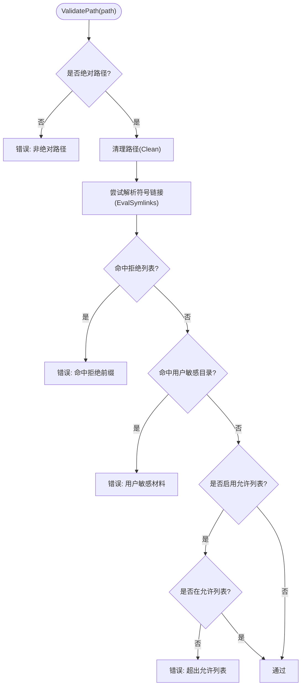
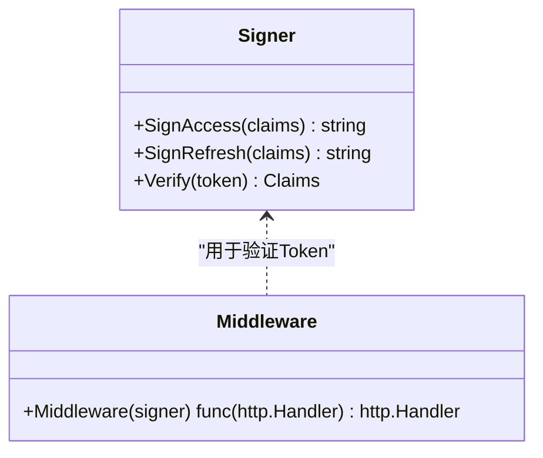
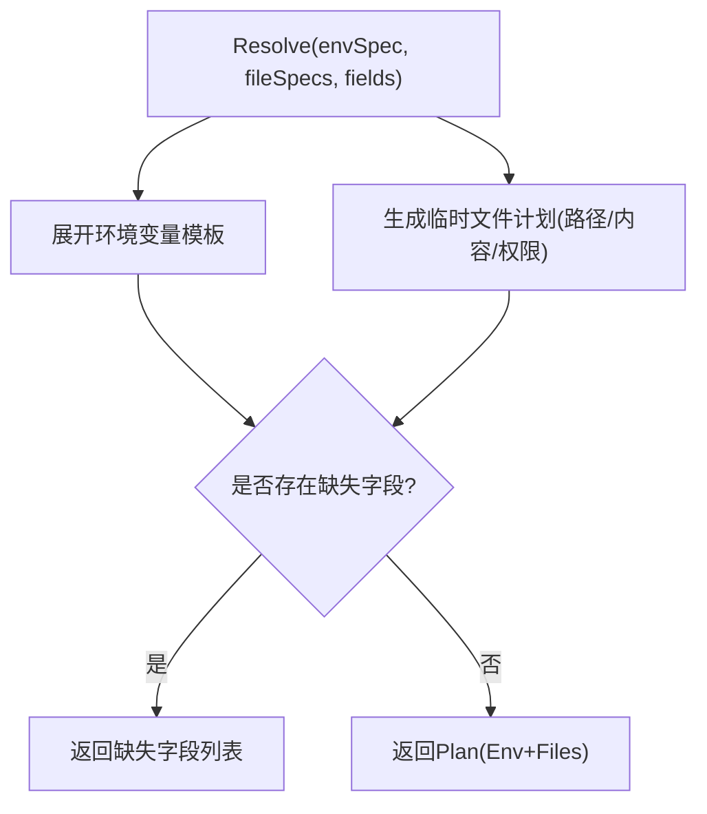
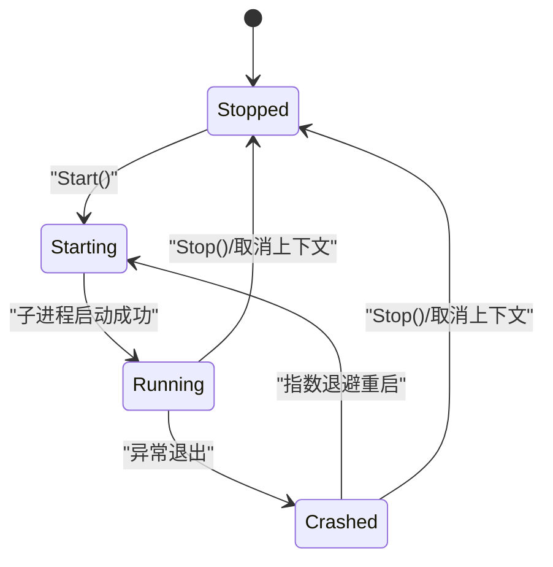
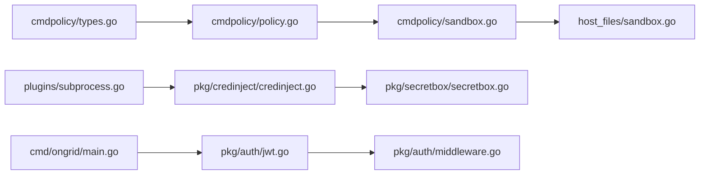

# 插件安全机制

<cite>
**本文引用的文件**   
- [sandbox.go](file://internal/edgeagent/cmdpolicy/sandbox.go)
- [policy.go](file://internal/edgeagent/cmdpolicy/policy.go)
- [types.go](file://internal/edgeagent/cmdpolicy/types.go)
- [sandbox.go](file://internal/edgeagent/host_files/sandbox.go)
- [secretbox.go](file://internal/pkg/secretbox/secretbox.go)
- [jwt.go](file://internal/pkg/auth/jwt.go)
- [middleware.go](file://internal/pkg/auth/middleware.go)
- [credinject.go](file://internal/pkg/credinject/credinject.go)
- [config_env.go](file://internal/edgeagent/plugins/config_env.go)
- [subprocess.go](file://internal/edgeagent/plugins/subprocess.go)
- [main.go](file://cmd/ongrid/main.go)
- [SKILL.md](file://skills/bash/SKILL.md)
</cite>

## 目录
1. [简介](#简介)
2. [项目结构](#项目结构)
3. [核心组件](#核心组件)
4. [架构总览](#架构总览)
5. [详细组件分析](#详细组件分析)
6. [依赖关系分析](#依赖关系分析)
7. [性能与资源限制](#性能与资源限制)
8. [故障排查指南](#故障排查指南)
9. [结论](#结论)
10. [附录：开发与安全清单](#附录开发与安全清单)

## 简介
本文件系统性阐述 OnGrid 插件体系的安全机制，覆盖沙箱隔离、权限控制、资源限制、命令执行策略、文件访问控制、网络白名单、认证授权、密钥管理与敏感信息保护。文档同时提供架构图、权限矩阵、安全检查清单以及审计日志与行为监控要点，帮助开发者与管理者构建可审计、可观测、可回滚的插件运行环境。

## 项目结构
围绕“插件安全”的关键代码分布在以下模块：
- 命令策略与沙箱执行：internal/edgeagent/cmdpolicy
- 主机文件访问沙箱：internal/edgeagent/host_files
- 认证与鉴权中间件：internal/pkg/auth
- 凭据注入与加密存储：internal/pkg/credinject、internal/pkg/secretbox
- 插件生命周期与子进程管理：internal/edgeagent/plugins
- 启动引导与默认配置校验：cmd/ongrid/main.go
- 能力声明与操作约定：skills/bash/SKILL.md

图表来源
- [sandbox.go:1-213](file://internal/edgeagent/cmdpolicy/sandbox.go#L1-L213)
- [policy.go:33-492](file://internal/edgeagent/cmdpolicy/policy.go#L33-L492)
- [types.go:43-182](file://internal/edgeagent/cmdpolicy/types.go#L43-L182)
- [sandbox.go:1-193](file://internal/edgeagent/host_files/sandbox.go#L1-L193)
- [subprocess.go:17-102](file://internal/edgeagent/plugins/subprocess.go#L17-L102)
- [credinject.go:1-100](file://internal/pkg/credinject/credinject.go#L1-L100)
- [secretbox.go:1-110](file://internal/pkg/secretbox/secretbox.go#L1-L110)
- [jwt.go:1-100](file://internal/pkg/auth/jwt.go#L1-L100)
- [middleware.go:1-68](file://internal/pkg/auth/middleware.go#L1-L68)
- [main.go:282-303](file://cmd/ongrid/main.go#L282-L303)
- [SKILL.md:126-146](file://skills/bash/SKILL.md#L126-L146)

章节来源
- [sandbox.go:1-213](file://internal/edgeagent/cmdpolicy/sandbox.go#L1-L213)
- [policy.go:33-492](file://internal/edgeagent/cmdpolicy/policy.go#L33-L492)
- [types.go:43-182](file://internal/edgeagent/cmdpolicy/types.go#L43-L182)
- [sandbox.go:1-193](file://internal/edgeagent/host_files/sandbox.go#L1-L193)
- [subprocess.go:17-102](file://internal/edgeagent/plugins/subprocess.go#L17-L102)
- [credinject.go:1-100](file://internal/pkg/credinject/credinject.go#L1-L100)
- [secretbox.go:1-110](file://internal/pkg/secretbox/secretbox.go#L1-L110)
- [jwt.go:1-100](file://internal/pkg/auth/jwt.go#L1-L100)
- [middleware.go:1-68](file://internal/pkg/auth/middleware.go#L1-L68)
- [main.go:282-303](file://cmd/ongrid/main.go#L282-L303)
- [SKILL.md:126-146](file://skills/bash/SKILL.md#L126-L146)

## 核心组件
- 命令策略与沙箱（cmdpolicy）
  - 基于二进制分类（只读文件系统、只读系统、混合、网络、拒绝）进行细粒度放行/拒绝。
  - 支持管道分段解析、参数匹配器（AnyFlag/Subcmd/SubcmdPath）、全局拒绝参数集。
  - 输出大小上限、调用超时、最大参数数量等运行时限制。
  - 路径校验复用 host_files 的 ValidatePath；网络目标主机通过白名单校验。
- 文件访问沙箱（host_files）
  - 以“拒绝列表 + 可选允许列表”的方式对绝对路径进行校验，处理符号链接与用户敏感目录。
  - 仅允许受控的二进制集合（find/du/stat/df/ls 等），缺失则明确报错。
- 认证与鉴权（auth）
  - JWT 签发/验证，中间件将租户上下文写入请求上下文，供后续鉴权使用。
- 凭据注入与加密（credinject + secretbox）
  - 凭据模板展开为环境变量或临时文件；敏感数据以 AES-256-GCM 加密存储，密钥由环境变量派生。
- 插件子进程管理（plugins）
  - 统一的生命周期管理、崩溃指数退避重启、标准输出/错误捕获、优雅退出。
- 启动引导与默认配置校验（main）
  - 强制要求强随机 JWT 密钥，否则拒绝启动；审计保留期等关键配置在启动时设置。

章节来源
- [types.go:43-182](file://internal/edgeagent/cmdpolicy/types.go#L43-L182)
- [policy.go:33-492](file://internal/edgeagent/cmdpolicy/policy.go#L33-L492)
- [sandbox.go:1-213](file://internal/edgeagent/cmdpolicy/sandbox.go#L1-L213)
- [sandbox.go:1-193](file://internal/edgeagent/host_files/sandbox.go#L1-L193)
- [jwt.go:1-100](file://internal/pkg/auth/jwt.go#L1-L100)
- [middleware.go:1-68](file://internal/pkg/auth/middleware.go#L1-L68)
- [credinject.go:1-100](file://internal/pkg/credinject/credinject.go#L1-L100)
- [secretbox.go:1-110](file://internal/pkg/secretbox/secretbox.go#L1-L110)
- [subprocess.go:17-102](file://internal/edgeagent/plugins/subprocess.go#L17-L102)
- [main.go:282-303](file://cmd/ongrid/main.go#L282-L303)

## 架构总览
下图展示从 HTTP 鉴权到命令执行与插件子进程的端到端安全链路。

图表来源
- [middleware.go:1-68](file://internal/pkg/auth/middleware.go#L1-L68)
- [sandbox.go:76-188](file://internal/edgeagent/cmdpolicy/sandbox.go#L76-L188)
- [sandbox.go:152-193](file://internal/edgeagent/host_files/sandbox.go#L152-L193)
- [subprocess.go:137-183](file://internal/edgeagent/plugins/subprocess.go#L137-L183)

## 详细组件分析

### 命令策略与沙箱（cmdpolicy）
- 设计要点
  - 二进制分类与参数匹配器实现“按语义放行”，而非简单白名单。
  - 管道分段解析避免 shell 元字符注入；每个段独立校验。
  - 输出上限与超时防止资源耗尽；Truncated 标志提示上层重试或改写命令。
  - 路径校验复用 host_files，确保单一事实来源。
  - 网络类命令的目标主机必须命中白名单（CIDR/后缀/精确匹配）。
- 关键流程
  - Decide：先按策略判定，再叠加路径与网络白名单检查。
  - Exec：根据 Decision 组装管道、设置最小化环境变量、组进程组、捕获输出并统计耗时。
  - ExecRaw：管理员写门限逃逸通道，绕过所有策略但保留超时与输出上限。

图表来源
- [sandbox.go:76-132](file://internal/edgeagent/cmdpolicy/sandbox.go#L76-L132)
- [policy.go:707-800](file://internal/edgeagent/cmdpolicy/policy.go#L707-L800)
- [types.go:132-182](file://internal/edgeagent/cmdpolicy/types.go#L132-L182)

章节来源
- [sandbox.go:1-213](file://internal/edgeagent/cmdpolicy/sandbox.go#L1-L213)
- [policy.go:33-492](file://internal/edgeagent/cmdpolicy/policy.go#L33-L492)
- [types.go:43-182](file://internal/edgeagent/cmdpolicy/types.go#L43-L182)

### 文件访问沙箱（host_files）
- 设计要点
  - 拒绝列表优先：虚拟文件系统与高敏感目录一律拒绝。
  - 可选允许列表：当非空时，路径需额外命中允许前缀。
  - 符号链接解析：若存在，则以解析后的真实路径再次校验。
  - 每用户敏感目录：/home/<user>/.ssh 与 .gnupg 动态拒绝。
  - 二进制白名单：仅允许 find/du/stat/df/ls 等受控工具。
- 典型场景
  - 诊断扫描根分区：du / 可通过（不在拒绝列表），但若开启允许列表则需显式包含根路径。
  - 读取用户私钥：/root/.ssh/id_rsa 被拒绝。

图表来源
- [sandbox.go:152-193](file://internal/edgeagent/host_files/sandbox.go#L152-L193)
- [sandbox.go:75-109](file://internal/edgeagent/host_files/sandbox.go#L75-L109)

章节来源
- [sandbox.go:1-193](file://internal/edgeagent/host_files/sandbox.go#L1-L193)

### 认证与鉴权（auth）
- JWT 签发/验证
  - HS256 签名，Claims 包含用户标识、角色与超级管理员标记。
  - 过期时间由 TTL 控制，支持访问令牌与刷新令牌。
- 鉴权中间件
  - 从 Authorization 头或查询参数提取 Bearer Token。
  - 验证通过后注入租户上下文，供后续鉴权与审计使用。
- 启动保护
  - 主程序启动时检测 JWT 密钥是否为内置不安全值，若是则拒绝启动。

图表来源
- [jwt.go:1-100](file://internal/pkg/auth/jwt.go#L1-L100)
- [middleware.go:1-68](file://internal/pkg/auth/middleware.go#L1-L68)
- [main.go:282-303](file://cmd/ongrid/main.go#L282-L303)

章节来源
- [jwt.go:1-100](file://internal/pkg/auth/jwt.go#L1-L100)
- [middleware.go:1-68](file://internal/pkg/auth/middleware.go#L1-L68)
- [main.go:282-303](file://cmd/ongrid/main.go#L282-L303)

### 凭据注入与敏感信息保护（credinject + secretbox）
- 凭据注入
  - 通过模板 {{field}} 将凭据字段展开为环境变量或临时文件，支持文件权限控制。
  - 缺失字段会记录并返回，便于上游告警或降级。
- 加密存储
  - 使用 AES-256-GCM，密钥由环境变量派生；未设置时使用弱默认值并报告 KeyIsWeak。
  - 密文格式带版本前缀，兼容旧明文迁移。

图表来源
- [credinject.go:47-90](file://internal/pkg/credinject/credinject.go#L47-L90)
- [secretbox.go:35-109](file://internal/pkg/secretbox/secretbox.go#L35-L109)

章节来源
- [credinject.go:1-100](file://internal/pkg/credinject/credinject.go#L1-L100)
- [secretbox.go:1-110](file://internal/pkg/secretbox/secretbox.go#L1-L110)

### 插件子进程管理（plugins）
- 生命周期
  - Configure：渲染配置到工作目录（如需要），保持幂等。
  - Start/Stop：启动/停止子进程，优雅退出（SIGTERM），等待超时保护。
  - runLoop：崩溃后指数退避重启，记录健康快照（PID、状态、错误、重启次数）。
- 安全相关
  - 工作目录位于 ReadWritePaths 下，配合系统级 ProtectSystem=strict 减少越权风险。
  - 日志落盘至 workDir 下的专属文件，便于集中采集与审计。

图表来源
- [subprocess.go:137-235](file://internal/edgeagent/plugins/subprocess.go#L137-L235)

章节来源
- [subprocess.go:17-318](file://internal/edgeagent/plugins/subprocess.go#L17-L318)

### 插件配置与环境变量（config_env）
- 通过环境变量为插件提供配置与认证信息，支持 per-plugin 开关、端点、基本认证或 Bearer Token、JSON 规格。
- 当未显式设置认证字段时，回退到隧道 ACCESS_KEY/SECRET_KEY，降低运维复杂度。

章节来源
- [config_env.go:1-101](file://internal/edgeagent/plugins/config_env.go#L1-L101)

### 能力声明与操作约定（skills/bash/SKILL.md）
- 明确允许的命令分类与示例，标注读写分流与危险参数拒绝。
- 作为 operator 与 LLM 的契约，驱动 cmdpolicy 与 host_files 的策略收敛。

章节来源
- [SKILL.md:126-146](file://skills/bash/SKILL.md#L126-L146)

## 依赖关系分析
- 松耦合
  - cmdpolicy 通过 PathValidator 接口复用 host_files 的路径校验逻辑，避免重复实现。
  - plugins 子进程管理不感知具体业务，仅负责生命周期与健康上报。
- 外部依赖
  - auth 依赖 JWT 库；secretbox 依赖 crypto/aes/cipher/rand。
  - main 依赖 IAM 与审计仓库完成初始化管理员账户与审计保留期。

图表来源
- [types.go:132-182](file://internal/edgeagent/cmdpolicy/types.go#L132-L182)
- [policy.go:33-492](file://internal/edgeagent/cmdpolicy/policy.go#L33-L492)
- [sandbox.go:1-213](file://internal/edgeagent/cmdpolicy/sandbox.go#L1-L213)
- [sandbox.go:1-193](file://internal/edgeagent/host_files/sandbox.go#L1-L193)
- [subprocess.go:17-102](file://internal/edgeagent/plugins/subprocess.go#L17-L102)
- [credinject.go:1-100](file://internal/pkg/credinject/credinject.go#L1-L100)
- [secretbox.go:1-110](file://internal/pkg/secretbox/secretbox.go#L1-L110)
- [jwt.go:1-100](file://internal/pkg/auth/jwt.go#L1-L100)
- [middleware.go:1-68](file://internal/pkg/auth/middleware.go#L1-L68)
- [main.go:282-303](file://cmd/ongrid/main.go#L282-L303)

## 性能与资源限制
- 输出上限
  - stdout/stderr 分别有字节上限，超过后 Truncated=true，避免内存膨胀与响应过大。
- 超时控制
  - 每调用一次设置硬超时，管道整体在超时时被取消，防止长时间占用资源。
- 参数规模
  - MaxArgs 限制单段 argv 长度，防御 ARG_MAX 洪水攻击。
- 子进程重启
  - 指数退避重启，上限封顶，避免雪崩。

章节来源
- [policy.go:26-31](file://internal/edgeagent/cmdpolicy/policy.go#L26-L31)
- [sandbox.go:140-188](file://internal/edgeagent/cmdpolicy/sandbox.go#L140-L188)
- [subprocess.go:197-235](file://internal/edgeagent/plugins/subprocess.go#L197-L235)

## 故障排查指南
- 常见拒绝原因
  - 二进制不在策略中或被归类为 denied。
  - 参数命中 WriteMatchers 或 DeniedArgs。
  - 路径不在允许列表或命中拒绝列表（含符号链接解析后）。
  - 网络目标主机不在白名单。
- 定位步骤
  - 查看 Sandbox.Decide 返回的 Reason。
  - 核对 SKILL.md 中的允许分类与示例。
  - 确认 host_files 的 DeniedReadPaths 与 AllowedReadPaths 配置。
  - 检查 NetworkHostAllowlist 是否包含目标 CIDR/后缀。
- 子进程问题
  - 观察 HealthSnapshot 的 State/LastError/RestartCount。
  - 检查工作目录日志文件，确认配置渲染与启动参数。

章节来源
- [sandbox.go:76-132](file://internal/edgeagent/cmdpolicy/sandbox.go#L76-L132)
- [policy.go:707-800](file://internal/edgeagent/cmdpolicy/policy.go#L707-L800)
- [sandbox.go:152-193](file://internal/edgeagent/host_files/sandbox.go#L152-L193)
- [subprocess.go:185-235](file://internal/edgeagent/plugins/subprocess.go#L185-L235)

## 结论
OnGrid 插件安全机制以“策略先行、最小权限、纵深防御”为核心：通过命令策略与参数匹配器实现细粒度放行，结合路径与网络白名单进一步收敛攻击面；以 JWT 与租户上下文保障身份与多租户隔离；凭据注入与加密存储确保敏感信息最小暴露；子进程管理与资源限制保障稳定性与可用性。建议在生产环境中严格配置网络白名单、启用允许列表、轮换强密钥，并结合审计与监控形成闭环。

## 附录：开发与安全清单

### 权限矩阵（摘要）
- 只读文件系统（ClassReadFS）：允许
- 只读系统（ClassReadSystem）：允许
- 混合（ClassMixed）：按参数匹配器判定，写操作拒绝
- 网络（ClassNetwork）：目标主机必须在白名单
- 拒绝（ClassDenied）：一律拒绝

章节来源
- [types.go:43-77](file://internal/edgeagent/cmdpolicy/types.go#L43-L77)
- [policy.go:760-800](file://internal/edgeagent/cmdpolicy/policy.go#L760-L800)

### 安全检查清单
- 策略与执行
  - 是否启用 DefaultReadOnly 并仅按需扩展？
  - 是否配置 NetworkHostAllowlist 且为空即拒绝所有出站？
  - 是否设置合理的 StdoutCap/StderrCap/Timeout/MaxArgs？
- 文件访问
  - 是否启用 AllowedReadPaths 收紧范围？
  - 是否保留默认 DeniedReadPaths 与用户敏感目录规则？
- 认证与密钥
  - 是否设置强随机 JWT 密钥（禁止默认值）？
  - 是否启用 secretbox 并使用强 ONGRID_SECRET_KEY？
- 插件与子进程
  - 是否将工作目录置于 ReadWritePaths 下？
  - 是否监控 HealthSnapshot 并配置告警阈值？
- 合规与审计
  - 是否启用审计日志并配置保留期？
  - 是否定期导出合规证据包（变更历史、访问列表、事件时间线）？

章节来源
- [policy.go:33-492](file://internal/edgeagent/cmdpolicy/policy.go#L33-L492)
- [sandbox.go:75-109](file://internal/edgeagent/host_files/sandbox.go#L75-L109)
- [main.go:282-303](file://cmd/ongrid/main.go#L282-L303)
- [secretbox.go:35-51](file://internal/pkg/secretbox/secretbox.go#L35-L51)
- [subprocess.go:185-235](file://internal/edgeagent/plugins/subprocess.go#L185-L235)