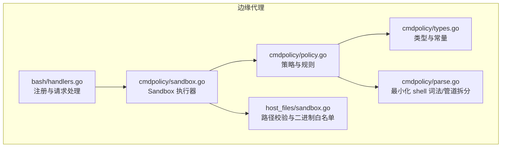
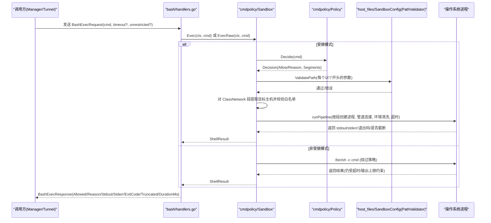
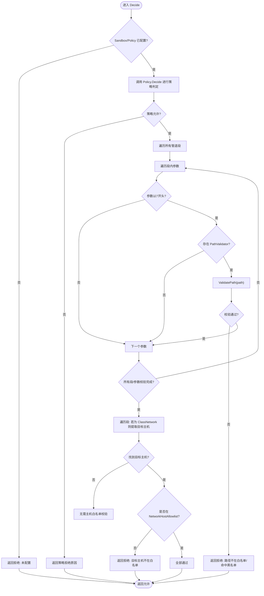
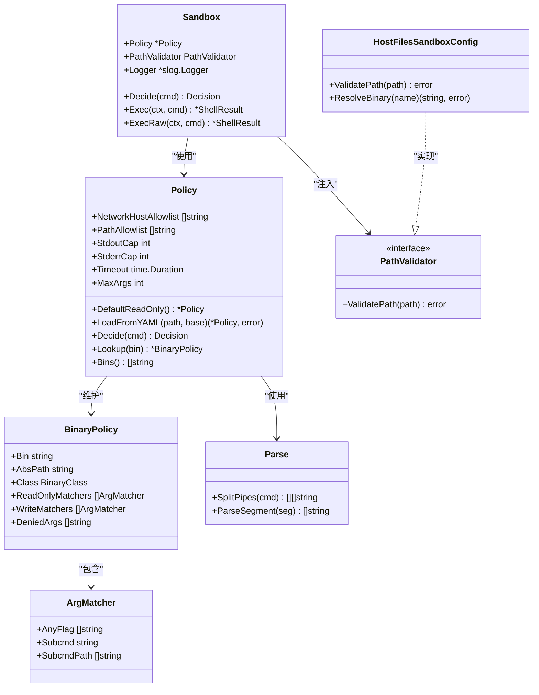

# 沙箱隔离机制

<cite>
**本文引用的文件**   
- [internal/edgeagent/cmdpolicy/sandbox.go](file://internal/edgeagent/cmdpolicy/sandbox.go)
- [internal/edgeagent/cmdpolicy/policy.go](file://internal/edgeagent/cmdpolicy/policy.go)
- [internal/edgeagent/cmdpolicy/types.go](file://internal/edgeagent/cmdpolicy/types.go)
- [internal/edgeagent/cmdpolicy/parse.go](file://internal/edgeagent/cmdpolicy/parse.go)
- [internal/edgeagent/host_files/sandbox.go](file://internal/edgeagent/host_files/sandbox.go)
- [internal/edgeagent/bash/handlers.go](file://internal/edgeagent/bash/handlers.go)
</cite>

## 目录
1. [简介](#简介)
2. [项目结构](#项目结构)
3. [核心组件](#核心组件)
4. [架构总览](#架构总览)
5. [详细组件分析](#详细组件分析)
6. [依赖关系分析](#依赖关系分析)
7. [性能与资源限制](#性能与资源限制)
8. [故障排查指南](#故障排查指南)
9. [结论](#结论)
10. [附录：配置示例与权限矩阵](#附录配置示例与权限矩阵)

## 简介
本文件系统性阐述 OnGrid 插件命令执行沙箱的隔离机制，聚焦以下方面：
- 进程隔离、文件系统访问控制、网络访问限制与资源限制的实现原理
- Sandbox.Decide 方法的工作流程
- 路径验证器 PathValidator 的白名单机制
- 网络主机白名单 NetworkHostAllowlist 的配置与使用
- 沙箱生命周期管理、资源配额控制与异常处理
- 架构图、权限矩阵与安全边界定义
- 配置示例、性能调优与故障排查

## 项目结构
与沙箱相关的关键代码位于 edgeagent 子系统中，围绕“策略 + 执行”的两层设计：
- cmdpolicy：策略解析、规则匹配、管道拆分、执行编排（Sandbox）
- host_files：路径校验与二进制白名单（被 cmdpolicy 复用）
- bash：边缘侧 Bash 执行处理器，组装 Sandbox 并暴露为远程调用入口

图表来源
- [internal/edgeagent/bash/handlers.go:49-94](file://internal/edgeagent/bash/handlers.go#L49-L94)
- [internal/edgeagent/cmdpolicy/sandbox.go:52-132](file://internal/edgeagent/cmdpolicy/sandbox.go#L52-L132)
- [internal/edgeagent/cmdpolicy/policy.go:703-800](file://internal/edgeagent/cmdpolicy/policy.go#L703-L800)
- [internal/edgeagent/cmdpolicy/types.go:132-182](file://internal/edgeagent/cmdpolicy/types.go#L132-L182)
- [internal/edgeagent/cmdpolicy/parse.go:32-69](file://internal/edgeagent/cmdpolicy/parse.go#L32-L69)
- [internal/edgeagent/host_files/sandbox.go:152-193](file://internal/edgeagent/host_files/sandbox.go#L152-L193)

章节来源
- [internal/edgeagent/bash/handlers.go:49-94](file://internal/edgeagent/bash/handlers.go#L49-L94)
- [internal/edgeagent/cmdpolicy/sandbox.go:52-132](file://internal/edgeagent/cmdpolicy/sandbox.go#L52-L132)
- [internal/edgeagent/cmdpolicy/policy.go:703-800](file://internal/edgeagent/cmdpolicy/policy.go#L703-L800)
- [internal/edgeagent/cmdpolicy/types.go:132-182](file://internal/edgeagent/cmdpolicy/types.go#L132-L182)
- [internal/edgeagent/cmdpolicy/parse.go:32-69](file://internal/edgeagent/cmdpolicy/parse.go#L32-L69)
- [internal/edgeagent/host_files/sandbox.go:152-193](file://internal/edgeagent/host_files/sandbox.go#L152-L193)

## 核心组件
- 策略 Policy：维护可执行二进制清单、分类（只读/混合/网络/拒绝）、参数匹配器、全局限制（输出上限、超时、最大参数个数、路径白名单、网络主机白名单）。提供 Decide 进行纯策略判定。
- 执行器 Sandbox：在策略基础上叠加路径校验、网络目标白名单、管道执行、环境变量清洗、超时与输出截断等安全与资源控制。
- 路径验证器 PathValidator：由 host_files.SandboxConfig 实现，负责绝对路径的白名单/黑名单校验与符号链接规范化检查。
- 解析器 parse：最小化 shell 语法支持，仅允许简单命令与管道，禁止重定向、变量展开、命令替换等危险特性。
- Bash 处理器：加载默认策略与可选 YAML 覆盖，构造 Sandbox，并将 ShellResult 映射为响应。

章节来源
- [internal/edgeagent/cmdpolicy/types.go:132-182](file://internal/edgeagent/cmdpolicy/types.go#L132-L182)
- [internal/edgeagent/cmdpolicy/sandbox.go:52-132](file://internal/edgeagent/cmdpolicy/sandbox.go#L52-L132)
- [internal/edgeagent/host_files/sandbox.go:152-193](file://internal/edgeagent/host_files/sandbox.go#L152-L193)
- [internal/edgeagent/cmdpolicy/parse.go:32-69](file://internal/edgeagent/cmdpolicy/parse.go#L32-L69)
- [internal/edgeagent/bash/handlers.go:49-94](file://internal/edgeagent/bash/handlers.go#L49-L94)

## 架构总览
下图展示了从请求到执行的完整链路，以及关键的安全边界点。

图表来源
- [internal/edgeagent/bash/handlers.go:99-157](file://internal/edgeagent/bash/handlers.go#L99-L157)
- [internal/edgeagent/cmdpolicy/sandbox.go:140-188](file://internal/edgeagent/cmdpolicy/sandbox.go#L140-L188)
- [internal/edgeagent/cmdpolicy/policy.go:703-800](file://internal/edgeagent/cmdpolicy/policy.go#L703-L800)
- [internal/edgeagent/host_files/sandbox.go:152-193](file://internal/edgeagent/host_files/sandbox.go#L152-L193)

## 详细组件分析

### Sandbox.Decide 工作流程
Sandbox.Decide 将策略决策、路径校验和网络目标白名单串联起来，形成最终的可执行性判断。

图表来源
- [internal/edgeagent/cmdpolicy/sandbox.go:76-132](file://internal/edgeagent/cmdpolicy/sandbox.go#L76-L132)
- [internal/edgeagent/cmdpolicy/policy.go:703-800](file://internal/edgeagent/cmdpolicy/policy.go#L703-L800)
- [internal/edgeagent/host_files/sandbox.go:152-193](file://internal/edgeagent/host_files/sandbox.go#L152-L193)

章节来源
- [internal/edgeagent/cmdpolicy/sandbox.go:76-132](file://internal/edgeagent/cmdpolicy/sandbox.go#L76-L132)
- [internal/edgeagent/cmdpolicy/policy.go:703-800](file://internal/edgeagent/cmdpolicy/policy.go#L703-L800)
- [internal/edgeagent/host_files/sandbox.go:152-193](file://internal/edgeagent/host_files/sandbox.go#L152-L193)

### 路径验证器 PathValidator 的白名单机制
- 输入要求：仅接受绝对路径；空路径直接拒绝。
- 规范化：先 Clean，再尽可能 EvalSymlinks 得到真实路径，防止符号链接逃逸。
- 黑名单优先：命中 DeniedReadPaths（如虚拟文件系统、敏感文件）即拒绝。
- 用户敏感目录：/home/<user>/.ssh 与 .gnupg 动态拒绝。
- 可选白名单：当 AllowedReadPaths 非空时，需额外满足前缀匹配（同时考虑原始路径与解析后路径）。
- 失败语义：返回明确错误信息，便于上层记录与提示。

章节来源
- [internal/edgeagent/host_files/sandbox.go:152-193](file://internal/edgeagent/host_files/sandbox.go#L152-L193)
- [internal/edgeagent/host_files/sandbox.go:196-228](file://internal/edgeagent/host_files/sandbox.go#L196-L228)
- [internal/edgeagent/host_files/sandbox.go:230-264](file://internal/edgeagent/host_files/sandbox.go#L230-L264)

### 网络主机白名单 NetworkHostAllowlist
- 适用范围：ClassNetwork 的二进制（如 curl、wget、dig、ping、traceroute、nc 等）。
- 主机提取：根据工具参数启发式提取目标主机（URL 去 scheme/port/user@、DNS 查询名、最后位置参数等）。
- 白名单格式：支持 CIDR、精确 IP/主机名、后缀匹配（以 "." 开头）。
- 默认行为：列表为空时拒绝所有出站。
- 决策位置：在 Sandbox.Decide 中统一校验，独立于策略的类判定。

章节来源
- [internal/edgeagent/cmdpolicy/sandbox.go:428-549](file://internal/edgeagent/cmdpolicy/sandbox.go#L428-L549)
- [internal/edgeagent/cmdpolicy/policy.go:426-461](file://internal/edgeagent/cmdpolicy/policy.go#L426-L461)
- [internal/edgeagent/cmdpolicy/types.go:138-143](file://internal/edgeagent/cmdpolicy/types.go#L138-L143)

### 进程隔离与环境控制
- 进程组隔离：为每个子进程设置进程组，便于整体取消与清理。
- 管道组合：多段命令通过 stdout→stdin 管道连接，最后一个段的 stdout 作为最终输出。
- 环境变量清洗：仅保留 PATH/LANG/LC_ALL，避免继承宿主敏感环境变量。
- 超时控制：基于 context.WithTimeout，超时后整个管道被取消。
- 输出上限：stdout/stderr 分别有字节上限，超出部分丢弃并在结果中标记 Truncated。

章节来源
- [internal/edgeagent/cmdpolicy/sandbox.go:263-342](file://internal/edgeagent/cmdpolicy/sandbox.go#L263-L342)
- [internal/edgeagent/cmdpolicy/sandbox.go:398-422](file://internal/edgeagent/cmdpolicy/sandbox.go#L398-L422)
- [internal/edgeagent/cmdpolicy/policy.go:26-31](file://internal/edgeagent/cmdpolicy/policy.go#L26-L31)

### 解析器与语法边界
- 仅支持简单命令与管道，禁止重定向、命令替换、变量展开、后台运行等。
- 双引号内也禁止 $()、${}、反引号等扩展。
- 该限制确保 exec.Command 接收干净的 argv，不经过真实 shell 解释。

章节来源
- [internal/edgeagent/cmdpolicy/parse.go:9-31](file://internal/edgeagent/cmdpolicy/parse.go#L9-L31)
- [internal/edgeagent/cmdpolicy/parse.go:101-193](file://internal/edgeagent/cmdpolicy/parse.go#L101-L193)

### Bash 处理器与生命周期
- 启动阶段：
  - 加载默认只读策略；若存在覆盖文件则合并。
  - 初始化 host_files 路径校验器，失败则降级为无路径校验但仍可用。
  - 构造 Sandbox 并注册为远程处理器。
- 请求阶段：
  - 解析请求体，支持 per-call 超时上限（最长 5 分钟）。
  - 根据 Unrestricted 标志选择受限或非受限执行路径。
  - 将 ShellResult 序列化为响应。

章节来源
- [internal/edgeagent/bash/handlers.go:49-94](file://internal/edgeagent/bash/handlers.go#L49-L94)
- [internal/edgeagent/bash/handlers.go:99-157](file://internal/edgeagent/bash/handlers.go#L99-L157)

### 非受限执行（Escalation Hatch）
- 仅在管理员开启写门限且显式标记 Unrestricted 时生效。
- 绕过策略、路径与网络白名单，但依然受超时与输出上限保护。
- 用于运维应急场景，建议严格审计与最小化启用。

章节来源
- [internal/edgeagent/cmdpolicy/sandbox.go:190-253](file://internal/edgeagent/cmdpolicy/sandbox.go#L190-L253)
- [internal/edgeagent/bash/handlers.go:134-143](file://internal/edgeagent/bash/handlers.go#L134-L143)

## 依赖关系分析
- 组件耦合：
  - bash/handlers 依赖 Sandbox；Sandbox 依赖 Policy 与 PathValidator。
  - Policy 依赖 types 与 parse；Sandbox 依赖 Policy 与 host_files.PathValidator。
- 外部依赖：
  - 系统调用：exec.Command、syscall.Setpgid、context 超时、管道 I/O。
  - 网络：net.ParseIP、net.ParseCIDR。
- 潜在循环：无直接循环依赖。
- 接口契约：
  - PathValidator.ValidatePath 必须仅接受绝对路径并返回错误语义清晰。
  - Policy.Decide 返回 Decision，包含 Segments 供上层审计与展示。

图表来源
- [internal/edgeagent/cmdpolicy/sandbox.go:52-132](file://internal/edgeagent/cmdpolicy/sandbox.go#L52-L132)
- [internal/edgeagent/cmdpolicy/policy.go:36-492](file://internal/edgeagent/cmdpolicy/policy.go#L36-L492)
- [internal/edgeagent/cmdpolicy/types.go:95-182](file://internal/edgeagent/cmdpolicy/types.go#L95-L182)
- [internal/edgeagent/host_files/sandbox.go:152-193](file://internal/edgeagent/host_files/sandbox.go#L152-L193)
- [internal/edgeagent/cmdpolicy/parse.go:32-94](file://internal/edgeagent/cmdpolicy/parse.go#L32-L94)

章节来源
- [internal/edgeagent/cmdpolicy/sandbox.go:52-132](file://internal/edgeagent/cmdpolicy/sandbox.go#L52-L132)
- [internal/edgeagent/cmdpolicy/policy.go:36-492](file://internal/edgeagent/cmdpolicy/policy.go#L36-L492)
- [internal/edgeagent/cmdpolicy/types.go:95-182](file://internal/edgeagent/cmdpolicy/types.go#L95-L182)
- [internal/edgeagent/host_files/sandbox.go:152-193](file://internal/edgeagent/host_files/sandbox.go#L152-L193)
- [internal/edgeagent/cmdpolicy/parse.go:32-94](file://internal/edgeagent/cmdpolicy/parse.go#L32-L94)

## 性能与资源限制
- 输出上限：
  - 默认 stdout 64KB、stderr 16KB，可通过 YAML 覆盖。
  - 超过上限会丢弃多余数据并在结果中标记 Truncated，避免内存膨胀。
- 超时控制：
  - 默认 30 秒，可通过 YAML 或 per-call 请求覆盖（上限 5 分钟）。
  - 超时后整条管道被取消，避免僵尸进程占用资源。
- 参数数量限制：
  - 每段命令最大参数个数默认 32，防止 ARG_MAX 洪水攻击。
- 进程组与管道：
  - 使用 Setpgid 组织进程组，便于统一终止。
  - 管道中间段错误（如 SIGPIPE）被视作良性，不影响整体稳定性。

章节来源
- [internal/edgeagent/cmdpolicy/policy.go:26-31](file://internal/edgeagent/cmdpolicy/policy.go#L26-L31)
- [internal/edgeagent/cmdpolicy/sandbox.go:263-342](file://internal/edgeagent/cmdpolicy/sandbox.go#L263-L342)
- [internal/edgeagent/bash/handlers.go:114-127](file://internal/edgeagent/bash/handlers.go#L114-L127)

## 故障排查指南
- 常见拒绝原因
  - 策略拒绝：二进制不在白名单、属于 denied 类、匹配到 write 规则。
  - 路径拒绝：不在白名单、命中黑名单、相对路径或空路径。
  - 网络拒绝：目标主机不在 NetworkHostAllowlist。
  - 未安装：二进制 AbsPath 为空导致拒绝。
- 定位步骤
  - 查看 Bash 处理器日志中的 Reason 字段。
  - 确认 YAML 覆盖是否正确加载（路径、语法、字段名）。
  - 检查 host_files 校验器健康状态（required binaries find/du 是否存在）。
  - 对于网络问题，确认 NetworkHostAllowlist 条目格式（CIDR/后缀/精确值）。
- 典型错误
  - “empty command”、“pipe segment empty”、“redirect forbidden”等来自解析器。
  - “binary not installed”、“not in policy”、“denied class”。
  - “path is required”、“path is not absolute”、“outside allow-list”。
  - “network target not in allowlist”。

章节来源
- [internal/edgeagent/bash/handlers.go:99-157](file://internal/edgeagent/bash/handlers.go#L99-L157)
- [internal/edgeagent/cmdpolicy/parse.go:32-94](file://internal/edgeagent/cmdpolicy/parse.go#L32-L94)
- [internal/edgeagent/cmdpolicy/policy.go:703-800](file://internal/edgeagent/cmdpolicy/policy.go#L703-L800)
- [internal/edgeagent/host_files/sandbox.go:152-193](file://internal/edgeagent/host_files/sandbox.go#L152-L193)
- [internal/edgeagent/cmdpolicy/sandbox.go:428-549](file://internal/edgeagent/cmdpolicy/sandbox.go#L428-L549)

## 结论
OnGrid 的命令执行沙箱采用“策略 + 执行”的分层设计，结合最小化 shell 解析、严格的二进制白名单、路径白名单/黑名单与网络主机白名单，实现了面向 LLM 驱动工具的稳健安全边界。通过输出上限、超时与进程组隔离，进一步保障了资源可控与可观测性。未来可在内核级隔离（seccomp/cgroups/chroot）与更细粒度的能力模型上持续演进。

## 附录：配置示例与权限矩阵

### 配置示例（YAML 覆盖）
- 覆盖路径：/etc/ongrid-edge/bash-policy.yaml
- 主要字段：
  - binaries[*]: name/class/read_only_matchers/write_matchers/denied_args
  - network_host_allowlist: 主机白名单（CIDR/后缀/精确值）
  - path_allowlist: 路径白名单（可选，与 host_files 保持一致）
  - stdout_cap_bytes / stderr_cap_bytes：输出上限
  - timeout_seconds：超时
  - max_argv_length：最大参数个数

章节来源
- [internal/edgeagent/cmdpolicy/policy.go:550-641](file://internal/edgeagent/cmdpolicy/policy.go#L550-L641)
- [internal/edgeagent/bash/handlers.go:37-66](file://internal/edgeagent/bash/handlers.go#L37-L66)

### 权限矩阵（摘要）
- read-fs：cat/head/tail/find/du/stat/grep 等，无条件允许（find 的 -delete/-exec 等被拒绝）。
- read-system：ps/top/free/ss/lsof/journalctl 等，无条件允许（journalctl 的破坏性选项被拒绝）。
- mixed：iptables/ip/systemctl/mount/crontab 等，依据参数区分读写，默认拒绝歧义形式。
- network：curl/wget/dig/ping/traceroute/nc 等，默认允许但需通过 NetworkHostAllowlist。
- denied：shell/脚本语言/破坏性 fs/权限变更/系统重启/认证修改等，一律拒绝。

章节来源
- [internal/edgeagent/cmdpolicy/policy.go:51-461](file://internal/edgeagent/cmdpolicy/policy.go#L51-L461)
- [internal/edgeagent/cmdpolicy/types.go:49-77](file://internal/edgeagent/cmdpolicy/types.go#L49-L77)