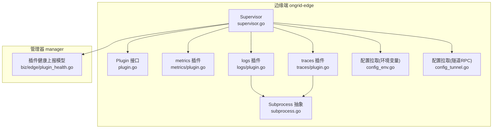
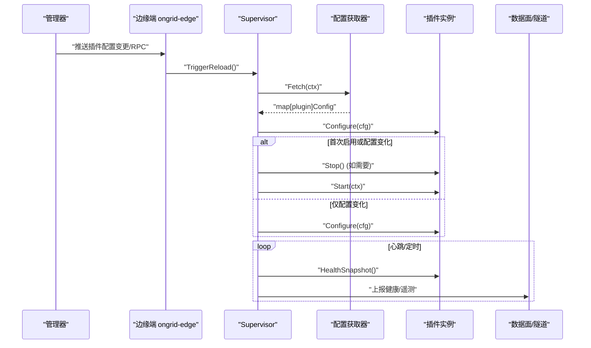
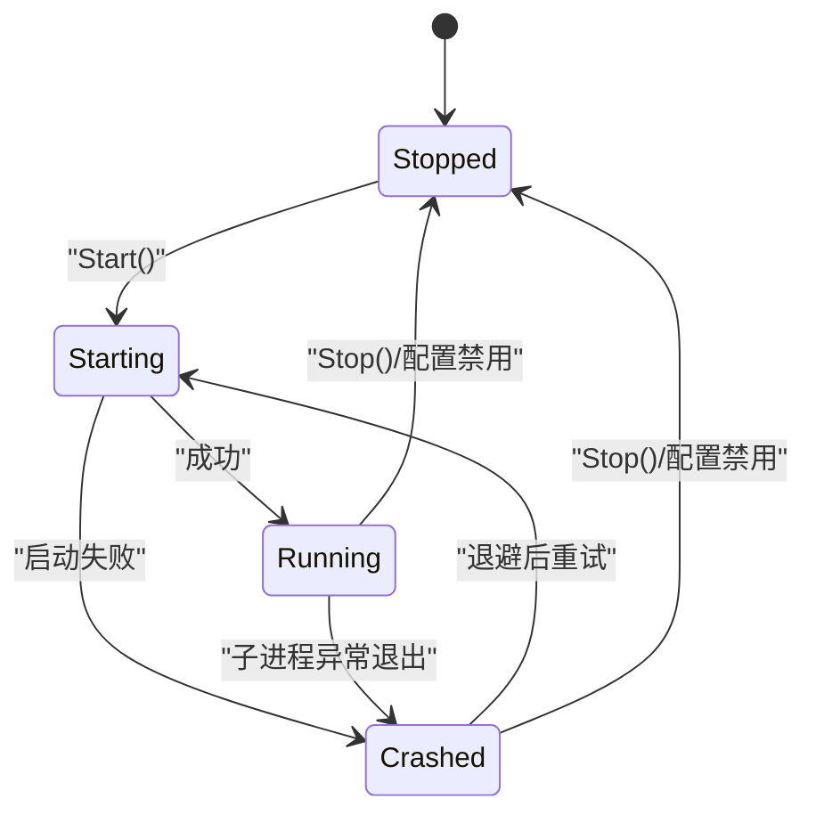
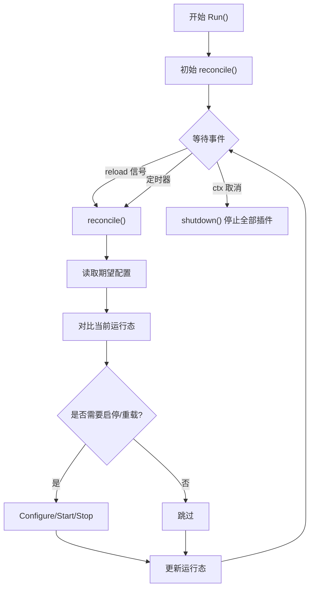
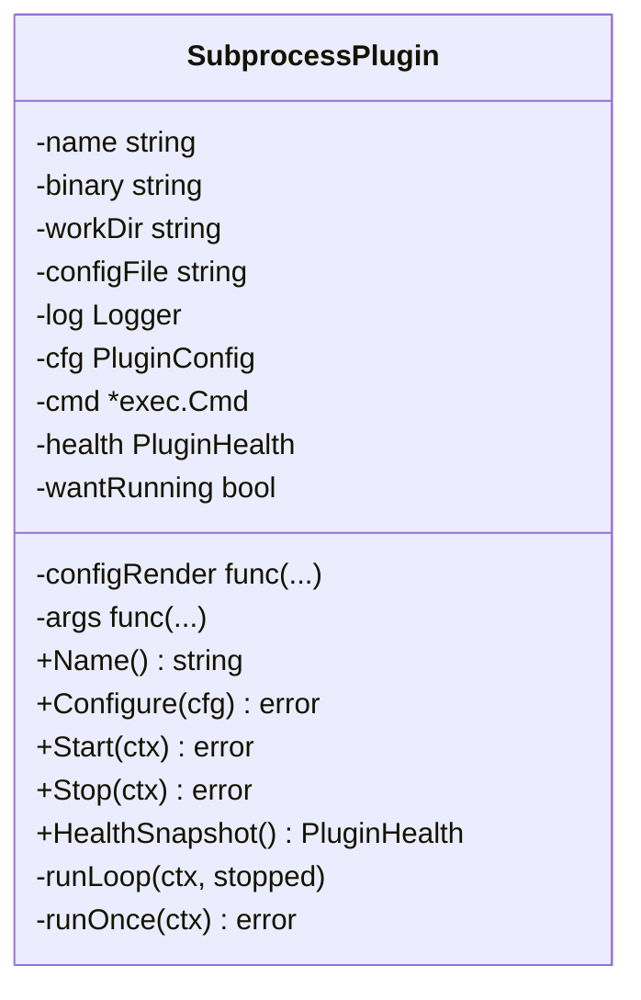
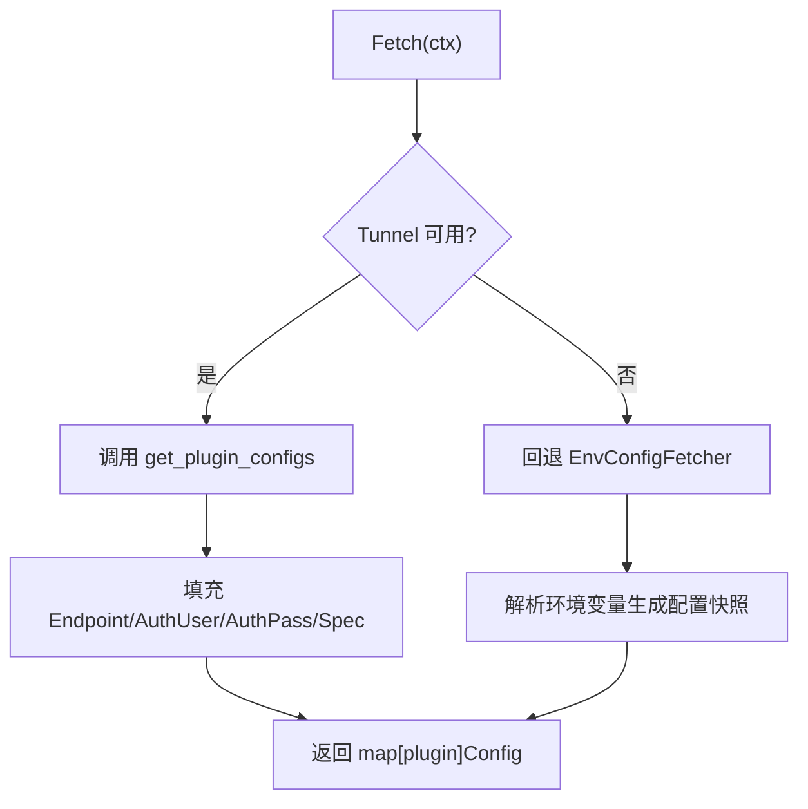
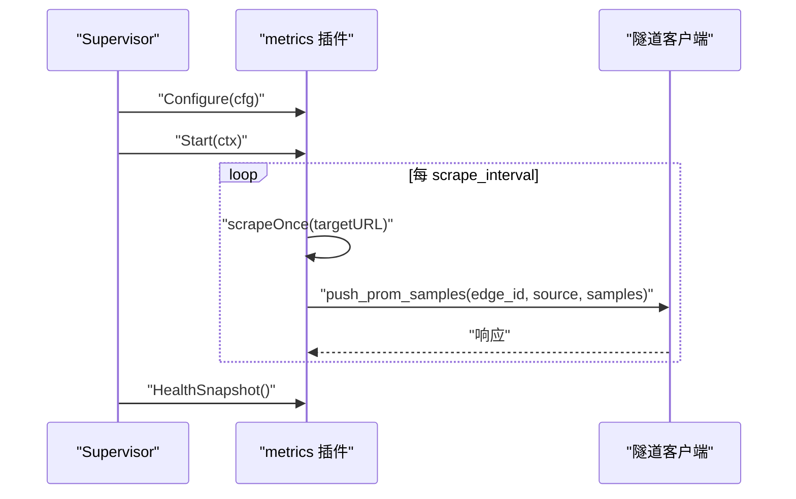
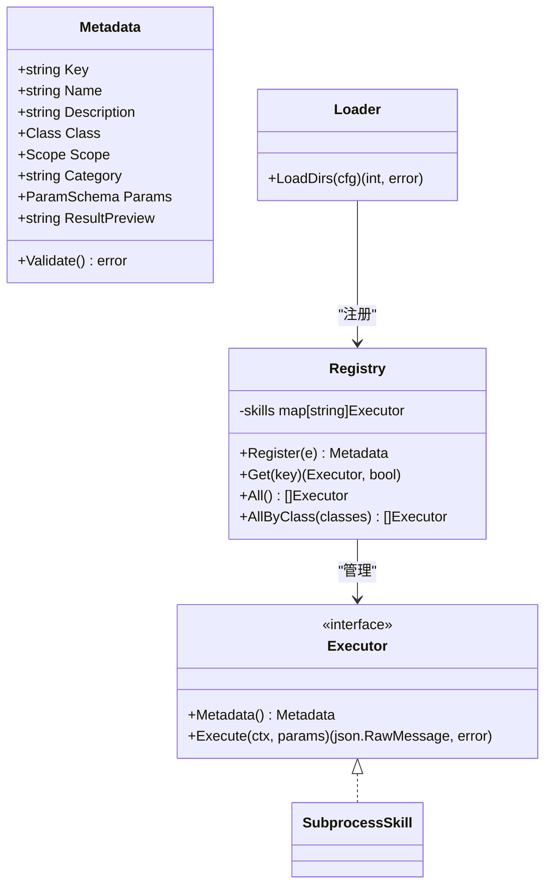
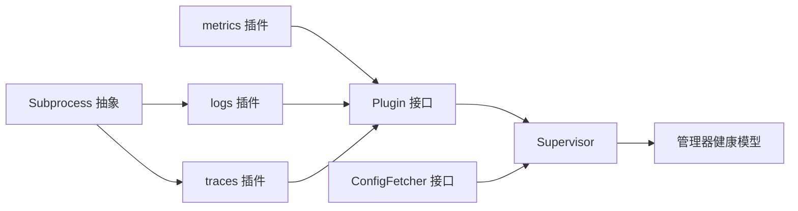

# 插件架构

<cite>
**本文引用的文件**   
- [internal/edgeagent/plugins/plugin.go](file://internal/edgeagent/plugins/plugin.go)
- [internal/edgeagent/plugins/supervisor.go](file://internal/edgeagent/plugins/supervisor.go)
- [internal/edgeagent/plugins/subprocess.go](file://internal/edgeagent/plugins/subprocess.go)
- [internal/edgeagent/plugins/config_env.go](file://internal/edgeagent/plugins/config_env.go)
- [internal/edgeagent/plugins/config_tunnel.go](file://internal/edgeagent/plugins/config_tunnel.go)
- [internal/edgeagent/plugins/metrics/plugin.go](file://internal/edgeagent/plugins/metrics/plugin.go)
- [internal/edgeagent/plugins/logs/plugin.go](file://internal/edgeagent/plugins/logs/plugin.go)
- [internal/edgeagent/plugins/traces/plugin.go](file://internal/edgeagent/plugins/traces/plugin.go)
- [internal/skill/types.go](file://internal/skill/types.go)
- [internal/skill/registry.go](file://internal/skill/registry.go)
- [internal/skill/loader.go](file://internal/skill/loader.go)
- [internal/manager/biz/edge/plugin_health.go](file://internal/manager/biz/edge/plugin_health.go)
</cite>

## 目录
1. [简介](#简介)
2. [项目结构](#项目结构)
3. [核心组件](#核心组件)
4. [架构总览](#架构总览)
5. [详细组件分析](#详细组件分析)
6. [依赖关系分析](#依赖关系分析)
7. [性能与可靠性](#性能与可靠性)
8. [故障排查指南](#故障排查指南)
9. [结论](#结论)
10. [附录：API 参考与开发指南](#附录api-参考与开发指南)

## 简介
本文件系统化阐述 OnGrid 边缘侧插件化架构，覆盖以下主题：
- 插件系统设计理念、扩展点与生命周期管理
- 插件发现机制、加载流程与注册表管理
- 插件间通信协议、事件总线设计与消息传递机制
- 安全沙箱实现、权限控制与资源隔离
- 架构图、生命周期图与 API 参考
- 插件开发指南、SDK 使用说明与测试策略
- 版本管理、热更新与灰度发布机制（现状与路线图）

## 项目结构
OnGrid 的插件体系位于 edgeagent 内部，围绕“Supervisor + Plugin 接口 + Subprocess 抽象”组织。内置三类插件：
- metrics：进程内采集并推送 Prometheus 指标
- logs：封装 Promtail 子进程，直接推送到数据面
- traces：封装 otelcol-contrib 子进程，直接推送到数据面

此外，Skill 框架提供 L2 设备能力扩展（可本地或云端执行），并通过清单在启动时动态加载。

图表来源
- [internal/edgeagent/plugins/supervisor.go:1-120](file://internal/edgeagent/plugins/supervisor.go#L1-L120)
- [internal/edgeagent/plugins/plugin.go:18-52](file://internal/edgeagent/plugins/plugin.go#L18-L52)
- [internal/edgeagent/plugins/subprocess.go:17-102](file://internal/edgeagent/plugins/subprocess.go#L17-L102)
- [internal/edgeagent/plugins/metrics/plugin.go:1-102](file://internal/edgeagent/plugins/metrics/plugin.go#L1-L102)
- [internal/edgeagent/plugins/logs/plugin.go:1-54](file://internal/edgeagent/plugins/logs/plugin.go#L1-L54)
- [internal/edgeagent/plugins/traces/plugin.go:1-48](file://internal/edgeagent/plugins/traces/plugin.go#L1-L48)
- [internal/edgeagent/plugins/config_env.go:1-101](file://internal/edgeagent/plugins/config_env.go#L1-L101)
- [internal/edgeagent/plugins/config_tunnel.go:1-34](file://internal/edgeagent/plugins/config_tunnel.go#L1-L34)
- [internal/manager/biz/edge/plugin_health.go:1-21](file://internal/manager/biz/edge/plugin_health.go#L1-L21)

章节来源
- [internal/edgeagent/plugins/supervisor.go:1-120](file://internal/edgeagent/plugins/supervisor.go#L1-L120)
- [internal/edgeagent/plugins/plugin.go:18-52](file://internal/edgeagent/plugins/plugin.go#L18-L52)

## 核心组件
- 插件接口与状态
  - 统一生命周期：Configure → Start → HealthSnapshot → Stop
  - 健康信息包含名称、状态、错误、重启计数、PID、时间戳等
- Supervisor 协调器
  - 周期轮询与信号触发重新同步
  - 基于期望配置与实际运行态的差异进行启停与重载
  - 收集所有插件健康快照上报
- 子进程插件抽象
  - 负责渲染配置、启动/停止子进程、崩溃指数退避重启、日志落盘
- 配置获取器
  - 环境变量回退：用于冷启动或无管控场景
  - 隧道 RPC：从管理器拉取 per-edge 配置，失败回退到环境变量
- 内置插件
  - metrics：进程内抓取本地 /metrics 并通过隧道 RPC 推送
  - logs：Promtail 子进程，直连数据面
  - traces：otelcol-contrib 子进程，直连数据面

章节来源
- [internal/edgeagent/plugins/plugin.go:18-119](file://internal/edgeagent/plugins/plugin.go#L18-L119)
- [internal/edgeagent/plugins/supervisor.go:112-230](file://internal/edgeagent/plugins/supervisor.go#L112-L230)
- [internal/edgeagent/plugins/subprocess.go:17-102](file://internal/edgeagent/plugins/subprocess.go#L17-L102)
- [internal/edgeagent/plugins/config_env.go:10-71](file://internal/edgeagent/plugins/config_env.go#L10-L71)
- [internal/edgeagent/plugins/config_tunnel.go:12-34](file://internal/edgeagent/plugins/config_tunnel.go#L12-L34)
- [internal/edgeagent/plugins/metrics/plugin.go:1-102](file://internal/edgeagent/plugins/metrics/plugin.go#L1-L102)
- [internal/edgeagent/plugins/logs/plugin.go:1-54](file://internal/edgeagent/plugins/logs/plugin.go#L1-L54)
- [internal/edgeagent/plugins/traces/plugin.go:1-48](file://internal/edgeagent/plugins/traces/plugin.go#L1-L48)

## 架构总览
下图展示插件运行时与控制面的交互：Supervisor 周期性拉取配置，驱动插件启停；插件通过隧道或数据面通道上报遥测与健康信息。

图表来源
- [internal/edgeagent/plugins/supervisor.go:112-230](file://internal/edgeagent/plugins/supervisor.go#L112-L230)
- [internal/edgeagent/plugins/config_env.go:46-71](file://internal/edgeagent/plugins/config_env.go#L46-L71)
- [internal/edgeagent/plugins/config_tunnel.go:12-34](file://internal/edgeagent/plugins/config_tunnel.go#L12-L34)
- [internal/edgeagent/plugins/metrics/plugin.go:214-282](file://internal/edgeagent/plugins/metrics/plugin.go#L214-L282)

## 详细组件分析

### 插件接口与生命周期
- 关键方法
  - Name(): 返回 OTel 信号名作为注册键
  - Configure(cfg): 接收并校验配置，必要时持久化渲染结果
  - Start(ctx)/Stop(ctx): 幂等启停，支持优雅退出
  - HealthSnapshot(): 非阻塞健康快照
- 状态机
  - stopped → starting → running → crashed（带指数退避重启）

图表来源
- [internal/edgeagent/plugins/plugin.go:18-52](file://internal/edgeagent/plugins/plugin.go#L18-L52)
- [internal/edgeagent/plugins/subprocess.go:194-235](file://internal/edgeagent/plugins/subprocess.go#L194-L235)

章节来源
- [internal/edgeagent/plugins/plugin.go:18-119](file://internal/edgeagent/plugins/plugin.go#L18-L119)
- [internal/edgeagent/plugins/subprocess.go:194-235](file://internal/edgeagent/plugins/subprocess.go#L194-L235)

### Supervisor 协调器
- 职责
  - 维护已注册插件集合
  - 周期/信号触发 reconcile，比较期望与实际，执行 Configure/Start/Stop
  - 汇总健康快照供心跳上报
- 并发与健壮性
  - 单例 goroutine 运行循环
  - 单个插件失败不影响其他插件
  - 关闭时按序优雅停止

图表来源
- [internal/edgeagent/plugins/supervisor.go:112-230](file://internal/edgeagent/plugins/supervisor.go#L112-L230)

章节来源
- [internal/edgeagent/plugins/supervisor.go:112-230](file://internal/edgeagent/plugins/supervisor.go#L112-L230)

### 子进程插件抽象
- 功能要点
  - 渲染配置到工作目录
  - 启动子进程并将 stdout/stderr 写入日志文件
  - 崩溃检测与指数退避重启（上限 5 分钟）
  - 优雅终止：SIGTERM + WaitDelay 回退 SIGKILL
- 适用插件
  - logs（promtail）、traces（otelcol-contrib）

图表来源
- [internal/edgeagent/plugins/subprocess.go:32-102](file://internal/edgeagent/plugins/subprocess.go#L32-L102)
- [internal/edgeagent/plugins/subprocess.go:194-287](file://internal/edgeagent/plugins/subprocess.go#L194-L287)

章节来源
- [internal/edgeagent/plugins/subprocess.go:17-102](file://internal/edgeagent/plugins/subprocess.go#L17-L102)
- [internal/edgeagent/plugins/subprocess.go:194-287](file://internal/edgeagent/plugins/subprocess.go#L194-L287)

### 配置获取器与环境变量回退
- 环境变量模式
  - 以 ONGRID_EDGE_PLUGIN_<NAME>_ENABLED 等前缀定义每个插件开关、端点、鉴权与 Spec
  - 未显式设置则默认禁用，便于冷启动
- 隧道 RPC 模式
  - 从管理器拉取 per-edge 配置，失败回退到环境变量
  - 构造期缓存鉴权与 edge_id，避免每次 Fetch 重复读取环境

图表来源
- [internal/edgeagent/plugins/config_tunnel.go:12-34](file://internal/edgeagent/plugins/config_tunnel.go#L12-L34)
- [internal/edgeagent/plugins/config_env.go:46-71](file://internal/edgeagent/plugins/config_env.go#L46-L71)

章节来源
- [internal/edgeagent/plugins/config_env.go:10-71](file://internal/edgeagent/plugins/config_env.go#L10-L71)
- [internal/edgeagent/plugins/config_tunnel.go:12-34](file://internal/edgeagent/plugins/config_tunnel.go#L12-L34)

### 内置插件实现

#### metrics 插件（进程内）
- 行为
  - 周期抓取本地 /metrics（默认 node_exporter）
  - 将样本经隧道 RPC push_prom_samples 推送至管理器
  - 使用 EdgeIDProvider 延迟注册时的 edge_id=0 情况
- 健康
  - 记录抓取次数与失败次数，失败时 LastError 携带最近错误

图表来源
- [internal/edgeagent/plugins/metrics/plugin.go:184-282](file://internal/edgeagent/plugins/metrics/plugin.go#L184-L282)

章节来源
- [internal/edgeagent/plugins/metrics/plugin.go:1-102](file://internal/edgeagent/plugins/metrics/plugin.go#L1-L102)
- [internal/edgeagent/plugins/metrics/plugin.go:214-282](file://internal/edgeagent/plugins/metrics/plugin.go#L214-L282)

#### logs 插件（Promtail 子进程）
- 行为
  - 渲染 promtail.yaml 到工作目录
  - 启动 promtail 子进程，位置文件与配置同目录，避免丢失游标
  - 自动关联审计插件输出路径（由渲染逻辑处理）

章节来源
- [internal/edgeagent/plugins/logs/plugin.go:1-54](file://internal/edgeagent/plugins/logs/plugin.go#L1-L54)

#### traces 插件（otelcol-contrib 子进程）
- 行为
  - 渲染 otelcol.yaml 到工作目录
  - 启动 otelcol-contrib 子进程，接受 OTLP 并推送至数据面

章节来源
- [internal/edgeagent/plugins/traces/plugin.go:1-48](file://internal/edgeagent/plugins/traces/plugin.go#L1-L48)

### Skill 框架（L2 设备能力扩展）
- 设计目标
  - 以“技能包”形式提供自描述的可执行能力，统一元数据、参数 Schema、权限分级与执行范围
- 注册与发现
  - 全局注册表：进程级 Registry，init 时注册，运行时并发读
  - 外部清单加载：扫描指定目录下的 skill.json，构建子进程技能并注册
- 权限与安全
  - 类：safe/mutating/dangerous
  - 作用域：host（边缘执行）/manager（云端执行）
  - 外部技能入口限制在允许目录白名单，严格路径校验

图表来源
- [internal/skill/types.go:99-175](file://internal/skill/types.go#L99-L175)
- [internal/skill/registry.go:10-74](file://internal/skill/registry.go#L10-L74)
- [internal/skill/loader.go:69-161](file://internal/skill/loader.go#L69-L161)

章节来源
- [internal/skill/types.go:35-175](file://internal/skill/types.go#L35-L175)
- [internal/skill/registry.go:10-127](file://internal/skill/registry.go#L10-L127)
- [internal/skill/loader.go:69-161](file://internal/skill/loader.go#L69-L161)

## 依赖关系分析
- 松耦合
  - Supervisor 仅依赖 Plugin 接口与 ConfigFetcher 接口
  - 子进程插件通过 SubprocessOpts 注入具体二进制与渲染逻辑
- 外部依赖
  - 隧道客户端：用于 metrics 推送与配置拉取
  - 数据面：logs/traces 子进程直连
- 潜在环依赖
  - 插件与 Supervisor 之间为单向依赖，无环

图表来源
- [internal/edgeagent/plugins/plugin.go:18-52](file://internal/edgeagent/plugins/plugin.go#L18-L52)
- [internal/edgeagent/plugins/supervisor.go:112-230](file://internal/edgeagent/plugins/supervisor.go#L112-L230)
- [internal/edgeagent/plugins/subprocess.go:17-102](file://internal/edgeagent/plugins/subprocess.go#L17-L102)
- [internal/manager/biz/edge/plugin_health.go:1-21](file://internal/manager/biz/edge/plugin_health.go#L1-L21)

章节来源
- [internal/edgeagent/plugins/plugin.go:18-52](file://internal/edgeagent/plugins/plugin.go#L18-L52)
- [internal/edgeagent/plugins/supervisor.go:112-230](file://internal/edgeagent/plugins/supervisor.go#L112-L230)

## 性能与可靠性
- 子进程崩溃恢复
  - 指数退避重启，上限 5 分钟，避免雪崩
- 配置变更平滑
  - 仅当配置语义变化才触发重载；对不支持热重载的子进程采用 stop+start
- 健康上报
  - 轻量快照，不阻塞主循环
- 资源隔离
  - 子进程独立工作目录与日志文件
  - 外部技能入口路径白名单与超时控制

章节来源
- [internal/edgeagent/plugins/subprocess.go:194-235](file://internal/edgeagent/plugins/subprocess.go#L194-L235)
- [internal/edgeagent/plugins/supervisor.go:196-229](file://internal/edgeagent/plugins/supervisor.go#L196-L229)
- [internal/skill/loader.go:229-254](file://internal/skill/loader.go#L229-L254)

## 故障排查指南
- 常见问题定位
  - 子进程缺失：检查二进制路径与工作目录权限
  - 配置渲染失败：查看插件日志与渲染函数错误
  - 配置未生效：确认 Tunnel 可达性与环境变量回退
  - 指标未上报：检查本地 /metrics 可达性与隧道连通性
- 健康信息解读
  - State/LastError/PID/RestartCount/StartedAt/UpdatedAt 组合判断
  - 多目标插件的 Targets 列表用于细粒度诊断

章节来源
- [internal/edgeagent/plugins/subprocess.go:239-287](file://internal/edgeagent/plugins/subprocess.go#L239-L287)
- [internal/edgeagent/plugins/supervisor.go:138-230](file://internal/edgeagent/plugins/supervisor.go#L138-L230)
- [internal/manager/biz/edge/plugin_health.go:1-21](file://internal/manager/biz/edge/plugin_health.go#L1-L21)

## 结论
OnGrid 的插件架构以最小接口与强约束的协调器为核心，结合子进程抽象与配置回退策略，实现了高内聚、低耦合、易扩展的边缘遥测与能力扩展体系。配合 Skill 框架，进一步打通了设备侧能力的声明式注册与受控执行。

## 附录：API 参考与开发指南

### 插件接口与数据结构
- 插件接口
  - Name(), Configure(), Start(), Stop(), HealthSnapshot()
- 配置结构
  - Enabled/EdgeID/Endpoint/AuthUser/AuthPass/Spec
- 健康结构
  - Name/State/LastError/RestartCount/PID/StartedAt/UpdatedAt/Targets

章节来源
- [internal/edgeagent/plugins/plugin.go:18-119](file://internal/edgeagent/plugins/plugin.go#L18-L119)

### 子进程插件开发步骤
- 新建插件包，定义常量 Name
- 使用 NewSubprocess(SubprocessOpts{...}) 包装
  - Binary：子进程二进制路径
  - WorkDir/ConfigFile：工作目录与配置文件路径
  - ConfigRender：根据 PluginConfig 渲染配置字节
  - Args：根据配置与配置文件路径组装 CLI 参数
- 在 main 中向 Supervisor.Register 注册

章节来源
- [internal/edgeagent/plugins/subprocess.go:52-102](file://internal/edgeagent/plugins/subprocess.go#L52-L102)
- [internal/edgeagent/plugins/logs/plugin.go:20-54](file://internal/edgeagent/plugins/logs/plugin.go#L20-L54)
- [internal/edgeagent/plugins/traces/plugin.go:24-48](file://internal/edgeagent/plugins/traces/plugin.go#L24-L48)

### 配置获取器集成
- 环境变量模式：实现 Fetch 解析环境变量
- 隧道模式：优先从管理器拉取，失败回退到环境变量

章节来源
- [internal/edgeagent/plugins/config_env.go:46-71](file://internal/edgeagent/plugins/config_env.go#L46-L71)
- [internal/edgeagent/plugins/config_tunnel.go:12-34](file://internal/edgeagent/plugins/config_tunnel.go#L12-L34)

### Skill 开发与清单规范
- 清单字段
  - name/description/schema/entry/env_allow/timeout_seconds/class/category
- 加载流程
  - LoadDirs 扫描目录，解析 skill.json，构建 SubprocessSkill 并注册
- 安全约束
  - 入口路径必须在允许根目录下，禁止逃逸
  - 超时控制与最小权限 env 白名单

章节来源
- [internal/skill/loader.go:13-53](file://internal/skill/loader.go#L13-L53)
- [internal/skill/loader.go:176-254](file://internal/skill/loader.go#L176-L254)

### 测试策略
- 单元测试
  - 使用 NewRegistryForTest 隔离注册表
  - 针对 SubprocessPlugin 的 Configure/Start/Stop 与 runLoop 断言
- 集成测试
  - 模拟隧道客户端 Pusher 与 EdgeIDProvider
  - 验证 metrics 插件的 scrapeAndPushOne 路径

章节来源
- [internal/skill/registry.go:121-127](file://internal/skill/registry.go#L121-L127)
- [internal/edgeagent/plugins/metrics/plugin.go:214-282](file://internal/edgeagent/plugins/metrics/plugin.go#L214-L282)

### 版本管理、热更新与灰度发布
- 现状
  - 插件配置通过 Supervisor 周期/信号触发热重载
  - 子进程插件通过 stop+start 实现配置变更生效
- 路线图（规划项）
  - 微沙箱运行时、脚本执行通道、干跑沙箱、浏览器沙箱、作者沙箱、租户计算预算、seccomp 能力库、危险类临时容器等
  - 这些能力将增强插件与工具的安全边界与可控性

章节来源
- [internal/edgeagent/plugins/supervisor.go:196-229](file://internal/edgeagent/plugins/supervisor.go#L196-L229)
- [ROADMAP.md:427-464](file://ROADMAP.md#L427-L464)