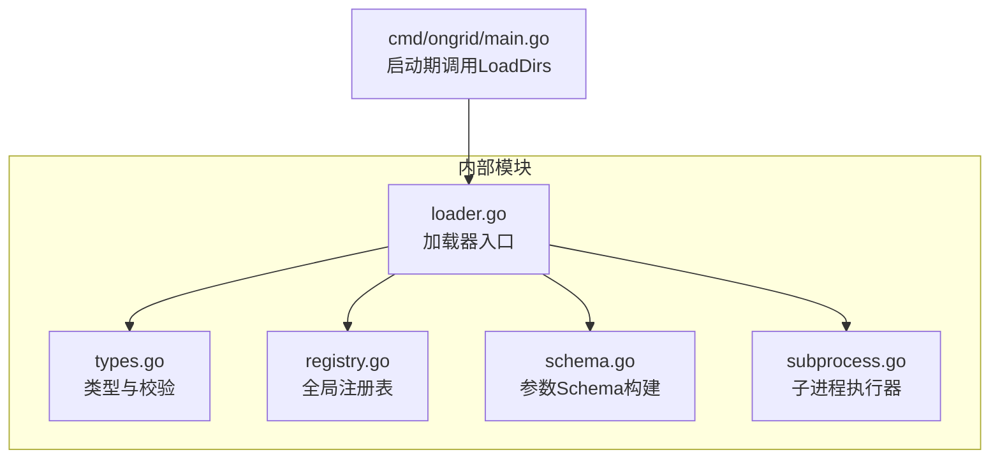
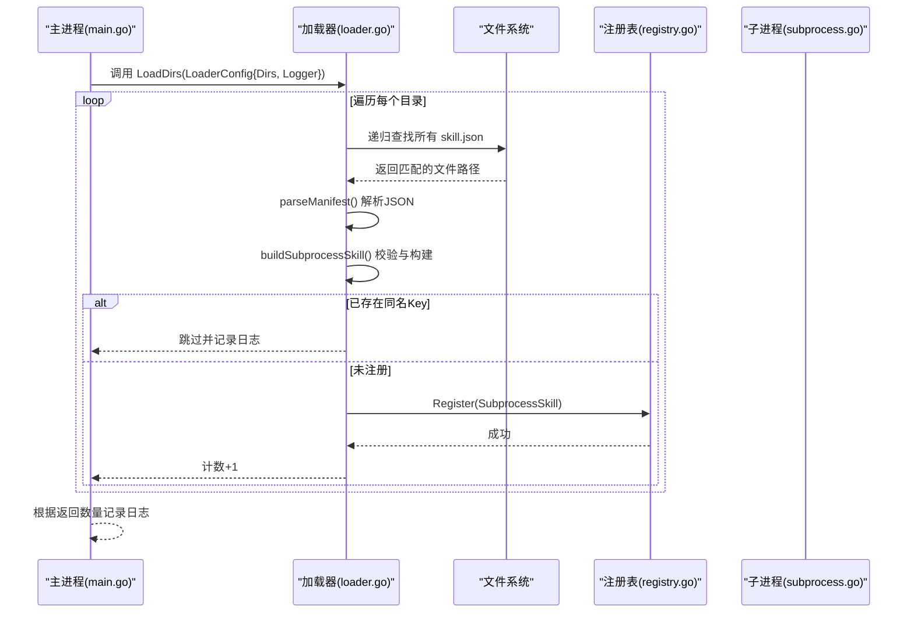
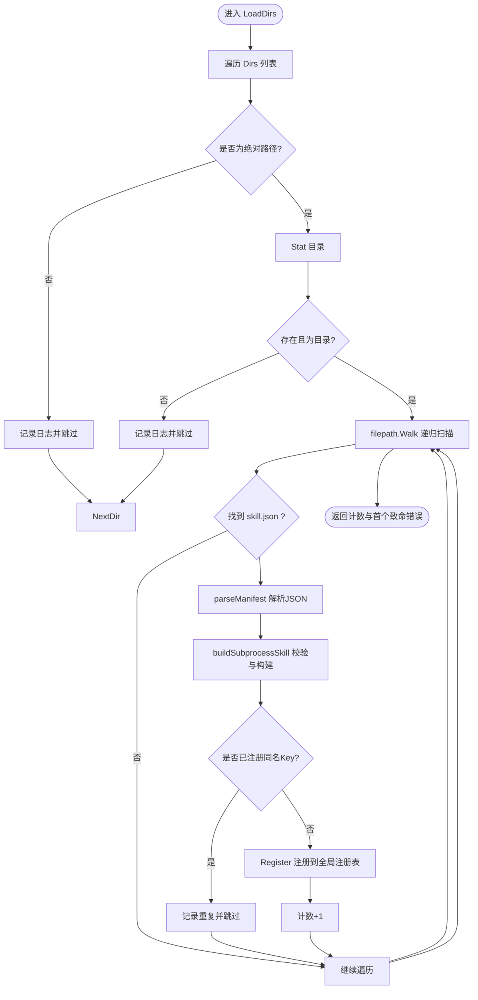
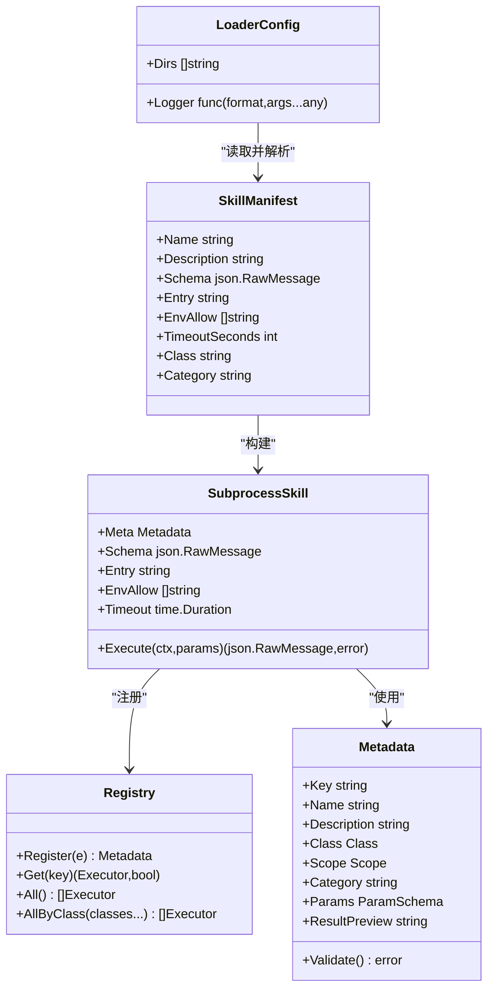

# 插件加载器

<cite>
**本文引用的文件**   
- [loader.go](file://internal/skill/loader.go)
- [types.go](file://internal/skill/types.go)
- [registry.go](file://internal/skill/registry.go)
- [schema.go](file://internal/skill/schema.go)
- [subprocess.go](file://internal/skill/subprocess.go)
- [main.go](file://cmd/ongrid/main.go)
- [loader_test.go](file://internal/skill/loader_test.go)
</cite>

## 目录
1. [简介](#简介)
2. [项目结构](#项目结构)
3. [核心组件](#核心组件)
4. [架构总览](#架构总览)
5. [详细组件分析](#详细组件分析)
6. [依赖关系分析](#依赖关系分析)
7. [性能考量](#性能考量)
8. [故障排查指南](#故障排查指南)
9. [结论](#结论)
10. [附录](#附录)

## 简介
本文件聚焦 OnGrid 的“外部技能（Subprocess Skill）”加载器，系统性说明 LoaderConfig 配置结构、LoadDirs 函数的工作流程与目录扫描算法；阐述 SkillManifest 元数据格式、字段校验规则与路径安全校验机制；并总结插件发现过程中的错误处理策略、重复注册处理与日志记录机制。文末提供初始化示例、配置文件格式建议、目录结构规范、文件权限要求与性能优化建议，帮助读者快速上手与安全运维。

## 项目结构
与插件加载器相关的代码集中在 internal/skill 包中，并在主进程启动时调用 LoadDirs 完成外部技能的自动发现与注册。

图表来源
- [loader.go:55-110](file://internal/skill/loader.go#L55-L110)
- [registry.go:1-127](file://internal/skill/registry.go#L1-L127)
- [types.go:99-175](file://internal/skill/types.go#L99-L175)
- [schema.go:1-96](file://internal/skill/schema.go#L1-L96)
- [subprocess.go:30-172](file://internal/skill/subprocess.go#L30-L172)
- [main.go:2257-2273](file://cmd/ongrid/main.go#L2257-L2273)

章节来源
- [loader.go:55-110](file://internal/skill/loader.go#L55-L110)
- [main.go:2257-2273](file://cmd/ongrid/main.go#L2257-L2273)

## 核心组件
- LoaderConfig：加载器的输入配置，包含待扫描的外部目录列表与可选日志回调。
- LoadDirs：遍历配置的目录树，解析每个 skill.json，构建 SubprocessSkill 并注册到全局注册表。
- SkillManifest：磁盘上的外部技能清单，描述名称、描述、参数 Schema、可执行入口、环境变量白名单、超时、分类与分组等。
- SubprocessSkill：以子进程方式运行的技能实现，负责参数校验、环境隔离、超时控制与输出约束。
- Registry：进程级技能注册表，提供注册、查询与按类别过滤能力。
- Schema：将声明式参数或原始 JSON Schema 转换为 LLM 工具可用的 JSON Schema。

章节来源
- [loader.go:55-110](file://internal/skill/loader.go#L55-L110)
- [loader.go:163-254](file://internal/skill/loader.go#L163-L254)
- [subprocess.go:30-172](file://internal/skill/subprocess.go#L30-L172)
- [registry.go:1-127](file://internal/skill/registry.go#L1-L127)
- [schema.go:1-96](file://internal/skill/schema.go#L1-L96)

## 架构总览
加载器在管理器启动阶段被调用，依据配置的外部目录进行递归扫描，逐个解析 manifest，构建并注册 SubprocessSkill。注册成功后，上层服务将其暴露为 LLM 工具或 HTTP 接口。

图表来源
- [main.go:2257-2273](file://cmd/ongrid/main.go#L2257-L2273)
- [loader.go:74-161](file://internal/skill/loader.go#L74-L161)
- [registry.go:59-74](file://internal/skill/registry.go#L59-L74)
- [subprocess.go:30-172](file://internal/skill/subprocess.go#L30-L172)

## 详细组件分析

### LoaderConfig 配置结构
- Dirs：允许扫描的外部目录列表。仅支持绝对路径；相对路径或缺失目录会被跳过并记录日志，不会导致启动失败。
- Logger：可选的日志回调，用于审计每个被注册或跳过的清单。若未提供，则使用空操作。

设计要点
- 容错优先：缺失目录不报错，便于新安装无外部技能也能正常启动。
- 安全前置：仅接受绝对路径，避免误扫当前工作目录。

章节来源
- [loader.go:55-67](file://internal/skill/loader.go#L55-L67)
- [loader.go:74-110](file://internal/skill/loader.go#L74-L110)

### LoadDirs 工作流程与目录扫描算法
整体流程
- 对每个目录进行预处理：去空白、判断是否为绝对路径、是否存在且为目录。
- 使用 filepath.Walk 递归遍历目录树，仅关注名为 skill.json 的文件。
- 解析 manifest，构建 SubprocessSkill，检查是否已注册（去重），最后注册到全局注册表。
- 返回已注册数量与首个致命错误（如 walk 错误）。单个清单的校验失败会记录日志并跳过，不影响其他清单。

关键细节
- 非绝对路径或缺失目录：记录日志并跳过。
- 非 skill.json 文件：忽略。
- 解析失败或构建失败：记录日志并跳过。
- 重复 Key：记录日志并跳过，避免崩溃。
- Register 异常保护：通过 defer/recover 捕获潜在 panic，确保健壮性。

图表来源
- [loader.go:74-161](file://internal/skill/loader.go#L74-L161)

章节来源
- [loader.go:74-161](file://internal/skill/loader.go#L74-L161)

### SkillManifest 元数据格式与字段验证
字段说明
- name：技能键名，必须为小写下划线命名，遵循与内置技能一致的规则。
- description：人类可读的描述，必填。
- schema：可选的原始 JSON Schema，用于覆盖由 Metadata.Params 推导出的参数结构。
- entry：可执行入口路径。相对路径相对于 skill.json 所在目录解析；绝对路径必须在允许的根目录下。
- env_allow：显式允许注入子进程的环境变量名列表。为空表示不继承任何环境变量（包括 PATH）。
- timeout_seconds：子进程运行超时秒数，零值回退到默认超时。
- class：权限分类 safe/mutating/dangerous，空值默认为 safe。
- category：自由分组标签，空值默认为 external。

校验规则
- name 必须非空且符合 lower_snake 正则。
- description 必须非空。
- entry 必须非空，且最终解析后的绝对路径必须位于 allowlist 根下（含符号链接展开后的真实路径）。
- class 必须为合法枚举之一，否则拒绝。
- category 为空时填充为 external。
- timeout_seconds 为零时采用默认超时。

路径安全校验机制
- 先拼接 manifest 所在目录与相对 entry，得到绝对路径。
- 使用 EvalSymlinks 解析符号链接的真实路径。
- 使用 pathHasPrefix 判定是否在 allowlist 根下，防止通过 .. 或符号链接逃逸。

章节来源
- [loader.go:163-254](file://internal/skill/loader.go#L163-L254)
- [loader.go:256-274](file://internal/skill/loader.go#L256-L274)

### 插件发现过程中的错误处理策略
- 目录级错误：非绝对路径、不存在或非目录均记录日志并跳过，不中断加载。
- 清单解析错误：记录日志并跳过该清单，不影响其他清单。
- 构建错误（字段校验失败、路径越界等）：记录日志并跳过。
- 重复注册：检测到同名 Key 时记录日志并跳过，避免崩溃。
- 注册异常保护：对 Register 调用包裹 defer/recover，捕获潜在 panic 并记录日志。
- 首个致命错误：loadOneDir 的 walk 错误作为首个致命错误返回，供上层决策。

章节来源
- [loader.go:115-161](file://internal/skill/loader.go#L115-L161)

### 重复注册处理
- 在注册前通过 Get(manifest.Name) 检查是否已存在同名 Key。
- 若已存在，记录日志并跳过，保证幂等性与部署期间的平滑过渡。

章节来源
- [loader.go:138-144](file://internal/skill/loader.go#L138-L144)
- [registry.go:69-74](file://internal/skill/registry.go#L69-L74)

### 日志记录机制
- 加载器接收一个 Logger 回调，每注册或跳过一个清单都会调用一次。
- 主进程在启动时将加载器日志桥接到结构化日志系统，附带组件标识以便检索。

章节来源
- [loader.go:64-67](file://internal/skill/loader.go#L64-L67)
- [main.go:2261-2273](file://cmd/ongrid/main.go#L2261-L2273)

### 子进程执行器（SubprocessSkill）行为
- 强制 ScopeManager：无论清单如何声明，子进程技能始终在管理器侧执行。
- 默认 ClassSafe：未设置时默认为 safe，便于 LLM 工具注册。
- 参数处理：空参数体补为 {}，非法 JSON 直接报错。
- 执行约束：
  - 入口必须是绝对路径且存在、可执行。
  - 环境变量严格白名单注入，默认不继承任何环境变量。
  - 超时控制：支持清单指定或默认超时。
  - 输出限制：stdout 最大 16MiB，stderr 尾部保留 4KiB 用于诊断。
  - 结果校验：stdout 必须为合法 JSON，否则报错。

章节来源
- [subprocess.go:30-172](file://internal/skill/subprocess.go#L30-L172)

### 参数 Schema 构建
- 若 Executor 实现了 RawSchemaProvider，则直接使用其提供的 JSON Schema。
- 否则基于 Metadata.Params 生成 JSON Schema，映射 string/int/float/bool/duration/enum/array 等类型。

章节来源
- [schema.go:1-96](file://internal/skill/schema.go#L1-L96)

## 依赖关系分析
- loader.go 依赖 types.go（Metadata、Class、Scope、validKey）、registry.go（Register/Get）、subprocess.go（SubprocessSkill 构建与执行）、schema.go（Schema 构建）。
- main.go 在启动阶段调用 LoadDirs，并将日志回调接入结构化日志。

图表来源
- [loader.go:55-110](file://internal/skill/loader.go#L55-L110)
- [loader.go:163-254](file://internal/skill/loader.go#L163-L254)
- [subprocess.go:30-172](file://internal/skill/subprocess.go#L30-L172)
- [registry.go:1-127](file://internal/skill/registry.go#L1-L127)
- [types.go:99-175](file://internal/skill/types.go#L99-L175)

章节来源
- [loader.go:55-110](file://internal/skill/loader.go#L55-L110)
- [subprocess.go:30-172](file://internal/skill/subprocess.go#L30-L172)
- [registry.go:1-127](file://internal/skill/registry.go#L1-L127)
- [types.go:99-175](file://internal/skill/types.go#L99-L175)

## 性能考量
- 目录扫描：使用标准库递归遍历，复杂度与目录树规模线性相关。建议将外部技能集中存放于少量目录，减少无关文件扫描。
- 清单解析与构建：每个清单仅解析一次，构建开销较小。
- 子进程执行：
  - 默认超时 30s，避免长时间阻塞。
  - stdout/stderr 有上限，防止内存膨胀。
  - 环境变量最小化注入，降低子进程初始化成本。
- 注册表访问：读多写少，使用读写锁保护，并发安全。

[本节为通用指导，无需源码引用]

## 故障排查指南
常见问题与定位方法
- 未加载任何外部技能
  - 检查 LoaderConfig.Dirs 是否为绝对路径且存在。
  - 查看日志中是否有“非绝对路径/目录不存在/不是目录”的跳过记录。
- 某个清单未被注册
  - 检查日志中的“解析失败/构建失败/重复注册”条目。
  - 确认 name 是否符合 lower_snake 规则，description 与 entry 是否非空。
  - 确认 entry 经符号链接解析后仍在 allowlist 根下。
- 子进程执行失败
  - 检查入口文件是否存在且可执行。
  - 检查 env_allow 是否正确注入所需环境变量（如 API Key）。
  - 查看 stderr 尾部信息，确认退出码与错误原因。
  - 确认 stdout 输出为合法 JSON。

章节来源
- [loader.go:74-161](file://internal/skill/loader.go#L74-L161)
- [loader.go:163-254](file://internal/skill/loader.go#L163-L254)
- [subprocess.go:112-172](file://internal/skill/subprocess.go#L112-L172)
- [main.go:2261-2273](file://cmd/ongrid/main.go#L2261-L2273)

## 结论
OnGrid 插件加载器以“清单驱动 + 白名单目录 + 严格校验”的方式，实现了安全、稳健的外部技能发现与注册。通过详尽的字段校验、路径安全校验与健壮的错误处理策略，系统在保持高可用性的同时，提供了良好的可观测性与可维护性。配合合理的目录结构与权限管理，可在生产环境中安全地扩展 OnGrid 的能力边界。

[本节为总结，无需源码引用]

## 附录

### 加载器初始化示例
- 在主进程启动阶段调用 LoadDirs，传入外部目录列表与日志回调。
- 参考启动代码片段位置：[main.go:2257-2273](file://cmd/ongrid/main.go#L2257-L2273)

章节来源
- [main.go:2257-2273](file://cmd/ongrid/main.go#L2257-L2273)

### 配置文件格式（skill.json）
字段建议
- name：小写下划线命名，唯一键。
- description：清晰描述功能与前置条件。
- schema：可选，完整的 JSON Schema 对象。
- entry：相对或绝对路径，推荐相对路径指向同目录下的脚本或二进制。
- env_allow：按需注入环境变量名，例如 ["PATH","API_KEY"]。
- timeout_seconds：建议根据任务耗时合理设置。
- class：safe/mutating/dangerous，明确权限等级。
- category：external 或其他分组标签。

参考测试用例中的构造方式：
- [loader_test.go:55-64](file://internal/skill/loader_test.go#L55-L64)

章节来源
- [loader_test.go:55-64](file://internal/skill/loader_test.go#L55-L64)

### 插件目录结构规范
- 每个外部技能一个目录，目录内包含：
  - skill.json：清单文件。
  - 可执行入口：脚本或二进制，entry 指向该文件。
- 示例布局（参考测试）：
  - root/skill_pack/skill.json
  - root/skill_pack/run.sh

章节来源
- [loader_test.go:45-54](file://internal/skill/loader_test.go#L45-L54)

### 文件权限要求
- 可执行入口需具备可执行位（POSIX 下至少 0o111）。
- 清单文件建议 0o644，目录建议 0o755。

章节来源
- [subprocess.go:126-135](file://internal/skill/subprocess.go#L126-L135)
- [loader_test.go:36](file://internal/skill/loader_test.go#L36)

### 性能优化建议
- 将外部技能集中放置于少数目录，减少无关文件扫描。
- 合理设置 timeout_seconds，避免长尾任务拖慢整体响应。
- 精简 env_allow，仅注入必要环境变量，降低子进程初始化开销。
- 控制 stdout 大小，避免大输出影响内存占用。

[本节为通用指导，无需源码引用]