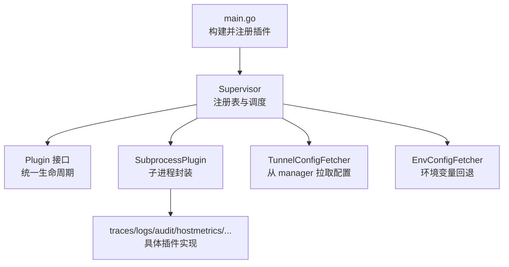
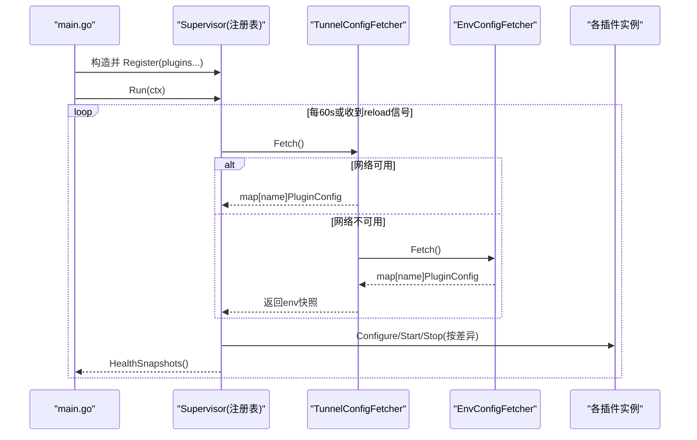
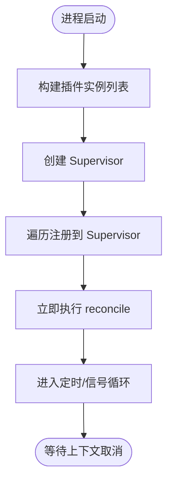
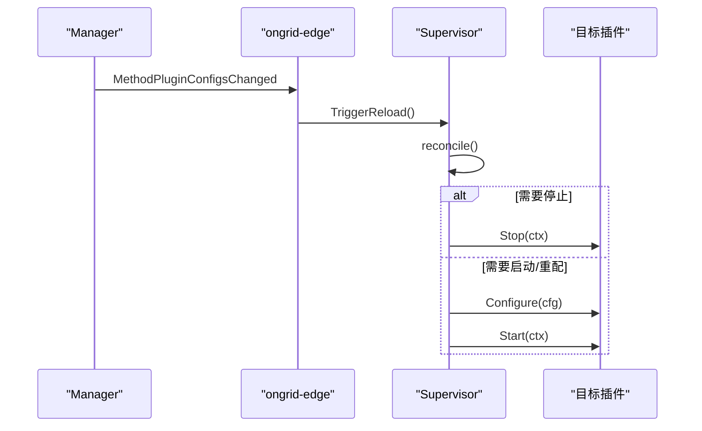
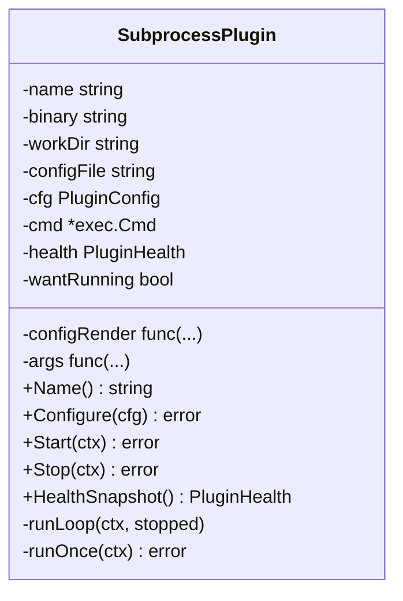
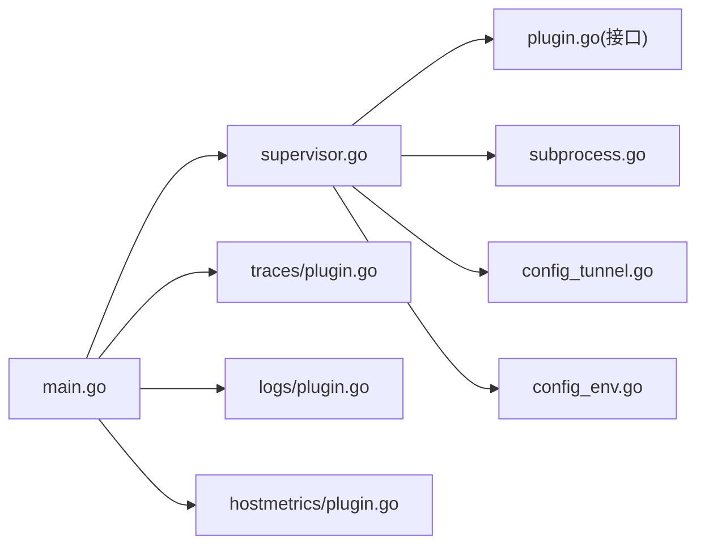

# 插件注册与发现

<cite>
**本文引用的文件**   
- [cmd/ongrid-edge/main.go](file://cmd/ongrid-edge/main.go)
- [internal/edgeagent/plugins/plugin.go](file://internal/edgeagent/plugins/plugin.go)
- [internal/edgeagent/plugins/supervisor.go](file://internal/edgeagent/plugins/supervisor.go)
- [internal/edgeagent/plugins/config_env.go](file://internal/edgeagent/plugins/config_env.go)
- [internal/edgeagent/plugins/config_tunnel.go](file://internal/edgeagent/plugins/config_tunnel.go)
- [internal/edgeagent/plugins/subprocess.go](file://internal/edgeagent/plugins/subprocess.go)
- [internal/edgeagent/plugins/traces/plugin.go](file://internal/edgeagent/plugins/traces/plugin.go)
- [internal/manager/biz/edge/plugin_health.go](file://internal/manager/biz/edge/plugin_health.go)
</cite>

## 目录
1. [简介](#简介)
2. [项目结构](#项目结构)
3. [核心组件](#核心组件)
4. [架构总览](#架构总览)
5. [详细组件分析](#详细组件分析)
6. [依赖关系分析](#依赖关系分析)
7. [性能考量](#性能考量)
8. [故障排查指南](#故障排查指南)
9. [结论](#结论)
10. [附录](#附录)

## 简介
本文件系统化阐述 OnGrid Edge Agent 的插件注册与发现机制，覆盖以下主题：
- 插件发现算法、加载顺序与依赖解析策略
- 插件注册表实现原理、版本兼容性与冲突解决
- 动态加载、热插拔与卸载机制
- 插件发现流程图、注册表示例与 API 参考
- 插件打包规范、目录结构与元数据定义
- 权限控制、安全沙箱与资源限制

## 项目结构
Edge 侧插件系统围绕“接口 + 注册表 + 调度器 + 配置拉取”四层组织：
- 接口层：统一 Plugin 生命周期（Configure/Start/Stop/HealthSnapshot）
- 注册表：Supervisor 维护已注册插件集合与运行态
- 调度器：周期性 reconcile，驱动 Configure/Start/Stop
- 配置拉取：TunnelConfigFetcher（主）+ EnvConfigFetcher（回退）

图表来源
- [cmd/ongrid-edge/main.go:199-252](file://cmd/ongrid-edge/main.go#L199-L252)
- [internal/edgeagent/plugins/supervisor.go:12-47](file://internal/edgeagent/plugins/supervisor.go#L12-L47)
- [internal/edgeagent/plugins/plugin.go:18-52](file://internal/edgeagent/plugins/plugin.go#L18-L52)
- [internal/edgeagent/plugins/subprocess.go:32-102](file://internal/edgeagent/plugins/subprocess.go#L32-L102)
- [internal/edgeagent/plugins/config_tunnel.go:22-52](file://internal/edgeagent/plugins/config_tunnel.go#L22-L52)
- [internal/edgeagent/plugins/config_env.go:32-41](file://internal/edgeagent/plugins/config_env.go#L32-L41)
- [internal/edgeagent/plugins/traces/plugin.go:20-47](file://internal/edgeagent/plugins/traces/plugin.go#L20-L47)

章节来源
- [cmd/ongrid-edge/main.go:199-252](file://cmd/ongrid-edge/main.go#L199-L252)
- [internal/edgeagent/plugins/supervisor.go:12-47](file://internal/edgeagent/plugins/supervisor.go#L12-L47)
- [internal/edgeagent/plugins/plugin.go:18-52](file://internal/edgeagent/plugins/plugin.go#L18-L52)
- [internal/edgeagent/plugins/subprocess.go:32-102](file://internal/edgeagent/plugins/subprocess.go#L32-L102)
- [internal/edgeagent/plugins/config_tunnel.go:22-52](file://internal/edgeagent/plugins/config_tunnel.go#L22-L52)
- [internal/edgeagent/plugins/config_env.go:32-41](file://internal/edgeagent/plugins/config_env.go#L32-L41)
- [internal/edgeagent/plugins/traces/plugin.go:20-47](file://internal/edgeagent/plugins/traces/plugin.go#L20-L47)

## 核心组件
- Plugin 接口：定义 Name/Configure/Start/Stop/HealthSnapshot，屏蔽 in-process 与 subprocess 差异
- Supervisor：持有插件注册表，周期 reconcile，按期望状态驱动 Configure/Start/Stop
- SubprocessPlugin：通用子进程包装，负责渲染配置、启动/停止、崩溃重启、健康上报
- ConfigFetcher：抽象配置源；TunnelConfigFetcher 为主，EnvConfigFetcher 为回退
- 具体插件：如 traces/logs/audit/hostmetrics/procmetrics/custommetrics/databasemetrics/metrics

章节来源
- [internal/edgeagent/plugins/plugin.go:18-119](file://internal/edgeagent/plugins/plugin.go#L18-L119)
- [internal/edgeagent/plugins/supervisor.go:12-133](file://internal/edgeagent/plugins/supervisor.go#L12-L133)
- [internal/edgeagent/plugins/subprocess.go:32-102](file://internal/edgeagent/plugins/subprocess.go#L32-L102)
- [internal/edgeagent/plugins/config_tunnel.go:22-52](file://internal/edgeagent/plugins/config_tunnel.go#L22-L52)
- [internal/edgeagent/plugins/config_env.go:32-41](file://internal/edgeagent/plugins/config_env.go#L32-L41)

## 架构总览
Edge 启动时 main 组装插件列表，创建 Supervisor 并注册所有插件。Supervisor 通过 TunnelConfigFetcher 获取期望配置，结合本地 env 回退，周期性 reconcile 以达成期望状态。

图表来源
- [cmd/ongrid-edge/main.go:245-305](file://cmd/ongrid-edge/main.go#L245-L305)
- [internal/edgeagent/plugins/supervisor.go:114-133](file://internal/edgeagent/plugins/supervisor.go#L114-L133)
- [internal/edgeagent/plugins/config_tunnel.go:58-108](file://internal/edgeagent/plugins/config_tunnel.go#L58-L108)
- [internal/edgeagent/plugins/config_env.go:46-71](file://internal/edgeagent/plugins/config_env.go#L46-L71)

## 详细组件分析

### 插件发现与注册流程
- 发现：main 中显式构造各插件实例（含名称常量），形成注册清单
- 注册：调用 supervisor.Register(p)，以插件 Name 作为键存入内部 map
- 初始 reconcile：Run 启动后立即执行一次 reconcile，确保首次即达到期望状态

图表来源
- [cmd/ongrid-edge/main.go:199-252](file://cmd/ongrid-edge/main.go#L199-L252)
- [internal/edgeagent/plugins/supervisor.go:114-133](file://internal/edgeagent/plugins/supervisor.go#L114-L133)

章节来源
- [cmd/ongrid-edge/main.go:199-252](file://cmd/ongrid-edge/main.go#L199-L252)
- [internal/edgeagent/plugins/supervisor.go:75-82](file://internal/edgeagent/plugins/supervisor.go#L75-L82)

### 插件加载顺序与依赖解析
- 加载顺序：由 main 中注册的顺序决定，当前无显式依赖声明与拓扑排序
- 依赖解析：插件间不直接耦合，通过共享的 Supervisor 与统一的 PluginConfig 解耦
- 扩展点：如需引入依赖，可在 reconcile 阶段基于 spec 字段进行条件编排

章节来源
- [cmd/ongrid-edge/main.go:199-237](file://cmd/ongrid-edge/main.go#L199-L237)
- [internal/edgeagent/plugins/plugin.go:54-69](file://internal/edgeagent/plugins/plugin.go#L54-L69)

### 插件注册表实现原理
- 数据结构：map[string]Plugin 保存已注册插件；current/running 分别记录上次应用配置与运行态
- 并发安全：Register/HealthSnapshots/reconcile 均使用互斥锁保护
- 幂等性：同名插件重复 Register 会覆盖前一个实例，便于测试与热替换

章节来源
- [internal/edgeagent/plugins/supervisor.go:36-82](file://internal/edgeagent/plugins/supervisor.go#L36-L82)

### 版本兼容性与冲突解决
- 兼容性：PluginConfig.Spec 为任意 JSON 可序列化结构，向后兼容新增字段
- 冲突解决：
  - 同一 name 重复注册：后注册覆盖前者
  - 未知插件名：TunnelConfigFetcher 仅接受 knownPlugins 白名单中的条目
  - 配置缺失：未出现在期望快照中的插件视为 disabled，将被停止

章节来源
- [internal/edgeagent/plugins/config_tunnel.go:75-108](file://internal/edgeagent/plugins/config_tunnel.go#L75-L108)
- [internal/edgeagent/plugins/supervisor.go:175-229](file://internal/edgeagent/plugins/supervisor.go#L175-L229)

### 动态加载、热插拔与卸载
- 动态加载：通过 Manager 推送 MethodPluginConfigsChanged 触发 TriggerReload，随后重新 Fetch 并 reconcile
- 热插拔：对仍在运行的插件，若仅 Spec 变化则先 Configure，再按需 Stop+Start
- 卸载：当某插件在期望快照中不存在或被标记为 disabled，Supervisor 将调用 Stop 并清理状态

图表来源
- [cmd/ongrid-edge/main.go:298-305](file://cmd/ongrid-edge/main.go#L298-L305)
- [internal/edgeagent/plugins/supervisor.go:84-92](file://internal/edgeagent/plugins/supervisor.go#L84-L92)
- [internal/edgeagent/plugins/supervisor.go:175-229](file://internal/edgeagent/plugins/supervisor.go#L175-L229)

章节来源
- [cmd/ongrid-edge/main.go:298-305](file://cmd/ongrid-edge/main.go#L298-L305)
- [internal/edgeagent/plugins/supervisor.go:175-229](file://internal/edgeagent/plugins/supervisor.go#L175-L229)

### 子进程插件生命周期与崩溃恢复
- 配置渲染：Configure 将 PluginConfig 渲染为配置文件（可选）并落盘
- 启动：Start 检查二进制存在，启动子进程并将输出写入工作目录日志
- 停止：Stop 发送 SIGTERM，等待优雅退出，超时则继续
- 崩溃恢复：runLoop 指数退避重启，最大间隔上限，RestartCount 单调递增

图表来源
- [internal/edgeagent/plugins/subprocess.go:32-102](file://internal/edgeagent/plugins/subprocess.go#L32-L102)
- [internal/edgeagent/plugins/subprocess.go:107-183](file://internal/edgeagent/plugins/subprocess.go#L107-L183)
- [internal/edgeagent/plugins/subprocess.go:194-235](file://internal/edgeagent/plugins/subprocess.go#L194-L235)

章节来源
- [internal/edgeagent/plugins/subprocess.go:107-183](file://internal/edgeagent/plugins/subprocess.go#L107-L183)
- [internal/edgeagent/plugins/subprocess.go:194-235](file://internal/edgeagent/plugins/subprocess.go#L194-L235)

### 配置来源与回退策略
- 主路径：TunnelConfigFetcher 通过 tunnel RPC 获取 per-edge 配置，自动注入 edge_id 与鉴权凭据
- 回退路径：EnvConfigFetcher 从环境变量读取 ENABLED/ENDPOINT/AUTH_USER/AUTH_PASS/SPEC_JSON
- 健壮性：RPC 失败时静默回退到 env 快照，避免断网导致已启用插件被误停

章节来源
- [internal/edgeagent/plugins/config_tunnel.go:58-108](file://internal/edgeagent/plugins/config_tunnel.go#L58-L108)
- [internal/edgeagent/plugins/config_env.go:46-71](file://internal/edgeagent/plugins/config_env.go#L46-L71)

### 示例：traces 插件
- 名称常量：Name = "traces"，同时作为注册键与工作目录键
- 子进程：otelcol-contrib，参数 --config=rendered.yaml
- 工作目录：<workDir>/traces，包含 otelcol.yaml 与日志

章节来源
- [internal/edgeagent/plugins/traces/plugin.go:20-47](file://internal/edgeagent/plugins/traces/plugin.go#L20-L47)

## 依赖关系分析
- 低耦合：插件之间无直接 import，统一通过 Plugin 接口与 Supervisor 交互
- 外部依赖：tunnel.Client 用于远程配置拉取；os/exec 用于子进程管理
- 潜在环：main 导入多个插件包，但插件包不反向依赖 main，避免循环

图表来源
- [cmd/ongrid-edge/main.go:199-252](file://cmd/ongrid-edge/main.go#L199-L252)
- [internal/edgeagent/plugins/supervisor.go:12-47](file://internal/edgeagent/plugins/supervisor.go#L12-L47)
- [internal/edgeagent/plugins/plugin.go:18-52](file://internal/edgeagent/plugins/plugin.go#L18-L52)
- [internal/edgeagent/plugins/subprocess.go:32-102](file://internal/edgeagent/plugins/subprocess.go#L32-L102)
- [internal/edgeagent/plugins/config_tunnel.go:22-52](file://internal/edgeagent/plugins/config_tunnel.go#L22-L52)
- [internal/edgeagent/plugins/config_env.go:32-41](file://internal/edgeagent/plugins/config_env.go#L32-L41)

章节来源
- [cmd/ongrid-edge/main.go:199-252](file://cmd/ongrid-edge/main.go#L199-L252)
- [internal/edgeagent/plugins/supervisor.go:12-47](file://internal/edgeagent/plugins/supervisor.go#L12-L47)

## 性能考量
- 配置比较：configEqual 采用轻量级字段对比，避免深拷贝开销
- 重启退避：子进程崩溃重启采用指数退避，上限 5 分钟，降低抖动
- 健康上报：HealthSnapshots 排序后上报，避免无序导致的抖动
- I/O 隔离：每个插件独立工作目录与日志文件，减少竞争

章节来源
- [internal/edgeagent/plugins/supervisor.go:253-275](file://internal/edgeagent/plugins/supervisor.go#L253-L275)
- [internal/edgeagent/plugins/subprocess.go:194-235](file://internal/edgeagent/plugins/subprocess.go#L194-L235)
- [internal/edgeagent/plugins/supervisor.go:94-110](file://internal/edgeagent/plugins/supervisor.go#L94-L110)

## 故障排查指南
- 常见症状
  - 插件处于 crashed：查看子进程日志 <workDir>/<name>.log
  - 二进制缺失：Configure/Start 报错提示缺少二进制
  - 配置错误：Configure 渲染失败或参数异常
- 定位步骤
  - 查看 Supervisor 日志中的 “starting/stopping plugin”、“reconcile snapshot”
  - 确认 TunnelConfigFetcher 是否成功拉取配置，必要时检查 env 回退
  - 核对插件 workDir 权限与磁盘空间
- 恢复建议
  - 修正配置后触发 reload（Manager 推送变更或设置环境变量）
  - 修复二进制路径或补齐依赖
  - 重启 ongrid-edge 以重置状态

章节来源
- [internal/edgeagent/plugins/supervisor.go:135-230](file://internal/edgeagent/plugins/supervisor.go#L135-L230)
- [internal/edgeagent/plugins/subprocess.go:237-287](file://internal/edgeagent/plugins/subprocess.go#L237-L287)
- [internal/edgeagent/plugins/config_tunnel.go:58-108](file://internal/edgeagent/plugins/config_tunnel.go#L58-L108)

## 结论
OnGrid Edge 插件系统以统一接口与集中式注册表为核心，配合隧道驱动的动态配置与稳健的回退策略，实现了高内聚、低耦合的插件生态。Supervisor 的 reconcile 模型保证了期望状态的最终一致，子进程封装提供了通用的崩溃恢复与资源隔离能力。

## 附录

### API 参考（关键类型与方法）
- Plugin 接口
  - Name() string
  - Configure(cfg PluginConfig) error
  - Start(ctx context.Context) error
  - Stop(ctx context.Context) error
  - HealthSnapshot() PluginHealth
- Supervisor
  - Register(p Plugin)
  - Run(ctx context.Context) error
  - TriggerReload()
  - HealthSnapshots() []PluginHealth
- ConfigFetcher
  - Fetch(ctx context.Context) (map[string]PluginConfig, error)
- SubprocessPlugin
  - NewSubprocess(opts SubprocessOpts) *SubprocessPlugin
  - Configure/Start/Stop/HealthSnapshot 同上
- 配置来源
  - NewTunnelConfigFetcher(client, knownPlugins)
  - NewEnvConfigFetcher(knownPlugins)

章节来源
- [internal/edgeagent/plugins/plugin.go:18-119](file://internal/edgeagent/plugins/plugin.go#L18-L119)
- [internal/edgeagent/plugins/supervisor.go:75-133](file://internal/edgeagent/plugins/supervisor.go#L75-L133)
- [internal/edgeagent/plugins/subprocess.go:77-102](file://internal/edgeagent/plugins/subprocess.go#L77-L102)
- [internal/edgeagent/plugins/config_tunnel.go:36-52](file://internal/edgeagent/plugins/config_tunnel.go#L36-L52)
- [internal/edgeagent/plugins/config_env.go:36-41](file://internal/edgeagent/plugins/config_env.go#L36-L41)

### 插件打包规范、目录结构与元数据
- 二进制位置
  - 默认：/usr/local/lib/ongrid-edge/<binary>
  - 可通过环境变量 ONGRID_EDGE_PLUGIN_BIN_DIR 覆盖
- 工作目录
  - 默认：/var/lib/ongrid-edge/plugins/<plugin_name>
  - 可通过环境变量 ONGRID_EDGE_PLUGIN_WORK_DIR 覆盖
- 元数据与环境变量
  - 全局：ONGRID_EDGE_ID（边标识）、ONGRID_EDGE_ACCESS_KEY/SECRET_KEY（鉴权）
  - 插件级：ONGRID_EDGE_PLUGIN_<NAME>_ENABLED/ENDPOINT/AUTH_USER/AUTH_PASS/SPEC_JSON
- 安装脚本与 systemd
  - install.sh 渲染 unit 与 ENV_FILE，下载插件二进制至指定 PREFIX
  - ReadWritePaths 允许插件写入工作目录与日志

章节来源
- [cmd/ongrid-edge/main.go:194-196](file://cmd/ongrid-edge/main.go#L194-L196)
- [internal/edgeagent/plugins/config_env.go:16-31](file://internal/edgeagent/plugins/config_env.go#L16-L31)
- [.record/2026-07-05-edge-install-prefix.md:174-212](file://.record/2026-07-05-edge-install-prefix.md#L174-L212)

### 权限控制、安全沙箱与资源限制
- 子进程隔离
  - 独立工作目录与日志文件，避免互相干扰
  - 优雅退出：SIGTERM + WaitDelay 降级为 SIGKILL
- 配置注入最小化
  - 数据平面鉴权凭据优先从本地 env 注入，不在隧道载荷中透传
- 未来增强方向
  - 可结合 systemd ProtectSystem/ReadWritePaths 进一步约束文件系统访问
  - 可按需引入 cgroup 资源限额与 seccomp 策略

章节来源
- [internal/edgeagent/plugins/subprocess.go:237-287](file://internal/edgeagent/plugins/subprocess.go#L237-L287)
- [internal/edgeagent/plugins/config_tunnel.go:12-21](file://internal/edgeagent/plugins/config_tunnel.go#L12-L21)

### 健康上报与可见性
- Edge 侧：Supervisor.HealthSnapshots 汇总各插件健康信息
- Manager 侧：心跳携带 PluginHealthWire，内存缓存供 UI 展示

章节来源
- [cmd/ongrid-edge/main.go:257-297](file://cmd/ongrid-edge/main.go#L257-L297)
- [internal/manager/biz/edge/plugin_health.go:1-21](file://internal/manager/biz/edge/plugin_health.go#L1-L21)