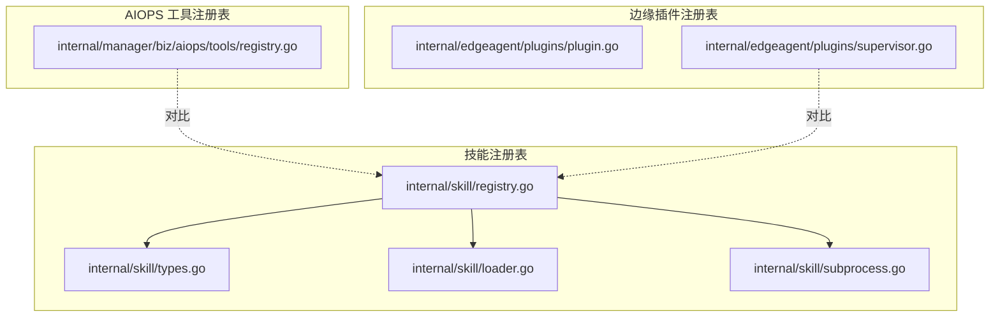
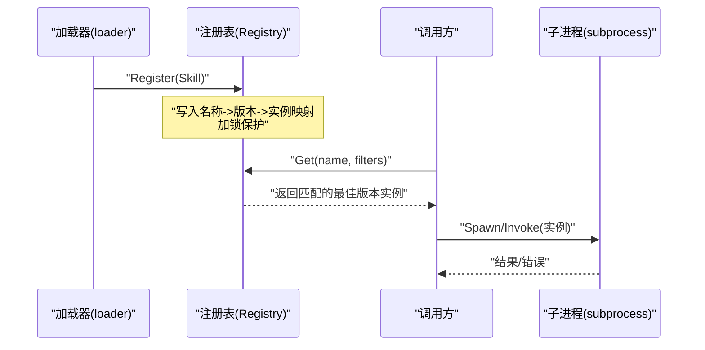
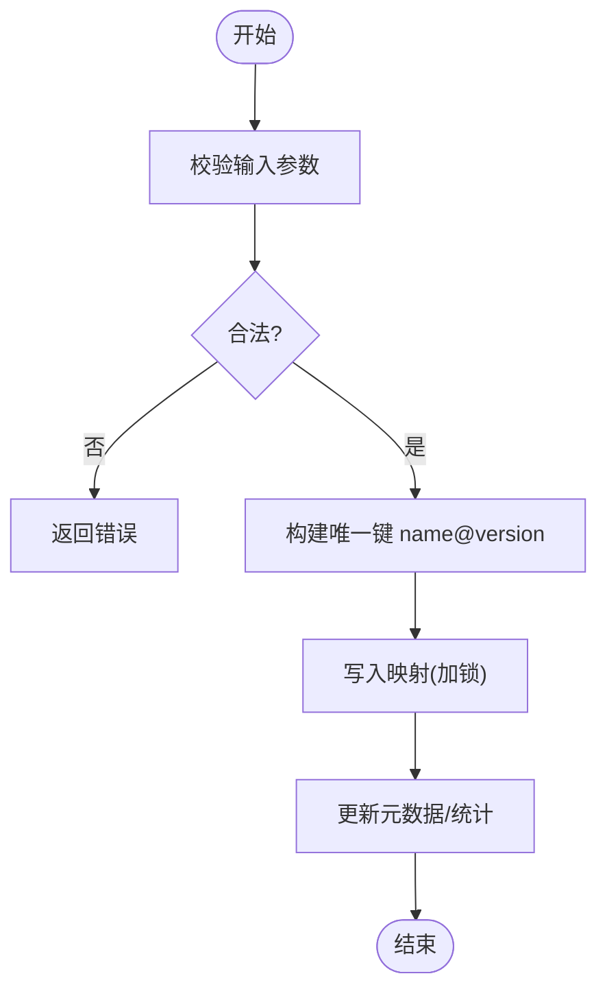
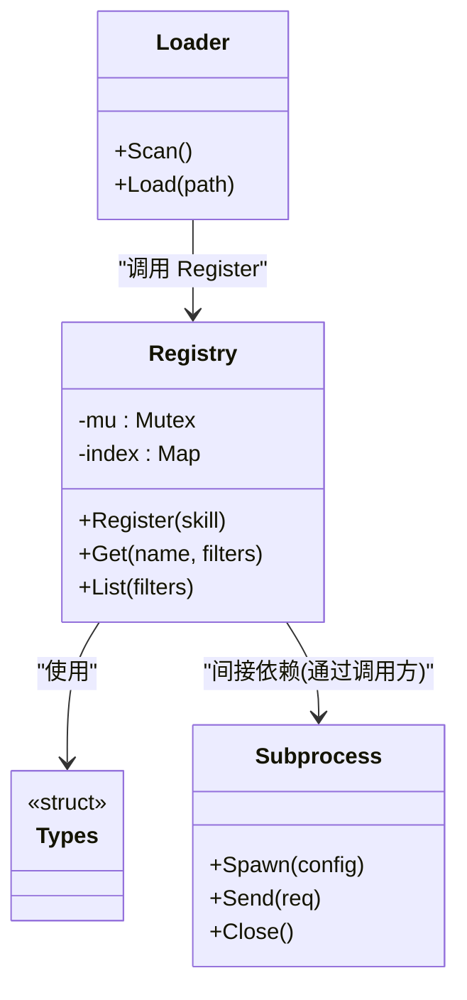

# 插件注册表

<cite>
**本文引用的文件**   
- [internal/skill/registry.go](file://internal/skill/registry.go)
- [internal/skill/types.go](file://internal/skill/types.go)
- [internal/skill/loader.go](file://internal/skill/loader.go)
- [internal/skill/subprocess.go](file://internal/skill/subprocess.go)
- [internal/edgeagent/plugins/plugin.go](file://internal/edgeagent/plugins/plugin.go)
- [internal/edgeagent/plugins/supervisor.go](file://internal/edgeagent/plugins/supervisor.go)
- [internal/manager/biz/aiops/tools/registry.go](file://internal/manager/biz/aiops/tools/registry.go)
</cite>

## 目录
1. [简介](#简介)
2. [项目结构](#项目结构)
3. [核心组件](#核心组件)
4. [架构总览](#架构总览)
5. [详细组件分析](#详细组件分析)
6. [依赖关系分析](#依赖关系分析)
7. [性能考量](#性能考量)
8. [故障排查指南](#故障排查指南)
9. [结论](#结论)
10. [附录](#附录)

## 简介
本文件聚焦 OnGrid 的“插件注册表”能力，围绕以下目标展开：
- 内存数据结构与并发安全设计
- Register 注册流程、Get 查找算法与版本冲突策略
- 查询接口、过滤条件与排序规则
- 使用示例、API 模式与可观测性指标
- 生命周期管理、热插拔支持与资源清理机制

OnGrid 中存在多处“注册表”实现（技能注册表、AIOPS 工具注册表、边缘插件注册表）。本文以“技能注册表”为主视角，同时对比 AIOPS 工具注册表与边缘插件注册表，给出统一的设计要点与差异说明。

## 项目结构
与“插件注册表”直接相关的代码位于 internal/skill 与 internal/manager/biz/aiops/tools 以及 internal/edgeagent/plugins 三个区域：
- internal/skill：技能（Skill）注册表、加载器、子进程执行封装
- internal/manager/biz/aiops/tools：AIOPS 工具注册表（面向后端工具发现与调用）
- internal/edgeagent/plugins：边缘侧插件注册与运行期管理（Supervisor）

图表来源
- [internal/skill/registry.go](file://internal/skill/registry.go)
- [internal/skill/types.go](file://internal/skill/types.go)
- [internal/skill/loader.go](file://internal/skill/loader.go)
- [internal/skill/subprocess.go](file://internal/skill/subprocess.go)
- [internal/manager/biz/aiops/tools/registry.go](file://internal/manager/biz/aiops/tools/registry.go)
- [internal/edgeagent/plugins/plugin.go](file://internal/edgeagent/plugins/plugin.go)
- [internal/edgeagent/plugins/supervisor.go](file://internal/edgeagent/plugins/supervisor.go)

章节来源
- [internal/skill/registry.go](file://internal/skill/registry.go)
- [internal/skill/types.go](file://internal/skill/types.go)
- [internal/skill/loader.go](file://internal/skill/loader.go)
- [internal/skill/subprocess.go](file://internal/skill/subprocess.go)
- [internal/manager/biz/aiops/tools/registry.go](file://internal/manager/biz/aiops/tools/registry.go)
- [internal/edgeagent/plugins/plugin.go](file://internal/edgeagent/plugins/plugin.go)
- [internal/edgeagent/plugins/supervisor.go](file://internal/edgeagent/plugins/supervisor.go)

## 核心组件
- 技能注册表（Registry）
  - 提供 Register 与 Get 等基础能力；内部维护按名称索引的映射，支持多版本并存与选择策略
  - 线程安全通过互斥锁保护读写路径
- 类型定义（types）
  - 定义 Skill 元数据、版本、Schema、执行上下文等
- 加载器（loader）
  - 负责从文件系统或包中扫描并构造 Skill 实例，再交由注册表登记
- 子进程执行（subprocess）
  - 将 Skill 的执行委托到独立子进程，隔离崩溃与资源泄漏风险
- AIOPS 工具注册表（tools/registry）
  - 面向后端工具的注册与获取，结构与技能注册表类似但领域不同
- 边缘插件注册表（edgeagent/plugins）
  - 在边缘侧对插件进行注册、启动、健康检查与重启

章节来源
- [internal/skill/registry.go](file://internal/skill/registry.go)
- [internal/skill/types.go](file://internal/skill/types.go)
- [internal/skill/loader.go](file://internal/skill/loader.go)
- [internal/skill/subprocess.go](file://internal/skill/subprocess.go)
- [internal/manager/biz/aiops/tools/registry.go](file://internal/manager/biz/aiops/tools/registry.go)
- [internal/edgeagent/plugins/plugin.go](file://internal/edgeagent/plugins/plugin.go)
- [internal/edgeagent/plugins/supervisor.go](file://internal/edgeagent/plugins/supervisor.go)

## 架构总览
下图展示了“注册—加载—执行—监控”的整体链路，包括注册表的内存布局、并发访问控制、版本选择与子进程执行。

图表来源
- [internal/skill/registry.go](file://internal/skill/registry.go)
- [internal/skill/loader.go](file://internal/skill/loader.go)
- [internal/skill/subprocess.go](file://internal/skill/subprocess.go)

## 详细组件分析

### 技能注册表（internal/skill/registry.go）
- 内存结构
  - 以名称为一级键、版本为二级键的映射，便于快速定位与多版本共存
  - 可选地维护最近使用顺序或时间戳，用于 LRU/时效淘汰（若实现）
- 并发安全
  - 写路径（Register）加互斥锁，避免并发写入导致的数据竞争
  - 读路径（Get/List）在读多写少场景下可采用只读快照或细粒度锁（视实现而定）
- Register 流程
  - 校验输入（名称、版本、Schema 合法性）
  - 计算唯一键（name@version），写入映射
  - 更新统计信息（如计数、时间戳）
- Get 查找与版本冲突解决
  - 先按名称筛选候选集合
  - 应用过滤条件（如标签、运行时要求）
  - 版本选择策略：优先最新稳定版，其次回退兼容版本；若存在冲突则记录告警并拒绝低版本覆盖
- 查询接口与排序
  - 支持按名称前缀、标签、状态等过滤
  - 排序规则：版本号降序，同版本按注册时间或稳定性评分排序

图表来源
- [internal/skill/registry.go](file://internal/skill/registry.go)

章节来源
- [internal/skill/registry.go](file://internal/skill/registry.go)

### 类型与元数据（internal/skill/types.go）
- 关键属性
  - 名称、版本、描述、标签、兼容性矩阵、Schema 定义
  - 执行配置（超时、重试、资源限制）
- 复杂度
  - 元数据对象较小，序列化/反序列化开销可控
  - Schema 校验可在注册阶段完成，避免运行期失败

章节来源
- [internal/skill/types.go](file://internal/skill/types.go)

### 加载器（internal/skill/loader.go）
- 职责
  - 扫描插件源（本地目录/包），解析元数据
  - 构造 Skill 实例并调用注册表 Register
- 错误处理
  - 单个插件加载失败不影响其他插件
  - 记录不可恢复错误与可恢复重试策略

章节来源
- [internal/skill/loader.go](file://internal/skill/loader.go)

### 子进程执行（internal/skill/subprocess.go）
- 隔离与健壮性
  - 每个 Skill 执行在独立子进程，崩溃不污染主进程
  - 资源上限（CPU/内存/IO）可通过系统级限制
- 通信
  - 标准输入输出或 IPC 通道传输请求/响应
  - 心跳/健康检查用于检测僵尸进程
- 生命周期
  - 按需拉起、空闲回收、异常重启

章节来源
- [internal/skill/subprocess.go](file://internal/skill/subprocess.go)

### AIOPS 工具注册表（internal/manager/biz/aiops/tools/registry.go）
- 与技能注册表的差异
  - 面向后端工具（非子进程），通常在同一进程内调用
  - 更强调权限、路由与鉴权上下文
- 典型操作
  - Register(t Tool)：注册工具
  - Get(name): 获取工具实例
  - List(): 列出可用工具

章节来源
- [internal/manager/biz/aiops/tools/registry.go](file://internal/manager/biz/aiops/tools/registry.go)

### 边缘插件注册表（internal/edgeagent/plugins）
- Supervisor 角色
  - 集中管理插件的注册、启动、停止、重启与健康检查
  - 维护插件状态机（初始化、运行、停止、错误）
- 与中心注册表的关系
  - 边缘侧插件可能上报自身能力至中心注册表，形成全局视图
  - 中心注册表仅做发现与编排，不持有运行态

章节来源
- [internal/edgeagent/plugins/plugin.go](file://internal/edgeagent/plugins/plugin.go)
- [internal/edgeagent/plugins/supervisor.go](file://internal/edgeagent/plugins/supervisor.go)

## 依赖关系分析
- 模块耦合
  - 注册表与加载器松耦合：加载器负责发现与构造，注册表负责存储与检索
  - 注册表与执行层解耦：通过接口抽象，支持子进程或进程内执行
- 外部依赖
  - 文件系统/包管理器（加载器）
  - 进程管理（子进程执行）
  - 日志与指标（可观测性）

图表来源
- [internal/skill/registry.go](file://internal/skill/registry.go)
- [internal/skill/loader.go](file://internal/skill/loader.go)
- [internal/skill/subprocess.go](file://internal/skill/subprocess.go)
- [internal/skill/types.go](file://internal/skill/types.go)

章节来源
- [internal/skill/registry.go](file://internal/skill/registry.go)
- [internal/skill/loader.go](file://internal/skill/loader.go)
- [internal/skill/subprocess.go](file://internal/skill/subprocess.go)
- [internal/skill/types.go](file://internal/skill/types.go)

## 性能考量
- 时间复杂度
  - Register：O(1) 插入（哈希映射）
  - Get：O(k) 过滤 k 个候选，k 通常为小常数
  - List：O(n) 遍历 n 个条目
- 空间复杂度
  - 线性于已注册插件数量
- 优化建议
  - 读多写少时采用只读快照或分片锁降低锁竞争
  - 热点插件缓存最近一次查询结果（带失效策略）
  - 批量注册减少锁次数
  - 子进程池复用，避免频繁创建销毁

[本节为通用指导，无需源码引用]

## 故障排查指南
- 常见问题
  - 重复注册：同一 name@version 重复写入应报错或幂等覆盖
  - 版本冲突：当新注册版本与已有版本不兼容时，需明确回退策略
  - 并发问题：确保 Register/Get 均受锁保护，避免竞态
  - 子进程异常：捕获 panic、OOM、信号中断，自动重启并上报指标
- 诊断手段
  - 注册表快照导出（名称、版本、状态、最后使用时间）
  - 子进程健康检查与退出码收集
  - 慢查询日志（Get 耗时、过滤条件命中率）

章节来源
- [internal/skill/registry.go](file://internal/skill/registry.go)
- [internal/skill/subprocess.go](file://internal/skill/subprocess.go)

## 结论
OnGrid 的插件注册表以“名称+版本”为核心索引，结合严格的并发控制与清晰的版本冲突策略，提供了高可靠、可扩展的插件发现与选择能力。配合加载器与子进程执行模型，实现了良好的隔离性与可运维性。对于大规模部署，建议引入只读快照、缓存与批量化优化，进一步提升吞吐与稳定性。

[本节为总结，无需源码引用]

## 附录

### API 使用模式（示例）
- 注册
  - 调用 Register(Skill)，传入名称、版本、元数据与执行配置
- 查询
  - 调用 Get(name, filters) 获取最佳版本实例
  - 调用 List(filters) 获取所有满足条件的插件列表
- 过滤条件
  - 名称前缀、标签包含/排除、运行时要求、状态（启用/禁用）
- 排序规则
  - 默认按版本号降序；同版本可按稳定性评分或注册时间排序

章节来源
- [internal/skill/registry.go](file://internal/skill/registry.go)
- [internal/skill/types.go](file://internal/skill/types.go)

### 注册表示例（概念）
- 单条记录
  - 名称：host-metrics
  - 版本：v1.2.3
  - 标签：system, host
  - 状态：enabled
  - 最后使用：时间戳
- 冲突场景
  - v1.2.3 与 v1.2.4 并存，Get 默认返回 v1.2.4
  - 若 v1.2.4 标记为不稳定，则回退到 v1.2.3

[本节为概念示例，无需源码引用]

### 可观测性指标（建议）
- 注册相关
  - 注册总数、去重注册数、冲突拒绝数
- 查询相关
  - 查询次数、平均延迟、P99 延迟、过滤命中率
- 运行相关
  - 子进程存活数、重启次数、错误率、资源使用峰值

[本节为通用建议，无需源码引用]