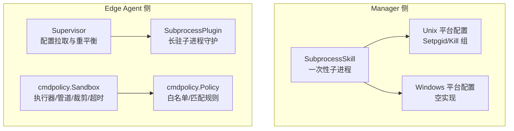
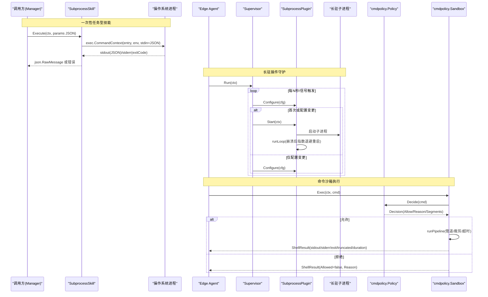
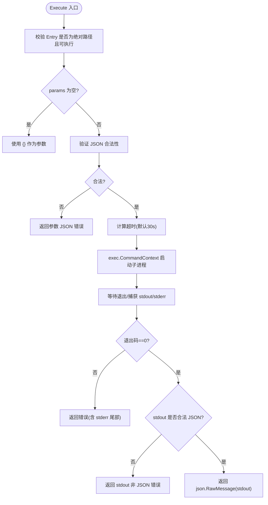
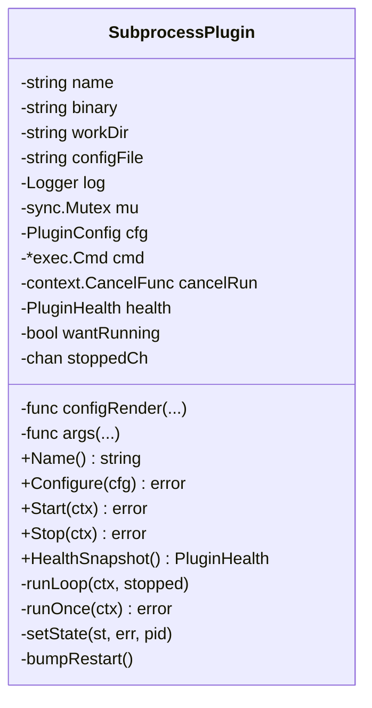
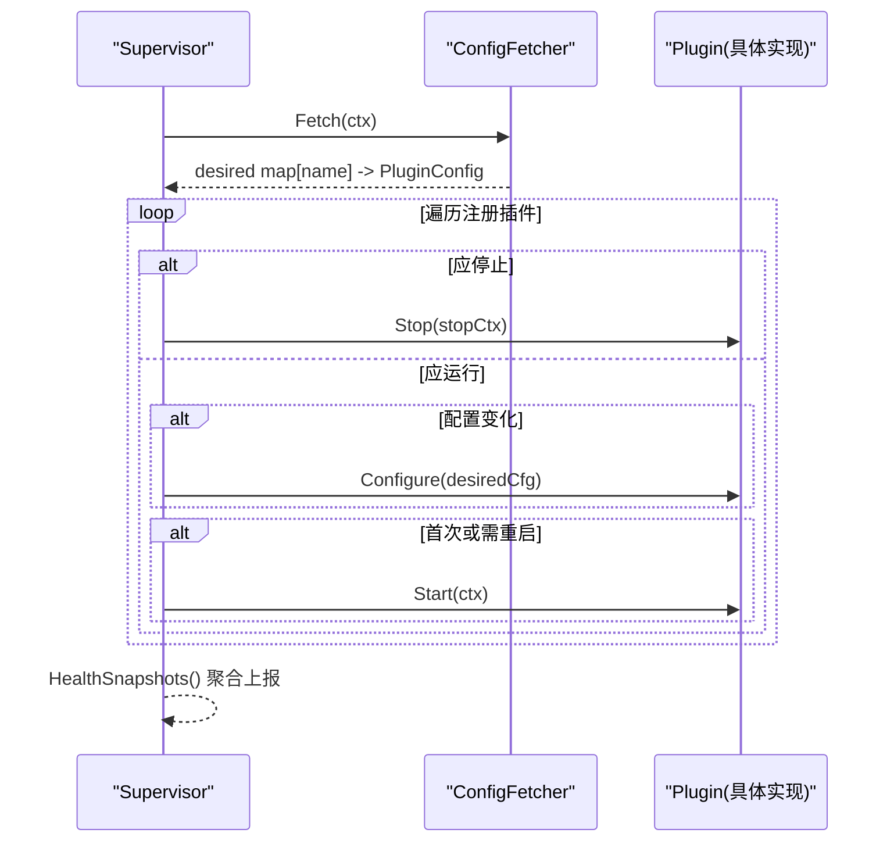
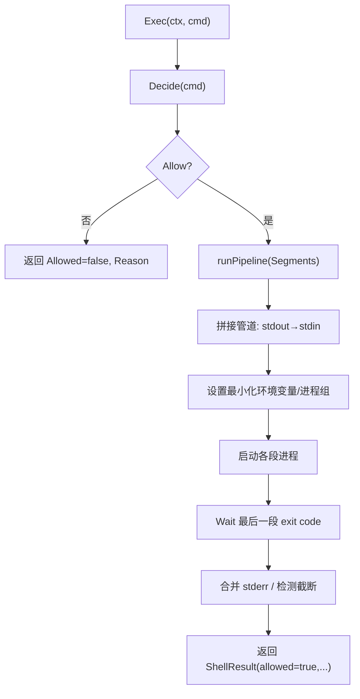
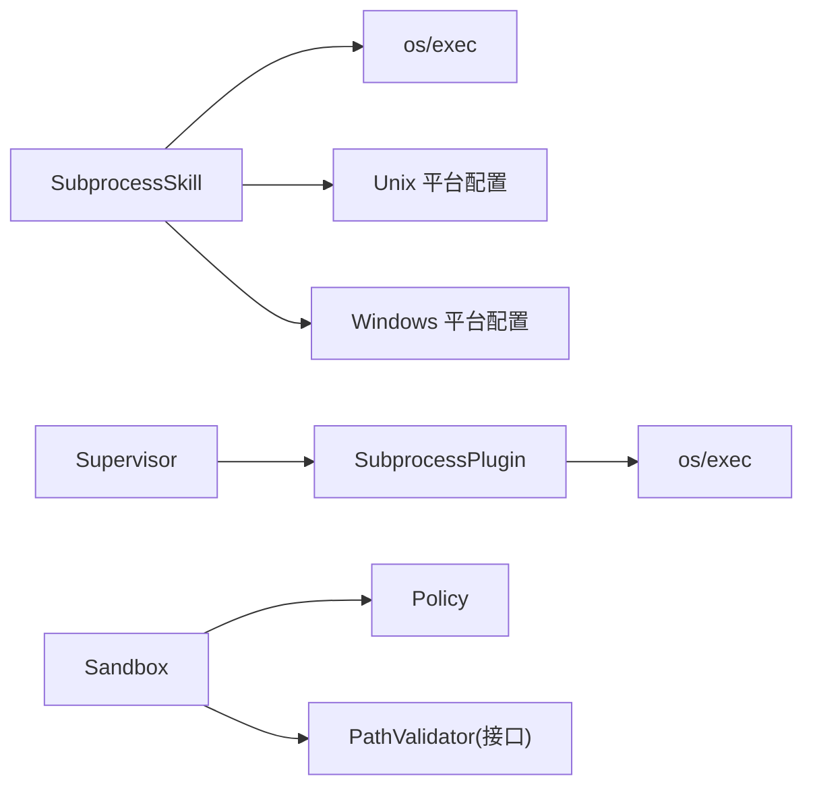

# 插件进程管理

<cite>
**本文引用的文件**   
- [internal/skill/subprocess.go](file://internal/skill/subprocess.go)
- [internal/skill/subprocess_process_unix.go](file://internal/skill/subprocess_process_unix.go)
- [internal/skill/subprocess_process_windows.go](file://internal/skill/subprocess_process_windows.go)
- [internal/edgeagent/plugins/subprocess.go](file://internal/edgeagent/plugins/subprocess.go)
- [internal/edgeagent/plugins/supervisor.go](file://internal/edgeagent/plugins/supervisor.go)
- [internal/edgeagent/cmdpolicy/policy.go](file://internal/edgeagent/cmdpolicy/policy.go)
- [internal/edgeagent/cmdpolicy/sandbox.go](file://internal/edgeagent/cmdpolicy/sandbox.go)
- [internal/edgeagent/cmdpolicy/types.go](file://internal/edgeagent/cmdpolicy/types.go)
</cite>

## 目录
1. [简介](#简介)
2. [项目结构](#项目结构)
3. [核心组件](#核心组件)
4. [架构总览](#架构总览)
5. [详细组件分析](#详细组件分析)
6. [依赖关系分析](#依赖关系分析)
7. [性能与资源限制](#性能与资源限制)
8. [故障诊断与排错指南](#故障诊断与排错指南)
9. [结论](#结论)
10. [附录：协议与消息格式](#附录协议与消息格式)

## 简介
本文件聚焦 OnGrid 的“插件进程管理器”，围绕以下目标展开：
- SubprocessSkill 的进程启动机制、资源隔离与安全沙箱实现
- 进程间通信协议、JSON 消息格式与数据序列化机制
- 进程生命周期管理、超时控制与异常恢复策略
- 进程监控指标、健康检查机制与资源限制配置
- 调试工具、日志收集方法与故障诊断指南

OnGrid 在两个层面提供进程管理能力：
- Manager 侧：SubprocessSkill 以子进程方式运行外部可执行，作为“技能”被 LLM 工具调用。
- Edge Agent 侧：Supervisor + SubprocessPlugin 负责长期运行的采集/导出类插件（如 promtail、auditbeat）的生命周期与崩溃自愈；cmdpolicy 提供命令级白名单、路径与网络访问控制，形成安全沙箱。

## 项目结构
与“插件进程管理”直接相关的代码分布在如下模块：
- internal/skill：Manager 侧 SubprocessSkill 实现（一次性任务型子进程）
- internal/edgeagent/plugins：Edge Agent 侧插件框架（Supervisor + SubprocessPlugin）
- internal/edgeagent/cmdpolicy：命令策略与沙箱执行器（白名单、路径/网络校验、输出裁剪、超时）

图表来源
- [internal/skill/subprocess.go:1-268](file://internal/skill/subprocess.go#L1-L268)
- [internal/skill/subprocess_process_unix.go:1-27](file://internal/skill/subprocess_process_unix.go#L1-L27)
- [internal/skill/subprocess_process_windows.go:1-8](file://internal/skill/subprocess_process_windows.go#L1-L8)
- [internal/edgeagent/plugins/supervisor.go:1-276](file://internal/edgeagent/plugins/supervisor.go#L1-L276)
- [internal/edgeagent/plugins/subprocess.go:1-318](file://internal/edgeagent/plugins/subprocess.go#L1-L318)
- [internal/edgeagent/cmdpolicy/policy.go:1-800](file://internal/edgeagent/cmdpolicy/policy.go#L1-L800)
- [internal/edgeagent/cmdpolicy/sandbox.go:1-550](file://internal/edgeagent/cmdpolicy/sandbox.go#L1-L550)

章节来源
- [internal/skill/subprocess.go:1-268](file://internal/skill/subprocess.go#L1-L268)
- [internal/edgeagent/plugins/subprocess.go:1-318](file://internal/edgeagent/plugins/subprocess.go#L1-L318)
- [internal/edgeagent/plugins/supervisor.go:1-276](file://internal/edgeagent/plugins/supervisor.go#L1-L276)
- [internal/edgeagent/cmdpolicy/policy.go:1-800](file://internal/edgeagent/cmdpolicy/policy.go#L1-L800)
- [internal/edgeagent/cmdpolicy/sandbox.go:1-550](file://internal/edgeagent/cmdpolicy/sandbox.go#L1-L550)
- [internal/edgeagent/cmdpolicy/types.go:1-182](file://internal/edgeagent/cmdpolicy/types.go#L1-L182)

## 核心组件
- SubprocessSkill（Manager 侧）
  - 通过标准输入传入 JSON 参数，从标准输出读取 JSON 结果
  - 强制 Scope=Manager，默认 Class=Safe
  - 环境变量白名单注入，拒绝继承父进程完整环境
  - 输出裁剪与超时保护
- SubprocessPlugin（Edge Agent 侧）
  - 封装长驻子进程（如 promtail、auditbeat），统一渲染配置、启动、崩溃重启
  - 指数退避重启，最大等待上限
  - 健康状态快照（PID、状态、错误、重启计数）
- Supervisor（Edge Agent 侧）
  - 周期性拉取并应用插件配置，按需启停/重载
  - 聚合各插件健康快照上报
- cmdpolicy（Edge Agent 侧）
  - Policy：二进制白名单、读写分类、参数匹配器、全局限制（输出裁剪、超时、参数数量、路径/网络允许列表）
  - Sandbox：将决策转化为实际执行，支持管道组合、进程组、超时、输出裁剪、网络主机白名单校验

章节来源
- [internal/skill/subprocess.go:1-268](file://internal/skill/subprocess.go#L1-L268)
- [internal/edgeagent/plugins/subprocess.go:1-318](file://internal/edgeagent/plugins/subprocess.go#L1-L318)
- [internal/edgeagent/plugins/supervisor.go:1-276](file://internal/edgeagent/plugins/supervisor.go#L1-L276)
- [internal/edgeagent/cmdpolicy/types.go:1-182](file://internal/edgeagent/cmdpolicy/types.go#L1-L182)
- [internal/edgeagent/cmdpolicy/policy.go:1-800](file://internal/edgeagent/cmdpolicy/policy.go#L1-L800)
- [internal/edgeagent/cmdpolicy/sandbox.go:1-550](file://internal/edgeagent/cmdpolicy/sandbox.go#L1-L550)

## 架构总览
下图展示 Manager 与 Edge Agent 两侧进程管理的交互与职责边界。

图表来源
- [internal/skill/subprocess.go:1-268](file://internal/skill/subprocess.go#L1-L268)
- [internal/edgeagent/plugins/subprocess.go:1-318](file://internal/edgeagent/plugins/subprocess.go#L1-L318)
- [internal/edgeagent/plugins/supervisor.go:1-276](file://internal/edgeagent/plugins/supervisor.go#L1-L276)
- [internal/edgeagent/cmdpolicy/sandbox.go:1-550](file://internal/edgeagent/cmdpolicy/sandbox.go#L1-L550)
- [internal/edgeagent/cmdpolicy/policy.go:1-800](file://internal/edgeagent/cmdpolicy/policy.go#L1-L800)

## 详细组件分析

### SubprocessSkill（Manager 侧一次性子进程）
- 启动机制
  - 使用 exec.CommandContext 启动外部可执行，stdin 写入 JSON 参数，stdout 读取 JSON 结果
  - 非零退出码视为错误，附带 stderr 尾部用于审计与 LLM 可见性
- 资源隔离与安全
  - 环境变量白名单：仅允许配置的变量名透传，默认不继承 PATH 等敏感变量
  - Entry 必须为绝对路径，Loader 层确保位于允许目录（防御纵深）
  - 输出裁剪：stdout 上限 16MiB，stderr 保留尾部 4KiB
- 超时控制
  - 若未显式设置 Timeout，则使用默认 30s；超过返回 DeadlineExceeded 错误
- 平台差异
  - Unix：设置进程组并通过 Kill(-pid, SIGKILL) 终止整个进程组
  - Windows：空实现（无进程组语义）

图表来源
- [internal/skill/subprocess.go:1-268](file://internal/skill/subprocess.go#L1-L268)
- [internal/skill/subprocess_process_unix.go:1-27](file://internal/skill/subprocess_process_unix.go#L1-L27)
- [internal/skill/subprocess_process_windows.go:1-8](file://internal/skill/subprocess_process_windows.go#L1-L8)

章节来源
- [internal/skill/subprocess.go:1-268](file://internal/skill/subprocess.go#L1-L268)
- [internal/skill/subprocess_process_unix.go:1-27](file://internal/skill/subprocess_process_unix.go#L1-L27)
- [internal/skill/subprocess_process_windows.go:1-8](file://internal/skill/subprocess_process_windows.go#L1-L8)

### SubprocessPlugin（Edge Agent 侧长驻插件）
- 功能要点
  - 渲染配置到工作目录，按 Args 函数构造命令行参数
  - 启动子进程并将 stdout/stderr 写入 <workDir>/<name>.log
  - runLoop 维护期望运行态，崩溃后指数退避重启（1s→2s→…≤5min）
  - Stop 发送 SIGTERM，最多等待 10s 后 SIGKILL
- 健康状态
  - HealthSnapshot 包含 Name、State、PID、StartedAt、LastError、RestartCount、UpdatedAt

图表来源
- [internal/edgeagent/plugins/subprocess.go:1-318](file://internal/edgeagent/plugins/subprocess.go#L1-L318)

章节来源
- [internal/edgeagent/plugins/subprocess.go:1-318](file://internal/edgeagent/plugins/subprocess.go#L1-L318)

### Supervisor（Edge Agent 侧配置驱动）
- 职责
  - 定时/信号触发拉取最新插件配置，diff 当前状态并 Apply
  - 对每个插件：新增启用 → Configure+Start；禁用 → Stop；配置变化 → Configure 并视需要 Restart
  - 汇总所有插件健康快照，供心跳上报
- 健壮性
  - 单个插件失败不影响其他插件
  - Shutdown 时对所有插件进行有界宽限的优雅停止

图表来源
- [internal/edgeagent/plugins/supervisor.go:1-276](file://internal/edgeagent/plugins/supervisor.go#L1-L276)

章节来源
- [internal/edgeagent/plugins/supervisor.go:1-276](file://internal/edgeagent/plugins/supervisor.go#L1-L276)

### cmdpolicy（命令策略与沙箱）
- Policy（策略定义）
  - 二进制分类：read-fs、read-system、mixed、network、denied
  - 参数匹配器：AnyFlag、Subcmd、SubcmdPath
  - 全局限制：StdoutCap、StderrCap、Timeout、MaxArgs、NetworkHostAllowlist、PathAllowlist
- Sandbox（执行器）
  - Decide：基于 Policy 做 Allow/Reason 判定，并进行路径与网络主机白名单校验
  - Exec：根据 Segments 构建管道，逐段执行，合并 stderr，标记 Truncated，统计 DurationMs
  - ExecRaw：绕过策略直接 /bin/sh -c 执行（管理员写门控）
  - 输出裁剪：capWriter 丢弃超出上限的字节，Truncated=true 提示上层
  - 超时：context.WithTimeout，超时返回特定错误信息
  - 进程组：SysProcAttr.Setpgid，便于整体终止

图表来源
- [internal/edgeagent/cmdpolicy/sandbox.go:1-550](file://internal/edgeagent/cmdpolicy/sandbox.go#L1-L550)
- [internal/edgeagent/cmdpolicy/policy.go:1-800](file://internal/edgeagent/cmdpolicy/policy.go#L1-L800)
- [internal/edgeagent/cmdpolicy/types.go:1-182](file://internal/edgeagent/cmdpolicy/types.go#L1-L182)

章节来源
- [internal/edgeagent/cmdpolicy/types.go:1-182](file://internal/edgeagent/cmdpolicy/types.go#L1-L182)
- [internal/edgeagent/cmdpolicy/policy.go:1-800](file://internal/edgeagent/cmdpolicy/policy.go#L1-L800)
- [internal/edgeagent/cmdpolicy/sandbox.go:1-550](file://internal/edgeagent/cmdpolicy/sandbox.go#L1-L550)

## 依赖关系分析
- Manager 侧
  - SubprocessSkill 依赖 os/exec 与平台特定的 SysProcAttr 配置
  - 通过 Loader 保证 Entry 位于允许目录（不在本文件范围内）
- Edge Agent 侧
  - SubprocessPlugin 由 Supervisor 调度，内部使用 os/exec 管理长驻子进程
  - cmdpolicy 独立于具体工具，Policy 与 Sandbox 解耦，Sandbox 依赖 PathValidator 接口复用 host_files 的路径校验逻辑

图表来源
- [internal/skill/subprocess.go:1-268](file://internal/skill/subprocess.go#L1-L268)
- [internal/edgeagent/plugins/subprocess.go:1-318](file://internal/edgeagent/plugins/subprocess.go#L1-L318)
- [internal/edgeagent/cmdpolicy/sandbox.go:1-550](file://internal/edgeagent/cmdpolicy/sandbox.go#L1-L550)
- [internal/edgeagent/cmdpolicy/policy.go:1-800](file://internal/edgeagent/cmdpolicy/policy.go#L1-L800)

章节来源
- [internal/skill/subprocess.go:1-268](file://internal/skill/subprocess.go#L1-L268)
- [internal/edgeagent/plugins/subprocess.go:1-318](file://internal/edgeagent/plugins/subprocess.go#L1-L318)
- [internal/edgeagent/cmdpolicy/sandbox.go:1-550](file://internal/edgeagent/cmdpolicy/sandbox.go#L1-L550)
- [internal/edgeagent/cmdpolicy/policy.go:1-800](file://internal/edgeagent/cmdpolicy/policy.go#L1-L800)

## 性能与资源限制
- 输出裁剪
  - Manager 侧 SubprocessSkill：stdout 上限 16MiB，stderr 尾部 4KiB
  - Edge 侧 Sandbox：StdoutCap/StderrCap 可配置，默认分别为 64KiB/16KiB
- 超时控制
  - Manager 侧默认 30s；Edge 侧 Sandbox 默认 30s，可通过 Policy 覆盖
- 参数规模
  - MaxArgs 限制单段 argv 长度，防止 ARG_MAX 洪水攻击
- 进程组与优雅终止
  - Unix 下 Setpgid + Kill(-pid, SIGKILL) 快速回收
  - SubprocessPlugin 先 SIGTERM，再 WaitDelay 后 SIGKILL

章节来源
- [internal/skill/subprocess.go:1-268](file://internal/skill/subprocess.go#L1-L268)
- [internal/edgeagent/cmdpolicy/policy.go:1-800](file://internal/edgeagent/cmdpolicy/policy.go#L1-L800)
- [internal/edgeagent/cmdpolicy/sandbox.go:1-550](file://internal/edgeagent/cmdpolicy/sandbox.go#L1-L550)
- [internal/edgeagent/plugins/subprocess.go:1-318](file://internal/edgeagent/plugins/subprocess.go#L1-L318)

## 故障诊断与排错指南
- 常见错误定位
  - Manager 侧
    - 参数 JSON 非法：查看 Execute 返回的错误信息
    - 子进程非零退出：错误中包含 stderr 尾部，便于快速定位
    - 超时：返回 DeadlineExceeded 相关错误
  - Edge 侧
    - 策略拒绝：ShellResult.Allowed=false 且 Reason 说明原因（二进制不在白名单、参数命中写规则、路径/网络不允许等）
    - 输出截断：ShellResult.Truncated=true，建议调整 Cap 或拆分命令
    - 插件崩溃：SubprocessPlugin.HealthSnapshot 中 State=Crashed，LastError 记录最近一次错误，RestartCount 递增
- 日志收集
  - Manager 侧：关注 SubprocessSkill 的 stderr 尾部与错误包裹
  - Edge 侧：
    - 插件日志：<workDir>/<plugin>.log（由 SubprocessPlugin 写入）
    - 策略执行：Sandbox.Decide/Exec 的 Reason 与 DurationMs 可用于审计与性能分析
- 健康检查
  - 通过 Supervisor.HealthSnapshots 获取各插件状态、PID、更新时间与重启次数
- 调试建议
  - 使用 Policy.Decide 进行 dry-run 预览，确认白名单与匹配器是否符合预期
  - 逐步放宽 NetworkHostAllowlist 与 PathAllowlist，观察是否仍被拒绝
  - 针对 mixed/network 类二进制，优先明确 ReadOnlyMatchers 与 WriteMatchers，避免歧义

章节来源
- [internal/skill/subprocess.go:1-268](file://internal/skill/subprocess.go#L1-L268)
- [internal/edgeagent/plugins/subprocess.go:1-318](file://internal/edgeagent/plugins/subprocess.go#L1-L318)
- [internal/edgeagent/plugins/supervisor.go:1-276](file://internal/edgeagent/plugins/supervisor.go#L1-L276)
- [internal/edgeagent/cmdpolicy/sandbox.go:1-550](file://internal/edgeagent/cmdpolicy/sandbox.go#L1-L550)
- [internal/edgeagent/cmdpolicy/policy.go:1-800](file://internal/edgeagent/cmdpolicy/policy.go#L1-L800)

## 结论
OnGrid 的插件进程管理在 Manager 与 Edge Agent 两端分别采用“一次性子进程”和“长驻守护进程”两种模式，配合严格的策略与沙箱机制，实现了：
- 安全的进程启动与环境隔离
- 健壮的进程生命周期管理与崩溃自愈
- 明确的进程间通信契约（JSON 入参/出参）
- 完善的监控与健康检查能力
- 可观测的调试与排障手段

## 附录：协议与消息格式
- 进程间通信协议
  - 方向：Manager 向 SubprocessSkill 子进程的标准输入写入 JSON 参数；子进程的标准输出返回 JSON 结果
  - 约定：stdout 必须是合法 JSON；非零退出码表示失败，stderr 尾部用于错误上下文
- JSON 消息格式
  - 入参：任意 JSON 对象，由具体技能定义其 Schema（SubprocessSkill.Schema 可覆盖元数据中的参数描述）
  - 出参：任意 JSON 对象，由具体技能定义其结构
- 数据序列化机制
  - 使用 Go 标准库 encoding/json 进行序列化和反序列化
  - 当 params 为空时，自动替换为 {}，以保证子进程能读到有效 JSON

章节来源
- [internal/skill/subprocess.go:1-268](file://internal/skill/subprocess.go#L1-L268)