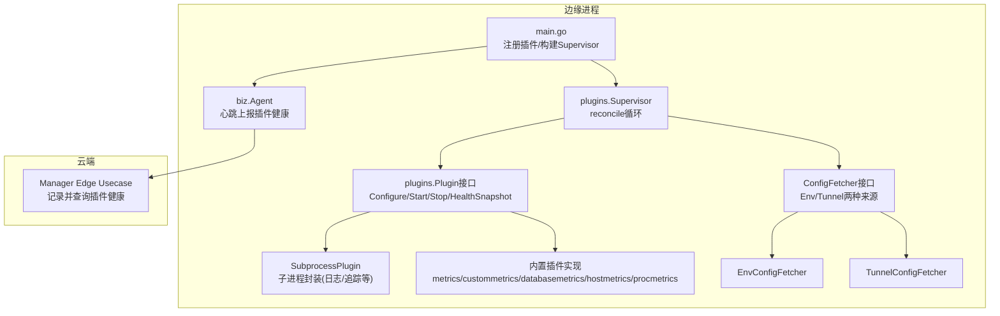
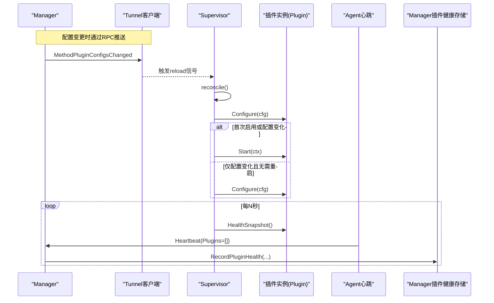
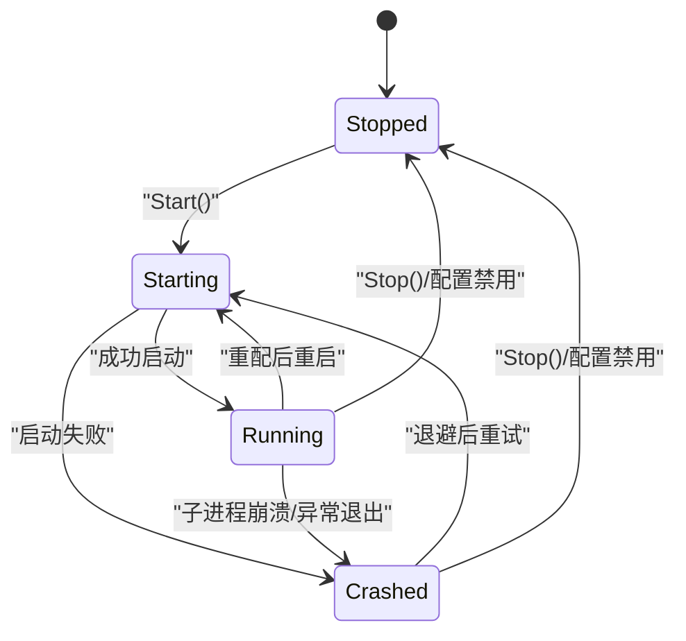
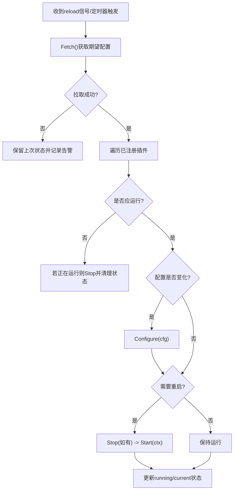
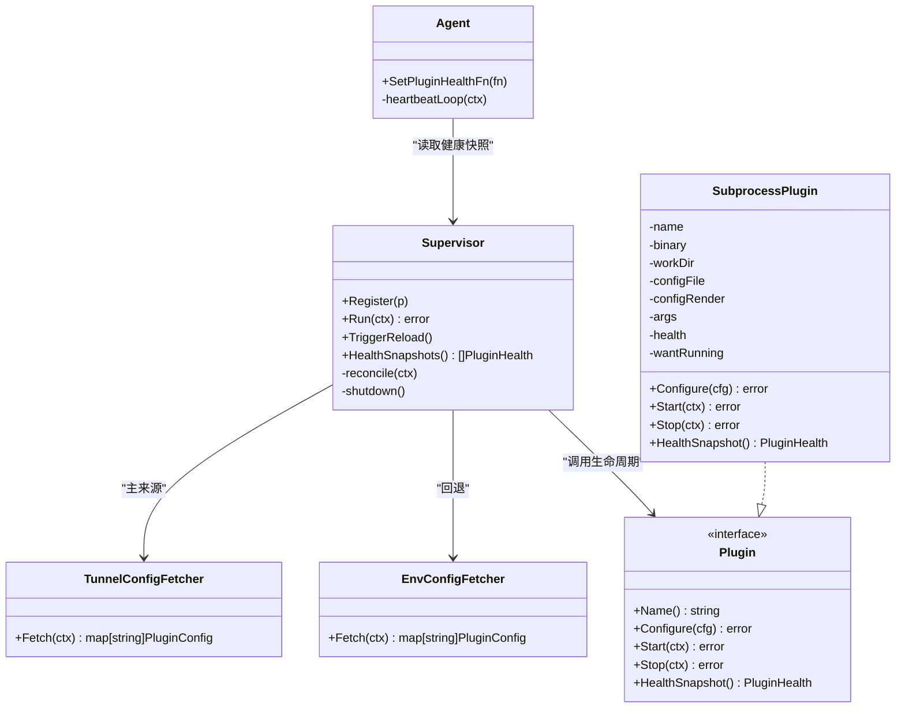

# 插件生命周期管理

<cite>
**本文引用的文件**   
- [internal/edgeagent/plugins/plugin.go](file://internal/edgeagent/plugins/plugin.go)
- [internal/edgeagent/plugins/supervisor.go](file://internal/edgeagent/plugins/supervisor.go)
- [internal/edgeagent/plugins/subprocess.go](file://internal/edgeagent/plugins/subprocess.go)
- [internal/edgeagent/plugins/config_env.go](file://internal/edgeagent/plugins/config_env.go)
- [internal/edgeagent/plugins/config_tunnel.go](file://internal/edgeagent/plugins/config_tunnel.go)
- [cmd/ongrid-edge/main.go](file://cmd/ongrid-edge/main.go)
- [internal/edgeagent/biz/agent.go](file://internal/edgeagent/biz/agent.go)
- [internal/manager/biz/edge/plugin_health.go](file://internal/manager/biz/edge/plugin_health.go)
</cite>

## 目录
1. [简介](#简介)
2. [项目结构](#项目结构)
3. [核心组件](#核心组件)
4. [架构总览](#架构总览)
5. [详细组件分析](#详细组件分析)
6. [依赖关系分析](#依赖关系分析)
7. [性能与可靠性考量](#性能与可靠性考量)
8. [故障排查指南](#故障排查指南)
9. [结论](#结论)
10. [附录：开发最佳实践](#附录开发最佳实践)

## 简介
本文件系统性阐述 OnGrid 边缘端插件的生命周期管理机制，覆盖从配置到运行、健康上报、停止的完整流程；解释 Supervisor 如何驱动状态转换、错误处理与自动重启；说明配置热更新（Tunnel 推送 + Env 回退）的流程、校验与回滚策略；并提供状态机图、时序图与错误处理流程图，以及面向插件开发者的钩子使用指南和最佳实践。

## 项目结构
与插件生命周期相关的核心代码位于 edgeagent 的 plugins 包，Supervisor 负责统一编排，Agent 在心跳中上报插件健康，Manager 侧持久化最近一次的健康快照。

图表来源
- [cmd/ongrid-edge/main.go:189-305](file://cmd/ongrid-edge/main.go#L189-L305)
- [internal/edgeagent/plugins/supervisor.go:114-230](file://internal/edgeagent/plugins/supervisor.go#L114-L230)
- [internal/edgeagent/plugins/plugin.go:25-52](file://internal/edgeagent/plugins/plugin.go#L25-L52)
- [internal/edgeagent/plugins/subprocess.go:32-50](file://internal/edgeagent/plugins/subprocess.go#L32-L50)
- [internal/edgeagent/plugins/config_env.go:46-71](file://internal/edgeagent/plugins/config_env.go#L46-L71)
- [internal/edgeagent/plugins/config_tunnel.go:58-108](file://internal/edgeagent/plugins/config_tunnel.go#L58-L108)
- [internal/edgeagent/biz/agent.go:392-431](file://internal/edgeagent/biz/agent.go#L392-L431)
- [internal/manager/biz/edge/plugin_health.go:41-70](file://internal/manager/biz/edge/plugin_health.go#L41-L70)

章节来源
- [cmd/ongrid-edge/main.go:189-305](file://cmd/ongrid-edge/main.go#L189-L305)
- [internal/edgeagent/plugins/supervisor.go:114-230](file://internal/edgeagent/plugins/supervisor.go#L114-L230)
- [internal/edgeagent/plugins/plugin.go:25-52](file://internal/edgeagent/plugins/plugin.go#L25-L52)
- [internal/edgeagent/plugins/subprocess.go:32-50](file://internal/edgeagent/plugins/subprocess.go#L32-L50)
- [internal/edgeagent/plugins/config_env.go:46-71](file://internal/edgeagent/plugins/config_env.go#L46-L71)
- [internal/edgeagent/plugins/config_tunnel.go:58-108](file://internal/edgeagent/plugins/config_tunnel.go#L58-L108)
- [internal/edgeagent/biz/agent.go:392-431](file://internal/edgeagent/biz/agent.go#L392-L431)
- [internal/manager/biz/edge/plugin_health.go:41-70](file://internal/manager/biz/edge/plugin_health.go#L41-L70)

## 核心组件
- Plugin 接口：定义 Configure → Start → HealthSnapshot → Stop 的标准生命周期。
- SubprocessPlugin：通用子进程封装，负责渲染配置、启动/停止子进程、崩溃指数退避重启、健康状态维护。
- Supervisor：统一调度所有已注册插件，按期望配置进行差异对比与 reconcile，触发 Configure/Start/Stop，周期性拉取配置并安全关闭。
- ConfigFetcher：抽象配置来源，支持 Tunnel 实时推送与 Env 回退。
- Agent 心跳：将各插件 HealthSnapshot 打包上报给 Manager。
- Manager 侧记录：内存缓存最近一次插件健康快照，供 UI 展示。

章节来源
- [internal/edgeagent/plugins/plugin.go:25-52](file://internal/edgeagent/plugins/plugin.go#L25-L52)
- [internal/edgeagent/plugins/subprocess.go:107-156](file://internal/edgeagent/plugins/subprocess.go#L107-L156)
- [internal/edgeagent/plugins/supervisor.go:114-230](file://internal/edgeagent/plugins/supervisor.go#L114-L230)
- [internal/edgeagent/plugins/config_env.go:46-71](file://internal/edgeagent/plugins/config_env.go#L46-L71)
- [internal/edgeagent/plugins/config_tunnel.go:58-108](file://internal/edgeagent/plugins/config_tunnel.go#L58-L108)
- [internal/edgeagent/biz/agent.go:392-431](file://internal/edgeagent/biz/agent.go#L392-L431)
- [internal/manager/biz/edge/plugin_health.go:41-70](file://internal/manager/biz/edge/plugin_health.go#L41-L70)

## 架构总览
下图展示了从 Manager 下发配置到边缘端插件运行的端到端路径，以及健康上报的闭环。

图表来源
- [cmd/ongrid-edge/main.go:298-305](file://cmd/ongrid-edge/main.go#L298-L305)
- [internal/edgeagent/plugins/supervisor.go:114-133](file://internal/edgeagent/plugins/supervisor.go#L114-L133)
- [internal/edgeagent/plugins/supervisor.go:138-230](file://internal/edgeagent/plugins/supervisor.go#L138-L230)
- [internal/edgeagent/biz/agent.go:392-431](file://internal/edgeagent/biz/agent.go#L392-L431)
- [internal/manager/biz/edge/plugin_health.go:41-70](file://internal/manager/biz/edge/plugin_health.go#L41-L70)

## 详细组件分析

### 插件接口与状态模型
- 生命周期方法
  - Name：返回插件名（如 metrics/logs/traces），作为注册键。
  - Configure：接收最新配置，完成渲染/校验/准备；失败则进入“crashed”可见态。
  - Start：启动工作（goroutine 或子进程）；需幂等，避免重复启动。
  - Stop：优雅停止；未运行时调用为 no-op。
  - HealthSnapshot：非阻塞地返回当前健康快照。
- 状态枚举
  - stopped / starting / running / crashed
- 健康数据结构
  - 包含名称、状态、最近错误、重启计数、PID、开始时间、更新时间、目标级健康（多目标场景）。

章节来源
- [internal/edgeagent/plugins/plugin.go:25-52](file://internal/edgeagent/plugins/plugin.go#L25-L52)
- [internal/edgeagent/plugins/plugin.go:71-106](file://internal/edgeagent/plugins/plugin.go#L71-L106)

#### 插件状态机

图表来源
- [internal/edgeagent/plugins/plugin.go:71-79](file://internal/edgeagent/plugins/plugin.go#L71-L79)
- [internal/edgeagent/plugins/subprocess.go:197-235](file://internal/edgeagent/plugins/subprocess.go#L197-L235)

### Supervisor 协调器
- 职责
  - 维护插件注册表、当前配置与运行态。
  - 定时或收到 reload 信号时执行 reconcile：比较期望与实际，按需 Configure/Start/Stop。
  - 提供 HealthSnapshots 聚合接口，供心跳上报。
- 关键行为
  - 配置拉取失败：保持上次已知状态，不中断其他插件。
  - 配置变更：先 Configure，再根据是否首次启动或配置变化决定是否 Stop+Start。
  - 关闭：对每个运行中的插件执行带超时的 Stop。
- 并发与一致性
  - 内部互斥保护注册表与状态映射；每次 reconcile 拷贝快照以避免持有锁过久。

章节来源
- [internal/edgeagent/plugins/supervisor.go:114-230](file://internal/edgeagent/plugins/supervisor.go#L114-L230)
- [internal/edgeagent/plugins/supervisor.go:96-110](file://internal/edgeagent/plugins/supervisor.go#L96-L110)
- [internal/edgeagent/plugins/supervisor.go:234-251](file://internal/edgeagent/plugins/supervisor.go#L234-L251)

#### 配置热更新流程

图表来源
- [internal/edgeagent/plugins/supervisor.go:138-230](file://internal/edgeagent/plugins/supervisor.go#L138-L230)

### 子进程插件封装
- 功能
  - 渲染配置文件到磁盘（可选）。
  - 启动子进程，绑定工作目录，输出重定向至日志文件。
  - 优雅停止：SIGTERM + WaitDelay 超时强制终止。
  - 崩溃恢复：指数退避重启，限制最大间隔；重启计数单调递增。
- 健康
  - 维护 PID、StartedAt、LastError、RestartCount 等字段。

章节来源
- [internal/edgeagent/plugins/subprocess.go:107-156](file://internal/edgeagent/plugins/subprocess.go#L107-L156)
- [internal/edgeagent/plugins/subprocess.go:197-235](file://internal/edgeagent/plugins/subprocess.go#L197-L235)
- [internal/edgeagent/plugins/subprocess.go:239-287](file://internal/edgeagent/plugins/subprocess.go#L239-L287)
- [internal/edgeagent/plugins/subprocess.go:289-311](file://internal/edgeagent/plugins/subprocess.go#L289-L311)

### 配置来源与回退
- EnvConfigFetcher
  - 从环境变量读取 per-plugin 配置，缺失项视为禁用。
  - 支持 AUTH_USER/AUTH_PASS 回退到全局 tunnel 凭据。
- TunnelConfigFetcher
  - 优先通过 RPC 获取配置；失败时回退到 Env。
  - 过滤未知插件名，确保只应用已注册插件的配置。
  - EdgeID 以本地环境为准，保证标签一致。

章节来源
- [internal/edgeagent/plugins/config_env.go:46-71](file://internal/edgeagent/plugins/config_env.go#L46-L71)
- [internal/edgeagent/plugins/config_tunnel.go:58-108](file://internal/edgeagent/plugins/config_tunnel.go#L58-L108)

### 心跳与健康上报
- 边缘侧
  - Agent 心跳循环定期调用 SetPluginHealthFn 提供的函数，汇总各插件 HealthSnapshot，并通过 Heartbeat RPC 上报。
- 云端侧
  - Manager 记录最近一次插件健康快照（内存），用于 UI 展示与诊断。

章节来源
- [internal/edgeagent/biz/agent.go:392-431](file://internal/edgeagent/biz/agent.go#L392-L431)
- [internal/manager/biz/edge/plugin_health.go:41-70](file://internal/manager/biz/edge/plugin_health.go#L41-L70)

### 具体插件实现要点（示例）
- 子进程类插件（logs/traces/audit/hostmetrics/procmetrics）
  - 通过 NewSubprocess 构造，指定二进制、工作目录、配置渲染与参数生成。
  - 遵循标准生命周期，由 Supervisor 驱动。
- 内置采集类插件（metrics/custommetrics/databasemetrics）
  - 在进程内运行 goroutine，周期性抓取并推送样本。
  - 维护目标级健康（TargetHealth），便于定位单个 scrape 源问题。

章节来源
- [internal/edgeagent/plugins/logs/plugin.go:27-53](file://internal/edgeagent/plugins/logs/plugin.go#L27-L53)
- [internal/edgeagent/plugins/traces/plugin.go:31-47](file://internal/edgeagent/plugins/traces/plugin.go#L31-L47)
- [internal/edgeagent/plugins/audit/plugin.go:46-74](file://internal/edgeagent/plugins/audit/plugin.go#L46-L74)
- [internal/edgeagent/plugins/hostmetrics/plugin.go:62-93](file://internal/edgeagent/plugins/hostmetrics/plugin.go#L62-L93)
- [internal/edgeagent/plugins/procmetrics/plugin.go:32-42](file://internal/edgeagent/plugins/procmetrics/plugin.go#L32-L42)
- [internal/edgeagent/plugins/metrics/plugin.go:109-121](file://internal/edgeagent/plugins/metrics/plugin.go#L109-L121)
- [internal/edgeagent/plugins/metrics/plugin.go:125-142](file://internal/edgeagent/plugins/metrics/plugin.go#L125-L142)
- [internal/edgeagent/plugins/metrics/plugin.go:146-168](file://internal/edgeagent/plugins/metrics/plugin.go#L146-L168)
- [internal/edgeagent/plugins/metrics/plugin.go:173-179](file://internal/edgeagent/plugins/metrics/plugin.go#L173-L179)
- [internal/edgeagent/plugins/custommetrics/plugin.go:67-77](file://internal/edgeagent/plugins/custommetrics/plugin.go#L67-77)
- [internal/edgeagent/plugins/custommetrics/plugin.go:79-96](file://internal/edgeagent/plugins/custommetrics/plugin.go#L79-96)
- [internal/edgeagent/plugins/custommetrics/plugin.go:98-120](file://internal/edgeagent/plugins/custommetrics/plugin.go#L98-120)
- [internal/edgeagent/plugins/custommetrics/plugin.go:122-133](file://internal/edgeagent/plugins/custommetrics/plugin.go#L122-133)
- [internal/edgeagent/plugins/databasemetrics/plugin.go:77-87](file://internal/edgeagent/plugins/databasemetrics/plugin.go#L77-L87)
- [internal/edgeagent/plugins/databasemetrics/plugin.go:89-106](file://internal/edgeagent/plugins/databasemetrics/plugin.go#L89-L106)
- [internal/edgeagent/plugins/databasemetrics/plugin.go:108-130](file://internal/edgeagent/plugins/databasemetrics/plugin.go#L108-L130)
- [internal/edgeagent/plugins/databasemetrics/plugin.go:132-143](file://internal/edgeagent/plugins/databasemetrics/plugin.go#L132-L143)

## 依赖关系分析
- main.go 负责：
  - 创建并注册所有插件实例。
  - 构建 Supervisor（注入 TunnelConfigFetcher）。
  - 设置 Agent 的插件健康回调，并在心跳中上报。
  - 注册 Manager→Edge 的 plugin_config_changed 处理器，触发 Supervisor 重载。
- Supervisor 依赖：
  - ConfigFetcher（Tunnel 优先，Env 回退）。
  - 各 Plugin 实现（统一接口）。
- Agent 依赖：
  - 插件健康回调（来自 Supervisor.HealthSnapshots）。
  - Tunnel 客户端（心跳、配置变更通知）。

图表来源
- [cmd/ongrid-edge/main.go:245-305](file://cmd/ongrid-edge/main.go#L245-L305)
- [internal/edgeagent/plugins/supervisor.go:78-82](file://internal/edgeagent/plugins/supervisor.go#L78-L82)
- [internal/edgeagent/plugins/supervisor.go:114-230](file://internal/edgeagent/plugins/supervisor.go#L114-L230)
- [internal/edgeagent/plugins/subprocess.go:32-50](file://internal/edgeagent/plugins/subprocess.go#L32-L50)
- [internal/edgeagent/plugins/config_env.go:46-71](file://internal/edgeagent/plugins/config_env.go#L46-L71)
- [internal/edgeagent/plugins/config_tunnel.go:58-108](file://internal/edgeagent/plugins/config_tunnel.go#L58-L108)
- [internal/edgeagent/biz/agent.go:392-431](file://internal/edgeagent/biz/agent.go#L392-L431)

章节来源
- [cmd/ongrid-edge/main.go:245-305](file://cmd/ongrid-edge/main.go#L245-L305)
- [internal/edgeagent/plugins/supervisor.go:78-82](file://internal/edgeagent/plugins/supervisor.go#L78-L82)
- [internal/edgeagent/plugins/supervisor.go:114-230](file://internal/edgeagent/plugins/supervisor.go#L114-L230)
- [internal/edgeagent/plugins/subprocess.go:32-50](file://internal/edgeagent/plugins/subprocess.go#L32-L50)
- [internal/edgeagent/plugins/config_env.go:46-71](file://internal/edgeagent/plugins/config_env.go#L46-L71)
- [internal/edgeagent/plugins/config_tunnel.go:58-108](file://internal/edgeagent/plugins/config_tunnel.go#L58-L108)
- [internal/edgeagent/biz/agent.go:392-431](file://internal/edgeagent/biz/agent.go#L392-L431)

## 性能与可靠性考量
- 配置拉取失败容忍：Supervisor 在 Fetch 失败时保留上次状态，避免单点故障影响整体。
- 优雅停止：子进程 SIGTERM + WaitDelay，避免僵尸进程；Stop 可幂等。
- 崩溃恢复：指数退避重启，上限控制，防止风暴式重启。
- 健康上报：轻量、非阻塞，避免影响业务循环。
- 并发安全：Supervisor 内部互斥保护，reconcile 前拷贝快照，降低锁竞争。

[本节为通用指导，不直接分析具体文件]

## 故障排查指南
- 插件未启动
  - 检查期望配置是否 enabled=true，且 Fetch 成功。
  - 查看 Supervisor reconcile 日志，确认是否触发 Configure/Start。
- 插件频繁重启
  - 关注子进程日志与工作目录下的 .log 文件。
  - 检查二进制是否存在、权限是否正确、配置渲染是否成功。
- 配置热更新无效
  - 确认 Manager 是否推送了 plugin_config_changed。
  - 观察 Supervisor 是否收到 reload 信号并执行 reconcile。
- 健康上报缺失
  - 检查 Agent 心跳是否正常，插件健康回调是否设置。
  - 核对 Manager 侧是否收到并记录健康快照。

章节来源
- [internal/edgeagent/plugins/supervisor.go:138-230](file://internal/edgeagent/plugins/supervisor.go#L138-L230)
- [internal/edgeagent/plugins/subprocess.go:239-287](file://internal/edgeagent/plugins/subprocess.go#L239-L287)
- [cmd/ongrid-edge/main.go:298-305](file://cmd/ongrid-edge/main.go#L298-L305)
- [internal/edgeagent/biz/agent.go:392-431](file://internal/edgeagent/biz/agent.go#L392-L431)
- [internal/manager/biz/edge/plugin_health.go:41-70](file://internal/manager/biz/edge/plugin_health.go#L41-L70)

## 结论
OnGrid 的边缘插件体系通过统一的 Plugin 接口与 Supervisor 编排，实现了配置热更新、健壮的重启机制与可视化的健康上报。Tunnel 驱动的实时配置与 Env 回退保证了高可用；子进程封装与内置采集插件覆盖了多种观测需求。开发者只需实现标准生命周期钩子，即可快速接入并享受完善的生命周期管理与运维能力。

[本节为总结性内容，不直接分析具体文件]

## 附录：开发最佳实践
- 生命周期钩子
  - Configure：只做幂等的配置渲染与校验；任何错误都会让插件进入“crashed”，便于诊断。
  - Start：确保幂等；若已在运行，直接返回。
  - Stop：优雅退出，等待 goroutine/子进程结束，设置超时保护。
  - HealthSnapshot：必须非阻塞，返回副本，避免竞争。
- 子进程插件
  - 正确处理 SIGTERM，避免长时间阻塞。
  - 将数据/日志写入工作目录，遵守系统沙箱约束。
  - 合理设置崩溃退避与重启次数，避免雪崩。
- 配置热更新
  - 区分“仅配置变化”与“需要重启”的场景，减少不必要的 Stop+Start。
  - 对 Spec 做严格解析与校验，失败即进入“crashed”。
- 健康上报
  - 多目标插件维护 TargetHealth，便于定位单个目标问题。
  - 及时清除 LastError 当状态回到 running。
- 调试建议
  - 利用 Supervisor 的 reconcile 日志与插件日志定位问题。
  - 通过 Manager 侧插件健康快照快速发现异常。

章节来源
- [internal/edgeagent/plugins/plugin.go:25-52](file://internal/edgeagent/plugins/plugin.go#L25-L52)
- [internal/edgeagent/plugins/subprocess.go:107-156](file://internal/edgeagent/plugins/subprocess.go#L107-L156)
- [internal/edgeagent/plugins/supervisor.go:138-230](file://internal/edgeagent/plugins/supervisor.go#L138-L230)
- [internal/edgeagent/plugins/custommetrics/plugin.go:122-133](file://internal/edgeagent/plugins/custommetrics/plugin.go#L122-133)
- [internal/edgeagent/plugins/databasemetrics/plugin.go:132-143](file://internal/edgeagent/plugins/databasemetrics/plugin.go#L132-L143)