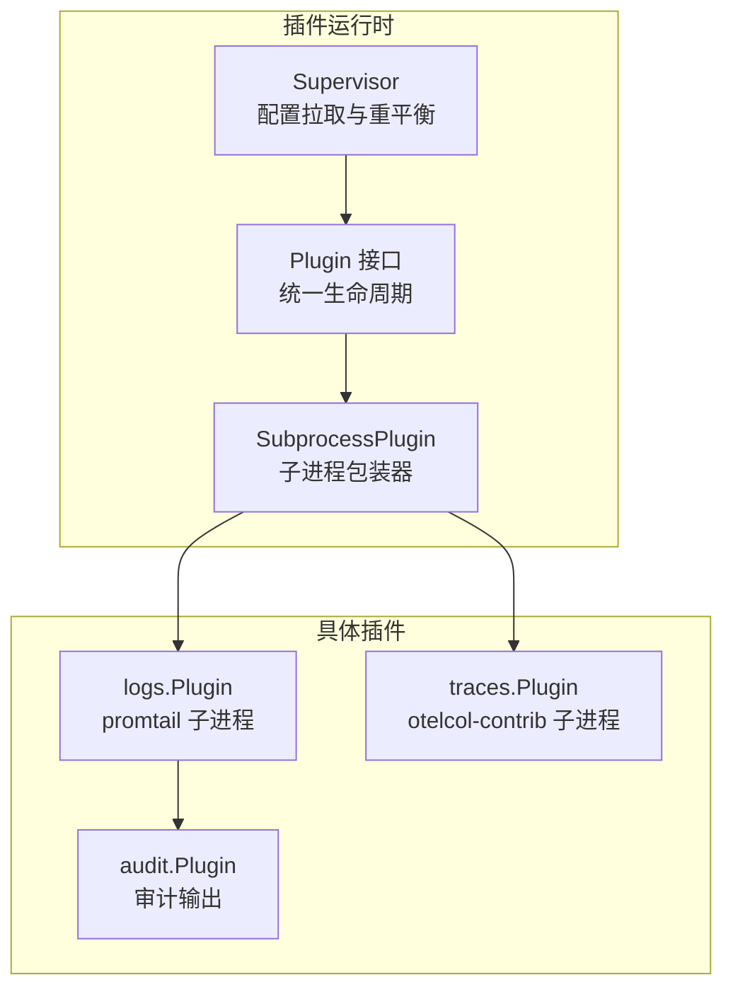
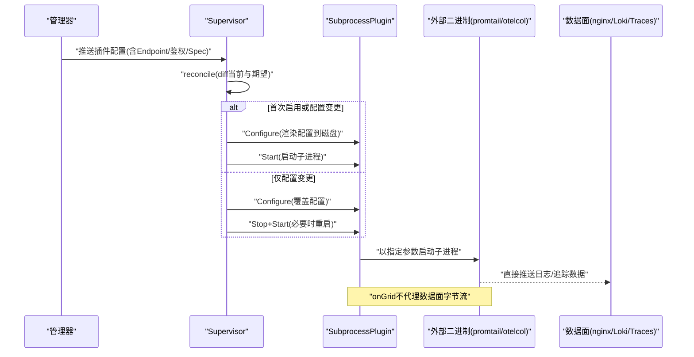
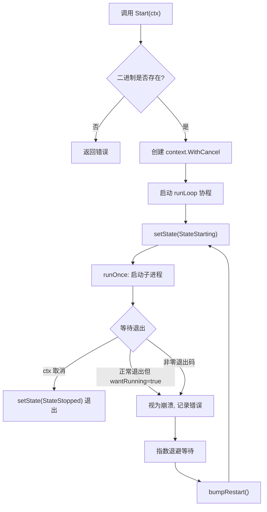
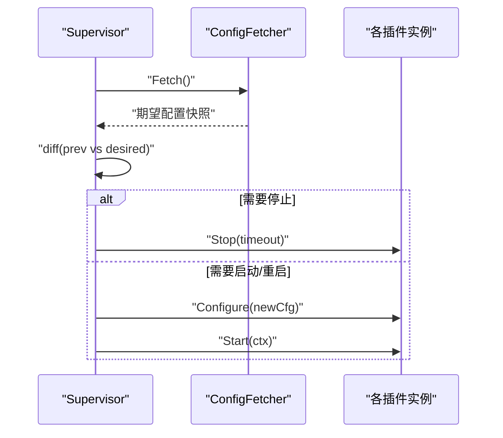
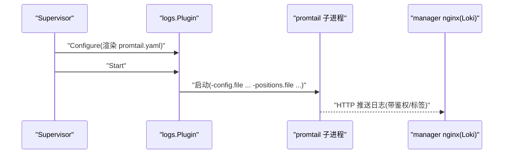
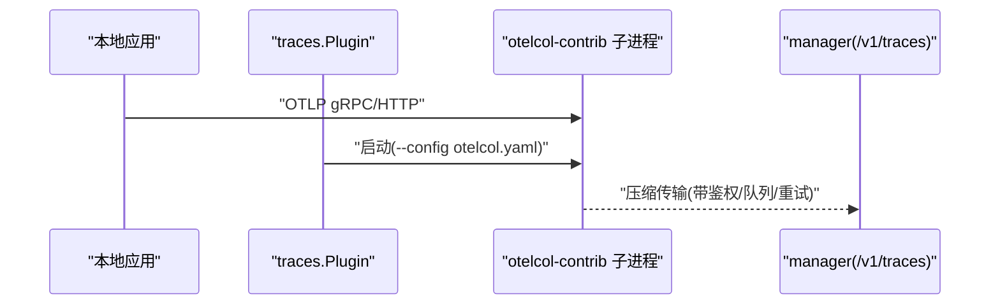
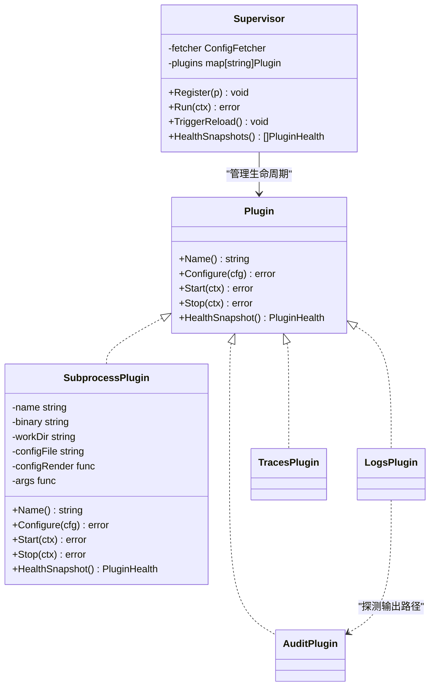

# 子进程插件实现

<cite>
**本文引用的文件**   
- [internal/edgeagent/plugins/plugin.go](file://internal/edgeagent/plugins/plugin.go)
- [internal/edgeagent/plugins/subprocess.go](file://internal/edgeagent/plugins/subprocess.go)
- [internal/edgeagent/plugins/supervisor.go](file://internal/edgeagent/plugins/supervisor.go)
- [internal/edgeagent/plugins/logs/plugin.go](file://internal/edgeagent/plugins/logs/plugin.go)
- [internal/edgeagent/plugins/logs/render.go](file://internal/edgeagent/plugins/logs/render.go)
- [internal/edgeagent/plugins/traces/plugin.go](file://internal/edgeagent/plugins/traces/plugin.go)
- [internal/edgeagent/plugins/traces/render.go](file://internal/edgeagent/plugins/traces/render.go)
- [internal/edgeagent/plugins/audit/plugin.go](file://internal/edgeagent/plugins/audit/plugin.go)
</cite>

## 目录
1. [简介](#简介)
2. [项目结构](#项目结构)
3. [核心组件](#核心组件)
4. [架构总览](#架构总览)
5. [详细组件分析](#详细组件分析)
6. [依赖关系分析](#依赖关系分析)
7. [性能与资源管理](#性能与资源管理)
8. [故障恢复与优雅关闭](#故障恢复与优雅关闭)
9. [开发模板与调试技巧](#开发模板与调试技巧)
10. [结论](#结论)

## 简介
本文件系统性梳理边缘端“子进程插件”机制，重点解释 SubprocessPlugin 如何封装外部二进制（如 promtail、otelcol-contrib）的生命周期、配置渲染、进程间通信、数据流管道、启动/监控/重启/优雅关闭流程，并结合日志采集与追踪采集两个具体插件给出端到端示例。同时总结子进程隔离的安全优势、资源管理与故障恢复机制，并提供可复用的开发模板、调试技巧与性能优化建议。

## 项目结构
与子进程插件相关的代码集中在 internal/edgeagent/plugins 目录下：
- 通用接口与状态定义：plugin.go
- 子进程包装器：subprocess.go
- 插件编排器：supervisor.go
- 日志采集插件（promtail）：logs/plugin.go、logs/render.go
- 追踪采集插件（otelcol-contrib）：traces/plugin.go、traces/render.go
- 审计插件（为日志自动发现输出路径提供能力）：audit/plugin.go

图表来源
- [internal/edgeagent/plugins/plugin.go:18-52](file://internal/edgeagent/plugins/plugin.go#L18-L52)
- [internal/edgeagent/plugins/subprocess.go:32-50](file://internal/edgeagent/plugins/subprocess.go#L32-L50)
- [internal/edgeagent/plugins/supervisor.go:36-47](file://internal/edgeagent/plugins/supervisor.go#L36-L47)
- [internal/edgeagent/plugins/logs/plugin.go:27-53](file://internal/edgeagent/plugins/logs/plugin.go#L27-L53)
- [internal/edgeagent/plugins/traces/plugin.go:31-47](file://internal/edgeagent/plugins/traces/plugin.go#L31-L47)
- [internal/edgeagent/plugins/audit/plugin.go:50-83](file://internal/edgeagent/plugins/audit/plugin.go#L50-L83)

章节来源
- [internal/edgeagent/plugins/plugin.go:1-119](file://internal/edgeagent/plugins/plugin.go#L1-L119)
- [internal/edgeagent/plugins/subprocess.go:1-318](file://internal/edgeagent/plugins/subprocess.go#L1-L318)
- [internal/edgeagent/plugins/supervisor.go:1-276](file://internal/edgeagent/plugins/supervisor.go#L1-L276)
- [internal/edgeagent/plugins/logs/plugin.go:1-54](file://internal/edgeagent/plugins/logs/plugin.go#L1-L54)
- [internal/edgeagent/plugins/traces/plugin.go:1-48](file://internal/edgeagent/plugins/traces/plugin.go#L1-L48)
- [internal/edgeagent/plugins/audit/plugin.go:50-83](file://internal/edgeagent/plugins/audit/plugin.go#L50-L83)

## 核心组件
- Plugin 接口：统一描述每个插件的 Name、Configure、Start、Stop、HealthSnapshot 生命周期方法，屏蔽 in-process 与 subprocess 的差异。
- SubprocessPlugin：将任意外部二进制（promtail、otelcol-contrib 等）作为子进程运行，负责：
  - 工作目录与配置文件写入
  - 命令行参数构建
  - 标准输出/错误捕获到本地日志文件
  - 优雅关闭（SIGTERM + WaitDelay）
  - 崩溃指数退避重启
  - 健康状态与健康快照上报
- Supervisor：从 ConfigFetcher 周期性拉取或响应信号触发拉取，对已注册插件进行 diff 并执行 Configure/Start/Stop，保证期望态与实际态一致。

章节来源
- [internal/edgeagent/plugins/plugin.go:18-52](file://internal/edgeagent/plugins/plugin.go#L18-L52)
- [internal/edgeagent/plugins/subprocess.go:17-102](file://internal/edgeagent/plugins/subprocess.go#L17-L102)
- [internal/edgeagent/plugins/supervisor.go:12-73](file://internal/edgeagent/plugins/supervisor.go#L12-L73)

## 架构总览
下图展示从管理器下发配置到子进程运行的完整链路，以及数据面（日志/追踪）不经过 ongrid-edge 的直连模式。

图表来源
- [internal/edgeagent/plugins/supervisor.go:135-230](file://internal/edgeagent/plugins/supervisor.go#L135-L230)
- [internal/edgeagent/plugins/subprocess.go:135-183](file://internal/edgeagent/plugins/subprocess.go#L135-L183)
- [internal/edgeagent/plugins/logs/plugin.go:27-53](file://internal/edgeagent/plugins/logs/plugin.go#L27-L53)
- [internal/edgeagent/plugins/traces/plugin.go:31-47](file://internal/edgeagent/plugins/traces/plugin.go#L31-L47)

## 详细组件分析

### SubprocessPlugin 工作原理
- 配置渲染与持久化
  - Configure 会创建 workDir，若提供 ConfigRender 则将渲染结果写入 configFile（默认 workDir/<name>.yaml），并将当前 PluginConfig 缓存。
- 启动与运行
  - Start 校验二进制存在后，进入 runLoop；runOnce 使用 exec.CommandContext 启动子进程，设置 Dir=workDir，将 stdout/stderr 重定向到 <workDir>/<name>.log。
  - 优雅关闭：context 取消时发送 SIGTERM，WaitDelay 超时后回退 SIGKILL。
- 崩溃与重启
  - 当子进程退出码非零或意外退出，runLoop 记录 StateCrashed，按指数退避（1s→2s→…上限5min）重启，RestartCount 单调递增。
- 健康状态
  - HealthSnapshot 返回最近一次状态、PID、StartedAt、LastError、RestartCount 等，供心跳上报。

图表来源
- [internal/edgeagent/plugins/subprocess.go:135-183](file://internal/edgeagent/plugins/subprocess.go#L135-L183)
- [internal/edgeagent/plugins/subprocess.go:194-235](file://internal/edgeagent/plugins/subprocess.go#L194-L235)
- [internal/edgeagent/plugins/subprocess.go:237-287](file://internal/edgeagent/plugins/subprocess.go#L237-L287)
- [internal/edgeagent/plugins/subprocess.go:289-311](file://internal/edgeagent/plugins/subprocess.go#L289-L311)

章节来源
- [internal/edgeagent/plugins/subprocess.go:107-133](file://internal/edgeagent/plugins/subprocess.go#L107-L133)
- [internal/edgeagent/plugins/subprocess.go:135-183](file://internal/edgeagent/plugins/subprocess.go#L135-L183)
- [internal/edgeagent/plugins/subprocess.go:194-235](file://internal/edgeagent/plugins/subprocess.go#L194-L235)
- [internal/edgeagent/plugins/subprocess.go:237-287](file://internal/edgeagent/plugins/subprocess.go#L237-L287)
- [internal/edgeagent/plugins/subprocess.go:289-311](file://internal/edgeagent/plugins/subprocess.go#L289-L311)

### Supervisor 协调流程
- 配置来源：通过 ConfigFetcher.Fetch 获取 map[pluginName]PluginConfig。
- 重平衡策略：
  - 新增/启用：Configure → Start
  - 禁用：Stop
  - 配置变化：先 Configure，再根据是否首次运行或配置变化决定 Stop+Start
- 安全网：定时器周期拉取，避免长期未收到信号导致漂移。
- 优雅停机：Run 退出前对所有插件执行 Stop。

图表来源
- [internal/edgeagent/plugins/supervisor.go:135-230](file://internal/edgeagent/plugins/supervisor.go#L135-L230)
- [internal/edgeagent/plugins/supervisor.go:232-251](file://internal/edgeagent/plugins/supervisor.go#L232-L251)

章节来源
- [internal/edgeagent/plugins/supervisor.go:112-133](file://internal/edgeagent/plugins/supervisor.go#L112-L133)
- [internal/edgeagent/plugins/supervisor.go:135-230](file://internal/edgeagent/plugins/supervisor.go#L135-L230)
- [internal/edgeagent/plugins/supervisor.go:232-251](file://internal/edgeagent/plugins/supervisor.go#L232-L251)

### 日志采集插件（promtail）
- 插件构造
  - Binary 指向 promtail，WorkDir 位于 <state>/plugins/logs，配置文件名 promtail.yaml。
  - Args 追加 -positions.file 指向同目录下的 positions.yaml，确保位置信息不丢失。
- 配置渲染
  - 基于模板生成 clients（含 Endpoint、Basic/Bearer 鉴权、TLS 选项）、scrape_configs（journald 与 file_paths）。
  - 支持 extra_labels 注入 device_id 等标签。
  - 自动探测 audit 插件 JSONL 输出路径，将其加入 file_paths，无需人工配置。
- 数据流
  - promtail 直接推送至 manager nginx /loki/api/v1/push，onGrid 不代理日志字节流。

图表来源
- [internal/edgeagent/plugins/logs/plugin.go:27-53](file://internal/edgeagent/plugins/logs/plugin.go#L27-L53)
- [internal/edgeagent/plugins/logs/render.go:97-189](file://internal/edgeagent/plugins/logs/render.go#L97-L189)
- [internal/edgeagent/plugins/audit/plugin.go:76-83](file://internal/edgeagent/plugins/audit/plugin.go#L76-L83)

章节来源
- [internal/edgeagent/plugins/logs/plugin.go:1-54](file://internal/edgeagent/plugins/logs/plugin.go#L1-L54)
- [internal/edgeagent/plugins/logs/render.go:1-273](file://internal/edgeagent/plugins/logs/render.go#L1-L273)
- [internal/edgeagent/plugins/audit/plugin.go:76-83](file://internal/edgeagent/plugins/audit/plugin.go#L76-L83)

### 追踪采集插件（otelcol-contrib）
- 插件构造
  - Binary 指向 otelcol-contrib，WorkDir 位于 <state>/plugins/traces，配置文件名 otelcol.yaml。
  - Args 使用 --config=... 传入渲染后的配置。
- 配置渲染
  - receivers 绑定本地地址（docker bridge/localhost），exporter 指向 manager /v1/traces。
  - processors 注入 resource/device（device_id、ongrid_source）与 batch。
  - 支持 Basic/Bearer 鉴权头注入。
- 数据流
  - 应用通过 OTLP gRPC/HTTP 向本地 otelcol 发送追踪数据，子进程聚合后直推 manager，onGrid 不代理追踪字节流。

图表来源
- [internal/edgeagent/plugins/traces/plugin.go:31-47](file://internal/edgeagent/plugins/traces/plugin.go#L31-L47)
- [internal/edgeagent/plugins/traces/render.go:110-151](file://internal/edgeagent/plugins/traces/render.go#L110-L151)

章节来源
- [internal/edgeagent/plugins/traces/plugin.go:1-48](file://internal/edgeagent/plugins/traces/plugin.go#L1-L48)
- [internal/edgeagent/plugins/traces/render.go:1-189](file://internal/edgeagent/plugins/traces/render.go#L1-L189)

## 依赖关系分析
- 插件接口与实现解耦：Supervisor 只依赖 Plugin 接口，具体实现由 logs/traces/audit 等各自提供。
- 子进程包装器与具体插件解耦：SubprocessPlugin 仅关心二进制路径、配置渲染与参数构建，不感知业务细节。
- 日志与审计的单向耦合：logs 在渲染阶段探测 audit 的输出路径，便于自动 tail，而 audit 不反向依赖 logs。

图表来源
- [internal/edgeagent/plugins/plugin.go:18-52](file://internal/edgeagent/plugins/plugin.go#L18-L52)
- [internal/edgeagent/plugins/subprocess.go:32-50](file://internal/edgeagent/plugins/subprocess.go#L32-L50)
- [internal/edgeagent/plugins/supervisor.go:36-47](file://internal/edgeagent/plugins/supervisor.go#L36-L47)
- [internal/edgeagent/plugins/logs/plugin.go:27-53](file://internal/edgeagent/plugins/logs/plugin.go#L27-L53)
- [internal/edgeagent/plugins/traces/plugin.go:31-47](file://internal/edgeagent/plugins/traces/plugin.go#L31-L47)
- [internal/edgeagent/plugins/audit/plugin.go:50-83](file://internal/edgeagent/plugins/audit/plugin.go#L50-L83)

章节来源
- [internal/edgeagent/plugins/plugin.go:1-119](file://internal/edgeagent/plugins/plugin.go#L1-L119)
- [internal/edgeagent/plugins/subprocess.go:1-318](file://internal/edgeagent/plugins/subprocess.go#L1-L318)
- [internal/edgeagent/plugins/supervisor.go:1-276](file://internal/edgeagent/plugins/supervisor.go#L1-L276)
- [internal/edgeagent/plugins/logs/plugin.go:1-54](file://internal/edgeagent/plugins/logs/plugin.go#L1-L54)
- [internal/edgeagent/plugins/traces/plugin.go:1-48](file://internal/edgeagent/plugins/traces/plugin.go#L1-L48)
- [internal/edgeagent/plugins/audit/plugin.go:50-83](file://internal/edgeagent/plugins/audit/plugin.go#L50-L83)

## 性能与资源管理
- 子进程隔离
  - 外部二进制在独立进程中运行，内存/CPU 泄漏不会直接影响 ongrid-edge 主进程稳定性。
  - 通过 systemd ProtectSystem=strict 与 ReadWritePaths= 限制子进程写权限，降低越权风险。
- 配置与状态落盘
  - 配置文件与 positions.yaml 置于 workDir，重启不丢位点，减少重复扫描开销。
- 网络与批处理
  - promtail 客户端内置 backoff/batchsize/batchwait，降低网络抖动影响。
  - otelcol 启用 sending_queue 与 retry_on_failure，提升吞吐与容错。
- 资源边界
  - 子进程工作目录受系统服务沙箱约束，避免污染宿主文件系统。
  - 子进程日志单独落盘，避免阻塞主进程 IO。

[本节为通用指导，不直接分析具体文件]

## 故障恢复与优雅关闭
- 优雅关闭
  - Stop 触发 cancel，子进程收到 SIGTERM，WaitDelay 超时后回退 SIGKILL，避免僵尸进程。
- 崩溃恢复
  - 非零退出或意外退出均视为崩溃，指数退避重启，最大间隔上限保护系统。
- 配置漂移防护
  - Supervisor 定时轮询，即使错过 reload 信号也能收敛到期望态。
- 健康上报
  - HealthSnapshot 包含 PID、StartedAt、LastError、RestartCount，便于上层观测与告警。

章节来源
- [internal/edgeagent/plugins/subprocess.go:158-183](file://internal/edgeagent/plugins/subprocess.go#L158-L183)
- [internal/edgeagent/plugins/subprocess.go:194-235](file://internal/edgeagent/plugins/subprocess.go#L194-L235)
- [internal/edgeagent/plugins/subprocess.go:237-287](file://internal/edgeagent/plugins/subprocess.go#L237-L287)
- [internal/edgeagent/plugins/supervisor.go:112-133](file://internal/edgeagent/plugins/supervisor.go#L112-L133)
- [internal/edgeagent/plugins/supervisor.go:232-251](file://internal/edgeagent/plugins/supervisor.go#L232-L251)

## 开发模板与调试技巧

### 子进程插件开发模板
- 新建插件包
  - 定义常量 Name（遵循 OpenTelemetry 信号命名，如 logs/traces/profiles）。
  - 实现 New(binDir, workDir, log) 返回 plugins.Plugin，内部调用 plugins.NewSubprocess(SubprocessOpts{...})。
  - 填写 Binary、WorkDir、ConfigFile、ConfigRender、Args、Log。
- 配置渲染
  - 在 render 中校验必要字段（Endpoint、EdgeID 等），从 cfg.Spec 解析可选开关，组装模板数据。
  - 如需与其他插件协作（如 logs 自动 tail audit 输出），在渲染阶段做 best-effort 探测。
- 命令行参数
  - Args 接收当前 cfg 与配置文件路径，按需拼接 flags（如 -config.file、-positions.file）。
- 注册与运行
  - 在 main 中构造插件并 Register 到 Supervisor，随后启动 Supervisor.Run。

章节来源
- [internal/edgeagent/plugins/logs/plugin.go:27-53](file://internal/edgeagent/plugins/logs/plugin.go#L27-L53)
- [internal/edgeagent/plugins/traces/plugin.go:31-47](file://internal/edgeagent/plugins/traces/plugin.go#L31-L47)
- [internal/edgeagent/plugins/subprocess.go:55-102](file://internal/edgeagent/plugins/subprocess.go#L55-L102)

### 调试技巧
- 查看子进程日志
  - 定位 <workDir>/<name>.log，观察启动参数、错误堆栈与网络异常。
- 检查渲染配置
  - 打开 <workDir>/<name>.yaml，确认 Endpoint、鉴权、labels/attributes 是否正确注入。
- 验证数据面连通性
  - 在 manager 侧 nginx 或后端服务查看请求日志，确认鉴权与标签。
- 模拟崩溃与重启
  - 临时修改二进制权限或破坏配置文件，观察指数退避与 RestartCount 增长。
- 健康快照
  - 通过 Supervisor.HealthSnapshots 获取各插件状态，辅助快速定位问题。

章节来源
- [internal/edgeagent/plugins/subprocess.go:237-287](file://internal/edgeagent/plugins/subprocess.go#L237-L287)
- [internal/edgeagent/plugins/supervisor.go:94-110](file://internal/edgeagent/plugins/supervisor.go#L94-L110)

### 性能优化建议
- 合理设置批大小与超时
  - promtail 的 batchsize/batchwait 与 otelcol 的 send_batch_size/timeout 需结合带宽与延迟调优。
- 控制标签基数
  - 谨慎添加高基数字段到 labels/attributes，避免下游查询与存储压力。
- 限流与降级
  - 利用 exporter 的 sending_queue/retry_on_failure 缓冲突发流量，配合 backoff 避免雪崩。
- 最小化渲染开销
  - 模板尽量简单稳定，避免每次 reconcile 产生大量差异导致频繁重启。

[本节为通用指导，不直接分析具体文件]

## 结论
子进程插件机制通过统一的 Plugin 接口与 SubprocessPlugin 包装器，将外部二进制纳入同一生命周期与治理体系。Supervisor 负责配置拉取与重平衡，确保期望态与实际态一致。日志与追踪插件分别以 promtail 与 otelcol-contrib 为载体，采用“子进程直推数据面”的模式，既保证了性能与安全隔离，又简化了主进程复杂度。配合完善的崩溃恢复、优雅关闭与健康上报，该方案具备良好的可维护性与可扩展性，适合持续扩展更多采集能力。