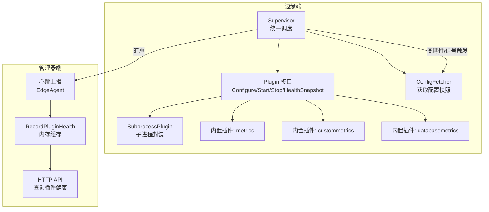
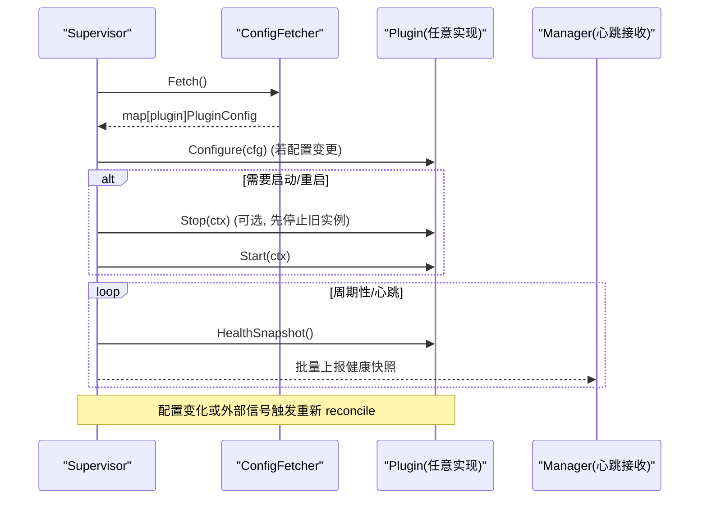
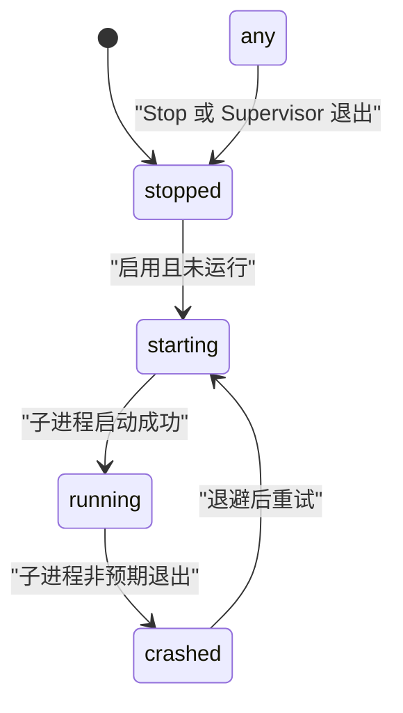
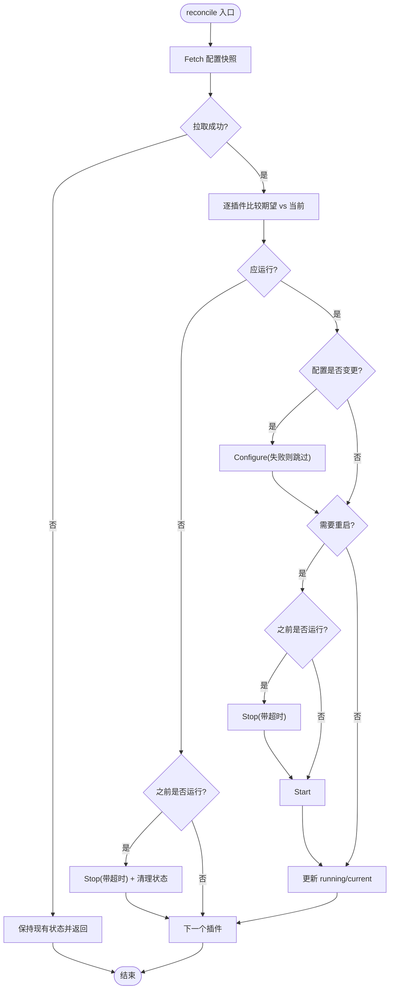
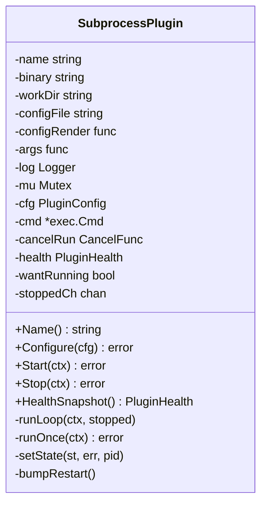
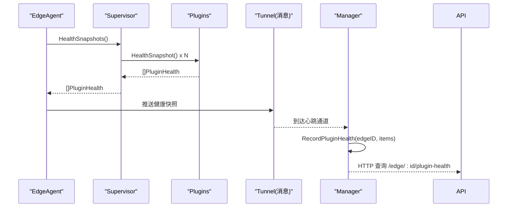
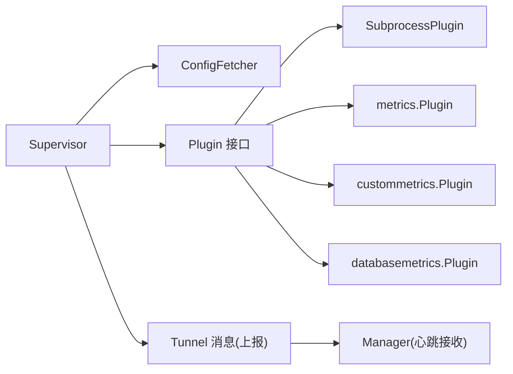

# 插件生命周期管理

<cite>
**本文引用的文件**   
- [supervisor.go](file://internal/edgeagent/plugins/supervisor.go)
- [plugin.go](file://internal/edgeagent/plugins/plugin.go)
- [subprocess.go](file://internal/edgeagent/plugins/subprocess.go)
- [metrics/plugin.go](file://internal/edgeagent/plugins/metrics/plugin.go)
- [custommetrics/plugin.go](file://internal/edgeagent/plugins/custommetrics/plugin.go)
- [databasemetrics/plugin.go](file://internal/edgeagent/plugins/databasemetrics/plugin.go)
- [messages.go](file://internal/pkg/tunnel/messages.go)
- [plugin_health.go](file://internal/manager/biz/edge/plugin_health.go)
- [http.go](file://internal/manager/server/edge/http.go)
- [main.go](file://cmd/ongrid-edge/main.go)
</cite>

## 目录
1. [简介](#简介)
2. [项目结构](#项目结构)
3. [核心组件](#核心组件)
4. [架构总览](#架构总览)
5. [详细组件分析](#详细组件分析)
6. [依赖关系分析](#依赖关系分析)
7. [性能与可靠性考量](#性能与可靠性考量)
8. [故障排查指南](#故障排查指南)
9. [结论](#结论)

## 简介
本文件系统性阐述边缘端插件的生命周期管理机制，聚焦 Supervisor 如何统一管理所有插件的完整生命周期：Configure→Start→(HealthSnapshot)*→Stop。文档覆盖状态机设计（stopped、starting、running、crashed）、健康检查机制、自动重启策略与错误恢复流程，并说明配置热重载、动态启停与监控指标上报的实现细节，以及事件处理模式与异常处理策略。

## 项目结构
与插件生命周期相关的核心代码位于 edgeagent 的 plugins 包中，包含统一调度器（Supervisor）、插件接口定义、子进程封装以及若干内置插件实现；同时涉及 manager 侧对健康快照的接收与展示。

图表来源
- [supervisor.go:112-133](file://internal/edgeagent/plugins/supervisor.go#L112-L133)
- [plugin.go:18-52](file://internal/edgeagent/plugins/plugin.go#L18-L52)
- [subprocess.go:17-50](file://internal/edgeagent/plugins/subprocess.go#L17-L50)
- [plugin_health.go:1-21](file://internal/manager/biz/edge/plugin_health.go#L1-L21)
- [http.go:51-51](file://internal/manager/server/edge/http.go#L51-L51)

章节来源
- [supervisor.go:1-110](file://internal/edgeagent/plugins/supervisor.go#L1-L110)
- [plugin.go:1-119](file://internal/edgeagent/plugins/plugin.go#L1-L119)
- [subprocess.go:1-110](file://internal/edgeagent/plugins/subprocess.go#L1-L110)
- [plugin_health.go:1-70](file://internal/manager/biz/edge/plugin_health.go#L1-L70)
- [http.go:51-51](file://internal/manager/server/edge/http.go#L51-L51)

## 核心组件
- Plugin 接口：定义统一的 Configure、Start、Stop、HealthSnapshot 方法，作为 Supervisor 调用的最小契约。
- Supervisor：负责从 ConfigFetcher 拉取配置快照，按“期望 vs 当前”差异执行 Configure/Start/Stop，并聚合各插件 HealthSnapshot。
- SubprocessPlugin：为外部二进制（如 promtail、otelcol）提供统一包装，包括配置渲染、进程启动、优雅退出、崩溃指数退避重启与健康状态维护。
- 内置插件：metrics、custommetrics、databasemetrics 等基于上述接口实现具体能力。
- Manager 侧：通过心跳消息接收 Edge 端插件健康快照，并在内存中缓存供 HTTP API 查询。

章节来源
- [plugin.go:18-52](file://internal/edgeagent/plugins/plugin.go#L18-L52)
- [supervisor.go:36-110](file://internal/edgeagent/plugins/supervisor.go#L36-L110)
- [subprocess.go:32-102](file://internal/edgeagent/plugins/subprocess.go#L32-L102)
- [metrics/plugin.go:65-80](file://internal/edgeagent/plugins/metrics/plugin.go#L65-L80)
- [custommetrics/plugin.go:31-43](file://internal/edgeagent/plugins/custommetrics/plugin.go#L31-L43)
- [databasemetrics/plugin.go:37-51](file://internal/edgeagent/plugins/databasemetrics/plugin.go#L37-L51)
- [plugin_health.go:1-70](file://internal/manager/biz/edge/plugin_health.go#L1-L70)

## 架构总览
Supervisor 在独立协程中运行，周期性或收到外部信号时拉取配置快照，计算每个插件的“期望状态”，并与“当前状态”对比，驱动 Configure/Start/Stop 调用。插件自身维护健康快照，Supervisor 定期收集并上报给管理器。

图表来源
- [supervisor.go:112-133](file://internal/edgeagent/plugins/supervisor.go#L112-L133)
- [supervisor.go:135-230](file://internal/edgeagent/plugins/supervisor.go#L135-L230)
- [plugin.go:18-52](file://internal/edgeagent/plugins/plugin.go#L18-L52)
- [messages.go:292-306](file://internal/pkg/tunnel/messages.go#L292-L306)

## 详细组件分析

### 插件状态机设计
- 状态集合：stopped、starting、running、crashed
- 触发条件与转换规则：
  - stopped → starting：当插件被启用且尚未运行，进入 Start 前标记为 starting（子进程封装在 runLoop 中设置）。
  - starting → running：子进程成功启动后更新为 running，记录 PID 与 StartedAt。
  - running → crashed：子进程非预期退出（含正常退出但仍在运行期），记录 LastError 并进入崩溃态。
  - crashed → starting：指数退避后尝试重启，再次进入 starting。
  - any → stopped：显式 Stop 或 Supervisor 关闭时，置为 stopped。
- 注意：Supervisor 不直接修改插件内部状态，而是由插件实现（尤其是 SubprocessPlugin）在关键路径上更新健康快照。

图表来源
- [plugin.go:71-79](file://internal/edgeagent/plugins/plugin.go#L71-L79)
- [subprocess.go:194-235](file://internal/edgeagent/plugins/subprocess.go#L194-L235)
- [subprocess.go:289-311](file://internal/edgeagent/plugins/subprocess.go#L289-L311)

章节来源
- [plugin.go:71-93](file://internal/edgeagent/plugins/plugin.go#L71-L93)
- [subprocess.go:194-235](file://internal/edgeagent/plugins/subprocess.go#L194-L235)
- [subprocess.go:289-311](file://internal/edgeagent/plugins/subprocess.go#L289-L311)

### Supervisor 协调流程
- 初始化：注册插件、读取初始配置快照并应用。
- 主循环：监听 ctx.Done、reloadSignal、定时器 tick，三者任一触发均执行 reconcile。
- reconcile 逻辑：
  - 拉取期望配置快照；失败则保持现有状态。
  - 对每个插件比较“是否应运行”和“配置是否变更”。
  - 若需停止：带超时调用 Stop，清理 current/running 状态。
  - 若需启动/重启：必要时先 Stop，再 Start，成功后更新 running/current。
  - 配置变更：先调用 Configure，失败则跳过后续启动。
- 关闭：遍历已注册插件，带超时 Stop，确保资源释放。

图表来源
- [supervisor.go:135-230](file://internal/edgeagent/plugins/supervisor.go#L135-L230)
- [supervisor.go:232-251](file://internal/edgeagent/plugins/supervisor.go#L232-L251)

章节来源
- [supervisor.go:112-133](file://internal/edgeagent/plugins/supervisor.go#L112-L133)
- [supervisor.go:135-230](file://internal/edgeagent/plugins/supervisor.go#L135-L230)
- [supervisor.go:232-251](file://internal/edgeagent/plugins/supervisor.go#L232-L251)

### 子进程插件封装（SubprocessPlugin）
- 职责：
  - 渲染配置文件到磁盘（可选）。
  - 启动子进程，绑定工作目录、日志文件、参数构建。
  - 优雅退出：Cancel 发送 SIGTERM，WaitDelay 回退 SIGKILL。
  - 崩溃恢复：runLoop 内指数退避重启，限制最大退避时间。
  - 健康快照：维护 State、LastError、PID、StartedAt、RestartCount。
- 关键行为：
  - Start 幂等：已在运行则直接返回。
  - Stop 安全：可重复调用，等待 runLoop 退出或超时。
  - runOnce：捕获 stdout/stderr 到本地日志文件，区分上下文取消与非零退出码。
  - setState：根据状态清理 LastError/PID 等字段。
  - bumpRestart：每次崩溃重启计数递增。

图表来源
- [subprocess.go:32-102](file://internal/edgeagent/plugins/subprocess.go#L32-L102)
- [subprocess.go:104-192](file://internal/edgeagent/plugins/subprocess.go#L104-L192)
- [subprocess.go:194-311](file://internal/edgeagent/plugins/subprocess.go#L194-L311)

章节来源
- [subprocess.go:104-192](file://internal/edgeagent/plugins/subprocess.go#L104-L192)
- [subprocess.go:194-311](file://internal/edgeagent/plugins/subprocess.go#L194-L311)

### 内置插件示例（metrics、custommetrics、databasemetrics）
- 共同点：
  - 遵循 Plugin 接口，维护内部 health 与目标级 TargetHealth。
  - 在运行/停止/崩溃路径更新状态与错误信息。
- 差异点：
  - metrics：单目标采集，维护 scrape/failure 计数。
  - custommetrics/databasemetrics：多目标采集，维护 targets 映射，支持 per-target 健康。

章节来源
- [metrics/plugin.go:65-80](file://internal/edgeagent/plugins/metrics/plugin.go#L65-L80)
- [custommetrics/plugin.go:31-43](file://internal/edgeagent/plugins/custommetrics/plugin.go#L31-L43)
- [databasemetrics/plugin.go:37-51](file://internal/edgeagent/plugins/databasemetrics/plugin.go#L37-L51)

### 健康检查与上报
- 边缘端：
  - 插件实现 HealthSnapshot 返回当前健康快照。
  - Supervisor 聚合所有插件快照，排序后返回。
  - EdgeAgent 在主进程中将健康快照打包并通过隧道消息上报。
- 管理器端：
  - 心跳接收后写入内存缓存，附带 ReportedAt。
  - HTTP API 暴露查询接口，供前端展示。

图表来源
- [supervisor.go:94-110](file://internal/edgeagent/plugins/supervisor.go#L94-L110)
- [messages.go:292-306](file://internal/pkg/tunnel/messages.go#L292-L306)
- [plugin_health.go:36-70](file://internal/manager/biz/edge/plugin_health.go#L36-L70)
- [http.go:51-51](file://internal/manager/server/edge/http.go#L51-L51)
- [main.go:283-283](file://cmd/ongrid-edge/main.go#L283-L283)

章节来源
- [supervisor.go:94-110](file://internal/edgeagent/plugins/supervisor.go#L94-L110)
- [messages.go:292-306](file://internal/pkg/tunnel/messages.go#L292-L306)
- [plugin_health.go:36-70](file://internal/manager/biz/edge/plugin_health.go#L36-L70)
- [http.go:51-51](file://internal/manager/server/edge/http.go#L51-L51)
- [main.go:283-283](file://cmd/ongrid-edge/main.go#L283-L283)

### 配置热重载与动态启停
- 热重载触发：
  - 外部信号：TriggerReload 注入 reloadSignal，Supervisor 立即拉取新配置。
  - 安全网轮询：默认 60s 定时器，防止信号丢失导致状态漂移。
- 重载策略：
  - 仅当配置语义相等性检测发现变更时才调用 Configure。
  - 若插件处于运行态且配置变更，先 Stop 再 Start（部分子进程可通过 SIGHUP 热加载，但通用策略仍为 stop+start）。
- 动态启停：
  - 禁用插件：Supervisor 调用 Stop 并清理状态。
  - 启用插件：Supervisor 调用 Configure 与 Start。

章节来源
- [supervisor.go:84-92](file://internal/edgeagent/plugins/supervisor.go#L84-L92)
- [supervisor.go:112-133](file://internal/edgeagent/plugins/supervisor.go#L112-L133)
- [supervisor.go:135-230](file://internal/edgeagent/plugins/supervisor.go#L135-L230)
- [supervisor.go:253-275](file://internal/edgeagent/plugins/supervisor.go#L253-L275)

### 自动重启策略与错误恢复
- 子进程崩溃：
  - runLoop 检测到非预期退出，置状态为 crashed，记录 LastError。
  - 指数退避重启：1s → 2s → 4s … 上限 5min。
  - RestartCount 单调递增，仅在从禁用到重新启用时重置。
- 优雅退出：
  - Stop 时 cancel 上下文，子进程收到 SIGTERM，WaitDelay 后强制终止。
  - 子进程日志输出到本地文件，便于定位问题。

章节来源
- [subprocess.go:194-235](file://internal/edgeagent/plugins/subprocess.go#L194-L235)
- [subprocess.go:237-287](file://internal/edgeagent/plugins/subprocess.go#L237-L287)
- [subprocess.go:289-311](file://internal/edgeagent/plugins/subprocess.go#L289-L311)

### 插件生命周期事件处理模式
- 事件源：
  - 配置变更（Fetch 成功）
  - 外部信号（TriggerReload）
  - 定时器（安全网轮询）
  - 子进程退出（崩溃）
- 处理模式：
  - 幂等：Start/Stop 必须幂等，避免重复操作。
  - 隔离：单个插件失败不影响其他插件。
  - 容错：Fetch 失败保持现有状态，不主动停止。
  - 可观测：健康快照包含 State、LastError、RestartCount、PID、StartedAt、UpdatedAt。

章节来源
- [supervisor.go:135-230](file://internal/edgeagent/plugins/supervisor.go#L135-L230)
- [subprocess.go:194-235](file://internal/edgeagent/plugins/subprocess.go#L194-L235)
- [plugin.go:84-93](file://internal/edgeagent/plugins/plugin.go#L84-L93)

## 依赖关系分析
- 组件耦合：
  - Supervisor 依赖 ConfigFetcher 获取配置，依赖 Plugin 接口进行生命周期控制。
  - SubprocessPlugin 依赖操作系统 exec 与文件系统，封装通用行为。
  - 内置插件依赖各自采集/推送逻辑，但统一通过 Plugin 接口暴露。
- 外部依赖：
  - 管理器侧通过心跳消息接收健康快照，使用内存缓存，HTTP API 暴露查询。
- 潜在环依赖：无直接循环导入；插件与 Supervisor 通过接口解耦。

图表来源
- [supervisor.go:36-47](file://internal/edgeagent/plugins/supervisor.go#L36-L47)
- [plugin.go:108-118](file://internal/edgeagent/plugins/plugin.go#L108-L118)
- [subprocess.go:32-50](file://internal/edgeagent/plugins/subprocess.go#L32-L50)
- [messages.go:292-306](file://internal/pkg/tunnel/messages.go#L292-L306)

章节来源
- [supervisor.go:36-47](file://internal/edgeagent/plugins/supervisor.go#L36-L47)
- [plugin.go:108-118](file://internal/edgeagent/plugins/plugin.go#L108-L118)
- [subprocess.go:32-50](file://internal/edgeagent/plugins/subprocess.go#L32-L50)
- [messages.go:292-306](file://internal/pkg/tunnel/messages.go#L292-L306)

## 性能与可靠性考量
- 并发与锁：
  - Supervisor 使用互斥锁保护插件注册表与运行时状态。
  - 子进程插件内部使用互斥锁保护健康状态与进程句柄。
- 超时与优雅退出：
  - Stop 带超时，避免阻塞 Supervisor 关闭。
  - 子进程 SIGTERM + WaitDelay 保证最终终止。
- 退避重启：
  - 指数退避降低瞬时风暴风险，上限 5min 避免无限等待。
- 配置比较：
  - 使用语义相等比较，减少不必要的重启。
- 健壮性：
  - Fetch 失败不改变现有状态，保障服务连续性。
  - 单插件失败不影响其他插件。

[本节为通用指导，无需特定文件引用]

## 故障排查指南
- 常见问题定位：
  - 子进程缺失：Start 返回“子进程二进制缺失”错误，需确认安装路径。
  - 配置渲染失败：Configure 返回渲染错误，检查 Spec 与模板。
  - 子进程崩溃：查看本地日志文件（workDir/<name>.log），关注退出码与堆栈。
  - 频繁重启：观察 RestartCount 与 LastError，判断是否为配置错误或外部依赖不可用。
- 建议步骤：
  - 检查 Supervisor 日志中的“stopping plugin”、“starting plugin”、“configure failed”、“start failed”等关键字。
  - 核对期望配置快照与当前配置差异，确认是否触发热重载。
  - 验证数据平面 Endpoint 与鉴权信息是否正确。
  - 在管理器端查看 ReportedAt 与 UpdatedAt，判断上报时效性。

章节来源
- [subprocess.go:137-156](file://internal/edgeagent/plugins/subprocess.go#L137-L156)
- [subprocess.go:237-287](file://internal/edgeagent/plugins/subprocess.go#L237-L287)
- [supervisor.go:135-230](file://internal/edgeagent/plugins/supervisor.go#L135-L230)
- [plugin_health.go:36-70](file://internal/manager/biz/edge/plugin_health.go#L36-L70)

## 结论
Supervisor 以统一接口抽象插件生命周期，结合配置热重载、指数退避重启与健康快照上报，实现了高可用、可观测的边缘插件管理能力。通过清晰的 state 机设计与幂等调用约定，系统在面对配置变更、子进程崩溃与网络抖动等异常场景时具备良好鲁棒性。建议在扩展新插件时严格遵循 Plugin 接口契约，完善健康快照与错误信息，以便快速定位与恢复问题。