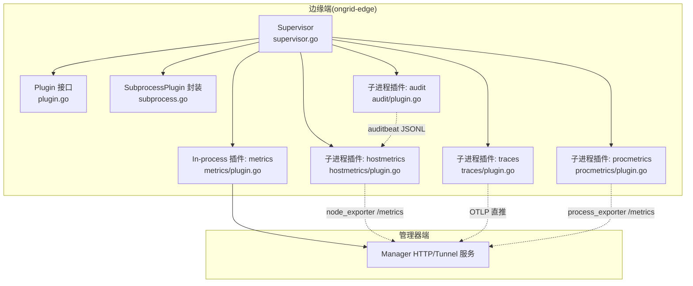
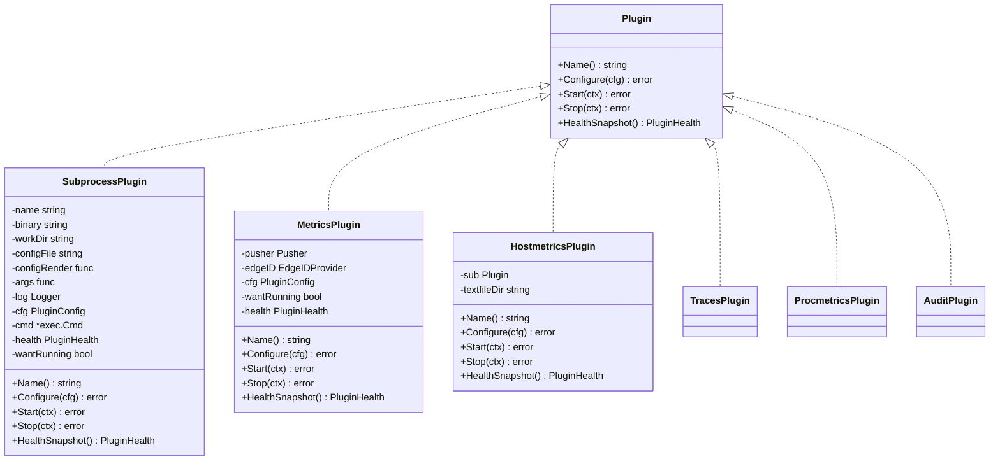
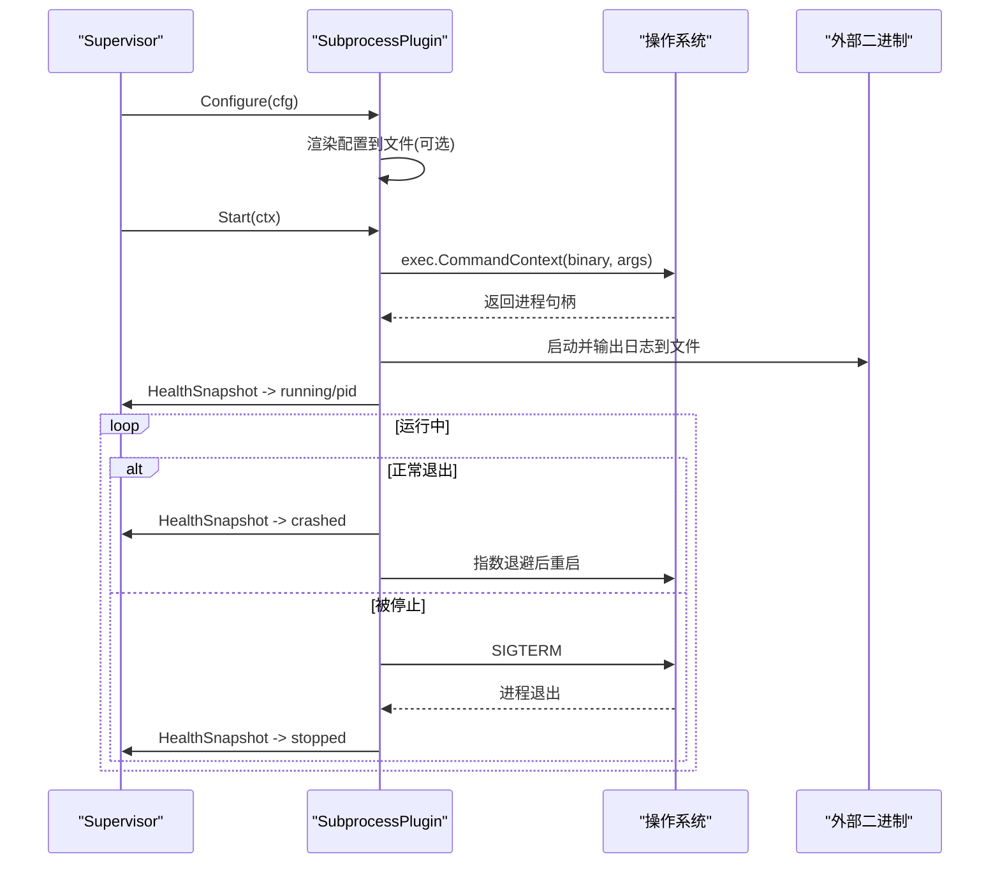
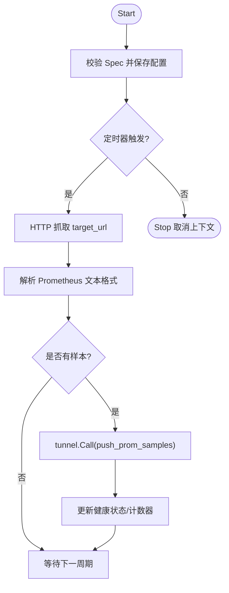
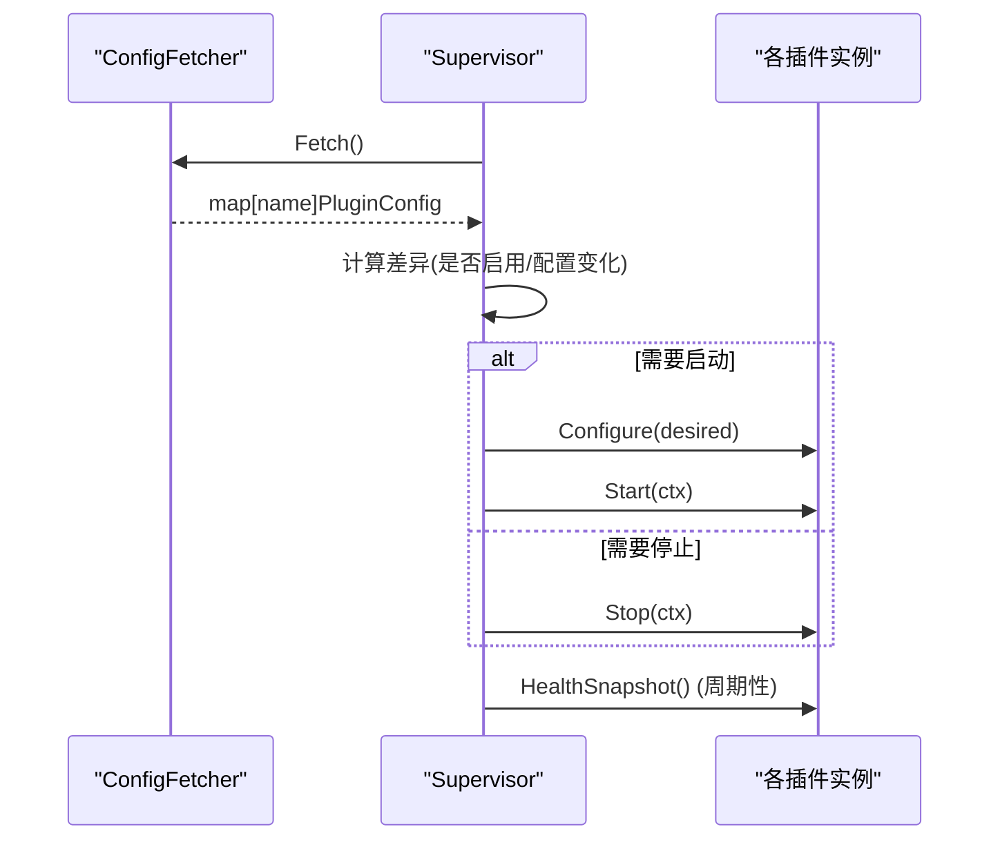
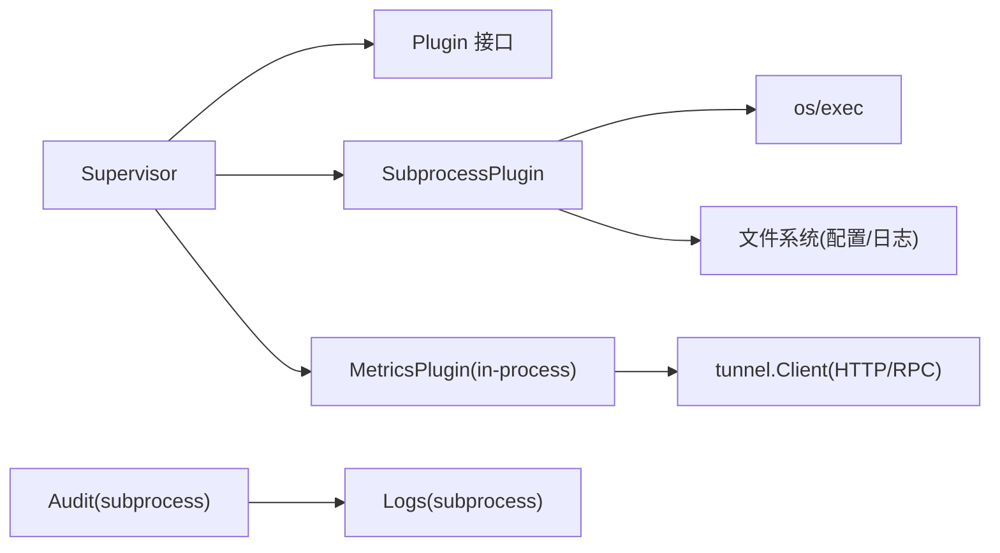
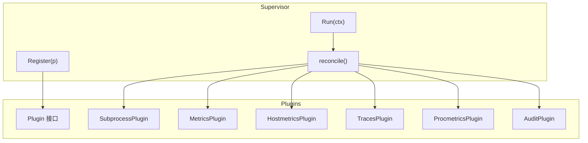

# 插件类型与实现

<cite>
**本文引用的文件列表**
- [internal/edgeagent/plugins/plugin.go](file://internal/edgeagent/plugins/plugin.go)
- [internal/edgeagent/plugins/subprocess.go](file://internal/edgeagent/plugins/subprocess.go)
- [internal/edgeagent/plugins/supervisor.go](file://internal/edgeagent/plugins/supervisor.go)
- [internal/edgeagent/plugins/metrics/plugin.go](file://internal/edgeagent/plugins/metrics/plugin.go)
- [internal/edgeagent/plugins/hostmetrics/plugin.go](file://internal/edgeagent/plugins/hostmetrics/plugin.go)
- [internal/edgeagent/plugins/traces/plugin.go](file://internal/edgeagent/plugins/traces/plugin.go)
- [internal/edgeagent/plugins/procmetrics/plugin.go](file://internal/edgeagent/plugins/procmetrics/plugin.go)
- [internal/edgeagent/plugins/audit/plugin.go](file://internal/edgeagent/plugins/audit/plugin.go)
- [internal/skill/types.go](file://internal/skill/types.go)
- [internal/skill/subprocess.go](file://internal/skill/subprocess.go)
</cite>

## 目录
1. [简介](#简介)
2. [项目结构](#项目结构)
3. [核心组件](#核心组件)
4. [架构总览](#架构总览)
5. [详细组件分析](#详细组件分析)
6. [依赖关系分析](#依赖关系分析)
7. [性能考量](#性能考量)
8. [故障排查指南](#故障排查指南)
9. [结论](#结论)
10. [附录：开发模板与最佳实践](#附录开发模板与最佳实践)

## 简介
本文件系统性梳理 OnGrid 的插件类型系统，重点覆盖两类插件：
- In-process Plugin（进程内插件）：在 ongrid-edge 进程内以 goroutine 运行，如 metrics 采集器。
- Subprocess Plugin（子进程插件）：通过子进程封装外部二进制（如 node_exporter、otelcol-contrib、promtail、auditbeat），由 Supervisor 统一生命周期管理。

文档将解释 Plugin 接口定义、方法签名与返回值规范；阐述 SubprocessPlugin 包装器的实现原理、进程间通信机制与资源隔离；提供架构图、对比表、代码示例路径、开发模板、调试技巧与性能优化建议。

## 项目结构
与插件体系相关的核心目录与文件：
- internal/edgeagent/plugins：边缘侧插件运行时与通用能力
  - plugin.go：Plugin 接口、配置与健康模型
  - subprocess.go：SubprocessPlugin 通用封装
  - supervisor.go：Supervisor 调度与重配循环
  - metrics/plugin.go：In-process 指标采集插件
  - hostmetrics/plugin.go：基于 node_exporter 的子进程插件（含 textfile 补充指标）
  - traces/plugin.go：基于 otelcol-contrib 的子进程插件
  - procmetrics/plugin.go：基于 process_exporter 的子进程插件
  - audit/plugin.go：基于 auditbeat 的子进程插件
- internal/skill：L2 设备侧“技能”框架（与插件不同层，但同样支持子进程执行）
  - types.go：Executor/Metadata/ParamSchema 等
  - subprocess.go：SubprocessSkill 子进程执行器

图表来源
- [internal/edgeagent/plugins/supervisor.go:1-276](file://internal/edgeagent/plugins/supervisor.go#L1-L276)
- [internal/edgeagent/plugins/plugin.go:1-119](file://internal/edgeagent/plugins/plugin.go#L1-L119)
- [internal/edgeagent/plugins/subprocess.go:1-318](file://internal/edgeagent/plugins/subprocess.go#L1-L318)
- [internal/edgeagent/plugins/metrics/plugin.go:1-306](file://internal/edgeagent/plugins/metrics/plugin.go#L1-L306)
- [internal/edgeagent/plugins/hostmetrics/plugin.go:1-277](file://internal/edgeagent/plugins/hostmetrics/plugin.go#L1-L277)
- [internal/edgeagent/plugins/traces/plugin.go:1-47](file://internal/edgeagent/plugins/traces/plugin.go#L1-L47)
- [internal/edgeagent/plugins/procmetrics/plugin.go:1-121](file://internal/edgeagent/plugins/procmetrics/plugin.go#L1-L121)
- [internal/edgeagent/plugins/audit/plugin.go:50-83](file://internal/edgeagent/plugins/audit/plugin.go#L50-L83)

章节来源
- [internal/edgeagent/plugins/supervisor.go:1-276](file://internal/edgeagent/plugins/supervisor.go#L1-L276)
- [internal/edgeagent/plugins/plugin.go:1-119](file://internal/edgeagent/plugins/plugin.go#L1-L119)

## 核心组件
- Plugin 接口：定义了所有插件的统一生命周期与状态上报契约。
- SubprocessPlugin：为任意外部二进制提供统一的启动、停止、崩溃重启、日志捕获与配置渲染。
- Supervisor：负责从配置源拉取快照、差异比对、按需 Configure/Start/Stop，并周期性健康巡检。
- In-process 插件（metrics）：直接在 ongrid-edge 中运行采集与推送逻辑。
- 子进程插件（hostmetrics、traces、procmetrics、audit）：通过 SubprocessPlugin 管理外部二进制。

章节来源
- [internal/edgeagent/plugins/plugin.go:18-52](file://internal/edgeagent/plugins/plugin.go#L18-L52)
- [internal/edgeagent/plugins/subprocess.go:17-50](file://internal/edgeagent/plugins/subprocess.go#L17-L50)
- [internal/edgeagent/plugins/supervisor.go:12-47](file://internal/edgeagent/plugins/supervisor.go#L12-L47)
- [internal/edgeagent/plugins/metrics/plugin.go:64-102](file://internal/edgeagent/plugins/metrics/plugin.go#L64-L102)

## 架构总览
OnGrid 插件体系采用“统一接口 + 多实现”的设计：Supervisor 作为编排者，对各类插件一视同仁；具体插件按自身特性选择 in-process 或子进程方式实现。

图表来源
- [internal/edgeagent/plugins/plugin.go:24-52](file://internal/edgeagent/plugins/plugin.go#L24-L52)
- [internal/edgeagent/plugins/subprocess.go:32-102](file://internal/edgeagent/plugins/subprocess.go#L32-L102)
- [internal/edgeagent/plugins/metrics/plugin.go:64-102](file://internal/edgeagent/plugins/metrics/plugin.go#L64-L102)
- [internal/edgeagent/plugins/hostmetrics/plugin.go:88-106](file://internal/edgeagent/plugins/hostmetrics/plugin.go#L88-L106)
- [internal/edgeagent/plugins/traces/plugin.go:31-47](file://internal/edgeagent/plugins/traces/plugin.go#L31-L47)
- [internal/edgeagent/plugins/procmetrics/plugin.go:32-42](file://internal/edgeagent/plugins/procmetrics/plugin.go#L32-L42)
- [internal/edgeagent/plugins/audit/plugin.go:54-73](file://internal/edgeagent/plugins/audit/plugin.go#L54-L73)

## 详细组件分析

### Plugin 接口与数据模型
- Name：返回 OTel 信号名（如 metrics/logs/traces），用于注册键与配置行标识。
- Configure：接收 manager 推送或本地回退的配置；可触发子进程重载或重新渲染配置文件；错误会令插件进入“crashed”可见状态。
- Start：幂等启动；子进程插件拉起子进程，in-process 插件启动 goroutine。
- Stop：优雅关闭；子进程发送 SIGTERM 并等待退出；in-process 取消上下文。
- HealthSnapshot：非阻塞返回当前健康信息（状态、错误、PID、时间戳、目标健康等）。

配置与状态
- PluginConfig：包含 enabled、edge_id、endpoint、auth_user/auth_pass、spec 等字段。
- PluginState：stopped/starting/running/crashed。
- PluginHealth：包含 name、state、last_error、restart_count、pid、started_at、updated_at、targets 等。

章节来源
- [internal/edgeagent/plugins/plugin.go:24-52](file://internal/edgeagent/plugins/plugin.go#L24-L52)
- [internal/edgeagent/plugins/plugin.go:54-106](file://internal/edgeagent/plugins/plugin.go#L54-L106)

### SubprocessPlugin 封装器
职责
- 渲染配置到磁盘（可选）；根据 spec 生成 CLI 参数。
- 启动子进程，绑定工作目录，捕获 stdout/stderr 到日志文件。
- 崩溃恢复：指数退避重启（1s→2s→…上限 5min），RestartCount 单调递增，仅在从禁用态重新启用时重置。
- 优雅停止：SIGTERM → WaitDelay 超时后 SIGKILL。

关键流程
- Configure：创建 workDir，写入渲染后的配置文件（若提供 ConfigRender），保存 cfg。
- Start：检查二进制存在，设置 wantRunning，启动 runLoop。
- runOnce：exec.CommandContext 启动，设置 Cancel=SIGTERM，WaitDelay=10s；记录 PID/StartedAt；处理退出码。
- runLoop：循环直到 ctx 取消或 wantRunning=false；失败则 backoff 重启。

图表来源
- [internal/edgeagent/plugins/subprocess.go:107-133](file://internal/edgeagent/plugins/subprocess.go#L107-L133)
- [internal/edgeagent/plugins/subprocess.go:137-156](file://internal/edgeagent/plugins/subprocess.go#L137-L156)
- [internal/edgeagent/plugins/subprocess.go:194-235](file://internal/edgeagent/plugins/subprocess.go#L194-L235)
- [internal/edgeagent/plugins/subprocess.go:239-287](file://internal/edgeagent/plugins/subprocess.go#L239-L287)

章节来源
- [internal/edgeagent/plugins/subprocess.go:17-50](file://internal/edgeagent/plugins/subprocess.go#L17-L50)
- [internal/edgeagent/plugins/subprocess.go:107-133](file://internal/edgeagent/plugins/subprocess.go#L107-L133)
- [internal/edgeagent/plugins/subprocess.go:137-156](file://internal/edgeagent/plugins/subprocess.go#L137-L156)
- [internal/edgeagent/plugins/subprocess.go:194-235](file://internal/edgeagent/plugins/subprocess.go#L194-L235)
- [internal/edgeagent/plugins/subprocess.go:239-287](file://internal/edgeagent/plugins/subprocess.go#L239-L287)

### In-process 插件：metrics
- 在 ongrid-edge 进程中运行，定时抓取本地 /metrics（默认 node_exporter），解析 Prometheus 文本格式，通过 tunnel RPC push_prom_samples 推送至管理器。
- 优势：复用隧道认证与 device_id 注入，无需暴露新的公网 remote_write 端口。
- 配置项：target_url、scrape_interval、scrape_timeout、tls_insecure、bearer_token、extra_labels 等。
- 健康：统计 scrape/failure 计数，错误信息写入 LastError。

图表来源
- [internal/edgeagent/plugins/metrics/plugin.go:109-121](file://internal/edgeagent/plugins/metrics/plugin.go#L109-L121)
- [internal/edgeagent/plugins/metrics/plugin.go:125-142](file://internal/edgeagent/plugins/metrics/plugin.go#L125-L142)
- [internal/edgeagent/plugins/metrics/plugin.go:184-208](file://internal/edgeagent/plugins/metrics/plugin.go#L184-L208)
- [internal/edgeagent/plugins/metrics/plugin.go:214-282](file://internal/edgeagent/plugins/metrics/plugin.go#L214-L282)

章节来源
- [internal/edgeagent/plugins/metrics/plugin.go:1-306](file://internal/edgeagent/plugins/metrics/plugin.go#L1-L306)

### 子进程插件示例
- hostmetrics：封装 node_exporter，无配置文件，全部通过 CLI 参数传递；同时内置一个 in-process 的 textfile 补充指标生产者，解决内核路径变更导致的 conntrack 指标缺失问题。
- traces：封装 otelcol-contrib，渲染 YAML 并通过 --config 启动，直接对外部应用开放 OTLP 接收并直推至管理器。
- procmetrics：封装 process_exporter，渲染 YAML 并通过 CLI 指定监听地址与配置路径。
- audit：封装 auditbeat，渲染 YAML 并传入严格权限参数，输出 JSONL 供 logs 插件消费。

章节来源
- [internal/edgeagent/plugins/hostmetrics/plugin.go:62-93](file://internal/edgeagent/plugins/hostmetrics/plugin.go#L62-L93)
- [internal/edgeagent/plugins/hostmetrics/plugin.go:150-231](file://internal/edgeagent/plugins/hostmetrics/plugin.go#L150-L231)
- [internal/edgeagent/plugins/traces/plugin.go:31-47](file://internal/edgeagent/plugins/traces/plugin.go#L31-L47)
- [internal/edgeagent/plugins/procmetrics/plugin.go:32-42](file://internal/edgeagent/plugins/procmetrics/plugin.go#L32-L42)
- [internal/edgeagent/plugins/audit/plugin.go:54-73](file://internal/edgeagent/plugins/audit/plugin.go#L54-L73)

### Supervisor 协调器
- 定期从 ConfigFetcher 拉取配置快照，计算 desired vs current 差异。
- 策略：
  - 新增启用：Configure + Start
  - 新增禁用：Stop
  - 配置变化：Configure（必要时 Stop+Start）
- 健康汇总：遍历已注册插件，收集 HealthSnapshot 并按名称排序返回。

图表来源
- [internal/edgeagent/plugins/supervisor.go:135-230](file://internal/edgeagent/plugins/supervisor.go#L135-L230)
- [internal/edgeagent/plugins/supervisor.go:94-110](file://internal/edgeagent/plugins/supervisor.go#L94-L110)

章节来源
- [internal/edgeagent/plugins/supervisor.go:12-47](file://internal/edgeagent/plugins/supervisor.go#L12-L47)
- [internal/edgeagent/plugins/supervisor.go:135-230](file://internal/edgeagent/plugins/supervisor.go#L135-L230)

### Skill 子进程执行器（参考）
虽然与 edge 插件不同层，但 skill 框架也提供了通用的子进程执行器，便于在管理器侧安全地执行外部脚本/二进制。
- 强制 ScopeManager，白名单目录加载，最小化环境变量透传。
- 输入：stdin 为 JSON 参数；输出：stdout 为 JSON 结果。
- 限制：最大 stdout 字节数、stderr 尾部保留、超时控制。

章节来源
- [internal/skill/types.go:190-203](file://internal/skill/types.go#L190-L203)
- [internal/skill/subprocess.go:30-78](file://internal/skill/subprocess.go#L30-L78)
- [internal/skill/subprocess.go:112-172](file://internal/skill/subprocess.go#L112-L172)

## 依赖关系分析
- Supervisor 依赖 ConfigFetcher 获取配置，依赖 Plugin 抽象进行统一编排。
- SubprocessPlugin 依赖 os/exec 与文件系统，不感知业务协议。
- In-process 插件依赖网络客户端（如 tunnel.Client）与本地 HTTP 抓取。
- 子进程插件之间可能存在协作（如 audit 输出 JSONL 供 logs 插件 tail）。

图表来源
- [internal/edgeagent/plugins/supervisor.go:12-47](file://internal/edgeagent/plugins/supervisor.go#L12-L47)
- [internal/edgeagent/plugins/subprocess.go:17-50](file://internal/edgeagent/plugins/subprocess.go#L17-L50)
- [internal/edgeagent/plugins/metrics/plugin.go:52-62](file://internal/edgeagent/plugins/metrics/plugin.go#L52-L62)
- [internal/edgeagent/plugins/audit/plugin.go:76-83](file://internal/edgeagent/plugins/audit/plugin.go#L76-L83)

章节来源
- [internal/edgeagent/plugins/supervisor.go:12-47](file://internal/edgeagent/plugins/supervisor.go#L12-L47)
- [internal/edgeagent/plugins/subprocess.go:17-50](file://internal/edgeagent/plugins/subprocess.go#L17-L50)
- [internal/edgeagent/plugins/metrics/plugin.go:52-62](file://internal/edgeagent/plugins/metrics/plugin.go#L52-L62)

## 性能考量
- 子进程崩溃重启退避：避免雪崩，上限 5 分钟，降低频繁重启带来的抖动。
- 日志落盘：子进程 stdout/stderr 定向到文件，避免内存膨胀。
- In-process 抓取间隔与超时：合理设置 scrape_interval 与 timeout，避免过多 I/O 与长尾请求。
- 文本文件补充指标：原子写 + rename，避免半写文件导致解析失败。
- 健康快照聚合：按名称排序，减少前端展示抖动。

[本节为通用指导，不直接分析具体文件]

## 故障排查指南
- 子进程未启动：检查二进制是否存在、workDir 是否可写、配置渲染是否成功。
- 子进程频繁重启：查看 last_error 与崩溃日志，确认配置是否正确、依赖资源是否可用。
- In-process 抓取失败：检查 target_url 可达性、鉴权头、TLS 设置、edge_id 是否为 0（尚未注册完成）。
- 配置热更新无效：确认 configEqual 语义差异（Spec 值比较），必要时触发 TriggerReload。

章节来源
- [internal/edgeagent/plugins/subprocess.go:107-133](file://internal/edgeagent/plugins/subprocess.go#L107-L133)
- [internal/edgeagent/plugins/subprocess.go:194-235](file://internal/edgeagent/plugins/subprocess.go#L194-L235)
- [internal/edgeagent/plugins/metrics/plugin.go:214-282](file://internal/edgeagent/plugins/metrics/plugin.go#L214-L282)
- [internal/edgeagent/plugins/supervisor.go:253-275](file://internal/edgeagent/plugins/supervisor.go#L253-L275)

## 结论
OnGrid 的插件体系通过统一接口与通用封装，实现了高内聚、低耦合的可插拔架构。In-process 插件适合轻量、高频、需共享状态的采集任务；Subprocess 插件适合隔离性强、语言无关、可独立升级的外部工具。Supervisor 提供一致的生命周期管理与健康观测，使运维与排障更加可控。

[本节为总结，不直接分析具体文件]

## 附录：开发模板与最佳实践

### 插件类型对比表
- In-process Plugin
  - 适用场景：轻量采集、与宿主进程共享内存/状态、低延迟。
  - 优点：零进程开销、易于共享上下文。
  - 缺点：稳定性风险影响主进程、扩展性受限。
  - 典型实现：metrics 插件。
- Subprocess Plugin
  - 适用场景：第三方二进制、强隔离、跨语言、独立升级。
  - 优点：崩溃隔离、资源边界清晰、易替换。
  - 缺点：IPC/文件 IO 开销、需管理进程生命周期。
  - 典型实现：hostmetrics、traces、procmetrics、audit。

章节来源
- [internal/edgeagent/plugins/metrics/plugin.go:1-35](file://internal/edgeagent/plugins/metrics/plugin.go#L1-L35)
- [internal/edgeagent/plugins/hostmetrics/plugin.go:1-28](file://internal/edgeagent/plugins/hostmetrics/plugin.go#L1-L28)
- [internal/edgeagent/plugins/traces/plugin.go:1-11](file://internal/edgeagent/plugins/traces/plugin.go#L1-L11)
- [internal/edgeagent/plugins/procmetrics/plugin.go:1-13](file://internal/edgeagent/plugins/procmetrics/plugin.go#L1-L13)
- [internal/edgeagent/plugins/audit/plugin.go:50-73](file://internal/edgeagent/plugins/audit/plugin.go#L50-L73)

### 架构图（代码级映射）

图表来源
- [internal/edgeagent/plugins/supervisor.go:75-133](file://internal/edgeagent/plugins/supervisor.go#L75-L133)
- [internal/edgeagent/plugins/supervisor.go:135-230](file://internal/edgeagent/plugins/supervisor.go#L135-L230)
- [internal/edgeagent/plugins/plugin.go:24-52](file://internal/edgeagent/plugins/plugin.go#L24-L52)

### 代码示例路径
- In-process 插件模板：参见 metrics 插件的 New/Configure/Start/Stop/HealthSnapshot 实现。
- Subprocess 插件模板：参见 traces/procmetrics/hostmetrics/audit 的 New 构造与 SubprocessOpts 填充。
- Skill 子进程执行器：参见 SubprocessSkill 的 Execute 与 runner.Run 调用。

章节来源
- [internal/edgeagent/plugins/metrics/plugin.go:82-102](file://internal/edgeagent/plugins/metrics/plugin.go#L82-L102)
- [internal/edgeagent/plugins/traces/plugin.go:31-47](file://internal/edgeagent/plugins/traces/plugin.go#L31-L47)
- [internal/edgeagent/plugins/procmetrics/plugin.go:32-42](file://internal/edgeagent/plugins/procmetrics/plugin.go#L32-L42)
- [internal/edgeagent/plugins/hostmetrics/plugin.go:62-93](file://internal/edgeagent/plugins/hostmetrics/plugin.go#L62-L93)
- [internal/edgeagent/plugins/audit/plugin.go:54-73](file://internal/edgeagent/plugins/audit/plugin.go#L54-L73)
- [internal/skill/subprocess.go:112-172](file://internal/skill/subprocess.go#L112-L172)

### 调试技巧
- 子进程日志：位于 <workDir>/plugins/<name>/<name>.log，结合 Supervisor 日志定位崩溃原因。
- 配置渲染：在 Configure 阶段打印生成的配置文件路径与内容摘要，验证渲染逻辑。
- 健康快照：关注 State、LastError、RestartCount、PID 的变化趋势。
- 热更新：使用 TriggerReload 主动触发一次 reconcile，观察日志中的 “starting/stopping plugin”。

章节来源
- [internal/edgeagent/plugins/subprocess.go:239-287](file://internal/edgeagent/plugins/subprocess.go#L239-L287)
- [internal/edgeagent/plugins/supervisor.go:84-92](file://internal/edgeagent/plugins/supervisor.go#L84-L92)
- [internal/edgeagent/plugins/supervisor.go:135-230](file://internal/edgeagent/plugins/supervisor.go#L135-L230)

### 性能优化建议
- 合理设置抓取间隔与超时，避免过度 I/O 与长尾请求。
- 子进程崩溃退避上限与重试次数需平衡恢复速度与系统压力。
- 文本文件补充指标采用原子写 + rename，避免解析失败。
- 健康快照聚合排序，减少前端抖动。

[本节为通用指导，不直接分析具体文件]