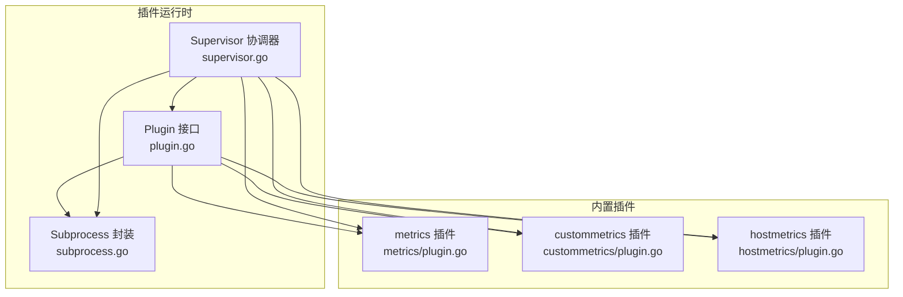
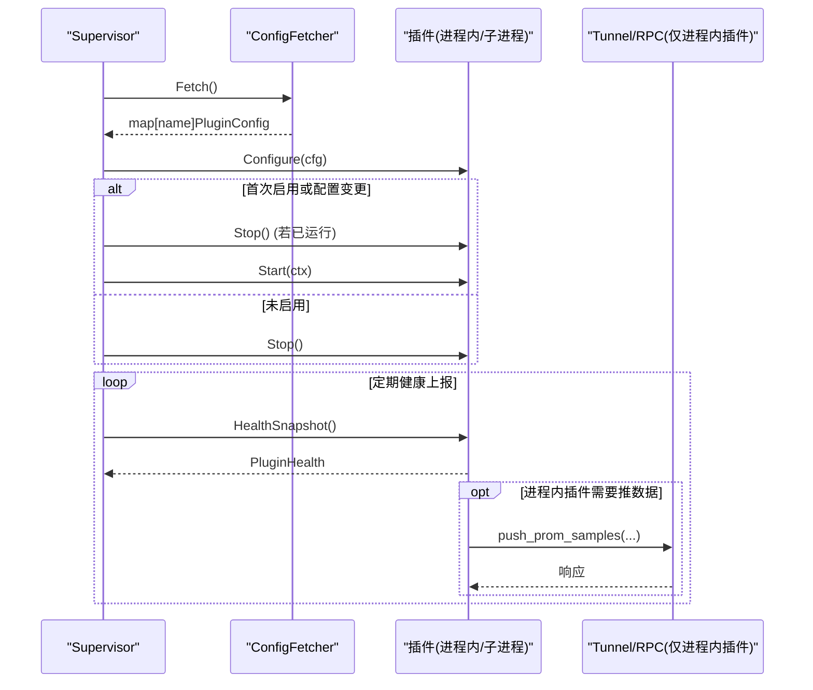
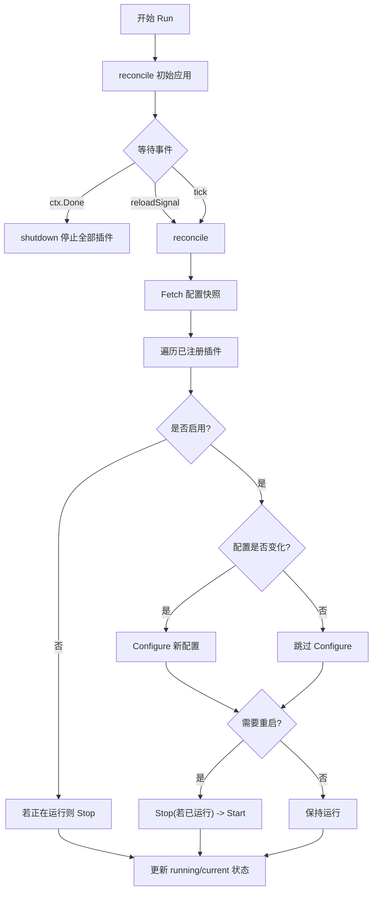
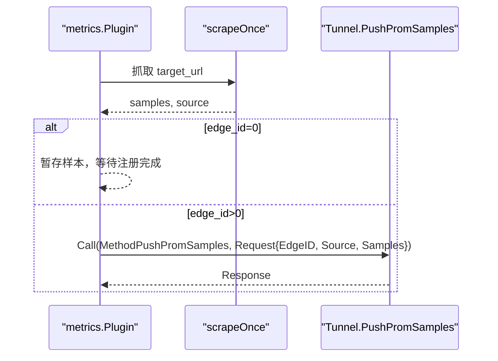
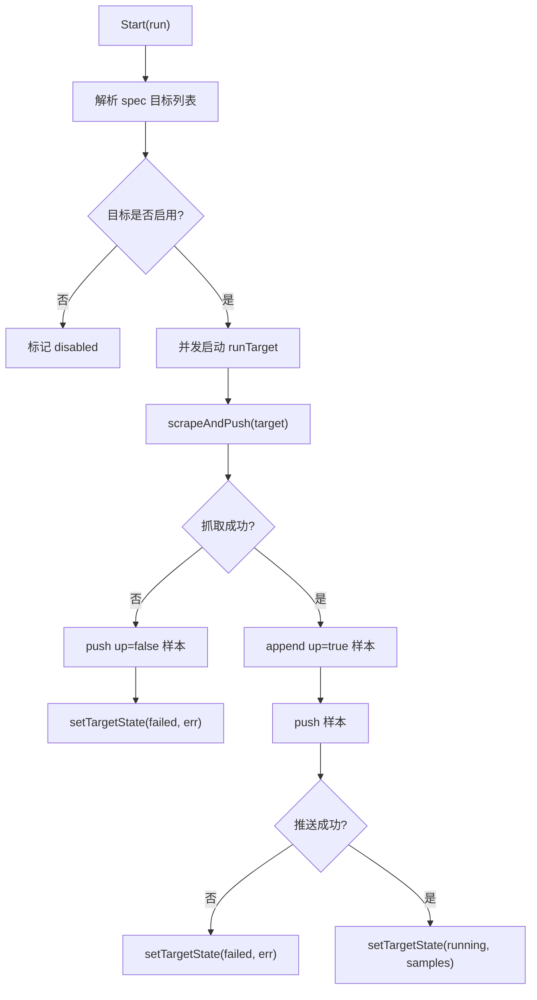
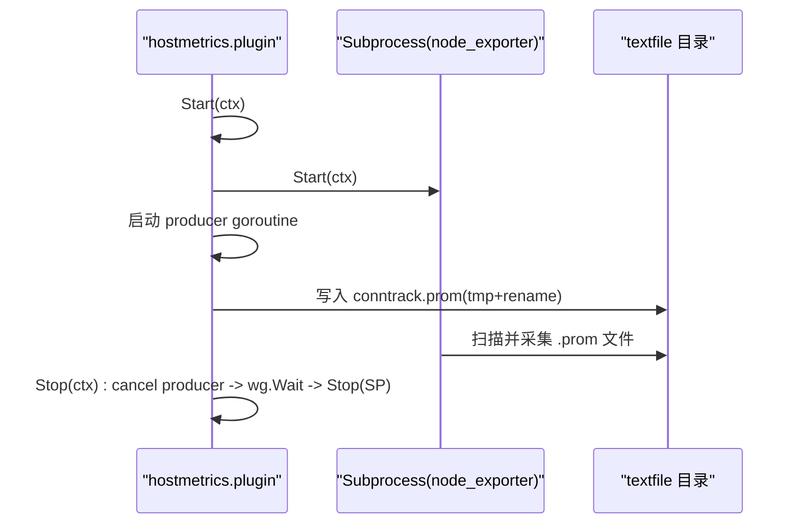
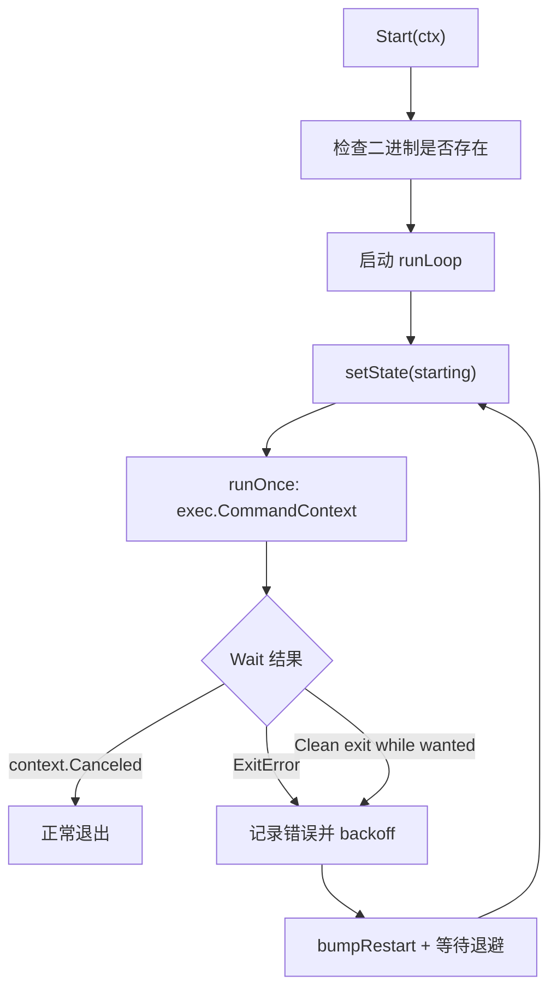
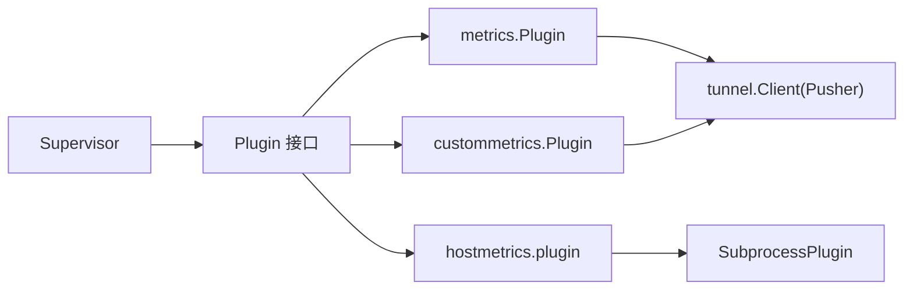

# 进程内插件实现

<cite>
**本文引用的文件**
- [internal/edgeagent/plugins/plugin.go](file://internal/edgeagent/plugins/plugin.go)
- [internal/edgeagent/plugins/subprocess.go](file://internal/edgeagent/plugins/subprocess.go)
- [internal/edgeagent/plugins/supervisor.go](file://internal/edgeagent/plugins/supervisor.go)
- [internal/edgeagent/plugins/metrics/plugin.go](file://internal/edgeagent/plugins/metrics/plugin.go)
- [internal/edgeagent/plugins/custommetrics/plugin.go](file://internal/edgeagent/plugins/custommetrics/plugin.go)
- [internal/edgeagent/plugins/hostmetrics/plugin.go](file://internal/edgeagent/plugins/hostmetrics/plugin.go)
</cite>

## 目录
1. [简介](#简介)
2. [项目结构](#项目结构)
3. [核心组件](#核心组件)
4. [架构总览](#架构总览)
5. [详细组件分析](#详细组件分析)
6. [依赖关系分析](#依赖关系分析)
7. [性能与资源特性](#性能与资源特性)
8. [故障排查指南](#故障排查指南)
9. [结论](#结论)

## 简介
本文件聚焦于 ongrid-edge 中的“进程内插件”机制，解释其工作原理、接口契约、生命周期管理、错误处理与资源清理策略，并结合内置的 metrics、custommetrics、hostmetrics 等插件给出实践示例与最佳实践。同时总结进程内插件的优势（高性能、内存共享）与限制（崩溃影响主进程），帮助读者在 ongrid-edge 中正确设计与扩展新的进程内插件。

## 项目结构
与进程内插件相关的代码集中在 internal/edgeagent/plugins 目录下：
- plugin.go：定义 Plugin 接口、配置与健康状态模型、配置拉取抽象
- subprocess.go：子进程插件通用封装（用于 logs/traces 等外部二进制）
- supervisor.go：插件注册、配置同步、启停编排与健康采集
- metrics/plugin.go：进程内指标抓取插件（通过隧道 RPC 推送）
- custommetrics/plugin.go：多目标自定义指标抓取插件（进程内）
- hostmetrics/plugin.go：基于 node_exporter 的子进程 + 进程内补充指标写入



图表来源
- [internal/edgeagent/plugins/plugin.go:18-52](file://internal/edgeagent/plugins/plugin.go#L18-L52)
- [internal/edgeagent/plugins/subprocess.go:17-50](file://internal/edgeagent/plugins/subprocess.go#L17-L50)
- [internal/edgeagent/plugins/supervisor.go:12-47](file://internal/edgeagent/plugins/supervisor.go#L12-L47)
- [internal/edgeagent/plugins/metrics/plugin.go:64-80](file://internal/edgeagent/plugins/metrics/plugin.go#L64-L80)
- [internal/edgeagent/plugins/custommetrics/plugin.go:31-43](file://internal/edgeagent/plugins/custommetrics/plugin.go#L31-L43)
- [internal/edgeagent/plugins/hostmetrics/plugin.go:95-105](file://internal/edgeagent/plugins/hostmetrics/plugin.go#L95-L105)

章节来源
- [internal/edgeagent/plugins/plugin.go:1-119](file://internal/edgeagent/plugins/plugin.go#L1-L119)
- [internal/edgeagent/plugins/subprocess.go:1-318](file://internal/edgeagent/plugins/subprocess.go#L1-L318)
- [internal/edgeagent/plugins/supervisor.go:1-276](file://internal/edgeagent/plugins/supervisor.go#L1-L276)
- [internal/edgeagent/plugins/metrics/plugin.go:1-306](file://internal/edgeagent/plugins/metrics/plugin.go#L1-L306)
- [internal/edgeagent/plugins/custommetrics/plugin.go:1-291](file://internal/edgeagent/plugins/custommetrics/plugin.go#L1-L291)
- [internal/edgeagent/plugins/hostmetrics/plugin.go:1-277](file://internal/edgeagent/plugins/hostmetrics/plugin.go#L1-L277)

## 核心组件
- Plugin 接口：统一描述插件能力与生命周期方法 Name()、Configure()、Start()、Stop()、HealthSnapshot()
- PluginConfig：插件配置载体，包含启用标志、EdgeID、Endpoint、鉴权信息与 Spec
- PluginHealth/TargetHealth：健康快照与多目标健康信息
- Supervisor：负责从 ConfigFetcher 获取配置并驱动各插件 Configure/Start/Stop，周期性收集 HealthSnapshot
- SubprocessPlugin：对外部子进程的统一封装（非进程内插件使用）

章节来源
- [internal/edgeagent/plugins/plugin.go:18-119](file://internal/edgeagent/plugins/plugin.go#L18-L119)
- [internal/edgeagent/plugins/supervisor.go:12-110](file://internal/edgeagent/plugins/supervisor.go#L12-L110)
- [internal/edgeagent/plugins/subprocess.go:17-102](file://internal/edgeagent/plugins/subprocess.go#L17-L102)

## 架构总览
Supervisor 作为插件运行时的协调者，周期性地从配置源拉取最新配置，对比当前期望与实际运行状态，按需调用插件的 Configure/Start/Stop。进程内插件以 goroutine 形式在 ongrid-edge 进程中运行；子进程插件通过 SubprocessPlugin 启动外部二进制，具备崩溃重启与指数退避策略。



图表来源
- [internal/edgeagent/plugins/supervisor.go:114-230](file://internal/edgeagent/plugins/supervisor.go#L114-L230)
- [internal/edgeagent/plugins/plugin.go:18-52](file://internal/edgeagent/plugins/plugin.go#L18-L52)
- [internal/edgeagent/plugins/metrics/plugin.go:214-282](file://internal/edgeagent/plugins/metrics/plugin.go#L214-L282)

## 详细组件分析

### Plugin 接口与生命周期
- Name()：返回 OTel 信号名（如 "metrics"/"logs"/"traces"），用作注册键与 UI 展示
- Configure(cfg)：接收 manager 下发的配置（或本地回退），可被多次调用以实现热重载；失败应使插件进入“crashed”以便可见
- Start(ctx)：启动工作（进程内为开启 goroutine；子进程为拉起外部二进制）。需幂等，支持 Stop 后再次 Start
- Stop(ctx)：优雅关闭（进程内取消上下文；子进程 SIGTERM + 超时保护）。未运行时应安全无操作
- HealthSnapshot()：返回当前健康快照，不得阻塞

```mermaid
classDiagram
class Plugin {
+Name() string
+Configure(cfg PluginConfig) error
+Start(ctx context.Context) error
+Stop(ctx context.Context) error
+HealthSnapshot() PluginHealth
}
class PluginConfig {
+bool Enabled
+uint64 EdgeID
+string Endpoint
+string AuthUser
+string AuthPass
+map[string]interface{} Spec
}
class PluginHealth {
+string Name
+PluginState State
+string LastError
+int RestartCount
+int PID
+time.Time StartedAt
+time.Time UpdatedAt
+[]TargetHealth Targets
}
class TargetHealth {
+string ID
+string Name
+string Kind
+string State
+string LastError
+int Samples
+time.Time LastSuccessAt
+time.Time UpdatedAt
}
Plugin --> PluginConfig : "使用"
Plugin --> PluginHealth : "返回"
PluginHealth --> TargetHealth : "包含"
```

图表来源
- [internal/edgeagent/plugins/plugin.go:18-106](file://internal/edgeagent/plugins/plugin.go#L18-L106)

章节来源
- [internal/edgeagent/plugins/plugin.go:18-106](file://internal/edgeagent/plugins/plugin.go#L18-L106)

### Supervisor 协调器
- 职责：注册插件、周期拉取配置、比较差异、按策略调用 Configure/Start/Stop、汇总健康
- 关键流程：
  - Run：初始 reconcile，之后每 tick 或收到 reload 信号时重新 reconcile
  - reconcile：对每个插件判断是否启用、配置是否变化、是否需要重启
  - shutdown：退出前停止所有插件（带超时）



图表来源
- [internal/edgeagent/plugins/supervisor.go:114-230](file://internal/edgeagent/plugins/supervisor.go#L114-L230)

章节来源
- [internal/edgeagent/plugins/supervisor.go:114-230](file://internal/edgeagent/plugins/supervisor.go#L114-L230)

### 进程内插件：metrics
- 定位：在 ongrid-edge 进程内运行，定时抓取本地 /metrics（默认 node_exporter），解析 Prometheus text 格式，通过隧道 RPC push_prom_samples 推送至 manager
- 设计要点：
  - 通过 Pusher 接口解耦隧道客户端，便于测试
  - EdgeIDProvider 延迟获取 edge_id，避免注册完成前的样本丢失
  - runLoop 立即执行一次抓取，随后按 interval 循环
  - scrapeAndPushOne 对单个目标进行抓取与推送，失败不中断其他目标
  - HealthSnapshot 聚合统计与最近错误，setState/bumpFailure 维护健康状态



图表来源
- [internal/edgeagent/plugins/metrics/plugin.go:184-282](file://internal/edgeagent/plugins/metrics/plugin.go#L184-L282)

章节来源
- [internal/edgeagent/plugins/metrics/plugin.go:64-102](file://internal/edgeagent/plugins/metrics/plugin.go#L64-L102)
- [internal/edgeagent/plugins/metrics/plugin.go:125-168](file://internal/edgeagent/plugins/metrics/plugin.go#L125-L168)
- [internal/edgeagent/plugins/metrics/plugin.go:184-282](file://internal/edgeagent/plugins/metrics/plugin.go#L184-L282)

### 进程内插件：custommetrics
- 定位：多目标自定义指标抓取插件，支持多个独立的 /metrics 目标，各自独立调度与状态
- 设计要点：
  - 每个目标并行运行，runTarget 内部 panic recover，确保单目标异常不影响整体
  - scrapeAndPush 在抓取失败时仍尝试推送 up=false 样本，成功时追加 up=true 样本
  - setTargetState 维护每个目标的样本数、最后成功时间与错误信息
  - HealthSnapshot 将 targets 列表序列化输出，供上层监控



图表来源
- [internal/edgeagent/plugins/custommetrics/plugin.go:135-211](file://internal/edgeagent/plugins/custommetrics/plugin.go#L135-L211)

章节来源
- [internal/edgeagent/plugins/custommetrics/plugin.go:31-63](file://internal/edgeagent/plugins/custommetrics/plugin.go#L31-L63)
- [internal/edgeagent/plugins/custommetrics/plugin.go:79-120](file://internal/edgeagent/plugins/custommetrics/plugin.go#L79-L120)
- [internal/edgeagent/plugins/custommetrics/plugin.go:135-211](file://internal/edgeagent/plugins/custommetrics/plugin.go#L135-L211)

### 混合模式插件：hostmetrics
- 定位：以子进程方式运行 node_exporter，同时在进程内运行一个补充指标生产者，向 textfile 目录写入 .prom 文件，由 node_exporter 自动采集
- 设计要点：
  - 通过 NewSubprocess 包装 node_exporter，Args 注入 --collector.textfile.directory
  - 进程内 producer 定期读取内核路径（如 nf_conntrack_*），原子写 tmp+rename 到 textfile 目录
  - Start/Stop 顺序保证先启动子进程，再启动 producer；Stop 先 cancel 并等待 producer，再 Stop 子进程



图表来源
- [internal/edgeagent/plugins/hostmetrics/plugin.go:62-148](file://internal/edgeagent/plugins/hostmetrics/plugin.go#L62-L148)
- [internal/edgeagent/plugins/hostmetrics/plugin.go:150-231](file://internal/edgeagent/plugins/hostmetrics/plugin.go#L150-L231)

章节来源
- [internal/edgeagent/plugins/hostmetrics/plugin.go:62-148](file://internal/edgeagent/plugins/hostmetrics/plugin.go#L62-L148)
- [internal/edgeagent/plugins/hostmetrics/plugin.go:150-231](file://internal/edgeagent/plugins/hostmetrics/plugin.go#L150-L231)

### 子进程插件通用封装：SubprocessPlugin
- 职责：统一管理外部二进制生命周期、崩溃重启（指数退避）、日志捕获、PID/StartedAt 记录
- 关键点：
  - Configure 渲染配置文件（可选）并持久化
  - Start 检查二进制存在性，启动 runLoop
  - runLoop 在 wantRunning 为真时持续拉起子进程，失败后指数退避重启
  - Stop 取消上下文并等待 runLoop 结束，带超时保护



图表来源
- [internal/edgeagent/plugins/subprocess.go:137-235](file://internal/edgeagent/plugins/subprocess.go#L137-L235)

章节来源
- [internal/edgeagent/plugins/subprocess.go:137-235](file://internal/edgeagent/plugins/subprocess.go#L137-L235)

## 依赖关系分析
- 进程内插件依赖：
  - metrics 与 custommetrics 均依赖 tunnel 客户端进行 push_prom_samples 调用
  - 两者都遵循 Plugin 接口并由 Supervisor 管理
- hostmetrics 依赖 SubprocessPlugin 与文件系统（textfile 目录）
- 所有插件共享 PluginConfig/PluginHealth/TargetHealth 数据结构



图表来源
- [internal/edgeagent/plugins/supervisor.go:12-47](file://internal/edgeagent/plugins/supervisor.go#L12-L47)
- [internal/edgeagent/plugins/metrics/plugin.go:54-62](file://internal/edgeagent/plugins/metrics/plugin.go#L54-L62)
- [internal/edgeagent/plugins/custommetrics/plugin.go:25-33](file://internal/edgeagent/plugins/custommetrics/plugin.go#L25-L33)
- [internal/edgeagent/plugins/hostmetrics/plugin.go:68-93](file://internal/edgeagent/plugins/hostmetrics/plugin.go#L68-L93)

章节来源
- [internal/edgeagent/plugins/supervisor.go:12-47](file://internal/edgeagent/plugins/supervisor.go#L12-L47)
- [internal/edgeagent/plugins/metrics/plugin.go:54-62](file://internal/edgeagent/plugins/metrics/plugin.go#L54-L62)
- [internal/edgeagent/plugins/custommetrics/plugin.go:25-33](file://internal/edgeagent/plugins/custommetrics/plugin.go#L25-L33)
- [internal/edgeagent/plugins/hostmetrics/plugin.go:68-93](file://internal/edgeagent/plugins/hostmetrics/plugin.go#L68-L93)

## 性能与资源特性
- 优势
  - 性能高：进程内插件无需跨进程通信开销，直接复用 ongrid-edge 进程内存与网络栈
  - 内存共享：可直接访问宿主进程资源（如全局缓存、连接池），减少序列化/反序列化成本
  - 简化部署：无需额外二进制管理与沙箱隔离，降低运维复杂度
- 限制
  - 稳定性风险：进程内插件 panic 或未恢复的错误可能导致主进程崩溃
  - 资源竞争：与主进程共享 CPU/内存/GC，需严格控制 goroutine 数量与内存占用
  - 升级隔离弱：无法像子进程那样通过重启外部二进制实现热替换

[本节为通用指导，不直接分析具体文件]

## 故障排查指南
- 常见症状与定位
  - 插件处于 crashed 状态：查看 HealthSnapshot 的 LastError 与 RestartCount，确认 Configure/Start 是否报错
  - 指标未上报：检查 metrics/custommetrics 的抓取日志与 push_prom_samples 调用结果
  - 子进程频繁重启：关注 SubprocessPlugin 的指数退避日志与退出码
- 建议步骤
  - 核对 PluginConfig.Spec 字段与默认值，确保 URL/Interval/Timeout 合理
  - 验证 EdgeIDProvider 返回值是否为 0（未注册完成会丢弃样本）
  - 对于 hostmetrics，确认 textfile 目录权限与内核路径可读
  - 使用 Supervisor 的 TriggerReload 触发配置热加载，观察 reconcile 日志

章节来源
- [internal/edgeagent/plugins/supervisor.go:138-230](file://internal/edgeagent/plugins/supervisor.go#L138-L230)
- [internal/edgeagent/plugins/metrics/plugin.go:214-282](file://internal/edgeagent/plugins/metrics/plugin.go#L214-L282)
- [internal/edgeagent/plugins/custommetrics/plugin.go:187-229](file://internal/edgeagent/plugins/custommetrics/plugin.go#L187-L229)
- [internal/edgeagent/plugins/hostmetrics/plugin.go:191-231](file://internal/edgeagent/plugins/hostmetrics/plugin.go#L191-L231)
- [internal/edgeagent/plugins/subprocess.go:197-235](file://internal/edgeagent/plugins/subprocess.go#L197-L235)

## 结论
进程内插件在 ongrid-edge 中以 goroutine 形式运行，具备高性能与低延迟优势，适合对实时性与吞吐要求较高的场景。实现时需严格遵循 Plugin 接口契约，妥善处理生命周期、错误与资源清理，并通过 Supervisor 进行统一编排。对于需要强隔离或复杂外部依赖的场景，可考虑子进程插件方案。结合 metrics、custommetrics、hostmetrics 的实现经验，可在保证稳定性的前提下快速扩展新的进程内插件能力。