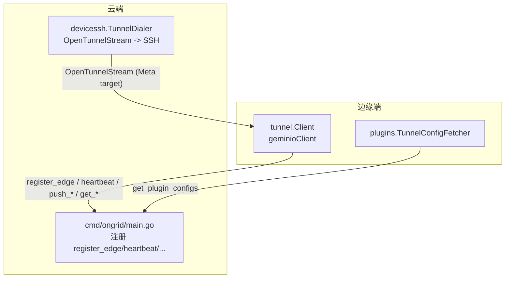
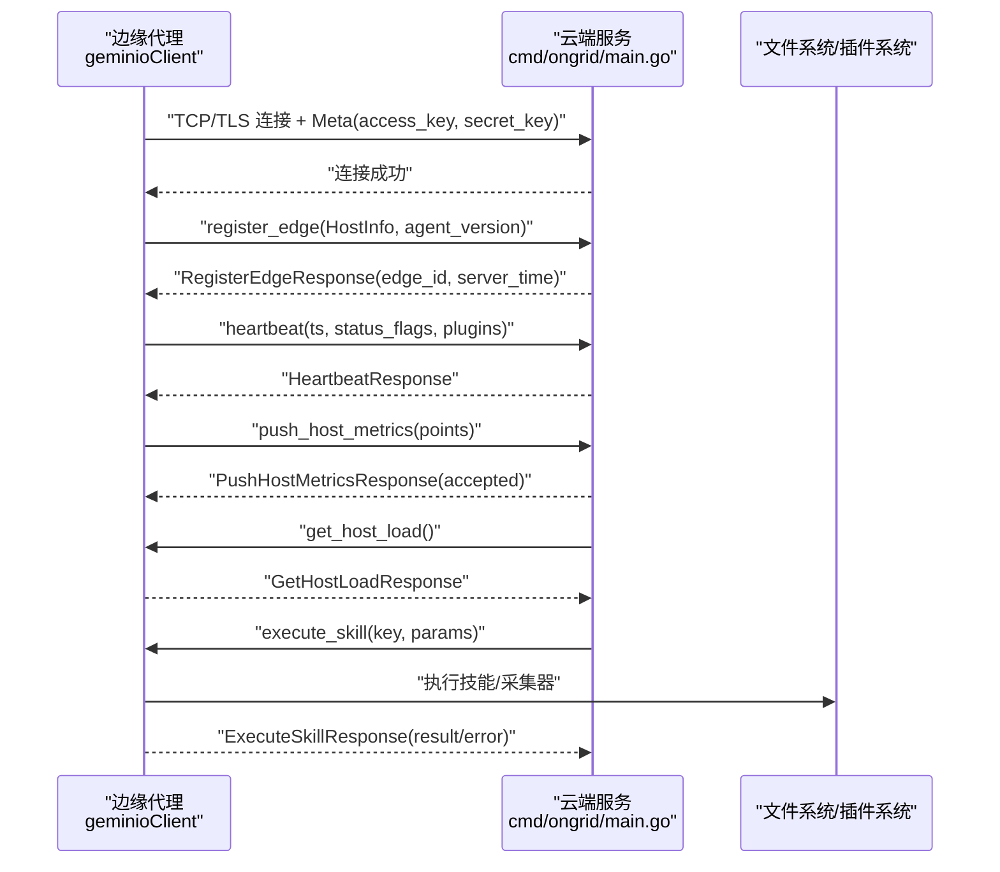
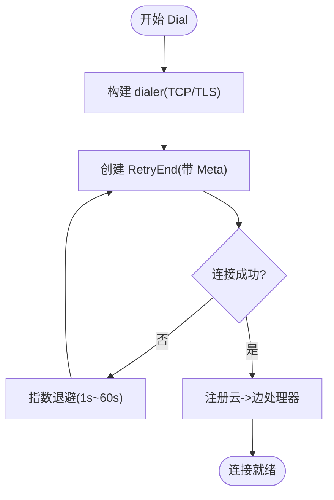
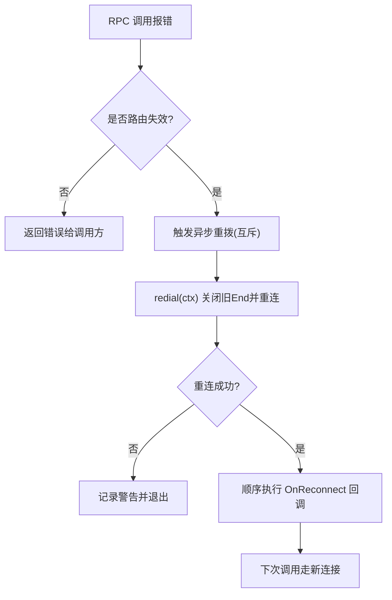
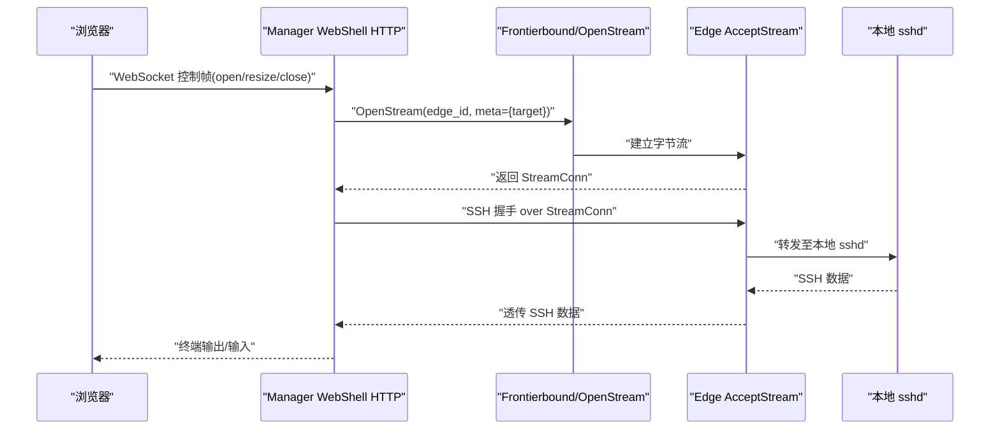
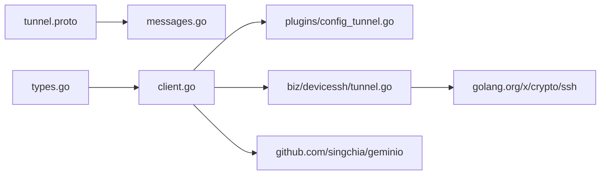

# Tunnel连接管理

<cite>
**本文引用的文件列表**
- [internal/pkg/tunnel/client.go](file://internal/pkg/tunnel/client.go)
- [internal/pkg/tunnel/types.go](file://internal/pkg/tunnel/types.go)
- [internal/pkg/tunnel/messages.go](file://internal/pkg/tunnel/messages.go)
- [api/tunnel/v1/tunnel.proto](file://api/tunnel/v1/tunnel.proto)
- [internal/edgeagent/plugins/config_tunnel.go](file://internal/edgeagent/plugins/config_tunnel.go)
- [internal/manager/biz/devicessh/tunnel.go](file://internal/manager/biz/devicessh/tunnel.go)
- [cmd/ongrid/main.go](file://cmd/ongrid/main.go)
</cite>

## 目录
1. [简介](#简介)
2. [项目结构](#项目结构)
3. [核心组件](#核心组件)
4. [架构总览](#架构总览)
5. [详细组件分析](#详细组件分析)
6. [依赖关系分析](#依赖关系分析)
7. [性能与可靠性](#性能与可靠性)
8. [故障排查指南](#故障排查指南)
9. [结论](#结论)
10. [附录：配置与示例](#附录配置与示例)

## 简介
本文件聚焦 OnGrid 的 Tunnel 连接管理，面向“边缘代理（Edge Agent）—云端管理器（Manager）”之间的双向长连接。文档覆盖以下要点：
- 连接建立过程、握手协议、认证流程与加密传输
- 连接池与重连策略、心跳检测、状态监控与网络异常处理
- 连接配置参数、超时设置与重试策略
- 典型调用序列与错误处理模式
- WebSSH 通过隧道转发到本地 sshd 的工作方式

说明：当前实现基于 geminio 的 TCP/TLS 长连接与 JSON 编解码，并非 WebSocket。WebShell 在浏览器侧使用 WebSocket 与 Manager 交互，再由 Manager 经隧道将 SSH 流量透传到 Edge 本地的 sshd。

## 项目结构
Tunnel 相关代码主要分布在如下位置：
- internal/pkg/tunnel：Tunnel 客户端抽象与实现、消息类型定义
- api/tunnel/v1/tunnel.proto：Tunnel 方法名与消息体形状（JSON wire）
- internal/edgeagent/plugins/config_tunnel.go：插件配置拉取（通过 Tunnel RPC）
- internal/manager/biz/devicessh/tunnel.go：Manager 侧通过隧道打开 SSH 会话
- cmd/ongrid/main.go：Manager 启动时注册 Tunnel 服务端处理器

图示来源
- [internal/pkg/tunnel/client.go:27-141](file://internal/pkg/tunnel/client.go#L27-L141)
- [internal/pkg/tunnel/messages.go:17-80](file://internal/pkg/tunnel/messages.go#L17-L80)
- [internal/edgeagent/plugins/config_tunnel.go:58-108](file://internal/edgeagent/plugins/config_tunnel.go#L58-L108)
- [internal/manager/biz/devicessh/tunnel.go:182-202](file://internal/manager/biz/devicessh/tunnel.go#L182-L202)
- [cmd/ongrid/main.go:1215-1220](file://cmd/ongrid/main.go#L1215-L1220)

章节来源
- [internal/pkg/tunnel/client.go:1-379](file://internal/pkg/tunnel/client.go#L1-L379)
- [internal/pkg/tunnel/types.go:1-120](file://internal/pkg/tunnel/types.go#L1-L120)
- [internal/pkg/tunnel/messages.go:1-514](file://internal/pkg/tunnel/messages.go#L1-L514)
- [api/tunnel/v1/tunnel.proto:1-166](file://api/tunnel/v1/tunnel.proto#L1-L166)
- [internal/edgeagent/plugins/config_tunnel.go:1-138](file://internal/edgeagent/plugins/config_tunnel.go#L1-L138)
- [internal/manager/biz/devicessh/tunnel.go:1-450](file://internal/manager/biz/devicessh/tunnel.go#L1-L450)
- [cmd/ongrid/main.go:1215-1220](file://cmd/ongrid/main.go#L1215-L1220)

## 核心组件
- tunnel.Client/geminioClient：边缘侧对 geminio 的封装，提供 Dial、RegisterHandler、Call、AcceptStream、OnReconnect、Close 等能力；内置指数退避重连与路由失效自动重拨。
- messages：以 Go 结构体镜像 proto 的 JSON 字段，定义所有 RPC 方法与请求/响应体。
- devicessh.TunnelDialer：Manager 侧通过 OpenTunnelStream 打开一条字节流，叠加 SSH 握手并创建 Session，用于交互式 Shell 或 SFTP。
- plugins.TunnelConfigFetcher：边缘侧通过 Tunnel RPC 获取插件配置，失败回退到环境变量快照。

章节来源
- [internal/pkg/tunnel/client.go:27-141](file://internal/pkg/tunnel/client.go#L27-L141)
- [internal/pkg/tunnel/messages.go:17-80](file://internal/pkg/tunnel/messages.go#L17-L80)
- [internal/manager/biz/devicessh/tunnel.go:46-81](file://internal/manager/biz/devicessh/tunnel.go#L46-L81)
- [internal/edgeagent/plugins/config_tunnel.go:22-52](file://internal/edgeagent/plugins/config_tunnel.go#L22-L52)

## 架构总览
Tunnel 采用“边缘主动拨号 + 云端注册处理器”的双向通道模型。边缘侧通过 AccessKey/SecretKey 在 Meta 中携带身份，云端在接入后校验并绑定 edge_id。后续所有业务数据均在该长连接上以 JSON 报文进行 RPC 调用。

图示来源
- [internal/pkg/tunnel/client.go:78-118](file://internal/pkg/tunnel/client.go#L78-L118)
- [internal/pkg/tunnel/messages.go:258-270](file://internal/pkg/tunnel/messages.go#L258-L270)
- [internal/pkg/tunnel/messages.go:280-320](file://internal/pkg/tunnel/messages.go#L280-L320)
- [internal/pkg/tunnel/messages.go:339-349](file://internal/pkg/tunnel/messages.go#L339-L349)
- [internal/pkg/tunnel/messages.go:383-401](file://internal/pkg/tunnel/messages.go#L383-L401)
- [internal/pkg/tunnel/messages.go:194-207](file://internal/pkg/tunnel/messages.go#L194-L207)
- [cmd/ongrid/main.go:1215-1220](file://cmd/ongrid/main.go#L1215-L1220)

## 详细组件分析

### 连接建立与握手协议
- 底层传输：TCP 或 TLS（可配置 CA 校验），MinVersion=TLS1.2。
- 握手元信息：每次（重）连接都会将 Meta{access_key, secret_key} 作为 opaque 字节传入，云端在接入阶段解析并调用 AuthFunc 完成鉴权。
- 首次注册：连接成功后，边缘立即发送 register_edge，云端返回 edge_id 与 server_time，供后续心跳与指标上报使用。
- 方法命名空间：所有 RPC 方法名由常量集中管理，避免拼写错误。

图示来源
- [internal/pkg/tunnel/client.go:144-176](file://internal/pkg/tunnel/client.go#L144-L176)
- [internal/pkg/tunnel/client.go:78-118](file://internal/pkg/tunnel/client.go#L78-L118)
- [internal/pkg/tunnel/messages.go:508-513](file://internal/pkg/tunnel/messages.go#L508-L513)

章节来源
- [internal/pkg/tunnel/client.go:66-141](file://internal/pkg/tunnel/client.go#L66-L141)
- [internal/pkg/tunnel/types.go:33-66](file://internal/pkg/tunnel/types.go#L33-L66)
- [internal/pkg/tunnel/messages.go:508-513](file://internal/pkg/tunnel/messages.go#L508-L513)

### 认证流程
- 认证凭据：AccessKey/SecretKey 随 Meta 在每次（重）连接时提交。
- 云端验证：云端在接入阶段调用 AuthFunc 校验凭据并生成 Session（包含 EdgeID）。
- 多租户预留：Session 目前仅含 EdgeID，未来可扩展 OrgID。

章节来源
- [internal/pkg/tunnel/types.go:26-31](file://internal/pkg/tunnel/types.go#L26-31)
- [internal/pkg/tunnel/messages.go:508-513](file://internal/pkg/tunnel/messages.go#L508-L513)

### 加密传输
- 可选 TLS：当配置 TLSCAFile/TLSCA 时，使用指定 CA 校验服务器证书，最小版本 TLS1.2。
- 未配置 TLS：走明文 TCP。

章节来源
- [internal/pkg/tunnel/client.go:144-176](file://internal/pkg/tunnel/client.go#L144-L176)

### 连接池管理与并发
- 单 End 模型：每个边缘进程维护一个 geminio.End（即一条长连接），通过原子指针安全切换。
- 无显式连接池：当前设计为每 Edge 一连接，适合大多数场景；若需水平扩展，可在上层按目标维度复用或分片。

章节来源
- [internal/pkg/tunnel/client.go:56-60](file://internal/pkg/tunnel/client.go#L56-L60)
- [internal/pkg/tunnel/types.go:68-106](file://internal/pkg/tunnel/types.go#L68-L106)

### 心跳检测与状态监控
- 心跳周期：proto 注释标注约 30s 一次 heartbeat，携带时间戳与可选状态位。
- 指标上报：push_host_metrics 周期性推送主机指标点集。
- 云端监听：Manager 注册 heartbeat/push_* 处理器，记录健康度与告警。

章节来源
- [api/tunnel/v1/tunnel.proto:63-73](file://api/tunnel/v1/tunnel.proto#L63-L73)
- [api/tunnel/v1/tunnel.proto:76-87](file://api/tunnel/v1/tunnel.proto#L76-L87)
- [internal/pkg/tunnel/messages.go:280-320](file://internal/pkg/tunnel/messages.go#L280-L320)
- [internal/pkg/tunnel/messages.go:339-349](file://internal/pkg/tunnel/messages.go#L339-L349)
- [cmd/ongrid/main.go:1215-1220](file://cmd/ongrid/main.go#L1215-L1220)

### 网络异常处理与自动重连
- 指数退避：Dial 失败按 1s→2s→… 增长，上限 60s。
- 路由失效恢复：当云端返回“not found/mismatch clientID”等错误时，认为前端路由表失效，触发异步重拨并在完成后回调 OnReconnect。
- 透明重连：底层 RetryEnd 负责 TCP 级断线重连；上层 Call 遇到特定错误会主动 kick reconnect。

图示来源
- [internal/pkg/tunnel/client.go:218-243](file://internal/pkg/tunnel/client.go#L218-L243)
- [internal/pkg/tunnel/client.go:258-301](file://internal/pkg/tunnel/client.go#L258-L301)
- [internal/pkg/tunnel/client.go:324-331](file://internal/pkg/tunnel/client.go#L324-L331)

章节来源
- [internal/pkg/tunnel/client.go:66-141](file://internal/pkg/tunnel/client.go#L66-L141)
- [internal/pkg/tunnel/client.go:218-301](file://internal/pkg/tunnel/client.go#L218-L301)
- [internal/pkg/tunnel/client.go:324-331](file://internal/pkg/tunnel/client.go#L324-L331)

### 双向流与 WebSSH 透传
- 流接口：AcceptStream 阻塞等待云端发起的 OpenStream，返回 StreamConn（net.Conn 风格），可用于透传任意字节流。
- WebSSH 路径：Manager 通过 OpenTunnelStream 打开一条到 Edge 的字节流，在其上叠加 SSH 握手，再创建 Session 驱动 PTY 或命令执行。
- Meta 目标：stream.Meta() 携带目标描述（如 host:ip:port），Edge 据此决定本地转发目标。

图示来源
- [internal/pkg/tunnel/types.go:81-95](file://internal/pkg/tunnel/types.go#L81-L95)
- [internal/manager/biz/devicessh/tunnel.go:182-202](file://internal/manager/biz/devicessh/tunnel.go#L182-L202)
- [internal/manager/biz/devicessh/tunnel.go:235-276](file://internal/manager/biz/devicessh/tunnel.go#L235-L276)

章节来源
- [internal/pkg/tunnel/types.go:81-95](file://internal/pkg/tunnel/types.go#L81-L95)
- [internal/manager/biz/devicessh/tunnel.go:46-81](file://internal/manager/biz/devicessh/tunnel.go#L46-L81)
- [internal/manager/biz/devicessh/tunnel.go:182-202](file://internal/manager/biz/devicessh/tunnel.go#L182-L202)

### 插件配置拉取与容错
- 主路径：通过 Tunnel RPC get_plugin_configs 拉取最新配置。
- 回退路径：当 Tunnel 不可用时，回退到环境变量快照，保证插件至少能按上次已知配置运行。

章节来源
- [internal/edgeagent/plugins/config_tunnel.go:58-108](file://internal/edgeagent/plugins/config_tunnel.go#L58-L108)

## 依赖关系分析
- 内部依赖
  - internal/pkg/tunnel 被 edgeagent/plugins 与 manager 的 devicessh 模块间接使用（前者直接依赖 Client，后者通过 Frontierbound/OpenStream 间接使用）。
  - api/tunnel/v1/tunnel.proto 定义了消息形状，Go 侧以 messages.go 手工镜像以保持包间解耦。
- 外部依赖
  - github.com/singchia/geminio：提供 End/RetryEnd/Stream 等基础能力。
  - golang.org/x/crypto/ssh：Manager 侧在隧道上叠加 SSH 握手。

图示来源
- [api/tunnel/v1/tunnel.proto:1-166](file://api/tunnel/v1/tunnel.proto#L1-L166)
- [internal/pkg/tunnel/messages.go:1-14](file://internal/pkg/tunnel/messages.go#L1-L14)
- [internal/pkg/tunnel/types.go:1-120](file://internal/pkg/tunnel/types.go#L1-L120)
- [internal/pkg/tunnel/client.go:1-21](file://internal/pkg/tunnel/client.go#L1-L21)
- [internal/edgeagent/plugins/config_tunnel.go:1-10](file://internal/edgeagent/plugins/config_tunnel.go#L1-L10)
- [internal/manager/biz/devicessh/tunnel.go:1-16](file://internal/manager/biz/devicessh/tunnel.go#L1-L16)

章节来源
- [internal/pkg/tunnel/client.go:1-21](file://internal/pkg/tunnel/client.go#L1-L21)
- [internal/manager/biz/devicessh/tunnel.go:1-16](file://internal/manager/biz/devicessh/tunnel.go#L1-L16)

## 性能与可靠性
- 连接建立
  - 指数退避：1s 起步，最大 60s，避免雪崩。
  - TLS 握手开销：建议启用 TLS 并复用连接，减少重复握手。
- 心跳与指标
  - 心跳间隔约 30s，指标批量上报，降低带宽与 CPU 占用。
- 重连与幂等
  - 路由失效自动重拨，OnReconnect 回调顺序执行且受保护，避免死锁。
- 流式透传
  - WebSSH 通过单一长连接承载大量小帧，注意背压与超时控制。

[本节为通用指导，不直接分析具体文件]

## 故障排查指南
- 无法建立连接
  - 检查 ServerAddr/CloudAddr 与防火墙策略。
  - 若启用 TLS，确认 TLSCAFile/TLSCA 指向有效 CA。
  - 查看日志中的 “dial failed; will retry” 与 backoff 值。
- 认证失败
  - 确认 AccessKey/SecretKey 正确且在云端已登记。
  - 关注 “marshal meta” 与 “read tls ca” 等错误。
- 路由失效导致间歇性失败
  - 观察 “broker reports route invalidation; reconnecting” 日志，确认 OnReconnect 回调是否执行。
- WebSSH 无法登录
  - 确认设备已绑定 Edge，且 Edge 本地 sshd 可达。
  - 检查 OpenTunnelStream 的 Meta target 是否正确。

章节来源
- [internal/pkg/tunnel/client.go:121-141](file://internal/pkg/tunnel/client.go#L121-L141)
- [internal/pkg/tunnel/client.go:272-287](file://internal/pkg/tunnel/client.go#L272-L287)
- [internal/manager/biz/devicessh/tunnel.go:182-202](file://internal/manager/biz/devicessh/tunnel.go#L182-L202)

## 结论
OnGrid 的 Tunnel 以轻量 JSON RPC 建立在稳定的 TCP/TLS 长连接之上，配合指数退避与路由失效感知，实现了高可用的边缘-云端通信。结合 WebSSH 的流式透传与插件配置的动态拉取，形成了从运维到观测的一体化通道。建议在部署中开启 TLS、合理设置心跳与指标频率，并通过 OnReconnect 回调确保重连后的状态一致性。

[本节为总结，不直接分析具体文件]

## 附录：配置与示例

### 连接配置参数（边缘侧）
- ServerAddr/CloudAddr：云端隧道地址（二选一，ServerAddr 优先）
- AccessKey/SecretKey：认证凭据
- TLSCAFile/TLSCA：CA 证书路径（二选一，TLSCAFile 优先）
- Log：可选日志对象

章节来源
- [internal/pkg/tunnel/types.go:33-66](file://internal/pkg/tunnel/types.go#L33-L66)

### 超时与重试策略
- Dial 初始重连：指数退避，1s 起步，上限 60s
- 路由失效重拨：独立上下文，最长 90s
- SSH 握手与连接超时：默认 10s（可通过 SSHTimeout 注入）

章节来源
- [internal/pkg/tunnel/client.go:86-141](file://internal/pkg/tunnel/client.go#L86-L141)
- [internal/pkg/tunnel/client.go:278-287](file://internal/pkg/tunnel/client.go#L278-L287)
- [internal/manager/biz/devicessh/tunnel.go:68-81](file://internal/manager/biz/devicessh/tunnel.go#L68-L81)

### 典型调用示例（以路径代替代码）
- 建立连接并注册处理器
  - [internal/pkg/tunnel/client.go:27-118](file://internal/pkg/tunnel/client.go#L27-L118)
- 调用云端 RPC（如 get_host_load）
  - [internal/pkg/tunnel/client.go:218-243](file://internal/pkg/tunnel/client.go#L218-L243)
- 接收云端流（WebSSH）
  - [internal/pkg/tunnel/types.go:81-95](file://internal/pkg/tunnel/types.go#L81-L95)
- 插件配置拉取（失败回退）
  - [internal/edgeagent/plugins/config_tunnel.go:58-108](file://internal/edgeagent/plugins/config_tunnel.go#L58-L108)
- Manager 侧通过隧道打开 SSH
  - [internal/manager/biz/devicessh/tunnel.go:182-202](file://internal/manager/biz/devicessh/tunnel.go#L182-L202)

### 错误处理模式
- 连接层错误：包装为 “tunnel call ...” 并可能触发重拨
- 远程错误：包装为 “remote: ...”，同样可能触发重拨
- 回调保护：OnReconnect 回调 panic 会被捕获，不影响下一次重连

章节来源
- [internal/pkg/tunnel/client.go:218-243](file://internal/pkg/tunnel/client.go#L218-L243)
- [internal/pkg/tunnel/client.go:303-322](file://internal/pkg/tunnel/client.go#L303-L322)